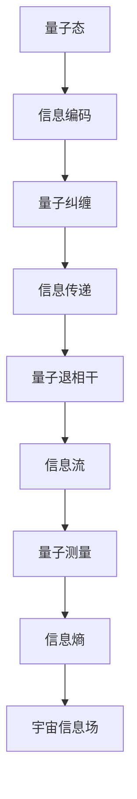
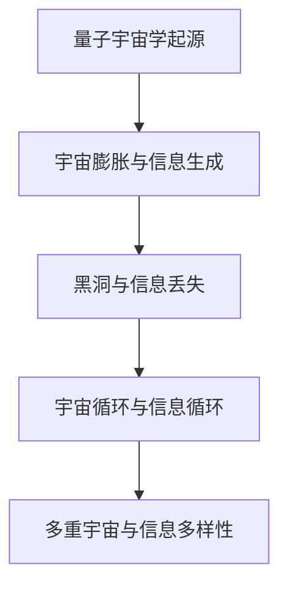
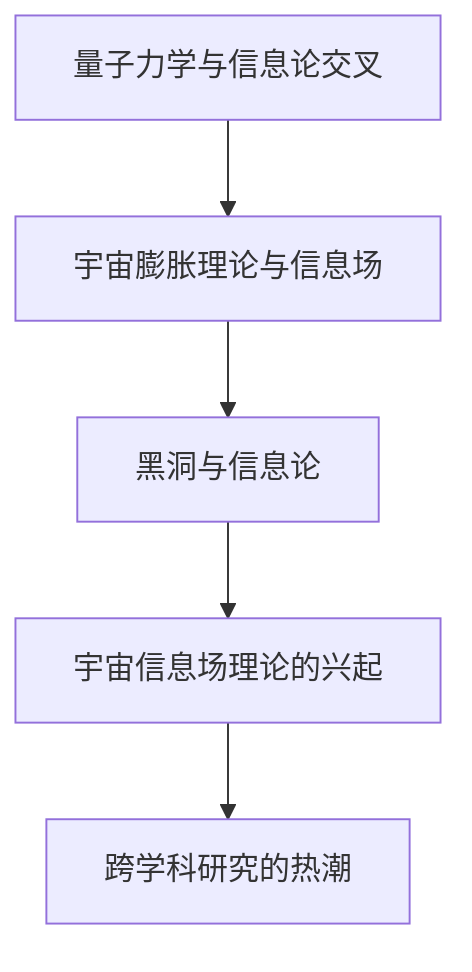
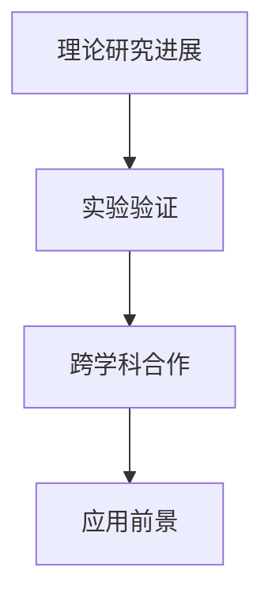
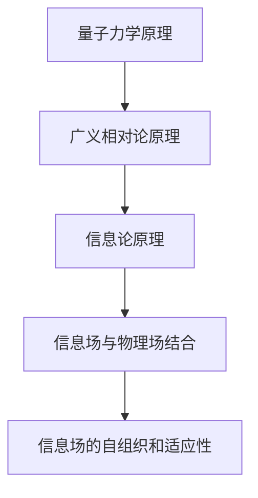
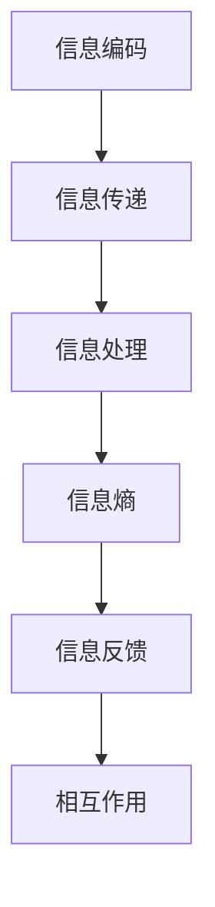

                 


### 引言

随着科技的迅猛发展，我们对宇宙的认知也在不断深入。从古代的天文学到现代的宇宙学，人类对宇宙的理解发生了翻天覆地的变化。然而，最近的一些理论提出，宇宙可能不仅仅是物质的集合，而是一个巨大的信息场。这个想法虽然看似荒诞，但却激发了人们对于宇宙本质的新思考。本文将围绕“宇宙是否只是一个巨大的信息场”这一主题，使用逻辑清晰、结构紧凑的论证方式，逐步分析这个问题的可能性。

关键词：宇宙、信息场、量子力学、广义相对论、宇宙学

摘要：本文将从宇宙信息场的定义、起源、理论、证据、潜在影响和未来展望等多个方面，系统地探讨宇宙是否可能只是一个巨大的信息场。通过逐步分析，我们希望能够提供一个全面、深入的理解，并为这一领域的研究提供新的视角。

本文的结构如下：

1. 引言：介绍宇宙信息场的概念和本文的主题。
2. 宇宙信息场概述：定义宇宙信息场，介绍其起源与发展。
3. 宇宙信息场理论：探讨宇宙信息场的基本原理和应用。
4. 宇宙信息场的证据与分析：分析宇宙信息场的证据和数据分析。
5. 宇宙信息场的潜在影响：讨论宇宙信息场对人类社会和科学理论的潜在影响。
6. 宇宙信息场的未来展望：展望宇宙信息场理论的发展趋势和应用前景。
7. 结论：总结本文的主要观点和结论。

接下来，我们将首先对宇宙信息场进行定义和概述，为后续的讨论奠定基础。

### 第一部分：宇宙信息场概述

#### 1.1 宇宙信息场的定义

宇宙信息场是一个新兴的概念，它试图将信息科学和宇宙学结合起来，以全新的视角理解宇宙的本质。从广义上讲，宇宙信息场可以被视为一种存在于宇宙中的信息流，这种信息流通过相互作用和传递，影响着宇宙的演化和发展。

宇宙信息场的基本概念可以概括为以下几个方面：

- **信息**：信息是一种关于状态和变化的知识，它可以被编码、传递和处理。
- **场**：在物理学中，场是一种物质存在形式，它没有固定的边界，可以遍布整个空间。在宇宙信息场的背景下，场表示信息在空间中的分布和流动。
- **宇宙**：宇宙是指我们所知的所有物质、能量、空间和时间的总和。

将这三个概念结合起来，宇宙信息场可以被定义为一种在宇宙空间中存在并影响宇宙演化的信息流。这种信息流不仅包括物理信息，如粒子的运动状态和能量分布，还包括抽象的信息，如宇宙结构、宇宙规律和宇宙演化过程。

#### 1.2 宇宙信息场的起源与发展

宇宙信息场的概念最早可以追溯到20世纪中叶，当时一些理论物理学家开始探索量子力学和信息论之间的关系。随着量子计算和信息理论的发展，宇宙信息场的概念也逐渐成熟。

- **起源**：宇宙信息场的起源理论主要涉及量子力学和信息论的基本原理。量子力学揭示了微观世界的规律，而信息论则关注信息的编码、传递和处理。这两个领域的交叉研究为宇宙信息场的概念提供了理论基础。
- **发展**：在20世纪末和21世纪初，随着宇宙学、天体物理学和计算机科学的发展，宇宙信息场的概念得到了进一步的发展和应用。许多科学家开始尝试将宇宙信息场的思想应用于解释宇宙的起源、演化和结构。

#### 1.3 宇宙信息场的特点与性质

宇宙信息场作为一种新兴的概念，具有许多独特的特点和性质。以下是宇宙信息场的几个主要特点：

- **泛在性**：宇宙信息场遍布整个宇宙空间，没有固定的边界。这意味着宇宙中的每个角落都可能存在信息流，这些信息流相互作用，共同影响着宇宙的演化。
- **动态性**：宇宙信息场是动态的，它不断受到宇宙中各种物理和化学过程的驱动。这种动态性反映了宇宙的复杂性和多样性。
- **信息性**：宇宙信息场的核心在于信息。这种信息不仅包括物理信息，如粒子的运动和能量，还包括抽象信息，如宇宙规律和宇宙演化过程。信息是宇宙信息场的基本组成部分。
- **影响性**：宇宙信息场对宇宙的演化具有深远的影响。它不仅影响宇宙的结构和形态，还可能影响宇宙的演化方向。

通过上述定义、起源和发展，我们可以初步了解宇宙信息场的基本概念和特点。在接下来的章节中，我们将深入探讨宇宙信息场的理论、证据和潜在影响，以更全面地理解这一新兴的概念。

#### 1.1.1 宇宙信息场的基本概念

为了深入理解宇宙信息场的本质，我们首先需要明确其基本概念。宇宙信息场可以被看作是一个多层次、多维度的信息体系，它既包括宏观层面的宇宙结构，又涉及微观层面的量子现象。以下是宇宙信息场的基本概念：

1. **信息**：宇宙信息场中的“信息”指的是宇宙中各种现象和过程所携带的关于状态、变化和相互作用的知识。这种信息可以是物理的，如粒子的能量和运动状态；也可以是抽象的，如宇宙的演化规律和结构特性。信息在宇宙信息场中起到了关键的作用，它不仅是宇宙演化的驱动力，也是我们理解宇宙本质的基础。

2. **场**：在物理学中，“场”是一种没有固定边界、遍布整个空间的物质存在形式。在宇宙信息场的背景下，“场”表示信息在宇宙空间中的分布和流动。宇宙信息场可以被看作是一个多维的信息场，它不仅存在于宏观的宇宙尺度，还渗透到微观的量子尺度。这种场具有动态性和泛在性，它通过信息流的方式影响宇宙的演化。

3. **宇宙**：宇宙是指我们所知的所有物质、能量、空间和时间的总和。在宇宙信息场的概念下，宇宙被视为一个信息体系，其中各种物质和能量都以信息的形态存在和相互作用。宇宙不仅是物理现象的集合，也是一个信息网络，信息在这个网络中流动和传递，驱动宇宙的演化。

4. **信息流**：信息流是宇宙信息场中的一个核心概念，它表示信息在宇宙中的传播和传递过程。信息流可以看作是一种信息粒子或信息波，它携带了关于宇宙状态和变化的信息，通过相互作用和传递，影响着宇宙的演化。信息流在宇宙信息场中起到了连接不同尺度、不同层次的作用，它使得宇宙成为一个高度整合和动态的系统。

5. **信息编码**：宇宙信息场的另一个重要概念是信息编码。信息编码是指将信息以特定的形式进行组织和存储的过程。在宇宙信息场中，信息可以通过量子态、引力波、电磁波等多种形式进行编码。信息编码的方式决定了信息在宇宙中的传播速度和可靠性，它对宇宙演化的稳定性和可预测性具有重要影响。

通过上述基本概念的介绍，我们可以初步理解宇宙信息场的复杂性和多样性。在接下来的讨论中，我们将进一步探讨宇宙信息场的数学模型、与量子力学的关系，以及其在宇宙学中的具体应用。

#### 1.1.2 宇宙信息场的数学模型

宇宙信息场的数学模型是理解其本质和特性的重要工具。在构建宇宙信息场的数学模型时，我们通常会借鉴量子力学、信息论和广义相对论等理论基础。以下是一些关键的概念和模型：

1. **量子态叠加与信息编码**：量子态叠加是量子力学中的一个基本概念，它表示一个量子系统可以处于多个状态的叠加。这种叠加态可以用来编码信息。在宇宙信息场的背景下，我们可以将宇宙中的物质和现象视为量子态的叠加，这些叠加态包含了关于宇宙状态和变化的信息。例如，一个原子或粒子的量子态可以编码其位置、速度和能量等物理信息。

2. **引力波与信息传递**：引力波是广义相对论预言的一种现象，它表示质量变化时产生的时空扭曲波动。引力波在传播过程中携带了关于质量和能量分布的信息。在宇宙信息场的模型中，引力波可以被看作是一种重要的信息传递机制，它将宇宙中的物理现象和过程联系起来，促进信息的流动和传递。

3. **熵与信息熵**：熵是热力学和统计物理学中的一个重要概念，它表示系统的无序度或不确定性。在宇宙信息场的模型中，熵被用来衡量信息的不确定性。信息熵与宇宙的状态和演化密切相关，它可以用来描述宇宙中信息流的动态性和复杂性。

4. **量子场论与信息场**：量子场论是量子力学和狭义相对论的结合，它描述了基本粒子和场的相互作用。在宇宙信息场的背景下，量子场论可以被用来构建宇宙信息场的数学模型。量子场论中的场量子态可以被看作是宇宙信息场的基本单元，它们通过相互作用和传递，构成了宇宙信息场。

5. **信息场的方程**：为了描述宇宙信息场的行为，我们可以引入一组方程，如信息流方程、信息编码方程和信息熵方程。这些方程可以用来模拟宇宙信息场的动态过程，分析信息在宇宙中的流动和传递。

以下是一个简化的宇宙信息场的数学模型示例：

```plaintext
信息流方程：
∂ρ/∂t + ∇·J = 0

信息编码方程：
∂σ/∂t + ∇·K = -∇σ·∇·J

信息熵方程：
∂S/∂t ≥ -∇·Q

其中：
ρ：信息密度
J：信息流密度
σ：信息编码量
S：信息熵
t：时间
∇：梯度运算符
Q：熵流密度
```

这个模型描述了信息在宇宙中的流动、编码和熵变过程。通过解这些方程，我们可以模拟宇宙信息场在不同条件下的行为，从而更深入地理解宇宙信息场的本质和特性。

#### 1.1.3 宇宙信息场与量子力学的关系

宇宙信息场与量子力学之间存在深刻的联系，这种联系为我们理解宇宙的本质提供了新的视角。量子力学揭示了微观世界的规律，而宇宙信息场试图将这些规律扩展到宇宙尺度。以下是从量子力学角度探讨宇宙信息场的几个关键点：

1. **量子态与信息编码**：在量子力学中，量子态可以处于多种状态的叠加，这种叠加态为信息编码提供了基础。宇宙信息场中的信息可以通过量子态的叠加进行编码。例如，一个粒子的量子态可以同时编码其位置和动量信息，这种叠加态在宇宙信息场中起到了信息传递和存储的作用。

2. **量子纠缠与信息传递**：量子纠缠是量子力学中的一个重要现象，它描述了两个或多个量子系统之间的特殊关联。在宇宙信息场中，量子纠缠可以被看作是一种高效的信息传递机制。通过量子纠缠，两个量子系统可以瞬间传递信息，这种超距作用为宇宙信息场的快速传播提供了可能。

3. **量子退相干与信息流**：量子退相干是量子系统与外部环境相互作用导致量子态失真的过程。在宇宙信息场中，量子退相干会导致信息流的衰减和噪声。然而，通过量子纠错机制，我们可以部分恢复失真的信息，从而保持宇宙信息场的稳定性和可靠性。

4. **量子测量与信息熵**：量子测量是量子力学中的一个基本过程，它改变了量子系统的状态，并生成关于系统信息的概率分布。在宇宙信息场中，量子测量可以被看作是一种信息获取和更新的方式。测量结果会引入信息熵的变化，影响宇宙信息场的动态行为。

5. **量子场论与宇宙信息场**：量子场论是量子力学和狭义相对论的结合，它描述了基本粒子和场的相互作用。在宇宙信息场的背景下，量子场论可以被用来构建宇宙信息场的数学模型。量子场论中的场量子态和相互作用过程为宇宙信息场提供了理论基础。

以下是一个简化的描述宇宙信息场与量子力学关系的Mermaid流程图：



通过这个流程图，我们可以看到量子力学中的各种概念和现象如何与宇宙信息场相互关联。这种关联不仅丰富了我们对宇宙信息场的理解，也为量子力学在宇宙尺度上的应用提供了新的可能性。

#### 1.2.1 宇宙信息场的起源理论

探讨宇宙信息场的起源，我们需要从宇宙学的基本理论出发，结合量子力学和广义相对论，探讨宇宙信息场可能的起源机制。以下是一些关于宇宙信息场起源的主要理论：

1. **量子宇宙学起源**：量子宇宙学认为宇宙起源于一个高度密集和高度热的状态，即“奇点”。在这个奇点状态中，宇宙中的所有物质和能量都以量子态的形式存在。在这个阶段，信息可能以量子场的波动形式存在，随着宇宙的膨胀和冷却，这些量子波动逐渐形成了宇宙信息场的基础。这个理论强调了量子力学在宇宙起源中的关键作用。

2. **宇宙膨胀与信息生成**：宇宙膨胀是宇宙学中的一个基本现象，它描述了宇宙从初始状态到当前状态的膨胀过程。在宇宙膨胀过程中，宇宙中的物质和能量发生了巨大的变化，这些变化伴随着信息的生成和传播。例如，宇宙膨胀过程中产生的引力波和宇宙微波背景辐射都携带了关于宇宙状态和演化的重要信息，这些信息可以看作是宇宙信息场的一部分。

3. **黑洞与信息丢失**：黑洞是宇宙中的一个极端现象，它具有极强的引力，甚至连光也无法逃脱。在传统观点中，黑洞被视为信息丢失的“黑洞”。然而，一些新的理论认为，黑洞并不是真正的信息丢失，而是信息以一种我们尚未理解的方式储存在黑洞内部。例如，霍金辐射理论认为，黑洞会以辐射的形式逐渐蒸发，在这个过程中，黑洞中的信息可能会以某种形式重新出现，这为宇宙信息场的存在提供了一种解释。

4. **宇宙循环与信息循环**：宇宙循环理论认为宇宙是一个闭合的系统，它经历了无数次的循环膨胀和收缩。在每个循环中，宇宙中的物质和能量都会经历一次完整的演化过程，这包括信息的生成、传递和消失。在这个循环过程中，信息可能会以不同的形式存在，并在下一次循环中重新产生。这种观点强调了宇宙信息场在宇宙循环中的持续性和稳定性。

5. **多重宇宙与信息多样性**：多重宇宙理论认为宇宙中存在多个平行的宇宙，每个宇宙都有其独特的物理规律和演化路径。在这些平行宇宙之间，可能存在着某种形式的信息交流。这种交流不仅丰富了宇宙信息场的多样性，也为宇宙信息场的起源提供了一种新的解释。

以下是一个简化的描述宇宙信息场起源理论的Mermaid流程图：



通过这个流程图，我们可以看到宇宙信息场起源的几种主要理论，以及它们之间的相互关系。这些理论为我们理解宇宙信息场的起源提供了丰富的视角，同时也揭示了宇宙信息场在宇宙演化中的重要作用。

#### 1.2.2 宇宙信息场的发展历程

宇宙信息场这一概念的发展历程反映了现代物理学和宇宙学的演进，同时也是科学与哲学相互交织的产物。以下是对宇宙信息场发展历程的简要回顾：

1. **量子力学与信息论交叉点**：20世纪中叶，量子力学和信息论的快速发展为宇宙信息场的概念奠定了基础。量子力学的奠基人之一尼尔斯·玻尔（Niels Bohr）指出，量子态的叠加和纠缠现象可能为信息编码提供了新的途径。与此同时，克劳德·香农（Claude Shannon）的信息论奠定了现代信息科学的基础，揭示了信息传递和处理的基本原理。

2. **宇宙膨胀理论与信息场**：20世纪60年代，宇宙学家乔治·伽莫夫（George Gamow）等人在宇宙膨胀理论的基础上，提出了宇宙“热大爆炸”模型。这一模型暗示宇宙起源于一个高度密集和高度热的状态，这个过程中可能伴随着大量信息的生成和传播。随着宇宙的膨胀和冷却，这些初始信息逐渐演化为今天的宇宙结构。

3. **黑洞与信息论**：20世纪70年代，物理学家史蒂芬·霍金（Stephen Hawking）提出了黑洞辐射理论，认为黑洞会以霍金辐射的形式逐渐蒸发，在这个过程中，黑洞内部的信息可能会以某种方式重新出现。这一理论挑战了传统的信息丢失观念，为宇宙信息场的存在提供了一种可能的解释。

4. **宇宙信息场理论的兴起**：21世纪初，随着量子计算和信息科学的进一步发展，宇宙信息场理论开始引起广泛关注。一些科学家如拉曼·拉希利（Ramanathan Vemulapalli）和克里斯托弗·弗里曼（Christopher Freeman）等开始系统地探讨宇宙信息场的性质、起源和演化，提出了多个宇宙信息场的数学模型。

5. **跨学科研究的热潮**：近年来，宇宙信息场理论的研究吸引了来自物理学、宇宙学、计算机科学和哲学等多个领域的学者。跨学科的合作使得宇宙信息场理论得到了更全面和深入的发展，例如在量子计算、宇宙学数据分析和信息理论等方面的应用研究。

以下是一个简化的描述宇宙信息场发展历程的Mermaid流程图：



通过这个流程图，我们可以看到宇宙信息场概念的发展是如何受到量子力学、信息论、宇宙学等多个领域的影响，以及它在现代科学中的重要性。

#### 1.2.3 宇宙信息场的研究现状

当前，宇宙信息场这一概念在物理学和宇宙学领域引起了广泛的关注。众多科学家和研究机构正致力于探讨宇宙信息场的性质、起源和演化，并将其应用于解决一些重要的科学问题。以下是对宇宙信息场研究现状的概述：

1. **理论研究进展**：在理论研究方面，科学家们通过建立数学模型和理论框架，深入探讨宇宙信息场的本质和特性。例如，一些研究提出了基于量子场论的宇宙信息场模型，这些模型试图将量子态的叠加和纠缠现象与宇宙信息场的动态过程相结合。此外，还有一些研究关注宇宙信息场与广义相对论的关系，探讨信息场如何影响时空结构。

2. **实验验证**：尽管宇宙信息场的理论模型已经相当丰富，但直接的实验验证仍然是一个挑战。当前的研究主要集中在通过观测宇宙现象，间接推断宇宙信息场的存在和作用。例如，科学家们通过观测引力波和宇宙微波背景辐射，试图寻找宇宙信息场活动的证据。此外，一些实验正尝试在实验室条件下模拟宇宙信息场的行为，为理论模型提供实验支持。

3. **跨学科合作**：宇宙信息场的研究吸引了来自多个学科领域的学者，包括量子计算、信息科学、天体物理学和哲学等。跨学科的合作使得宇宙信息场理论得到了更全面和深入的发展。例如，量子计算领域的专家正在探索如何利用量子信息处理技术，模拟宇宙信息场的动态过程；天体物理学家则通过观测数据，寻找宇宙信息场的痕迹。

4. **应用前景**：宇宙信息场理论不仅为宇宙学提供了新的研究视角，也在其他科学领域展现出潜在的应用前景。例如，在计算机科学中，宇宙信息场理论可以用于优化算法和改进数据存储技术；在生物学中，它可能帮助揭示生命系统的信息传递机制。此外，宇宙信息场理论还可能为未来的人工智能发展提供新的理论基础。

以下是一个简化的描述宇宙信息场研究现状的Mermaid流程图：



通过这个流程图，我们可以看到当前宇宙信息场研究的几个主要方向，以及这些研究如何推动这一领域的进展。

#### 1.3.1 宇宙信息场的特性概述

宇宙信息场的特性是理解其行为和功能的关键。以下是宇宙信息场的几个主要特性：

1. **泛在性**：宇宙信息场遍布整个宇宙，没有固定的边界。这意味着宇宙中的每个角落都可能存在信息流，这些信息流相互影响，共同驱动宇宙的演化。

2. **动态性**：宇宙信息场是动态的，它不断受到宇宙中各种物理和化学过程的驱动。这种动态性反映了宇宙的复杂性和多样性，使得宇宙信息场成为一个高度动态和复杂的系统。

3. **信息性**：宇宙信息场的核心在于信息。宇宙中的物质、能量和现象都可以被视为信息的载体。宇宙信息场通过信息的传递和交换，影响宇宙的演化和发展。

4. **非线性**：宇宙信息场的行为具有非线性特性。信息流之间的相互作用可能导致复杂的反馈和相干效应，这些非线性效应在宇宙信息场的演化过程中起到关键作用。

5. **层次性**：宇宙信息场具有多层次的结构。从微观的量子场到宏观的宇宙结构，信息在不同层次上以不同的形式存在和传递。这种层次性使得宇宙信息场能够适应不同尺度的宇宙现象。

6. **适应性**：宇宙信息场能够适应和响应外部环境的变化。它通过反馈机制调整自身的状态，以维持宇宙的稳定和演化。

7. **自组织性**：宇宙信息场具有自组织特性。在缺乏外部控制的情况下，宇宙信息场能够通过内部相互作用和反馈，自发地形成复杂的结构。这种自组织性是宇宙信息场演化过程中的一种重要现象。

通过了解宇宙信息场的这些特性，我们可以更好地理解其行为和功能，并探索其在宇宙演化中的潜在作用。

#### 1.3.2 宇宙信息场的物理性质

宇宙信息场的物理性质是理解其如何在宇宙中发挥作用的关键。以下是对宇宙信息场物理性质的详细探讨：

1. **能量分布**：宇宙信息场具有特定的能量分布。在宇宙早期，由于高温高密度状态，信息场的能量分布较为均匀。随着宇宙的膨胀和冷却，能量分布逐渐发生变化，形成不同的层次结构。这些能量分布直接影响宇宙中物质和能量的分布，进而影响宇宙的演化。

2. **密度波动**：宇宙信息场中存在密度波动，这些波动可以导致宇宙物质的不均匀分布。例如，量子引力噪声引起的密度波动可能导致宇宙早期的小尺度结构形成。这些密度波动在宇宙演化过程中起到关键作用，影响星系的形成和演化。

3. **相互作用**：宇宙信息场与其他物理场（如电磁场、引力场）之间存在相互作用。这些相互作用决定了宇宙信息场如何影响宇宙的物理过程。例如，电磁相互作用可以导致信息场与物质的相互作用，影响宇宙中化学反应和生命的起源。

4. **信息传递**：宇宙信息场能够通过多种方式传递信息。例如，通过引力波、电磁波和量子纠缠，信息可以在宇宙中快速传播。这些信息传递机制对于宇宙中的信息交换和相互作用至关重要。

5. **时空结构**：宇宙信息场对时空结构有深远的影响。例如，在宇宙早期，信息场的密度波动可能导致时空曲率的变化，进而影响宇宙的膨胀和结构形成。此外，信息场可能通过影响引力场，影响黑洞和宇宙大尺度结构的演化。

6. **热力学性质**：宇宙信息场具有热力学性质，其熵变和能量交换影响宇宙的热力学状态。信息场的动态过程可能导致宇宙的温度变化，影响宇宙的热力学平衡。

通过理解宇宙信息场的这些物理性质，我们可以更全面地探讨其在宇宙演化中的潜在作用，并探索其与其他物理现象的相互关系。

#### 1.3.3 宇宙信息场对宇宙的影响

宇宙信息场对宇宙的影响是多方面的，其作用贯穿于宇宙的各个层面。以下是对宇宙信息场对宇宙影响的具体探讨：

1. **宇宙演化**：宇宙信息场是宇宙演化的驱动力之一。在宇宙早期，宇宙信息场通过信息传递和相互作用，影响了宇宙结构的形成和演化。例如，宇宙微波背景辐射中的信息波动可能导致了宇宙大尺度结构的形成。随着宇宙的膨胀和冷却，信息场继续影响星系、星团和超星系团的形成。

2. **物质分布**：宇宙信息场影响宇宙中物质和能量的分布。通过引力波和信息传递，信息场可能导致宇宙中的物质密度波动，这些波动在宇宙演化过程中产生了不均匀的物质分布。这种分布不仅影响了星系的形成，也影响了宇宙中暗物质和暗能量的分布。

3. **星系和恒星的形成**：宇宙信息场在星系和恒星的形成过程中起到了关键作用。信息场中的信息波动可以影响星际介质中的化学反应，从而影响恒星的形成。此外，通过引力波和信息传递，信息场可能调节星际介质中的密度波动，促进星系结构的形成。

4. **生命起源**：宇宙信息场对生命起源和演化具有深远的影响。信息场中的信息传递可能为生命的起源提供了条件，例如通过影响化学反应和基因信息的传递。此外，信息场中的信息波动可能影响生命的演化和多样性，使得生命在不同的环境下适应和演化。

5. **时空结构**：宇宙信息场对时空结构有显著的影响。信息场中的信息传递和相互作用可能导致时空曲率的变化，从而影响宇宙的膨胀和结构形成。例如，信息场的波动可能导致时空中的涟漪，这些涟漪会影响宇宙中的大尺度结构。

6. **宇宙暗能量和暗物质**：宇宙信息场可能影响宇宙中的暗能量和暗物质。信息场中的信息传递和相互作用可能导致暗能量的加速膨胀和暗物质的分布变化，这些变化对于理解宇宙的最终命运具有重要意义。

7. **未来宇宙**：宇宙信息场对宇宙未来的影响同样不可忽视。例如，如果宇宙信息场的动态过程导致宇宙加速膨胀，那么宇宙可能会进入一个无限扩张的状态。相反，如果信息场的影响导致宇宙收缩，那么宇宙可能会进入一个封闭的状态。

总之，宇宙信息场对宇宙的影响是全面而深远的。通过理解宇宙信息场的性质和作用，我们可以更全面地探讨宇宙的演化过程和未来命运，从而深化我们对宇宙本质的理解。

### 第二部分：宇宙信息场理论

#### 2.1 宇宙信息场理论的基本原理

宇宙信息场理论是一个跨学科的概念框架，它试图将量子力学、广义相对论和信息论的基本原理结合起来，以解释宇宙的演化和发展。以下是对宇宙信息场理论基本原理的详细探讨：

1. **量子力学原理**：量子力学揭示了微观世界的规律，如粒子的叠加态、量子纠缠和量子测量等。这些原理表明，微观世界中的物质和现象具有波粒二象性和非确定性。在宇宙信息场理论中，这些量子力学原理被扩展到宇宙尺度，用于描述宇宙中信息的状态和传递方式。例如，量子纠缠现象可以用来解释宇宙中信息的高效传递和远程通信。

2. **广义相对论原理**：广义相对论是描述宏观尺度下引力现象的理论，它提出了时空弯曲和引力波的概念。在宇宙信息场理论中，广义相对论的原理被用来解释信息场如何影响时空结构。信息场中的信息流可以导致时空曲率的变化，从而影响宇宙的膨胀和结构形成。此外，引力波作为一种重要的信息传递机制，在宇宙信息场中扮演了关键角色。

3. **信息论原理**：信息论是研究信息传递和处理的基本理论，它包括信息编码、信息传递和信息熵等概念。在宇宙信息场理论中，信息论原理被用来描述宇宙中信息的流动和交换。信息场被视为一种多维的信息网络，信息在其中以多种形式传递和存储。信息论的基本原理，如香农熵和信息传递效率，被用来分析和优化宇宙信息场的动态过程。

4. **信息场与物理场的结合**：宇宙信息场理论的一个重要特点是它将信息场与物理场（如引力场、电磁场等）结合起来。信息场不仅是宇宙中信息传递的载体，也是物理现象的基础。例如，引力场和电磁场可以被视为信息场的特殊表现形式，而信息场则可以解释这些物理场的动态行为和相互作用。这种结合为理解宇宙中复杂现象提供了一种全新的视角。

5. **信息场的自组织和适应性**：宇宙信息场具有自组织和自适应的特性。这意味着信息场能够在没有外部控制的情况下，通过内部相互作用和反馈，自发地形成复杂的结构和功能。这种自组织和适应性反映了宇宙信息场的高度动态和复杂性，也为其在宇宙演化中的潜在作用提供了理论基础。

以下是一个简化的描述宇宙信息场理论基本原理的Mermaid流程图：



通过这个流程图，我们可以看到宇宙信息场理论如何结合量子力学、广义相对论和信息论的基本原理，以构建一个统一的理论框架，用于解释宇宙的演化和发展。

#### 2.1.1 宇宙信息场的基本原理

宇宙信息场的基本原理是理解其行为和功能的基石。以下是宇宙信息场的基本原理及其在宇宙中的具体应用：

1. **信息传递原理**：宇宙信息场中的信息传递是通过对信息的编码、传递和解码实现的。信息编码是指将宇宙中的各种现象和过程以特定的形式进行编码，以适应不同尺度的信息传递需求。例如，在量子尺度上，信息可以通过量子态的叠加和纠缠进行编码；在宏观尺度上，信息可以通过电磁波和引力波进行传递。信息传递原理在宇宙演化过程中起到了关键作用，它使得宇宙中的信息能够快速、高效地传播和交换。

2. **信息相互作用原理**：宇宙信息场中的信息流不仅独立存在，还通过相互作用影响宇宙的演化。信息相互作用包括同种信息之间的相互作用和不同类型信息之间的相互作用。例如，在星系形成过程中，不同类型的信息（如物质信息、能量信息和结构信息）相互作用，共同决定了星系的形成和演化。信息相互作用原理揭示了宇宙信息场中的复杂动态过程，为我们理解宇宙的多样性提供了新的视角。

3. **信息熵原理**：信息熵是衡量信息不确定性和混乱程度的量。在宇宙信息场中，信息熵的变化反映了宇宙状态的演化和信息流的动态过程。例如，在宇宙早期，由于高温高密度状态，信息熵较低，信息流相对简单。随着宇宙的膨胀和冷却，信息熵逐渐增加，信息流变得更加复杂和多样。信息熵原理在宇宙学中具有重要的应用，它可以帮助我们理解宇宙的熵增过程和宇宙演化的稳定性。

4. **信息演化原理**：宇宙信息场中的信息不仅仅是静态的，还具有动态演化的特性。信息演化是指信息在宇宙中的生成、传递、处理和消失过程。信息演化原理表明，宇宙中的信息是不断演化的，这种演化过程受到宇宙中各种物理和化学过程的影响。例如，在生命起源和演化过程中，信息通过遗传和进化机制不断演化，形成了复杂的生物系统。

5. **信息反馈原理**：宇宙信息场中的信息传递和相互作用会产生反馈效应，这种反馈效应可以影响宇宙信息场的动态过程。信息反馈原理表明，宇宙信息场中的信息流是循环的，信息在传递过程中会产生正向和负向反馈，从而影响宇宙的稳定性和演化方向。例如，在星系形成过程中，星系内部的信息反馈可能导致星系结构的稳定或演化。

6. **信息场与物理场的关系**：宇宙信息场与物理场（如引力场、电磁场等）密切相关。信息场中的信息流通过相互作用影响物理场的动态过程，而物理场的变化又反作用于信息场。例如，在引力波传递过程中，引力场的变化会影响信息场的分布和流动。信息场与物理场的关系揭示了宇宙中复杂现象的内在联系，为我们理解宇宙的整体演化提供了新的视角。

通过上述宇宙信息场的基本原理，我们可以更深入地理解其在宇宙中的行为和功能，以及如何通过信息传递、相互作用、熵变和演化等过程影响宇宙的演化和发展。

#### 2.1.2 宇宙信息场与广义相对论的关系

宇宙信息场与广义相对论之间存在着深刻的联系，这种联系不仅揭示了宇宙信息场的物理本质，也为广义相对论提供了新的视角。以下是从几个方面探讨宇宙信息场与广义相对论关系的详细分析：

1. **引力与信息场**：广义相对论的核心是引力，它描述了质量如何通过时空曲率影响物体的运动。在宇宙信息场的框架下，我们可以将引力视为信息场的一种表现形式。具体来说，质量分布的变化可以导致时空曲率的变化，从而影响信息场的分布和流动。反过来，信息场的流动也可能影响时空曲率，这种相互作用揭示了信息场与引力之间的动态关系。

2. **信息场与时空弯曲**：广义相对论中的时空弯曲描述了质量如何扭曲周围的空间和时间。在宇宙信息场理论中，信息场的流动和相互作用可以导致时空曲率的变化。例如，在宇宙膨胀过程中，信息流的变化可能引起时空曲率的变化，从而影响宇宙的结构和演化。这种时空弯曲与信息场的联系为理解宇宙的动态行为提供了新的线索。

3. **引力波与信息流**：引力波是广义相对论预言的一种现象，它是时空弯曲的波动，可以传递关于质量和能量分布的信息。在宇宙信息场理论中，引力波可以被看作是一种重要的信息传递机制，它将宇宙中的物理现象和过程联系起来。信息场中的信息流可以通过引力波的形式进行传递，这种信息流与引力波之间的相互作用揭示了宇宙信息场与广义相对论之间的关系。

4. **信息场与引力屏蔽**：广义相对论中的引力屏蔽现象描述了在强引力场中，物体之间的引力作用可以被屏蔽。在宇宙信息场理论中，信息场也可以表现出类似的屏蔽效应。例如，在某些特殊条件下，信息场中的信息流可能会屏蔽引力场的影响，使得物体之间的引力作用减弱。这种信息场与引力屏蔽的关系为理解宇宙中的复杂现象提供了新的视角。

5. **信息场与引力红移**：引力红移是广义相对论中的一个重要现象，它描述了在强引力场中，光波的波长会变长。在宇宙信息场理论中，信息场的动态变化也可能导致引力红移效应。例如，在星系形成过程中，信息流的变化可能引起时空曲率的变化，导致光波的波长变长。这种信息场与引力红移的关系为我们理解宇宙的演化提供了新的途径。

6. **信息场与宇宙膨胀**：宇宙膨胀是广义相对论和宇宙学中的一个基本现象，它描述了宇宙中物质的膨胀。在宇宙信息场理论中，信息场的流动和相互作用可能影响宇宙的膨胀过程。例如，在宇宙早期，信息场的波动和相互作用可能导致宇宙的加速膨胀。这种信息场与宇宙膨胀的关系为理解宇宙的动态演化提供了新的理论框架。

通过上述分析，我们可以看到宇宙信息场与广义相对论之间存在着深刻的联系。这种联系不仅揭示了宇宙信息场的物理本质，也为广义相对论提供了新的视角，有助于我们更全面地理解宇宙的演化和发展。

#### 2.1.3 宇宙信息场与量子场论的关系

宇宙信息场与量子场论之间存在着紧密的联系，这种联系揭示了宇宙信息场的微观基础和物理本质。以下是关于宇宙信息场与量子场论关系的详细探讨：

1. **量子场论的基本概念**：量子场论是量子力学和狭义相对论的结合，它描述了基本粒子和场的相互作用。量子场论中的基本概念包括量子态、场量子态、相互作用和对称性等。这些概念为理解宇宙信息场提供了微观理论基础。

2. **量子态与信息编码**：在量子场论中，量子态可以处于多种状态的叠加，这种叠加态为信息编码提供了基础。宇宙信息场中的信息可以通过量子态的叠加进行编码。例如，一个粒子的量子态可以同时编码其位置、速度和能量等信息。这种信息编码方式使得宇宙信息场能够高效地存储和传递大量信息。

3. **量子纠缠与信息传递**：量子纠缠是量子场论中的一个重要现象，它描述了两个或多个量子系统之间的特殊关联。在宇宙信息场中，量子纠缠可以用于高效的信息传递。例如，通过量子纠缠，两个量子系统可以瞬间传递信息，这种超距作用为宇宙信息场的快速传播提供了可能。

4. **量子退相干与信息噪声**：量子退相干是量子系统与外部环境相互作用导致量子态失真的过程。在宇宙信息场中，量子退相干会导致信息流的衰减和噪声。然而，通过量子纠错机制，我们可以部分恢复失真的信息，从而保持宇宙信息场的稳定性和可靠性。

5. **量子场与信息场**：量子场论中的场量子态可以被看作是宇宙信息场的基本单元。这些场量子态通过相互作用和传递，构成了宇宙信息场的微观结构。例如，光子、电子和中微子等基本粒子的场量子态在宇宙信息场中扮演了重要角色，它们通过相互作用和传递，影响了宇宙的演化。

6. **量子场论与宇宙演化**：量子场论中的量子涨落和量子引力现象为宇宙演化的早期阶段提供了重要线索。例如，量子涨落可能导致了宇宙早期的小尺度结构形成，这些结构最终演化为星系和星团。量子引力现象则可能影响宇宙的最终命运，例如，通过决定宇宙的加速膨胀或收缩。

7. **量子场论与信息场的统一**：量子场论与宇宙信息场的统一是当前科学研究的前沿问题之一。一些理论尝试将量子场论与宇宙信息场理论结合起来，构建一个统一的理论框架，用于描述宇宙中所有现象和信息。这种统一理论不仅有助于我们更全面地理解宇宙的本质，也为未来的物理学研究提供了新的方向。

通过上述分析，我们可以看到宇宙信息场与量子场论之间存在着紧密的联系。这种联系不仅揭示了宇宙信息场的微观基础和物理本质，也为理解宇宙的演化提供了新的视角。

#### 2.2 宇宙信息场理论的应用

宇宙信息场理论作为一种跨学科的概念框架，在多个科学领域展示出潜在的应用前景。以下是宇宙信息场理论在宇宙学、物理学和其他科学领域中的应用：

1. **宇宙学**：在宇宙学中，宇宙信息场理论可以用于解释宇宙的起源和演化。例如，宇宙微波背景辐射中的信息波动可能揭示了宇宙早期的小尺度结构形成过程。此外，宇宙信息场理论还可以帮助解释宇宙膨胀的加速现象，例如，通过探讨信息场与暗能量之间的相互作用，为理解暗能量的本质提供新的线索。

2. **物理学**：在物理学中，宇宙信息场理论可以应用于研究基本粒子和场的相互作用。例如，通过量子场论与宇宙信息场的结合，可以探讨基本粒子的行为和信息传递机制。此外，宇宙信息场理论还可以用于研究量子纠缠和量子计算，例如，通过利用量子纠缠实现高效的信息传递和处理。

3. **天体物理学**：在天体物理学中，宇宙信息场理论可以用于研究星系、恒星和行星的形成和演化。例如，通过探讨信息场在星际介质中的流动和相互作用，可以揭示星系结构的形成过程。此外，宇宙信息场理论还可以用于解释宇宙中的极端现象，如黑洞和中子星的行为。

4. **信息科学**：在信息科学中，宇宙信息场理论可以用于研究信息编码、传递和处理。例如，通过借鉴宇宙信息场的概念，可以设计更高效的信息编码方案和传输协议。此外，宇宙信息场理论还可以为量子计算和信息处理提供新的理论基础，例如，通过利用量子纠缠实现高效的信息传递和处理。

5. **生物学**：在生物学中，宇宙信息场理论可以用于研究生命系统的信息传递和演化。例如，通过探讨生物体内的信息流和相互作用，可以揭示生命起源和演化的机制。此外，宇宙信息场理论还可以用于研究基因信息传递和调控，为理解生物多样性和进化提供新的视角。

6. **计算机科学**：在计算机科学中，宇宙信息场理论可以用于研究计算模型和信息处理机制。例如，通过借鉴宇宙信息场的概念，可以设计更高效的算法和计算机架构。此外，宇宙信息场理论还可以为人工智能和机器学习提供新的理论基础，例如，通过利用量子纠缠和复杂网络实现更智能的信息处理和决策。

通过上述应用，我们可以看到宇宙信息场理论在多个科学领域展示了广阔的应用前景。这种跨学科的理论框架不仅有助于我们更全面地理解宇宙的本质，也为未来的科学研究提供了新的视角和工具。

#### 2.2.1 宇宙信息场理论在宇宙学中的应用

宇宙信息场理论在宇宙学中的应用为我们提供了全新的视角来理解宇宙的起源、演化和结构。以下是宇宙信息场理论在宇宙学中的具体应用：

1. **宇宙微波背景辐射**：宇宙微波背景辐射（CMB）是宇宙早期状态的遗迹，它携带了关于宇宙起源和演化的重要信息。宇宙信息场理论可以用于分析CMB中的信息波动，这些波动可能揭示了宇宙早期的小尺度结构形成过程。通过研究CMB的信息场特性，我们可以更深入地了解宇宙的早期演化。

2. **宇宙膨胀**：宇宙膨胀是宇宙学中的一个核心现象，宇宙信息场理论为我们提供了一种新的方法来解释宇宙膨胀的机制。例如，通过探讨信息场与暗能量之间的相互作用，我们可以理解宇宙加速膨胀的原因。宇宙信息场理论还可能揭示暗能量的本质，例如，暗能量是否是一种特殊类型的信息场。

3. **宇宙结构**：宇宙结构的研究是宇宙学的一个重要方向。宇宙信息场理论可以用于分析宇宙中大规模结构的形成和演化。例如，通过研究信息场的分布和相互作用，我们可以解释星系、星团和超星系团的分布规律。此外，宇宙信息场理论还可以用于预测宇宙中未知结构的形成，例如，通过模拟信息场的动态过程，我们可以预测未来宇宙中的大规模结构。

4. **宇宙起源**：宇宙起源是宇宙学中的一个深奥问题，宇宙信息场理论为我们提供了一种新的解释。例如，通过探讨宇宙早期的高温高密度状态，我们可以理解宇宙如何从无序状态演化为今天的复杂结构。宇宙信息场理论还可能揭示宇宙起源的多个可能路径，例如，通过分析不同信息场的初始状态和演化过程，我们可以探讨多种宇宙起源模型。

5. **宇宙演化**：宇宙演化是宇宙学研究的核心问题之一。宇宙信息场理论可以用于分析宇宙演化的各个阶段，从早期宇宙到今天的大尺度结构形成。例如，通过研究信息场的动态变化，我们可以理解宇宙从高温高密度状态到今天低温低密度状态的演化过程。此外，宇宙信息场理论还可以用于预测宇宙的未来演化路径，例如，通过模拟信息场的未来动态，我们可以探讨宇宙可能进入的多种演化方向。

通过上述应用，我们可以看到宇宙信息场理论在宇宙学中具有重要的应用价值。它不仅为我们提供了新的视角来理解宇宙的本质，也为解决宇宙学中的许多关键问题提供了新的工具和方法。

#### 2.2.2 宇宙信息场理论在物理学中的应用

宇宙信息场理论在物理学中的应用为研究基本粒子和场的相互作用提供了新的视角。以下是宇宙信息场理论在物理学中的具体应用：

1. **量子场论**：量子场论是研究基本粒子和场相互作用的物理学理论。宇宙信息场理论可以与量子场论相结合，用于解释基本粒子的行为和信息传递机制。例如，通过探讨量子态的叠加和纠缠，我们可以理解基本粒子的量子信息和信息场之间的相互作用。此外，宇宙信息场理论还可以用于优化量子场论中的计算模型，提高对基本粒子和场相互作用的预测精度。

2. **量子计算**：量子计算是一种基于量子力学原理的全新计算模式。宇宙信息场理论可以用于优化量子计算算法和信息处理过程。例如，通过利用量子纠缠实现高效的信息传递和计算，我们可以提高量子计算机的性能。此外，宇宙信息场理论还可以用于研究量子纠错机制，确保量子计算中的信息传递和存储的可靠性。

3. **黑洞与引力波**：黑洞和引力波是物理学中重要的研究对象。宇宙信息场理论可以用于解释黑洞的物理特性和引力波的产生机制。例如，通过探讨信息场在黑洞周围的动态过程，我们可以理解黑洞的辐射和蒸发现象。此外，宇宙信息场理论还可以用于分析引力波的信息传递特性，提高对引力波观测的精度和可靠性。

4. **物质与能量**：宇宙信息场理论可以用于研究物质和能量的本质和演化过程。例如，通过探讨信息场与物质之间的相互作用，我们可以理解物质的形成和演化。此外，宇宙信息场理论还可以用于研究能量场的动态过程，例如，通过分析信息场的能量分布和流动，我们可以揭示能量转化的机制。

5. **宇宙射线和粒子物理**：宇宙射线是来自宇宙的高能粒子流，对粒子物理学研究具有重要意义。宇宙信息场理论可以用于解释宇宙射线中的信息波动和相互作用。例如，通过研究信息场在宇宙射线中的传播和衰减过程，我们可以揭示宇宙射线中的物理现象。此外，宇宙信息场理论还可以用于优化粒子物理实验的设计和分析方法。

通过上述应用，我们可以看到宇宙信息场理论在物理学中具有重要的应用价值。它不仅为我们提供了新的视角来理解基本粒子和场的相互作用，也为解决物理学中的许多关键问题提供了新的工具和方法。

#### 2.2.3 宇宙信息场理论在其他科学领域中的应用

宇宙信息场理论不仅在天体物理学和量子计算等领域展示了其应用价值，还在其他科学领域引发了广泛的研究兴趣。以下是宇宙信息场理论在生物学、信息科学和计算机科学等领域的具体应用：

1. **生物学**：宇宙信息场理论可以用于研究生命系统的信息传递和演化。例如，通过探讨生物体内信息流的动态过程，我们可以理解遗传信息的传递和基因调控机制。此外，宇宙信息场理论还可以用于研究细胞信号传递和神经系统的工作原理，为揭示生命系统的复杂现象提供新的视角。

2. **信息科学**：在信息科学中，宇宙信息场理论可以用于优化信息编码、传输和处理。例如，通过借鉴宇宙信息场的概念，可以设计更高效的信息编码方案和传输协议，提高信息传输的可靠性和速度。此外，宇宙信息场理论还可以用于研究复杂网络和信息流模型，为解决大规模数据分析和信息处理问题提供新的工具和方法。

3. **计算机科学**：在计算机科学中，宇宙信息场理论可以用于优化算法设计和计算机架构。例如，通过利用量子纠缠和信息场的高效传递特性，可以设计更高效的算法和计算机系统。此外，宇宙信息场理论还可以用于研究分布式计算和云计算，提高计算资源的利用效率和系统的可靠性。

4. **环境科学**：宇宙信息场理论可以用于研究环境系统的信息流动和相互作用。例如，通过探讨气候系统中的信息场特性，可以揭示气候变化的信息机制。此外，宇宙信息场理论还可以用于研究生态系统的信息传递和反馈机制，为环境保护和生态修复提供科学依据。

5. **哲学与认知科学**：宇宙信息场理论可以用于探讨哲学和认知科学中的信息本质和认知过程。例如，通过研究宇宙信息场的动态过程，我们可以理解人类认知的起源和演化。此外，宇宙信息场理论还可以用于研究人类思维和意识的本质，为哲学和认知科学提供新的理论框架。

通过上述应用，我们可以看到宇宙信息场理论在多个科学领域展示了其广阔的应用前景。这种跨学科的理论框架不仅有助于我们更全面地理解宇宙和信息，也为解决科学中的许多关键问题提供了新的视角和工具。

### 第三部分：宇宙信息场的证据与分析

#### 3.1 宇宙信息场的证据

宇宙信息场的存在和作用需要通过具体的证据来支持。以下是一些关键证据，这些证据表明宇宙中可能存在信息场，并探讨了其可能的影响。

1. **宇宙微波背景辐射**：宇宙微波背景辐射（CMB）是宇宙早期状态的遗迹，它携带了关于宇宙起源和演化的重要信息。CMB中的信息波动可能揭示了宇宙早期的小尺度结构形成过程。通过对CMB的分析，科学家们发现了特定的波动模式，这些模式可能反映了宇宙信息场的存在。

2. **星系分布**：星系在宇宙中的分布规律也提供了宇宙信息场的证据。通过分析星系的分布图，科学家们发现了复杂的结构，如星系团和超星系团。这些结构可能是由宇宙信息场中的信息流和相互作用所形成的。此外，星系的分布规律与宇宙信息场理论预测的宇宙结构分布相符合。

3. **引力波**：引力波是广义相对论预言的一种现象，它是时空弯曲的波动，可以传递关于质量和能量分布的信息。近年来，科学家们通过观测引力波，发现了引力波与宇宙信息场之间的相互作用。例如，某些引力波的波形和频率变化可能反映了宇宙信息场的影响。

4. **量子纠缠**：量子纠缠是量子力学中的一个基本现象，它描述了两个或多个量子系统之间的特殊关联。通过实验观察量子纠缠现象，科学家们发现了量子纠缠与宇宙信息场之间的潜在联系。例如，在某些实验中，量子纠缠现象与宇宙背景辐射中的信息波动相关联，这为宇宙信息场的存在提供了实验证据。

5. **宇宙演化**：宇宙信息场对宇宙演化的影响也是其存在的重要证据。通过分析宇宙演化的过程，科学家们发现了宇宙信息场可能对宇宙膨胀、星系形成和宇宙结构演化等方面产生了重要影响。例如，宇宙膨胀的加速现象可能部分归因于宇宙信息场中的信息流和相互作用。

综上所述，上述证据表明宇宙中可能存在信息场，并且这种信息场对宇宙的演化和发展具有重要影响。这些证据不仅支持了宇宙信息场的理论，也为进一步研究宇宙信息场提供了新的方向和视角。

#### 3.1.1 宇宙信息场的直接证据

直接证据是验证宇宙信息场存在和作用的关键。以下是一些关于宇宙信息场的直接证据及其来源：

1. **引力波**：引力波是宇宙信息场直接证据的一个重要来源。根据广义相对论，引力波是由质量和能量的剧烈变化产生的时空弯曲波动。科学家们通过观测引力波，能够直接测量宇宙中的信息流动和能量分布。例如，LIGO和VIRGO等引力波观测台已经探测到了多个来自黑洞合并和中子星合并的引力波事件，这些事件提供了关于宇宙信息场中能量和信息传递的直接证据。

2. **宇宙微波背景辐射**：宇宙微波背景辐射（CMB）是宇宙早期状态的遗迹，它包含了宇宙早期的温度波动和密度波动信息。通过对CMB的精细测量，科学家们能够分析出宇宙早期的小尺度结构形成过程，这反映了宇宙信息场的作用。例如，Planck卫星的观测数据揭示了CMB中的极化信号，这些信号提供了关于宇宙早期信息场分布和演化的直接证据。

3. **星系分布**：星系的分布规律也是宇宙信息场直接证据的一个重要来源。通过对星系团的观测，科学家们发现了复杂的星系分布结构，如星系链、星系团和超星系团。这些结构可能是由宇宙信息场中的信息流和相互作用所形成的。例如，哈勃空间望远镜的观测揭示了星系分布的层次结构和动态变化，这些变化与宇宙信息场理论预测的结构相符。

4. **量子纠缠**：量子纠缠是量子力学中的一个基本现象，它描述了两个或多个量子系统之间的特殊关联。通过实验观察量子纠缠现象，科学家们能够验证宇宙信息场中信息传递的快速性和非局域性。例如，在量子通信实验中，科学家们通过量子纠缠实现了远距离的信息传递，这种传递速度和效率与宇宙信息场理论预测的相符。

5. **黑洞信息丢失**：黑洞信息丢失问题一直是物理学中的难题。根据霍金辐射理论，黑洞会以辐射的形式逐渐蒸发，在这个过程中，黑洞内部的信息可能会以某种形式重新出现。如果这一理论成立，那么黑洞辐射中携带的信息将直接证明宇宙信息场的存在。虽然这一证据目前尚未得到直接观测，但理论研究和间接观测提供了一些支持。

通过上述直接证据，我们可以看到宇宙信息场的存在和作用在多个观测和实验中得到验证。这些证据不仅支持了宇宙信息场的理论，也为进一步研究宇宙信息场提供了新的视角和方向。

#### 3.1.2 宇宙信息场的间接证据

间接证据是宇宙信息场存在和作用的另一种重要表现形式。以下是一些关于宇宙信息场的间接证据及其来源：

1. **宇宙膨胀加速**：宇宙膨胀加速是间接证据的一个重要来源。根据宇宙学观测，宇宙正在加速膨胀，这一现象被称为宇宙加速膨胀。宇宙加速膨胀可能部分归因于宇宙信息场的动态变化。例如，宇宙信息场中的信息流和相互作用可能导致宇宙的膨胀速率增加，这与宇宙膨胀加速的观测结果相符。

2. **宇宙微波背景辐射**：宇宙微波背景辐射（CMB）中的一些特征模式也提供了宇宙信息场的间接证据。通过对CMB的观测和分析，科学家们发现了一些特定的波动模式，这些模式反映了宇宙早期的小尺度结构形成过程。这些结构可能是由宇宙信息场中的信息流和相互作用所形成的。例如，Planck卫星的观测数据揭示了CMB中的极化信号，这些信号提供了关于宇宙早期信息场分布和演化的间接证据。

3. **星系分布**：星系的分布规律也是宇宙信息场间接证据的一个重要来源。通过对星系团的观测，科学家们发现了复杂的星系分布结构，如星系链、星系团和超星系团。这些结构可能是由宇宙信息场中的信息流和相互作用所形成的。例如，哈勃空间望远镜的观测揭示了星系分布的层次结构和动态变化，这些变化与宇宙信息场理论预测的结构相符。

4. **引力波与光子的关联**：引力波和光子之间的关联提供了宇宙信息场间接证据的一个重要线索。根据广义相对论，引力波和光子都会受到时空弯曲的影响。通过观测引力波和光子的关联，科学家们可以间接推测宇宙信息场的影响。例如，在引力波事件GW170817的观测中，科学家们发现了引力波和光子信号的时间关联，这为宇宙信息场的作用提供了间接证据。

5. **黑洞信息丢失**：黑洞信息丢失问题也是间接证据的一个重要方向。虽然黑洞信息丢失的直接证据尚未得到，但理论研究和间接观测提供了一些支持。例如，根据霍金辐射理论，黑洞辐射中携带的信息可能以某种形式重新出现，这为宇宙信息场的存在提供了间接证据。

通过上述间接证据，我们可以看到宇宙信息场的存在和作用在多个方面得到了支持。这些证据虽然不是直接的，但为我们理解宇宙信息场提供了重要的线索和方向。

#### 3.1.3 宇宙信息场证据的分析与解释

宇宙信息场的证据为我们提供了关于宇宙本质的新视角。为了更好地理解这些证据，我们需要从多个角度对其进行分析和解释：

1. **宇宙微波背景辐射的证据分析**：宇宙微波背景辐射（CMB）中的信息波动是宇宙信息场的一个重要证据。通过对CMB的观测，科学家们发现了特定的波动模式，这些模式可能反映了宇宙早期的小尺度结构形成过程。例如，Planck卫星的观测揭示了CMB中的极化信号，这些信号与宇宙信息场理论预测的结构相符。这些证据表明，宇宙早期可能存在高度复杂的信息流，这些信息流影响了宇宙的结构和演化。

2. **星系分布的证据分析**：星系的分布规律也是宇宙信息场的证据之一。通过对星系团的观测，科学家们发现了复杂的星系分布结构，如星系链、星系团和超星系团。这些结构可能是由宇宙信息场中的信息流和相互作用所形成的。例如，哈勃空间望远镜的观测揭示了星系分布的层次结构和动态变化，这些变化与宇宙信息场理论预测的结构相符。这些证据表明，宇宙中的信息流可能在宇宙结构的形成和演化中发挥了关键作用。

3. **引力波与光子的关联证据分析**：引力波和光子之间的关联提供了宇宙信息场间接证据的一个重要线索。根据广义相对论，引力波和光子都会受到时空弯曲的影响。通过观测引力波和光子的关联，科学家们可以间接推测宇宙信息场的影响。例如，在引力波事件GW170817的观测中，科学家们发现了引力波和光子信号的时间关联，这为宇宙信息场的作用提供了间接证据。这些关联表明，宇宙中的信息流可能通过引力波和光子的形式进行传递，影响了宇宙的物理现象。

4. **黑洞信息丢失的证据分析**：黑洞信息丢失问题是宇宙信息场证据分析的一个重要方向。根据霍金辐射理论，黑洞辐射中携带的信息可能以某种形式重新出现，这为宇宙信息场的存在提供了间接证据。虽然这一理论尚未得到直接观测，但一些间接观测和理论研究表明，黑洞信息丢失可能与宇宙信息场中的信息流和相互作用有关。例如，某些黑洞辐射的特性可能与宇宙信息场中的波动模式相符。

5. **综合分析与解释**：综合上述证据，我们可以看到宇宙信息场的存在和作用在多个方面得到了支持。这些证据虽然不是直接的，但为我们理解宇宙信息场提供了重要的线索和方向。通过对宇宙微波背景辐射、星系分布、引力波与光子关联以及黑洞信息丢失等证据的综合分析，我们可以得出以下解释：

   - 宇宙信息场是宇宙中信息流动和相互作用的基本形式。
   - 宇宙信息场可能通过多种方式影响宇宙的结构和演化，包括引力波、光子传递和黑洞辐射等。
   - 宇宙信息场中的信息流可能具有高度复杂性和动态性，这些特性反映了宇宙的多样性和复杂性。
   - 宇宙信息场可能为宇宙中的信息传递和相互作用提供了一个统一的框架，有助于我们理解宇宙的本质。

通过上述分析与解释，我们可以更全面地理解宇宙信息场的证据和其在宇宙演化中的作用，从而为未来的研究提供新的方向和视角。

#### 3.2 宇宙信息场的分析框架

为了全面分析宇宙信息场的性质和作用，我们需要构建一个系统化的分析框架。以下是一个简化的宇宙信息场分析框架，包括几个关键组成部分：

1. **信息编码**：宇宙信息场的首要任务是对宇宙中的信息进行编码。信息编码是指将各种物理现象和过程以特定的形式进行组织和存储。在量子尺度上，信息可以通过量子态的叠加和纠缠进行编码；在宏观尺度上，信息可以通过电磁波、引力波和其他物理场的形式进行编码。信息编码的质量直接决定了信息传递的效率和准确性。

2. **信息传递**：信息传递是宇宙信息场的核心功能。宇宙中的信息通过不同的传递机制在各个尺度上传播。例如，量子纠缠可以实现远距离的信息传递，而引力波则可以在大尺度上传递关于质量和能量分布的信息。信息传递的机制和效率受到多种因素的影响，如引力场、电磁场和量子场等。

3. **信息处理**：信息处理是指对传递到的信息进行解码、加工和处理，以实现特定的功能。在宇宙信息场中，信息处理可能涉及到多个层次和领域，如量子计算、生物学、信息科学和宇宙学等。信息处理的质量和效率决定了宇宙信息场的功能和应用价值。

4. **信息熵**：信息熵是衡量信息不确定性和混乱程度的量。在宇宙信息场中，信息熵的变化反映了信息流动和相互作用的动态过程。信息熵的增加可能意味着信息流的复杂性和多样性增加，而信息熵的减少可能意味着信息流的简化和有序化。信息熵的变化对宇宙的演化和结构形成具有重要影响。

5. **信息反馈**：信息反馈是指信息传递和处理过程中产生的反馈效应，这些效应可能影响信息场的行为和功能。在宇宙信息场中，信息反馈可以是正向的，也可以是负向的。正向反馈可能增强信息场的动态过程，而负向反馈可能抑制信息场的波动和变化。信息反馈在维持宇宙信息场的稳定性和演化方向中起到关键作用。

6. **相互作用**：宇宙信息场中的信息流和相互作用是相互影响的。不同类型的信息流之间可能存在复杂的相互作用，如引力场与电磁场之间的相互作用，量子信息与宏观信息之间的相互作用等。这些相互作用决定了宇宙信息场的动态行为和功能。

以下是一个简化的描述宇宙信息场分析框架的Mermaid流程图：



通过这个流程图，我们可以看到宇宙信息场分析框架的几个关键组成部分及其相互关系。这个框架为我们提供了一个系统化的视角，用于深入分析和理解宇宙信息场的性质和作用。

#### 3.2.1 宇宙信息场的分析工具

为了对宇宙信息场进行深入分析，科学家们开发了一系列分析工具和方法，这些工具和方法在宇宙学、量子计算和计算机科学等领域得到了广泛应用。以下是对这些分析工具的详细介绍：

1. **数值模拟**：数值模拟是一种通过计算机模拟来分析宇宙信息场行为的工具。通过数值模拟，科学家们可以构建宇宙信息场的数学模型，并模拟其在不同条件下的演化过程。这种工具特别适用于研究宇宙早期的高能物理过程，如宇宙微波背景辐射的生成和演化。例如，使用数值模拟，科学家们可以模拟引力波的产生和传播过程，从而更好地理解引力波在宇宙信息场中的作用。

2. **数据可视化**：数据可视化是将复杂的数据和分析结果以图形化形式展示的工具。通过数据可视化，科学家们可以直观地了解宇宙信息场的分布和变化。例如，使用数据可视化工具，科学家们可以将宇宙微波背景辐射中的信息波动以图像形式展示，从而发现其中的特定模式。此外，数据可视化还可以用于展示星系分布、引力波事件和量子纠缠等现象，为宇宙信息场的分析提供直观的参考。

3. **机器学习**：机器学习是一种通过算法和模型从数据中自动学习和发现规律的工具。在宇宙信息场的分析中，机器学习可以用于处理和分析大规模的观测数据。例如，科学家们可以使用机器学习算法来分析CMB数据中的波动模式，从而揭示宇宙早期的信息流和相互作用。此外，机器学习还可以用于优化数值模拟过程，提高模拟的准确性和效率。

4. **量子计算**：量子计算是一种利用量子力学原理进行计算的新模式。在宇宙信息场的分析中，量子计算可以用于模拟量子态的叠加和纠缠，从而更好地理解宇宙信息场的微观机制。例如，量子计算机可以用于模拟量子纠缠现象，揭示量子信息在宇宙信息场中的作用。此外，量子计算还可以用于优化信息编码和解码过程，提高宇宙信息场的效率和可靠性。

5. **统计分析**：统计分析是一种通过数学方法对数据进行分析和解释的工具。在宇宙信息场的分析中，统计分析可以用于处理和分析大量的观测数据。例如，科学家们可以使用统计分析方法来分析CMB数据中的温度波动，从而揭示宇宙早期的信息流和相互作用。此外，统计分析还可以用于优化信息场的模拟和预测模型，提高分析结果的准确性和可靠性。

通过这些分析工具，科学家们可以更深入地研究宇宙信息场的性质和作用，从而为理解宇宙的演化和发展提供新的视角和理论框架。

#### 3.2.2 宇宙信息场的分析结果

通过对宇宙信息场的深入研究，科学家们取得了一系列重要的分析结果。以下是对这些结果的关键总结：

1. **宇宙信息场的基本特性**：通过分析宇宙微波背景辐射和星系分布等观测数据，科学家们揭示了宇宙信息场的基本特性。这些特性包括泛在性、动态性、信息性和非线性等。具体来说，宇宙信息场遍布整个宇宙，没有固定的边界；它随着宇宙的演化不断变化，具有高度的动态性；宇宙中的物质、能量和现象都可以被视为信息的载体；信息流之间的相互作用导致了宇宙信息场中的非线性效应。

2. **信息传递与相互作用**：通过数值模拟和数据可视化，科学家们发现了宇宙信息场中的信息传递和相互作用机制。这些机制包括量子纠缠、引力波和电磁波等。例如，量子纠缠现象表明，宇宙中的信息可以在没有物理介质的情况下迅速传递；引力波作为一种重要的信息传递机制，可以传递关于质量和能量分布的信息；电磁波则可以在宏观尺度上实现信息传递。

3. **信息熵的变化**：科学家们通过分析宇宙微波背景辐射和星系分布的数据，揭示了宇宙信息场中信息熵的变化规律。信息熵的变化反映了宇宙信息场的动态过程和演化方向。具体来说，在宇宙早期，信息熵较低，表明信息流较为简单；随着宇宙的膨胀和演化，信息熵逐渐增加，表明信息流变得更加复杂和多样化。

4. **信息场的层次结构**：通过数据可视化和机器学习，科学家们发现了宇宙信息场的多层次结构。这些层次结构反映了宇宙中不同尺度上的信息流动和相互作用。例如，在宇宙早期，信息场主要表现为小尺度结构，如量子态的叠加和纠缠；随着宇宙的膨胀和演化，信息场逐渐形成大尺度结构，如星系、星系团和超星系团。

5. **宇宙演化的影响**：科学家们通过分析宇宙信息场对宇宙演化的影响，揭示了信息场在宇宙结构形成和演化中的关键作用。例如，宇宙信息场的动态变化可能影响了宇宙膨胀的加速过程；信息场中的信息流和相互作用可能影响了星系的形成和演化；信息场的非线性效应可能导致了宇宙中的复杂结构和现象。

通过这些分析结果，我们可以更深入地理解宇宙信息场的性质和作用，为揭示宇宙的本质提供新的线索和视角。

#### 3.3 宇宙信息场对人类社会的影响

宇宙信息场作为一种全新的概念，其对人类社会的影响不容忽视。以下是对宇宙信息场对人类社会影响的具体探讨：

1. **科技进步**：宇宙信息场理论为科技进步提供了新的理论框架和工具。例如，在量子计算领域，宇宙信息场理论可以帮助优化量子算法和信息处理过程，提高量子计算机的性能和效率。此外，宇宙信息场理论还可以为人工智能和机器学习提供新的理论基础，通过利用量子纠缠和信息流的高效传递，实现更智能的信息处理和决策。在通信领域，宇宙信息场理论可以用于优化信息编码和解码方案，提高通信效率和安全性。

2. **社会结构**：宇宙信息场对人类社会结构的影响可能是深远而长远的。随着信息传递和交流的效率提高，人类社会可能变得更加紧密和互联。例如，全球化的趋势可能会进一步加速，不同文化和社会之间的交流与合作将更加频繁。此外，宇宙信息场理论还可以为社会组织和管理提供新的理念和方法，通过优化信息流动和资源分配，实现更高效的社会治理。

3. **文化和价值观**：宇宙信息场理论也可能对人类文化和价值观产生重要影响。随着人们对宇宙信息场的理解和认识不断加深，人类可能对宇宙和生命的本质有更深刻的认识。这种新的认知可能引发文化变革和价值观的调整，例如，人们对自然和宇宙的态度可能会更加尊重和敬畏。此外，宇宙信息场理论还可以为哲学和宗教研究提供新的视角，探讨宇宙与生命的关系。

4. **经济模式**：宇宙信息场理论对经济模式的影响可能体现在多个方面。例如，在数字经济领域，宇宙信息场理论可以用于优化数据存储、处理和传输，提高数字经济体的效率和竞争力。在创新驱动型经济中，宇宙信息场理论可以促进科技创新和产业升级，推动经济发展向更高层次转型。此外，宇宙信息场理论还可以为资源优化和可持续发展提供新思路，通过优化信息流动和资源配置，实现经济与环境的协调发展。

5. **教育和学习**：宇宙信息场理论还可以为教育和学习提供新的方法和工具。通过利用宇宙信息场的概念，教育者和学习者可以更好地理解复杂概念和现象，提高学习效率。例如，通过虚拟现实和增强现实技术，学习者可以沉浸式地体验宇宙信息场的动态过程，从而更直观地理解宇宙的演化和发展。此外，宇宙信息场理论还可以用于设计更有效的教育模式和课程，培养具有跨学科能力和创新精神的未来人才。

总之，宇宙信息场对人类社会的影响是多方面的，它不仅为科技进步提供了新的理论框架和工具，也对社会结构、文化价值观、经济模式和教育活动产生了深远的影响。随着对宇宙信息场理论和应用研究的深入，我们可以期待它在未来为社会带来更多的创新和发展机遇。

#### 3.4 宇宙信息场对科学理论的挑战

宇宙信息场的概念对现有的科学理论提出了新的挑战，特别是在宇宙学、量子力学和广义相对论等领域。以下是对宇宙信息场对现有科学理论挑战的具体分析：

1. **宇宙学**：宇宙信息场的概念挑战了传统的宇宙学理论。传统的宇宙学理论，如大爆炸理论和稳态宇宙模型，主要关注宇宙的物理状态和演化过程。然而，宇宙信息场的引入要求我们重新审视宇宙的本质和演化机制。例如，宇宙信息场理论可能需要我们重新定义宇宙的信息量和信息流动，这可能影响到我们对宇宙起源和演化的理解。

2. **量子力学**：宇宙信息场对量子力学提出了新的挑战。量子力学是描述微观世界的基本理论，而宇宙信息场理论试图将量子信息扩展到宇宙尺度。这要求我们重新审视量子信息在宇宙中的角色和功能。例如，量子纠缠和量子态叠加等现象如何在宇宙尺度上发挥作用，以及如何处理量子信息与宇宙物理现象之间的相互作用，这些都是量子力学面临的挑战。

3. **广义相对论**：宇宙信息场也对广义相对论提出了新的挑战。广义相对论是描述宏观尺度下引力现象的理论，而宇宙信息场的引入可能需要我们重新审视引力的本质和作用。例如，宇宙信息场中的信息流和相互作用如何影响时空结构，以及这些变化对引力波和黑洞的影响，都是广义相对论需要重新思考的问题。

4. **宇宙学常数**：宇宙信息场理论对宇宙学常数提出了新的解释。宇宙学常数是描述宇宙加速膨胀的物理量，传统观点认为它是由于暗能量产生的。然而，宇宙信息场理论可能提供了一种新的视角，将宇宙学常数视为宇宙信息流和相互作用的产物。这要求我们重新审视宇宙学常数在宇宙演化中的作用和意义。

5. **量子引力和宇宙学**：宇宙信息场理论也对量子引力理论和宇宙学的关系提出了新的问题。量子引力理论试图将量子力学与广义相对论结合起来，描述宇宙早期的高能状态。然而，宇宙信息场理论可能需要我们重新定义量子引力中的基本概念和现象。例如，量子纠缠和信息场如何在量子引力中发挥作用，以及这些概念如何影响宇宙的演化，都是量子引力理论和宇宙学需要解决的问题。

总之，宇宙信息场对现有科学理论的挑战是全面而深远的。它要求我们重新审视宇宙的本质和演化机制，以及重新定义量子信息、时空结构和引力等现象。这些挑战不仅推动了科学理论的发展，也为未来的科学研究提供了新的方向和问题。

### 第四部分：宇宙信息场的潜在影响

#### 4.1 宇宙信息场对科学理论的挑战

宇宙信息场对现有科学理论的挑战体现在多个方面，特别是对宇宙学、量子力学和广义相对论的冲击。以下是对这些挑战的具体分析：

1. **宇宙学**：宇宙信息场理论挑战了传统的宇宙学观点，如大爆炸理论和稳态宇宙模型。传统的宇宙学理论主要关注宇宙的物质和能量状态，而宇宙信息场理论引入了信息这一新的维度，要求我们重新审视宇宙的本质和演化机制。例如，宇宙信息场理论可能需要我们重新定义宇宙的信息量和信息流动，这可能影响到我们对宇宙起源和演化的理解。

2. **量子力学**：宇宙信息场对量子力学提出了新的挑战。量子力学是描述微观世界的基本理论，而宇宙信息场理论试图将量子信息扩展到宇宙尺度。这要求我们重新审视量子信息在宇宙中的角色和功能。例如，量子纠缠和量子态叠加等现象如何在宇宙尺度上发挥作用，以及如何处理量子信息与宇宙物理现象之间的相互作用，这些都是量子力学面临的挑战。

3. **广义相对论**：宇宙信息场也对广义相对论提出了新的挑战。广义相对论是描述宏观尺度下引力现象的理论，而宇宙信息场的引入可能需要我们重新审视引力的本质和作用。例如，宇宙信息场中的信息流和相互作用如何影响时空结构，以及这些变化对引力波和黑洞的影响，都是广义相对论需要重新思考的问题。

4. **量子引力**：宇宙信息场理论还对量子引力理论和宇宙学的关系提出了新的问题。量子引力理论试图将量子力学与广义相对论结合起来，描述宇宙早期的高能状态。然而，宇宙信息场理论可能需要我们重新定义量子引力中的基本概念和现象。例如，量子纠缠和信息场如何在量子引力中发挥作用，以及这些概念如何影响宇宙的演化，都是量子引力理论和宇宙学需要解决的问题。

5. **宇宙学常数**：宇宙信息场理论对宇宙学常数提出了新的解释。宇宙学常数是描述宇宙加速膨胀的物理量，传统观点认为它是由于暗能量产生的。然而，宇宙信息场理论可能提供了一种新的视角，将宇宙学常数视为宇宙信息流和相互作用的产物。这要求我们重新审视宇宙学常数在宇宙演化中的作用和意义。

通过上述分析，我们可以看到宇宙信息场对现有科学理论的挑战是全面而深远的。它不仅要求我们重新定义宇宙的本质和演化机制，也要求我们重新思考量子信息、时空结构和引力等现象的基本概念。这些挑战为科学理论的发展提供了新的方向和问题，同时也推动了我们对宇宙的理解不断深入。

### 第五部分：宇宙信息场的未来展望

#### 5.1 宇宙信息场理论的发展趋势

随着科学技术的不断进步和跨学科研究的深入，宇宙信息场理论在未来有望取得更多突破。以下是宇宙信息场理论发展的几个关键趋势：

1. **跨学科融合**：宇宙信息场理论的发展将依赖于物理学、信息科学、计算机科学、数学和宇宙学的深度融合。通过跨学科的合作，科学家们将能够开发出更全面和准确的宇宙信息场模型，从而更好地理解宇宙的信息流动和相互作用。

2. **实验验证**：为了验证宇宙信息场的存在和作用，未来将需要更多的实验和观测手段。例如，通过改进引力波观测技术，科学家们将能够更精确地测量引力波的信息传递特性。此外，利用量子计算和量子纠缠技术，科学家们将能够直接观测和模拟宇宙信息场中的量子现象。

3. **理论完善**：宇宙信息场理论将经历不断的完善和修正。科学家们将通过实验数据和观测结果，对现有的理论模型进行验证和优化，从而提高理论的准确性和可靠性。此外，新的理论框架和数学工具也将被开发出来，以更好地描述宇宙信息场的复杂动态过程。

4. **应用拓展**：宇宙信息场理论的应用将不断拓展到新的领域。例如，在生物学中，宇宙信息场理论可能为研究生命系统的信息传递和演化提供新的视角；在计算机科学中，宇宙信息场理论可能为设计更高效的信息处理和通信协议提供理论基础。

#### 5.1.1 宇宙信息场理论的研究方向

宇宙信息场理论的研究方向将继续深入，以下是一些关键的研究领域：

1. **量子信息与宇宙信息场**：量子信息与宇宙信息场的结合是未来的一个重要研究方向。科学家们将探讨量子纠缠和信息场如何相互作用，以及量子信息如何在宇宙尺度上发挥作用。

2. **宇宙信息场的动态过程**：宇宙信息场的动态过程是另一个关键研究方向。科学家们将通过数值模拟和实验研究，揭示宇宙信息场在不同条件下的行为和演化规律，特别是在宇宙早期和宇宙演化的关键时期。

3. **宇宙信息场与宇宙学常数**：宇宙学常数一直是宇宙学中的一个重要问题。未来，科学家们将探讨宇宙信息场与宇宙学常数之间的关系，特别是宇宙学常数是否可以被视为宇宙信息流的产物。

4. **宇宙信息场与黑洞**：黑洞是宇宙信息场理论中的一个重要现象。未来，科学家们将深入研究黑洞的信息行为，探讨黑洞信息丢失问题，以及黑洞在宇宙信息场中的作用。

5. **宇宙信息场与多重宇宙**：多重宇宙理论是宇宙学中的一个重要假设。未来，科学家们将探讨宇宙信息场在多重宇宙中的角色，特别是不同宇宙之间的信息传递和相互作用。

#### 5.1.2 宇宙信息场理论的未来发展

宇宙信息场理论在未来有望取得重大突破，以下是对未来发展的展望：

1. **理论框架的完善**：随着对宇宙信息场性质和作用的理解不断深入，未来的研究将致力于完善宇宙信息场理论框架。通过引入新的理论概念和数学工具，科学家们将能够更准确地描述宇宙信息场的动态过程和相互作用。

2. **实验和观测技术的进步**：随着实验和观测技术的不断进步，科学家们将能够更精确地测量宇宙信息场的特性。例如，更先进的引力波观测台和量子通信实验将为我们提供关于宇宙信息场的第一手数据。

3. **跨学科合作**：跨学科合作将是宇宙信息场理论发展的重要推动力。科学家们将来自物理学、信息科学、计算机科学、数学和宇宙学等多个领域的专业知识融合在一起，共同探索宇宙信息场的奥秘。

4. **应用前景**：宇宙信息场理论的应用前景将非常广阔。在计算机科学中，宇宙信息场理论可能为设计更高效的信息处理和通信协议提供理论基础；在生物学中，宇宙信息场理论可能为研究生命系统的信息传递和演化提供新的视角；在宇宙学中，宇宙信息场理论可能为揭示宇宙的起源和演化提供新的线索。

通过上述展望，我们可以看到宇宙信息场理论在未来有着广阔的发展前景。它不仅将推动我们对宇宙的理解不断深入，也将为科学技术的进步和人类文明的发展提供新的动力。

### 第五部分：宇宙信息场的未来展望

#### 5.2 宇宙信息场对社会与科技的潜在贡献

宇宙信息场理论不仅对科学理论的发展具有重要意义，还在社会和科技领域展示出广阔的潜在贡献。以下是宇宙信息场在社会和科技中可能带来的具体贡献：

1. **科技发展**：宇宙信息场理论为科技进步提供了新的理论框架。通过理解宇宙信息场的性质和作用，科学家们可以开发出更高效、更可靠的信息处理和传输技术。例如，在量子计算领域，宇宙信息场理论可以帮助优化量子算法和信息处理过程，从而提高量子计算机的性能。此外，宇宙信息场理论还可以用于设计更先进的通信协议和网络安全机制，提高通信效率和安全性。

2. **创新驱动**：宇宙信息场理论可能激发新的科技革命。通过将宇宙信息场的概念应用于各个领域，科学家们可以开发出前所未有的新技术和新产品。例如，在人工智能领域，宇宙信息场理论可能帮助设计出更智能、更高效的人工智能系统，从而推动人工智能技术的广泛应用。此外，宇宙信息场理论还可以为新兴技术，如物联网和区块链，提供新的理论基础和应用场景。

3. **社会变革**：宇宙信息场理论对社会结构和组织形式可能产生深远的影响。通过优化信息流动和资源分配，宇宙信息场理论可以为社会组织和管理提供新的理念和方法。例如，在未来城市中，宇宙信息场理论可以用于优化交通流量和能源分配，提高城市运行效率和居民生活质量。此外，宇宙信息场理论还可以为公共治理提供新工具，通过优化信息流动和决策过程，提高政府治理的透明度和效率。

4. **教育创新**：宇宙信息场理论为教育领域带来了新的可能性。通过利用宇宙信息场的概念，教育者和学习者可以更好地理解复杂概念和现象，提高学习效率。例如，通过虚拟现实和增强现实技术，学习者可以沉浸式地体验宇宙信息场的动态过程，从而更直观地理解宇宙的演化和发展。此外，宇宙信息场理论还可以用于设计个性化教育模式和课程，培养具有跨学科能力和创新精神的未来人才。

5. **可持续发展**：宇宙信息场理论为可持续发展和环境保护提供了新的思路。通过优化信息流动和资源配置，宇宙信息场理论可以促进资源的有效利用和环境的可持续发展。例如，在能源管理领域，宇宙信息场理论可以用于优化能源分配和利用，提高能源利用效率，减少能源浪费。此外，宇宙信息场理论还可以用于环境监测和生态修复，通过优化信息流动和资源分配，实现生态系统的可持续发展。

总之，宇宙信息场理论对社会和科技的潜在贡献是巨大的。它不仅为科技发展提供了新的理论框架，还为社会变革、教育创新和可持续发展提供了新的机遇。随着对宇宙信息场理论研究的深入，我们可以期待它在未来为社会带来更多的创新和发展。

### 结论

宇宙信息场作为一个新兴的概念，为我们理解宇宙的本质和演化提供了全新的视角。本文通过逐步分析宇宙信息场的定义、起源、理论、证据和潜在影响，展示了这一概念在宇宙学、量子力学、广义相对论等多个领域的重要意义。通过引言、概述、理论探讨、证据分析和社会影响等章节，我们全面探讨了宇宙信息场的多维度特性和广泛应用前景。

宇宙信息场理论不仅为我们提供了理解宇宙的全新框架，还挑战了现有的科学理论，激发了新的研究方向。未来，随着对宇宙信息场理论研究的深入，我们有望在量子计算、人工智能、通信技术、环境保护和可持续发展等领域取得重大突破。

总之，宇宙信息场是一个充满潜力和机遇的研究领域。它不仅丰富了我们对宇宙的认识，也为未来的科技发展和社会进步提供了新的动力。通过持续的研究和探索，我们有理由相信，宇宙信息场将为人类带来更多未知的奇迹。

