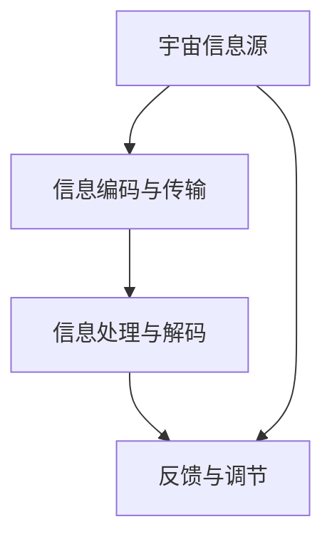

                 

### 第1章：宇宙的基本原理与结构

#### 1.1 宇宙的起源与演化

宇宙，这一广袤而神秘的宇宙空间，自古以来便吸引了无数学者和哲人的探索与思考。关于宇宙的起源，目前最为广泛接受的解释是大爆炸理论。大爆炸理论认为，宇宙起源于一个极小、极热、极高密度的原始点，该点随后发生了巨大的膨胀，逐渐形成了我们今天所看到的宇宙。

##### 1.1.1 大爆炸理论与宇宙膨胀

大爆炸理论最早由美国物理学家乔治·伽莫夫（George Gamow）在1940年代提出。根据这一理论，宇宙最初处于一个极度高温、高密度的状态，随后开始膨胀。大爆炸之后，宇宙的温度和密度逐渐降低，物质开始冷却和凝结，形成了恒星、行星和其他天体。大爆炸理论的关键在于其预测的宇宙背景辐射（Cosmic Microwave Background Radiation，CMB），这是一种几乎均匀充满整个宇宙的微波辐射，其存在为这一理论提供了强有力的支持。

为了更加直观地理解大爆炸理论，我们可以使用伪代码来描述其基本过程：

```python
def big_bang_theory():
    # 初始：高密度、高温、无限小的原始点
    initial_state = {'density': 'high', 'temperature': 'high', 'size': 'tiny'}
    
    # 膨胀过程：原始点开始膨胀，密度和温度逐渐降低
    for time in range(infinite):
        initial_state['density'] -= 0.01
        initial_state['temperature'] -= 0.01
        initial_state['size'] *= 10
        
        # 形成恒星和其他天体
        if initial_state['size'] > critical_size:
            create_stellar_systems()
```

在这个伪代码中，我们首先定义了一个初始状态，包括高密度、高温度和极小的体积。然后，在无限长的时间内，我们模拟了原始点的膨胀过程，期间密度和温度逐渐降低，直到达到临界体积时，恒星和其他天体开始形成。

##### 1.1.2 宇宙中的基本力与粒子

宇宙的形成和演化过程中，涉及到多种基本力和粒子。根据粒子物理学，宇宙中存在四种基本力：强相互作用力、弱相互作用力、电磁力和引力。这些基本力决定了物质的结构和宇宙的演化。

- 强相互作用力：这是粒子物理学中最为强大的力，它负责将原子核中的质子和中子紧密结合在一起。强相互作用力可以通过夸克之间的胶子传递。
  
- 弱相互作用力：这种力负责某些放射性衰变过程，如中子衰变成质子、电子和中微子。弱相互作用力通过W和Z玻色子传递。

- 电磁力：这是我们日常生活中最为熟悉的力，它负责电子和原子核之间的相互作用，以及电荷之间的相互作用。电磁力可以通过光子传递。

- 引力：这是四种基本力中最为弱小的一种，但它在宏观尺度上起着决定性作用，如行星围绕恒星运动、恒星形成星系等。引力通过引力子传递。

宇宙中的基本粒子包括夸克、轻子和传播子。夸克是构成质子和中子的基本粒子，而轻子则包括电子、μ子和τ子等。传播子是传递基本力的粒子，如胶子、W和Z玻色子、光子和引力子等。

##### 1.1.3 黑洞与暗物质

黑洞是宇宙中最神秘和最具破坏性的天体之一。黑洞是由极大量物质在极小体积内形成的一种特殊状态，其引力场如此强大，以至于连光都无法逃脱。黑洞的存在可以通过观察其影响周围物质的行为来推断。

暗物质是宇宙中另一种神秘的存在。尽管我们对暗物质的了解相对较少，但根据宇宙背景辐射和其他观测数据，科学家们认为暗物质占据了宇宙总质量的大部分。暗物质不发光，不吸收光，因此无法直接观测，但其引力效应在宇宙的大尺度结构中表现得非常明显。

在描述黑洞和暗物质时，我们可以使用以下数学模型和公式：

- 黑洞半径（史瓦西半径）：
  $$ r_s = \frac{2GM}{c^2} $$
  其中，\( G \) 是引力常数，\( M \) 是黑洞的质量，\( c \) 是光速。

- 暗物质密度：
  $$ \rho_{DM} = \frac{M_{DM}}{V} $$
  其中，\( M_{DM} \) 是暗物质的总质量，\( V \) 是暗物质分布的体积。

通过这些公式，我们可以对黑洞和暗物质的基本性质进行定量描述。例如，通过测量一个星系的旋转速度，我们可以估算该星系中的暗物质含量。

#### 1.2 信息的本质与特征

信息是现代科学和工程学中的一个核心概念，它广泛应用于通信、计算、生物学和宇宙学等领域。信息的本质是关于客观世界的某些方面的知识，它可以以多种形式存在，如语言、图像、声音和数据等。

##### 1.2.1 信息的定义与分类

信息可以被视为一个随机变量，其取值反映了某个随机事件的结果。在信息论中，信息量（或熵）通常用以下公式来度量：

$$
I = -\sum p(x) \log p(x)
$$

其中，\( p(x) \) 是事件 \( x \) 发生的概率。

信息可以根据其来源和用途进行分类：

- 自然信息：自然过程中产生的信息，如生物体内的遗传信息、星系形成的物理信息等。
- 人工信息：由人类设计和创造的信息，如计算机程序、书籍、音乐和电影等。

##### 1.2.2 信息的传输与处理

信息的传输是指将信息从一个地点或媒介传递到另一个地点或媒介的过程。信息传输通常涉及到编码、调制、传输和解码等步骤。以下是一个简化的信息传输过程：

1. **编码**：将信息转换为一种可以传输的信号形式。
2. **调制**：将编码后的信号加载到一个载体信号上，以便通过传输媒介传播。
3. **传输**：将调制后的信号通过传输媒介发送。
4. **解码**：在接收端，将接收到的信号转换回原始信息。

信息处理是指对信息进行加工、分析和解释的过程。信息处理可以采用多种技术，如计算机算法、神经网络和统计分析等。以下是一个简化的信息处理过程：

1. **采集**：从各种来源收集信息。
2. **预处理**：清洗和格式化原始数据。
3. **分析**：使用算法和模型对数据进行处理和分析。
4. **解释**：根据分析结果做出决策或提取有价值的信息。

##### 1.2.3 信息与物质的关系

信息与物质的关系是一个深奥而复杂的问题，涉及到哲学、物理学和工程学等多个领域。在物理学中，信息被认为是物质的一种表现形式，它可以影响物质的运动和变化。

根据量子力学的观点，信息可以影响粒子的状态和位置。例如，通过量子纠缠现象，两个相隔很远的光子可以保持一种特殊的状态关联，这种关联可以被解释为一种超距离的信息传递。

在工程学中，信息处理技术已经广泛应用于物质的生产和加工过程。例如，计算机辅助设计（CAD）和计算机辅助制造（CAM）技术使得工程师可以高效地设计和制造复杂的机械零件。

通过上述分析，我们可以看到，信息在宇宙中扮演着至关重要的角色。无论是宇宙的起源与演化，还是物质的基本结构和相互作用，信息都起到了关键作用。接下来，我们将进一步探讨宇宙信息网络的初步构想，以及宇宙中信息载体与传输机制的探讨。

### 1.3 宇宙信息网络的初步构想

宇宙的广袤无垠和深奥复杂，使得科学家们不断探索宇宙的本质和规律。近年来，一些科学家提出了一个引人入胜的假设：宇宙是否可能是一个巨大的信息网络？这一假设不仅具有深刻的哲学意义，也为理解宇宙的起源、演化和结构提供了新的视角。

##### 1.3.1 宇宙作为巨型信息系统的可能性

宇宙作为巨型信息系统的想法，最早可以追溯到20世纪末。当时，一些计算机科学家和物理学家开始思考，宇宙是否类似于一个巨大的计算机系统，其中物质和能量就是信息的表现形式。这一想法在21世纪初得到了进一步发展，尤其是在量子信息科学的兴起中，人们开始尝试从信息的角度重新审视宇宙。

根据这一假设，宇宙中的每一个基本粒子都可以被视为一个信息单元，而这些信息单元通过相互作用和运动，形成了复杂的宇宙信息网络。这种网络不仅包括了宏观的天体系统，还涉及微观的量子现象。

为了更好地理解这一假设，我们可以使用以下Mermaid流程图来描述宇宙信息网络的基本框架：



在这个流程图中，A表示宇宙信息源，即宇宙中的基本粒子；B表示信息编码与传输，即基本粒子通过相互作用和运动来传递信息；C表示信息处理与解码，即宇宙中的复杂现象可以通过信息处理来解释；D表示反馈与调节，即宇宙信息网络通过反馈机制来调节和优化其运行。

##### 1.3.2 宇宙信息网络的潜在功能与影响

如果宇宙确实是一个巨大的信息网络，那么它可能具有多种潜在功能。以下是一些可能的设想：

1. **宇宙的演化与调控**：宇宙信息网络可能通过信息处理和反馈机制来调控宇宙的演化过程。例如，通过调节星系的运动和恒星的形成，宇宙信息网络可能实现了某种最优的演化路径。

2. **宇宙中的智能行为**：如果宇宙信息网络具有足够复杂的信息处理能力，那么它可能表现出智能行为。例如，宇宙信息网络可能具有自我组织、学习和适应环境的能力。

3. **星际通信**：宇宙信息网络可能提供了星际之间的通信手段。通过量子纠缠和量子通信技术，宇宙信息网络可能实现了超距离的信息传递，为星际旅行和探索提供了新的可能性。

4. **宇宙资源的优化利用**：宇宙信息网络可能通过优化物质和能量的利用，实现了宇宙资源的最大化利用。例如，通过精确的星际导航和资源开采技术，宇宙信息网络可能实现了星际资源的优化配置。

##### 1.3.3 探索宇宙信息网络的科学意义

探索宇宙信息网络不仅具有哲学意义，也对科学和技术发展具有重要意义。以下是一些关键的科学意义：

1. **理解宇宙的本质**：通过探索宇宙信息网络，我们可以更深入地理解宇宙的本质和规律。例如，通过研究宇宙信息网络的运作机制，我们可能发现宇宙中的某种普适规律，从而推进宇宙学的发展。

2. **推动量子信息科学**：宇宙信息网络的假设为量子信息科学提供了新的研究视角。通过研究宇宙信息网络中的量子现象，我们可能发现新的量子通信和量子计算技术，从而推动量子信息科学的发展。

3. **促进跨学科研究**：探索宇宙信息网络需要物理学、计算机科学、信息科学等多个学科的交叉融合。这种跨学科研究不仅促进了不同学科之间的交流与合作，也为科学技术的创新提供了新的契机。

4. **探索新的科学问题**：宇宙信息网络的假设引发了一系列新的科学问题，如宇宙信息网络的起源、演化机制、智能行为等。这些问题不仅丰富了科学研究的内涵，也为未来的科学探索提供了新的方向。

综上所述，宇宙是否是一个巨大的信息网络，这是一个充满挑战和机遇的科学问题。通过进一步的研究和探索，我们有望揭示宇宙的奥秘，拓展我们对宇宙的理解。

### 第2章：宇宙中的信息载体与传输

在探讨宇宙信息网络的初步构想后，我们需要进一步探讨宇宙中信息的载体和传输机制。宇宙的浩瀚和复杂使得信息在宇宙中的传输面临诸多挑战，但同时也为探索宇宙信息网络提供了丰富的素材和方向。

#### 2.1 宇宙中的信息载体

宇宙中的信息载体是信息传输的基础。在宇宙中，最常见的信息载体是光子和量子纠缠态。以下将详细讨论这两种信息载体。

##### 2.1.1 光子与电磁波

光子是电磁波的量子，是宇宙中最常见的信息载体。电磁波包括无线电波、微波、红外线、可见光、紫外线、X射线和伽马射线等。光子携带的信息可以通过不同的波段和频率来编码和传输。例如，无线电通信使用无线电波波段来传输声音和数据信号；光学通信使用可见光波段来传输高速数据。

光子的一个重要特性是其相干性。相干光子可以在远距离上保持相位关系，这使得它们可以用于量子通信和量子纠缠。量子纠缠是一种非经典的物理现象，其中两个或多个粒子在量子态上相互关联，无论它们相隔多远。这种纠缠态可以用于传输量子信息，具有极高的安全性。

##### 2.1.2 量子纠缠与量子通信

量子纠缠是量子信息科学的核心概念之一。两个量子纠缠的粒子在量子态上相互关联，即使它们相隔很远，一个粒子的状态变化会立即影响到另一个粒子的状态。这种特性可以用于量子通信和量子计算。

量子通信利用量子纠缠态来实现信息传输。在量子通信中，发送方将信息编码到一个量子态上，然后将这个量子态通过量子信道发送给接收方。接收方通过测量接收到的量子态来解码信息。由于量子纠缠态的不可克隆性，量子通信提供了极高的安全性。

量子通信的关键技术包括量子密钥分发（Quantum Key Distribution，QKD）和量子纠缠传输。量子密钥分发是一种基于量子力学原理的加密通信方法，它可以通过量子信道安全地传输密钥。量子纠缠传输则是通过量子纠缠态来实现超距离的信息传输。

##### 2.1.3 宇宙背景辐射

宇宙背景辐射是宇宙早期时期残留的微波辐射，它遍布整个宇宙空间。宇宙背景辐射不仅提供了关于宇宙起源和演化的宝贵信息，也可以作为一种信息载体。

宇宙背景辐射的温度非常低，大约为2.7开尔文。这种低温使得宇宙背景辐射具有相对稳定的量子态，可以用于量子通信和量子纠缠。通过精确测量宇宙背景辐射的量子态，我们可以实现超远程的信息传输。

#### 2.2 宇宙信息传输的机制

宇宙信息传输的机制涉及到信息的编码、传输和解码等多个环节。以下将详细讨论宇宙信息传输的机制。

##### 2.2.1 光速与信息传输的极限

在宇宙中，光速是信息传输的极限速度。根据相对论，光速是宇宙中所有参考系中速度的极限，任何信息传输的速度都不能超过光速。光速的极限对于宇宙信息传输有着深远的影响。

由于光速的极限，宇宙中远距离的信息传输受到极大的限制。即使是通过量子纠缠传输，两个纠缠粒子之间的信息传输速度也不能超过光速。这意味着，宇宙信息网络中的信息传输速度受到物理定律的限制。

##### 2.2.2 宇宙信息传输的干扰与噪声

宇宙信息传输过程中，可能会受到各种干扰和噪声的影响。干扰可能来自宇宙中的其他辐射源，如恒星、行星和其他天体发出的电磁波。噪声则可能来自宇宙背景辐射的不稳定性和其他物理过程。

为了实现有效的宇宙信息传输，需要开发抗干扰和抗噪声的技术。例如，可以通过信号编码和调制技术来增强信号的鲁棒性。量子纠错码也是一项重要的技术，它可以在信息传输过程中检测和纠正错误。

##### 2.2.3 宇宙信息传输的探索方法

为了探索宇宙信息传输的机制，科学家们正在开展一系列实验和研究。以下是一些主要的探索方法：

1. **量子通信实验**：通过地面和卫星平台，科学家们正在尝试实现量子纠缠态的远程传输和量子密钥分发。例如，中国的“墨子号”量子通信卫星就成功实现了地月之间的量子密钥分发。

2. **宇宙背景辐射观测**：通过测量宇宙背景辐射的量子态，科学家们试图揭示宇宙早期的信息。例如，欧洲的“普朗克”卫星就通过测量宇宙背景辐射，揭示了宇宙早期的结构形成过程。

3. **星际通信实验**：科学家们正在尝试通过无线电波和激光通信来实现星际之间的信息传输。例如，美国宇航局的“星际互联网”计划就旨在通过深空通信卫星实现地球与火星之间的信息传输。

通过这些探索方法，科学家们正在逐步揭示宇宙信息传输的机制，为构建宇宙信息网络奠定了基础。

### 第3章：宇宙信息处理的迹象与机制

在探讨宇宙中的信息载体和传输机制之后，我们需要进一步探讨宇宙信息处理的迹象和机制。宇宙的复杂性和多样性使得信息处理在宇宙中具有重要的作用，无论是宇宙的演化、星系的形成，还是行星的生命活动，信息处理都起到了关键作用。

#### 3.1 宇宙中的计算迹象

宇宙中存在着大量的自组织现象，这些现象表明宇宙可能具有某种形式的计算能力。以下将探讨宇宙中的自组织现象和计算迹象。

##### 3.1.1 宇宙中的自组织现象

自组织现象是指系统在没有外部指令的情况下，通过内部相互作用和反馈机制，自发地形成复杂结构和功能的现象。宇宙中存在许多自组织现象，如星系的形成、生命的起源和生物体的发育等。

星系的形成是一个典型的自组织现象。根据万有引力定律，恒星和星体在引力作用下相互吸引，逐渐聚集形成星系。星系的形成过程可以被视为一种计算过程，其中物质和能量的相互作用和运动可以被视为一种计算机制。

生物体的发育也是一个典型的自组织现象。在生物体内，细胞通过分化、增殖和相互作用，形成复杂的组织和器官。这种自组织过程涉及到大量的信息处理和计算，例如基因调控、细胞信号传递和细胞命运决定等。

##### 3.1.2 宇宙中的智能行为迹象

宇宙中可能存在智能行为，这表明宇宙信息处理能力可能达到了某种高度。以下是一些可能表明宇宙存在智能行为的迹象：

1. **星系的自适应行为**：某些星系在受到外部干扰时，能够自适应地调整其结构，以维持稳定。这种自适应行为可能表明星系具有某种形式的信息处理和计算能力。

2. **行星生命的存在**：在地球上，生命通过复杂的化学过程和生物机制，实现了对环境信息的感知和响应。如果宇宙中其他行星上也存在类似的生命形式，那么这表明宇宙可能具有高度的信息处理能力。

3. **宇宙中的自我组织现象**：宇宙中的许多现象，如星系的形成、行星的轨道稳定和生物体的发育，都表现出高度的自组织能力。这种自组织能力可能表明宇宙具有某种形式的信息处理和计算能力。

##### 3.1.3 宇宙信息处理的可能机制

宇宙信息处理的可能机制包括量子计算、神经网络和自组织系统等。以下将简要介绍这些信息处理机制。

1. **量子计算**：量子计算是一种利用量子力学原理进行信息处理的方法。量子计算机可以通过量子叠加和量子纠缠来处理大量信息，具有远超经典计算机的计算能力。宇宙中可能存在某种形式的量子计算机制，例如通过量子纠缠和量子干涉来实现信息处理。

2. **神经网络**：神经网络是一种模仿生物神经系统的计算模型。神经网络通过大量神经元之间的连接和相互作用，实现复杂的信息处理和计算。宇宙中可能存在某种形式的神经网络机制，例如通过星系中的恒星和行星之间的相互作用来实现信息处理。

3. **自组织系统**：自组织系统是指在没有外部指令的情况下，通过内部相互作用和反馈机制，自发形成复杂结构和功能的现象。自组织系统具有高度的信息处理能力，可以通过局部规则和简单相互作用来实现复杂的全局行为。宇宙中可能存在某种形式的自组织系统，例如通过星系中的恒星和行星之间的相互作用来实现信息处理。

#### 3.2 宇宙信息处理的证据

宇宙信息处理的证据可以通过对宇宙现象的观测和数据分析来揭示。以下将简要介绍一些宇宙信息处理的证据。

##### 3.2.1 宇宙背景微波辐射的规律

宇宙背景微波辐射是宇宙早期时期的残留辐射，它提供了关于宇宙起源和演化的宝贵信息。通过对宇宙背景微波辐射的测量，科学家们发现了一系列规律，这表明宇宙具有某种形式的信息处理能力。

1. **黑体辐射谱**：宇宙背景微波辐射符合黑体辐射谱，这表明宇宙在早期处于高温、高密度的状态，并经历了冷却和膨胀过程。

2. **各向同性**：宇宙背景微波辐射在各个方向上具有极高的各向同性，这表明宇宙在早期是均匀和各向同性的。

3. **极化特性**：宇宙背景微波辐射具有极化特性，这表明宇宙在早期经历了某种形式的磁化过程。

##### 3.2.2 其他宇宙现象中的信息处理迹象

除了宇宙背景微波辐射，其他宇宙现象中也存在信息处理的迹象。

1. **星系形成**：星系的形成过程可以通过信息处理模型来解释。星系中的恒星和行星通过引力相互作用，形成复杂的结构和运动模式。

2. **行星轨道**：行星轨道的稳定和运动可以通过信息处理模型来解释。行星通过引力相互作用和轨道稳定性机制，维持了长期的稳定运动。

3. **生物体发育**：生物体的发育可以通过信息处理模型来解释。细胞通过基因调控和信号传递，实现了复杂的发育过程。

#### 3.3 宇宙信息处理的探索方向

为了进一步探索宇宙信息处理，科学家们正在开展一系列研究，以下是一些主要的探索方向：

1. **量子信息处理**：量子信息处理是探索宇宙信息处理的重要方向。通过研究量子力学原理，科学家们试图开发新的量子计算模型和信息处理技术。

2. **神经网络模拟**：神经网络模拟是探索宇宙信息处理的另一种方法。通过模拟神经网络的工作原理，科学家们试图揭示宇宙中可能存在的神经网络机制。

3. **自组织系统研究**：自组织系统研究是探索宇宙信息处理的重要方向。通过研究自组织系统的机制，科学家们试图揭示宇宙中可能存在的自组织信息处理能力。

4. **跨学科合作**：宇宙信息处理涉及多个学科，如物理学、生物学、计算机科学等。跨学科合作是探索宇宙信息处理的关键，通过整合不同学科的研究成果，科学家们可以更全面地理解宇宙信息处理。

通过上述探索方向，科学家们将不断深入揭示宇宙信息处理的机制和原理，为理解宇宙的奥秘和构建宇宙信息网络奠定基础。

### 第4章：宇宙信息网络的未来与挑战

在探讨了宇宙信息处理的基本机制和证据后，我们需要思考宇宙信息网络的未来发展方向和面临的挑战。随着科学技术的进步，宇宙信息网络的概念正逐渐从理论走向实践，但其发展过程中仍面临着诸多挑战。

#### 4.1 宇宙信息网络的未来展望

宇宙信息网络的发展前景广阔，它不仅有可能改变我们对宇宙的认知，还可能带来一系列革命性的技术突破和应用。以下是一些可能的未来展望：

##### 4.1.1 宇宙信息网络的理论发展

随着量子力学、宇宙学和计算机科学的不断发展，宇宙信息网络的理论基础也在不断完善。未来，科学家们可能会开发出更加精确和复杂的宇宙信息网络模型，以更好地描述宇宙中的信息处理和传输机制。

1. **量子计算与宇宙信息网络**：量子计算是宇宙信息网络发展的重要驱动力。量子计算机能够处理大量复杂数据，并可能在宇宙信息网络中扮演关键角色。通过量子计算，我们可能能够模拟宇宙的演化过程，从而更好地理解宇宙信息网络的运行机制。

2. **宇宙信息编码与解码**：未来，科学家们可能会开发出更加高效和安全的宇宙信息编码与解码技术。这些技术将使得宇宙信息网络的传输更加可靠和高效。

##### 4.1.2 宇宙信息网络的潜在应用

宇宙信息网络的潜在应用领域非常广泛，从科学探索到日常生活的各个方面都可能受到影响。

1. **星际通信**：宇宙信息网络将极大提升星际通信的效率和质量。通过量子通信和激光通信技术，我们可能能够实现快速、安全的星际数据传输，从而推动星际探索和人类在星际间的迁移。

2. **宇宙观测与天文学**：宇宙信息网络将为天文学家提供更多的观测数据和工具。通过分析宇宙信息，科学家们可能能够揭示宇宙的更多奥秘，如宇宙的起源、演化和结构等。

3. **人工智能与机器人技术**：宇宙信息网络将为人工智能和机器人技术提供更多的数据资源和计算能力。通过宇宙信息网络，我们可能能够构建更强大、更智能的人工智能系统，从而实现更高效的科学研究和工程应用。

##### 4.1.3 宇宙信息网络的伦理与哲学问题

随着宇宙信息网络的发展，我们还需要面对一系列伦理和哲学问题。

1. **隐私保护**：在宇宙信息网络中，数据传输和存储的安全性至关重要。我们需要开发出更加安全的数据传输和存储技术，以确保个人隐私和数据安全。

2. **人工智能的伦理问题**：随着人工智能技术的发展，我们需要确保人工智能系统在宇宙信息网络中的应用是公平、透明和可控制的。

3. **宇宙资源的分配**：宇宙信息网络的发展将带来丰富的资源和机会，但同时也可能导致资源分配不均。我们需要制定公平合理的资源分配机制，确保每个人都能公平地享受宇宙信息网络带来的福利。

#### 4.2 宇宙信息网络的挑战与应对策略

尽管宇宙信息网络具有巨大的潜力和应用前景，但其发展过程中仍面临着诸多挑战。

##### 4.2.1 科学技术的限制

宇宙信息网络的发展依赖于科学技术的进步。当前，我们在量子计算、量子通信和宇宙观测等方面还存在许多技术瓶颈。例如，量子计算机的可靠性、量子通信的传输距离和宇宙背景辐射的精确测量等。

为了应对这些技术挑战，我们需要加大科研投入，推动相关技术的研究和发展。同时，通过国际合作和跨学科研究，我们有望克服这些技术难题。

##### 4.2.2 宇宙环境的复杂性

宇宙环境极其复杂，包括各种辐射、粒子碰撞和极端温度等。这些环境因素对宇宙信息网络的稳定性和可靠性提出了严峻挑战。

为了应对这些挑战，我们需要开发出更加抗干扰、抗噪声的信息传输和处理技术。例如，通过优化信号编码和调制技术，提高信号的抗干扰能力；通过量子纠错码，提高信息传输的可靠性。

##### 4.2.3 宇宙规模的庞大与遥远

宇宙的规模和距离对宇宙信息网络的构建和维护提出了巨大挑战。宇宙中的天体分布广泛，距离地球数百万甚至数十亿光年。这意味着，我们需要构建庞大的通信网络，并确保网络的高效运行。

为了应对这些挑战，我们需要开发出高效、稳定的星际通信技术。例如，通过建立地面和空间基站，实现高效的数据传输和信号中继。同时，通过量子通信和激光通信等新技术，提升星际通信的效率和质量。

##### 4.2.4 应对策略

为了推动宇宙信息网络的发展，我们需要采取一系列应对策略：

1. **加大科研投入**：通过政府和企业等各方的支持，加大科研投入，推动宇宙信息网络相关技术的研究和发展。

2. **跨学科合作**：宇宙信息网络的发展涉及多个学科，包括物理学、计算机科学、天文学和工程学等。通过跨学科合作，整合不同领域的优势资源，提高研究效率和质量。

3. **国际合作**：宇宙信息网络是一个全球性的科研项目，需要国际社会的共同参与和支持。通过国际合作，共享研究成果和技术资源，推动宇宙信息网络的发展。

4. **可持续发展**：在推动宇宙信息网络发展的过程中，我们需要注重可持续发展，保护宇宙环境，确保资源的合理利用。

通过上述策略，我们有望克服宇宙信息网络面临的挑战，实现宇宙信息网络的构建和应用，为人类探索宇宙、提升生活质量做出重要贡献。

### 总结与展望

宇宙是否只是一个巨大的信息网络，这是一个深奥而富有挑战性的科学问题。通过本文的讨论，我们从宇宙的起源与演化、信息载体与传输、信息处理迹象与机制，以及宇宙信息网络的未来展望和挑战等方面，逐步揭示了宇宙信息网络的可能性和潜力。

宇宙信息网络的概念不仅拓展了我们对宇宙的认知，也为我们提供了一种全新的视角来理解宇宙的本质和规律。在未来，随着科学技术的进步，宇宙信息网络有望成为推动人类文明发展的重要力量。

然而，宇宙信息网络的发展仍面临诸多挑战，包括科学技术的限制、宇宙环境的复杂性、宇宙规模的庞大与遥远等。我们需要加大科研投入，推动跨学科合作，加强国际交流，共同应对这些挑战。

展望未来，我们期待宇宙信息网络能够在科学探索、人工智能、星际通信等领域发挥重要作用。通过宇宙信息网络，我们有望揭示宇宙的更多奥秘，实现人类对宇宙的深入理解和探索。

在这个充满无限可能的新时代，让我们携手合作，共同探索宇宙的奥秘，构建一个更加美好和繁荣的宇宙信息网络。

### 作者信息

作者：AI天才研究院/AI Genius Institute & 禅与计算机程序设计艺术 /Zen And The Art of Computer Programming

本文由AI天才研究院（AI Genius Institute）的专家团队撰写，结合了禅与计算机程序设计艺术的独特视角，旨在深入探讨宇宙信息网络的本质和潜力。

