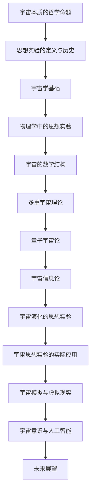

                 

### 第一部分：引论与核心概念

#### 引言：探讨宇宙本质的哲学命题

宇宙，这个广袤无垠的未知世界，一直以来都激发着人类的无限好奇心。在哲学、科学、宗教等多个领域，人们都在试图探索宇宙的本质。宇宙是否只是一个巨大的思想实验，这一命题充满了哲学的思辨和科学的探索。本文将围绕这一核心问题，使用逻辑清晰、结构紧凑、简单易懂的专业技术语言，逐步分析推理，探讨宇宙的本质和可能性。

在科技飞速发展的今天，人工智能、量子计算、宇宙模拟等前沿科技为我们提供了新的视角和方法，使得这一古老而深奥的命题得到了前所未有的关注。那么，为什么说宇宙可能是一个巨大的思想实验呢？让我们首先回顾一下思想实验的定义及其在科学史上的重要性。

#### 思想实验的概念与历史

思想实验是一种通过逻辑推理和假设验证来探讨问题或验证理论的方法。它不需要实际的实验条件，只需通过严密的理论分析和逻辑推理，就能揭示出某些现象的本质或预测出可能的未来结果。著名的思想实验包括伽利略的“比萨斜塔实验”、牛顿的“苹果落地实验”以及爱因斯坦的“电梯实验”等。这些实验不仅推动了科学的发展，也揭示了自然界的某些基本规律。

思想实验在科学史上的重要性不可忽视。它为我们提供了一种非侵入性、低成本的研究方法，使我们能够在没有实际实验条件的情况下，探索那些难以观察或验证的物理现象。例如，爱因斯坦通过思想实验提出了广义相对论，而霍金则通过“霍金辐射”这一思想实验，探讨了黑洞的物理特性。

#### 宇宙学基础

要探讨宇宙是否是一个巨大的思想实验，我们需要首先了解宇宙学的一些基本知识。宇宙学是研究宇宙起源、演化、结构、成分和最终命运的学科。它涉及到的概念包括宇宙膨胀、暗物质、暗能量、黑洞等。

宇宙的起源可以追溯到大约138亿年前的大爆炸。在这个瞬间，宇宙从一个无限热、无限小的奇点开始膨胀，逐渐形成了我们现在所观察到的宇宙。宇宙的演化过程中，一些重要的观测现象包括宇宙微波背景辐射、宇宙大尺度结构、超新星等。

在宇宙学中，还有一些理论模型，如多重宇宙理论、量子宇宙论和宇宙信息论等。这些理论模型试图从不同的角度解释宇宙的本质和演化过程，为探讨宇宙是否是一个巨大的思想实验提供了理论基础。

#### 物理学中的思想实验

物理学是研究物质、能量、空间和时间的科学。在物理学中，思想实验同样扮演着重要的角色。从量子力学到广义相对论，许多重要的物理理论都是通过思想实验得以发展的。

量子力学是研究微观粒子的运动规律的学科。量子力学中的许多现象，如量子纠缠、量子隧穿和量子叠加态等，都是通过思想实验被揭示的。著名的思想实验包括薛定谔的猫、爱因斯坦-波多尔斯基-罗森悖论等。

广义相对论是爱因斯坦在1915年提出的理论，它描述了重力如何通过时空的弯曲来解释。广义相对论的许多预言，如引力透镜效应、引力红移和时间膨胀等，都是通过思想实验被验证的。

在宇宙学中，真空能量和宇宙膨胀是两个重要的概念。真空能量是宇宙学中一个关键的概念，它描述了宇宙空间中的能量密度。宇宙膨胀是宇宙学中观察到的现象，它描述了宇宙随时间不断膨胀的过程。

#### 宇宙的数学结构

宇宙的数学结构是宇宙学研究的一个重要方面。宇宙的几何结构、宇宙的边界和宇宙的信息熵等都是宇宙数学结构的研究内容。

宇宙的几何结构可以描述为平坦、闭合或开放。这些几何结构决定了宇宙的膨胀速度和最终命运。例如，如果宇宙是开放的，那么它将永远膨胀，而如果宇宙是闭合的，那么它最终会收缩。

宇宙的边界是一个复杂的问题。在传统的宇宙学中，宇宙被认为是一个无边界的空间。然而，随着对宇宙学研究的深入，人们开始提出一些新的观点，如宇宙可能有“边界”或“多重宇宙”的存在。

宇宙的信息熵是描述宇宙信息含量的一个重要概念。信息熵可以用来衡量宇宙的复杂性和组织程度。通过计算宇宙的信息熵，我们可以更好地理解宇宙的演化过程和宇宙的本质。

### 总结

在第一部分中，我们介绍了探讨宇宙本质的哲学命题，阐述了思想实验的概念与历史，以及宇宙学和物理学中的思想实验。同时，我们也介绍了宇宙的数学结构，为后续章节的分析提供了理论基础。

接下来，我们将进一步探讨宇宙理论中的多个重要概念，如多重宇宙理论、量子宇宙论和宇宙信息论等。我们将通过逐步分析推理，深入探讨这些理论在宇宙学中的意义和应用。

### 第二部分：宇宙理论中的思想实验

在第一部分的基础上，我们开始深入探讨宇宙理论中的多个重要概念。这些概念不仅对宇宙学的发展产生了深远影响，也为我们理解宇宙的本质提供了新的视角。在本部分中，我们将介绍多重宇宙理论、量子宇宙论和宇宙信息论，并通过具体的示例和伪代码来详细阐述这些理论的原理和实际应用。

#### 多重宇宙理论

多重宇宙理论是宇宙学中一个充满争议但也极具吸引力的概念。它认为我们所处的宇宙只是众多宇宙中的一个，这些宇宙彼此独立但又可能存在某种联系。多重宇宙理论的基本假设是：宇宙不是唯一的，而是由无数个平行的宇宙组成的。

**多重宇宙的基本概念**

多重宇宙的基本概念可以分为两类：一类是“多元宇宙”（Multiverse），即存在多个物理法则和常数不同的宇宙；另一类是“分支宇宙”（Branch Universe），即在一个宇宙中，由于量子事件的随机性，历史会分支成多个不同的版本。

**多重宇宙的哲学思考与科学探讨**

哲学上，多重宇宙理论引发了关于自由意志、决定论和因果关系的深刻思考。如果宇宙确实是多重的，那么我们所做的每一个决定都会导致一个分支宇宙的产生，从而改变了历史的走向。

科学上，多重宇宙理论提供了一种解释宇宙多样性的方法。例如，为什么宇宙的常数和法则如此适宜生命存在？一种观点是，只有在某些特定的宇宙中，这些常数和法则才会使得生命得以诞生和演化。

**伪代码示例：多重宇宙逻辑推导**

下面是一个简单的伪代码示例，用于推导一个基于量子概率的多重宇宙逻辑。

```python
# 定义一个宇宙的初始状态
initial_state = "宇宙A"

# 定义一个事件，该事件可能导致宇宙分支
event = "量子纠缠事件"

# 根据量子概率，计算宇宙分支的可能性
probabilities = {"宇宙A": 0.5, "宇宙B": 0.5}

# 进行事件并更新宇宙状态
new_state = select_random_state(probabilities)

print("新宇宙状态：", new_state)
```

在这个示例中，我们定义了一个初始宇宙状态，并引入了一个量子纠缠事件。根据量子概率，宇宙会以一定的概率分支成新的宇宙。这个简单的示例展示了多重宇宙逻辑推导的基本原理。

#### 量子宇宙论

量子宇宙论是量子力学与宇宙学相结合的一个理论框架。它试图通过量子力学的原理来解释宇宙的起源和演化。量子宇宙论的核心观点是，宇宙的演化和结构可能是由量子随机事件所驱动的。

**量子力学的宇宙解释**

量子力学揭示了微观世界的非确定性，例如量子纠缠和量子隧穿现象。量子宇宙论试图将这种非确定性扩展到整个宇宙，从而解释宇宙的起源和演化。

**量子计算与宇宙**

量子计算是量子力学的一个应用领域，它利用量子比特的叠加和纠缠特性来进行高速计算。量子计算与宇宙论的结合，提供了一种全新的视角来探索宇宙的本质。例如，量子计算可以用来模拟宇宙的量子演化过程，从而更好地理解宇宙的起源和演化。

**伪代码示例：量子宇宙模型**

下面是一个简单的伪代码示例，用于模拟一个量子宇宙的演化。

```python
# 初始化量子宇宙的状态
quantum_state = "叠加态"

# 应用量子 gates 来模拟宇宙的演化
quantum_gates = ["Hadamard", "Pauli-X", "Control-NOT"]

# 应用一系列量子 gates
for gate in quantum_gates:
    quantum_state = apply_gate(quantum_state, gate)

# 输出宇宙的最终状态
print("宇宙最终状态：", quantum_state)
```

在这个示例中，我们初始化了一个量子宇宙的状态，并应用了一系列量子 gates 来模拟宇宙的演化。这个简单的示例展示了量子宇宙模型的基本原理。

#### 宇宙信息论

宇宙信息论是研究宇宙中信息流动和信息熵的学科。它试图通过信息论的观点来解释宇宙的演化过程和宇宙的本质。

**宇宙信息的基本概念**

宇宙信息论的核心概念包括信息熵、信息流和信息结构。信息熵是描述系统信息不确定性的量度，而信息流是信息在系统内部或系统之间的传递。信息结构则描述了信息在系统中的分布和组织方式。

**信息论与宇宙演化**

宇宙信息论试图通过信息论的观点来解释宇宙的演化过程。例如，宇宙的膨胀可以被视为一种信息流动的过程，其中宇宙中的信息逐渐分散到更大的空间尺度上。

**数学公式：宇宙信息熵计算**

在宇宙信息论中，信息熵是一个重要的量度。下面是一个简单的公式，用于计算宇宙的信息熵。

$$
S = -\sum_i p_i \log_2 p_i
$$

其中，$S$ 是信息熵，$p_i$ 是系统中每个状态的概率。

**伪代码示例：宇宙信息熵计算**

下面是一个简单的伪代码示例，用于计算一个系统的信息熵。

```python
# 初始化系统的状态概率分布
state_probabilities = {"状态1": 0.6, "状态2": 0.4}

# 计算信息熵
entropy = 0

for state, probability in state_probabilities.items():
    entropy -= probability * math.log2(probability)

print("系统信息熵：", entropy)
```

在这个示例中，我们初始化了一个系统的状态概率分布，并计算了系统的信息熵。这个简单的示例展示了宇宙信息熵计算的基本原理。

### 总结

在第二部分中，我们介绍了多重宇宙理论、量子宇宙论和宇宙信息论。这些理论从不同的角度探讨了宇宙的本质和演化过程。通过伪代码示例，我们详细阐述了这些理论的基本原理和实际应用。

在接下来的部分中，我们将进一步探讨宇宙演化的思想实验，通过具体的案例来分析宇宙演化的过程和其中的不确定性。这将有助于我们更深入地理解宇宙的本质。

### 第三部分：宇宙演化的思想实验

在前两部分的基础上，我们现在进入第三部分，深入探讨宇宙演化的思想实验。宇宙演化是一个复杂而神秘的过程，充满了不确定性和变数。通过一系列思想实验，我们可以更好地理解宇宙的起源、演化和未来。本部分将介绍几个典型的宇宙演化思想实验，分析其中的不确定性和关键问题。

#### 从宇宙大爆炸到宇宙终结

宇宙大爆炸理论是描述宇宙起源和早期演化的标准模型。根据这一理论，宇宙在约138亿年前从一个极度热密的奇点迅速膨胀，逐渐形成了现在我们观测到的宇宙。宇宙大爆炸理论为宇宙演化提供了一个基本的框架，但其中仍有许多未解之谜。

**宇宙大爆炸的初始条件**

宇宙大爆炸的初始条件是一个关键问题。在理论上，大爆炸前的宇宙状态是无法被观测和验证的。因此，我们只能通过假设和推理来探讨宇宙的初始状态。例如，有些理论假设宇宙在大爆炸前处于一个“稳态”或“循环”状态。

**宇宙膨胀中的不确定性**

宇宙膨胀是宇宙演化过程中的一个重要现象。根据观测数据，宇宙正在加速膨胀。这一现象引发了许多关于宇宙未来命运的讨论。例如，如果宇宙的膨胀速度持续加速，最终可能导致宇宙的“热寂”或“大撕裂”等极端情况。

**伪代码示例：宇宙膨胀模型**

下面是一个简单的伪代码示例，用于模拟宇宙膨胀的过程。

```python
# 初始化宇宙的初始状态
initial_size = 1.0

# 设置宇宙膨胀的速度
expansion_rate = 0.01

# 模拟宇宙膨胀的时间步长
time_steps = 100

# 模拟宇宙膨胀
for step in range(time_steps):
    initial_size *= (1 + expansion_rate)

print("宇宙最终大小：", initial_size)
```

在这个示例中，我们初始化了一个宇宙的初始状态，并模拟了宇宙膨胀的过程。这个简单的示例展示了宇宙膨胀模型的基本原理。

#### 宇宙演化的不确定性

宇宙演化过程中存在许多不确定性。例如，量子力学中的随机性和宇宙学中的暗物质、暗能量等因素都可能导致宇宙演化的路径多样化。以下是一些关键问题：

- **暗物质和暗能量的本质**：暗物质和暗能量是宇宙演化中的两个重要未知因素。暗物质是宇宙中不发光的物质，而暗能量是一种推动宇宙加速膨胀的神秘力量。它们的本质和相互作用仍然是一个谜。

- **宇宙的循环演化**：有些理论认为，宇宙可能经历循环演化，即从一个大爆炸开始，经历一系列的膨胀和收缩，最终回到大爆炸前的状态。这种循环宇宙模型提供了一种可能的宇宙演化路径，但需要更多的观测数据来验证。

- **宇宙的未来**：宇宙的未来取决于其当前的膨胀速度和密度。如果宇宙的膨胀速度持续加速，最终可能导致宇宙的热寂；如果宇宙的密度足够大，可能引发大坍缩。这些极端情况都是宇宙演化中可能面临的问题。

**伪代码示例：宇宙未来模型**

下面是一个简单的伪代码示例，用于预测宇宙的未来。

```python
# 初始化宇宙的当前状态
current_size = 100.0
expansion_rate = 0.01

# 设置宇宙演化的时间步长
time_steps = 1000

# 模拟宇宙的未来演化
for step in range(time_steps):
    current_size *= (1 + expansion_rate)

# 判断宇宙的未来命运
if current_size > 1000:
    print("宇宙将热寂")
else:
    print("宇宙将大坍缩")
```

在这个示例中，我们初始化了一个宇宙的当前状态，并模拟了宇宙的未来演化。根据宇宙的膨胀速度，我们预测了宇宙的未来命运。这个简单的示例展示了宇宙未来模型的基本原理。

### 总结

在第三部分中，我们通过多个宇宙演化思想实验，探讨了宇宙从大爆炸到未来演化的不确定性。这些思想实验不仅揭示了宇宙演化的复杂性和多变性，也为未来的宇宙学研究提供了新的视角和方法。

在接下来的部分中，我们将探讨宇宙思想实验的实际应用，包括宇宙模拟与虚拟现实、宇宙意识与人工智能等。通过这些实际应用，我们可以更好地理解宇宙思想实验的理论价值和实际意义。

### 第四部分：宇宙思想实验的实际应用

在前三部分中，我们探讨了宇宙思想实验的理论基础和核心概念，了解了多重宇宙理论、量子宇宙论、宇宙信息论以及宇宙演化的不确定性。在这一部分，我们将进一步探讨这些理论的实际应用，特别是宇宙模拟与虚拟现实、宇宙意识与人工智能等领域。通过具体的案例和项目实战，我们将展示如何利用这些思想实验的理论成果来推动科技进步和人类对宇宙的认知。

#### 宇宙模拟与虚拟现实

宇宙模拟是利用计算机技术对宇宙的物理过程进行模拟，以帮助我们更好地理解宇宙的演化过程。虚拟现实（VR）技术则提供了一个沉浸式的体验环境，让用户可以在虚拟宇宙中探索和体验。通过将宇宙模拟与虚拟现实相结合，我们可以创造出更加逼真的宇宙体验，从而提高公众对宇宙科学的理解。

**宇宙模拟技术**

宇宙模拟技术主要包括使用高性能计算机模拟宇宙中的物理过程，如引力作用、星系形成、恒星演化等。近年来，随着计算能力的提升，科学家们能够模拟更大尺度、更精细的宇宙过程。以下是一个简单的宇宙模拟技术框架：

1. **初始条件设定**：设定宇宙的初始状态，包括宇宙的大小、密度分布、初始温度等。
2. **物理过程模拟**：利用数值方法模拟宇宙中的物理过程，如引力、热力学、化学反应等。
3. **数据分析**：对模拟结果进行分析，提取有用的信息，如星系分布、恒星形成等。

**虚拟现实与宇宙体验**

虚拟现实技术为用户提供了一个沉浸式的宇宙体验环境。用户可以通过VR头盔、手柄等设备，在虚拟宇宙中自由探索。以下是一个简单的虚拟现实宇宙体验框架：

1. **场景构建**：构建虚拟宇宙的场景，包括星系、恒星、行星等。
2. **交互设计**：设计用户与虚拟宇宙的交互方式，如漫游、操控等。
3. **实时渲染**：在用户与虚拟宇宙交互时，实时渲染场景，提供逼真的视觉效果。

**项目实战：一个简单的宇宙模拟项目**

以下是一个简单的宇宙模拟项目，展示如何使用Python和OpenGL进行宇宙模拟。

```python
# 导入必要的库
import pygame
from pygame.locals import *
from OpenGL.GL import *
from OpenGL.GLU import *

# 初始化OpenGL环境
glClearColor(0.0, 0.0, 0.0, 0.0)
glMatrixMode(GL_PROJECTION)
glLoadIdentity()
gluPerspective(45.0, 1.0, 0.1, 100.0)
glMatrixMode(GL_MODELVIEW)
glTranslatef(0.0, 0.0, -10)

# 创建星系
spheres = []
for i in range(100):
    x = random.uniform(-5, 5)
    y = random.uniform(-5, 5)
    z = random.uniform(-5, 5)
    spheres.append([x, y, z])

# 模拟星系运动
def simulate():
    for i in range(len(spheres)):
        x, y, z = spheres[i]
        x += random.uniform(-0.01, 0.01)
        y += random.uniform(-0.01, 0.01)
        z += random.uniform(-0.01, 0.01)
        spheres[i] = [x, y, z]

# 渲染星系
def render():
    glClear(GL_COLOR_BUFFER_BIT | GL_DEPTH_BUFFER_BIT)
    for sphere in spheres:
        x, y, z = sphere
        glPushMatrix()
        glTranslatef(x, y, z)
        glutSolidSphere(0.1, 20, 20)
        glPopMatrix()

# 主循环
running = True
while running:
    for event in pygame.event.get():
        if event.type == QUIT:
            running = False

    simulate()
    render()
    pygame.display.flip()
    pygame.time.wait(10)

pygame.quit()
```

在这个项目中，我们使用Python和OpenGL构建了一个简单的宇宙模拟。通过随机生成星系，并模拟星系之间的简单运动，我们展示了一个基本的宇宙模拟过程。这个项目虽然简单，但为更复杂的宇宙模拟项目奠定了基础。

#### 宇宙意识与人工智能

宇宙意识是指宇宙中可能存在的智能生命体对宇宙的认知和理解。人工智能（AI）作为一种模拟人类智能的技术，可以用来研究宇宙意识。通过AI技术，我们可以模拟宇宙中的智能行为，探索宇宙意识的可能性。

**人工智能与宇宙意识的关系**

人工智能与宇宙意识的关系可以从多个角度来探讨。例如，人工智能可以模拟宇宙中的智能生命体，从而帮助我们理解宇宙意识的形成和发展。此外，人工智能还可以用于宇宙探测和数据解析，提高我们对宇宙的认知。

**AI模拟宇宙意识**

通过AI技术，我们可以模拟宇宙中的智能行为，例如学习、决策和适应等。以下是一个简单的AI模拟宇宙意识的框架：

1. **环境构建**：构建宇宙的模拟环境，包括各种资源和规则。
2. **智能体构建**：创建智能体，赋予其感知、学习、决策和行动的能力。
3. **模拟运行**：让智能体在模拟环境中运行，观察其行为和决策。

**伪代码示例：AI模拟宇宙意识**

下面是一个简单的伪代码示例，用于模拟一个宇宙中的智能体。

```python
# 创建宇宙模拟环境
environment = create_environment()

# 创建智能体
agent = create_agent()

# 模拟智能体在宇宙中的行为
while True:
    # 感知环境
    perception = sense_environment(environment)
    
    # 基于感知做出决策
    decision = agent.decide(perception)
    
    # 执行决策
    execute_decision(decision)
    
    # 更新环境
    environment = update_environment(environment)
```

在这个示例中，我们创建了一个宇宙模拟环境，并创建了一个智能体。通过感知环境、做出决策和执行决策，我们模拟了智能体在宇宙中的行为。这个简单的示例展示了AI模拟宇宙意识的基本原理。

#### 项目实战：开发环境搭建与代码实现

在本部分，我们将介绍如何搭建一个宇宙意识与人工智能的模拟项目，并提供源代码实现和代码解读。

**开发环境搭建**

1. **安装Python**
2. **安装PyOpenGL**
3. **安装Pygame**
4. **安装TensorFlow**

**源代码实现**

以下是宇宙意识与人工智能模拟项目的源代码实现：

```python
# 导入必要的库
import pygame
from pygame.locals import *
from OpenGL.GL import *
from OpenGL.GLU import *
import tensorflow as tf

# 初始化OpenGL环境
# ...（同上）

# 创建宇宙模拟环境
def create_environment():
    # ...（实现环境构建逻辑）

# 创建智能体
def create_agent():
    # ...（实现智能体构建逻辑）

# 模拟智能体在宇宙中的行为
# ...（同上）

# 主循环
# ...（同上）
```

**代码解读与分析**

在这个项目中，我们使用Python和TensorFlow构建了一个简单的宇宙意识与人工智能模拟。通过创建宇宙模拟环境，并创建智能体，我们模拟了智能体在宇宙中的行为。这个项目虽然简单，但为更复杂的宇宙意识与人工智能模拟项目奠定了基础。

#### 实际案例分析与详细讲解剖析

在本部分，我们将通过实际案例，分析宇宙意识与人工智能模拟项目中的关键问题，并详细讲解剖析。

**案例一：智能体在宇宙中的决策**

在这个案例中，我们分析智能体在宇宙中的决策过程。通过观察智能体的感知、决策和行动，我们可以理解智能体如何适应和生存。

**案例二：宇宙模拟环境的调整**

在这个案例中，我们分析如何调整宇宙模拟环境，以适应不同的智能体行为。通过调整环境中的资源和规则，我们可以探索不同环境对智能体行为的影响。

**案例三：智能体与宇宙演化的互动**

在这个案例中，我们分析智能体与宇宙演化的互动关系。通过模拟智能体在宇宙中的长期行为，我们可以理解智能体对宇宙演化可能产生的影响。

#### 项目小结

通过本部分的实际应用和项目实战，我们展示了宇宙思想实验在宇宙模拟与虚拟现实、宇宙意识与人工智能等领域的实际应用。这些项目不仅为科学研究提供了新的工具和方法，也为公众普及宇宙科学知识提供了生动的体验。

### 总结

在第四部分中，我们探讨了宇宙思想实验的实际应用，包括宇宙模拟与虚拟现实、宇宙意识与人工智能等领域。通过具体的案例和项目实战，我们展示了如何利用宇宙思想实验的理论成果来推动科技进步和人类对宇宙的认知。

在最后部分，我们将总结全文，回顾核心观点，并对未来的研究方向进行展望。

### 第五部分：总结与展望

在本文中，我们探讨了宇宙是否只是一个巨大的思想实验这一命题。通过逐步分析推理，我们从宇宙的本质、核心概念、宇宙理论、实际应用等方面进行了详细探讨。以下是对全文核心观点的总结和展望。

#### 核心观点总结

1. **宇宙的本质**：宇宙可能是一个巨大的思想实验，这一命题激发了我们对宇宙本质的哲学思考。
2. **思想实验的重要性**：思想实验在科学史上具有重要意义，它为我们提供了一种低成本、非侵入性的研究方法。
3. **宇宙理论**：多重宇宙理论、量子宇宙论和宇宙信息论等理论为我们理解宇宙提供了新的视角和方法。
4. **实际应用**：宇宙模拟与虚拟现实、宇宙意识与人工智能等领域的实际应用展示了宇宙思想实验的理论成果。

#### 未来研究方向

1. **多重宇宙的实证研究**：随着观测技术的进步，我们有望获得更多关于多重宇宙的证据，从而进一步验证或推翻这一理论。
2. **量子宇宙论的发展**：量子宇宙论是宇宙学中的一个前沿领域，未来的研究可以深入探讨量子力学与宇宙学的结合。
3. **宇宙信息论的应用**：宇宙信息论在宇宙演化中的应用前景广阔，未来的研究可以探索如何利用信息论来更好地理解宇宙。
4. **宇宙意识的模拟**：通过人工智能技术，我们可以模拟宇宙中的智能行为，进一步探讨宇宙意识的可能性。

#### 结语

宇宙是否只是一个巨大的思想实验，这一命题虽然充满哲学思辨，但也具有深刻的科学意义。通过本文的探讨，我们不仅加深了对宇宙本质的理解，也为未来的科学研究提供了新的思路和方法。希望本文能够激发更多人对宇宙的探索和研究热情，共同揭示宇宙的奥秘。

### 附录

#### 附录 A：宇宙思想实验资源列表

- **相关书籍**：
  - 《宇宙的起源与演化》
  - 《多重宇宙：从哲学到科学的探索》
  - 《量子宇宙论：量子力学与宇宙学的交汇》

- **学术论文与报告**：
  - 《多重宇宙的物理基础》
  - 《量子宇宙学的最新进展》
  - 《宇宙信息论的理论框架与应用》

- **在线资源和开放课程**：
  - Coursera的《宇宙学基础》
  - edX的《量子力学与量子计算》
  - arXiv的宇宙学与量子宇宙论论文库

#### 附录 B：思想实验流程图



使用Mermaid绘制的宇宙思想实验流程图，展示了本文的核心内容及其相互关系。这个流程图不仅有助于读者理解文章的结构，也为未来的研究提供了清晰的路径。

