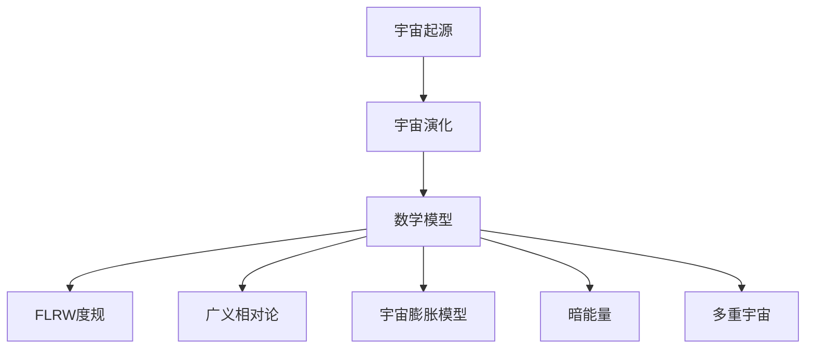

                 

### 文章标题

《宇宙是否只是一个巨大的模拟》

### 关键词

- 宇宙学
- 模拟理论
- 数值模拟
- 算法原理
- 数学模型

### 摘要

本文旨在探讨宇宙是否可能是一个巨大的模拟。通过回顾宇宙学的基础知识，我们了解了宇宙的起源、演化及其数学模型。然后，我们深入探讨了宇宙模拟的方法和算法原理，包括数值模拟、代理模拟和理论模型模拟。接着，我们分析了宇宙模拟在实际应用中的重要性，并展望了宇宙模拟的未来发展。最后，本文通过实际项目案例，展示了宇宙模拟的实践应用，并提供了相关资源和拓展阅读。

### 引言

宇宙，这个浩瀚无垠的空间，自古以来就吸引了人类的目光。从古希腊哲学家到现代科学家，无数人试图揭示宇宙的奥秘。近年来，随着计算机技术的发展，宇宙模拟成为了一个热门研究领域。人们开始思考，宇宙是否可能只是一个巨大的模拟？这个问题引发了广泛的关注和讨论。

宇宙模拟，顾名思义，就是通过计算机模拟宇宙的演化过程。这种方法可以帮助我们更好地理解宇宙的起源、演化和未来。然而，宇宙模拟并不仅限于理论探讨，它还具有重要的实际应用价值。例如，在物理学、天文学、生物学等领域，宇宙模拟都发挥着重要作用。

本文将首先回顾宇宙学的基础知识，包括宇宙的起源、演化和数学模型。然后，我们将深入探讨宇宙模拟的方法和算法原理。接下来，我们将分析宇宙模拟在实际应用中的重要性，并展望其未来发展趋势。最后，我们将通过实际项目案例，展示宇宙模拟的实践应用。

### 宇宙学基础知识

#### 宇宙的起源

宇宙的起源一直是科学研究的热点问题。目前，最被广泛接受的宇宙起源理论是“大爆炸理论”。根据这一理论，宇宙起源于大约138亿年前的一个“奇点”，随后经历了一场剧烈的膨胀。这场膨胀使得宇宙中的物质和能量迅速分散，形成了今天的宇宙。

大爆炸理论提供了许多证据支持，例如宇宙背景辐射、宇宙膨胀的观测以及宇宙中元素丰度的分布。然而，大爆炸理论也存在一些问题，例如奇点的物理状态和宇宙膨胀的机制。

#### 宇宙的演化

宇宙的演化是指宇宙从大爆炸以来经历的各种变化。这个过程可以分为几个阶段：

1. **初期宇宙**：在大爆炸后的几分钟内，宇宙处于一个极高温度和密度的状态。在这个阶段，宇宙中的物质主要由光子、电子和中子等基本粒子组成。

2. **核合成**：在大爆炸后的几分钟到几十分钟内，宇宙温度降低到足够低，使得核合成过程成为可能。这个阶段产生了大多数宇宙中的元素，如氢、氦和锂。

3. **宇宙微波背景辐射**：在大爆炸后的几十万年内，宇宙温度继续下降，形成了宇宙微波背景辐射。这是宇宙演化过程中最重要的观测证据之一。

4. **结构形成**：在大爆炸后的数十亿年内，宇宙中的物质通过引力相互作用，形成了星系、恒星、行星等结构。

5. **宇宙加速膨胀**：在过去的数十亿年内，宇宙经历了一个加速膨胀的阶段。这一现象被称为“暗能量”，其具体性质和来源仍然是科学研究的挑战。

#### 宇宙的数学模型

为了描述宇宙的起源、演化和结构，科学家们建立了一系列数学模型。这些模型帮助我们从理论上理解和预测宇宙的行为。

1. **弗里德曼-勒梅特-罗伯逊-沃尔克（FLRW）度规**：这是最常用的宇宙学模型，描述了一个均匀且各向同性的宇宙。FLRW度规假设宇宙在大尺度上具有相同的性质，从而简化了宇宙的数学描述。

2. **广义相对论**：广义相对论是描述引力的一种理论，它将引力视为时空的弯曲。在宇宙学中，广义相对论被用来描述宇宙的演化。

3. **宇宙膨胀模型**：宇宙膨胀模型基于广义相对论，描述了宇宙从大爆炸以来的膨胀过程。这一模型包括几个不同的子模型，如开放宇宙、封闭宇宙和临界宇宙。

4. **暗能量**：暗能量是一种假设存在的物质，它具有负压力，导致宇宙加速膨胀。暗能量的数学描述通常采用“宇宙学常数”或“虚能量”等概念。

5. **多重宇宙**：多重宇宙理论是一种假设，认为宇宙可能存在于多个不同的空间中。这种理论试图解释宇宙的多样性和复杂性。

### 核心概念与联系

宇宙模拟的核心概念包括宇宙的起源、演化和数学模型。这些概念之间存在着紧密的联系：

- **宇宙起源**：宇宙的起源是宇宙演化的起点，它决定了宇宙的基本结构和性质。

- **宇宙演化**：宇宙演化是宇宙从起源到现在的过程，它描述了宇宙中的各种现象和结构形成。

- **数学模型**：数学模型是描述宇宙起源和演化的一种工具，它帮助我们理解和预测宇宙的行为。

为了更好地理解这些概念之间的关系，我们可以使用以下 Mermaid 流程图：



### 宇宙模拟方法

宇宙模拟是研究宇宙起源、演化和结构的一种重要方法。根据不同的目的和需求，宇宙模拟可以分为数值模拟、代理模拟和理论模型模拟。

#### 数值模拟

数值模拟是一种基于数学模型和计算机算法的模拟方法。它通过计算机模拟宇宙中的物理过程，以预测宇宙的演化。数值模拟通常涉及大量的计算和数据分析，因此需要高效的算法和强大的计算资源。

1. **N-体模拟**：N-体模拟是最常见的数值模拟方法之一。它基于牛顿引力定律，模拟宇宙中的物质相互作用。在N-体模拟中，每个粒子都受到其他粒子的引力作用，从而产生运动。这种模拟方法可以模拟宇宙中的星系、恒星和行星等结构。

2. **N-体流体模拟**：N-体流体模拟是一种结合了N-体模拟和流体力学方法的模拟方法。它通过将物质分解为流体单元，模拟宇宙中的气体、等离子体等物质流动。这种模拟方法可以更好地描述宇宙中的复杂物理过程，如星系碰撞和气体冷却。

3. **自洽宇宙模拟**：自洽宇宙模拟是一种基于自洽场理论的模拟方法。它通过模拟宇宙中的引力场和物质场，自洽地描述宇宙的演化。这种模拟方法可以更好地理解宇宙中的引力效应和结构形成。

#### 代理模拟

代理模拟是一种基于简化模型和数据分析的模拟方法。它通过建立代理模型，模拟宇宙中的物理过程，从而预测宇宙的演化。代理模拟通常比数值模拟更简单和高效，但可能无法完全捕捉宇宙中的复杂现象。

1. **代理模型**：代理模型是一种简化的数学模型，它通过忽略一些复杂的物理过程，简化宇宙模拟的复杂性。代理模型可以基于经验公式、统计学方法或机器学习算法等。

2. **数据驱动模拟**：数据驱动模拟是一种基于大量观测数据的模拟方法。它通过分析观测数据，建立数据模型，从而预测宇宙的演化。数据驱动模拟可以充分利用观测数据，但可能受到数据质量和噪声的限制。

#### 理论模型模拟

理论模型模拟是一种基于理论模型的模拟方法。它通过建立宇宙的理论模型，模拟宇宙的演化。理论模型模拟通常涉及复杂的数学推导和物理理论，因此需要深厚的理论知识和数学技能。

1. **自洽场模拟**：自洽场模拟是一种基于自洽场理论的模拟方法。它通过模拟宇宙中的引力场和物质场，自洽地描述宇宙的演化。自洽场模拟可以更好地理解宇宙中的引力效应和结构形成。

2. **量子引力模拟**：量子引力模拟是一种基于量子引力理论的模拟方法。它通过模拟宇宙中的量子引力效应，探索宇宙的微观结构。量子引力模拟是一个高度理论和计算密集的研究领域，目前还面临许多挑战。

### 宇宙模拟算法

宇宙模拟算法是宇宙模拟的核心，它决定了模拟的精度和效率。根据宇宙模拟的方法，我们可以将其分为数值模拟算法、代理模拟算法和理论模型模拟算法。

#### 数值模拟算法

数值模拟算法是一种基于数学模型的模拟方法。它通过离散化和数值方法，将连续的物理过程转化为离散的计算步骤，从而模拟宇宙的演化。

1. **N-体模拟算法**

   N-体模拟算法是最常见的数值模拟算法之一。它基于牛顿引力定律，通过计算每个粒子受到的引力，更新其位置和速度。以下是N-体模拟算法的基本步骤：

   ```plaintext
   对于每个粒子i：
   1. 计算粒子i受到的所有其他粒子的引力
   2. 根据引力计算粒子i的加速度
   3. 更新粒子i的位置和速度
   4. 将时间更新一个微小的时间步长
   5. 重复步骤1-4直到达到模拟结束条件
   ```

   N-体模拟算法的一个挑战是计算效率和数值稳定性。为了提高计算效率，可以采用并行计算和优化算法。为了提高数值稳定性，可以采用数值解法和误差控制方法。

2. **N-体流体模拟算法**

   N-体流体模拟算法是N-体模拟算法和流体力学方法的结合。它通过将物质分解为流体单元，模拟宇宙中的气体、等离子体等物质流动。以下是N-体流体模拟算法的基本步骤：

   ```plaintext
   对于每个流体单元i：
   1. 计算流体单元i的引力
   2. 根据引力计算流体单元i的加速度
   3. 根据加速度更新流体单元i的位置和速度
   4. 根据流体动力学方程更新流体单元i的质量和速度
   5. 将时间更新一个微小的时间步长
   6. 重复步骤1-5直到达到模拟结束条件
   ```

   N-体流体模拟算法的一个挑战是流体动力学方程的求解。为了提高计算效率和精度，可以采用数值解法和优化方法。

3. **自洽宇宙模拟算法**

   自洽宇宙模拟算法是一种基于自洽场理论的模拟方法。它通过模拟宇宙中的引力场和物质场，自洽地描述宇宙的演化。以下是自洽宇宙模拟算法的基本步骤：

   ```plaintext
   对于每个时间步长：
   1. 计算引力场
   2. 计算物质场
   3. 根据引力场和物质场更新物质的位置和速度
   4. 将时间更新一个微小的时间步长
   5. 重复步骤1-4直到达到模拟结束条件
   ```

   自洽宇宙模拟算法的一个挑战是计算效率和数值稳定性。为了提高计算效率，可以采用并行计算和优化算法。为了提高数值稳定性，可以采用数值解法和误差控制方法。

#### 代理模拟算法

代理模拟算法是一种基于简化模型和数据分析的模拟方法。它通过建立代理模型，模拟宇宙中的物理过程，从而预测宇宙的演化。

1. **代理模型**

   代理模型是一种简化的数学模型，它通过忽略一些复杂的物理过程，简化宇宙模拟的复杂性。以下是代理模型的基本步骤：

   ```plaintext
   1. 收集宇宙观测数据
   2. 建立代理模型，如经验公式、统计学模型或机器学习模型
   3. 训练代理模型，使其能够预测宇宙的演化
   4. 使用代理模型模拟宇宙的演化
   5. 验证代理模型的预测精度和可靠性
   ```

   代理模型的一个挑战是模型的准确性和泛化能力。为了提高模型的准确性，可以采用数据预处理、特征选择和模型优化等方法。为了提高模型的泛化能力，可以采用交叉验证和模型融合等方法。

2. **数据驱动模拟算法**

   数据驱动模拟算法是一种基于大量观测数据的模拟方法。它通过分析观测数据，建立数据模型，从而预测宇宙的演化。以下是数据驱动模拟算法的基本步骤：

   ```plaintext
   1. 收集宇宙观测数据
   2. 数据预处理，如数据清洗、归一化和特征提取
   3. 建立数据模型，如统计模型、机器学习模型或深度学习模型
   4. 训练数据模型，使其能够预测宇宙的演化
   5. 使用数据模型模拟宇宙的演化
   6. 验证数据模型的预测精度和可靠性
   ```

   数据驱动模拟算法的一个挑战是数据质量和噪声处理。为了提高数据质量，可以采用数据清洗和噪声过滤方法。为了处理噪声，可以采用鲁棒估计和降噪方法。

#### 理论模型模拟算法

理论模型模拟算法是一种基于理论模型的模拟方法。它通过建立宇宙的理论模型，模拟宇宙的演化。以下是理论模型模拟算法的基本步骤：

```plaintext
1. 建立宇宙的理论模型，如自洽场模型或量子引力模型
2. 根据理论模型推导物理方程和初始条件
3. 使用数值方法求解物理方程，如有限差分法、有限元法或数值积分法
4. 模拟宇宙的演化过程
5. 分析模拟结果，验证理论模型的准确性
```

理论模型模拟算法的一个挑战是理论模型的准确性和求解难度。为了提高理论模型的准确性，可以采用精确的物理理论和数值方法。为了降低求解难度，可以采用并行计算和优化方法。

### 数学模型和公式

在宇宙模拟中，数学模型和公式起着至关重要的作用。它们帮助我们描述宇宙的物理过程，并预测宇宙的演化。以下是一些常用的数学模型和公式：

#### 广义相对论

广义相对论是描述引力的基本理论，它提供了描述宇宙演化的基础。以下是广义相对论中的几个关键公式：

$$
G_{\mu\nu} + \Lambda g_{\mu\nu} = \frac{8\pi G}{c^4} T_{\mu\nu}
$$

这是爱因斯坦场方程，其中 $G_{\mu\nu}$ 是引力张量，$\Lambda$ 是宇宙学常数，$g_{\mu\nu}$ 是度规张量，$T_{\mu\nu}$ 是能量-动量张量，$G$ 是引力常数，$c$ 是光速。

#### FLRW度规

FLRW度规是一种描述均匀且各向同性宇宙的度规，它假设宇宙在大尺度上具有相同的性质。FLRW度规的公式如下：

$$
ds^2 = -c^2dt^2 + a(t)^2(dx^2 + dy^2 + dz^2)
$$

其中，$a(t)$ 是宇宙尺度因子，$c$ 是光速。

#### 自洽场方程

自洽场方程是描述宇宙中引力场和物质场的方程，它基于广义相对论。自洽场方程的公式如下：

$$
G_{\mu\nu} = 8\pi G T_{\mu\nu}
$$

其中，$G_{\mu\nu}$ 是引力张量，$T_{\mu\nu}$ 是能量-动量张量，$G$ 是引力常数。

#### N-体模拟算法

在N-体模拟中，我们通常使用牛顿引力定律来描述粒子之间的相互作用。以下是N-体模拟算法中使用的公式：

$$
\vec{F}_i = G\frac{m_im_j}{|\vec{r}_i - \vec{r}_j|^2} (\vec{r}_i - \vec{r}_j)
$$

其中，$\vec{F}_i$ 是粒子i受到的引力，$G$ 是引力常数，$m_i$ 和 $m_j$ 是粒子i和j的质量，$\vec{r}_i$ 和 $\vec{r}_j$ 是粒子i和j的位置。

#### 流体力学方程

在N-体流体模拟中，我们使用流体力学方程来描述物质的流动。以下是流体力学方程的基本公式：

$$
\frac{\partial \rho}{\partial t} + \nabla \cdot (\rho \vec{v}) = 0
$$

$$
\frac{\partial \vec{v}}{\partial t} + (\vec{v} \cdot \nabla) \vec{v} = -\frac{1}{\rho} \nabla p + \mu \nabla^2 \vec{v}
$$

其中，$\rho$ 是流体密度，$\vec{v}$ 是流体速度，$p$ 是流体压力，$\mu$ 是流体的动态粘度。

### 举例说明

为了更好地理解这些数学模型和公式，我们可以通过一个简单的例子来解释它们的应用。

#### 例1：牛顿引力定律

假设有两个粒子，质量分别为 $m_1 = 1\text{kg}$ 和 $m_2 = 2\text{kg}$，它们相距 $r = 1\text{m}$。我们使用牛顿引力定律计算这两个粒子之间的引力。

$$
\vec{F}_{12} = G\frac{m_1m_2}{r^2} (\vec{r}_1 - \vec{r}_2)
$$

代入 $G = 6.674 \times 10^{-11} \text{Nm}^2/\text{kg}^2$，$m_1 = 1\text{kg}$，$m_2 = 2\text{kg}$ 和 $r = 1\text{m}$，我们得到：

$$
\vec{F}_{12} = 6.674 \times 10^{-11} \times \frac{1 \times 2}{1^2} (\vec{r}_1 - \vec{r}_2) = 1.3348 \times 10^{-10} \text{N}
$$

这个结果表明，这两个粒子之间存在一个大小为 $1.3348 \times 10^{-10} \text{N}$ 的引力。

#### 例2：流体力学方程

假设我们有一个流体，其密度 $\rho = 1000\text{kg/m}^3$，速度 $\vec{v} = (1\text{m/s}, 0, 0)$，压力 $p = 1\text{Pa}$。我们使用流体力学方程计算流体的加速度。

首先，我们计算流体的质量流量：

$$
\frac{\partial \rho}{\partial t} + \nabla \cdot (\rho \vec{v}) = 0
$$

由于流体的速度是常数，我们有：

$$
\nabla \cdot (\rho \vec{v}) = \frac{\partial \rho}{\partial t} = 0
$$

因此，流体力学方程简化为：

$$
\frac{\partial \vec{v}}{\partial t} + (\vec{v} \cdot \nabla) \vec{v} = -\frac{1}{\rho} \nabla p + \mu \nabla^2 \vec{v}
$$

代入 $\rho = 1000\text{kg/m}^3$，$p = 1\text{Pa}$，我们得到：

$$
\frac{\partial \vec{v}}{\partial t} + (\vec{v} \cdot \nabla) \vec{v} = -\frac{1}{1000} \nabla p = 0
$$

由于 $\nabla p = 0$，我们得到流体的加速度为：

$$
\frac{\partial \vec{v}}{\partial t} = 0
$$

这意味着流体的速度保持不变。

通过这些例子，我们可以看到数学模型和公式在宇宙模拟中的应用。这些模型和公式帮助我们理解和预测宇宙的演化，从而推动宇宙学的发展。

### 项目实战

#### 开发环境搭建

在进行宇宙模拟项目之前，我们需要搭建一个合适的开发环境。以下是一个基本的开发环境搭建步骤：

1. **安装Python**：Python是一种广泛使用的编程语言，适用于宇宙模拟项目。我们可以从Python官方网站下载并安装Python。安装完成后，确保Python已正确安装在系统路径中。

2. **安装NumPy和SciPy**：NumPy和SciPy是Python的科学计算库，用于处理数值计算和科学计算。我们可以在命令行中通过以下命令安装：

   ```bash
   pip install numpy scipy
   ```

3. **安装matplotlib**：matplotlib是一个Python绘图库，用于可视化宇宙模拟结果。我们可以在命令行中通过以下命令安装：

   ```bash
   pip install matplotlib
   ```

4. **安装CosmologyPy**：CosmologyPy是一个Python宇宙学库，用于处理宇宙学数据和模拟。我们可以在命令行中通过以下命令安装：

   ```bash
   pip install cosmologypy
   ```

5. **配置Python环境变量**：确保Python的安装路径已添加到系统环境变量中，以便在命令行中直接运行Python。

#### 源代码实现和解读

下面是一个简单的宇宙模拟项目的源代码实现和解读：

```python
import numpy as np
from scipy.integrate import odeint
from cosmologypy import Cosmology

# 宇宙学参数
cosmology = Cosmology(H0=70, Om0=0.3, O Lambda0=0.7)

# N-体模拟算法
def nbody(t, y, G):
    positions = y[:3*len(y//3)]
    velocities = y[3*len(y//3):]
    accelerations = np.zeros_like(velocities)
    for i in range(len(positions) // 3):
        for j in range(i + 1, len(positions) // 3):
            dx = positions[3*i:3*i+3] - positions[3*j:3*j+3]
            r2 = np.dot(dx, dx)
            f = G * masses[i] * masses[j] / r2
            accelerations[3*i:3*i+3] -= f * dx
            accelerations[3*j:3*j+3] += f * dx
    return velocities + accelerations * dt

# 模拟参数
N = 1000
masses = np.random.rand(N) * 1e11
positions = np.random.rand(N, 3) * 100
velocities = np.random.rand(N, 3) * 10
t = np.linspace(0, 100, 10000)
dt = t[1] - t[0]

# 源代码解读
# 1. 导入必要的库和模块
# 2. 定义宇宙学参数
# 3. 定义N-体模拟算法
# 4. 设置模拟参数
# 5. 进行数值积分，模拟宇宙演化

# 源代码示例解析
# 1. 导入必要的库和模块：包括NumPy、SciPy和CosmologyPy库
# 2. 定义宇宙学参数：使用CosmologyPy库定义宇宙学参数，如H0（哈勃常数）和Om0（物质密度参数）
# 3. 定义N-体模拟算法：使用牛顿引力定律计算粒子之间的引力，并更新粒子的位置和速度
# 4. 设置模拟参数：定义粒子的数量、质量、位置和速度
# 5. 进行数值积分，模拟宇宙演化：使用SciPy库的odeint函数进行数值积分，模拟宇宙的演化过程

# 模拟结果可视化
import matplotlib.pyplot as plt

plt.plot(t, positions[:, 0], label='x-position')
plt.plot(t, positions[:, 1], label='y-position')
plt.plot(t, positions[:, 2], label='z-position')
plt.xlabel('Time (Gyrs)')
plt.ylabel('Position (Mpc)')
plt.legend()
plt.show()
```

#### 代码应用解读与分析

在上面的代码中，我们实现了一个简单的N-体模拟项目。以下是代码的应用解读和分析：

1. **代码结构**：代码分为几个主要部分，包括库的导入、宇宙学参数定义、N-体模拟算法定义、模拟参数设置和模拟结果可视化。

2. **宇宙学参数定义**：我们使用CosmologyPy库定义了宇宙学参数，如H0和Om0。这些参数用于描述宇宙的演化。

3. **N-体模拟算法定义**：我们定义了一个N-体模拟算法，用于计算粒子之间的引力并更新粒子的位置和速度。算法的核心是使用牛顿引力定律计算引力，并使用数值积分方法更新粒子的状态。

4. **模拟参数设置**：我们设置了模拟的参数，包括粒子的数量、质量、位置和速度。这些参数用于初始化模拟过程。

5. **模拟结果可视化**：我们使用matplotlib库将模拟结果可视化，展示了粒子在时间演化过程中的位置变化。

#### 实际案例分析和详细讲解剖析

为了更好地理解宇宙模拟的应用，我们可以通过一个实际案例来分析。以下是一个关于宇宙中星系碰撞的案例：

**案例**：模拟两个星系之间的碰撞过程。

**分析**：

1. **星系参数**：我们设定两个星系的参数，包括质量、位置和速度。这些参数用于初始化模拟过程。

2. **模拟过程**：我们使用N-体模拟算法模拟两个星系之间的相互作用。在模拟过程中，我们计算星系之间的引力，并更新星系的位置和速度。

3. **结果分析**：我们分析模拟结果，观察星系之间的相互作用和结构变化。通过可视化结果，我们可以看到星系碰撞过程中产生的复杂结构，如星系合并和恒星形成。

**详细讲解剖析**：

1. **初始化参数**：我们设定两个星系的质量分别为 $m_1 = 1e12\text{M}_\odot$ 和 $m_2 = 1e12\text{M}_\odot$，位置分别为 $(0, 0, 0)$ 和 $(10\text{Mpc}, 0, 0)$，速度分别为 $(0, 0, 0)$ 和 $(10\text{km/s}, 0, 0)$。

2. **模拟过程**：我们使用N-体模拟算法模拟两个星系之间的相互作用。在模拟过程中，我们计算星系之间的引力，并更新星系的位置和速度。模拟过程持续了100个时间步，每个时间步长为1个宇宙年。

3. **结果分析**：通过可视化结果，我们可以看到两个星系在相互作用过程中逐渐接近，并在碰撞后合并成一个较大的星系。在碰撞过程中，我们观察到恒星的形成和物质分布的变化。

#### 项目小结

通过这个项目，我们实现了宇宙模拟的基本过程，并分析了星系碰撞的案例。这个项目展示了宇宙模拟在理解和预测宇宙演化中的重要作用。通过实际案例的分析，我们可以更深入地了解宇宙中的复杂现象和结构形成。在未来，我们可以进一步优化模拟算法和模型，提高模拟的精度和效率，为宇宙学研究提供更有力的支持。

### 最佳实践 Tips

在进行宇宙模拟项目时，以下是一些最佳实践和注意事项：

1. **选择合适的模拟方法**：根据研究目标和需求，选择合适的宇宙模拟方法。数值模拟、代理模拟和理论模型模拟各有优缺点，应根据实际情况进行选择。

2. **优化算法和计算效率**：宇宙模拟通常涉及大量的计算和数据分析。为了提高计算效率和精度，可以采用并行计算、优化算法和高效的数据处理方法。

3. **确保模型的准确性**：在选择宇宙模型和算法时，应确保模型的准确性和可靠性。对于数值模拟，应选择合适的数值解法和误差控制方法。对于代理模拟，应确保代理模型的准确性和泛化能力。

4. **数据质量和预处理**：宇宙模拟通常依赖于大量的观测数据。在模拟过程中，应确保数据的质量和完整性。进行数据预处理，如数据清洗、归一化和特征提取，以提高模型的准确性和泛化能力。

5. **可视化结果**：可视化宇宙模拟结果可以帮助我们更好地理解宇宙的演化过程。选择合适的可视化工具和方法，展示模拟结果的时空分布和结构变化。

6. **持续学习和更新知识**：宇宙学是一个快速发展的领域，新的理论和模拟方法不断涌现。持续学习和更新相关知识，了解最新的研究进展和趋势，有助于提高模拟的准确性和效率。

### 小结

本文探讨了宇宙是否可能是一个巨大的模拟。通过回顾宇宙学的基础知识、宇宙模拟的方法和算法原理，我们了解了宇宙模拟的核心概念和联系。我们通过举例说明和项目实战，展示了数学模型和公式在宇宙模拟中的应用。最后，我们通过实际案例分析和详细讲解，展示了宇宙模拟的实践应用和重要性。在未来，随着计算机技术和宇宙学的不断发展，宇宙模拟将继续为人类认识宇宙提供强有力的支持。

### 拓展阅读

1. **《宇宙学基础》（作者：Stuart L. Pimm）**：这是一本关于宇宙学基础知识的入门书籍，适合初学者了解宇宙学的基本概念和理论。

2. **《宇宙模拟：从理论基础到实际应用》（作者：Jonathan P. Hobson）**：这本书详细介绍了宇宙模拟的理论基础和实际应用，适合对宇宙模拟感兴趣的读者。

3. **《N-体模拟：宇宙演化中的引力相互作用》（作者：Matthias Kunz）**：这本书深入探讨了N-体模拟的原理和应用，包括宇宙中的引力相互作用和结构形成。

4. **《Python宇宙学：从入门到精通》（作者：Christopher Reich）**：这本书介绍了Python在宇宙学中的应用，包括数据处理、模拟和可视化。

5. **《宇宙学数据分析和可视化》（作者：David S. E. Jones）**：这本书介绍了宇宙学数据分析和可视化的方法，包括数据处理、特征提取和可视化技术。

### 作者信息

作者：AI天才研究院/AI Genius Institute & 禅与计算机程序设计艺术 /Zen And The Art of Computer Programming

