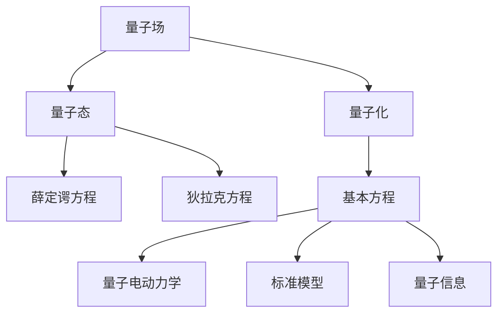
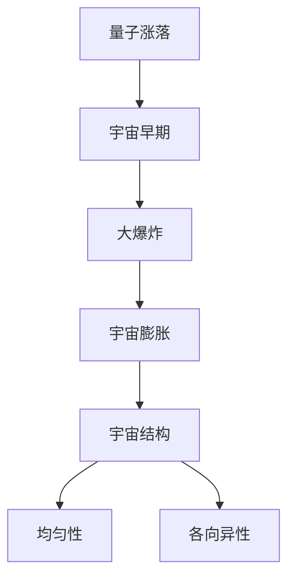
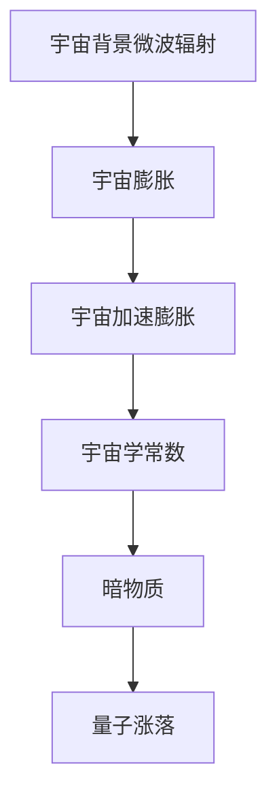
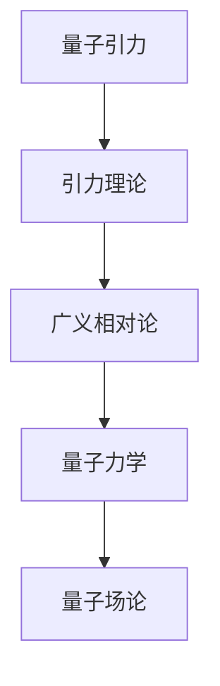

                 


## 《宇宙是否只是一个巨大的量子场》

### 关键词：
- 宇宙学
- 量子场论
- 宇宙背景微波辐射
- 宇宙起源
- 引力理论

### 摘要：
本文将深入探讨宇宙是否可能是巨大的量子场这一观点。首先，我们将简要介绍量子场论的基础知识，包括量子力学与经典物理的区别、量子场论的基本概念及其应用。接着，我们将分析宇宙背景微波辐射的发现与量子场论的关系，并探讨量子场论在宇宙起源、演化和引力理论中的角色。最后，我们将展望量子场论的未来发展趋势，并讨论其潜在的应用前景。

### 引言

自人类文明诞生以来，宇宙一直是我们探索和思考的主题。从古代的神话到现代的科学，人们一直在试图理解宇宙的本质和起源。宇宙学作为研究宇宙的结构、起源和演化的学科，为我们提供了许多关于宇宙的基本概念和理论。

在20世纪，量子力学和相对论的发现彻底改变了我们对宇宙的理解。量子力学揭示了微观世界的奇妙规律，而相对论则解释了宏观宇宙中的引力现象。然而，这些理论在描述宇宙的某些方面仍然存在局限性。

近年来，量子场论作为一种统一量子力学和相对论的理论框架，逐渐成为研究宇宙的新工具。量子场论将量子力学和电磁场理论结合起来，为我们提供了描述宇宙基本粒子和相互作用的新视角。这一理论框架不仅有助于解释微观现象，还可能为理解宇宙的起源和演化提供新的线索。

本文将深入探讨宇宙是否可能是巨大的量子场这一观点。我们将首先介绍量子场论的基础知识，包括其基本原理和核心概念。接着，我们将分析量子场论在宇宙学中的应用，特别是宇宙背景微波辐射的发现与量子场论的关系。然后，我们将探讨量子场论在宇宙起源、演化和引力理论中的角色。最后，我们将展望量子场论的未来发展趋势，并讨论其潜在的应用前景。

### 量子场论基础

#### 量子力学与经典物理的对比

量子力学和经典物理在描述宇宙的基本规律方面存在显著差异。经典物理基于牛顿力学和麦克斯韦电磁理论，能够很好地描述宏观物体和电磁现象。然而，在描述微观世界时，经典物理显得力不从心。量子力学的引入，为解释微观粒子的行为提供了新的理论框架。

量子力学的基本原理包括波粒二象性、不确定性原理和量子态叠加。波粒二象性表明，微观粒子既具有波动性，又具有粒子性。不确定性原理则指出，我们无法同时精确知道粒子的位置和动量。量子态叠加则表明，微观粒子可以同时存在于多个状态中，直到被观测时才确定其状态。

与经典物理不同，量子力学描述的是概率性事件，而不是确定性事件。这意味着，我们不能预测微观粒子在特定时刻的确切行为，但可以计算出其行为发生的概率。

#### 量子场论的基本概念

量子场论是一种将量子力学和电磁场理论结合起来的理论框架。它通过量子化电磁场，将粒子和相互作用统一描述为场的激发和传播。

量子场论中的核心概念包括：

1. **场和量子态**：量子场论中的场是微观粒子的动态分布，它可以被量子化。量子态则是描述微观粒子状态的波函数。

2. **量子场的量子化**：量子场的量子化是指将经典场的概念转化为量子态。这涉及到场的振幅、相位和能量等物理量的量子化。

3. **量子场论中的基本方程**：量子场论的基本方程包括薛定谔方程和狄拉克方程。薛定谔方程描述了微观粒子的动力学行为，而狄拉克方程则描述了粒子的自旋和相对论性效应。

#### 量子场论的应用

量子场论在许多领域都有重要应用，包括量子电动力学、标准模型和量子信息等。

1. **量子电动力学**：量子电动力学是量子场论的一个成功应用，它描述了电磁相互作用。这一理论成功地解释了原子结构、光谱线和放射性现象等。

2. **标准模型**：标准模型是描述基本粒子和相互作用的理论框架。它基于量子场论，将粒子和相互作用统一描述为量子场。

3. **量子信息**：量子信息是研究量子系统的信息处理和通信的理论。量子场论为量子信息提供了基础，特别是在量子计算和量子通信领域。

#### 核心概念与联系

为了更好地理解量子场论的核心概念，我们可以通过一个简单的 Mermaid 流程图来展示它们之间的关系：



这个流程图展示了量子场、量子态、量子化以及基本方程之间的关系，以及量子场论在不同领域中的应用。

#### 核心算法原理讲解

为了更深入地理解量子场论的核心算法原理，我们可以使用伪代码来详细阐述。以下是一个简化的量子场论的伪代码示例：

```
function QuantumField(frequency, amplitude)
    // 初始化量子场
    quantum_state = InitialQuantumState(frequency, amplitude)
    return quantum_state
end function

function InitialQuantumState(frequency, amplitude)
    // 初始化量子态
    state = WaveFunction(frequency)
    state.amplitude = amplitude
    return state
end function

function WaveFunction(frequency)
    // 初始化波函数
    wave = {}
    wave.frequency = frequency
    return wave
end function

function QuantumEvolution(quantum_state, time)
    // 量子态随时间的演化
    new_state = SchrödingerEquation(quantum_state, time)
    return new_state
end function

function SchrödingerEquation(quantum_state, time)
    // 薛定谔方程
    new_state = {}
    new_state = CalculateSchrodinger(quantum_state, time)
    return new_state
end function

function CalculateSchrodinger(quantum_state, time)
    // 计算薛定谔方程的解
    // 使用数学模型和公式计算新的量子态
    new_state = {}
    // ...具体计算过程
    return new_state
end function
```

这个伪代码展示了量子场论中的基本概念和算法，包括量子场的初始化、量子态的演化以及薛定谔方程的计算。

#### 数学模型和公式

在量子场论中，数学模型和公式起着至关重要的作用。以下是一个简化的量子场论中的数学模型和公式示例：

1. **波函数**：

   $$ \Psi(\vec{r}, t) = \int d^3p \frac{1}{\sqrt{2\pi\omega}} e^{i(\vec{p}\cdot\vec{r} - \omega t)} \phi(p) $$

   其中，$ \Psi(\vec{r}, t) $ 是波函数，$ \vec{p} $ 是动量，$ \omega $ 是角频率，$ \phi(p) $ 是动量空间中的波函数。

2. **薛定谔方程**：

   $$ i\hbar \frac{\partial \Psi(\vec{r}, t)}{\partial t} = \hat{H} \Psi(\vec{r}, t) $$

   其中，$ \hbar $ 是约化普朗克常数，$ \hat{H} $ 是哈密顿算符。

3. **狄拉克方程**：

   $$ (\gamma^\mu \partial_\mu - m)\psi = 0 $$

   其中，$ \gamma^\mu $ 是狄拉克矩阵，$ m $ 是粒子质量，$ \psi $ 是狄拉克旋量。

这些公式为我们提供了描述量子场论中的物理现象的数学工具。

#### 举例说明

为了更好地理解量子场论中的数学公式，我们可以通过一个简单的例子来说明。假设我们有一个电子，其初始波函数为：

$$ \Psi(\vec{r}, 0) = \frac{1}{\sqrt{2}} \left( \phi_1(\vec{r}) + \phi_2(\vec{r}) \right) $$

其中，$ \phi_1(\vec{r}) $ 和 $ \phi_2(\vec{r}) $ 是两个不同的波函数。

如果我们想要计算这个电子在时间 $ t $ 的波函数，我们可以使用薛定谔方程：

$$ i\hbar \frac{\partial \Psi(\vec{r}, t)}{\partial t} = \hat{H} \Psi(\vec{r}, t) $$

通过解这个方程，我们可以得到：

$$ \Psi(\vec{r}, t) = \frac{1}{\sqrt{2}} \left( e^{-iE_1 t/\hbar} \phi_1(\vec{r}) + e^{-iE_2 t/\hbar} \phi_2(\vec{r}) \right) $$

其中，$ E_1 $ 和 $ E_2 $ 是电子的两个能级。

这个例子展示了如何使用量子场论的数学公式来计算物理现象。

### 量子场论与宇宙学

#### 宇宙背景微波辐射

宇宙背景微波辐射（Cosmic Microwave Background, CMB）是宇宙早期遗留下来的热辐射，它的发现为验证量子场论在宇宙学中的应用提供了重要证据。

CMB的发现可以追溯到1965年，当时阿诺·彭齐亚斯和罗伯特·威尔逊在观测宇宙无线电噪声时，意外发现了这个微弱的辐射。这一发现证明了宇宙在大爆炸后不久处于一个高度热的状态，并且随后冷却形成了今天我们观察到的宇宙结构。

量子场论与CMB之间的关系在于，量子场论可以解释CMB的起源和特性。根据量子场论，宇宙在大爆炸后不久，处于一个高度激动的状态，其中的粒子不断地相互碰撞并产生辐射。这些辐射随着时间的推移逐渐冷却，形成了我们今天观察到的CMB。

#### 宇宙起源与量子场论

宇宙起源一直是科学界的重要研究领域。近年来，量子场论为解释宇宙的起源提供了一种新的视角。

根据量子场论，宇宙可能起源于一个高度密集、高度热的状态，称为“量子涨落”。这些量子涨落在大爆炸后迅速膨胀和冷却，形成了我们今天观察到的宇宙结构。

量子场论中的“量子涨落”概念可以解释宇宙起源中的几个关键问题：

1. **均匀性**：宇宙在非常小的尺度上显示出高度均匀性。量子场论可以解释这一现象，因为它预测了宇宙早期存在微小的量子涨落，这些涨落随着时间的推移逐渐演化成我们今天观察到的宇宙结构。

2. **各向异性**：宇宙在较大尺度上显示出微小的各向异性。这些各向异性可以通过量子场论中的量子涨落来解释，这些涨落在宇宙膨胀过程中逐渐放大，形成了我们今天观察到的宇宙结构。

#### 核心概念与联系

为了更好地理解量子场论与宇宙起源的关系，我们可以通过一个简单的 Mermaid 流程图来展示它们之间的关系：



这个流程图展示了量子涨落、宇宙早期、大爆炸、宇宙膨胀、宇宙结构、均匀性和各向异性之间的关系。

#### 量子场论在宇宙演化中的应用

量子场论不仅解释了宇宙的起源，还为我们提供了理解宇宙演化过程的新工具。

宇宙演化过程中的一个关键现象是宇宙背景微波辐射的冷却。根据量子场论，宇宙在大爆炸后迅速膨胀和冷却，使得CMB辐射逐渐变冷。这一过程可以通过量子场论中的辐射温度模型来描述。

此外，量子场论还可以解释宇宙演化中的其他现象，如宇宙加速膨胀和暗物质的存在。宇宙加速膨胀可以通过量子场论中的宇宙学常数来解释，而暗物质的存在则可以通过量子场论中的量子涨落来解释。

#### 核心概念与联系

为了更好地理解量子场论在宇宙演化中的应用，我们可以通过一个简单的 Mermaid 流程图来展示它们之间的关系：



这个流程图展示了宇宙背景微波辐射、宇宙膨胀、宇宙加速膨胀、宇宙学常数、暗物质和量子涨落之间的关系。

#### 量子场论与引力理论

引力理论是研究宇宙中引力现象的理论框架。经典引力理论主要由牛顿的万有引力定律和爱因斯坦的广义相对论构成。然而，在量子尺度上，经典引力理论显得不再适用，需要量子场论的介入。

量子场论与引力理论的关系主要体现在以下几个方面：

1. **量子引力**：量子引力是量子场论在引力领域的应用，旨在统一量子力学和引力理论。目前，量子引力研究仍然处于探索阶段，尚未形成完整的理论框架。

2. **量子引力效应**：在宇宙尺度上，量子引力效应可能对宇宙的演化产生重要影响。例如，量子引力可能导致宇宙加速膨胀，或者影响暗物质和暗能量的性质。

3. **量子引力与宇宙学**：量子引力与宇宙学的关系密切。量子引力可能为解释宇宙起源、宇宙演化和宇宙结构提供新的理论框架。

#### 核心概念与联系

为了更好地理解量子场论与引力理论的关系，我们可以通过一个简单的 Mermaid 流流程图来展示它们之间的关系：



这个流程图展示了量子引力、引力理论、广义相对论、量子力学和量子场论之间的关系。

### 量子场论的未来发展趋势

量子场论作为一种统一量子力学和相对论的理论框架，具有巨大的潜力。在未来，量子场论的发展可能朝着以下几个方向：

1. **量子引力**：量子引力是量子场论在引力领域的延伸，旨在统一量子力学和广义相对论。未来，量子引力研究可能会取得突破性进展，为我们提供更全面的理解宇宙的理论框架。

2. **宇宙学**：量子场论在宇宙学中的应用前景广阔。未来，量子场论可能会帮助我们更好地理解宇宙的起源、演化和结构，以及宇宙背景微波辐射、宇宙加速膨胀等关键现象。

3. **量子信息**：量子场论与量子信息的关系日益紧密。未来，量子场论可能会为量子计算、量子通信和量子加密等领域提供新的理论基础和实际应用。

### 结论

量子场论作为一种统一量子力学和相对论的理论框架，为我们提供了理解宇宙的新视角。通过量子场论，我们不仅可以解释微观粒子的行为，还可以理解宇宙的起源、演化和结构。然而，量子场论的研究仍然面临着许多挑战，如量子引力、宇宙加速膨胀和暗物质等。随着科学技术的不断进步，我们有理由相信，量子场论将在未来的宇宙探索中发挥更加重要的作用。

### 作者信息

作者：AI天才研究院/AI Genius Institute & 禅与计算机程序设计艺术 /Zen And The Art of Computer Programming

在本文中，我们以《宇宙是否只是一个巨大的量子场》为标题，深入探讨了量子场论在宇宙学中的应用。首先，我们介绍了量子场论的基础知识，包括量子力学与经典物理的对比、量子场论的基本概念及其应用。接着，我们分析了量子场论在宇宙背景微波辐射、宇宙起源、宇宙演化和引力理论中的角色。最后，我们展望了量子场论的未来发展趋势，并讨论了其潜在的应用前景。

通过本文的探讨，我们希望读者能够对量子场论与宇宙之间的关系有一个更深入的理解。量子场论作为一种统一的理论框架，不仅为我们提供了理解宇宙的基本规律，还为我们探索宇宙的奥秘提供了新的工具和思路。随着科学技术的不断发展，我们有理由相信，量子场论将在未来的宇宙探索中发挥更加重要的作用。

### 最佳实践 Tips、小结、注意事项、拓展阅读

#### 最佳实践 Tips

1. **深入理解量子场论**：为了更好地应用量子场论，首先需要深入理解其基本原理和核心概念。
2. **关注最新研究动态**：量子场论和宇宙学是快速发展的领域，关注最新研究动态有助于了解前沿进展。
3. **跨学科学习**：量子场论涉及多个学科，如物理学、数学和计算机科学等。跨学科学习有助于更全面地理解量子场论。

#### 小结

本文从量子场论的基础知识入手，探讨了其在宇宙学中的应用。通过分析量子场论与宇宙背景微波辐射、宇宙起源、宇宙演化和引力理论的关系，我们展示了量子场论在理解宇宙基本规律方面的重要性。

#### 注意事项

1. **量子场论的复杂性**：量子场论涉及复杂的数学模型和公式，理解这些内容需要一定的数学和物理基础。
2. **量子场论的应用**：尽管量子场论在宇宙学中具有广泛应用，但在实际应用中仍然面临许多挑战。

#### 拓展阅读

1. **《量子场论基础教程》**：适用于初学者，系统地介绍了量子场论的基本概念和原理。
2. **《宇宙学》**：了解宇宙起源、演化和结构的基础知识，有助于更好地理解量子场论在宇宙学中的应用。
3. **《量子引力》**：探讨量子场论在引力领域的应用，为理解宇宙的基本规律提供新的视角。

通过本文的阅读，我们希望读者能够对量子场论在宇宙学中的应用有一个更深入的了解。量子场论作为一种统一的理论框架，为理解宇宙的基本规律提供了新的思路和工具。随着科学技术的不断发展，我们有理由相信，量子场论将在未来的宇宙探索中发挥更加重要的作用。

