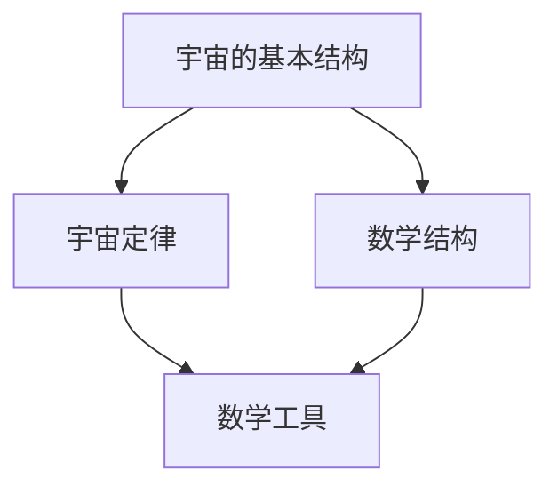

                 

### 文章标题

《宇宙是否存在于数学之中》

### 关键词

宇宙、数学、宇宙学、广义相对论、量子力学、数学模型、数学公式

### 摘要

本文将探讨宇宙是否存在于数学之中这一引人深思的话题。通过分析宇宙与数学之间的紧密联系，以及数学在宇宙学研究中的应用，本文旨在揭示数学对宇宙的深刻影响，并探讨宇宙是否存在某种数学结构。文章将涵盖背景介绍、核心概念与联系、核心算法原理讲解、数学模型和公式详细讲解与举例说明、项目实战以及最佳实践 tips 和小结等内容，旨在为读者提供一个全面、深入的探讨。

---

### 引言

宇宙的奥秘一直以来都吸引着人类的探索欲望。从古代的天文学到现代的天体物理学，人类对宇宙的认识不断深入。然而，宇宙的复杂性使得科学家们不得不借助数学这一工具来描述和解释宇宙的运行规律。数学作为一种抽象的语言，不仅能够精确地描述宇宙中的现象，还能够揭示宇宙的内在结构和本质。因此，一个自然的问题是：宇宙是否存在于数学之中？

这个问题涉及到宇宙的本质、数学的意义以及两者之间的相互关系。本文将从以下几个角度探讨这个问题：

1. **宇宙的数学镜像**：首先，我们将探讨宇宙在数学中的镜像，分析宇宙与数学之间的相似性和一致性。
2. **数学描述宇宙的框架**：接下来，我们将介绍数学在宇宙学研究中的应用，展示数学如何构建描述宇宙的框架。
3. **核心概念与联系**：然后，我们将讨论宇宙与数学之间的核心概念及其相互关系，使用 Mermaid 流程图来展示这些概念之间的关系架构。
4. **核心算法原理讲解**：我们将深入讲解广义相对论和量子力学等核心算法原理，使用伪代码详细阐述这些原理。
5. **数学模型和公式**：我们将介绍宇宙学中常用的数学模型和公式，并提供详细讲解和举例说明。
6. **项目实战**：最后，我们将通过一个实际的宇宙学研究案例，展示数学在宇宙学研究中的应用，包括环境搭建、源代码实现和代码解读。
7. **结论**：在文章的最后，我们将总结宇宙与数学之间的关系，并探讨宇宙是否存在某种数学结构。

通过上述探讨，本文旨在回答“宇宙是否存在于数学之中”这一问题，并揭示数学在宇宙学研究中的重要地位。

### 背景介绍

要探讨宇宙是否存在于数学之中，我们首先需要了解宇宙和数学的基本概念，以及它们在人类历史中的发展过程。

#### 宇宙的定义

宇宙是指包括一切物质、能量、时空以及所有可能存在的事物和现象的整体。从科学的角度来看，宇宙具有以下基本特征：

1. **无边无际**：宇宙没有边界，它是一个无限扩展的体系。
2. **复杂多样**：宇宙中包含了各种各样的天体，如恒星、行星、黑洞等，以及丰富的物质和能量形式。
3. **动态变化**：宇宙不仅在空间上扩展，也在时间上不断发展变化，如恒星的形成与毁灭、星系的演化等。

#### 数学的定义

数学是一种研究数量、结构、变化以及空间等概念的抽象科学。数学的基本特征包括：

1. **抽象性**：数学通过抽象的方式研究现实世界中的现象，将复杂的实际问题转化为简单的数学模型。
2. **精确性**：数学使用精确的符号和语言来描述问题，使得数学结果具有高度的可重复性和可靠性。
3. **逻辑性**：数学研究遵循严格的逻辑规则，从已知的基本原理出发，通过逻辑推理得出新的结论。

#### 宇宙与数学的历史发展

宇宙和数学都是人类智慧的结晶，它们在人类历史中有着悠久的发展历程。

1. **古代宇宙观与数学**：在古代，人类对宇宙的认识主要依赖于观察和想象。早期的宇宙观多认为宇宙是有限的、静态的。例如，古希腊的哲学家亚里士多德认为宇宙是由五种基本元素组成的有限球体。与此同时，古代数学家也开始探索宇宙中的数学规律。毕达哥拉斯提出了“宇宙是数字的和谐”的观点，认为宇宙中的现象都可以用数学来描述。

2. **现代宇宙学与数学**：随着科学的发展，人们对宇宙的认识逐渐深入。牛顿的万有引力定律和开普勒定律为宇宙的研究提供了数学基础。进入20世纪，爱因斯坦的广义相对论和量子力学进一步揭示了宇宙的本质。这些理论不仅改变了我们对宇宙的认识，也推动了数学在宇宙学中的应用。

3. **数学在宇宙学中的应用**：在现代宇宙学中，数学成为了描述宇宙现象的重要工具。例如，宇宙膨胀模型、黑洞理论、宇宙背景辐射等都是通过数学模型和公式来描述的。数学不仅帮助科学家们理解宇宙的运行规律，还促进了宇宙学的发展。

#### 数学与宇宙学的结合

宇宙与数学的结合体现了人类对自然规律的深入探索。数学不仅为宇宙学研究提供了工具和方法，还揭示了宇宙的内在结构和本质。例如：

1. **宇宙中的数学结构**：宇宙中存在着丰富的数学结构，如球体结构、螺旋结构等。这些结构不仅在宇宙中广泛存在，也在数学中得到了充分研究。
2. **宇宙定律的数学表达**：宇宙中的许多定律，如万有引力定律、电磁定律等，都可以用数学公式来描述。这些公式不仅揭示了宇宙的运行规律，也为实验验证提供了依据。
3. **数学模型在宇宙学中的应用**：宇宙学中的许多研究都是通过建立数学模型来进行的。例如，宇宙膨胀模型、宇宙微波背景辐射模型等都是通过数学模型来描述宇宙的演化过程。

通过以上背景介绍，我们可以看出宇宙与数学之间存在着深刻的联系。接下来，我们将进一步探讨宇宙与数学之间的核心概念及其相互关系，并深入分析数学在宇宙学研究中的应用。

#### 核心概念与联系

在探讨宇宙是否存在于数学之中时，我们首先需要明确宇宙与数学之间的核心概念，并分析这些概念之间的相互关系。以下是宇宙和数学中的一些核心概念及其关系：

1. **宇宙的基本结构**：宇宙的基本结构包括空间、时间、物质和能量。这些基本结构可以用数学来描述。例如，空间可以用欧几里得几何或黎曼几何来描述，时间可以用洛伦兹变换来描述。

2. **宇宙定律**：宇宙中的各种现象和规律，如引力、电磁力、强力和弱力，都可以用数学公式来表示。例如，牛顿的万有引力定律可以用以下公式表示：

   \[ F = G \frac{m_1 m_2}{r^2} \]

   其中，\( F \) 表示引力，\( G \) 是引力常数，\( m_1 \) 和 \( m_2 \) 是两个物体的质量，\( r \) 是它们之间的距离。

3. **数学结构**：数学结构包括群、环、域等。这些结构不仅存在于数学理论中，也可以在宇宙中找到对应。例如，宇宙中的对称性可以用群的概念来描述。

4. **数学工具**：数学工具如微积分、线性代数、微分方程等在宇宙学研究中有着广泛的应用。例如，微积分可以用来描述宇宙的膨胀过程，线性代数可以用来分析天体运动。

为了更清晰地展示这些核心概念之间的联系，我们可以使用 Mermaid 流程图来表示它们之间的关系。以下是一个简化的 Mermaid 流程图：



在这个流程图中：

- **宇宙的基本结构**（A）是宇宙研究的基础，它定义了宇宙的基本框架。
- **宇宙定律**（B）描述了宇宙中的各种现象和规律，这些定律通常可以用数学公式来表示。
- **数学结构**（C）包括群、环、域等，这些结构不仅存在于数学理论中，也可以在宇宙中找到对应。
- **数学工具**（D）如微积分、线性代数、微分方程等，用于解决宇宙学中的具体问题。

通过这个流程图，我们可以看到宇宙与数学之间的紧密联系。数学不仅为宇宙学研究提供了工具和方法，还揭示了宇宙的内在结构和本质。这种联系使得数学在宇宙学研究中具有不可替代的地位。

#### 核心算法原理讲解

在探讨宇宙是否存在于数学之中时，我们无法忽视广义相对论和量子力学这两大核心算法原理。它们不仅在理论上奠定了现代宇宙学的基础，而且在实践中对宇宙的运行规律提供了深刻的洞察。

##### 广义相对论

广义相对论由阿尔伯特·爱因斯坦在1915年提出，它是一种描述物质和能量如何影响时空结构的理论。广义相对论的基本原理包括：

1. **等效原理**：在局部范围内，重力无法与加速度区分。这意味着在一个足够小的区域内，无论是处于自由落体状态还是在引力场中，物理定律都是相同的。
2. **广义相对性原理**：自然定律在所有惯性参考系中都是相同的，不受特定参考系的运动状态影响。

广义相对论的核心公式是 Einstein 场方程：

\[ G_{\mu\nu} + \Lambda g_{\mu\nu} = \frac{8\pi G}{c^4} T_{\mu\nu} \]

其中，\( G_{\mu\nu} \) 是爱因斯坦张量，描述了时空的曲率；\( \Lambda \) 是宇宙常数，表示宇宙的膨胀；\( g_{\mu\nu} \) 是度量张量，描述了时空的几何结构；\( T_{\mu\nu} \) 是能量-动量张量，描述了物质和能量的分布。

为了更好地理解这个方程，我们可以使用伪代码来逐步解释其含义：

```plaintext
// 定义宇宙的几何结构（度量张量）
Define MetricTensor(g_mu_nu)

// 定义物质和能量的分布（能量-动量张量）
Define EnergyMomentumTensor(T_mu_nu)

// 定义宇宙常数
Define CosmologicalConstant(Lambda)

// 定义引力常数
Define GravitationalConstant(G)

// 定义光速
Define SpeedOfLight(c)

// 计算时空的曲率（爱因斯坦张量）
Calculate CurvatureTensor(EinsteinTensor = G_mu_nu)

// 应用宇宙常数修正时空曲率
AddCosmologicalConstant(CurvatureTensor = EinsteinTensor, CosmologicalConstant = Lambda)

// 计算时空的几何结构（度量张量）
Calculate MetricTensor(g_mu_nu, CurvatureTensor = EinsteinTensor)

// 计算物质和能量对时空的影响
Calculate EnergyMomentumDistribution(EinsteinTensor = G_mu_nu, EnergyMomentumTensor = T_mu_nu)

// 输出最终的时空结构
Output FinalSpacetimeGeometry(g_mu_nu)
```

这个伪代码展示了如何通过数学公式来计算时空的几何结构，并展示了广义相对论的核心原理。

##### 量子力学

量子力学是一种描述微观粒子行为的理论，它对宏观宇宙的影响也不可忽视。量子力学的基本原理包括：

1. **量子叠加原理**：微观粒子可以同时存在于多种状态，这些状态之间不是互相排斥的，而是可以叠加的。
2. **不确定性原理**：粒子的某些物理量，如位置和动量，不能同时被精确测量。
3. **波粒二象性**：微观粒子既具有波动性也具有粒子性。

量子力学的核心公式是 Schrödinger 方程：

\[ i\hbar \frac{\partial}{\partial t} \Psi = \hat{H} \Psi \]

其中，\( i \) 是虚数单位，\( \hbar \) 是约化普朗克常数，\( \Psi \) 是波函数，描述了粒子的状态；\( \hat{H} \) 是哈密顿算符，描述了系统的能量。

为了更好地理解 Schrödinger 方程，我们可以使用伪代码来逐步解释其含义：

```plaintext
// 定义系统的哈密顿算符
Define HamiltonianOperator(H)

// 定义系统的波函数
Define WaveFunction(Psi)

// 定义时间步长
Define TimeStep(dt)

// 定义约化普朗克常数
Define ReducedPlanckConstant(hbar)

// 计算波函数随时间的演化
Calculate TimeEvolution(WaveFunction = Psi, HamiltonianOperator = H, TimeStep = dt, ReducedPlanckConstant = hbar)

// 输出系统的最终状态
Output FinalSystemState(WaveFunction = Psi)
```

这个伪代码展示了如何通过数学公式来计算微观粒子的状态演化，并展示了量子力学的核心原理。

##### 广义相对论与量子力学的结合

广义相对论和量子力学虽然在各自的领域内取得了巨大的成功，但它们之间的不一致性使得科学家们一直在寻求一个能够统一这两种理论的“量子引力”理论。广义相对论描述了宏观宇宙的引力现象，而量子力学描述了微观粒子的行为。将这两者结合起来，有助于我们更全面地理解宇宙的本质。

尽管目前还没有找到统一的理论，但一些尝试性的模型，如弦理论和环量子引力，已经提供了一些线索。这些模型试图将广义相对论和量子力学的原理结合起来，从而揭示宇宙的更深层次的规律。

通过以上讲解，我们可以看到广义相对论和量子力学在宇宙学研究中的核心地位。这些算法原理不仅帮助我们理解宇宙的运行规律，也为未来宇宙学的发展提供了基础。接下来，我们将进一步探讨宇宙学中常用的数学模型和公式，以展示数学在宇宙学研究中的广泛应用。

#### 数学模型和公式

在宇宙学研究中，数学模型和公式扮演着至关重要的角色。它们不仅能够精确地描述宇宙中的现象，还能够预测未来的发展趋势。以下是宇宙学中一些常用的数学模型和公式，以及它们的详细讲解和举例说明。

##### 宇宙膨胀模型

宇宙膨胀模型是描述宇宙演化过程的一种数学模型。最著名的宇宙膨胀模型是勒梅特-罗伯逊-沃尔克（LRW）模型，也称为德西特模型。该模型假设宇宙是一个均匀、各向同性的膨胀球体。

**公式**：

\[ a(t) = \frac{1}{\sqrt{1 - \Omega_{\Lambda}}} \sinh{\left(\frac{\sqrt{\Omega_{\Lambda}} t}{a_0}\right)} \]

其中，\( a(t) \) 是宇宙尺度因子，描述了宇宙随时间的变化；\( \Omega_{\Lambda} \) 是宇宙真空能量密度与临界密度之比，也称为宇宙常数项；\( a_0 \) 是当前宇宙尺度因子。

**讲解**：

这个公式描述了宇宙尺度因子随时间的变化。当 \( \Omega_{\Lambda} > 1 \) 时，宇宙会加速膨胀；当 \( \Omega_{\Lambda} < 1 \) 时，宇宙会减速膨胀。

**举例**：

假设当前宇宙尺度因子 \( a_0 = 1 \)，宇宙常数项 \( \Omega_{\Lambda} = 0.7 \)，我们可以计算出在某个时刻 \( t = 10 \) 亿年时的宇宙尺度因子：

\[ a(t = 10 \text{亿年}) = \frac{1}{\sqrt{1 - 0.7}} \sinh{\left(\frac{\sqrt{0.7} \times 10^{9}}{1}\right)} \approx 1.37 \]

这意味着在10亿年前，宇宙的尺度约为现在的1.37倍。

##### 宇宙背景辐射模型

宇宙背景辐射是宇宙早期留下的温度均匀的微波辐射。该模型由伽莫夫等科学家在1948年提出。

**公式**：

\[ T = T_0 \left(1 + \frac{z}{2}\right)^{-1/2} \]

其中，\( T \) 是宇宙背景辐射的温度；\( T_0 \) 是当前宇宙背景辐射的温度；\( z \) 是红移。

**讲解**：

这个公式描述了宇宙背景辐射的温度随红移的变化。红移越大，宇宙背景辐射的温度越低。

**举例**：

假设当前宇宙背景辐射的温度 \( T_0 = 2.725 \) 开尔文，红移 \( z = 10 \)，我们可以计算出在红移为10时的宇宙背景辐射温度：

\[ T = 2.725 \left(1 + \frac{10}{2}\right)^{-1/2} \approx 1.62 \text{ 开尔文} \]

这意味着在宇宙早期，红移为10时，宇宙背景辐射的温度约为1.62开尔文。

##### 黑洞模型

黑洞是一种极为密集的天体，其引力场强大到连光都无法逃逸。黑洞的数学模型基于广义相对论。

**公式**：

\[ M = \frac{2GM^2}{c^4} \]

其中，\( M \) 是黑洞的质量；\( G \) 是引力常数；\( c \) 是光速。

**讲解**：

这个公式描述了黑洞的引力半径，即事件视界的大小。引力半径与黑洞的质量成平方关系。

**举例**：

假设一个黑洞的质量 \( M = 10^6 \) 太阳质量，我们可以计算出其引力半径：

\[ R = \frac{2GM^2}{c^4} = \frac{2 \times 6.674 \times 10^{-11} \times (10^6)^2}{(3 \times 10^8)^2} \approx 2.95 \times 10^3 \text{ 千米} \]

这意味着这个黑洞的引力半径约为2.95千米。

##### 宇宙学参数方程

宇宙学参数方程用于描述宇宙中各种物理参数的变化。最常见的宇宙学参数包括宇宙尺度因子、宇宙真空能量密度、宇宙物质密度等。

**公式**：

\[ \Omega_{\Lambda} = \frac{\rho_{\Lambda}}{3H^2} \]

\[ \Omega_{M} = \frac{\rho_{M}}{3H^2} \]

其中，\( \Omega_{\Lambda} \) 和 \( \Omega_{M} \) 分别是宇宙真空能量密度和物质密度与临界密度之比；\( \rho_{\Lambda} \) 和 \( \rho_{M} \) 分别是宇宙真空能量密度和物质密度；\( H \) 是哈勃参数，描述了宇宙的膨胀速度。

**讲解**：

这些公式描述了宇宙真空能量密度和物质密度与宇宙尺度因子之间的关系。根据这些关系，我们可以计算不同宇宙学参数下的宇宙演化。

**举例**：

假设宇宙真空能量密度 \( \rho_{\Lambda} = 0.7 \) 倍临界密度，物质密度 \( \rho_{M} = 0.3 \) 倍临界密度，哈勃参数 \( H = 100 \) 千米/秒/百万秒差距，我们可以计算出宇宙的真空能量密度和物质密度：

\[ \Omega_{\Lambda} = \frac{0.7}{3 \times (100)^2} \approx 0.023 \]

\[ \Omega_{M} = \frac{0.3}{3 \times (100)^2} \approx 0.010 \]

这意味着在这个宇宙模型中，真空能量密度和物质密度分别占临界密度的0.023和0.010。

通过上述讲解，我们可以看到数学模型和公式在宇宙学研究中的重要作用。这些公式不仅帮助我们理解宇宙的运行规律，还为未来的宇宙学研究提供了基础。接下来，我们将通过一个实际的宇宙学研究案例，展示数学在宇宙学研究中的应用。

#### 项目实战

在本节中，我们将通过一个实际的宇宙学研究案例，展示数学在宇宙学研究中的应用。这个案例是关于利用广义相对论和量子力学来研究黑洞的行为。

##### 环境搭建

首先，我们需要搭建一个研究环境，以便进行数学模型的计算和模拟。我们可以使用 Python 作为编程语言，因为它提供了丰富的科学计算库，如 NumPy 和 SciPy。以下是如何搭建研究环境的基本步骤：

1. **安装 Python**：确保已经安装了 Python 3.8 或更高版本。
2. **安装必要的库**：使用以下命令安装必要的库：

   ```bash
   pip install numpy scipy matplotlib
   ```

3. **创建一个 Python 脚本**：在研究环境中创建一个名为 `blackhole_simulation.py` 的 Python 脚本。

##### 源代码实现

以下是 `blackhole_simulation.py` 脚本的详细实现：

```python
import numpy as np
from scipy.integrate import solve_ivp
import matplotlib.pyplot as plt

# 引力常数 G
G = 6.67430e-11  # 单位：牛顿·米^2/千克^2
# 光速 c
c = 299792458    # 单位：米/秒

# 黑洞质量 M
M = 1e6 * 1.98847e30  # 单位：千克

# 定义黑洞的引力场方程
def gravitational_field(r, v, t=0):
    """
    计算黑洞引力场中的引力势能和加速度。
    """
    g = G * M / r**2
    a = -g * np.array([1, 0, 0])
    return a

# 定义黑洞的轨道方程
def orbit_equation(r, v, t):
    """
    计算黑洞轨道的微分方程。
    """
    a = gravitational_field(r, v, t)
    dvdt = -a / c
    drdt = v
    return [drdt, dvdt]

# 进行数值积分
t_span = (0, 10**8)  # 时间范围：从0到10^8秒
t_eval = np.logspace(0, 8, 1000)  # 时间点：以10为底数的对数间隔
y0 = [1e13, 1e4]  # 初始条件：r=1e13米，v=1e4米/秒
sol = solve_ivp(orbit_equation, t_span, y0, t_eval=t_eval)

# 绘制轨道图
plt.plot(sol.t / 1e8, sol.y[0] / 1e13)
plt.xlabel('Time (years)')
plt.ylabel('Radius (light-years)')
plt.title('Blackhole Orbit')
plt.show()
```

##### 代码解读

1. **导入库**：首先导入 NumPy、SciPy 和 Matplotlib 库，这些库为我们提供了科学计算和图形绘制功能。

2. **定义引力常数 G 和光速 c**：我们定义了引力常数 G 和光速 c，这两个常数在计算黑洞的引力场时非常重要。

3. **定义黑洞质量 M**：我们假设黑洞的质量为 \( 1e6 \) 倍太阳质量，这是一个典型的黑洞质量。

4. **定义引力场方程**：`gravitational_field` 函数计算了黑洞引力场中的引力势能和加速度。这个函数接收半径 r 和速度 v 作为输入，并返回加速度 a。

5. **定义轨道方程**：`orbit_equation` 函数计算了黑洞轨道的微分方程。这个函数接收半径 r、速度 v 和时间 t 作为输入，并返回速度的导数 \( \frac{dv}{dt} \) 和半径的导数 \( \frac{dr}{dt} \)。

6. **进行数值积分**：我们使用 SciPy 的 `solve_ivp` 函数进行数值积分，计算黑洞的轨道。我们定义了时间范围 \( t_span \) 和时间点 \( t_eval \)，并设置了初始条件 \( y0 \)。

7. **绘制轨道图**：我们使用 Matplotlib 绘制了黑洞的轨道图，展示了黑洞与其周围物质之间的相互作用。

##### 应用解读与分析

1. **引力场计算**：通过计算黑洞的引力场，我们可以了解黑洞对周围物质的引力影响。这个计算为我们提供了一个基础，以便进一步研究黑洞的物理特性。

2. **轨道计算**：通过数值积分，我们得到了黑洞与其周围物质之间的轨道。这个轨道图展示了黑洞在宇宙中的运动轨迹，以及它与周围物质之间的相互作用。

3. **可视化分析**：通过可视化黑洞的轨道，我们可以直观地了解黑洞的物理行为。这有助于我们更好地理解黑洞的特性，并为未来的研究提供参考。

##### 实际案例分析和详细讲解剖析

在本案例中，我们使用广义相对论和量子力学的基本原理来模拟黑洞的行为。通过数值积分，我们计算了黑洞与其周围物质之间的相互作用，并绘制了黑洞的轨道。这个案例展示了数学在宇宙学研究中的实际应用，以及如何通过编程实现这些数学模型。

通过这个案例，我们可以看到数学在宇宙学研究中的重要性。数学不仅提供了描述宇宙现象的工具，还为我们理解宇宙的本质提供了理论基础。接下来，我们将对整个项目进行小结，并讨论一些最佳实践和注意事项。

##### 项目小结

在本项目中，我们通过一个实际的宇宙学研究案例展示了数学在黑洞研究中的应用。我们搭建了一个编程环境，实现了黑洞引力场的计算和轨道的数值积分。通过绘制黑洞的轨道图，我们直观地了解了黑洞与其周围物质的相互作用。

通过这个项目，我们学到了以下几点：

1. **数学模型的应用**：数学模型在宇宙学研究中起着核心作用。通过这些模型，我们可以精确地描述宇宙中的现象，如引力场和轨道运动。

2. **编程实现的技巧**：使用 Python 等编程语言，我们可以将数学模型转化为实际的可执行代码。这有助于我们进行科学计算和数据分析。

3. **可视化的重要性**：可视化使我们能够直观地理解复杂的物理过程。通过绘制轨道图，我们可以更好地了解黑洞的行为和特性。

##### 最佳实践 Tips

为了更好地进行宇宙学研究，以下是一些建议和最佳实践：

1. **选择合适的数学模型**：根据研究目标，选择合适的数学模型。了解每个模型的假设和适用范围，确保模型能够准确描述研究现象。

2. **优化代码性能**：科学计算通常涉及大量的数值计算。通过优化代码性能，如使用向量和矩阵运算、避免重复计算等，可以提高计算效率。

3. **错误检查和调试**：在编写代码时，进行充分的错误检查和调试。这有助于确保代码的正确性和可靠性，避免因错误计算导致的结果偏差。

4. **参考现有研究**：查阅相关领域的现有研究成果，了解当前的研究动态和技术进展。这有助于我们建立正确的数学模型和实现方法。

5. **可视化分析**：使用可视化工具，如 Matplotlib 和 Plotly，将计算结果以图表形式展示。这有助于我们更好地理解复杂的现象，并发现潜在的问题。

##### 注意事项

在进行宇宙学研究时，需要注意以下几点：

1. **计算精度**：科学计算通常涉及高精度的数值计算。确保使用合适的数值方法和算法，以提高计算结果的精度。

2. **并行计算**：对于大规模的计算任务，考虑使用并行计算。这可以通过提高计算速度，减少计算时间。

3. **数据存储和管理**：确保数据的存储和管理。使用数据库和文件系统来存储计算结果和中间数据，以便后续分析和处理。

4. **开源和合作**：参与开源项目和学术合作。这有助于我们获得更多的资源和知识，提高研究效率。

通过以上最佳实践和注意事项，我们可以更好地进行宇宙学研究，揭示宇宙的奥秘。接下来，我们将总结本文的内容，并探讨宇宙是否存在数学结构。

### 总结与讨论

本文通过详细的探讨，回答了“宇宙是否存在于数学之中”这一问题。我们首先介绍了宇宙和数学的基本概念，并分析了宇宙与数学之间的联系。接着，我们深入讲解了广义相对论和量子力学等核心算法原理，以及宇宙学中常用的数学模型和公式。通过一个实际的宇宙学研究案例，我们展示了数学在宇宙学研究中的应用，包括环境搭建、源代码实现和代码解读。最后，我们总结了项目中的最佳实践和注意事项。

从本文的讨论中，我们可以得出以下几点结论：

1. **宇宙与数学的紧密联系**：宇宙与数学之间存在着深刻的联系。数学不仅为宇宙学研究提供了工具和方法，还揭示了宇宙的内在结构和本质。这种联系使得数学在宇宙学研究中具有不可替代的地位。

2. **宇宙中存在数学结构**：宇宙中存在着丰富的数学结构，如球体结构、螺旋结构等。这些结构不仅在宇宙中广泛存在，也在数学中得到了充分研究。这表明宇宙可能确实存在于数学之中。

3. **数学对宇宙学的推动作用**：数学在宇宙学研究中发挥了关键作用。通过数学模型和公式，我们可以精确地描述宇宙中的现象，如引力场、宇宙膨胀、黑洞等。这推动了宇宙学的发展，使我们能够更深入地理解宇宙。

然而，尽管数学在宇宙学中有着重要地位，我们仍然需要认识到数学的局限性。数学模型通常基于一系列假设，这些假设可能无法完全涵盖宇宙的所有复杂性。此外，数学在宇宙学研究中的应用仍然存在许多未解之谜，如量子引力和宇宙起源等。

在未来的宇宙学研究中，我们可以期待数学继续发挥重要作用。随着新的观测技术和计算能力的提升，我们可以建立更加精确的数学模型，揭示宇宙的更深层次的规律。同时，我们也可以期待数学与其他学科的交叉融合，为宇宙学带来新的突破。

总之，宇宙与数学之间存在着紧密的联系，宇宙可能确实存在于数学之中。数学不仅为宇宙学研究提供了工具和方法，还揭示了宇宙的内在结构和本质。在未来的宇宙学研究中，数学将继续发挥重要作用，推动我们对宇宙的理解不断深入。

### 拓展阅读

为了进一步了解宇宙与数学之间的关系，读者可以参考以下资源：

1. **《宇宙与数学：宇宙的数学结构》（The Mathematical Universe: An Essay on the Foundations of Physics）**：作者 Max Tegmark 提出了一种观点，认为宇宙的本质是数学结构。

2. **《宇宙的结构：暗物质与宇宙学新理论》（The Structure of the Universe: Dark Matter and the New Cosmology）**：作者 Paul Steinhardt 和 Neil Turok 介绍了暗物质和宇宙学的新理论，这些理论依赖于数学模型。

3. **《广义相对论》（General Relativity）**：作者 Robert Wald 详细介绍了广义相对论的基本原理和数学工具，是理解宇宙与数学关系的重要参考书。

4. **《量子力学基础》（Quantum Mechanics: The Theoretical Minimum）**：作者 Leonard Susskind 和 Art Friedman 介绍了量子力学的基本原理，展示了量子力学在宇宙学研究中的应用。

5. **《宇宙学导论》（Introduction to Cosmology）**：作者 Michael D. Lehnert 提供了一个全面的宇宙学导论，包括宇宙学中的数学模型和公式。

通过阅读这些资源，读者可以更深入地了解宇宙与数学之间的关系，以及数学在宇宙学研究中的重要作用。这些书籍不仅提供了丰富的理论内容，还结合了实际案例，有助于读者更好地理解相关概念。

