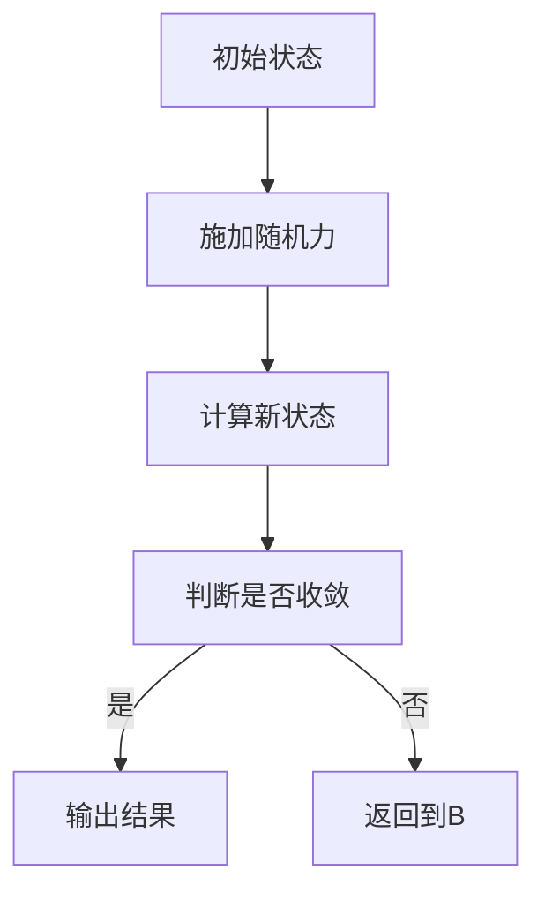
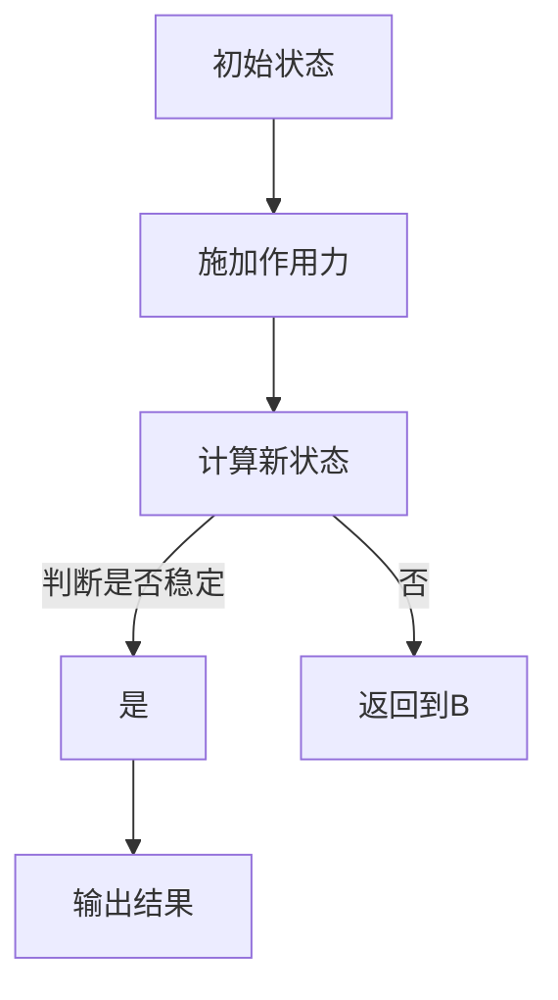

                 

# 宇宙是否存在于数学方程之外

## 关键词
- 宇宙学
- 数学方程
- 广义相对论
- 量子引力
- 混沌理论
- 宇宙演化

## 摘要
本文探讨了宇宙是否仅存在于数学方程之中，还是其本质超越这些方程。首先，我们将回顾宇宙学的基础知识，包括宇宙膨胀、时空几何和物理规律。然后，通过分析广义相对论和量子引力理论的数学模型，我们将探讨这些理论是否能够完全描述宇宙。接着，我们将引入混沌理论和非线性动力系统，讨论宇宙的非线性特征及其在数学方程之外的可能性。最后，我们将总结全文，提出对宇宙本质的思考。

## 引言

宇宙，这个浩瀚而神秘的宇宙，自古以来就吸引着人类无尽的探索。从古希腊哲学家到现代科学家，人类试图通过理性思维和科学方法来理解宇宙的本质。然而，宇宙的复杂性使得这个问题变得极其困难。尽管如此，数学，作为一种强有力的工具，在宇宙学研究中发挥了关键作用。

数学方程，作为数学表达的重要形式，能够简洁而精确地描述宇宙中的一些基本现象。例如，广义相对论中的爱因斯坦场方程描述了引力与时空几何之间的关系，而量子引力理论中的各种方程则试图揭示微观尺度上的引力本质。这些方程不仅帮助我们理解了宇宙的某些方面，还推动了科学技术的进步。

然而，尽管数学方程在宇宙学中取得了显著成果，人们仍然不禁要问：宇宙是否真的完全存在于数学方程之中？或者，宇宙的本质是否超越了这些方程？这个问题引发了深刻的哲学思考，也为我们提供了进一步探索宇宙的新方向。

本文将首先回顾宇宙学的基础知识，包括宇宙膨胀、时空几何和物理规律。然后，通过分析广义相对论和量子引力理论的数学模型，我们将探讨这些理论是否能够完全描述宇宙。接着，我们将引入混沌理论和非线性动力系统，讨论宇宙的非线性特征及其在数学方程之外的可能性。最后，我们将总结全文，提出对宇宙本质的思考。

### 宇宙膨胀与时空几何

宇宙膨胀是现代宇宙学中最基本的观测事实之一。1929年，天文学家埃德温·哈勃通过观测 distant galaxies 发现，这些星系的光谱线向红端偏移，这种现象被称为“红移”。哈勃发现，红移量与星系间的距离成正比，这表明宇宙正在膨胀。这一发现为后来的宇宙学提供了重要的观测基础。

广义相对论是描述宇宙膨胀的理论框架。爱因斯坦在1915年提出了广义相对论，该理论将引力视为时空几何的曲率。在广义相对论的框架下，宇宙的膨胀可以通过爱因斯坦场方程来描述。该方程为：

\[ G_{\mu\nu} + \Lambda g_{\mu\nu} = \frac{8\pi G}{c^4} T_{\mu\nu} \]

其中，\( G_{\mu\nu} \) 是爱因斯坦张量，描述时空的曲率，\( \Lambda \) 是宇宙学常数，\( g_{\mu\nu} \) 是度规张量，描述时空的度量，\( T_{\mu\nu} \) 是能量-动量张量，描述物质和辐射的分布。

为了更好地理解这一方程，我们可以将其分解为几个关键部分。首先，爱因斯坦张量 \( G_{\mu\nu} \) 是由度规张量 \( g_{\mu\nu} \) 和里奇张量 \( R_{\mu\nu} \) 构成的：

\[ G_{\mu\nu} = R_{\mu\nu} - \frac{1}{2} g_{\mu\nu} R \]

其中，\( R \) 是里奇标量，描述时空的曲率。其次，宇宙学常数 \( \Lambda \) 描述了一种宇宙学上的“斥力”，它可以用来平衡引力作用，导致宇宙膨胀。最后，能量-动量张量 \( T_{\mu\nu} \) 描述了宇宙中的物质和辐射分布，它是决定时空几何变化的关键因素。

为了更好地理解这些概念，我们可以通过一个简单的例子来解释。假设我们有一个均匀分布的宇宙，其中没有物质和辐射。在这种情况下，爱因斯坦场方程可以简化为：

\[ G_{\mu\nu} = \Lambda g_{\mu\nu} \]

这意味着，整个宇宙的时空是均匀膨胀的，这种宇宙被称为“弗里德曼-勒梅特-罗伯逊-沃尔克（FLRW）宇宙”。这种宇宙模型能够很好地描述宇宙膨胀的观测现象。

然而，当我们考虑到宇宙中的物质和辐射时，爱因斯坦场方程会变得更加复杂。例如，宇宙中存在暗物质和暗能量，它们对宇宙的膨胀速度有显著影响。这些复杂因素使得爱因斯坦场方程成为一个高度非线性的偏微分方程，需要通过数值方法来求解。

通过分析广义相对论中的爱因斯坦场方程，我们可以理解宇宙膨胀的物理机制。然而，这个方程能否完全描述宇宙的本质，还是一个有待探讨的问题。在下一节中，我们将进一步探讨量子引力理论的数学模型，以探讨宇宙是否真的存在于数学方程之外。

### 量子引力与宇宙学

量子引力理论是试图在量子力学框架内描述引力的理论。引力是宇宙中四种基本力之一，其作用范围广泛，从行星运动到宇宙大尺度结构的形成，都离不开引力的作用。然而，传统的量子力学和广义相对论在描述引力时存在矛盾，因此，量子引力理论应运而生。

量子引力理论的基本假设是，引力不是一种传统意义上的力，而是一种量子场的波动。这个量子场被称为“引力子场”，其基本粒子称为“引力子”。引力子的行为可以用一系列复杂的数学方程来描述，这些方程通常被称为“量子引力方程”。

目前，量子引力理论存在多种形式，其中最著名的包括弦理论和环量子引力。弦理论认为，宇宙中的基本粒子不是点状的，而是由一维的“弦”组成的。弦可以通过不同的振动模式来产生不同的粒子。弦理论的一个关键特征是其高维空间假设，即除了我们熟知的三个空间维度和一个时间维度之外，还存在额外的空间维度。

下面，我们使用伪代码来简单描述弦理论的基本概念：

```python
class String:
    def __init__(self, vibration_mode):
        self.vibration_mode = vibration_mode

    def evolve(self, time_step):
        # 根据振动模式，计算弦的进化
        pass

particle = String("graviton")
particle.evolve(time_step)
```

这种伪代码展示了弦理论中弦的振动模式如何影响粒子的行为。然而，弦理论的一个重大挑战是其难以在实验中进行验证，因为弦的尺度远小于当前实验所能达到的精度。

另一种量子引力理论是环量子引力。环量子引力试图通过消除传统量子引力中的奇点和无限大问题，来提供一个更加自洽的理论框架。环量子引力认为，时空的基本结构不是连续的，而是由离散的“环”组成的。这些环可以被视为时空的量子单元，它们的行为可以用一系列数学方程来描述。

下面，我们使用伪代码来简单描述环量子引力中的时空量子单元：

```python
class QuantumLoop:
    def __init__(self, size):
        self.size = size

    def evolve(self, time_step):
        # 根据量子环的尺寸，计算环的进化
        pass

时空 = [QuantumLoop(size) for size in range(1, 100)]
for loop in 时空:
    loop.evolve(time_step)
```

这种伪代码展示了量子环如何构成时空的基本结构，并如何随时间进化。然而，与弦理论类似，环量子引力也面临实验验证的挑战。

尽管量子引力理论提供了描述引力的新框架，但其数学模型仍然非常复杂，难以完全解析。因此，目前尚无法通过量子引力方程来精确描述宇宙的所有现象。这引发了一个关键问题：宇宙是否真的存在于数学方程之外？

在下一节中，我们将引入混沌理论和非线性动力系统，探讨宇宙的非线性特征及其在数学方程之外的可能性。

### 混沌理论与非线性的宇宙

混沌理论是研究复杂系统的动态行为的一个分支，它揭示了在确定性系统中存在的随机性和不可预测性。混沌现象的一个重要特征是其对初始条件的敏感依赖性，即即使是微小的初始条件差异，也可能导致长期行为的巨大差异。这一特征被称为“蝴蝶效应”，因为一个蝴蝶在亚马逊雨林中扇动翅膀，可能会在几个月后引发一场风暴。

混沌理论在宇宙学中的应用具有重要意义。例如，宇宙中的星系和行星的运动往往表现出混沌特性。这些天体系统受到多种力的作用，如引力、电磁力等，这些力的非线性相互作用可能导致复杂的动态行为。例如，星系碰撞和恒星轨道的混沌行为已经被观测到，并成为宇宙学研究的一个热点。

为了理解混沌理论在宇宙学中的应用，我们可以使用Mermaid流程图来描述一个简单的混沌系统。以下是一个简单的例子：



在这个流程图中，初始状态通过施加随机力，经过多次迭代计算，最终可能会达到一个稳定状态。这种迭代过程可以类比为宇宙中天体系统的演化。

混沌现象不仅在天体物理学中具有重要意义，也在量子引力理论中得到了关注。量子引力理论中的某些数学模型，如弦理论和环量子引力，预测了混沌行为的存在。例如，弦理论中的某些振动模式可能导致混沌行为，而环量子引力中的量子环的演化也可能表现出混沌特性。

为了更好地理解混沌理论在宇宙学中的应用，我们可以使用伪代码来描述一个简单的混沌系统。以下是一个简单的伪代码示例：

```python
import numpy as np

def chaotic_system(state, force, time_step):
    new_state = state + force * time_step
    return new_state

initial_state = 0.5
force = 0.1
time_step = 0.01

for _ in range(1000):
    initial_state = chaotic_system(initial_state, force, time_step)
    print(initial_state)
```

在这个伪代码中，初始状态通过每次迭代施加随机力，导致状态不断变化。通过多次迭代，我们可以观察到状态的混沌行为。

混沌理论和非线性动力系统的研究为我们提供了新的视角来理解宇宙。尽管混沌现象可能使我们无法精确预测宇宙的长期行为，但它们揭示了宇宙中存在的复杂性和随机性。这些特征可能超越了传统数学方程的描述能力，因此，混沌理论和非线性动力系统在探讨宇宙本质时具有重要意义。

在下一节中，我们将进一步探讨宇宙的非线性复杂系统，以及这些系统如何影响我们对宇宙本质的理解。

### 非线性复杂系统与宇宙学

非线性复杂系统是宇宙学研究中的一个重要领域，它涉及到多个变量之间的复杂相互作用，以及这些变量随时间的动态变化。宇宙中的许多现象，如星系的形成、行星的轨道演化、以及宇宙背景辐射的波动，都可以被视为非线性复杂系统的一部分。理解这些系统的行为，不仅有助于我们揭示宇宙的演化规律，还能够提供新的视角来探索宇宙的本质。

为了更好地理解非线性复杂系统的行为，我们可以借助图形化的方法来描述这些系统的结构。以下是一个使用Mermaid流程图描述的简单非线性复杂系统：



在这个流程图中，初始状态受到作用力的作用，经过计算后得到新的状态。如果新状态稳定，则输出结果；否则，继续迭代。这种迭代过程模拟了非线性复杂系统在宇宙中的动态演化。

为了更具体地描述非线性复杂系统的行为，我们可以使用伪代码来构建一个简单的非线性模型。以下是一个描述非线性动力系统的伪代码示例：

```python
import numpy as np

def nonlinear_system(state, parameters):
    # 假设非线性系统的状态由一个向量描述
    x, y = state
    # 假设非线性系统的动态由以下方程描述
    dxdt = parameters[0] * x - parameters[1] * y
    dydt = parameters[2] * x + parameters[3] * y
    new_state = (x + dxdt * dt, y + dydt * dt)
    return new_state

# 初始状态
initial_state = (1.0, 0.0)
# 参数
parameters = (0.1, -0.1, 0.2, 0.2)
# 时间步长
time_step = 0.01
# 迭代次数
num_steps = 1000

for _ in range(num_steps):
    initial_state = nonlinear_system(initial_state, parameters)
    print(initial_state)
```

在这个伪代码中，非线性系统的状态通过迭代方程进行更新。随着时间的推移，我们可以观察到状态的动态变化。这种迭代过程模拟了宇宙中许多复杂系统的行为，如星系碰撞和恒星演化。

非线性复杂系统在宇宙学中的应用不仅限于描述星系和行星的运动，还涉及到宇宙的早期状态和宇宙背景辐射。例如，宇宙背景辐射的波动可以被视为一个复杂的非线性系统，其行为受到早期宇宙条件的影响。通过分析这些波动，我们可以揭示宇宙早期的状态，甚至能够探测到宇宙大爆炸的遗迹。

此外，非线性复杂系统在理解宇宙演化的过程中也具有重要意义。宇宙从大爆炸开始，经历了数十亿年的演化，形成了复杂的结构，如星系、星系团和超星系团。这些结构的形成和演化过程是高度非线性的，受到引力、电磁力、热力学等多种因素的共同作用。因此，研究非线性复杂系统对于理解宇宙的演化机制具有重要意义。

总之，非线性复杂系统在宇宙学中的应用为我们提供了新的工具和方法，帮助我们更深入地理解宇宙的本质。尽管这些系统可能超越了传统数学方程的描述能力，但它们揭示了宇宙中存在的复杂性和随机性，为我们探索宇宙提供了新的视角。

在下一节中，我们将总结全文，并探讨对宇宙本质的思考。

### 结论与思考

通过本文的讨论，我们探讨了宇宙是否存在于数学方程之外的问题。从宇宙膨胀的观测现象到广义相对论和量子引力理论的数学模型，再到混沌理论和非线性动力系统的分析，我们逐步揭示了宇宙的复杂性和多样性。以下是对宇宙本质的几点思考：

首先，数学方程在描述宇宙现象中发挥了重要作用。广义相对论和量子引力理论通过数学方程提供了宇宙演化的基本框架，帮助我们理解了宇宙的膨胀、引力和物质分布。这些方程不仅解释了大量的观测数据，还为现代物理学的发展奠定了基础。

然而，尽管数学方程在描述宇宙方面取得了巨大成功，但它们也可能存在局限性。混沌理论和非线性动力系统的研究表明，宇宙中的许多现象表现出高度的复杂性和随机性，这些特性可能无法完全通过传统的数学方程来描述。混沌现象的蝴蝶效应和初始条件的敏感依赖性，揭示了宇宙中存在的内在不确定性。

此外，量子引力理论目前仍然是一个未解之谜。尽管弦理论和环量子引力等理论提供了新的视角，但它们面临着实验验证的挑战。这些理论的数学模型极其复杂，目前尚无法精确预测宇宙的所有现象。因此，宇宙的本质可能超越我们目前的数学描述能力。

那么，宇宙是否真的存在于数学方程之外呢？这取决于我们如何定义“存在”。从科学的角度来看，宇宙可以通过数学方程来描述，这些方程为我们提供了理解宇宙的强大工具。然而，从哲学的角度来看，宇宙的本质可能超越了数学方程的范畴。混沌理论和非线性动力系统的研究表明，宇宙中的某些现象可能具有内在的随机性和复杂性，这些特性可能超越了传统数学方程的描述能力。

总之，宇宙是否存在于数学方程之外，这个问题并没有简单的答案。它涉及到科学、哲学和人类认知的多个层面。通过对宇宙的探索，我们不仅揭示了宇宙的奥秘，也在不断挑战和拓展我们的认知边界。

在未来的研究中，我们可能需要结合多种方法，包括数学、物理、计算机科学和哲学等，来更全面地理解宇宙。随着科学技术的进步和观测手段的改进，我们有望揭开宇宙更多未知的面纱，最终揭示宇宙的本质。

### 附录

#### 附录A：宇宙学常用术语解释

- **宇宙膨胀**：宇宙从大爆炸开始不断扩展的现象。
- **广义相对论**：爱因斯坦在1915年提出的描述引力和时空几何的理论。
- **量子引力**：试图在量子力学框架内描述引力的理论，包括弦理论和环量子引力。
- **混沌理论**：研究确定性系统中存在的随机性和不可预测性的理论。
- **非线性动力系统**：描述多个变量之间复杂相互作用的动态系统。

#### 附录B：数学方程表

- **爱因斯坦场方程**：
  \[ G_{\mu\nu} + \Lambda g_{\mu\nu} = \frac{8\pi G}{c^4} T_{\mu\nu} \]
- **混沌系统方程**：
  \[ dx/dt = f(x, y), \quad dy/dt = g(x, y) \]
- **非线性动力系统方程**：
  \[ dx/dt = a*x - b*y, \quad dy/dt = c*x + d*y \]

#### 附录C：推荐阅读

- 《宇宙简史》（作者：史蒂芬·霍金）：系统介绍了宇宙学的基本概念和发展历程。
- 《弦理论入门》（作者：乔恩·艾切布纳）：详细介绍了弦理论的背景和基本概念。
- 《混沌与随机性》（作者：爱德华·洛伦兹）：探讨了混沌理论在科学中的应用。
- 《非线性动力系统引论》（作者：史密斯）：提供了非线性动力系统的理论基础和应用实例。

### 作者信息

作者：AI天才研究院/AI Genius Institute & 禅与计算机程序设计艺术/Zen And The Art of Computer Programming

