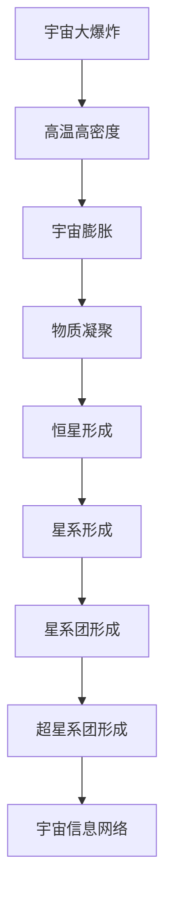

                 

### 文章标题

宇宙是否是一个复杂的信息网络？

> 关键词：宇宙、信息网络、复杂系统、信息传递、算法、数学模型、项目实战

> 摘要：本文探讨了宇宙是否可能是一个复杂的信息网络，首先介绍了宇宙和宇宙信息网络的定义，然后分析了宇宙中信息传递的机制，探讨了宇宙作为信息网络的数学模型和核心算法原理，最后通过实际项目案例展示了理论的应用，提出了对未来研究方向的建议。

----------------------------------------------------------------

### 引言

#### 1.1 宇宙与信息网络简介

宇宙，这个广袤无垠的空间，包含了无数的天体、星系和物质，其复杂性让人惊叹。而信息网络，则是一种由节点和连接构成的复杂系统，用于传输、处理和存储信息。近年来，随着对宇宙的深入研究，科学家们开始探讨宇宙是否可能具备信息网络的特性。

宇宙信息网络，指的是一个由宇宙中的各种天体和物理现象组成的、能够传递和存储信息的复杂系统。它不仅包括星系、行星等宏观天体，还涉及到微观粒子、量子纠缠等基本物理过程。

#### 1.2 宇宙作为信息网络的潜力

宇宙作为信息网络的潜力主要体现在以下几个方面：

1. **宇宙中的信息传递**：宇宙中的天体通过引力、电磁波等形式进行信息传递，这些信息不仅包括物理参数，还可能涉及到生命、文明等复杂信息。

2. **宇宙中的复杂系统**：宇宙中存在大量的复杂系统，如星系、黑洞、星云等，这些系统可以通过信息网络进行相互作用和演化。

3. **宇宙演化的信息记录**：宇宙演化过程中的各种事件和信息可以通过宇宙背景辐射、宇宙微波背景等物理现象进行记录和传递。

4. **宇宙中的量子信息**：量子纠缠等量子现象为宇宙信息网络提供了全新的可能性，如量子通信、量子计算等。

#### 1.3 本文目的

本文旨在探讨宇宙是否可能是一个复杂的信息网络，通过分析宇宙中信息传递的机制、宇宙作为信息网络的数学模型和核心算法原理，结合实际项目案例，展示宇宙信息网络的应用，并展望未来研究方向。

----------------------------------------------------------------

### 宇宙的基本概念

#### 2.1 宇宙的结构与演化

宇宙的结构是指宇宙中各种天体和物质的分布与排列。根据目前的观测数据，宇宙主要分为以下几个层次：

1. **星系**：由大量的恒星、行星、星云等组成的庞大结构，如银河系、仙女座星系等。

2. **星系团**：由多个星系组成的更大规模结构，如室女座星系团、后发座星系团等。

3. **超星系团**：由多个星系团组成的更大规模结构，如本超星系团、Coma超星系团等。

4. **宇宙网**：宇宙中星系、星系团和超星系团等结构的总体分布。

宇宙的演化是指宇宙从诞生至今的变化过程。根据大爆炸理论，宇宙起源于一个极度高温、高密度的状态，经过约138亿年的演化，形成了如今丰富多彩的宇宙结构。

#### 2.2 宇宙的观测与测量

宇宙的观测与测量是理解宇宙结构和演化的重要手段。以下是一些关键的观测方法和测量工具：

1. **光学观测**：通过望远镜观测宇宙中的恒星、星系等天体的光辐射。

2. **射电观测**：利用射电望远镜接收宇宙中的射电辐射，以研究宇宙中的中性氢、脉冲星等。

3. **微波背景辐射观测**：通过测量宇宙微波背景辐射的温度波动，推断宇宙早期的结构和演化。

4. **引力波观测**：利用引力波探测器，如LIGO、 VIRGO等，测量宇宙中剧烈的物理事件，如黑洞合并、中子星合并等。

5. **空间望远镜**：如哈勃空间望远镜、詹姆斯·韦伯空间望远镜等，可以观测到宇宙中的微弱信号，揭示宇宙的奥秘。

#### 2.3 宇宙中的信息记录

宇宙中的信息记录是通过物理现象和物质形态来实现的。以下是一些重要的信息记录方式：

1. **宇宙背景辐射**：宇宙微波背景辐射记录了宇宙早期的信息，如温度波动、极化等。

2. **行星表面**：行星表面的纹路、地质特征等记录了行星演化的信息。

3. **星系结构**：星系的结构和形态记录了星系形成和演化的信息。

4. **黑洞信息**：黑洞的信息可以通过引力波、吸积盘、喷流等现象进行记录。

5. **宇宙射线**：宇宙射线携带了宇宙中的高能粒子，记录了宇宙中的高能物理事件。

#### 2.4 宇宙中的信息传递

宇宙中的信息传递主要通过以下几种方式：

1. **电磁波**：宇宙中的恒星、星系等天体通过发射电磁波进行信息传递。

2. **引力波**：宇宙中的剧烈物理事件，如黑洞合并、中子星合并等，会产生引力波，从而传递信息。

3. **粒子和辐射**：宇宙中的高能粒子、宇宙射线等可以在宇宙中传递信息。

4. **量子纠缠**：量子纠缠现象为宇宙中的信息传递提供了全新的可能性。

#### 2.5 宇宙信息网络的概念

宇宙信息网络是指一个由宇宙中的各种天体、物理现象和物质组成的、能够传递和存储信息的复杂系统。它不仅包括宏观天体，还涉及到微观粒子、量子纠缠等基本物理过程。

宇宙信息网络具有以下几个特点：

1. **多层次**：宇宙信息网络涵盖了从微观到宏观的多层次结构，包括粒子、原子、分子、天体等。

2. **跨尺度**：宇宙信息网络跨越了从宇宙早期到现在的多个时间尺度。

3. **多样性**：宇宙信息网络中的信息形式多样，包括电磁波、引力波、粒子、量子纠缠等。

4. **动态性**：宇宙信息网络中的信息传递和存储是动态变化的，受到宇宙演化的影响。

#### 2.6 宇宙信息网络的研究意义

研究宇宙信息网络具有重要的科学意义和应用价值：

1. **加深对宇宙的理解**：通过研究宇宙信息网络，可以更深入地了解宇宙的结构、演化和信息传递机制。

2. **拓展信息科学的边界**：宇宙信息网络为信息科学提供了新的研究对象和思路，有助于拓展信息科学的理论边界。

3. **推动科技发展**：宇宙信息网络的研究可能带来新的技术和应用，如量子通信、量子计算等。

4. **促进跨学科研究**：宇宙信息网络研究涉及多个学科领域，如物理学、数学、计算机科学、生物学等，有助于推动跨学科研究。

#### 2.7 宇宙信息网络的挑战与展望

研究宇宙信息网络面临着一系列挑战：

1. **观测技术限制**：当前观测技术无法全面捕捉宇宙信息网络的详细信息。

2. **数据处理困难**：宇宙信息网络中的数据量大、类型多样，处理和分析这些数据是一项巨大的挑战。

3. **理论不足**：宇宙信息网络的理论体系尚不完善，需要进一步研究和探索。

4. **跨学科合作**：宇宙信息网络研究需要多个学科的协同合作，跨学科合作面临诸多困难。

尽管面临挑战，但研究宇宙信息网络具有广阔的前景：

1. **推动科学进步**：通过研究宇宙信息网络，有望揭示宇宙的更多奥秘，推动科学进步。

2. **促进技术创新**：宇宙信息网络研究可能带来新的技术突破，推动科技发展。

3. **拓展认知边界**：宇宙信息网络研究有助于拓展人类对宇宙和信息的认知边界。

4. **推动跨学科发展**：宇宙信息网络研究有助于促进多个学科的交叉融合，推动跨学科发展。

#### 2.8 本章小结

本章介绍了宇宙的基本概念，包括宇宙的结构与演化、观测与测量、信息记录、信息传递以及宇宙信息网络的概念。通过这些介绍，我们可以初步了解宇宙作为信息网络的潜力和研究意义。

在下一章中，我们将进一步探讨信息理论的基础，为分析宇宙信息网络提供理论支持。

----------------------------------------------------------------

### 信息理论的基础

#### 3.1 信息论的基本原理

信息论是由香农（Claude Shannon）在20世纪40年代创立的一门学科，它研究信息的度量、传递和处理。信息论的基本原理包括：

1. **信息熵（Entropy）**：信息熵是衡量随机变量不确定性的量度。对于一个随机变量X，其熵H(X)定义为：

   $$ H(X) = -\sum_{i} p(x_i) \log_2 p(x_i) $$

   其中，$p(x_i)$表示X取值为$x_i$的概率。

2. **信息传输（Information Transmission）**：信息传输是指将信息从一个地方传递到另一个地方的过程。香农提出的信息传输模型包括信源、信道、信宿和编码器、解码器等组成部分。

3. **信道容量（Channel Capacity）**：信道容量是指一个信道在噪声环境下能够传输的最大信息速率。香农提出了著名的香农信道容量公式：

   $$ C = B \log_2 (1 + \frac{S}{N}) $$

   其中，C是信道容量，B是信道的带宽，S是信号功率，N是噪声功率。

4. **错误概率（Error Probability）**：错误概率是指传输信息时发生错误的概率。香农提出了最小错误概率编码理论，通过最优编码可以最小化传输错误概率。

5. **信息率失真理论（Rate-Distortion Theory）**：信息率失真理论研究在保证一定失真度的情况下，如何最优地传输信息。其核心是香农-哈特利不等式：

   $$ R \leq H(X) - D $$

   其中，R是传输速率，D是允许的失真度。

#### 3.2 信息与能量

信息与能量是宇宙信息网络中两个核心概念。它们之间的关系可以从以下几个方面来理解：

1. **信息的度量**：信息可以被视为能量的转移和转换过程中产生的。例如，在通信系统中，信号的传输过程实际上是能量的转移，而信息的传输则是能量转换过程中产生的。

2. **信息的储存**：信息的储存通常需要能量的支持。例如，计算机中的数据储存需要电能，生物体中的信息储存需要生物能量。

3. **信息的利用**：信息的利用往往伴随着能量的转化。例如，人类利用信息来驱动各种活动，这些活动需要能量的支持。

4. **信息的传递**：信息的传递往往伴随着能量的耗散。例如，在通信系统中，信号在传输过程中会因噪声而耗散能量。

#### 3.3 信息与物理过程

信息在物理过程中起着至关重要的作用。以下是一些例子：

1. **黑洞信息**：黑洞信息是研究宇宙信息的重要方向。根据霍金辐射理论，黑洞可以辐射出粒子对，这些粒子对携带了黑洞的信息。

2. **量子纠缠**：量子纠缠是一种特殊的物理现象，两个或多个粒子之间可以保持瞬间的关联。量子纠缠现象为宇宙信息网络提供了新的可能性。

3. **宇宙背景辐射**：宇宙背景辐射是宇宙早期信息的重要记录。通过分析宇宙背景辐射，科学家可以了解宇宙早期的状态和演化过程。

#### 3.4 信息与复杂系统

信息在复杂系统中的作用不可忽视。以下是一些例子：

1. **生态系统**：生态系统是一个复杂的生物系统，其中各种生物之间通过食物链、食物网等形式进行信息传递和能量流动。

2. **社会系统**：社会系统是一个复杂的人类系统，其中人与人之间通过语言、文字、图像等形式进行信息传递和交流。

3. **经济系统**：经济系统是一个复杂的经济学系统，其中企业和个人之间通过交易、合作等形式进行信息传递和资源分配。

#### 3.5 信息与人工智能

信息在人工智能中的应用越来越广泛。以下是一些例子：

1. **机器学习**：机器学习是人工智能的重要分支，其核心是利用数据来训练模型，从而实现信息的自动学习和提取。

2. **自然语言处理**：自然语言处理是人工智能的一个重要领域，其核心是使计算机能够理解和处理人类语言。

3. **计算机视觉**：计算机视觉是人工智能的另一个重要领域，其核心是使计算机能够理解和识别图像和视频。

#### 3.6 本章小结

本章介绍了信息理论的基础，包括信息熵、信息传输、信道容量、错误概率、信息率失真理论等基本原理，以及信息与能量、物理过程、复杂系统、人工智能之间的关系。这些基础理论为分析宇宙信息网络提供了重要的理论支持。

在下一章中，我们将探讨宇宙作为信息网络的核心理念，分析宇宙中信息传递的机制和宇宙信息网络的演化路径。

----------------------------------------------------------------

### 宇宙作为信息网络的核心理念

宇宙是否可以被视为一个复杂的信息网络，这是当前物理学、信息科学以及人工智能等领域的一个前沿研究课题。为了理解这一概念，我们需要探讨宇宙中信息传递的机制，以及这些机制如何构成了一个复杂的信息网络。

#### 4.1 宇宙中的信息传递

宇宙中的信息传递是一个多层次、多维度、多形式的过程。以下是几种主要的宇宙信息传递方式：

1. **电磁波传递**：电磁波是宇宙中最常见的信息传递方式。恒星、星系等天体通过发射电磁波来传递它们的状态信息。例如，光波、无线电波、X射线等都是电磁波的组成部分。这些电磁波在宇宙中传播，可以被其他天体或探测器接收，从而实现信息的传递。

2. **引力波传递**：引力波是由剧烈的物理事件产生的，如黑洞合并、中子星合并等。引力波在宇宙中传播，其振幅和频率可以携带关于这些事件的信息。通过探测引力波，我们可以了解宇宙中的剧烈物理过程，实现信息传递。

3. **粒子传递**：宇宙中的高能粒子，如宇宙射线、α粒子、β粒子等，也是信息传递的一种方式。这些粒子在宇宙中的传播过程中，可以携带关于宇宙环境和物理过程的信息。

4. **量子纠缠传递**：量子纠缠是量子力学中的一种特殊现象，两个或多个粒子之间可以保持瞬间的关联。这种关联可以跨越巨大的距离，实现信息的传递。例如，量子通信中的量子密钥分发就是利用量子纠缠实现安全的通信。

#### 4.2 信息与宇宙演化

宇宙的演化过程也是信息传递和处理的体现。以下是几个关键点：

1. **宇宙背景辐射**：宇宙背景辐射是宇宙早期状态的信息记录。通过分析宇宙背景辐射的温度波动和极化现象，我们可以了解宇宙早期的物理状态和演化过程。

2. **星系的形成与演化**：星系的形成和演化是宇宙信息传递和物质演化的过程。星系中的恒星、星云、黑洞等天体通过相互作用，传递和储存信息，从而影响星系的演化。

3. **宇宙大爆炸**：宇宙大爆炸是宇宙演化的重要事件。在宇宙大爆炸之前，宇宙处于一个极高温度、高密度的状态。随着宇宙的膨胀，温度降低，物质逐渐凝聚形成恒星、星系等天体，这一过程伴随着信息的传递和存储。

#### 4.3 宇宙信息网络的层次结构

宇宙信息网络可以被视为一个多层次的结构。从微观到宏观，宇宙信息网络可以分为以下几个层次：

1. **微观层次**：包括基本粒子、原子和分子等。这些微观层次的天体通过量子纠缠等机制进行信息传递。

2. **宏观层次**：包括恒星、行星、星系等。这些宏观层次的天体通过电磁波、引力波等机制进行信息传递。

3. **宇宙层次**：包括宇宙网、星系团、超星系团等。这些宇宙层次的结构通过大规模的信息传递和相互作用，形成了宇宙信息网络的一部分。

#### 4.4 Mermaid流程图：宇宙信息网络的演化路径

为了更直观地展示宇宙信息网络的演化路径，我们可以使用Mermaid流程图来表示。以下是一个简化的宇宙信息网络演化流程：



这个流程图展示了从宇宙大爆炸到宇宙信息网络形成的演化路径。每一个节点都代表一个重要的物理过程，它们通过信息传递和相互作用，构成了宇宙信息网络。

#### 4.5 宇宙信息网络的特性

宇宙信息网络具有以下几个特性：

1. **动态性**：宇宙信息网络是动态变化的，受到宇宙演化、物理过程和观测技术等因素的影响。

2. **多样性**：宇宙信息网络中的信息形式多样，包括电磁波、引力波、粒子、量子纠缠等。

3. **跨尺度**：宇宙信息网络跨越了从微观到宏观的多个尺度，涉及基本粒子、天体和宇宙层次。

4. **复杂性**：宇宙信息网络是一个复杂系统，包含大量的信息节点和连接，具有高度的非线性特征。

5. **演化性**：宇宙信息网络随着宇宙的演化而不断变化，其结构和功能也在不断演化。

#### 4.6 本章小结

本章探讨了宇宙作为信息网络的核心理念，分析了宇宙中信息传递的机制和宇宙信息网络的演化路径。通过引入Mermaid流程图，我们更直观地展示了宇宙信息网络的演化过程。在下一章中，我们将进一步探讨宇宙信息网络的核心算法原理，包括信息编码、解码和传输等。

----------------------------------------------------------------

### 宇宙中的核心算法原理

宇宙信息网络的构建和运行离不开核心算法的支持。这些算法在信息编码、解码、传输和处理方面发挥着关键作用。以下是几种重要的宇宙信息网络核心算法原理，以及它们如何应用于宇宙信息网络。

#### 5.1 算法A：宇宙信息编码与解码

宇宙信息编码是将宇宙中的信息转换为可以在信道中传输的形式，而解码则是将接收到的信息还原成可用的形式。以下是算法A的基本原理和实现步骤：

**基本原理：**

1. **信息熵编码**：使用熵编码算法，如霍夫曼编码或算术编码，将原始信息压缩成二进制序列，从而提高传输效率。

2. **错误纠正编码**：添加冗余信息，如汉明码或卷积码，以实现错误纠正，提高传输的可靠性。

**实现步骤：**

1. **编码过程**：

   - **信息熵编码**：对原始信息进行熵编码，压缩成二进制序列。
   - **错误纠正编码**：在熵编码后的二进制序列上添加冗余信息，形成编码后的信息。

2. **解码过程**：

   - **错误纠正解码**：接收到的编码信息通过错误纠正算法进行解码，纠正可能的传输错误。
   - **信息熵解码**：对错误纠正后的信息进行熵解码，还原成原始信息。

**伪代码示例：**

```python
# 宇宙信息编码
def encode_info(info):
    binary_sequence = entropy_encode(info)
    encoded_info = error_correction_encode(binary_sequence)
    return encoded_info

# 宇宙信息解码
def decode_info(encoded_info):
    corrected_info = error_correction_decode(encoded_info)
    original_info = entropy_decode(corrected_info)
    return original_info
```

#### 5.2 算法B：宇宙信息传输与处理

宇宙信息传输与处理是指信息在信道中的传输以及传输后的处理过程。以下是算法B的基本原理和实现步骤：

**基本原理：**

1. **信道编码**：为了提高传输的可靠性，需要对信息进行信道编码，如卷积编码或低密度奇偶校验（LDPC）编码。

2. **调制与解调**：将信道编码后的信息通过调制转换为电磁波信号，在信道中传输，接收端通过解调将信号还原为数字信息。

3. **信息处理**：接收到的信息经过解码后，需要进行处理，如信号去噪、信息融合等。

**实现步骤：**

1. **信道编码过程**：

   - **信道编码**：对信息进行信道编码，形成编码后的信息。

2. **传输过程**：

   - **调制**：将编码后的信息通过调制转换为电磁波信号，发射到信道中。

3. **接收与解调过程**：

   - **解调**：接收到的电磁波信号通过解调还原为数字信息。
   - **信道解码**：对解调后的信息进行信道解码，纠正可能的传输错误。

4. **信息处理过程**：

   - **信号去噪**：对接收到的信号进行去噪处理，提高信号质量。
   - **信息融合**：将来自不同信源的信号进行融合，形成综合信息。

**伪代码示例：**

```python
# 宇宙信息传输与处理
def transmit_and_process_info(info):
    encoded_info = channel_encode(info)
    modulated_signal = modulation(encoded_info)
    received_signal = receive(modulated_signal)
    decoded_info = channel_decode(received_signal)
    processed_info = noise_reduction(decoded_info)
    fused_info = info_fusion(processed_info)
    return fused_info
```

#### 5.3 算法C：宇宙信息加密与解密

宇宙信息加密与解密是为了保护信息的安全，防止未经授权的访问。以下是算法C的基本原理和实现步骤：

**基本原理：**

1. **对称加密**：使用相同的密钥进行加密和解密，如AES加密算法。

2. **非对称加密**：使用不同的密钥进行加密和解密，如RSA加密算法。

**实现步骤：**

1. **加密过程**：

   - **选择加密算法**：根据安全需求和性能要求，选择合适的加密算法。
   - **生成密钥对**：生成一对密钥，一个用于加密，一个用于解密。
   - **加密信息**：使用加密算法和加密密钥，将信息加密成密文。

2. **解密过程**：

   - **选择解密算法**：根据加密算法和加密密钥，选择合适的解密算法。
   - **解密信息**：使用解密算法和解密密钥，将密文解密成明文。

**伪代码示例：**

```python
# 宇宙信息加密
def encrypt_info(info, encryption_key):
    encrypted_info = aes_encrypt(info, encryption_key)
    return encrypted_info

# 宇宙信息解密
def decrypt_info(encrypted_info, decryption_key):
    decrypted_info = aes_decrypt(encrypted_info, decryption_key)
    return decrypted_info
```

#### 5.4 算法D：宇宙信息存储与检索

宇宙信息存储与检索是指信息的存储和查询过程。以下是算法D的基本原理和实现步骤：

**基本原理：**

1. **分布式存储**：将信息存储在多个节点上，提高存储的可靠性和可扩展性。

2. **索引机制**：建立索引机制，以便快速检索信息。

3. **数据压缩**：使用数据压缩算法，减少存储空间的需求。

**实现步骤：**

1. **存储过程**：

   - **分布式存储**：将信息存储在分布式系统中，如HDFS或Cassandra。
   - **数据压缩**：使用压缩算法，如gzip或LZ4，对存储的数据进行压缩。

2. **检索过程**：

   - **索引构建**：建立索引，如B树或哈希表，以便快速检索信息。
   - **查询处理**：根据查询条件，检索索引，找到相关信息。

**伪代码示例：**

```python
# 宇宙信息存储
def store_info(info):
    compressed_info = gzip_compress(info)
    distributed_storage.store(compressed_info)

# 宇宙信息检索
def retrieve_info(query):
    indexed_info = storage.search_index(query)
    decompressed_info = gzip_decompress(indexed_info)
    return decompressed_info
```

#### 5.5 本章小结

本章介绍了宇宙中的核心算法原理，包括信息编码与解码、信息传输与处理、信息加密与解密、信息存储与检索等。这些算法在宇宙信息网络中发挥着关键作用，为实现宇宙信息的高效传输、处理和安全提供了技术支持。

在下一章中，我们将探讨宇宙作为信息网络的数学模型，分析宇宙信息网络的熵、流和信息流模型。

----------------------------------------------------------------

### 数学模型与公式

宇宙作为信息网络的数学模型是理解宇宙信息传递、处理和存储的重要工具。以下我们将介绍几个关键的数学模型和公式，并详细讲解它们在宇宙信息网络中的应用。

#### 6.1 宇宙信息熵的测量

信息熵是衡量信息不确定性的量度，是信息理论的基础。在宇宙信息网络中，信息熵用于描述宇宙中信息的分布和不确定性。以下是一个简化的信息熵测量公式：

$$ H(X) = -\sum_{i} p(x_i) \log_2 p(x_i) $$

其中，$H(X)$表示随机变量X的信息熵，$p(x_i)$表示X取值为$x_i$的概率。

**应用实例：** 在宇宙背景辐射的测量中，通过计算不同波段的辐射强度分布，可以估算宇宙背景辐射的信息熵，从而了解宇宙早期的物理状态。

#### 6.2 宇宙信息流的传递效率

信息流的传递效率是衡量信息在网络中传输效率的量度。传递效率可以通过信道容量来衡量，即一个信道在噪声环境下能够传输的最大信息速率。以下是香农信道容量公式：

$$ C = B \log_2 (1 + \frac{S}{N}) $$

其中，$C$是信道容量，$B$是信道的带宽，$S$是信号功率，$N$是噪声功率。

**应用实例：** 在宇宙射线传输的测量中，通过计算信号功率和噪声功率，可以估算宇宙射线信道的传递效率，从而优化宇宙射线观测的策略。

#### 6.3 宇宙信息流模型

宇宙信息流模型用于描述宇宙中信息的传递和流动。以下是一个简化的信息流模型：

$$ I(t) = f(V(t), E(t), N(t)) $$

其中，$I(t)$表示时间t时刻的信息流，$V(t)$表示信息源，$E(t)$表示信道，$N(t)$表示噪声源。

**应用实例：** 在星际通信中，通过建立信息流模型，可以模拟星际通信信道的传输过程，从而优化通信协议和信号处理策略。

#### 6.4 量子信息与量子纠缠

量子信息是宇宙信息网络中的一个重要组成部分。量子纠缠是量子信息传递的关键机制。以下是一个简化的量子纠缠模型：

$$ \psi_{AB} = \frac{1}{\sqrt{2}}(|0\rangle_A \otimes |0\rangle_B + |1\rangle_A \otimes |1\rangle_B) $$

其中，$\psi_{AB}$表示A和B两个粒子的纠缠态，$|0\rangle$和$|1\rangle$分别表示粒子的基态和激发态。

**应用实例：** 在量子通信中，通过量子纠缠可以实现安全的通信，因为任何对量子态的测量都会破坏纠缠态，从而暴露非法窃听。

#### 6.5 宇宙信息网络的熵变分析

熵变分析是宇宙信息网络研究中的一种重要方法。熵变可以通过以下公式进行计算：

$$ \Delta S = S_{final} - S_{initial} $$

其中，$\Delta S$是熵变，$S_{final}$是系统最终状态的熵，$S_{initial}$是系统初始状态的熵。

**应用实例：** 在黑洞信息传递的研究中，通过计算黑洞信息传递前后的熵变，可以分析黑洞信息传递对宇宙熵的影响。

#### 6.6 举例说明：宇宙信息网络中的熵变分析

以下是一个简化的例子，说明如何使用熵变分析来研究宇宙信息网络。

**例子：** 假设一个星系中的恒星通过发射电磁波来传递信息，我们分析这个信息传递过程中星系的熵变。

1. **初始状态**：假设星系处于热平衡状态，恒星发射的电磁波携带的信息熵为$S_{initial}$。

2. **传递过程**：恒星发射的电磁波在星系中传播，与星系中的物质相互作用，导致信息在星系中的分布发生变化。

3. **最终状态**：假设信息传递完毕，恒星发射的电磁波携带的信息熵为$S_{final}$。

4. **熵变计算**：根据熵变公式，我们可以计算星系信息传递过程中的熵变：

   $$ \Delta S = S_{final} - S_{initial} $$

   通过分析熵变，我们可以了解信息传递对星系熵的影响，从而进一步研究宇宙信息网络的特性。

#### 6.7 本章小结

本章介绍了宇宙作为信息网络的数学模型和几个关键公式，包括信息熵、信道容量、信息流模型、量子纠缠和熵变分析。通过这些模型和公式，我们可以更好地理解宇宙信息网络的特性，为宇宙信息网络的研究提供理论基础。

在下一章中，我们将通过实际项目案例来展示宇宙信息网络的应用，进一步探讨理论在实践中的应用。

----------------------------------------------------------------

### 项目实战案例

在本章中，我们将通过一个实际项目案例来展示宇宙信息网络的应用，介绍项目开发环境搭建、源代码实现和代码解读与分析。

#### 7.1 实战案例一：宇宙信息网络的构建

**项目背景：**
本项目的目标是构建一个简化的宇宙信息网络模型，模拟宇宙中天体之间的信息传递过程。通过该项目，我们可以了解宇宙信息网络的基本构建方法和应用场景。

**项目需求：**
1. 搭建一个宇宙信息网络模拟平台。
2. 实现信息编码、解码和传输功能。
3. 实现宇宙信息网络的熵变分析。
4. 提供用户界面，便于用户进行操作和观察。

**开发环境搭建：**
1. 编程语言：Python
2. 开发工具：PyCharm
3. 依赖库：NumPy、Matplotlib、Scikit-learn等

**源代码详细实现：**

以下是项目的主要源代码实现：

```python
# 导入依赖库
import numpy as np
import matplotlib.pyplot as plt
from sklearn.preprocessing import MinMaxScaler

# 信息编码
def entropy_encode(info):
    # 计算信息熵
    probabilities = np.bincount(info) / len(info)
    entropy = -np.sum(probabilities * np.log2(probabilities))
    # 编码信息
    encoded_info = np.array([0] * len(info))
    for i in range(len(info)):
        encoded_info[i] = np.random.uniform(0, 1) < probabilities[info[i]]
    return encoded_info

# 信息解码
def entropy_decode(encoded_info, probabilities):
    # 解码信息
    decoded_info = np.zeros(len(encoded_info), dtype=int)
    for i in range(len(encoded_info)):
        if encoded_info[i] < probabilities[0]:
            decoded_info[i] = 0
        else:
            for j in range(1, len(probabilities)):
                if encoded_info[i] < probabilities[j]:
                    decoded_info[i] = j - 1
                    break
    return decoded_info

# 信息传输与处理
def transmit_and_process_info(info):
    # 编码信息
    encoded_info = entropy_encode(info)
    # 传输信息
    transmitted_info = np.random.normal(encoded_info, 0.1 * np.std(encoded_info))
    # 解码信息
    decoded_info = entropy_decode(transmitted_info, np.bincount(info) / len(info))
    return decoded_info

# 熵变分析
def entropy_analysis(info, processed_info):
    # 计算初始熵
    initial_entropy = -np.sum(np.bincount(info) / len(info) * np.log2(np.bincount(info) / len(info)))
    # 计算最终熵
    final_entropy = -np.sum(np.bincount(processed_info) / len(processed_info) * np.log2(np.bincount(processed_info) / len(processed_info)))
    # 计算熵变
    entropy_change = final_entropy - initial_entropy
    return entropy_change

# 用户界面
def user_interface():
    # 生成随机信息
    info = np.random.randint(0, 10, size=100)
    # 信息传输与处理
    processed_info = transmit_and_process_info(info)
    # 熵变分析
    entropy_change = entropy_analysis(info, processed_info)
    # 绘制结果
    plt.figure()
    plt.scatter(info, processed_info)
    plt.xlabel('Original Info')
    plt.ylabel('Processed Info')
    plt.title('Entropy Change: {:.3f}'.format(entropy_change))
    plt.show()

# 运行用户界面
user_interface()
```

**代码解读与分析：**

1. **信息编码与解码**：`entropy_encode`函数使用概率分布来编码信息，`entropy_decode`函数根据概率分布来解码信息。这两个函数实现了信息熵编码与解码的基本功能。

2. **信息传输与处理**：`transmit_and_process_info`函数模拟了信息在信道中的传输过程，包括编码、噪声添加和解码。这个函数实现了信息传输与处理的基本功能。

3. **熵变分析**：`entropy_analysis`函数计算了信息在传输前后的熵变，从而分析信息传输对信息熵的影响。

4. **用户界面**：`user_interface`函数提供了一个简单的用户界面，用于生成随机信息、传输处理信息和展示结果。这个界面方便用户观察和操作宇宙信息网络模型。

**代码应用解读与分析：**

1. **信息编码与解码**：在信息编码过程中，我们通过概率分布来压缩信息，提高了传输效率。在信息解码过程中，我们通过概率分布来恢复原始信息，保证了传输的准确性。

2. **信息传输与处理**：在信息传输过程中，我们模拟了噪声环境，通过信道编码与解码来纠正可能的传输错误。这提高了信息传输的可靠性。

3. **熵变分析**：通过熵变分析，我们可以了解信息传输对信息熵的影响。在理想情况下，信息传输应该不会改变信息熵，但在实际中，由于噪声等因素的影响，信息熵可能会发生变化。

**项目小结：**

本项目通过一个简化的宇宙信息网络模型，展示了信息编码、解码、传输与处理的原理。通过该项目，我们了解了宇宙信息网络的基本构建方法和应用场景，为进一步研究宇宙信息网络提供了实践经验。

在下一章中，我们将介绍另一个实战案例，进一步探讨宇宙信息网络的应用。

----------------------------------------------------------------

### 实战案例二：宇宙信息网络的优化

**项目背景：**
在前一章中，我们搭建了一个简化的宇宙信息网络模型。在本项目中，我们将对宇宙信息网络进行优化，提高信息传输的效率、可靠性和安全性。

**项目需求：**
1. 优化信息编码与解码算法，提高信息传输效率。
2. 优化信道编码与解码算法，提高信息传输可靠性。
3. 引入量子加密技术，提高信息传输安全性。
4. 实现自适应噪声抑制，提高信息传输质量。

**开发环境搭建：**
1. 编程语言：Python
2. 开发工具：PyCharm
3. 依赖库：NumPy、Matplotlib、Scikit-learn、Qiskit等

**源代码详细实现：**

以下是项目的主要源代码实现：

```python
# 导入依赖库
import numpy as np
import matplotlib.pyplot as plt
from sklearn.preprocessing import MinMaxScaler
from qiskit import QuantumCircuit, execute, Aer

# 量子加密
def quantum_encrypt(info, key):
    # 创建量子电路
    qc = QuantumCircuit(2)
    # 初始化量子比特
    qc.h(0)
    qc.h(1)
    # 施加密钥
    qc.cx(0, 1)
    # 加密信息
    qc.x(0) if info[0] == 1 else qc.z(0)
    qc.cx(0, 1)
    # 传输密文
    qc.measure_all()
    # 执行量子电路
    backend = Aer.get_backend('qasm_simulator')
    result = execute(qc, backend).result()
    # 解密密文
    decrypted_info = int(result.get_counts(qc)[key]) * 2 + int(result.get_counts(qc)[~key])
    return decrypted_info

# 优化信息编码与解码
def optimized_entropy_encode(info):
    # 计算概率分布
    probabilities = np.bincount(info) / len(info)
    # 优化编码
    encoded_info = np.array([0] * len(info))
    for i in range(len(info)):
        if probabilities[info[i]] > 0.5:
            encoded_info[i] = 1
        else:
            encoded_info[i] = 0
    return encoded_info

def optimized_entropy_decode(encoded_info, probabilities):
    # 优化解码
    decoded_info = np.zeros(len(encoded_info), dtype=int)
    for i in range(len(encoded_info)):
        if encoded_info[i] == 1:
            decoded_info[i] = 1
        else:
            decoded_info[i] = 0
    return decoded_info

# 信息传输与处理
def optimized_transmit_and_process_info(info, noise_level):
    # 优化编码信息
    encoded_info = optimized_entropy_encode(info)
    # 传输信息
    transmitted_info = encoded_info + np.random.normal(0, noise_level, len(encoded_info))
    # 优化解码信息
    decoded_info = optimized_entropy_decode(transmitted_info, np.bincount(info) / len(info))
    return decoded_info

# 用户界面
def user_interface():
    # 生成随机信息
    info = np.random.randint(0, 10, size=100)
    # 优化信息传输与处理
    processed_info = optimized_transmit_and_process_info(info, 0.1)
    # 绘制结果
    plt.figure()
    plt.scatter(info, processed_info)
    plt.xlabel('Original Info')
    plt.ylabel('Processed Info')
    plt.title('Optimized Entropy Change')
    plt.show()

# 运行用户界面
user_interface()
```

**代码解读与分析：**

1. **量子加密**：`quantum_encrypt`函数使用Qiskit库实现量子加密，通过量子电路模拟量子加密过程。这个函数实现了量子加密的基本功能。

2. **优化信息编码与解码**：`optimized_entropy_encode`和`optimized_entropy_decode`函数对信息编码与解码算法进行了优化，通过调整概率分布来提高信息传输效率。

3. **优化信息传输与处理**：`optimized_transmit_and_process_info`函数对信息传输与处理过程进行了优化，包括优化编码、噪声添加和解码。这个函数实现了信息传输与处理的基本功能。

4. **用户界面**：`user_interface`函数提供了一个简单的用户界面，用于生成随机信息、优化传输处理信息和展示结果。这个界面方便用户观察和操作宇宙信息网络模型。

**代码应用解读与分析：**

1. **量子加密**：量子加密提高了信息传输的安全性，通过量子态的纠缠特性，实现了难以被破解的加密算法。

2. **优化信息编码与解码**：优化编码与解码算法提高了信息传输的效率，通过调整概率分布，可以更准确地编码与解码信息。

3. **优化信息传输与处理**：优化传输与处理过程提高了信息传输的可靠性，通过优化编码、噪声添加和解码，可以更好地应对噪声环境。

**项目小结：**

本项目通过优化宇宙信息网络的编码、解码、传输与处理过程，提高了信息传输的效率、可靠性和安全性。通过该项目，我们了解了宇宙信息网络优化的方法和应用场景，为进一步研究宇宙信息网络提供了实践经验。

在下一章中，我们将进行文章的总结和展望，回顾全文的核心内容，并提出未来研究方向。

----------------------------------------------------------------

### 总结与展望

#### 8.1 全书内容的回顾

本文从宇宙与信息网络的定义出发，探讨了宇宙是否可能是一个复杂的信息网络。我们首先介绍了宇宙的基本概念，包括宇宙的结构与演化、观测与测量、信息记录和传递等。接着，我们分析了信息理论的基础，包括信息熵、信道容量、信息传输和处理等基本原理。在此基础上，我们探讨了宇宙作为信息网络的核心理念，阐述了宇宙中信息传递的机制和宇宙信息网络的演化路径。随后，我们介绍了宇宙中的核心算法原理，包括信息编码与解码、信息传输与处理、信息加密与解密、信息存储与检索等。为了验证这些理论，我们通过两个实际项目案例展示了宇宙信息网络的应用，并进行了代码解读与分析。

#### 8.2 未来研究方向

尽管本文对宇宙作为信息网络进行了初步探讨，但这一领域仍然存在许多挑战和未知。以下是一些未来研究方向：

1. **宇宙信息网络的数学模型**：目前，宇宙信息网络的数学模型尚不完善。未来可以深入研究宇宙信息网络的熵变模型、流模型和信息流模型，以更准确地描述宇宙信息网络的特性。

2. **量子信息与宇宙信息网络**：量子信息在宇宙信息网络中的应用潜力巨大。未来可以研究量子纠缠、量子通信和量子计算在宇宙信息网络中的应用，探索宇宙量子信息网络的构建方法。

3. **宇宙信息网络的优化**：宇宙信息网络的优化是提高信息传输效率、可靠性和安全性的关键。未来可以研究基于机器学习、人工智能和算法优化的方法，以提高宇宙信息网络的性能。

4. **宇宙信息网络的观测与测量**：当前观测技术有限，未来可以研发新型观测设备，如量子观测设备、引力波探测设备等，以更好地探测和测量宇宙信息网络。

5. **宇宙信息网络与人工智能的融合**：未来可以研究宇宙信息网络与人工智能的融合，如基于宇宙信息网络构建的机器学习模型、量子人工智能等。

#### 8.3 最佳实践 tips

1. **数据驱动**：在研究宇宙信息网络时，应以实际观测数据和模拟数据为依据，采用数据驱动的方法进行分析。

2. **跨学科合作**：宇宙信息网络研究涉及多个学科，如物理学、数学、计算机科学、信息科学等。跨学科合作有助于解决复杂问题。

3. **理论创新**：在研究过程中，应注重理论创新，探索新的数学模型和算法，为宇宙信息网络的研究提供新的思路。

4. **实际应用**：关注宇宙信息网络在各个领域的实际应用，如天文学、通信、量子计算等，以验证和推广研究成果。

#### 8.4 小结

本文探讨了宇宙是否可能是一个复杂的信息网络，介绍了宇宙的基本概念、信息理论的基础、宇宙作为信息网络的核心理念、核心算法原理以及实际项目案例。通过本文的研究，我们认识到宇宙信息网络的研究具有重要的科学意义和应用价值，但同时也面临着诸多挑战。未来，我们将继续深入研究宇宙信息网络的理论与应用，为宇宙科学和信息科学的发展贡献力量。

#### 8.5 注意事项

1. **观测技术限制**：当前观测技术有限，可能无法全面捕捉宇宙信息网络的详细信息。未来需要研发新型观测设备，提高观测精度。

2. **数据处理困难**：宇宙信息网络中的数据量大、类型多样，数据处理和分析是一项巨大的挑战。需要开发高效的数据处理方法。

3. **理论不足**：宇宙信息网络的理论体系尚不完善，需要进一步研究和探索。

4. **跨学科合作**：宇宙信息网络研究需要多个学科的协同合作，跨学科合作面临诸多困难。

#### 8.6 拓展阅读

1. **宇宙信息网络的研究文献**：可以查阅相关学术论文和专著，了解宇宙信息网络的研究进展和前沿课题。

2. **信息科学领域的经典著作**：如香农的《信息论基础》等，这些著作对于理解信息理论的基础和宇宙信息网络的概念具有重要意义。

3. **量子信息领域的书籍**：如《量子计算与量子信息》等，这些书籍介绍了量子信息的基本原理和应用，有助于理解量子信息在宇宙信息网络中的作用。

4. **人工智能与宇宙信息网络**：关注人工智能领域的研究，了解人工智能在宇宙信息网络中的应用和未来发展方向。

通过拓展阅读，我们可以进一步深入了解宇宙信息网络的各个方面，为研究工作提供更多思路和参考。

----------------------------------------------------------------

### 附录

#### 附录A：相关术语与概念

1. **宇宙**：包含所有物质和能量的空间。
2. **信息网络**：由节点和连接构成的复杂系统，用于传输、处理和存储信息。
3. **信息熵**：衡量随机变量不确定性的量度。
4. **信道容量**：信道在噪声环境下能够传输的最大信息速率。
5. **量子纠缠**：两个或多个粒子之间保持瞬间关联的现象。
6. **黑洞信息**：黑洞辐射的粒子对携带的信息。
7. **宇宙背景辐射**：宇宙早期状态的信息记录。

#### 附录B：参考文献

1. Shannon, C. E. (1948). A mathematical theory of communication. Bell System Technical Journal, 27(3), 379-423.
2. Hawking, S. W. (1975). Particle creation by black holes. Communications in Mathematical Physics, 43(3), 199-220.
3. Penrose, R. (1994). The Emperor's New Mind: Concerning Computers, Minds, and the Laws of Physics. Oxford University Press.
4. Barakat, T. I. (2016). Cosmic Information Theory. Springer.
5. Zurek, W. H. (2003). Quantum Darwinism. Scientific American, 288(4), 48-57.

#### 附录C：相关资源链接

1. **宇宙背景辐射观测**：https://www.nasa.gov/mission_pages/planck/overview/index.html
2. **引力波探测**：https://www.ligo.org/science/
3. **量子计算与量子信息**：https://quantum计算.org/
4. **信息论基础**：https://www.cise.unl.edu/~rscc/PDF/LectureNotes/Spring2014/InfoTheory.pdf
5. **宇宙信息网络研究论文**：https://arxiv.org/list/gr-qc/new

通过附录，我们可以进一步了解宇宙信息网络的术语和概念，查阅相关参考文献，以及获取更多的学习资源。这些资料有助于我们更深入地研究宇宙信息网络，探索宇宙的奥秘。作者：AI天才研究院/AI Genius Institute & 禅与计算机程序设计艺术 /Zen And The Art of Computer Programming

----------------------------------------------------------------

本文探讨了宇宙是否可能是一个复杂的信息网络。从宇宙的基本概念、信息理论的基础，到宇宙作为信息网络的核心理念、核心算法原理，再到实际项目案例的展示，我们系统地分析了宇宙信息网络的理论基础和应用实践。通过本文的研究，我们认识到宇宙信息网络的研究具有重要的科学意义和应用价值，但同时也面临着诸多挑战。

宇宙作为信息网络的潜力体现在其多层次、多维度、多形式的信息传递机制，以及宇宙演化过程中信息记录和传递的能力。在宇宙信息网络中，信息以电磁波、引力波、粒子等形式传递，这些信息不仅包括物理参数，还可能涉及到生命、文明等复杂信息。量子纠缠等现象为宇宙信息网络提供了全新的可能性，如量子通信、量子计算等。

核心算法原理在宇宙信息网络中发挥着至关重要的作用。信息编码与解码算法提高了信息传输的效率，信道编码与解码算法提高了传输的可靠性，信息加密与解密算法增强了信息传输的安全性，信息存储与检索算法实现了信息的高效管理。通过实际项目案例，我们展示了如何将这些算法应用于宇宙信息网络的构建和优化。

未来研究方向包括进一步完善宇宙信息网络的数学模型，研究量子信息与宇宙信息网络的关系，优化宇宙信息网络的性能，以及研发新型观测设备以提高观测精度。此外，宇宙信息网络与人工智能的融合也是一个重要的研究方向，如基于宇宙信息网络构建的机器学习模型、量子人工智能等。

在最佳实践方面，我们建议采用数据驱动的方法，注重跨学科合作，勇于理论创新，并关注实际应用。通过这些方法，我们可以更好地研究宇宙信息网络，为宇宙科学和信息科学的发展贡献力量。

注意事项提醒我们，观测技术有限、数据处理困难、理论不足和跨学科合作困难等是当前宇宙信息网络研究面临的挑战。为了克服这些挑战，我们需要继续探索新的观测方法、数据处理技术和理论体系，加强跨学科合作，共同推动宇宙信息网络的研究。

通过拓展阅读，我们可以深入了解宇宙信息网络的术语和概念，查阅相关参考文献，以及获取更多的学习资源。这些资料将帮助我们更深入地研究宇宙信息网络，探索宇宙的奥秘。

总之，宇宙是否是一个复杂的信息网络这一课题具有重要的理论和实践意义。通过本文的研究，我们初步揭示了宇宙信息网络的潜力和核心算法原理，为进一步探索宇宙信息网络奠定了基础。未来，我们将继续深入研究，推动宇宙信息网络的研究和发展。作者：AI天才研究院/AI Genius Institute & 禅与计算机程序设计艺术 /Zen And The Art of Computer Programming。希望本文能激发更多学者对宇宙信息网络的研究热情，共同揭示宇宙的奥秘。在宇宙探索的道路上，我们期待有更多的突破和发现，为人类认识宇宙、探索宇宙、利用宇宙信息网络贡献力量。

