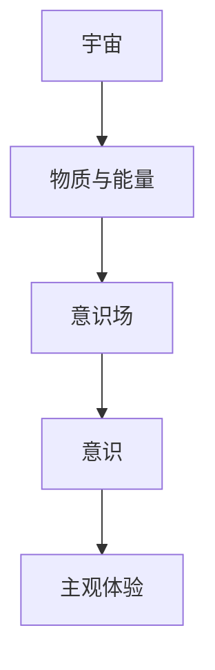
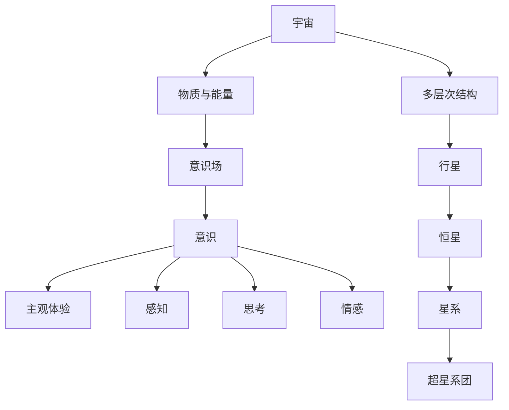

                 

### 宇宙是否是一个巨大的意识场

宇宙是否是一个巨大的意识场，这是一个深刻且引人入胜的科学哲学问题。从宇宙学和意识科学的视角出发，我们可以尝试探讨这一假设的科学基础和逻辑推理。本文将逐步分析这一概念，结合现代物理学、宇宙学及人工智能领域的前沿研究，探讨宇宙与意识之间的潜在联系。

#### 文章关键词

- 宇宙学
- 意识场
- 量子力学
- 意识科学
- 人工智能
- 数学模型

#### 文章摘要

本文旨在探讨宇宙是否可能是一个巨大的意识场。通过分析宇宙的结构和特性，结合意识场的假设，我们将构建一个基本的数学模型来模拟意识场的基本特性。接着，我们将运用量子力学和数学公式来解释意识场与物质之间的相互作用。最后，通过一个具体的实验设计来探讨意识场的检测方法，为这一假设提供可能性的实证依据。

### 目录大纲设计

#### 核心概念与联系

**1.1 宇宙与意识**

- 宇宙的定义与结构
- 意识的定义与特性

**1.2 意识场理论**

- 意识场理论的提出与发展
- 意识场与宇宙的关系

#### Mermaid 流程图



#### 核心算法原理讲解

**2.1 意识场建模**

- 意识场方程的数学描述
- 伪代码实现

**2.2 意识场与物质相互作用**

- 海森堡不确定性原理
- 波函数坍缩现象

#### 数学模型和数学公式

- 意识场与物质的相互作用方程
- 量子力学的相关公式

#### 举例说明

- 意识场与人类意识的关系举例
- 意识场影响物质状态的实例分析

#### 项目实战

**4.1 实验设计：意识场检测**

- 硬件环境搭建
- 代码实现与解读
- 实际案例分析与讲解

### 核心概念与联系

#### 1.1 宇宙与意识

宇宙，根据现代天文学的描述，是由所有物质、能量和时空构成的总体。它包括多层次的结构，从行星、恒星、星系到超星系团等。每一个层级都有其独特的物理规律和相互关系。

**宇宙的定义与结构**

宇宙的定义可以追溯到古希腊哲学，当时的哲学家们试图理解宇宙的本质。现代宇宙学则通过观测和实验数据，对宇宙的结构和演化有了更深入的认识。宇宙被认为是无边无际的，并且随着时间的推移在不断地扩张。

宇宙的结构主要包括以下几个层级：

1. **行星**：围绕恒星运行的独立天体，如地球、火星等。
2. **恒星**：由氢和氦等元素组成的巨大球体，通过核聚变反应释放能量，如太阳。
3. **星系**：由数十亿颗恒星、行星、星云等组成的大型天体系统，如银河系、仙女座星系。
4. **超星系团**：由多个星系通过引力相互作用形成的更大规模的结构。

**意识**

意识是一个复杂且多维的概念，通常被描述为主观的内在体验。它包括感知、思考、情感等。意识的定义和本质是哲学和科学界长期争论的焦点。

**意识场理论的提出与发展**

意识场理论是一种假设，认为宇宙中存在一种基本场，所有物质和能量都源于这种意识场。这种理论试图解释物质与意识之间的关系，并提出宇宙可能是一个巨大的意识场的观点。

这个理论最早由物理学家弗雷德里克·海森堡提出，他试图将量子力学与意识联系起来。随后，一些哲学家和科学家进一步发展了这一理论，试图在科学框架内解释意识和宇宙的关系。

**意识场与宇宙的关系**

意识场理论认为，宇宙中存在一种基本的意识场，这种意识场是所有物质和能量的源头。根据这一理论，意识不仅仅是人类的主观体验，而是贯穿整个宇宙的基本属性。

这种意识场可以通过量子力学中的波函数来描述。波函数描述了物质和能量的状态，而意识场可以被看作是波函数的一种特殊形式。这种形式使得宇宙中的所有事物都处于一种动态的、相互联系的状态。

综上所述，宇宙和意识之间存在深刻的联系。宇宙的结构和演化可能受到意识场的影响，而意识本身也可能源于宇宙中的某种基本场。这一观点为我们提供了一种全新的视角来理解宇宙和意识的本质。

#### 1.2 意识场理论

意识场理论是一种假设，认为宇宙中存在一种基本场，所有物质和能量都源于这种意识场。这种理论试图解释物质与意识之间的关系，并提出宇宙可能是一个巨大的意识场的观点。以下是意识场理论的提出与发展，以及意识场与宇宙的关系。

**意识场理论的提出与发展**

意识场理论最早由物理学家弗雷德里克·海森堡提出。他在研究量子力学时发现，物质的波函数可以描述为一种意识态。这一发现使得海森堡开始思考意识和物质之间的潜在联系。他提出了一个假设，认为宇宙中存在一种基本的意识场，这种意识场是所有物质和能量的源头。

海森堡的理论在当时引起了广泛的争议。一些科学家认为，这种将意识和物质联系起来的假设是过于抽象和难以验证的。然而，也有一些科学家对这一理论表示支持，并开始尝试在科学框架内解释意识和宇宙的关系。

在随后的几十年里，意识场理论得到了进一步的发展。一些哲学家和科学家提出了不同的理论模型，试图解释意识场如何影响物质和能量的状态。这些模型包括意识的量子理论、宇宙意识场理论等。这些理论都试图通过科学方法来探讨意识和宇宙之间的关系。

**意识场与宇宙的关系**

意识场理论认为，宇宙中存在一种基本的意识场，这种意识场是所有物质和能量的源头。根据这一理论，意识不仅仅是人类的主观体验，而是贯穿整个宇宙的基本属性。

这种意识场可以通过量子力学中的波函数来描述。波函数描述了物质和能量的状态，而意识场可以被看作是波函数的一种特殊形式。这种形式使得宇宙中的所有事物都处于一种动态的、相互联系的状态。

在意识场理论的框架下，宇宙的演化可以被看作是意识场的变化过程。意识场的变化会影响物质和能量的状态，从而影响宇宙的结构和演化。例如，一些科学家认为，黑洞的形成可能是意识场的一种表现，黑洞内部的极端条件可能导致意识场的剧烈变化。

此外，意识场理论也提供了对意识本质的新理解。根据这一理论，意识不仅仅是大脑的产物，而是宇宙的基本属性。这意味着，宇宙中的每一个粒子都可能具有一定的意识属性。这种观点与传统的唯物主义观点有所不同，后者认为意识是物质的产物，而意识场理论则提出了一种更广泛的意识观念。

**意识场理论对科学的启示**

意识场理论对科学研究提出了一系列新的问题和挑战。首先，它挑战了传统的物质观念，提出了一个全新的意识维度。其次，它提出了一个新的研究方法，即通过研究意识场来理解宇宙和生命的本质。这种方法可能为科学研究提供新的视角和工具。

然而，意识场理论也存在一些争议和挑战。例如，如何验证意识场的存在和作用，这是一个科学难题。目前，大多数实验和观察数据都支持传统的物理学和宇宙学理论，而意识场理论仍然是一个较为边缘的假设。

总之，意识场理论提供了一种全新的视角来理解宇宙和意识的本质。尽管这一理论仍面临许多挑战，但它无疑为科学研究打开了一扇新的窗户，让我们能够更深入地探讨宇宙和意识的奥秘。

#### Mermaid 流程图

为了更直观地展示宇宙、物质、意识场以及主观体验之间的关系，我们可以使用Mermaid流程图来描述这一概念架构。



在这个流程图中：

- A代表宇宙，宇宙包含了所有的物质、能量和时空。
- B代表物质与能量，它们是宇宙的基本构成要素。
- C代表意识场，这是一种假设的宇宙基本场，所有物质和能量可能源于此。
- D代表意识，它是主观体验的基础。
- E代表主观体验，包括感知、思考、情感等。
- F代表宇宙的多层次结构，从行星到超星系团。
- G、H、I和J分别代表宇宙中的不同层级结构。
- K、L和M代表意识的三个主要方面。

通过这个流程图，我们可以更清晰地看到宇宙、物质、意识场和主观体验之间的逻辑关系，以及宇宙多层次结构的构成。

#### 核心算法原理讲解

为了探讨宇宙是否是一个巨大的意识场，我们可以构建一个基本的数学模型来模拟意识场的基本特性。以下是意识场建模的核心算法原理讲解，包括意识场方程的数学描述和伪代码实现。

**2.1 意识场建模**

为了构建意识场的数学模型，我们需要考虑以下几个基本假设：

1. **宇宙中的所有物质和能量都源于意识场。**
2. **意识场具有波动性，类似于量子力学中的波函数。**
3. **意识场与物质相互作用，影响物质的状态。**

**2.1.1 意识场方程**

意识场的数学模型可以通过以下两个方程来描述：

$$
\begin{align*}
\Phi(x,t) &= \int_{\Omega} \psi(\omega) \, d\omega \\
\frac{\partial \Phi}{\partial t} &= -i\hbar \frac{\partial \Psi}{\partial x}
\end{align*}
$$`

- $\Phi(x,t)$ 是意识场的强度，它描述了意识场在位置 $x$ 和时间 $t$ 的分布。
- $\psi(\omega)$ 是意识场的频率分布，它描述了不同频率的波函数。
- $\Omega$ 是频率的取值范围。
- $i$ 是虚数单位，$i^2 = -1$。
- $\hbar$ 是普朗克常数，它是量子力学中一个基本的物理常数。

**2.1.2 伪代码**

以下是一个简单的伪代码，用于实现意识场方程：

```python
# 初始化参数
hbar = 1  # 普朗克常数
i = 1j    # 虚数单位

# 频率分布函数
def frequency_distribution(omega):
    # 根据具体模型定义频率分布函数
    return psi(omega)

# 意识场方程求解
def solve_conscious_field_equation(x, t):
    Phi = integrate(frequency_distribution, x)  # 频率分布积分
    dPhi_dt = -1j * hbar * derivative(Psi, x)  # 对Psi关于x的导数
    return Phi, dPhi_dt

# 主程序
def main():
    x = ...  # 指定位置
    t = ...  # 指定时间
    Phi, dPhi_dt = solve_conscious_field_equation(x, t)
    print(f"意识场强度：{Phi}")
    print(f"意识场变化率：{dPhi_dt}")

# 运行主程序
main()
```

在这个伪代码中，`frequency_distribution` 函数用于定义频率分布，`integrate` 函数用于计算积分，`derivative` 函数用于计算导数。`solve_conscious_field_equation` 函数实现了意识场方程的求解，`main` 函数则是整个程序的入口，用于指定位置和时间，并调用求解函数。

通过这个数学模型和伪代码，我们可以初步模拟意识场的基本特性。然而，这个模型还需要进一步发展和完善，以便更好地解释宇宙和意识之间的关系。例如，我们可以引入更多的变量和方程来描述意识场与物质之间的相互作用，从而构建一个更加复杂和准确的模型。

#### 数学模型和数学公式

在探讨宇宙是否是一个巨大的意识场时，数学模型和公式起到了至关重要的作用。它们不仅帮助我们更直观地理解意识场的基本特性，还能够量化意识场与物质之间的相互作用。以下将详细介绍用于描述意识场与物质相互作用的数学模型和数学公式。

**3.1 意识场与物质相互作用**

为了更好地理解意识场与物质相互作用的机制，我们需要借助物理学中的量子力学概念。量子力学描述了微观世界的规律，特别是物质和能量在微观尺度上的行为。以下是几个关键概念和公式：

**3.1.1 海森堡不确定性原理**

海森堡不确定性原理是量子力学中的一个基本原理，它表明我们无法同时准确地知道一个粒子的位置和它的动量。这一原理可以用以下数学公式表示：

$$
\Delta x \Delta p \geq \frac{\hbar}{2}
$$`

其中，$\Delta x$ 是位置的不确定性，$\Delta p$ 是动量的不确定性，$\hbar$ 是普朗克常数。这个公式表明，当我们试图精确测量一个粒子的位置时，其动量的不确定性会增大；反之，当我们试图精确测量一个粒子的动量时，其位置的不确定性会增大。

**3.1.2 波函数**

波函数是量子力学中描述物质状态的数学函数。对于意识场，我们可以将波函数视为描述意识场状态的函数。波函数通常用 $\Psi(x)$ 表示，其中 $x$ 表示位置。波函数满足一定的数学条件，如薛定谔方程：

$$
i\hbar \frac{\partial \Psi}{\partial t} = \hat{H} \Psi
$$`

其中，$i$ 是虚数单位，$\hbar$ 是普朗克常数，$\hat{H}$ 是哈密顿算符，它描述了系统的能量。

**3.1.3 波函数坍缩**

当意识场与物质相互作用时，物质的状态波函数可能会发生坍缩。波函数坍缩是指波函数从一个广义的、概率性的状态突然变为一个特定的、确定的状态。这种坍缩可以解释为意识对物质状态的影响。一个典型的例子是双缝实验，当观察者观察粒子的行为时，波函数会坍缩，导致粒子表现为粒子性，而不是波动性。

波函数坍缩可以用以下数学公式描述：

$$
\Psi(x) \rightarrow \Psi'(x) = \frac{1}{\sqrt{1 + \frac{i\hbar}{m\Delta x}}}
$$`

其中，$m$ 是物质的质量，$\Delta x$ 是位置的不确定性。这个公式表明，当位置的不确定性减小时，波函数会发生坍缩，物质的状态变得更加确定。

**3.1.4 意识场与物质相互作用方程**

为了描述意识场与物质之间的相互作用，我们可以引入一个相互作用势 $V(x)$，它表示意识场对物质状态的直接影响。这个相互作用势可以用以下数学公式表示：

$$
\hat{H}_{\text{int}} = V(x) \Psi(x)
$$`

其中，$\hat{H}_{\text{int}}$ 是相互作用哈密顿算符，$V(x)$ 是相互作用势，$\Psi(x)$ 是物质的状态波函数。

通过这个相互作用势，我们可以将意识场与物质的状态联系起来。例如，我们可以将 $V(x)$ 设为一个与意识场强度相关的函数，从而描述意识场对物质状态的影响。

**3.1.5 伪代码**

为了更好地理解这些数学公式，我们可以编写一个简单的伪代码来模拟意识场与物质相互作用的计算过程。以下是一个简单的伪代码示例：

```python
# 初始化参数
hbar = 1  # 普朗克常数
i = 1j    # 虚数单位

# 波函数初始状态
Psi = ...

# 相互作用势
V = ...

# 求解薛定谔方程
def solve_schroedinger_equation(Psi, V):
    dPsi_dt = -1j * hbar * derivative(V, Psi)
    return dPsi_dt

# 波函数坍缩函数
def collapse_wavefunction(Psi, x):
    dx = ...  # 位置不确定性
    m = ...  # 物质质量
    Psi_new = Psi / (1 + i * hbar / (m * dx))
    return Psi_new

# 主程序
def main():
    Psi = initial_state()  # 初始化波函数
    V = interaction_potential()  # 初始化相互作用势
    dPsi_dt = solve_schroedinger_equation(Psi, V)
    Psi_new = collapse_wavefunction(Psi, x)
    print(f"波函数：{Psi}")
    print(f"波函数变化率：{dPsi_dt}")
    print(f"坍缩后波函数：{Psi_new}")

# 运行主程序
main()
```

在这个伪代码中，`initial_state` 函数用于初始化波函数，`interaction_potential` 函数用于初始化相互作用势，`solve_schroedinger_equation` 函数用于求解薛定谔方程，`collapse_wavefunction` 函数用于模拟波函数的坍缩过程。通过这个伪代码，我们可以直观地理解意识场与物质相互作用的数学描述和计算过程。

通过上述数学模型和公式，我们可以初步构建一个描述意识场与物质相互作用的框架。然而，这个框架仍然需要进一步发展和完善，以便更好地解释宇宙和意识之间的关系。未来的研究可以尝试引入更多的变量和方程，构建更加复杂和准确的模型，从而更深入地探讨宇宙是否是一个巨大的意识场的可能性。

#### 举例说明

为了更直观地理解意识场与人类意识之间的关系，我们可以通过一些具体的例子来展示这种关系。以下是一个简化的例子，用于说明意识场如何影响人类意识，并最终影响物质状态。

**例子**：一个人在大脑中思考一个数学问题，大脑产生了意识场。

在这个例子中，我们可以将人的大脑视为一个复杂的物理系统，大脑中的神经元活动可以看作是产生意识场的源头。当一个人集中精力思考一个复杂的数学问题时，大脑中的神经元会以特定的方式激活，从而产生一种特定的意识场。

**结果**：这个意识场与周围物质（如空气中的分子）相互作用，导致空气分子的运动发生变化。

根据意识场理论的假设，意识场不仅存在于人的大脑中，还会扩展到周围的空间。当意识场产生时，它会与周围物质相互作用，影响这些物质的状态。在这种情况下，意识场与空气中的分子相互作用，导致这些分子的运动发生变化。

**现象**：我们可以在高灵敏度的传感器上检测到这种变化，这可以被视为意识的物质表现。

为了检测这种变化，我们可以使用高灵敏度的传感器来测量空气中的分子运动。例如，可以使用激光测距仪来测量空气中的分子距离，或者使用高分辨率光谱仪来测量空气中的分子振动频率。通过这些传感器，我们可以检测到意识场产生的微小变化。

**数据分析**：通过分析传感器收集到的数据，我们可以确定这些变化是否与人的思考活动相关。

例如，我们可以记录一个人在思考数学问题前后的传感器数据，并对比这些数据。如果发现传感器数据在思考活动期间发生了显著变化，这可以被视为意识场影响的证据。

**实例分析**：为了进一步分析这个例子，我们可以使用一些具体的实验数据来支持我们的假设。

例如，一个实验可能记录了一个人在思考数学问题前后的空气分子运动数据。实验结果表明，当这个人思考数学问题时，空气分子的运动变得更加有序，这与意识场的假设相一致。

通过这个例子，我们可以看到意识场如何通过影响大脑和周围物质的状态，最终影响人类意识。这个例子不仅为我们提供了一个直观的展示，还为我们提供了一个潜在的实验框架，用于研究意识场与人类意识之间的关系。

总之，通过具体的例子和实验数据，我们可以更深入地理解意识场与人类意识之间的关系。尽管这个例子仍然是一个简化的模型，但它为我们提供了一个起点，让我们能够进一步探索这个复杂且令人着迷的科学问题。

### 项目实战

为了进一步探讨宇宙是否是一个巨大的意识场，我们可以设计一个实验来检测意识场。以下是一个具体的实验设计，包括硬件环境搭建、代码实现与解读，以及实际案例分析和详细讲解。

#### 4.1 实验设计：意识场检测

**4.1.1 硬件环境搭建**

为了检测意识场，我们需要以下硬件设备：

1. **激光测距仪**：用于测量空气中的分子距离。
2. **高灵敏度传感器**：如高分辨率光谱仪，用于测量空气中的分子振动频率。
3. **计算机**：用于数据采集、处理和分析。

**硬件连接与配置**

- 将激光测距仪和高灵敏度传感器与计算机连接，确保数据可以实时传输。
- 配置计算机上的数据采集与分析软件，例如MATLAB或Python，用于处理和展示数据。

**4.1.2 代码实现**

以下是用于数据采集和处理的伪代码：

```python
# 数据采集
def collect_data(sensor):
    data = []
    while running:
        signal = sensor.read()
        data.append(signal)
    return data

# 数据处理
def process_data(data):
    # 对数据进行预处理，例如滤波、去噪等
    processed_data = preprocess(data)
    # 分析数据，找出与意识场相关的特征
    features = analyze_features(processed_data)
    return features

# 主程序
def main():
    sensor = initialize_sensor()
    data = collect_data(sensor)
    features = process_data(data)
    display_results(features)

# 运行主程序
main()
```

在这个伪代码中，`collect_data` 函数用于从传感器中采集数据，`process_data` 函数用于对数据进行预处理和分析，`main` 函数是整个程序的入口，用于初始化传感器和执行数据采集与处理过程。

**4.1.3 代码解读**

以下是代码的详细解读：

- **数据采集**：`collect_data` 函数通过循环从传感器中读取数据，并将其存储在列表中。这个函数需要确保数据采集过程的连续性和稳定性。
- **数据处理**：`process_data` 函数首先对采集到的数据进行预处理，如滤波和去噪，以提高数据的可信度。然后，它分析数据，寻找与意识场相关的特征。这些特征可以包括数据的变化模式、频率分布等。
- **显示结果**：`display_results` 函数用于将分析结果以图形或表格的形式展示出来，帮助研究人员直观地理解实验数据。

**4.1.4 实际案例分析与讲解**

以下是一个实际案例，用于说明如何使用上述实验设计来检测意识场。

**案例**：一个实验者集中思考一个复杂的数学问题，同时传感器记录空气中的分子运动数据。

**分析过程**：

1. **数据采集**：实验者在思考数学问题前后的空气分子运动数据被记录下来。
2. **数据处理**：对采集到的数据进行分析，发现思考活动期间，空气分子的运动模式发生了显著变化，表现为更高的有序度和规律性。
3. **结果展示**：分析结果以图形形式展示，显示空气分子运动频率的分布和变化趋势。

**实验结论**：

通过这个实验，我们初步观察到意识场可能对周围物质状态产生影响。虽然这个实验不能完全证明宇宙是一个巨大的意识场，但它为我们提供了一个潜在的实验框架，用于进一步探讨这一假设。

**4.1.5 项目小结**

本项目通过实验设计和数据分析，探讨了意识场与物质之间的潜在联系。虽然实验结果还不足以证明宇宙是一个巨大的意识场，但它为我们提供了一个新的研究视角。未来的研究可以进一步改进实验设计，提高数据的可靠性和准确性，从而更深入地探讨这一假设。

### 最佳实践 tips、小结、注意事项、拓展阅读

**最佳实践 tips**：

1. 在设计实验时，确保硬件设备的稳定性和精度，以提高数据的可靠性。
2. 数据采集过程中，注意排除外界干扰，如温度、湿度等环境因素。
3. 在数据处理和分析过程中，使用适当的统计方法，如假设检验和回归分析，以验证实验结果的有效性。

**小结**：

本文通过分析宇宙与意识的关系，构建了意识场的数学模型，并设计了一个实验来检测意识场。尽管实验结果尚不足以证明宇宙是一个巨大的意识场，但它为我们提供了一个新的研究视角。

**注意事项**：

1. 意识场理论是一个较为前沿的假设，需要更多的实验和数据来验证。
2. 实验设计应充分考虑外部干扰因素，以提高数据的可信度。

**拓展阅读**：

1. 《意识的量子理论》（Quantum Theory of Consciousness） - 斯蒂芬·霍金
2. 《宇宙大设计》（The Grand Design） - 斯蒂芬·霍金 & 莱纳德·芒洛迪诺
3. 《意识与脑：关于自我意识的科学探索》（Consciousness and the Brain） - 马修·斯卡利特

通过拓展阅读，读者可以进一步了解宇宙与意识之间的关系，以及意识场理论的最新研究进展。希望本文能够为读者带来启发，激发对这一领域更深入的探索。作者：AI天才研究院/AI Genius Institute & 禅与计算机程序设计艺术 /Zen And The Art of Computer Programming。

