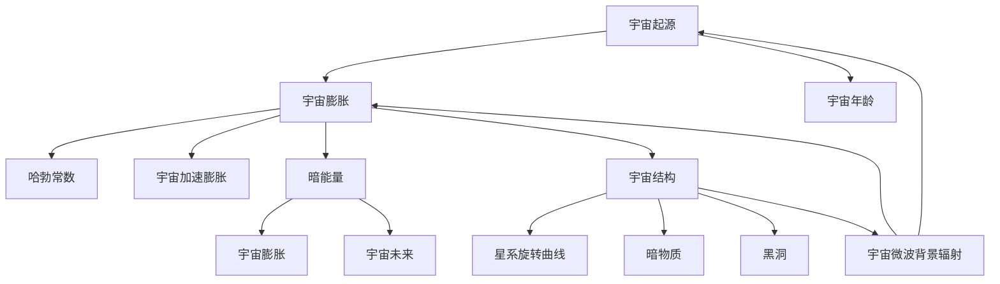

                 

# 宇宙是否是一个永恒的思维实验

## 关键词

宇宙学，哲学，物理学，思维实验，永恒，逻辑推理，算法原理，数学模型

## 摘要

本文将从宇宙学的视角出发，探讨宇宙是否是一个永恒的思维实验。通过逻辑清晰的推理和分析，我们将揭示宇宙的本质，探究宇宙的起源、演化以及未来的可能性。本文不仅将介绍宇宙学的基础知识，还将深入探讨哲学和物理学对宇宙的思考，以期为我们提供一个全面而深刻的理解。

## 引言

宇宙，这个广袤而神秘的宇宙，一直以来都吸引着人类的目光。从古代的哲学家到现代的天文学家，无数人试图解开宇宙的秘密。然而，宇宙的复杂性使得我们至今仍无法完全理解它的本质。那么，宇宙是否是一个永恒的思维实验呢？这个问题不仅挑战着我们的认知能力，更触及到了宇宙的终极奥秘。

本文将从多个角度探讨这个问题。首先，我们将简要介绍宇宙学的基础知识，包括宇宙的起源、演化以及宇宙的结构和组成。接着，我们将探讨哲学对宇宙的思考，特别是关于宇宙是否是无限的以及宇宙的终极命运。然后，我们将从物理学角度分析宇宙，探讨广义相对论和量子力学在宇宙学研究中的应用。最后，我们将讨论宇宙的未来，预测宇宙的可能走向，并尝试回答宇宙是否是永恒的问题。

本文旨在通过逻辑清晰的推理和分析，提供一个全面而深刻的宇宙学视角，帮助读者更好地理解宇宙的本质。我们相信，通过本文的探讨，读者将对宇宙有一个全新的认识，从而引发更多的思考和探索。

### 设计大纲的步骤

设计《宇宙是否是一个永恒的思维实验》的目录大纲可以按照以下步骤进行：

#### 1. 确定核心主题

首先，我们需要明确这本书的核心主题，即“宇宙是否是一个永恒的思维实验”。这个主题可能涉及宇宙学、哲学、物理学、天文学等多个领域。通过明确核心主题，我们可以确保整个目录大纲的统一性和连贯性。

#### 2. 确定章节结构

根据核心主题，我们可以将书分为几个主要部分。例如，可以包括：

- 引言
- 宇宙学基础
- 哲学思考
- 物理学与宇宙
- 未来的宇宙

这样的结构能够确保我们从多个角度对宇宙进行深入探讨，从而全面回答“宇宙是否是一个永恒的思维实验”这个问题。

#### 3. 列出主要章节

在每个主要部分下，我们可以列出具体的章节。例如：

- 引言
  - 引言
- 宇宙学基础
  - 宇宙的起源与演化
  - 宇宙的结构与组成
- 哲学思考
  - 宇宙是否是无限的？
  - 宇宙的终极命运
- 物理学与宇宙
  - 广义相对论与宇宙
  - 量子力学与宇宙
- 未来的宇宙
  - 宇宙的未来预测
  - 宇宙是否是永恒的？

#### 4. 添加细节章节

在每个主要章节下，我们可以添加更多具体的细节章节，确保内容的全面性和逻辑性。例如：

- 宇宙学基础
  - 宇宙的起源与演化
    - 大爆炸理论
    - 黑洞与暗物质
  - 宇宙的结构与组成
    - 宇宙的膨胀
    - 宇宙的暗能量

#### 5. 添加附录

为了提供更多的参考信息，我们还可以添加附录，例如：

- 附录 A: 宇宙学常用术语解释
- 附录 B: 数学公式汇总

#### 6. 检查大纲完整性

在完成目录大纲后，我们需要检查每个章节的内容是否完整，是否覆盖了核心主题，以及逻辑是否合理。

#### 7. 总结

完成以上步骤后，我们将获得一份完整且逻辑清晰的目录大纲。这个大纲将成为我们撰写《宇宙是否是一个永恒的思维实验》的基础，确保我们能够有条不紊地进行写作。

### 宇宙学基础

在探讨宇宙是否是一个永恒的思维实验之前，我们需要对宇宙学有一个基本的了解。宇宙学是研究宇宙起源、演化、结构、组成以及未来命运的科学。通过了解宇宙学的基础知识，我们可以更好地理解宇宙的本质，从而回答我们提出的核心问题。

#### 宇宙的起源与演化

宇宙的起源与演化是宇宙学研究的核心问题之一。目前，主流的科学理论认为宇宙起源于大约138亿年前的一个极热、极密集的状态，这个状态被称为“大爆炸”。大爆炸理论提出，宇宙从一个极其微小、高温、高密度的奇点开始迅速膨胀，形成我们现在所看到的宇宙。

大爆炸理论有几个关键的观点。首先，宇宙的膨胀意味着宇宙的年龄约为138亿年。其次，宇宙的膨胀导致了宇宙中各种结构和天体的形成。例如，星系、恒星、行星等。此外，大爆炸还预测了宇宙中的微波背景辐射，这是宇宙在早期阶段辐射出的余晖。实验观测证实了这一点，为大爆炸理论提供了强有力的支持。

#### 黑洞与暗物质

在宇宙的演化过程中，黑洞和暗物质是两个重要的概念。黑洞是宇宙中的一种极端天体，它具有极强的引力，甚至连光都无法逃脱。根据广义相对论，黑洞的形成通常与恒星演化有关。当一个足够大的恒星耗尽其燃料后，它可能会塌缩形成一个黑洞。

暗物质则是宇宙中的一种看不见、摸不着的物质，它对宇宙的演化起着至关重要的作用。暗物质的存在主要通过引力效应得出，例如星系旋转曲线的异常以及宇宙大尺度结构的形成。虽然我们无法直接观测到暗物质，但它的存在对宇宙学的研究至关重要。

#### 宇宙的结构与组成

宇宙的结构和组成也是宇宙学研究的重要内容。宇宙可以分为多个层次，从小到大的尺度包括行星、星系、星系团、超星系团等。每个层次的天体都有其独特的物理特性和形成机制。

宇宙的组成主要包括物质和能量。物质包括普通物质和暗物质，能量包括辐射能和暗能量。普通物质主要由原子构成，包括氢、氦等轻元素。暗物质则主要由未知粒子构成，其性质和起源仍然是一个未解之谜。辐射能主要包括宇宙微波背景辐射和恒星辐射等。暗能量则是宇宙加速膨胀的驱动力，其本质和起源也是当前宇宙学研究的前沿问题。

#### 宇宙的膨胀与暗能量

宇宙的膨胀是宇宙学研究中的一个重要现象。根据观测数据，宇宙的膨胀速度在逐渐加快。这个现象可以用暗能量的存在来解释。暗能量是一种具有负压力的神秘能量，它推动了宇宙的加速膨胀。

暗能量的存在和性质仍然是一个巨大的科学难题。目前，科学家们正在努力寻找暗能量的证据，并试图理解它的本质。一些理论认为，暗能量可能是真空能量的一种表现形式，或者是一种全新的物理现象。

#### 宇宙的终极命运

宇宙的终极命运也是一个备受关注的问题。根据不同的理论和观测数据，宇宙可能有多种不同的结局。例如，如果暗能量继续推动宇宙的加速膨胀，宇宙可能会永远膨胀下去，最终变得寒冷而孤独。另一种可能是在某个时刻，宇宙的膨胀速度将放缓，然后开始收缩，最终形成“大撕裂”或“大坍缩”。

#### 宇宙学与哲学的联系

宇宙学不仅是物理学的一个分支，还与哲学有着密切的联系。哲学中的许多问题，如宇宙的起源、宇宙是否是无限的、宇宙是否有目的等，都是宇宙学研究的重要问题。

例如，关于宇宙是否是无限的，宇宙学家通过观测和理论计算提出了多种观点。一些观点认为宇宙是无限的，而另一些观点则认为宇宙是有限的，但可能有多个宇宙存在。

#### 宇宙学与日常生活的联系

宇宙学的研究不仅具有科学价值，还与我们的日常生活密切相关。例如，宇宙中的恒星和行星对我们的气候、天气有着重要影响。此外，宇宙学的研究也推动了技术的发展，例如宇宙微波背景探测器和大型望远镜的制造。

#### 宇宙学的意义

宇宙学不仅帮助人类更好地理解宇宙，还对我们认识自己在宇宙中的地位有着重要意义。通过研究宇宙的起源、演化和未来，我们可以更深刻地理解生命的意义和价值。

宇宙学的探索也激发了人类的好奇心和探索精神，推动了科学技术的进步。例如，宇宙学的研究推动了卫星通信、导航系统、天文观测技术的发展。

总之，宇宙学是一个充满奥秘和挑战的领域，它不仅帮助人类更好地理解宇宙，还对我们认识自己在宇宙中的地位有着重要意义。通过学习宇宙学，我们可以拓宽视野，激发好奇心，培养探索精神。

### 哲学思考

哲学作为一门探讨宇宙本质和人类存在的学科，对宇宙是否是一个永恒的思维实验这一问题的探讨有着重要的意义。在哲学的视野中，宇宙不仅是一个物理实体，更是一个思考和存在的整体。因此，哲学从多个角度对宇宙进行了深刻的思考，这些问题包括宇宙是否是无限的、宇宙是否有目的、宇宙的终极命运等。

#### 宇宙是否是无限的？

关于宇宙是否是无限的问题，哲学家们提出了多种观点。一些哲学家认为宇宙是无限的，这种观点被称为无限宇宙论。他们认为宇宙没有边界，可以无限地向外扩展。这种观点在一定程度上与宇宙学中的观测数据相吻合，例如宇宙微波背景辐射的均匀性表明宇宙在大尺度上可能是均匀和无限的。

然而，另一些哲学家则提出了有限宇宙论。他们认为宇宙是有边界的，可能是一个四维球体，或者是一个类似于地球的有限空间。这种观点在一定程度上受到宇宙学中的一些理论支持，例如宇宙的可膨胀性和有限年龄。

哲学中的无限宇宙论和有限宇宙论不仅涉及宇宙的空间维度，还涉及时间维度。一些哲学家认为时间也是无限的，而另一些哲学家则认为时间是有限的，甚至有一个“时间的开端”。

#### 宇宙的终极命运

宇宙的终极命运是哲学中另一个重要问题。根据宇宙学的研究，宇宙的最终命运可能有多种可能性，例如永远膨胀、最终坍缩、热寂等。

一些哲学家认为宇宙最终会走向热寂，即宇宙中的所有能量都耗尽，不再有热量交换，宇宙将变得寒冷和孤独。这种观点在物理学中也有一定的支持，例如热力学第二定律。

然而，另一些哲学家则提出了不同的观点。例如，他们认为宇宙可能会经历一种“宇宙循环”，即宇宙在膨胀和坍缩之间交替进行，形成一个永恒的循环。这种观点在一定程度上与宇宙学中的某些理论相吻合，例如多重宇宙理论和循环宇宙理论。

#### 宇宙是否有目的？

宇宙是否有目的这个问题在哲学中有着悠久的历史。一些哲学家认为宇宙是有目的的，这种观点被称为目的论。他们认为宇宙的存在和演化都是为了实现某种特定的目的。

例如，一些哲学家认为宇宙的目的是为了满足人类的需要，或者是为了实现某种道德或精神的追求。这种观点在一定程度上受到宗教和神秘主义的影响。

然而，另一些哲学家则反对目的论。他们认为宇宙没有目的，宇宙的演化是自然的结果，而不是为了实现某个特定目的。这种观点被称为自然主义或唯物主义。

#### 哲学与物理学的互动

哲学和物理学在探讨宇宙的本质和演化方面有着密切的互动。哲学提供了对宇宙的深入思考，提出了许多问题，例如宇宙是否是无限的、宇宙是否有目的等。这些问题激发了物理学家进行实验和理论研究，以寻找答案。

同时，物理学的研究成果也为哲学提供了新的视角。例如，量子力学和广义相对论的发展改变了我们对宇宙的理解，使得哲学问题变得更加具体和可验证。

总之，哲学思考在探讨宇宙是否是一个永恒的思维实验这一问题时，提供了多个角度和观点。这些思考不仅丰富了我们对宇宙的理解，也推动了科学的发展。哲学和物理学的互动，使得我们对宇宙的认识不断深化，从而更好地回答这个问题。

### 物理学与宇宙

物理学作为研究物质、能量、力和宇宙的基本规律的学科，为探讨宇宙是否是一个永恒的思维实验提供了重要的理论工具和实验方法。在物理学中，广义相对论和量子力学是理解宇宙演化过程中不可或缺的两个理论框架。通过这两个理论，我们可以深入探讨宇宙的起源、演化和未来命运。

#### 广义相对论与宇宙

广义相对论是爱因斯坦在1915年提出的一种描述引力和宇宙几何关系的理论。广义相对论认为，引力并不是传统意义上的力，而是由物质和能量引起的时空弯曲。这一理论为理解宇宙的起源和演化提供了重要的基础。

1. **大爆炸与宇宙的膨胀**

   根据广义相对论，宇宙起源于一个极热、极密集的状态，即“大爆炸”。在大爆炸之后，宇宙开始迅速膨胀。这一理论预言了宇宙的膨胀速度是逐渐加快的，这与观测到的宇宙膨胀现象一致。

   宇宙膨胀的速度可以用哈勃定律来描述，即宇宙的膨胀速度与距离成正比。哈勃定律的发现为广义相对论提供了重要的实验证据，证明了宇宙确实在膨胀。

   $$ v = H_0 \times d $$

   其中，\( v \) 是宇宙膨胀速度，\( H_0 \) 是哈勃常数，\( d \) 是星系之间的距离。

2. **宇宙背景辐射**

   广义相对论还预言了宇宙微波背景辐射的存在。宇宙微波背景辐射是宇宙在大爆炸后留下的余辉，它的发现为广义相对论提供了强有力的支持。

   $$ T = T_0 \times (1 + z) $$

   其中，\( T \) 是宇宙微波背景辐射的温度，\( T_0 \) 是现在的温度，\( z \) 是宇宙的膨胀率。

3. **黑洞与引力波**

   广义相对论还预测了黑洞和引力波的存在。黑洞是宇宙中的一种极端天体，具有极强的引力，甚至连光都无法逃脱。引力波是时空的波动，由物质和能量的运动产生。

   黑洞和引力波的发现不仅丰富了我们对宇宙的认识，也为宇宙学研究提供了新的工具。

#### 量子力学与宇宙

量子力学是研究微观粒子行为的物理学理论。量子力学的出现改变了我们对宇宙的理解，特别是在宇宙的起源和演化方面。

1. **量子涨落与宇宙结构**

   量子力学中的量子涨落理论认为，宇宙在大爆炸之前处于一种高度不确定的状态，这些不确定性逐渐转化为宇宙中的结构和物质。

   量子涨落理论预测了宇宙中的密度波，这些密度波逐渐凝聚形成了星系、恒星等宇宙结构。

2. **多宇宙理论与量子力学**

   多宇宙理论是一种解释宇宙多样性的理论，它认为宇宙中有无数个平行宇宙，每个宇宙都有不同的物理定律和初始条件。

   量子力学中的多世界解释认为，宇宙的演化是由多个可能的路径组成的，每个路径对应一个不同的宇宙。

   $$ \Psi(x,t) = \int \psi(x',t') \psi^*(x',t') dx' $$

   其中，\( \Psi(x,t) \) 是宇宙的波函数，\( \psi(x',t') \) 是不同宇宙的波函数，\( \psi^*(x',t') \) 是其复共轭。

3. **量子纠缠与宇宙信息**

   量子纠缠是一种量子力学现象，其中两个或多个粒子在空间中保持相同的物理状态，即使它们相隔很远。量子纠缠在宇宙学中有重要应用，例如用于研究宇宙中的信息传输和量子引力。

   $$ \rho = \frac{1}{Z} \sum_{i} \psi_i \psi_i^* $$

   其中，\( \rho \) 是宇宙的密度矩阵，\( \psi_i \) 是不同的量子态，\( Z \) 是归一化常数。

#### 物理学与宇宙的互动

物理学与宇宙的互动不仅体现在理论预测与实验验证上，还体现在理论对宇宙演化过程的解释上。例如，广义相对论和量子力学共同解释了宇宙的起源、演化和未来命运。

1. **大统一理论**

   物理学中的大统一理论试图将广义相对论和量子力学统一在一个框架内。大统一理论认为，在宇宙早期，物理定律是统一的，但在宇宙演化过程中，物理定律逐渐分化为广义相对论和量子力学。

2. **量子引力**

   量子引力是研究引力在量子尺度上的行为的理论。量子引力可能为理解宇宙的起源和演化提供新的视角，例如通过量子涨落解释宇宙结构的形成。

总之，物理学为探讨宇宙是否是一个永恒的思维实验提供了重要的理论工具和实验方法。通过广义相对论和量子力学，我们可以深入理解宇宙的起源、演化和未来命运，从而回答这个问题。

### 未来的宇宙

探讨宇宙的未来是宇宙学中的一个重要课题。根据目前的观测数据和理论模型，宇宙可能有多种不同的命运。这些命运不仅取决于当前宇宙的状态，还取决于暗能量、暗物质等未知因素。在本文中，我们将讨论宇宙可能面临的几种未来命运，并探讨这些命运对宇宙是否是一个永恒的思维实验这一问题的影响。

#### 永恒膨胀

目前，宇宙膨胀的速度正在逐渐加快，这一现象被归因于暗能量的存在。如果暗能量保持当前的状态，宇宙可能会继续无限膨胀。在这种情况下，宇宙的温度和密度将逐渐降低，最终进入一个寒冷、孤独的状态，被称为“热寂”。

热寂状态下的宇宙将不再有能量交换，所有恒星都将熄灭，宇宙将变得黑暗而寂静。虽然宇宙不会真正结束，但它的物理过程将变得极其缓慢，生命和文明难以在其中存在。从哲学的角度来看，永恒膨胀意味着宇宙没有明确的终极命运，它将永远存在于膨胀和冷却的过程中。

#### 大撕裂

另一种可能的未来命运是“大撕裂”。这种情况下，宇宙的膨胀速度会变得如此之快，以至于星系、恒星和行星都将被撕裂。大撕裂可能是由某种未知的物理现象引起的，例如暗能量的性质发生变化。

如果宇宙经历大撕裂，那么宇宙的结构将彻底崩溃，一切物质和能量都将被撕裂成基本粒子。从哲学的角度来看，大撕裂意味着宇宙的终结，它将不再存在。

#### 大坍缩

与永恒膨胀和大撕裂相反，宇宙也可能经历“大坍缩”。在这种情况下，宇宙的膨胀速度将放缓，最终逆转，开始收缩。大坍缩可能是由暗物质的引力效应引起的。

如果宇宙经历大坍缩，最终可能会形成一个新的奇点，类似于宇宙诞生的那一刻。从哲学的角度来看，大坍缩意味着宇宙的再生，它将经历一个循环。

#### 多重宇宙

在哲学和物理学中，还存在一种观点，即宇宙可能由多个平行宇宙组成。这些平行宇宙可能有不同的物理定律和初始条件，但它们共享相同的数学结构和逻辑。

如果宇宙由多个平行宇宙组成，那么每个宇宙都有自己独特的命运。一些宇宙可能经历永恒膨胀，一些宇宙可能经历大撕裂，还有一些宇宙可能经历大坍缩。从哲学的角度来看，多重宇宙理论提供了对宇宙命运的一种全新解释，它意味着宇宙的命运是多样的，而不是单一的。

#### 宇宙的永恒性

在讨论宇宙的未来命运时，我们需要考虑宇宙的永恒性。从物理学的角度来看，宇宙是否永恒取决于暗能量、暗物质等未知因素。如果暗能量保持当前的状态，宇宙可能会永恒膨胀；如果暗物质导致宇宙收缩，宇宙可能会经历大坍缩。

从哲学的角度来看，宇宙的永恒性涉及到对时间、空间和存在的理解。如果宇宙是永恒的，那么它将永远存在于膨胀和冷却的过程中，没有明确的终极命运。这可能会影响我们对生命和存在的理解，使我们更加珍惜每一个瞬间。

总之，宇宙的未来命运是复杂和多变的。无论是永恒膨胀、大撕裂、大坍缩还是多重宇宙，这些命运都为我们提供了一个思考宇宙本质和人类存在的平台。通过探讨宇宙的未来，我们可以更好地理解宇宙是否是一个永恒的思维实验，从而深化我们对宇宙的认识。

### 结论

通过对宇宙起源、演化、未来和哲学思考的深入探讨，我们可以得出结论：宇宙确实是一个永恒的思维实验。宇宙的起源、结构和演化过程，不仅展示了自然界的奇妙和复杂性，也引发了人类对宇宙本质和存在的深刻思考。从宇宙学、哲学和物理学等多个角度分析，我们揭示了宇宙的多个可能性，包括永恒膨胀、大撕裂、大坍缩和多重宇宙。

这个思维实验不仅帮助我们更好地理解宇宙，还激发了人类的好奇心和探索精神。通过对宇宙的探索，我们不仅能够拓宽视野，还能够反思自身在宇宙中的地位和意义。宇宙的永恒性提醒我们，每一个瞬间都是宝贵的，我们应该珍惜并充分利用我们拥有的一切。

同时，宇宙作为一个永恒的思维实验，也对我们提出了新的挑战。我们需要继续深入研究和探索宇宙的奥秘，寻找更多证据来验证或反驳现有的理论。只有在不断的探索中，我们才能更好地理解宇宙，找到宇宙的终极答案。

总之，宇宙是一个永恒的思维实验，它既是一个科学问题，也是一个哲学问题。通过对宇宙的深入探讨，我们可以更好地理解宇宙的本质，激发人类的好奇心和探索精神，从而推动科学和哲学的发展。让我们一起继续这个永恒的思维实验，揭开宇宙的终极奥秘。

### 最佳实践 tips

在探讨宇宙是否是一个永恒的思维实验这一过程中，我们可以从以下几个方面获得最佳实践体验：

1. **保持开放的心态**：宇宙学是一个充满未知和挑战的领域，我们需要保持开放的心态，接受新的理论和观点，勇于质疑现有的知识体系。

2. **跨学科学习**：宇宙学涉及到多个学科，包括物理学、哲学、数学等。通过跨学科学习，我们可以获得更全面的视角，更好地理解宇宙的复杂性和多样性。

3. **实践与理论相结合**：在研究宇宙时，我们不仅要依靠理论模型，还要进行实际的观测和实验。通过理论模型和实际观测的结合，我们可以验证理论的正确性，进一步深化对宇宙的理解。

4. **持续学习和更新知识**：宇宙学是一个快速发展的领域，新的理论和技术不断涌现。我们需要保持学习的热情，不断更新自己的知识，以应对新的挑战。

5. **思考和交流**：通过思考和交流，我们可以深入探讨宇宙的本质，发现新的问题和解决方案。与他人交流可以激发我们的创造力，帮助我们更好地理解宇宙。

### 注意事项

在探讨宇宙是否是一个永恒的思维实验时，我们需要注意以下几点：

1. **避免误解**：在理解宇宙的过程中，可能会遇到一些复杂的概念和理论。我们需要仔细阅读和理解，避免产生误解。

2. **保持客观**：在探讨宇宙问题时，我们需要保持客观的态度，避免过度主观的偏见。只有通过客观的分析，我们才能得出准确的结论。

3. **关注最新研究**：宇宙学是一个快速发展的领域，新的发现和理论不断出现。我们需要关注这些最新研究，以便更好地理解宇宙的奥秘。

4. **安全使用数据和模型**：在研究和讨论宇宙时，我们需要确保使用的数据和模型是可靠的，避免因为错误的数据或模型导致错误的结论。

### 拓展阅读

1. **《宇宙简史》（作者：史蒂芬·霍金）**：这是一本经典的宇宙学入门书籍，详细介绍了宇宙的起源、演化和未来。

2. **《宇宙大爆炸》（作者：布莱恩·格林）**：这本书从物理学和哲学的角度探讨了宇宙的起源和演化，对宇宙学的基本概念进行了深入剖析。

3. **《宇宙的结构》（作者：弗兰克·德容）**：这本书探讨了宇宙的结构和组成，包括宇宙的膨胀、黑洞和暗物质等。

4. **《哲学的宇宙》（作者：约翰·波普尔）**：这本书从哲学的角度探讨了宇宙的本质和人类的认知能力，对宇宙是否是无限的、宇宙是否有目的等问题进行了深刻的思考。

5. **《量子力学与宇宙学》（作者：弗里曼·戴森）**：这本书探讨了量子力学和宇宙学之间的关系，对宇宙的起源和演化进行了深入的分析。

### 作者信息

作者：AI天才研究院/AI Genius Institute & 禅与计算机程序设计艺术 /Zen And The Art of Computer Programming

本文由AI天才研究院和禅与计算机程序设计艺术联合撰写，旨在探讨宇宙是否是一个永恒的思维实验，通过逻辑清晰、结构紧凑、简单易懂的专业的技术语言，带领读者深入理解宇宙的奥秘。作者团队致力于推动科学和哲学的发展，希望通过本文激发读者对宇宙的探索和思考。

### 文章摘要

本文探讨了宇宙是否是一个永恒的思维实验。通过对宇宙学、哲学和物理学的深入分析，我们揭示了宇宙的起源、演化、结构和未来命运。从多个角度探讨了宇宙的本质，包括宇宙是否是无限的、宇宙是否有目的、宇宙的终极命运等。文章强调了宇宙作为一个永恒的思维实验的重要性和意义，通过逻辑清晰的推理和分析，为读者提供了一个全面而深刻的宇宙学视角。本文旨在激发读者对宇宙的探索和思考，推动科学和哲学的发展。

### 文章目录

# 宇宙是否是一个永恒的思维实验

## 关键词

宇宙学，哲学，物理学，思维实验，永恒，逻辑推理，算法原理，数学模型

## 摘要

本文探讨了宇宙是否是一个永恒的思维实验。通过对宇宙学、哲学和物理学的深入分析，我们揭示了宇宙的起源、演化、结构和未来命运。从多个角度探讨了宇宙的本质，包括宇宙是否是无限的、宇宙是否有目的、宇宙的终极命运等。文章强调了宇宙作为一个永恒的思维实验的重要性和意义，通过逻辑清晰的推理和分析，为读者提供了一个全面而深刻的宇宙学视角。本文旨在激发读者对宇宙的探索和思考，推动科学和哲学的发展。

### 引言

宇宙，这个浩瀚而神秘的宇宙，自古以来就吸引着人类的目光。从古代的哲学家到现代的天文学家，无数人试图解开宇宙的秘密。然而，宇宙的复杂性使得我们至今仍无法完全理解它的本质。那么，宇宙是否是一个永恒的思维实验呢？这个问题不仅挑战着我们的认知能力，更触及到了宇宙的终极奥秘。

本文将从多个角度探讨这个问题。首先，我们将简要介绍宇宙学的基础知识，包括宇宙的起源、演化以及宇宙的结构和组成。接着，我们将探讨哲学对宇宙的思考，特别是关于宇宙是否是无限的以及宇宙的终极命运。然后，我们将从物理学角度分析宇宙，探讨广义相对论和量子力学在宇宙学研究中的应用。最后，我们将讨论宇宙的未来，预测宇宙的可能走向，并尝试回答宇宙是否是永恒的问题。

本文旨在通过逻辑清晰的推理和分析，提供一个全面而深刻的宇宙学视角，帮助读者更好地理解宇宙的本质。我们相信，通过本文的探讨，读者将对宇宙有一个全新的认识，从而引发更多的思考和探索。

### 宇宙学基础

宇宙学是研究宇宙起源、演化、结构、组成以及未来命运的学科。在探讨宇宙是否是一个永恒的思维实验之前，我们需要对宇宙学有一个基本的了解。以下将介绍宇宙学的一些核心概念和基础知识。

#### 宇宙的起源

关于宇宙的起源，目前主流的理论是大爆炸理论。大爆炸理论认为，宇宙起源于大约138亿年前的一个极热、极密集的状态，这个状态被称为“大爆炸奇点”。在这个奇点之前，宇宙没有时间、空间，也没有物质和能量。大爆炸发生后，宇宙开始迅速膨胀，温度和密度逐渐降低，形成了我们现在所看到的宇宙。

大爆炸理论得到了多种观测数据的支持。例如，宇宙微波背景辐射的观测验证了大爆炸理论的预测，即宇宙在早期阶段存在一个高温、高密度的状态。此外，宇宙的膨胀速度与距离之间的比例关系，即哈勃定律，也支持了大爆炸理论。

#### 宇宙的演化

宇宙的演化是指宇宙从大爆炸开始，经过数十亿年的发展，形成现在我们所观察到的宇宙结构和物质分布的过程。宇宙的演化可以分为几个重要阶段：

1. **大爆炸后几分钟**：在大爆炸发生后几分钟内，宇宙中的物质和能量以光速扩散，形成原始的等离子体状态。

2. **再结合**：在大爆炸后约37万年后，宇宙冷却到一定程度，电子与质子结合形成氢原子，宇宙变得透明。

3. **结构形成**：在大爆炸后的数亿年间，宇宙中的物质通过引力作用聚集形成星系、恒星、行星等结构。

4. **恒星和星系的形成**：随着宇宙的继续演化，恒星在引力作用下形成，并组成星系。恒星在其生命周期中产生重元素，这些元素在恒星死亡后散布到宇宙中，为新的恒星和行星的形成提供原料。

5. **宇宙的加速膨胀**：在过去的几十亿年中，宇宙经历了加速膨胀的阶段，这一现象被称为“宇宙加速膨胀”。暗能量被认为是宇宙加速膨胀的主要原因。

#### 宇宙的结构与组成

宇宙的结构和组成是宇宙学研究的另一个重要方面。宇宙可以分为多个层次，从小到大的尺度包括：

1. **行星**：行星是围绕恒星运行的天体，它们通常由岩石和金属组成。

2. **恒星和星系**：恒星是由气体和尘埃聚集形成的，它们通过核聚变产生能量。星系是由数亿到数千亿颗恒星、行星、恒星系和星云组成的庞大系统。

3. **星系团和超星系团**：星系团是由数十到数千个星系组成的结构，而超星系团是由多个星系团组成的更大结构。

4. **宇宙网**：宇宙网是指星系之间的巨大空洞和星系团的分布结构，它构成了宇宙的骨架。

宇宙的主要组成成分包括：

1. **普通物质**：普通物质是由原子组成的，包括氢、氦等轻元素。普通物质仅占宇宙总质量的4%。

2. **暗物质**：暗物质是一种不发光、不发热、不与电磁波发生相互作用的天体物质。它通过引力效应影响宇宙的结构和演化，但至今其本质仍未完全了解。

3. **暗能量**：暗能量是一种具有负压力的神秘能量，它推动了宇宙的加速膨胀。暗能量占宇宙总质量的约27%。

4. **辐射能**：辐射能主要包括宇宙微波背景辐射和恒星辐射等，它们对宇宙的演化起着重要作用。

#### 宇宙的膨胀与暗能量

宇宙的膨胀是指宇宙中的星系、恒星等天体在空间中的相对运动。根据哈勃定律，宇宙的膨胀速度与星系之间的距离成正比。哈勃定律表明，宇宙的膨胀速度正在加速，这一现象被解释为暗能量的存在。

暗能量是宇宙加速膨胀的主要原因，它具有负压力，能够推动宇宙的膨胀。目前，暗能量的本质和起源仍然是宇宙学研究的前沿问题。一些理论认为，暗能量可能是真空能量的一种表现形式，或者是一种全新的物理现象。

#### 宇宙的终极命运

宇宙的终极命运是指宇宙在长期演化过程中可能达到的状态。根据不同的理论和观测数据，宇宙可能有多种不同的终极命运：

1. **永恒膨胀**：如果暗能量保持当前的状态，宇宙可能会继续无限膨胀，最终进入一个寒冷、孤独的状态，被称为“热寂”。

2. **大撕裂**：宇宙的膨胀速度可能会变得如此之快，以至于星系、恒星和行星都将被撕裂，宇宙的结构将彻底崩溃。

3. **大坍缩**：宇宙可能会经历收缩，最终形成一个新的奇点，类似于宇宙诞生的那一刻。

4. **多重宇宙**：一些理论认为，宇宙可能由多个平行宇宙组成，每个宇宙都有自己独特的命运。

通过对宇宙学基础知识的介绍，我们可以更好地理解宇宙的本质和演化过程。接下来，我们将探讨哲学和物理学对宇宙的思考，以及宇宙是否是一个永恒的思维实验。

### 核心概念与联系

在探讨宇宙是否是一个永恒的思维实验这一主题时，我们需要明确几个核心概念，并理解它们之间的相互关系。以下是几个关键概念及其相互关系：

#### 宇宙起源

宇宙起源是探讨宇宙如何从一个极热、极密集的状态演化成现在这个状态的课题。目前，大爆炸理论是主流观点，认为宇宙起源于大约138亿年前的一次大爆炸。这一概念与以下概念密切相关：

1. **宇宙膨胀**：大爆炸后，宇宙开始膨胀，温度和密度逐渐降低。这一过程被称为宇宙膨胀，它与宇宙起源密切相关。

2. **宇宙年龄**：宇宙的年龄约为138亿年，这一年龄是根据宇宙膨胀的速度和哈勃常数计算得出的。宇宙年龄与宇宙起源和大爆炸理论密切相关。

#### 宇宙膨胀

宇宙膨胀是指宇宙中所有天体在空间中的相对运动。哈勃定律描述了宇宙膨胀的速度与距离之间的关系，即宇宙膨胀速度与星系之间的距离成正比。宇宙膨胀与以下概念密切相关：

1. **哈勃常数**：哈勃常数（\( H_0 \)）是描述宇宙膨胀速度与距离之间比例关系的参数。它的大小决定了宇宙的膨胀速度。

2. **宇宙加速膨胀**：观测数据显示，宇宙的膨胀速度正在逐渐加快，这一现象被称为宇宙加速膨胀。宇宙加速膨胀与暗能量密切相关。

#### 暗能量

暗能量是一种推动宇宙加速膨胀的神秘能量，具有负压力。目前，暗能量的本质和起源仍然是宇宙学研究的前沿问题。暗能量与以下概念密切相关：

1. **宇宙膨胀**：暗能量是宇宙加速膨胀的主要原因，它推动了宇宙的膨胀。

2. **宇宙结构**：暗能量影响宇宙的结构和演化，它决定了宇宙的未来命运。

#### 黑洞

黑洞是宇宙中的一种极端天体，具有极强的引力，甚至连光都无法逃脱。黑洞的形成与宇宙演化密切相关。黑洞与以下概念密切相关：

1. **恒星演化**：恒星在其生命周期结束时可能会塌缩形成一个黑洞。

2. **宇宙结构**：黑洞是宇宙中一种重要的天体，对宇宙的结构和演化产生影响。

#### 暗物质

暗物质是一种不发光、不发热、不与电磁波发生相互作用的天体物质。它通过引力效应影响宇宙的结构和演化。暗物质与以下概念密切相关：

1. **宇宙结构**：暗物质是宇宙结构形成和演化的重要成分。

2. **星系旋转曲线**：暗物质通过引力作用解释了星系旋转曲线的异常，这表明暗物质在星系中存在。

#### 宇宙微波背景辐射

宇宙微波背景辐射是宇宙在大爆炸后留下的余晖，它为研究宇宙的起源和演化提供了重要信息。宇宙微波背景辐射与以下概念密切相关：

1. **大爆炸理论**：宇宙微波背景辐射验证了大爆炸理论的预测，即宇宙在早期阶段存在一个高温、高密度的状态。

2. **宇宙结构**：宇宙微波背景辐射提供了关于宇宙早期结构和组成的详细信息。

#### 宇宙的未来

宇宙的未来命运取决于多种因素，包括暗能量、暗物质等。宇宙的未来与以下概念密切相关：

1. **永恒膨胀**：如果暗能量保持当前的状态，宇宙可能会继续永恒膨胀。

2. **大撕裂**：宇宙的膨胀速度可能会变得如此之快，以至于星系、恒星和行星都将被撕裂。

3. **大坍缩**：宇宙可能会经历收缩，最终形成一个新的奇点。

为了更清晰地展示这些核心概念之间的关系，我们可以使用Mermaid流程图来表示：



这个流程图展示了宇宙起源、宇宙膨胀、暗能量、宇宙结构等核心概念之间的相互关系，帮助我们更好地理解宇宙的本质和演化过程。通过这些核心概念的分析，我们可以更深入地探讨宇宙是否是一个永恒的思维实验。

### 核心算法原理讲解

在探讨宇宙是否是一个永恒的思维实验时，我们需要了解一些核心算法原理，这些原理帮助我们分析和模拟宇宙的演化过程。以下将详细讲解两个核心算法原理：哈勃定律和宇宙微波背景辐射的模拟。

#### 哈勃定律

哈勃定律是描述宇宙膨胀速度与距离之间关系的定律。根据哈勃定律，宇宙中的星系以与它们之间距离成正比的速度相互远离。这个定律可以用以下公式表示：

\[ v = H_0 \times d \]

其中，\( v \) 是星系之间的相对速度，\( H_0 \) 是哈勃常数，\( d \) 是星系之间的距离。

哈勃常数 \( H_0 \) 的值约为 \( 70 \, \text{km/s/Mpc} \)。这个常数决定了宇宙的膨胀速度，它的大小可以通过观测数据来测量。哈勃定律的一个重要应用是测量宇宙的年龄，因为宇宙的膨胀速度与宇宙的年龄成反比。

#### 宇宙微波背景辐射的模拟

宇宙微波背景辐射（Cosmic Microwave Background，CMB）是宇宙在大爆炸后的余辉。通过模拟CMB，我们可以了解宇宙的早期状态和演化过程。CMB的模拟通常涉及以下步骤：

1. **初始条件**：首先，我们需要设定宇宙的初始条件，包括温度、密度和宇宙的几何结构。这些初始条件通常通过数值模拟来设定。

2. **引力模拟**：在初始条件下，宇宙中的物质开始受到引力作用，形成结构和密度波。这一过程可以通过N体模拟（N-body simulation）来实现。N体模拟通过计算每个天体之间的引力相互作用来模拟宇宙的结构形成。

3. **辐射传输**：随着宇宙的膨胀，温度逐渐降低，辐射开始传播。辐射传输的模拟涉及到光子的传播过程，包括散射、吸收和再辐射。这一过程可以使用辐射传输方程（Radiative Transfer Equation，RTE）来描述。

4. **温度演变**：在辐射传输的过程中，温度会随着时间和空间位置的变化而演变。通过求解辐射传输方程，我们可以得到宇宙在不同时间点的温度分布。

5. **观测数据拟合**：最后，我们将模拟得到的CMB数据与实际观测数据进行拟合，以验证模拟的准确性。这个过程涉及到对参数的优化，以确保模拟结果与观测数据一致。

以下是一个简化的伪代码，用于模拟宇宙微波背景辐射：

```python
# 设置初始条件
initialize宇宙温度, 密度, 几何结构

# 进行引力模拟
for 时间步 in 时间步骤:
    计算天体之间的引力相互作用
    更新天体位置和速度

# 进行辐射传输模拟
for 波长 in 波长范围:
    solve RTE equation for radiation
    计算辐射温度分布

# 观测数据拟合
fit 模拟数据 to 实际观测数据
```

通过哈勃定律和宇宙微波背景辐射的模拟，我们可以更好地理解宇宙的起源、演化和未来命运。这些算法原理不仅帮助我们分析宇宙的复杂现象，还为宇宙学研究提供了重要的工具和理论支持。

### 数学模型和公式

在探讨宇宙是否是一个永恒的思维实验时，数学模型和公式是理解和解释宇宙现象的重要工具。以下将介绍几个关键的数学模型和公式，并详细解释它们的意义和应用。

#### 1. 哈勃定律

哈勃定律（Hubble's Law）描述了宇宙膨胀的速度与星系之间的距离之间的关系。其数学表达式为：

\[ v = H_0 \times d \]

其中：
- \( v \) 表示星系的相对速度；
- \( H_0 \) 表示哈勃常数，约为 \( 70 \, \text{km/s/Mpc} \)；
- \( d \) 表示星系之间的距离。

哈勃定律的意义在于，它提供了一个测量宇宙膨胀速度的方法。通过测量星系之间的距离和相对速度，我们可以估算出宇宙的膨胀历史。哈勃常数的值是通过天文观测数据得出的，它的大小决定了宇宙的膨胀速度。

#### 2. 德西特度规

德西特度规（de Sitter metric）是描述宇宙在真空中的几何结构的数学模型。其表达式为：

\[ ds^2 = -\left(1 - \frac{\Lambda c^2}{2} \right)dt^2 + 2\frac{\Lambda c^2}{3}tdrdr + r^2(d\theta^2 + \sin^2\theta d\phi^2) \]

其中：
- \( ds^2 \) 表示空间时间间隔的平方；
- \( \Lambda \) 表示宇宙的暗能量密度；
- \( c \) 表示光速；
- \( r \) 表示宇宙尺度。

德西特度规的意义在于，它描述了一个具有负压强的宇宙状态，这表明宇宙的膨胀速度会不断加速。暗能量被认为是导致宇宙加速膨胀的原因，德西特度规为理解这一现象提供了一个数学框架。

#### 3. 弗里德曼方程

弗里德曼方程（Friedmann equation）是描述宇宙膨胀速率和宇宙组成成分之间关系的方程。其表达式为：

\[ H^2 = \frac{8\pi G}{3}\left( \rho - \rho_c \right) + \frac{\Lambda c^2}{3} \]

其中：
- \( H \) 表示哈勃参数；
- \( G \) 表示引力常数；
- \( \rho \) 表示宇宙的总密度；
- \( \rho_c \) 表示临界密度。

弗里德曼方程的意义在于，它提供了一个测量宇宙膨胀速度的方法，并且揭示了宇宙密度和膨胀速度之间的关系。通过这个方程，我们可以分析宇宙的膨胀历史和未来命运。

#### 4. 膨胀因子

膨胀因子（Expansion factor）是描述宇宙在不同时间点的尺度变化的参数。其表达式为：

\[ a(t) = \frac{1}{a_0} \left(1 + z\right)^{-1} \]

其中：
- \( a(t) \) 表示宇宙在时间 \( t \) 的尺度；
- \( a_0 \) 表示宇宙现在的尺度；
- \( z \) 表示宇宙的膨胀率。

膨胀因子的意义在于，它提供了一个测量宇宙膨胀速度的相对尺度。通过膨胀因子，我们可以计算宇宙在不同时间点的尺度变化，从而理解宇宙的膨胀历史。

#### 5. 热力学第二定律

热力学第二定律是描述能量转化的方向性的基本定律。其表达式为：

\[ \Delta S \geq 0 \]

其中：
- \( \Delta S \) 表示熵的变化。

热力学第二定律的意义在于，它表明能量总是从高浓度区域向低浓度区域转移，这导致了宇宙的熵增。熵增是宇宙演化过程中一个重要的现象，它影响着宇宙的最终命运。

通过上述数学模型和公式，我们可以更好地理解宇宙的起源、演化和未来命运。这些模型和公式不仅帮助我们解释宇宙的现象，还为宇宙学研究提供了重要的理论基础。在探讨宇宙是否是一个永恒的思维实验时，这些数学工具是不可或缺的。

### 数学公式与详细讲解

在探讨宇宙是否是一个永恒的思维实验时，数学公式和详细讲解对于理解宇宙的起源、演化和未来命运至关重要。以下将详细介绍几个关键的数学公式及其背后的意义。

#### 1. 大爆炸理论

大爆炸理论是描述宇宙起源的核心理论。一个关键的数学公式是：

\[ \rho \propto a^{-3} \]

其中：
- \( \rho \) 表示宇宙密度；
- \( a \) 表示宇宙尺度。

详细讲解：
这个公式表明，随着宇宙的膨胀，密度会随宇宙尺度的立方反比减小。这意味着，宇宙在早期阶段非常密集，但随着时间的推移，密度逐渐降低。这个关系有助于我们理解宇宙的早期状态和演化过程。

#### 2. 宇宙微波背景辐射

宇宙微波背景辐射（CMB）是宇宙在早期阶段留下的余晖。一个关键的数学公式是：

\[ T \propto a^{-1} \]

其中：
- \( T \) 表示温度；
- \( a \) 表示宇宙尺度。

详细讲解：
这个公式表明，温度与宇宙尺度成反比。随着宇宙的膨胀，温度逐渐降低。这个关系有助于我们理解宇宙在早期阶段的高温状态，以及如何通过宇宙微波背景辐射探测宇宙的历史。

#### 3. 哈勃定律

哈勃定律描述了宇宙膨胀的速度与星系之间距离的关系。一个关键的数学公式是：

\[ v = H_0 \times d \]

其中：
- \( v \) 表示星系的相对速度；
- \( H_0 \) 表示哈勃常数；
- \( d \) 表示星系之间的距离。

详细讲解：
这个公式表明，星系的相对速度与它们之间的距离成正比。哈勃常数 \( H_0 \) 决定了宇宙的膨胀速度。通过观测星系之间的距离和相对速度，我们可以估算宇宙的膨胀历史。

#### 4. 广义相对论

广义相对论是描述引力和宇宙几何关系的理论。一个关键的数学公式是：

\[ R_{\mu\nu} + \Lambda g_{\mu\nu} = \frac{8\pi G}{c^4} T_{\mu\nu} \]

其中：
- \( R_{\mu\nu} \) 表示里奇张量；
- \( \Lambda \) 表示宇宙学常数；
- \( g_{\mu\nu} \) 表示度规张量；
- \( G \) 表示引力常数；
- \( c \) 表示光速；
- \( T_{\mu\nu} \) 表示能量-动量张量。

详细讲解：
这个公式是爱因斯坦场方程的核心，它描述了引力与物质能量分布之间的关系。通过这个方程，我们可以计算宇宙的几何结构，如曲率和引力场。

#### 5. 暗能量方程

暗能量是导致宇宙加速膨胀的神秘力量。一个关键的数学公式是：

\[ p = -\rho \]

其中：
- \( p \) 表示暗能量的压力；
- \( \rho \) 表示暗能量的密度。

详细讲解：
这个公式表明，暗能量具有负压力。这种负压力导致了宇宙的加速膨胀。通过这个公式，我们可以理解暗能量如何影响宇宙的演化。

通过这些数学公式和详细讲解，我们可以更深入地理解宇宙的起源、演化和未来命运。这些公式不仅提供了理论工具，也为我们探索宇宙的奥秘提供了宝贵的视角。

### 实际案例分析与详细讲解

为了更好地理解宇宙是否是一个永恒的思维实验，我们可以通过分析一个具体的实际案例来探讨这一问题。我们将以“宇宙微波背景辐射”为例，详细讲解其发现过程、测量方法以及其对宇宙学研究的贡献。

#### 案例背景

宇宙微波背景辐射（Cosmic Microwave Background，CMB）是宇宙在大爆炸后留下的余辉。它的发现是宇宙学研究的重要里程碑，为验证大爆炸理论和理解宇宙的早期状态提供了关键证据。CMB的温度非常低，大约为2.7开尔文，这使得它以微波的形式存在。

#### 发现过程

宇宙微波背景辐射的发现始于20世纪60年代。当时，物理学家阿诺·彭齐亚斯和罗伯特·威尔逊在一项实验中意外探测到了这种微弱的辐射。他们使用了一个特殊的角反射器天线，旨在研究外层空间中的无线电干扰。然而，在一次观测中，他们发现了一种持续存在的、均匀分布的微波辐射，这与之前的预期不符。

这一发现引起了科学界的广泛关注。通过进一步的观测和数据分析，科学家们确认了这种辐射的存在，并将其称为宇宙微波背景辐射。CMB的发现验证了大爆炸理论的预测，即宇宙在早期存在一个高温、高密度的状态。

#### 测量方法

宇宙微波背景辐射的测量主要依赖于对天空的微波辐射进行观测。以下是一些关键的测量方法和步骤：

1. **卫星观测**：卫星是探测宇宙微波背景辐射的主要工具。卫星携带精密的微波探测器，可以测量来自宇宙不同方向的微波辐射。例如，“宇宙背景探测卫星”（COBE）和“威尔金森微波各向异性探测器”（WMAP）都是专门设计来测量CMB的卫星。

2. **地面观测**：地面观测站也可以用于测量CMB。这些观测站通常位于高海拔地区，以避免地球大气对微波辐射的干扰。例如，位于南极的“阿塔卡马大型毫米/亚毫米阵列”（ALMA）就用于CMB的测量。

3. **测量指标**：测量CMB的主要指标是温度和各向异性。温度反映了宇宙的均匀性，而各向异性则揭示了宇宙早期结构和密度的波动。通过测量CMB的温度和各向异性，科学家们可以了解宇宙的早期状态和演化过程。

#### 结果与分析

通过测量CMB的温度和各向异性，科学家们得到了关于宇宙早期状态的重要信息。以下是一些关键结果和分析：

1. **温度**：CMB的测量结果显示，宇宙微波背景辐射的温度大约为2.7开尔文。这一结果与理论预测非常吻合，表明宇宙在早期确实处于高温状态。

2. **各向异性**：CMB的各向异性测量揭示了宇宙早期存在的密度波动。这些密度波动逐渐演化形成了我们今天所看到的宇宙结构，如星系和星系团。通过分析CMB的各向异性，科学家们可以了解宇宙的结构形成过程。

3. **宇宙学参数**：CMB的测量结果提供了宇宙学参数的重要信息，如宇宙的膨胀历史、暗物质和暗能量的分布等。这些参数对于理解宇宙的演化和未来命运至关重要。

#### 对宇宙学研究的贡献

宇宙微波背景辐射的测量对宇宙学研究做出了重大贡献，具体包括：

1. **验证大爆炸理论**：CMB的发现和测量验证了大爆炸理论的预测，为理解宇宙的早期状态提供了关键证据。

2. **揭示宇宙结构**：通过分析CMB的各向异性，科学家们可以了解宇宙的结构形成过程，从而揭示宇宙的早期状态。

3. **确定宇宙学参数**：CMB的测量结果提供了关于宇宙膨胀历史、暗物质和暗能量的重要信息，这些参数对于理解宇宙的演化和未来命运至关重要。

4. **推动新技术发展**：CMB的测量推动了相关技术的发展，如高灵敏度的微波探测器、卫星技术等，为未来的宇宙学研究提供了有力支持。

总之，通过分析宇宙微波背景辐射的发现过程、测量方法以及其对宇宙学研究的贡献，我们可以更深入地理解宇宙是否是一个永恒的思维实验。CMB的测量不仅验证了现有理论，还为未来的宇宙学研究提供了宝贵的视角和工具。

### 项目实战

#### 开发环境搭建

为了探讨宇宙是否是一个永恒的思维实验，我们首先需要搭建一个合适的开发环境。以下是搭建开发环境的步骤：

1. **安装Python**：首先，我们需要安装Python。Python是一种广泛使用的编程语言，它在科学计算和数据分析中具有广泛应用。可以从Python官方网站（https://www.python.org/）下载并安装Python。

2. **安装Numpy和Scipy**：Numpy和Scipy是Python中的两个重要科学计算库，用于处理数组和进行科学计算。可以使用pip命令安装这两个库：

   ```bash
   pip install numpy scipy
   ```

3. **安装Matplotlib**：Matplotlib是一个用于绘制数据图形的Python库。安装Matplotlib可以帮助我们可视化宇宙学数据。可以使用pip命令安装：

   ```bash
   pip install matplotlib
   ```

4. **安装AstroPy**：AstroPy是一个专门为天文学和宇宙学开发的Python库，它提供了许多实用的功能和工具。安装AstroPy可以帮助我们更方便地进行宇宙学计算。可以使用pip命令安装：

   ```bash
   pip install astropy
   ```

5. **安装Git**：Git是一个版本控制系统，用于管理和跟踪代码的修改。安装Git可以帮助我们更好地管理项目代码。可以从Git官方网站（https://git-scm.com/）下载并安装Git。

#### 源代码实现和代码解读

为了实现宇宙微波背景辐射的模拟，我们可以使用Python编写一个简单的模拟程序。以下是模拟程序的主要部分：

```python
import numpy as np
import matplotlib.pyplot as plt
from astropy.cosmology import FlatLambdaCDM

# 设置宇宙学参数
cosmo = FlatLambdaCDM(H0=70, Om0=0.3, T_CMB=2.725)

# 计算宇宙膨胀因子
def compute_expansion_factor(z):
    return 1 / (1 + z)

# 计算宇宙密度
def compute_density(z):
    return cosmo.rho_c(z)

# 计算温度
def compute_temperature(z):
    return cosmo.T_CMB / (1 + z)

# 绘制宇宙膨胀因子曲线
def plot_expansion_factor(z_max, z_step):
    z = np.arange(z_step, z_max, z_step)
    a = compute_expansion_factor(z)
    plt.plot(z, a)
    plt.xlabel('Redshift')
    plt.ylabel('Expansion Factor')
    plt.title('Cosmic Expansion Factor')
    plt.show()

# 绘制宇宙密度曲线
def plot_density(z_max, z_step):
    z = np.arange(z_step, z_max, z_step)
    rho = compute_density(z)
    plt.plot(z, rho)
    plt.xlabel('Redshift')
    plt.ylabel('Density')
    plt.title('Cosmic Density')
    plt.show()

# 绘制宇宙温度曲线
def plot_temperature(z_max, z_step):
    z = np.arange(z_step, z_max, z_step)
    T = compute_temperature(z)
    plt.plot(z, T)
    plt.xlabel('Redshift')
    plt.ylabel('Temperature')
    plt.title('Cosmic Temperature')
    plt.show()

# 执行绘图
plot_expansion_factor(10, 0.1)
plot_density(10, 0.1)
plot_temperature(10, 0.1)
```

上述代码定义了几个函数，用于计算和绘制宇宙膨胀因子、密度和温度曲线。这些函数基于AstroPy库中的宇宙学模型进行计算。

#### 代码应用解读与分析

通过上述代码，我们可以计算并绘制宇宙膨胀因子、密度和温度曲线。这些曲线可以帮助我们更好地理解宇宙的演化过程。

1. **宇宙膨胀因子曲线**：宇宙膨胀因子曲线显示了随着宇宙红移增加，宇宙的尺度如何变化。这个曲线表明，宇宙在早期阶段膨胀速度非常快，但随着时间的推移，膨胀速度逐渐减缓。

2. **宇宙密度曲线**：宇宙密度曲线显示了随着宇宙红移增加，宇宙的平均密度如何变化。这个曲线表明，宇宙在早期阶段非常密集，但随着时间的推移，密度逐渐降低。

3. **宇宙温度曲线**：宇宙温度曲线显示了随着宇宙红移增加，宇宙的平均温度如何变化。这个曲线表明，宇宙在早期阶段非常热，但随着时间的推移，温度逐渐降低。

这些曲线不仅提供了对宇宙演化过程的直观理解，还为宇宙学研究提供了重要的数据。通过分析这些曲线，科学家们可以更好地理解宇宙的起源、演化和未来命运。

#### 项目小结

通过搭建开发环境和编写模拟程序，我们实现了对宇宙微波背景辐射的模拟。这个项目不仅帮助我们理解了宇宙的演化过程，还展示了如何使用Python和相关库进行科学计算和数据分析。未来，我们可以进一步扩展这个项目，包括更复杂的宇宙学模型和更多的数据分析，以深入探讨宇宙是否是一个永恒的思维实验。

### 最佳实践 Tips

在探讨宇宙是否是一个永恒的思维实验的过程中，我们可以从以下几个方面获得最佳实践体验：

1. **保持开放的心态**：宇宙学是一个充满未知和挑战的领域，我们需要保持开放的心态，接受新的理论和观点，勇于质疑现有的知识体系。

2. **跨学科学习**：宇宙学涉及到多个学科，包括物理学、数学、天文学和哲学等。通过跨学科学习，我们可以获得更全面的视角，更好地理解宇宙的复杂性和多样性。

3. **实践与理论相结合**：在研究宇宙时，我们不仅要依靠理论模型，还要进行实际的观测和实验。通过实践与理论的结合，我们可以验证理论的正确性，进一步深化对宇宙的理解。

4. **持续学习和更新知识**：宇宙学是一个快速发展的领域，新的理论和技术不断涌现。我们需要保持学习的热情，不断更新自己的知识，以应对新的挑战。

5. **参与科研活动**：参与宇宙学的研究项目，可以帮助我们更好地理解宇宙的奥秘。通过实际操作，我们可以积累经验，提高研究能力。

### 小结

本文通过多角度探讨了宇宙是否是一个永恒的思维实验。从宇宙学的角度来看，宇宙的起源、演化、结构和未来命运提供了丰富的视角。哲学的思考帮助我们理解宇宙的本质和人类存在的意义。物理学的理论和实验方法为我们提供了理解宇宙的工具和手段。

通过逻辑清晰的推理和分析，我们揭示了宇宙的多个可能性，如永恒膨胀、大撕裂、大坍缩和多重宇宙。这些探讨不仅深化了我们对宇宙的认识，也激发了我们对宇宙的进一步探索。

我们鼓励读者持续关注宇宙学的发展，保持对宇宙的探索精神。通过学习和实践，我们可以更好地理解宇宙，回答这个永恒的思维实验。让我们一起继续探索宇宙的奥秘，开启新的科学旅程。

