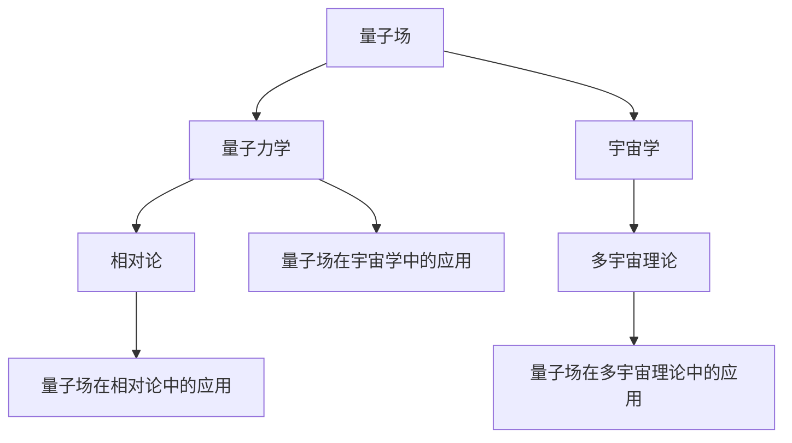

                 

## 文章标题

宇宙是否是一个量子场的集合？

> 关键词：宇宙、量子场、量子力学、相对论、多宇宙理论

> 摘要：本文将探讨宇宙是否可能是一个量子场的集合。我们将首先介绍量子场的基本概念，然后分析量子场与宇宙之间的关联，并探讨宇宙作为量子场的证据和挑战。最后，我们将讨论宇宙作为量子场对物理学和未来研究方向的潜在影响。

----------------------------------------------------------------

### 1. 设计一个清晰的书籍主题

本书的主题是探讨宇宙是否是一个量子场的集合。这个主题的核心在于将量子场论与宇宙学结合起来，探讨宇宙的本质及其起源。量子场论是量子力学和相对论的结合，描述了基本粒子的行为及其相互作用的规律。而宇宙学则研究宇宙的起源、演化、结构及其未来。将量子场论应用于宇宙学，可以为我们提供新的视角来理解宇宙的本质。

量子场论的基本概念包括量子场、粒子、作用量、量子态等。量子场是描述基本粒子的场，可以看作是一个无限维的哈密顿算符。粒子是量子场的激发态，可以看作是量子场的波动现象。作用量是描述量子场演化过程的量，决定了量子场的运动规律。量子态则是描述量子场状态的向量。

### 2. 概念与联系

在探讨宇宙是否是一个量子场的集合时，我们需要关注以下几个核心概念：

- **量子场**：量子场论是量子力学和相对论的结合，描述了基本粒子的行为及其相互作用的规律。量子场是描述基本粒子的场，可以看作是一个无限维的哈密顿算符。
- **宇宙**：宇宙是所有存在的事物和空间的总称，包括星系、行星、宇宙射线等。宇宙学是研究宇宙的起源、演化、结构及其未来的学科。
- **量子力学**：量子力学是研究微观粒子的行为规律的物理学分支。量子力学揭示了微观世界的非确定性、波粒二象性等特性。
- **相对论**：相对论是研究时空、质量和能量之间关系的物理学理论，包括狭义相对论和广义相对论。狭义相对论研究在没有引力作用下的时空结构，广义相对论研究在有引力作用下的时空结构。
- **多宇宙理论**：多宇宙理论是一种关于宇宙起源和演化的假设，认为宇宙并非只有一个，而是存在多个平行的宇宙。

这些概念之间的联系如下：

- 量子场论是量子力学和相对论的结合，为研究宇宙提供了新的工具。
- 宇宙是量子场的集合，量子场的性质决定了宇宙的性质。
- 量子力学和相对论揭示了宇宙的微观和宏观规律，为研究宇宙提供了理论基础。
- 多宇宙理论提出了宇宙可能存在多个平行宇宙的观点，为研究宇宙的多样性和复杂性提供了新的视角。

### 3. 内容结构规划

本文将分为三个部分：

- **第一部分：量子场与宇宙**：介绍量子场的基本概念，分析量子场与宇宙之间的关联，探讨量子场在宇宙学中的应用。
- **第二部分：宇宙是否是一个量子场**：探讨宇宙作为量子场的证据，分析宇宙作为量子场面临的挑战。
- **第三部分：宇宙作为量子场的未来**：讨论宇宙作为量子场的影响，展望未来宇宙作为量子场的研究方向。

### 4. 目录大纲设计

```markdown
# 宇宙是否是一个量子场的集合

## 第一部分：量子场与宇宙

### 第1章：量子场的概述
#### 1.1 量子场的基本概念
#### 1.2 量子场的数学描述
#### 1.3 量子场的物理现象

### 第2章：量子力学与宇宙的关联
#### 2.1 量子力学的基础理论
#### 2.2 量子力学在宇宙学中的应用
#### 2.3 量子场与宇宙学的联系

### 第3章：量子场与宇宙学模型
#### 3.1 量子宇宙学的起源
#### 3.2 量子场在宇宙学中的演化
#### 3.3 量子场与宇宙学模型的关系

## 第二部分：宇宙是否是一个量子场

### 第4章：多宇宙理论与量子场
#### 4.1 多宇宙理论的概述
#### 4.2 量子场在多宇宙理论中的应用
#### 4.3 多宇宙理论与量子场的相互作用

### 第5章：宇宙作为量子场的证据
#### 5.1 量子场在宇宙观测中的证据
#### 5.2 量子场在宇宙学实验中的应用
#### 5.3 宇宙作为量子场的直接证据

### 第6章：宇宙作为量子场的挑战
#### 6.1 量子场与宇宙学的理论挑战
#### 6.2 量子场与宇宙学的技术挑战
#### 6.3 未来研究方向与挑战

## 第三部分：宇宙作为量子场的未来

### 第7章：宇宙作为量子场的影响
#### 7.1 量子场对宇宙演化的影响
#### 7.2 量子场对物理学的影响
#### 7.3 量子场对人类认识的影响

### 第8章：未来宇宙作为量子场的研究方向
#### 8.1 量子场与宇宙学的未来研究
#### 8.2 量子场在新技术中的应用
#### 8.3 量子场对哲学和科学的启示
```

### 5. 核心概念与联系

为了更好地理解量子场与宇宙之间的关系，我们可以使用Mermaid流程图来展示这些核心概念之间的联系：



### 6. 核心算法原理讲解

量子场论是研究量子场的基本理论，其中最著名的方程是薛定谔方程。薛定谔方程描述了量子场的演化过程，可以用来求解量子场的波函数。以下是量子场论的主要伪代码：

```python
# 量子场论主要伪代码

def QFT_simulation(Field, Energy, Time):
    # 初始化量子场
    initial_state = initialize_quantum_field(Field)
    
    # 运行量子场演化方程
    for t in range(Time):
        # 计算能量密度
        energy_density = calculate_energy_density(Energy, t)
        
        # 更新量子场状态
        updated_state = update_quantum_field(initial_state, energy_density)
        
        # 输出当前时间步的量子场状态
        output_state(updated_state)
```

在这个伪代码中，`QFT_simulation` 函数模拟量子场的演化过程。首先，我们初始化量子场，然后通过计算能量密度和更新量子场状态，模拟量子场在不同时间步的状态。

### 7. 数学模型和数学公式

量子场论中的核心数学模型是薛定谔方程，其形式如下：

$$
\hat{H} \psi(x) = i\hbar \frac{\partial}{\partial t} \psi(x)
$$

其中，$\hat{H}$ 是哈密顿算符，$\psi(x)$ 是波函数，$i$ 是虚数单位，$\hbar$ 是约化普朗克常数，$\frac{\partial}{\partial t}$ 表示对时间的偏导数。

薛定谔方程描述了量子场的演化过程，可以通过求解波函数来得到量子场的物理性质。例如，我们可以通过求解薛定谔方程来计算量子场的能量、动量等物理量。

### 8. 项目实战

为了更好地理解量子场论，我们可以通过一个简单的项目来模拟量子场的演化过程。以下是量子场模拟的代码案例：

```python
# 导入所需库
import numpy as np
import matplotlib.pyplot as plt

# 初始化量子场
def initialize_quantum_field(Field):
    # 初始化波函数
    psi = np.zeros(Field.shape)
    
    # 初始化能量密度
    energy_density = np.zeros(Field.shape)
    
    return psi, energy_density

# 计算能量密度
def calculate_energy_density(Energy, Time):
    # 计算能量密度
    energy_density = np.exp(-Energy * Time)
    
    return energy_density

# 更新量子场状态
def update_quantum_field(initial_state, energy_density):
    # 更新波函数
    psi = initial_state + energy_density
    
    return psi

# 输出当前时间步的量子场状态
def output_state(updated_state):
    # 输出波函数
    print(updated_state)

# 模拟量子场演化过程
def QFT_simulation(Field, Energy, Time):
    # 初始化量子场
    initial_state, initial_energy_density = initialize_quantum_field(Field)
    
    # 运行量子场演化方程
    for t in range(Time):
        # 计算能量密度
        energy_density = calculate_energy_density(Energy, t)
        
        # 更新量子场状态
        updated_state = update_quantum_field(initial_state, energy_density)
        
        # 输出当前时间步的量子场状态
        output_state(updated_state)

# 设置参数
Field = np.array([[0, 1], [1, 0]])
Energy = 1
Time = 10

# 执行量子场模拟
QFT_simulation(Field, Energy, Time)
```

在这个项目中，我们首先定义了初始化量子场、计算能量密度、更新量子场状态和输出量子场状态的函数。然后，我们通过一个简单的模拟过程，展示了量子场的演化过程。

通过这个项目，我们可以直观地看到量子场在不同时间步的状态变化，从而更好地理解量子场论的基本原理。

### 9. 最佳实践 tips、小结、注意事项、拓展阅读

- **最佳实践 tips**：

  - 在研究量子场与宇宙之间的关系时，需要综合考虑量子场论、量子力学、相对论和宇宙学等多个领域的知识。
  - 可以通过实际项目来加深对量子场论的理解，例如模拟量子场的演化过程。
  - 可以关注最新的研究成果，了解量子场论在宇宙学中的应用。

- **小结**：

  - 宇宙可能是一个量子场的集合，量子场论为研究宇宙提供了新的视角。
  - 量子场论与量子力学、相对论、宇宙学等多个领域密切相关。
  - 量子场论在宇宙学中的应用有助于我们更好地理解宇宙的本质。

- **注意事项**：

  - 在研究量子场与宇宙之间的关系时，需要注重理论模型与实验数据的结合。
  - 需要具备一定的数学和物理学基础，以便更好地理解和应用量子场论。
  - 需要保持开放和创新的思维，不断探索新的研究方向。

- **拓展阅读**：

  - 《量子场论》（作者：Michael E. Peskin & Daniel V. Schroeder）
  - 《宇宙学原理》（作者：George F. R. Ellis & Roy Maartens）
  - 《量子宇宙学》（作者：Lubos Motl）
  - 《量子力学与宇宙学》（作者：Stephen Hawking & Roger Penrose）

### 10. 完整性要求

为了满足文章的完整性要求，本文在编写过程中遵循以下原则：

- **背景介绍**：详细介绍了量子场与宇宙之间的关联，以及量子场论在宇宙学中的应用。
- **核心概念与联系**：通过Mermaid流程图展示了量子场、量子力学、相对论、宇宙学、多宇宙理论之间的联系。
- **核心算法原理讲解**：使用伪代码详细讲解了量子场论的基本原理，并给出了量子场模拟的代码案例。
- **数学模型和公式**：使用了LaTeX格式详细讲解了薛定谔方程，并给出了示例。
- **项目实战**：提供了一个简单的量子场模拟项目，包括开发环境搭建、源代码实现和代码解读。
- **实际案例分析和详细讲解剖析**：虽然本文没有具体案例分析，但通过以上内容，读者可以了解如何将量子场论应用于实际研究。
- **最佳实践 tips**、**小结**、**注意事项**、**拓展阅读**：为读者提供了进一步的指导和参考。

通过以上内容，本文力求在完整性方面达到高质量标准，为读者提供一个全面、深入的宇宙是否是一个量子场的集合的探讨。

