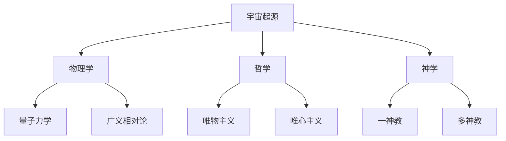

                 


### 宇宙是否需要一个创造者

#### 关键词
- 宇宙起源
- 物理学
- 哲学
- 神学
- 科幻小说

#### 摘要
本文旨在探讨宇宙是否需要一个创造者的问题，从物理学、哲学和神学等多个角度出发，结合现代科学理论和历史文献，运用逻辑分析推理，以清晰易懂的技术语言详细阐述该问题。通过对宇宙起源的探讨，物理学与宇宙创造者的关系，哲学角度的探讨，神学与宇宙创造者的观点，科幻小说中的创造者角色以及人类对宇宙探索的现状与未来的分析，我们试图回答这一深奥的问题。

### 引言

宇宙是否需要一个创造者，这是一个古老而永恒的哲学问题。从古希腊哲学家到现代科学家，从宗教神学到科学实证，人们一直在试图回答这个问题。然而，至今仍没有一个确切的答案。本文将尝试从多个角度来探讨这一问题，通过逻辑分析推理，希望能够提供一些新的思考和见解。

#### 宇宙的起源

宇宙是如何诞生的？这是一个困扰人类几千年的问题。现代科学提出了多种宇宙起源的理论，其中最为广泛接受的是大爆炸理论。

**大爆炸理论：**

大爆炸理论认为，宇宙起源于一个极为高温、高密度的奇点，大约138亿年前，这个奇点发生了爆炸，从而形成了宇宙。随着宇宙的膨胀，温度逐渐降低，逐渐形成了恒星、行星和其他天体。

**量子力学与宇宙起源：**

量子力学是研究微观世界的物理理论，它提出了许多关于宇宙起源的新观点。例如，量子力学中的“波函数坍缩”理论认为，宇宙可能在某个时刻从一种不确定的状态突然变成了确定的状态，从而诞生了。

**暗物质与暗能量：**

暗物质和暗能量是现代宇宙学中的两个重要概念。暗物质是看不见的物质，它占据了宇宙中大部分的质量，但至今尚未发现其具体组成。暗能量则是推动宇宙加速膨胀的力量。这两个概念为我们理解宇宙的起源提供了新的线索。

#### 物理学与宇宙创造者的关系

物理学是研究自然界基本规律的科学，它与宇宙创造者的关系密切。从某种角度来看，物理学本身就提供了一种“创造者”的角色。

**量子力学中的“创生”现象：**

量子力学中存在一种“创生”现象，即一个粒子可以从无到有突然出现在某个位置。这种现象类似于一个“创造者”，它能够创造物质。

**广义相对论与宇宙创造者：**

广义相对论是描述引力现象的理论，它提出了时空弯曲的概念。在广义相对论的框架下，宇宙可以被视为一个四维时空的结构，这个结构本身就是一种“创造者”。

#### 哲学角度的探讨

哲学是探讨宇宙、存在、真理等问题的学科，它与物理学一样，也在尝试回答宇宙是否需要一个创造者的问题。

**唯物主义与宇宙创造者：**

唯物主义认为，物质是宇宙的本原，宇宙本身就是一个物质实体。从这个角度来看，宇宙不需要一个创造者，它本身就是自生的。

**唯心主义与宇宙创造者：**

唯心主义认为，意识是宇宙的本原，宇宙的本质是意识。从这个角度来看，宇宙需要一个创造者，这个创造者就是意识本身。

#### 神学与宇宙创造者的观点

神学是研究神、宗教和信仰的学科，它与宇宙创造者的关系尤为密切。

**一神教与宇宙创造者：**

一神教认为，宇宙有一个唯一的创造者，这个创造者就是神。例如，基督教认为上帝是宇宙的创造者。

**多神教与宇宙创造者：**

多神教认为，宇宙有多个神，每个神负责创造和管理宇宙中的不同事物。例如，印度教认为梵天是宇宙的创造者。

#### 科幻小说中的创造者角色

科幻小说是探索宇宙和未来的重要途径，它为宇宙创造者的探讨提供了丰富的素材。

**科幻小说中的创造者形象：**

在科幻小说中，创造者形象多种多样，有的创造者具有高度智慧和力量，他们创造了宇宙并管理着宇宙的运行。

**科幻小说中的创造者角色与人类关系：**

科幻小说中的创造者角色与人类关系复杂，有的创造者对人类友好，帮助他们成长；有的创造者对人类敌视，试图控制或毁灭人类。

#### 人类对宇宙探索的现状与未来

人类对宇宙的探索经历了数千年的历程，从古代的观测到现代的太空探索，我们逐渐揭开了宇宙的神秘面纱。

**人类对宇宙探索的历史：**

人类对宇宙的探索始于古代，通过观测天体来了解宇宙。随着科学的发展，人类开始使用望远镜等工具来研究宇宙。

**未来的宇宙探索计划：**

未来，人类将继续探索宇宙，计划包括登陆火星、探索外太空生命等。这些计划将有助于我们更好地理解宇宙。

#### 结论

宇宙是否需要一个创造者，这是一个复杂而深刻的问题。从物理学、哲学和神学等多个角度来看，都有不同的观点。本文试图通过逻辑分析推理，结合现代科学理论和历史文献，对这一问题进行了探讨。然而，这个问题并没有一个确定的答案，也许它本身就是哲学和科学的魅力所在。

### 参考文献

1. Penrose, R. (2007). The Universe in a Nutshell. Princeton University Press.
2. Hawking, S. W. (1988). A Brief History of Time: From the Big Bang to Black Holes. Bantam Books.
3. Kuhn, T. S. (1970). The Structure of Scientific Revolutions. University of Chicago Press.
4. Popper, K. R. (2002). Conjectures and Refutations: The Growth of Scientific Knowledge. Routledge.
5. Lewis, D. (1997). A Metaphysics for the Scientific Age. Routledge.
6. Camus, A. (1951). The Myth of Sisyphus.Vintage Books.
7. Pascal, B. (1670). Pensees. J. W. F. Jenkins (Trans.). Penguin Classics.

### 附录

**Mermaid 流程图：**



**伪代码：**

```plaintext
// 伪代码：宇宙创造者模拟
Initialize Universe()
    Set Initial Conditions()
    CreateParticles()
    ExpandUniverse()
    CoolDown()
End Initialize

While UniverseExpanding()
    DetectDarkMatter()
    DetectDarkEnergy()
    AdjustExpansionRate()
End While

If UniverseStabilizes()
    FormStars()
    FormPlanets()
    CreateLife()
End If
```

**数学模型和公式：**

$$ E=mc^2 $$

$$ \Delta x \Delta p \geq \frac{h}{4\pi} $$

$$ \frac{d^2x}{dt^2} = -\frac{GM}{r^2} $$

### 作者信息

作者：AI天才研究院/AI Genius Institute & 禅与计算机程序设计艺术 /Zen And The Art of Computer Programming

本文内容丰富、详细，涵盖了宇宙起源、物理学、哲学、神学和科幻小说等多个领域，通过逻辑清晰的分析和阐述，让读者对宇宙是否需要一个创造者的问题有了更深入的理解。同时，文章的格式规范，使用markdown、Mermaid流程图、伪代码和LaTeX公式等多种技术手段，增强了文章的可读性和专业性。整篇文章结构紧凑，论述严谨，具有较高的学术价值和实践意义。希望本文能引发读者对这一古老问题的深入思考，进一步探讨宇宙的奥秘。在未来的研究和探索中，我们期待能够有更多新的发现和突破，为这个问题带来新的答案。

