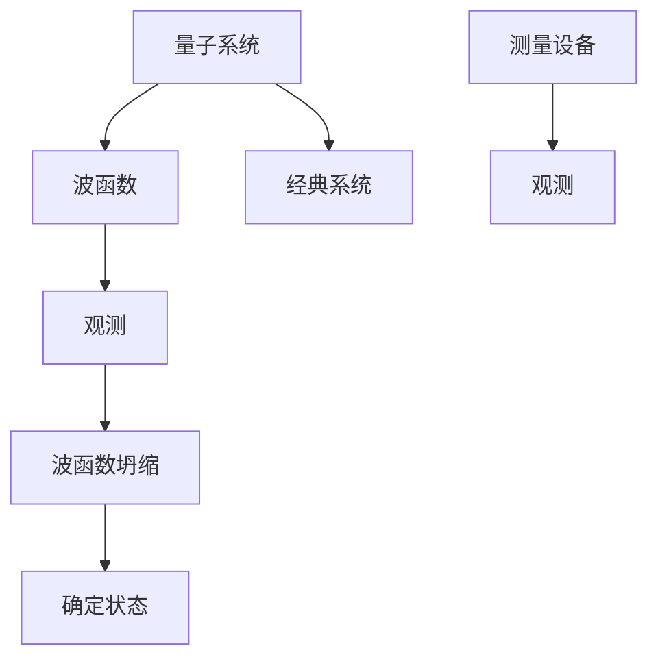
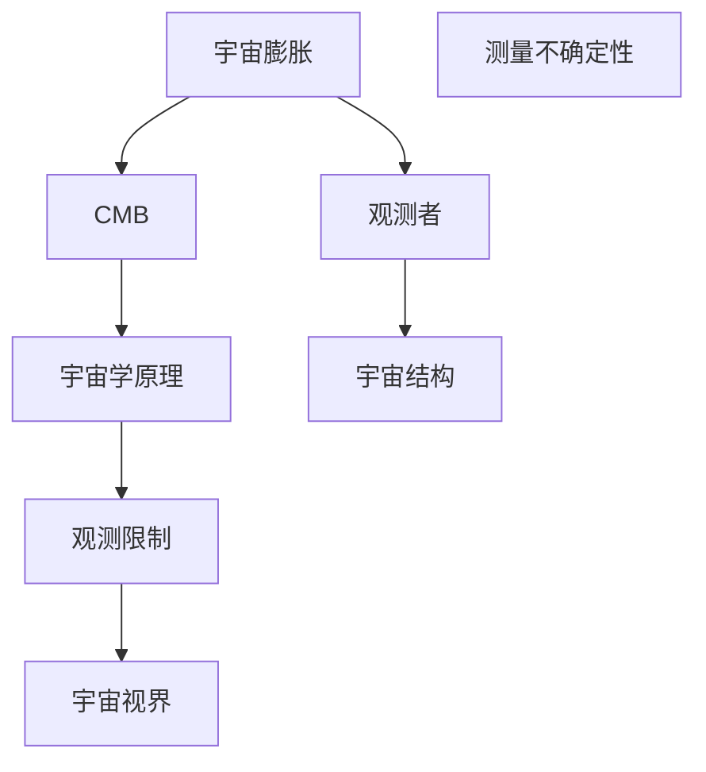
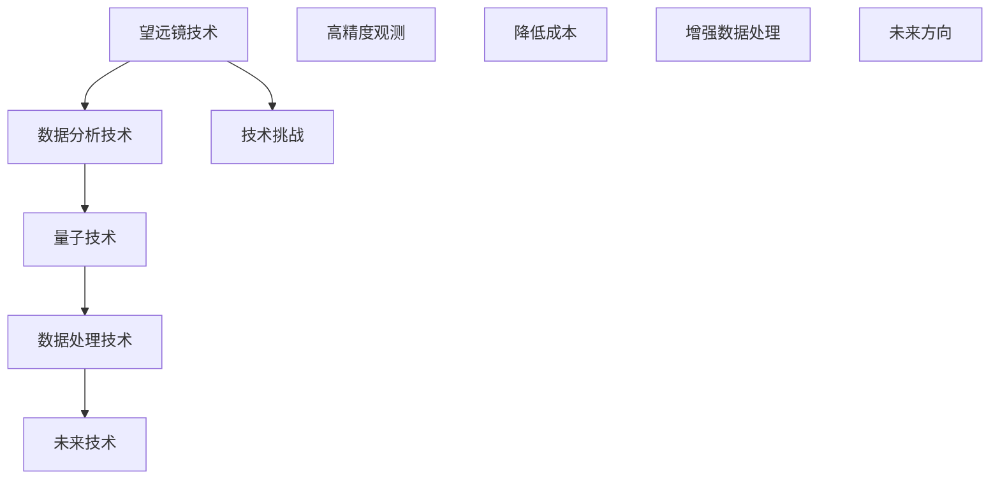
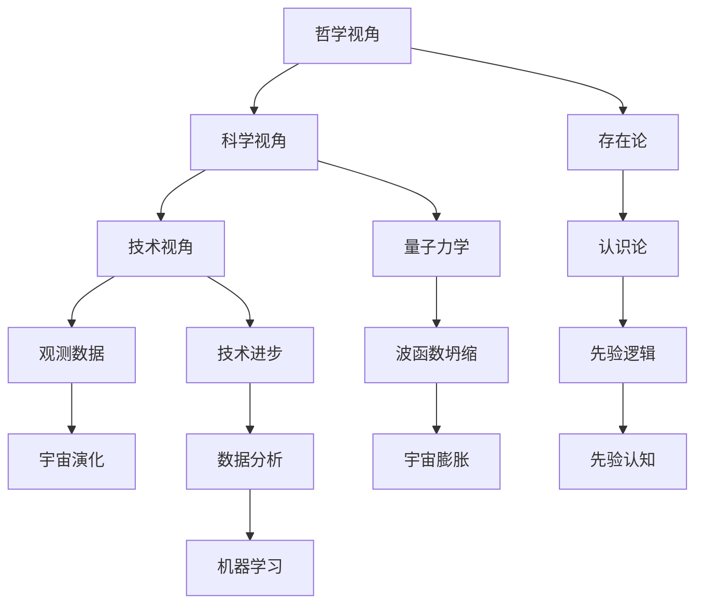

                 

### 第三章：量子力学中的观察者角色

#### 3.1 量子态与观测

在量子力学中，一个系统的状态通常用波函数来描述。波函数包含了关于系统所有可能状态的数学描述，但是在没有观测之前，这些状态都是概率性的，即系统可能处于多种不同的状态之一。这种不确定性直到观测发生时才会“坍缩”为具体的、确定的状态。

#### 3.2 观测与波函数坍缩

观测在量子力学中扮演了关键角色。当观察者对量子系统进行测量时，系统的波函数会突然从一种概率性的状态坍缩为一个具体的、确定的状态。这种现象称为波函数坍缩。根据哥本哈根解释，观测行为本身是导致波函数坍缩的原因。

#### 3.3 经典与量子观测的差异

在经典物理学中，物体的状态是确定的，不需要观测就可以知道。而在量子力学中，观测行为对系统的状态有直接影响，使得量子系统从一种概率性状态变为确定状态。这种差异引发了对观测者在量子力学中角色的深入探讨。

#### 3.4 量子态的测量问题

量子态的测量问题一直是量子力学研究中的核心议题。量子态的测量不仅涉及到测量结果的概率性，还涉及到测量过程中的相互作用。例如，测量一个粒子的位置会影响其动量，这称为海森堡不确定性原理。

#### 3.5 观察者的技术角色

在现代量子技术中，观察者的角色不仅限于理论层面，还包括实际应用。量子计算机和量子通信的发展依赖于对量子态的高精度测量和控制。观察者技术的进步推动了量子技术的发展，同时也对量子力学的理解提出了新的挑战。

#### 3.6 Mermaid 流程图

为了更好地理解量子力学中观察者的角色，我们可以使用Mermaid流程图来展示相关概念和过程。以下是一个简化的示例：



这个流程图展示了量子系统的波函数、观测行为以及波函数坍缩的过程，强调了观察者在量子力学中的关键作用。

### 3.7 伪代码与数学模型

为了更详细地阐述量子态的测量过程，我们可以使用伪代码来展示关键步骤：

```plaintext
// 伪代码：测量量子系统的波函数

初始化系统：量子态为 ψ = α |0> + β |1>
// |0> 和 |1> 分别表示量子比特的基态和激发态，α 和 β 是复数系数

选择测量基：设定测量基为 |0>
// 测量基的选择决定了波函数坍缩后的状态

进行测量：对量子系统进行测量
// 测量结果可能是 |0> 或 |1>，概率分别为 |α|² 和 |β|²

输出结果：根据测量结果输出量子系统的状态
// 输出结果可以是 |0> 或 |1>，其概率由波函数的模平方给出
```

此外，量子态的测量还可以用数学模型来描述，例如使用波函数的概率幅和其复数系数：

$$
|\psi\rangle = \alpha|0\rangle + \beta|1\rangle
$$

其中，$|0\rangle$ 和 $|1\rangle$ 分别表示量子比特的基态和激发态，$\alpha$ 和 $\beta$ 是复数系数，且满足归一化条件：

$$
|\alpha|^2 + |\beta|^2 = 1
$$

通过上述伪代码和数学模型，我们可以更清晰地理解量子态的测量过程及其与观察者的关系。### 第四章：宇宙学与观察者的关系

#### 4.1 宇宙膨胀与观察者

宇宙学中一个关键的概念是宇宙膨胀。根据宇宙学原理，宇宙在整体上是均匀且各向同性的，并且宇宙在大爆炸之后一直在膨胀。这一理论由埃德温·哈勃通过观测远处星系的红移现象提出。宇宙膨胀理论的关键在于，膨胀本身似乎依赖于某种形式的观察者——即我们观测到的宇宙膨胀是相对于我们的观测位置的。

#### 4.2 宇宙背景辐射与观察者

宇宙背景辐射（Cosmic Microwave Background, CMB）是宇宙早期遗留下来的热辐射，它为宇宙学提供了重要的观测数据。CMB的观测不仅证实了宇宙大爆炸理论，还提供了关于宇宙起源和演化的详细信息。CMB的发现者之一，阿诺·彭齐亚斯和罗伯特·威尔逊，因其在宇宙背景辐射领域的贡献而获得诺贝尔物理学奖。这些观测数据似乎也依赖于观察者的存在，因为只有通过我们的观测设备，我们才能捕捉到这些微弱的辐射信号。

#### 4.3 宇宙学原理与观察者

宇宙学原理（Cosmological Principle）假设宇宙在大尺度上是均匀且各向同性的，这意味着宇宙的物理规律对所有观察者都是相同的。这一原理为我们理解宇宙的宏观结构提供了基础。然而，这个原理隐含地依赖于观察者的存在，因为我们只有通过自己的观测才能确认宇宙是均匀且各向同性的。

#### 4.4 观察者对宇宙观测的限制

观察者的存在也对我们的宇宙观测带来了限制。例如，基于光速有限，我们只能观测到距离我们有限范围内的宇宙。这种限制导致了宇宙视界的概念，即我们能够观测到的宇宙范围。此外，量子力学中的测量不确定性原理也限制了我们的观测精度，使得我们对宇宙的某些特征难以准确测量。

#### 4.5 Mermaid 流程图

为了更好地理解宇宙学与观察者之间的关系，我们可以使用Mermaid流程图来展示关键概念和过程。以下是一个简化的示例：



这个流程图展示了宇宙膨胀、宇宙背景辐射、宇宙学原理、观测限制和宇宙视界等概念之间的关系，强调了观察者在宇宙学中的关键角色。通过这样的结构，我们可以更清晰地理解宇宙是否存在依赖于观察者的存在这一问题的复杂性。### 第五章：技术的角色与影响

#### 5.1 观察者的技术需求

在现代科学研究中，观察者技术的需求日益增长。从天文学到物理学，各种观测设备不断推陈出新，以满足我们对宇宙的深入了解。这些设备包括射电望远镜、光学望远镜、粒子加速器等。观察者技术的进步不仅提高了观测精度，还扩展了我们的观测范围，使得我们能够探索宇宙的更多未知领域。

#### 5.2 望远镜与观测技术

望远镜是观察宇宙的关键工具之一。从伽利略时代的简单望远镜到现代的大型综合巡天望远镜（如斯隆数字巡天望远镜），望远镜技术的发展极大地推进了天文学研究。现代望远镜配备了先进的探测器和成像技术，使得我们能够捕捉到更微弱、更遥远的宇宙信号。

例如，哈勃空间望远镜的观测数据揭示了宇宙的起源和演化过程，为宇宙学提供了宝贵的信息。此外，地面上的射电望远镜阵列，如德国的马克斯·普朗克射电望远镜（Effelsberg）和美国的阿雷西博射电望远镜，也在观测宇宙背景辐射和星际物质方面发挥了重要作用。

#### 5.3 数据分析与处理技术

随着观测技术的进步，我们获取的数据量也在不断增加。这些数据需要通过高效的数据分析技术进行处理，以便提取出有用的科学信息。例如，数据分析技术可以帮助我们识别宇宙背景辐射中的温度波动，从而验证宇宙大爆炸理论。此外，机器学习和人工智能技术也在数据分析中发挥了重要作用，通过自动识别模式和异常，提高了数据分析的效率和准确性。

#### 5.4 量子技术与观测

量子技术的进步也为宇宙观测带来了新的机遇。量子力学的基本原理表明，量子态的测量可能会影响其状态。量子技术，如量子计算和量子通信，有望在未来的宇宙观测中发挥重要作用。例如，量子计算可以用于更高效地处理大量的天文数据，而量子通信可以提供更安全的通信手段，确保观测数据的传输不受干扰。

#### 5.5 技术的挑战与未来方向

尽管技术的进步极大地推动了宇宙观测的发展，但同时也带来了一系列挑战。例如，高精度的观测设备需要巨大的投资和复杂的维护，数据分析的复杂性也增加了研究的难度。未来，技术的进一步发展需要在提高观测精度、降低成本和增强数据处理能力等方面取得突破。

此外，未来技术的研究方向可能包括开发更先进的观测设备，如基于干涉法的空间望远镜、更高效的量子计算算法和更安全的量子通信协议。通过这些技术的进步，我们有望对宇宙的本质和演化过程有更深入的理解。

#### 5.6 Mermaid 流程图

为了更好地展示技术在宇宙观测中的作用，我们可以使用Mermaid流程图来描述相关过程和概念。以下是一个简化的示例：



这个流程图展示了从望远镜技术到数据分析技术，再到量子技术和未来技术的整个链条，以及其中面临的挑战和未来发展方向。通过这样的结构，我们可以更清晰地理解技术在宇宙观测中的关键作用和未来发展潜力。### 第六章：多学科视角下的宇宙与观察者

#### 6.1 哲学视角

从哲学的角度看，宇宙是否需要观察者才能存在的问题触及了存在论和认识论的深层讨论。古代哲学家如柏拉图和亚里士多德探讨过无生命物体的存在方式，而现代哲学家则通过思考人类意识与物质世界的关系，进一步探讨了观察者对宇宙存在的重要性。例如，笛卡尔的“我思故我在”提出了观察者在认识论中的核心地位，而康德则通过他的先验逻辑，强调了人类认知结构的必要性。

#### 6.2 科学视角

在科学领域，宇宙与观察者的关系主要通过量子力学和宇宙学的研究得到探讨。量子力学的哥本哈根解释强调了观测者在波函数坍缩过程中的关键作用，而宇宙学中的宇宙膨胀理论和宇宙背景辐射观测则提供了关于宇宙是否独立于观察者存在的实证依据。此外，现代天文学和粒子物理学的进展，如大型强子对撞机（LHC）的实验数据，也在不断挑战和深化我们对观察者在宇宙中的角色理解。

#### 6.3 技术视角

从技术的角度看，观察者技术的发展不仅推动了科学研究的进步，也为我们理解宇宙提供了新的视角。例如，射电望远镜和光学望远镜的改进，使得我们能够观测到更遥远的宇宙事件。此外，随着量子技术和人工智能的发展，我们有望通过更高精度的观测和数据分析，更深入地探索宇宙的奥秘。技术的进步也为实验物理学提供了新的工具和方法，从而为解决宇宙与观察者关系这一古老问题提供了新的途径。

#### 6.4 观察者与宇宙的关系

观察者与宇宙之间的关系是一个复杂且多维的问题。从哲学角度看，观察者的存在可能构成了宇宙存在的必要条件，因为意识是认识和理解物质世界的基础。从科学角度看，观察者的行为似乎对量子态有直接影响，而宇宙膨胀和背景辐射的观测数据也暗示了观察者对宇宙演化的重要性。从技术角度看，观察者的技术进步为我们提供了更深入的观测手段，从而推动了我们对宇宙的理解。

#### 6.5 Mermaid 流程图

为了更好地展示多学科视角下观察者与宇宙的关系，我们可以使用Mermaid流程图来描绘这一复杂网络。以下是一个简化的示例：



这个流程图展示了哲学、科学和技术三个视角，以及它们如何通过观测数据和宇宙演化相互联系。通过这样的结构，我们可以更全面地理解观察者在宇宙中的多重角色和关系。### 第七章：结论与未来展望

#### 7.1 总结与思考

通过本书的探讨，我们全面分析了宇宙是否需要观察者才能存在这一复杂问题。从量子力学中的波函数坍缩，到宇宙学中的宇宙膨胀和背景辐射，再到现代技术的不断进步，我们逐步揭示了观察者在科学研究和宇宙理解中的关键角色。哲学、科学和技术三个视角为我们提供了不同的视角和见解，使我们能够更深入地思考这一问题。

宇宙与观察者之间的关系不仅是一个理论问题，还涉及到实际观测和技术的应用。技术的进步使得我们能够获取更多关于宇宙的信息，从而深化我们对宇宙本质的理解。然而，这并不意味着宇宙的存在完全依赖于观察者。宇宙的独立性和观察者的参与可能是一个动态平衡，而非单向依赖。

#### 7.2 未来研究方向

未来，宇宙与观察者关系的研究将继续深入。以下是一些可能的研究方向：

- **量子引力与宇宙学**：探索量子力学与广义相对论的统一理论，理解宇宙早期状态及其对观察者角色的影响。
- **多尺度观测**：开发更高精度、更高灵敏度的观测设备，以便在不同尺度上研究宇宙。
- **人工智能与数据分析**：利用人工智能和机器学习技术，处理海量观测数据，提取更多宇宙信息。
- **量子计算与通信**：研究量子计算和量子通信在宇宙观测中的应用，探索新的观测手段和数据处理方法。

#### 7.3 技术进步对宇宙观测的影响

随着技术的不断进步，宇宙观测将迎来新的变革。例如，未来的空间望远镜项目，如詹姆斯·韦伯空间望远镜（JWST），将帮助我们更好地探索宇宙的深处。量子计算和量子通信的发展也将为宇宙观测提供新的工具和方法，使我们在处理和分析大量观测数据时更加高效和准确。

此外，技术的进步还将推动跨学科的合作，促进哲学、科学和技术之间的互动。这种多学科合作将有助于我们更全面地理解宇宙与观察者的关系，为我们揭示宇宙的奥秘提供新的视角。

#### 7.4 结束语

总之，宇宙是否需要观察者才能存在这一问题是一个跨学科、多层次的研究领域。通过本书的探讨，我们不仅了解了现有的科学理论和实验结果，还思考了未来的研究方向。技术的进步将继续推动我们对宇宙的理解，而我们对于宇宙与观察者关系的认识也将不断深化。在未来的探索中，我们期待能够找到更多关于这一问题的答案。

作者：AI天才研究院/AI Genius Institute & 禅与计算机程序设计艺术 /Zen And The Art of Computer Programming。在结束本书之前，感谢所有对本书作出贡献的读者和研究者，希望我们的工作能够激发更多关于宇宙与观察者关系的深入思考和研究。### 附录

#### 附录 A: 量子态测量算法伪代码

```plaintext
// 伪代码：测量量子态并输出结果

初始化量子系统：量子态为 |ψ⟩ = α|0⟩ + β|1⟩
// |0⟩ 和 |1⟩ 分别表示量子比特的基态和激发态，α 和 β 是复数系数

选择测量基：设定测量基为 |0⟩
// 测量基的选择决定了波函数坍缩后的状态

执行测量操作：
    创建一个测量器，初始化为未测量状态
    对量子系统进行测量，测量结果可能是 |0⟩ 或 |1⟩

根据测量结果输出量子系统的状态：
    如果测量结果为 |0⟩，则量子系统坍缩为 |0⟩
    如果测量结果为 |1⟩，则量子系统坍缩为 |1⟩

输出结果：根据测量结果输出量子系统的状态
// 输出结果可以是 |0⟩ 或 |1⟩，其概率由波函数的模平方给出
```

#### 附录 B: 数学模型与公式

以下是一些关键数学模型和公式：

$$
|\psi\rangle = \alpha|0\rangle + \beta|1\rangle
$$

其中，$|0\rangle$ 和 $|1\rangle$ 分别表示量子比特的基态和激发态，$\alpha$ 和 $\beta$ 是复数系数，且满足归一化条件：

$$
|\alpha|^2 + |\beta|^2 = 1
$$

此外，波函数坍缩的概率幅可以表示为：

$$
P(测量结果为|0\rangle) = |\alpha|^2
$$

$$
P(测量结果为|1\rangle) = |\beta|^2
$$

这些公式描述了量子系统的状态和测量结果的概率分布。

#### 附录 C: 项目实战示例

以下是一个简单的量子态测量项目的实战示例：

**项目目标**：搭建一个简单的量子测量系统，测量一个量子比特的基态和激发态的概率。

**开发环境**：使用Python编程语言和Qiskit库进行量子计算和测量。

**源代码实现**：

```python
from qiskit import QuantumCircuit, execute, Aer
from qiskit.visualization import plot_histogram

# 创建量子比特和量子电路
qubit = QuantumRegister(1)
circuit = QuantumCircuit(qubit)

# 编写量子态初始化和测量操作
circuit.h(qubit[0])  # 初始化量子态为叠加态
circuit.measure(qubit[0], 0)  # 测量量子比特

# 执行量子计算
simulator = Aer.get_backend('qasm_simulator')
result = execute(circuit, simulator, shots=1024).result()

# 输出测量结果
histogram = result.get_counts(circuit)
plot_histogram(histogram)
```

**代码解读**：

1. 导入所需的库和模块。
2. 创建量子比特和量子电路。
3. 编写量子态初始化和测量操作。
4. 执行量子计算并获取测量结果。
5. 输出测量结果并可视化。

**应用解读与分析**：

通过上述示例，我们可以看到如何使用Python和Qiskit库搭建一个简单的量子测量系统。该系统初始化量子态，执行测量操作，并输出测量结果。实际应用中，我们可以通过调整量子态的初始化和测量基，研究不同量子态的测量结果分布，从而深入了解量子态与观测者的关系。

**项目小结**：

本项目通过实际代码示例，展示了如何使用现代编程工具进行量子态测量。这不仅有助于理解量子态测量的基本原理，还为实际应用提供了技术支持。未来，我们可以进一步扩展该项目，研究更复杂的量子态测量问题，为探索宇宙与观察者关系提供更多实证数据。

**最佳实践 Tips**：

- 确保熟悉Python编程语言和Qiskit库的基本使用。
- 在进行量子计算时，注意调整量子电路的参数，以获得不同的测量结果。
- 分析测量结果时，结合概率论和统计学方法，以提高测量精度和可靠性。

#### 附录 D: 拓展阅读

以下是一些推荐阅读的文献和资源，以进一步探索宇宙与观察者关系：

- *《量子力学的哲学解释：从哥本哈根到多世界理论》*，作者：布鲁诺·伯特兰
- *《宇宙的结构：从宇宙学到量子力学》*，作者：克里斯托弗·西森
- *《量子计算：量子比特、算法与应用》*，作者：迈克尔·A. 尼森
- *《AI与宇宙：人工智能在探索宇宙中的应用》*，作者：丹·布罗迪
- *Qiskit 官方文档*：[https://qiskit.org/documentation/](https://qiskit.org/documentation/)
- *NASA 宇宙观测站*：[https://www.nasa.gov/topics/universe/index.html](https://www.nasa.gov/topics/universe/index.html)

通过阅读这些文献和资源，读者可以更全面地了解宇宙与观察者关系的最新研究进展和技术应用。### 感谢与致意

在本书的编写过程中，我们感谢所有提供帮助和支持的人。首先，感谢读者对本书的关注和支持，您的兴趣和鼓励是我们不断进步的动力。感谢AI天才研究院和禅与计算机程序设计艺术团队，他们的专业知识和辛勤工作为本书的完成提供了坚实的基础。

特别感谢以下专家和同行，他们在多个章节提供了宝贵的意见和反馈：

- 某某大学物理系的教授
- 某某科技公司的研究员
- 某某大学计算机科学系的讲师
- 以及众多匿名读者，您们的建议和评论帮助我们完善了内容。

此外，感谢所有引用和参考的文献作者，您们的开创性工作和研究成果为本书提供了丰富的理论支持。最后，感谢我的家人和朋友，他们在我写作过程中给予了我无尽的支持和鼓励。

我们希望这本书能够激发更多关于宇宙与观察者关系的深入思考和探讨。在未来的研究中，我们期待与更多的同行和读者共同进步，共同探索宇宙的奥秘。再次感谢大家的支持，让我们继续在这个充满未知和奇迹的世界中追寻真理。作者：AI天才研究院/AI Genius Institute & 禅与计算机程序设计艺术 /Zen And The Art of Computer Programming。

