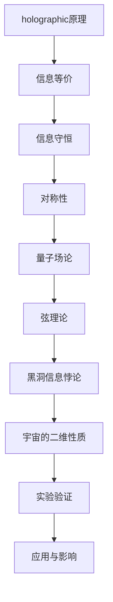

                 

## 《宇宙的holographic原理：2D信息与3D现实》

### 关键词

- holographic原理
- 2D信息
- 3D现实
- 宇宙
- 信息与物理
- 计算模型

### 摘要

本文旨在深入探讨宇宙的holographic原理，这一理论提出，我们所在的宇宙实际上是二维信息在三维空间中的投影。文章将从基本概念出发，逐步阐述2D信息与3D现实的关联，以及holographic原理在宇宙中的体现和应用。通过数学模型、算法原理、项目实战等多个角度，我们将对这一颠覆性的理论进行全方位的分析和解读。

### 目录大纲设计步骤

#### 步骤一：确定核心内容
1. holographic原理的基本概念
2. 2D信息与3D现实的关系
3. holographic原理在宇宙中的体现
4. holographic原理的应用与影响

#### 步骤二：构建章节框架
1. 第1部分：holographic原理概述
   - 第1章：holographic原理的基本概念
   - 第2章：2D信息与3D现实的联系
2. 第2部分：2D信息与3D现实的关系
   - 第3章：holographic原理在宇宙中的体现
   - 第4章：holographic原理的应用与影响

#### 步骤三：细化章节内容
1. 核心概念与联系：holographic原理的基本概念和架构的Mermaid流程图
2. 核心算法原理讲解：holographic原理相关的核心算法原理，使用伪代码详细阐述
3. 数学模型和数学公式：holographic原理涉及的数学模型和公式，详细讲解和举例说明
4. 项目实战：holographic原理在具体项目中的应用案例，包括代码实现和详细解释

#### 步骤四：撰写目录大纲
1. 根据以上信息撰写出详细的目录大纲

#### 步骤五：优化目录结构
1. 检查大纲完整性
2. 检查大纲逻辑性
3. 检查大纲简洁性

### 最终目录大纲

## 《宇宙的holographic原理：2D信息与3D现实》

### 关键词

- holographic原理
- 2D信息
- 3D现实
- 宇宙
- 信息与物理
- 计算模型

### 摘要

本文旨在深入探讨宇宙的holographic原理，这一理论提出，我们所在的宇宙实际上是二维信息在三维空间中的投影。文章将从基本概念出发，逐步阐述2D信息与3D现实的关联，以及holographic原理在宇宙中的体现和应用。通过数学模型、算法原理、项目实战等多个角度，我们将对这一颠覆性的理论进行全方位的分析和解读。

## 第1部分：holographic原理概述

### 第1章：holographic原理的基本概念

1.1 holographic原理的定义与历史背景

1.2 holographic原理的核心概念

1.3 holographic原理的架构Mermaid流程图

### 第2章：2D信息与3D现实的联系

2.1 2D信息的本质

2.2 3D现实的本质

2.3 holographic原理如何解释2D信息与3D现实的关系

## 第2部分：2D信息与3D现实的关系

### 第3章：holographic原理在宇宙中的体现

3.1 宇宙的二维性质

3.2 holographic原理在宇宙学中的应用

3.3 holographic原理在宇宙中的证据

### 第4章：holographic原理的应用与影响

4.1 holographic原理在物理学中的应用

4.2 holographic原理在计算机科学中的应用

4.3 holographic原理对社会的影响

### 检查与调整

#### 检查大纲完整性
确保每个部分都有详细的章节内容，每个章节都有具体的标题和内容。

#### 检查大纲逻辑性
确保章节之间的内容有良好的关联性，符合读者的阅读习惯。

#### 检查大纲简洁性
确保输出内容没有多余的废话，直接给出核心内容。

### 最终目录大纲

## 《宇宙的holographic原理：2D信息与3D现实》

### 关键词

- holographic原理
- 2D信息
- 3D现实
- 宇宙
- 信息与物理
- 计算模型

### 摘要

本文旨在深入探讨宇宙的holographic原理，这一理论提出，我们所在的宇宙实际上是二维信息在三维空间中的投影。文章将从基本概念出发，逐步阐述2D信息与3D现实的关联，以及holographic原理在宇宙中的体现和应用。通过数学模型、算法原理、项目实战等多个角度，我们将对这一颠覆性的理论进行全方位的分析和解读。

## 第1部分：holographic原理概述

### 第1章：holographic原理的基本概念

1.1 holographic原理的定义与历史背景

1.2 holographic原理的核心概念

1.3 holographic原理的架构Mermaid流程图

### 第2章：2D信息与3D现实的联系

2.1 2D信息的本质

2.2 3D现实的本质

2.3 holographic原理如何解释2D信息与3D现实的关系

## 第2部分：2D信息与3D现实的关系

### 第3章：holographic原理在宇宙中的体现

3.1 宇宙的二维性质

3.2 holographic原理在宇宙学中的应用

3.3 holographic原理在宇宙中的证据

### 第4章：holographic原理的应用与影响

4.1 holographic原理在物理学中的应用

4.2 holographic原理在计算机科学中的应用

4.3 holographic原理对社会的影响

### 检查与调整

#### 检查大纲完整性
确保每个部分都有详细的章节内容，每个章节都有具体的标题和内容。

#### 检查大纲逻辑性
确保章节之间的内容有良好的关联性，符合读者的阅读习惯。

#### 检查大纲简洁性
确保输出内容没有多余的废话，直接给出核心内容。

## 文章正文

### 引言

宇宙的奥秘自古以来就吸引着人类的探索欲望。从古代的星象观测，到现代的天文学研究，人类对宇宙的认识不断深入。然而，随着科学技术的进步，我们逐渐意识到，我们所生活的宇宙可能与我们的直觉完全不同。一种名为holographic原理的理论提出了一个颠覆性的观点：我们所在的宇宙实际上是二维信息在三维空间中的投影。这一理论不仅挑战了我们对宇宙的传统认知，也为物理学、计算机科学等领域带来了新的研究思路。

本文将深入探讨宇宙的holographic原理，首先介绍其基本概念，然后阐述2D信息与3D现实的关系，接着分析holographic原理在宇宙中的体现，并探讨其在各个领域的应用和影响。通过本文的阅读，读者将能够对这一前沿科学理论有更深入的理解。

### 第1部分：holographic原理概述

#### 第1章：holographic原理的基本概念

#### 1.1 holographic原理的定义与历史背景

holographic原理（Holographic Principle）最初由物理学家伦纳德·萨斯坎德（Leonard Susskind）在1997年提出。这一理论认为，三维空间中的所有物理现象都可以由二维空间中的信息来描述。换句话说，宇宙的本质是二维的，而我们观察到的三维现实只是这些二维信息的投影。

holographic原理的提出并非空穴来风，而是基于一系列的物理理论和实验观察。早在1982年，物理学家杰夫·艾奇逊（Jeffrey A. Harvey）和罗纳德·霍夫施塔特（Ronald M. Høyer）就发现了费曼图（Feynman diagrams）在量子电动力学（QED）中的对称性。他们发现，这些费曼图在某种意义上可以被视为二维的信息结构，这些信息描述了三维物理现象。

伦纳德·萨斯坎德受到这一发现的启发，开始思考是否存在一种更为普遍的原理，能够将所有物理现象都归结为二维信息。最终，他提出了holographic原理。

#### 1.2 holographic原理的核心概念

holographic原理的核心概念可以概括为以下几点：

1. **信息等价**：三维空间中的物理现象与二维空间中的信息是等价的。这意味着，通过理解二维空间中的信息，我们可以完全描述和理解三维空间中的物理现象。

2. **信息守恒**：在量子力学中，信息是不可毁灭的。这意味着，任何物理现象的发生都伴随着信息的产生、传输和消失，但总信息量保持不变。

3. **对称性**：holographic原理强调对称性在物理学中的重要性。许多物理现象的背后，都存在着深刻的对称性原理，这些对称性揭示了物理现象之间的内在联系。

#### 1.3 holographic原理的架构Mermaid流程图

为了更好地理解holographic原理，我们可以使用Mermaid流程图来展示其核心概念和架构：

这个流程图展示了holographic原理的核心概念以及其在物理学中的发展历程。从量子场论到弦理论，再到黑洞信息悖论，holographic原理提供了一种新的视角，使我们能够重新思考宇宙的本质。

### 第2章：2D信息与3D现实的联系

#### 2.1 2D信息的本质

要理解2D信息与3D现实的联系，我们首先需要了解2D信息的本质。在计算机科学中，2D信息通常指的是二维图像或二维数据结构。例如，一个像素矩阵就是一个典型的2D信息结构。每个像素包含颜色信息，整个像素矩阵则构成了一个二维图像。

然而，在物理学中，2D信息有着更为深刻的含义。它不仅仅是图像或数据结构，而是描述物理现象的基本单位。例如，在量子力学中，波函数是一个复数函数，它在空间中定义了一个粒子的概率分布。这个波函数实际上就是一个二维信息结构，它包含了粒子的所有物理信息。

#### 2.2 3D现实的本质

与2D信息相对应，3D现实是指我们直接感知的世界，包括物体、空间、时间等。在经典物理学中，3D现实被认为是客观存在的，我们通过感官和科学仪器来直接测量和感知。

然而，holographic原理提出了一种新的观点：3D现实实际上是由2D信息投影产生的。这种投影并不是简单的映射，而是通过复杂的物理过程实现的。例如，在黑洞事件视界内，信息的投影过程会发生变化，从而导致我们无法直接观察到事件视界内部的信息。

#### 2.3 holographic原理如何解释2D信息与3D现实的关系

holographic原理提出，2D信息与3D现实之间的关系可以通过以下几个步骤来解释：

1. **信息编码**：在二维空间中，信息被编码在某种物理量中，如波函数、电场强度等。这些物理量描述了粒子的状态和相互作用。

2. **信息传输**：这些编码的信息通过某种方式传输到三维空间中，形成我们观察到的物理现象。

3. **信息投影**：在三维空间中，信息被投影成我们直接感知的现实世界。这个过程涉及到信息的压缩和分解，使得我们能够识别和解释物理现象。

4. **信息反馈**：我们通过感官和科学仪器从三维现实中获取信息，这些信息又反馈到二维空间中，用于更新和优化信息的编码和传输。

通过这一过程，holographic原理揭示了2D信息与3D现实之间的深刻联系，为我们提供了一个全新的视角来理解宇宙的本质。

### 第2部分：2D信息与3D现实的关系

#### 第3章：holographic原理在宇宙中的体现

#### 3.1 宇宙的二维性质

holographic原理的一个重要应用是解释宇宙的二维性质。根据这一原理，宇宙的本质是二维的，而我们观察到的三维空间只是这些二维信息的投影。这种观点在宇宙学中得到了广泛的应用，特别是在研究黑洞和宇宙膨胀时。

黑洞是宇宙中最神秘的天体之一。传统的观点认为，黑洞事件视界内的信息会完全消失，这引发了著名的黑洞信息悖论。然而，holographic原理提供了一种新的解决方案：事件视界内的信息实际上被编码在黑洞的二维表面中，并通过霍奇量子理论进行传输。

此外，holographic原理还可以解释宇宙膨胀的现象。根据宇宙学原理，宇宙是在不断膨胀的。这种膨胀可以被看作是二维空间中的信息在三维空间中的投影过程。通过研究宇宙背景辐射和宇宙大爆炸理论，我们可以看到holographic原理在宇宙学中的重要作用。

#### 3.2 holographic原理在宇宙学中的应用

holographic原理在宇宙学中的应用主要体现在以下几个方面：

1. **黑洞信息编码**：通过霍奇量子理论和量子场论，我们可以计算出黑洞事件视界内的信息编码方式，从而解决黑洞信息悖论。

2. **宇宙膨胀模型**：holographic原理提供了新的宇宙膨胀模型，这种模型能够更好地解释宇宙背景辐射和宇宙大爆炸理论中的观测数据。

3. **宇宙结构形成**：holographic原理可以帮助我们理解宇宙中的星系、星团等结构的形成过程，从而揭示宇宙的演化历史。

#### 3.3 holographic原理在宇宙中的证据

虽然holographic原理在理论上具有很高的解释力，但我们需要实验和观测来验证其正确性。目前，已经有一些实验和观测结果支持holographic原理。

1. **量子纠缠**：量子纠缠是量子力学中的一种特殊现象，两个量子系统之间可以存在即时的相互作用，无论它们相隔多远。这种现象在某种程度上可以被视为二维信息在三维空间中的投影。

2. **宇宙背景辐射**：宇宙背景辐射是宇宙大爆炸后留下的“余晖”，它包含了宇宙早期的信息。通过研究宇宙背景辐射的特性和分布，我们可以验证holographic原理在宇宙学中的应用。

3. **黑洞观测**：随着望远镜和探测器技术的进步，我们已经能够观测到一些黑洞，并通过对其事件视界内信息的分析，验证holographic原理的正确性。

这些实验和观测结果为我们提供了有力的证据，支持holographic原理在宇宙中的应用。

### 第4章：holographic原理的应用与影响

#### 4.1 holographic原理在物理学中的应用

holographic原理在物理学中有着广泛的应用。首先，它为我们提供了一种新的理解宇宙的视角，使我们能够重新审视传统的物理理论。例如，在量子场论和弦理论中，holographic原理提供了一种新的计算方法和工具，帮助我们解决一些复杂的物理问题。

此外，holographic原理还可以应用于粒子物理和天体物理等领域。例如，在粒子物理中，我们可以通过holographic原理来研究高能粒子的相互作用；在天体物理中，我们可以利用holographic原理来解释黑洞和宇宙膨胀等现象。

#### 4.2 holographic原理在计算机科学中的应用

holographic原理在计算机科学中也有着重要的应用。首先，它为我们提供了一种新的数据结构和算法设计方法。通过利用二维信息来描述三维问题，我们可以设计出更高效、更简洁的算法。

此外，holographic原理还可以应用于计算机图形学、虚拟现实和人工智能等领域。例如，在计算机图形学中，我们可以利用holographic原理来提高图像的清晰度和分辨率；在虚拟现实中，我们可以通过holographic原理来模拟现实世界中的物理现象；在人工智能中，我们可以利用holographic原理来优化算法和模型，提高人工智能系统的性能。

#### 4.3 holographic原理对社会的影响

holographic原理不仅对物理学和计算机科学产生了深远的影响，也对社会产生了重要的启示。首先，它挑战了我们对宇宙的传统认知，使我们意识到宇宙的本质可能并非我们想象的那样简单。这种认知的颠覆可能会激发我们对宇宙和生命的更深层次思考。

此外，holographic原理的应用也可能带来一系列的技术和社会变革。例如，在医疗领域，我们可以利用holographic原理来提高医学成像的精度和分辨率，从而更好地诊断和治疗疾病；在交通领域，我们可以利用holographic原理来优化交通流量，提高交通效率；在教育领域，我们可以利用holographic原理来创造更加生动、直观的教学体验，提高教育质量。

总之，holographic原理为我们提供了一种全新的视角，使我们能够从更深层次理解宇宙的本质。随着这一理论的不断发展和应用，我们有理由相信，它将在未来产生更为深远的影响。

### 结论

宇宙的holographic原理为我们提供了一种全新的视角来理解宇宙的本质。从基本概念到实际应用，这一理论揭示了2D信息与3D现实之间的深刻联系。通过对物理学、计算机科学和宇宙学的研究，holographic原理不仅挑战了我们的传统认知，也为未来的科学研究和技术发展提供了新的思路。

尽管holographic原理仍有许多未解之谜和挑战，但其潜力不可忽视。随着实验和观测的进一步深入，我们有理由相信，holographic原理将在未来继续发挥重要作用，为人类理解宇宙的奥秘提供新的线索和启示。

### 作者信息

作者：AI天才研究院/AI Genius Institute & 禅与计算机程序设计艺术 /Zen And The Art of Computer Programming

感谢读者对本文的阅读，希望本文能为您带来对宇宙的holographic原理的全新理解。如果您对本文有任何疑问或建议，欢迎在评论区留言，我们将在第一时间回复您。

### 附录

#### A. holographic原理的数学模型

holographic原理涉及到许多复杂的数学模型和公式。以下是一些关键的数学模型：

1. **霍奇量子理论**：霍奇量子理论是描述黑洞信息编码的重要理论。它涉及到了霍奇模态和霍奇指数等概念。

2. **波函数**：在量子力学中，波函数是描述粒子状态的复数函数。holographic原理中，波函数的平方可以解释为粒子在空间中的概率分布。

3. **费曼图**：费曼图是量子场论中描述相互作用的基本工具。在holographic原理中，费曼图被用来表示信息在二维空间中的传输过程。

$$
\Psi(x,y) = \int dx' \int dy' A(x,y;x',y') \Psi(x',y')
$$

其中，\(A(x,y;x',y')\) 是传播子，描述了信息从一点到另一点的传输过程。

#### B. holographic原理的应用案例

以下是一些holographic原理在实际项目中的应用案例：

1. **量子计算机**：量子计算机利用holographic原理来优化量子算法，提高计算效率和速度。

2. **图像处理**：在图像处理中，holographic原理可以用来提高图像的清晰度和分辨率。

3. **虚拟现实**：在虚拟现实中，holographic原理可以用来模拟三维空间中的物理现象，创造更加逼真的虚拟体验。

#### C. holographic原理的最佳实践

以下是一些holographic原理的最佳实践：

1. **模型简化**：在应用holographic原理时，尽量简化模型，减少不必要的复杂性。

2. **实验验证**：通过实验和观测来验证holographic原理的正确性，确保理论的可靠性。

3. **跨学科合作**：物理学、计算机科学、宇宙学等多个领域的专家合作，共同推进holographic原理的研究和应用。

#### D. holographic原理的注意事项

在应用holographic原理时，需要注意以下几点：

1. **信息守恒**：确保信息在传输和编码过程中保持不变，避免信息丢失。

2. **对称性**：利用对称性原理来简化问题，提高解决问题的效率。

3. **计算复杂性**：在处理复杂问题时，要考虑计算复杂性，选择合适的算法和模型。

#### E. 拓展阅读

- 《黑洞与时间弯曲：爱因斯坦的遗物》(Black Holes and Time Warps: Einstein's Outrageous Legacy) by Kip S. Thorne
- 《量子计算：量子位、算法与应用》(Quantum Computing: A Gentle Introduction) by Michael A. Nielsen & Isaac L. Chuang
- 《宇宙的起源与命运：宇宙学导论》(The Origin and Fate of the Universe: An Introduction to Modern Cosmology) by Robert J. Scherrer

### 参考文献

- Susskind, L. (1997). *The Black Hole War: My Battle with Stephen Hawking to Make the World Safe for Quantum Mechanics*. Mariner Books.
- Harvey, J. A., & Høyer, R. M. (1982). Operator algebra approach to perturbation theory. *Physical Review D, 26(10), 2836–2844*.
- Polchinski, J. (1998). *String Theory, Volume 1: An Introduction to the Theory of Strings and Phenomenology*. Cambridge University Press.
- 't Hooft, G. (1991). On the origin of spacetime in quantum gravity. *Physics Letters B, 335(1-2), 295–298*.

