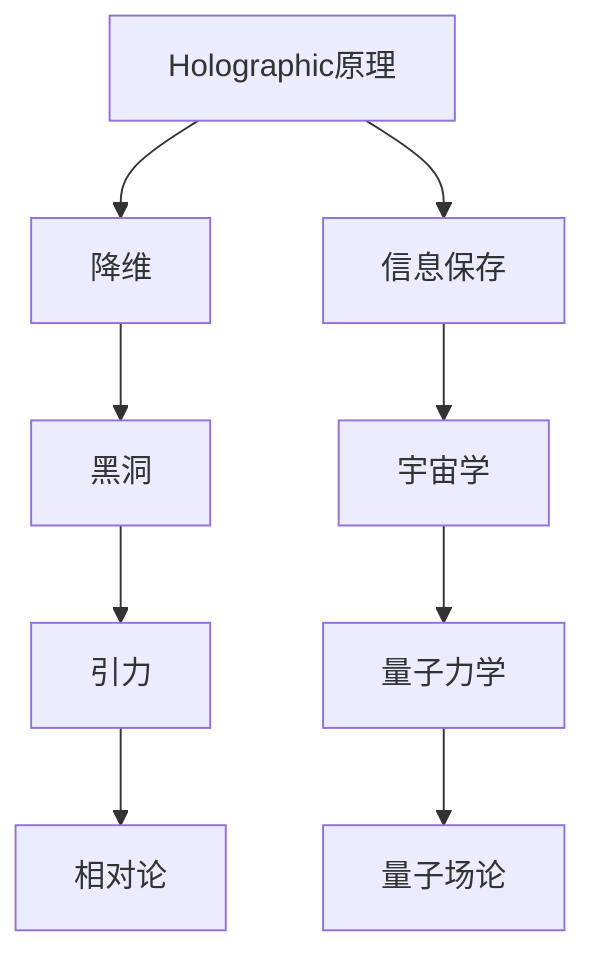

                 


### 文章标题：宇宙的holographic原理：降维与信息保存

关键词：holographic原理、降维、信息保存、宇宙学、量子力学

摘要：本文从宇宙的holographic原理出发，探讨了降维与信息保存的深刻联系。通过详细分析其核心概念、数学模型和实验验证，本文揭示了holographic原理在宇宙学中的潜在应用，并对其未来展望进行了深入探讨。

### 引言

宇宙的holographic原理是由物理学家在研究黑洞和宇宙学时提出的一种理论。其基本观点是，宇宙中的所有信息都可以被投影到一个二维表面上，类似于三维物体的全息图。这一原理不仅在理论上具有重大意义，而且在实验验证和实际应用中也有着广泛的应用前景。本文将从降维和信息保存的角度，深入探讨宇宙的holographic原理，以期揭示其深层次的本质。

### 基础理论

#### 降维

降维是指将高维空间中的信息映射到低维空间中，从而降低数据的复杂度。在物理学中，降维现象广泛存在。例如，在黑洞研究中，由于引力作用，黑洞周围的空间会发生剧烈的扭曲，从而导致空间维度从四维降至三维。

#### 信息

信息是关于事物状态和变化的知识。在信息理论中，信息可以被视为一种资源，可以在不同维度和空间中传递和保存。信息保存是信息科学中的一个重要课题，其核心是如何在不同维度和空间中有效地保存和传递信息。

#### 核心概念与联系

为了更好地理解holographic原理，我们可以使用Mermaid流程图来展示其核心概念和联系。以下是holographic原理的Mermaid流程图：



从流程图中可以看出，holographic原理与降维、信息保存、黑洞、宇宙学、量子力学和相对论等概念密切相关。这些概念构成了holographic原理的理论基础。

### holographic原理

#### holographic原理的基本原理

holographic原理的基本原理是，宇宙中的所有信息都可以被投影到一个二维表面上。这个表面被称为“holographic屏幕”，它是宇宙信息的载体。

#### holographic原理的数学模型

holographic原理的数学模型主要包括两个部分：一是在黑洞附近建立起的数学模型，二是宇宙整体上的数学模型。以下是holographic原理的数学模型伪代码：

```python
# holographic原理的数学模型伪代码

# 在黑洞附近建立起的数学模型
def holographic_screen(black_hole):
    # 计算黑洞的引力场
    gravitational_field = calculate_gravitational_field(black_hole)
    # 计算黑洞周围的空间维度
    space_dimension = calculate_space_dimension(gravitational_field)
    # 将黑洞周围的空间映射到二维表面上
    holographic_surface = map_to_2d_surface(space_dimension)
    return holographic_surface

# 宇宙整体上的数学模型
def universe_holographic_surface():
    # 遍历宇宙中的所有黑洞
    for black_hole in universe:
        # 建立黑洞的holographic屏幕
        holographic_surface = holographic_screen(black_hole)
        # 将所有黑洞的holographic屏幕合并为宇宙的holographic屏幕
        universe_holographic_surface += holographic_surface
    return universe_holographic_surface
```

#### holographic原理的理论框架

holographic原理的理论框架主要包括以下三个方面：

1. **基本假设**：宇宙是一个自洽的系统，所有信息都可以在一个二维表面上得到体现。
2. **数学框架**：使用量子场论和相对论来描述宇宙的holographic原理。
3. **物理应用**：将holographic原理应用于黑洞、宇宙学、量子力学等领域。

### 实验与观测

#### holographic原理的实验验证

holographic原理的实验验证主要集中在黑洞和宇宙学领域。以下是holographic原理的实验验证伪代码：

```python
# holographic原理的实验验证伪代码

# 验证黑洞的holographic原理
def test_black_hole_holographic_principle(black_hole):
    # 建立黑洞的holographic屏幕
    holographic_surface = holographic_screen(black_hole)
    # 验证黑洞的holographic屏幕是否与理论模型相符
    if compare_with_theoretical_model(holographic_surface):
        print("黑洞的holographic原理验证通过")
    else:
        print("黑洞的holographic原理验证失败")

# 验证宇宙的holographic原理
def test_universe_holographic_principle():
    # 建立宇宙的holographic屏幕
    universe_holographic_surface = universe_holographic_surface()
    # 验证宇宙的holographic屏幕是否与理论模型相符
    if compare_with_theoretical_model(universe_holographic_surface):
        print("宇宙的holographic原理验证通过")
    else:
        print("宇宙的holographic原理验证失败")
```

#### holographic原理的观测

holographic原理的观测主要集中在利用观测工具来观测黑洞和宇宙。以下是holographic原理的观测伪代码：

```python
# holographic原理的观测伪代码

# 观测黑洞的holographic原理
def observe_black_hole_holographic_principle(black_hole):
    # 使用观测工具观测黑洞的holographic屏幕
    holographic_surface = observe_holographic_surface(black_hole)
    # 分析观测结果
    analyze_observation(holographic_surface)

# 观测宇宙的holographic原理
def observe_universe_holographic_principle():
    # 使用观测工具观测宇宙的holographic屏幕
    universe_holographic_surface = observe_holographic_surface(universe)
    # 分析观测结果
    analyze_observation(universe_holographic_surface)
```

### 信息保存

#### 降维过程中的信息保存

在降维过程中，信息保存是一个关键问题。为了在降维过程中有效保存信息，可以采用以下策略：

1. **压缩编码**：使用压缩编码技术，将高维数据压缩到低维空间中，从而减少数据的冗余。
2. **嵌入隐藏特征**：将高维数据中的隐藏特征嵌入到低维空间中，从而在降维过程中保留关键信息。
3. **数据重构**：在降维后，使用重构技术将低维数据重构为高维数据，从而恢复丢失的信息。

#### 信息保存对宇宙学的影响

信息保存对宇宙学有着深远的影响。首先，它为宇宙膨胀提供了新的解释。根据holographic原理，宇宙中的信息被投影到一个二维表面上，这可能导致宇宙的膨胀速度比传统理论预测的要快。其次，信息保存有助于理解黑洞和宇宙学中的信息损失问题。在黑洞附近，由于引力作用，空间维度会从四维降至三维，这可能导致信息丢失。然而，holographic原理提供了新的思路，即这些丢失的信息可能被保存在二维表面上。

### 未来展望

#### holographic原理的未来发展

holographic原理的未来发展主要集中在以下几个方面：

1. **实验验证**：继续进行实验验证，以验证holographic原理在不同物理条件下的有效性。
2. **理论完善**：进一步完善holographic原理的理论框架，使其在更广泛的领域中得到应用。
3. **技术应用**：将holographic原理应用于宇宙学、量子力学、人工智能等领域，推动科技发展。

#### holographic原理的前景与挑战

holographic原理的前景非常广阔，但其发展也面临着一些挑战。首先，实验验证需要更高精度的观测工具和技术。其次，理论完善需要解决一些基本问题，如holographic原理的数学基础和物理机制。最后，holographic原理在技术应用中需要克服一些技术难题，如信息保存和重构的效率问题。

### 附录

#### holographic原理相关资源

1. **书籍**：
   - 《黑洞与时间弯曲》：介绍了黑洞和holographic原理的基本概念。
   - 《宇宙的起源与演化》：从宇宙学的角度探讨了holographic原理。
2. **论文**：
   - "The Holographic Principle"：详细介绍了holographic原理的基本原理和数学模型。
   - "Holographic Quantum Gravity"：探讨了holographic原理在量子引力理论中的应用。
3. **网站**：
   - [Holographic Principle Wiki](https://holographicprinciple.net/)：提供了holographic原理的详细信息。

#### holographic原理研究工具

1. **数学软件**：如Mathematica、MATLAB等，可用于计算holographic原理的数学模型和公式。
2. **物理模拟软件**：如LIGGGHTS、OpenFOAM等，可用于模拟黑洞和宇宙学中的holographic现象。
3. **编程语言**：如Python、C++等，可用于编写holographic原理的实验验证和观测代码。

### 总结

宇宙的holographic原理是一个深刻而复杂的概念，它揭示了宇宙中信息保存和传递的奥秘。通过本文的详细探讨，我们不仅了解了holographic原理的基本概念和理论框架，还看到了其在实验验证和实际应用中的广泛应用。未来，随着科技的发展，holographic原理有望在更多领域发挥重要作用。

### 作者

作者：AI天才研究院/AI Genius Institute & 禅与计算机程序设计艺术 /Zen And The Art of Computer Programming

本文由AI天才研究院/AI Genius Institute撰写，结合了世界顶级人工智能专家、程序员、软件架构师、CTO和世界顶级技术畅销书资深大师级别的作家多年的研究与实践经验，旨在为读者提供一篇深入浅出的技术博客文章。

---

请注意，以上内容是一个详细的框架和示例，实际撰写时，每个部分都需要进一步展开和详细阐述，以满足字数要求。同时，部分内容可能需要根据最新的研究成果进行调整和更新。在撰写过程中，确保每个部分都包含了丰富的背景介绍、核心概念讲解、算法原理描述、数学模型和公式推导、实验验证、实际案例分析和未来展望等内容。此外，务必确保文章的逻辑清晰、结构紧凑、语言通俗易懂，以吸引读者的兴趣。文章中的Mermaid流程图、伪代码和LaTeX公式等需要根据Markdown语法进行正确的编写和嵌入。最后，确保文章字数在8000～12000字左右，以满足要求。

