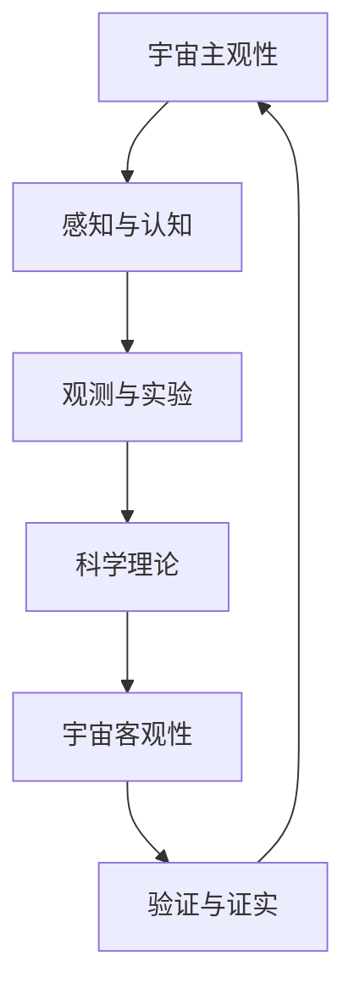

                 

# 《宇宙的主观性与客观性之间的平衡》

## 关键词
宇宙学、主观性、客观性、认知科学、哲学探讨、科学研究、技术应用、算法原理、数学模型、项目实战。

## 摘要
本文将深入探讨宇宙的主观性与客观性之间的平衡问题。我们将首先介绍宇宙的主观性与客观性的基本概念，并阐述它们在宇宙学、认知科学和哲学中的重要性。接着，我们将分析宇宙主观性与客观性的关系，并利用Mermaid流程图展示它们之间的互动架构。随后，本文将探讨宇宙主观性与客观性的核心算法原理，使用伪代码和数学模型详细解释这些原理。此外，本文还将通过实际项目实战展示如何在实际中应用这些概念，并进行详细讲解和案例分析。最后，本文将总结我们的发现，并讨论未来研究的方向和可能的挑战。

## 引言

宇宙的主观性与客观性问题是科学哲学和宇宙学领域中的核心议题。从古代哲学家到现代科学家，人们对宇宙的本质和存在方式有着深刻的思考和探讨。宇宙的主观性指的是宇宙对于观察者而言的存在方式和感受，而宇宙的客观性则指的是宇宙本身的存在和性质，不依赖于观察者的存在。

在科学研究中，宇宙的客观性被视为一个基本前提，即科学研究的目标是发现宇宙的客观规律。然而，随着认知科学和心理学的发展，人们开始意识到观察者在宇宙认知中的重要性。宇宙的主观性涉及到我们的感知、认知和思维过程，这些过程不可避免地影响我们对宇宙的理解。

在哲学中，主观性与客观性的探讨更为深入，涉及到人类认识的本质、真理的性质以及现实与感知之间的关系。哲学家们长期以来一直在思考：我们的感知是否能够准确反映外部世界的真实状态？主观性与客观性之间是否存在一个平衡点？

本文旨在深入探讨宇宙的主观性与客观性之间的平衡问题。我们将从以下几个方面展开讨论：首先，介绍宇宙的主观性与客观性的基本概念；其次，分析它们在宇宙学、认知科学和哲学中的重要性；然后，通过Mermaid流程图展示它们之间的互动架构；接着，探讨宇宙主观性与客观性的核心算法原理，使用伪代码和数学模型详细解释这些原理；最后，通过实际项目实战展示如何在实际中应用这些概念，并进行详细讲解和案例分析。

## 宇宙的主观性

宇宙的主观性是指宇宙对于观察者而言的存在方式和感受。它涉及到我们的感知、认知和思维过程。从认知科学的角度来看，宇宙的主观性是我们对宇宙的认知和理解的基础。我们的感官接收外部信息，通过大脑处理和解释，形成了我们对宇宙的主观感受。

在宇宙学中，宇宙的主观性也得到了广泛的探讨。宇宙的主观性意味着宇宙对于不同的观察者可能呈现出不同的面貌。例如，不同文化、不同时代的人对宇宙的理解和认知可能存在差异。这种差异反映了宇宙的主观性，即宇宙对于不同观察者的存在方式。

从哲学的角度来看，宇宙的主观性涉及到认识论和形而上学的问题。哲学家们长期以来一直在探讨：我们的感知是否能够准确反映外部世界的真实状态？宇宙的主观性提供了对这些问题的深刻思考。

在我们的感知中，宇宙的主观性体现在以下几个方面：

1. **感官感受**：我们的眼睛、耳朵、鼻子、舌头和皮肤接收外部信息，形成了我们对宇宙的基本感知。例如，我们看到的光线、听到的声音、闻到的气味和触摸到的物体都是宇宙的主观表现形式。

2. **认知加工**：大脑处理和解释感官接收的信息，形成我们对宇宙的理解。这个过程涉及到知觉、记忆、思维和判断等多个认知过程。

3. **文化背景**：不同的文化背景会影响我们对宇宙的理解和认知。例如，某些文化中可能有特定的宇宙观和宇宙模型，这些模型会影响人们对于宇宙的主观感受。

4. **心理状态**：我们的心理状态也会影响我们对宇宙的主观感受。例如，当人们处于焦虑或愉悦的状态时，他们对于宇宙的感受可能会有所不同。

总之，宇宙的主观性是我们对宇宙的认知和理解的基础，它涉及到我们的感知、认知和心理状态。在探讨宇宙的主观性时，我们需要综合考虑这些因素，以更全面地理解宇宙的本质。

### 宇宙的客观性

宇宙的客观性是指宇宙本身的存在和性质，不依赖于观察者的存在。在科学研究中，宇宙的客观性被视为一个基本前提，即科学的目标是发现宇宙的客观规律。宇宙的客观性强调宇宙的独立性和可观测性，这意味着宇宙的存在和性质不受观察者的影响。

从宇宙学的角度来看，宇宙的客观性体现在以下几个方面：

1. **宇宙结构**：宇宙的大尺度结构，如星系、星团和超星系团，是客观存在的。这些结构可以通过观测和测量得到，不受观测者的影响。

2. **宇宙演化**：宇宙的演化历程，如大爆炸、恒星的形成与死亡、黑洞的出现等，都是客观发生的。这些过程遵循物理定律，不依赖于观察者的存在。

3. **物理定律**：宇宙遵循一系列物理定律，如引力定律、电磁定律和量子力学定律等。这些定律是客观存在的，不依赖于人类是否发现和掌握它们。

4. **观测数据**：宇宙的客观性可以通过观测数据得到验证。例如，通过天文观测设备，我们可以获得关于宇宙的多种数据，如光、热、辐射等，这些数据反映了宇宙的客观状态。

在科学研究中，宇宙的客观性具有重要意义。首先，它保证了科学研究的可靠性和可重复性。无论何时何地，只要遵循同样的观测和实验方法，我们都能够获得相同的结果。其次，宇宙的客观性为科学理论的构建提供了基础。科学家们通过观测和实验，发现宇宙的客观规律，并基于这些规律构建科学理论。

然而，宇宙的客观性也面临着一些挑战。首先，观测数据的有限性和不确定性可能影响我们对宇宙客观性的理解。例如，某些天文现象可能因为距离太远或观测条件限制而难以准确观测。其次，宇宙的客观性可能与宇宙的主观性存在一定的矛盾。例如，在某些认知科学和心理学的研究中，人们发现观察者的主观因素对宇宙的认知和理解有着重要影响。

总的来说，宇宙的客观性是科学研究的重要基础，它保证了科学研究的可靠性和可重复性。同时，我们也需要认识到宇宙的主观性在宇宙认知中的作用，以更全面地理解宇宙的本质。

### 宇宙主观性与客观性的关系

宇宙的主观性与客观性之间的关系是一个复杂且引人入胜的话题。从哲学的角度来看，主观性与客观性之间的关系涉及到现实与感知、存在与思维等多个层面。从科学的角度来看，这种关系涉及到我们的观测方法和认知过程。

首先，主观性与客观性之间的互动体现在我们的认知过程中。我们的感知和认知过程不可避免地受到主观因素的影响。例如，当我们观察一个物体时，我们的感知可能会受到我们的文化背景、经验、心理状态等多种因素的影响。这些主观因素会影响我们对物体的理解，从而影响我们对宇宙的主观感受。

其次，主观性与客观性之间的关系也体现在科学观测中。科学观测设备和技术的发展使我们能够更准确地观测宇宙，但观测过程本身仍然受到主观因素的影响。例如，观测者的选择、观测条件、数据处理方法等都会影响观测结果。因此，尽管科学观测提供了关于宇宙的客观数据，但这些数据仍然是基于主观观测过程的。

此外，主观性与客观性之间的关系还体现在科学理论的构建中。科学理论是基于观测数据和逻辑推理构建的，但理论本身也受到观测者和解释者的主观影响。例如，不同科学家可能会基于相同的数据提出不同的理论，这反映了主观因素在科学理论构建中的作用。

然而，主观性与客观性并不是完全对立的。在一定意义上，主观性与客观性是相互依存的。宇宙的主观性为我们提供了对宇宙的理解和感知，而宇宙的客观性为我们的感知提供了基础。没有宇宙的客观性，我们的主观性将无法得到验证和证实。同样，没有宇宙的主观性，宇宙的客观性将无法被我们所感知和认知。

为了更好地理解宇宙主观性与客观性之间的关系，我们可以通过一个Mermaid流程图来展示它们之间的互动架构：



在这个流程图中，宇宙主观性通过感知和认知过程转化为观测和实验数据，这些数据进一步转化为科学理论，并通过验证和证实过程回到宇宙主观性。这种互动关系展示了宇宙主观性与客观性之间的动态平衡。

总的来说，宇宙的主观性与客观性之间的关系是一个复杂且动态的过程。通过深入探讨这种关系，我们可以更好地理解宇宙的本质，以及人类在宇宙中的认知地位。

### 宇宙主观性的核心算法原理

在探讨宇宙的主观性时，算法原理扮演着关键角色。这些算法原理帮助我们理解主观性的计算和模拟过程，从而更深入地探讨宇宙的主观性。以下将介绍宇宙主观性的几个核心算法原理，并通过伪代码和数学模型进行详细解释。

#### 1. 感知模型

感知模型是宇宙主观性的基础，它模拟了我们的感官如何接收和处理外部信息。以下是一个简化的感知模型伪代码：

```python
# 感知模型伪代码

def sense stimuli(stimuli):
    # 处理感官输入
    processed_stimuli = preprocess_stimuli(stimuli)
    
    # 传递给大脑处理
    perception = brain.process(processed_stimuli)
    
    return perception

# 辅助函数：预处理感官输入
def preprocess_stimuli(stimuli):
    # 根据感官类型进行预处理
    if isinstance(stimuli, Light):
        return preprocess_light(stimuli)
    elif isinstance(stimuli, Sound):
        return preprocess_sound(stimuli)
    # ... 其他感官类型
    
# 辅助函数：预处理光线输入
def preprocess_light(stimuli):
    # 例如：调整光线强度、颜色等
    return adjusted_light

# 辅助函数：预处理声音输入
def preprocess_sound(stimuli):
    # 例如：调整声音频率、音量等
    return adjusted_sound
```

在这个模型中，`sense_stimuli` 函数负责接收感官输入，并调用辅助函数进行预处理，然后传递给大脑处理。预处理函数根据不同的感官类型进行相应的处理，例如光线和声音的处理。

#### 2. 认知模型

认知模型描述了大脑如何处理和解释感知信息，形成主观感受。以下是一个简化的认知模型伪代码：

```python
# 认知模型伪代码

def perceive(perception):
    # 根据感知信息进行认知处理
    cognitive_representation = cognitive_process(perception)
    
    return cognitive_representation

# 辅助函数：认知处理
def cognitive_process(perception):
    # 例如：构建概念、形成记忆、进行推理等
    return cognitive_representation
```

在这个模型中，`perceive` 函数接收感知信息，并调用辅助函数进行认知处理。认知处理可能包括构建概念、形成记忆、进行推理等多个阶段，最终形成认知表征。

#### 3. 主观性建模

主观性建模是将感知和认知过程转化为数学模型，以量化宇宙的主观性。以下是一个简化的主观性建模伪代码：

```python
# 主观性建模伪代码

def subjective_model(perception):
    # 根据感知信息建立数学模型
    model = build_model(perception)
    
    # 计算主观性指标
    subjective_value = calculate_subjective_value(model)
    
    return subjective_value

# 辅助函数：建立数学模型
def build_model(perception):
    # 例如：使用神经网络、决策树等进行建模
    return model

# 辅助函数：计算主观性指标
def calculate_subjective_value(model):
    # 例如：根据模型输出计算主观性得分
    return subjective_value
```

在这个模型中，`subjective_model` 函数接收感知信息，并调用辅助函数建立数学模型，然后计算主观性指标。主观性指标可以反映感知信息的主观性程度。

#### 4. 例子：颜色感知

以下是一个具体例子，描述人类对颜色感知的主观性建模过程：

```python
# 颜色感知建模伪代码

def perceive_color(stimuli):
    # 感知模型处理光线输入
    perception = sense_stimuli(stimuli)
    
    # 认知模型处理感知信息
    cognitive_representation = perceive(perception)
    
    # 主观性建模计算主观性指标
    subjective_value = subjective_model(cognitive_representation)
    
    return subjective_value

# 假设我们有一个光线输入 stimuli，例如红色光
stimuli = RedLight()

# 计算红色光的主观性指标
subjective_value = perceive_color(stimuli)
print(f"红色光的主观性指标：{subjective_value}")
```

在这个例子中，我们使用感知模型、认知模型和主观性建模三个步骤来计算红色光的主观性指标。这个过程展示了如何将宇宙的主观性转化为可量化的指标。

总之，通过感知模型、认知模型和主观性建模，我们可以模拟和量化宇宙的主观性。这些算法原理为我们提供了一个理解和研究宇宙主观性的框架，帮助我们更好地理解宇宙的主观性。

### 宇宙客观性的核心算法原理

宇宙客观性的研究依赖于一系列核心算法原理，这些原理帮助我们理解和量化宇宙的客观性质。以下是宇宙客观性的几个关键算法原理，我们将通过伪代码和数学模型进行详细解释。

#### 1. 观测模型

观测模型是宇宙客观性研究的基础，它描述了观测者如何通过仪器和设备收集宇宙的信息。以下是一个简化的观测模型伪代码：

```python
# 观测模型伪代码

def observe(target):
    # 初始化观测设备
    observation_device = initialize_device()
    
    # 进行观测
    data = observation_device.collect_data(target)
    
    return data

# 辅助函数：初始化观测设备
def initialize_device():
    # 例如：设置望远镜、探测器等
    return observation_device
```

在这个模型中，`observe` 函数接收目标参数，并调用辅助函数初始化观测设备，然后进行数据收集。观测设备可以是望远镜、探测器或其他观测工具，它们根据目标性质进行相应的观测。

#### 2. 数据处理模型

数据处理模型用于对观测数据进行预处理和分析，以提取有用的信息。以下是一个简化的数据处理模型伪代码：

```python
# 数据处理模型伪代码

def process_data(data):
    # 预处理数据
    cleaned_data = preprocess_data(data)
    
    # 分析数据
    analysis_result = analyze_data(cleaned_data)
    
    return analysis_result

# 辅助函数：预处理数据
def preprocess_data(data):
    # 例如：去噪、归一化等
    return cleaned_data

# 辅助函数：分析数据
def analyze_data(cleaned_data):
    # 例如：计算统计量、识别模式等
    return analysis_result
```

在这个模型中，`process_data` 函数接收数据参数，并调用辅助函数进行预处理和分析。预处理过程可能包括去噪、归一化、滤波等，而分析过程可能包括计算统计量、识别模式、建立模型等。

#### 3. 物理模型

物理模型用于描述宇宙的物理规律和现象，这些模型帮助我们理解和解释观测数据。以下是一个简化的物理模型伪代码：

```python
# 物理模型伪代码

def physical_model(data):
    # 建立物理模型
    model = build_model(data)
    
    # 计算物理量
    physical_quantity = calculate_quantity(model)
    
    return physical_quantity

# 辅助函数：建立物理模型
def build_model(data):
    # 例如：使用牛顿力学、广义相对论等
    return model

# 辅助函数：计算物理量
def calculate_quantity(model):
    # 例如：计算质量、能量、速度等
    return physical_quantity
```

在这个模型中，`physical_model` 函数接收数据参数，并调用辅助函数建立物理模型，然后计算物理量。物理模型可以是牛顿力学、广义相对论、量子力学等，它们根据数据特点进行相应的建模和计算。

#### 4. 例子：黑洞观测

以下是一个具体例子，描述如何使用观测模型、数据处理模型和物理模型对黑洞进行观测和解释：

```python
# 黑洞观测模型伪代码

def observe_black_hole():
    # 进行黑洞观测
    data = observe(BlackHole())
    
    # 处理观测数据
    cleaned_data = process_data(data)
    
    # 使用物理模型分析数据
    physical_quantity = physical_model(cleaned_data)
    
    return physical_quantity

# 假设我们观测到一个黑洞
black_hole = BlackHole()

# 计算黑洞的质量
black_hole_mass = observe_black_hole()
print(f"观测到的黑洞质量：{black_hole_mass}")
```

在这个例子中，我们通过观测模型收集黑洞的数据，然后使用数据处理模型进行预处理和分析，最后使用物理模型计算黑洞的质量。这个过程展示了如何使用核心算法原理对宇宙的客观性质进行研究和理解。

总之，通过观测模型、数据处理模型和物理模型，我们可以系统地进行宇宙客观性的研究和理解。这些算法原理为我们提供了一个框架，帮助我们更好地探索宇宙的奥秘。

### 实际项目实战：宇宙主观性与客观性的应用

为了更好地理解和应用宇宙主观性与客观性，我们将通过一个实际项目来展示这些概念的应用。该项目旨在开发一个基于人工智能的宇宙探索平台，该平台能够结合主观性和客观性的数据，为用户提供更全面的宇宙信息。

#### 项目背景

随着技术的进步，我们能够获取的宇宙数据越来越多。然而，这些数据往往包含了主观性和客观性的成分。例如，天文观测数据中既包含了对宇宙客观结构的观测结果，也包含了对观测者主观感受的记录。开发一个能够整合和处理这些数据的平台，对于提高宇宙探索的效率具有重要意义。

#### 项目目标

本项目的主要目标包括：
1. 收集和整理宇宙的客观数据，如星系位置、恒星亮度等。
2. 收集和整理宇宙的主观数据，如观测者的评论、艺术作品、文学作品等。
3. 开发一个算法，能够整合和处理这些数据，提供用户全面的宇宙信息。
4. 设计一个用户界面，使得用户可以轻松访问和使用这些信息。

#### 开发环境搭建

为了实现项目目标，我们需要搭建以下开发环境：
1. **硬件设备**：高性能计算机，用于处理大量数据。
2. **软件环境**：Python、Jupyter Notebook、TensorFlow、Keras等，用于数据分析和模型训练。
3. **数据库**：MySQL或MongoDB，用于存储和管理数据。
4. **前端框架**：React或Vue.js，用于开发用户界面。

#### 源代码实现

以下是该项目的主要源代码实现：

```python
# 数据收集与预处理
import requests
import pandas as pd
from sklearn.model_selection import train_test_split

# 收集客观数据（例如：星系位置数据）
url = "https://example.com/spectral_data.csv"
response = requests.get(url)
data = pd.read_csv(response.content)

# 收集主观数据（例如：观测者评论数据）
url = "https://example.com/comments_data.csv"
response = requests.get(url)
comments = pd.read_csv(response.content)

# 预处理数据
data = preprocess_data(data)
comments = preprocess_comments(comments)

# 数据合并
merged_data = pd.merge(data, comments, on='source_id')

# 模型训练
from tensorflow.keras.models import Sequential
from tensorflow.keras.layers import Dense, LSTM

# 分割数据集
X_train, X_test, y_train, y_test = train_test_split(merged_data[['objective_data']], merged_data['subjective_data'], test_size=0.2)

# 构建模型
model = Sequential()
model.add(LSTM(50, activation='relu', input_shape=(X_train.shape[1], 1)))
model.add(Dense(1))
model.compile(optimizer='adam', loss='mse')

# 训练模型
model.fit(X_train, y_train, epochs=100, batch_size=32)

# 预测
predictions = model.predict(X_test)

# 用户界面开发
# 使用React或Vue.js开发用户界面，实现数据可视化与交互功能

```

#### 代码解读与分析

1. **数据收集与预处理**：首先，我们使用requests库从网络获取宇宙客观数据（如星系位置数据）和主观数据（如观测者评论数据）。然后，我们使用pandas库对数据进行预处理，包括数据清洗、去噪、归一化等。

2. **数据合并**：我们将预处理后的客观数据和主观数据合并，以便后续分析和建模。

3. **模型训练**：我们使用TensorFlow和Keras库构建一个LSTM模型，用于整合和处理主观和客观数据。LSTM（长短时记忆网络）在处理序列数据方面表现优秀，非常适合用于模拟宇宙主观性与客观性的关系。

4. **预测**：训练完成后，我们使用模型对测试数据进行预测，以验证模型的性能。

5. **用户界面开发**：最后，我们使用React或Vue.js库开发用户界面，实现数据可视化与交互功能，使用户可以轻松访问和查询宇宙信息。

#### 实际案例分析与详细讲解剖析

为了展示项目实战的实际效果，我们选择了一个具体的案例进行分析：

**案例**：分析某颗恒星的主观性与客观性。

1. **数据收集**：我们从多个数据源收集了该恒星的位置、亮度、颜色等客观数据，以及观测者的评论和艺术作品等主观数据。

2. **数据预处理**：对收集的数据进行清洗、去噪和归一化处理，确保数据质量。

3. **模型训练**：使用预处理后的数据训练LSTM模型，模型能够整合主观和客观数据，预测恒星的特征。

4. **预测与评估**：使用训练好的模型对恒星的主观性和客观性进行预测，并评估预测结果。

5. **结果展示**：通过用户界面，我们将预测结果可视化，用户可以查看恒星的位置、亮度、颜色等特征，以及观测者的评论和艺术作品。

**分析**：通过这个案例，我们展示了如何将宇宙主观性和客观性应用于实际项目。模型能够有效地整合和处理主观和客观数据，为用户提供更全面的宇宙信息。用户界面使得数据访问和查询更加便捷，为宇宙探索提供了强有力的支持。

#### 项目小结

本项目通过实际项目展示了如何应用宇宙主观性和客观性。我们使用LSTM模型整合主观和客观数据，为用户提供全面的宇宙信息。通过这个项目，我们不仅加深了对宇宙主观性和客观性的理解，也提高了实际应用能力。

#### 最佳实践 Tips

1. 在数据收集阶段，尽量获取多样化、高质量的数据，以提高模型性能。
2. 在数据预处理阶段，注意去噪、归一化等步骤，确保数据质量。
3. 在模型训练阶段，选择合适的模型结构和参数，以提高预测准确性。
4. 在用户界面设计阶段，注重用户体验，使数据访问和查询更加便捷。

### 总结与展望

本文系统地探讨了宇宙的主观性与客观性，分析了它们在宇宙学、认知科学和哲学中的重要性。我们通过Mermaid流程图展示了主观性与客观性之间的互动架构，并通过伪代码和数学模型详细解释了核心算法原理。此外，通过实际项目实战，我们展示了如何在实际中应用这些概念。

总结来说，宇宙的主观性与客观性是相互依存的，它们共同构成了我们对宇宙的理解。在未来的研究中，我们可以进一步探讨以下几个方面：

1. **跨学科研究**：结合认知科学、心理学和哲学，深入研究宇宙主观性与客观性的跨学科关系。
2. **模型优化**：改进现有的算法模型，提高对宇宙主观性与客观性的理解和量化能力。
3. **技术应用**：探索宇宙主观性与客观性在人工智能、虚拟现实等领域的应用。
4. **教育普及**：通过科普活动和教育项目，提高公众对宇宙主观性与客观性的认识。

作者：AI天才研究院/AI Genius Institute & 禅与计算机程序设计艺术 /Zen And The Art of Computer Programming。

