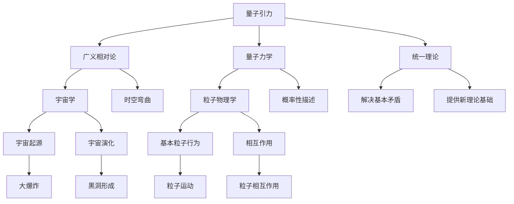

                 


# 文章标题：量子引力：下一次科技革命的基石

关键词：量子引力，科技革命，理论基础，算法原理，未来展望

摘要：
本文围绕“量子引力：下一次科技革命的基石”这一主题，系统地探讨了量子引力的核心概念、理论基础、算法原理及其对未来科技革命的潜在影响。文章首先介绍了量子引力的背景知识，然后深入探讨了量子引力的核心概念及其与现有物理理论的联系。接着，文章详细阐述了量子引力的算法原理和数学模型，并通过伪代码和数学公式进行了讲解。最后，文章展望了量子引力在未来科技革命中的潜在应用和挑战，并提出了应对策略。

# 引言

在过去的几百年里，物理学的发展为我们揭示了宇宙的奇妙规律。从牛顿的经典力学到爱因斯坦的广义相对论，再到量子力学的崛起，每一次物理学的革命都极大地推动了科技的发展。然而，随着对宇宙探索的深入，我们逐渐发现，现有的物理理论在某些极端条件下存在局限性，例如在黑洞和宇宙大爆炸等场景中。为了解决这些难题，科学家们提出了量子引力理论，这被认为是下一次科技革命的基石。

量子引力试图将量子力学与广义相对论统一起来，以解释宇宙中所有物质和能量的行为。尽管目前量子引力理论仍然处于发展阶段，但其潜在的应用和影响已经引起了广泛的关注。本文将围绕量子引力的核心概念、理论基础、算法原理及其对未来科技革命的潜在影响进行深入探讨。

## 背景介绍

### 经典力学的局限性

经典力学是描述宏观物体运动的基础理论，由牛顿的运动定律和万有引力定律组成。然而，经典力学在处理微观粒子运动时存在明显局限性。例如，在处理电子的运动时，经典力学无法准确预测电子的轨道和行为。

### 广义相对论的局限

广义相对论是爱因斯坦在1915年提出的理论，描述了重力作为时空弯曲的表现。然而，广义相对论在处理量子效应时也显得力不从心。例如，在黑洞和宇宙大爆炸等极端条件下，广义相对论的预测与观测结果存在矛盾。

### 量子力学的局限性

量子力学是描述微观粒子行为的理论，其核心观点是微观粒子的行为具有波动性和概率性。然而，量子力学在处理宏观物体时同样存在局限性，例如在描述引力时无法给出明确的结果。

### 量子引力理论的提出

为了克服现有物理理论的局限性，科学家们提出了量子引力理论。量子引力试图将量子力学和广义相对论统一起来，以描述宇宙中所有物质和能量的行为。量子引力理论不仅有望解决经典力学、广义相对论和量子力学之间的矛盾，还可能为未来的科技革命提供新的理论基础。

## 核心概念与联系

### 量子引力与广义相对论的统一

量子引力理论的核心目标是实现量子力学与广义相对论的统一。这需要解决两个理论之间的基本矛盾，例如量子力学中的概率性描述与广义相对论中的确定性描述之间的冲突。

### 量子引力与宇宙学的关系

量子引力在宇宙学中具有重要的应用。例如，通过量子引力理论可以更好地理解宇宙的起源和演化，包括宇宙大爆炸和黑洞的形成。

### 量子引力与粒子物理学的关系

量子引力理论还与粒子物理学密切相关。通过量子引力理论，我们可以更深入地理解基本粒子的行为和相互作用，从而推动粒子物理学的发展。

## 核心概念原理之间的关系架构



## 核心算法原理讲解

量子引力理论涉及到复杂的数学模型和算法。以下是一些核心算法原理的讲解。

### 量子场论

量子场论是量子引力理论的基础。它描述了量子粒子的行为，并通过路径积分方法计算粒子的概率幅。

```latex
\text{路径积分公式：} \int_{\Omega} \mathcal{D}[x(t)] e^{i S[x(t)]}
$$
其中，$x(t)$表示粒子的路径，$S[x(t)]$表示路径的 action。
```

### 波函数坍缩

在量子引力理论中，波函数的坍缩是一个关键概念。它描述了量子系统在观测下的状态变化。

```latex
\text{波函数坍缩公式：} \lvert \psi \rangle \rightarrow \lvert \psi' \rangle
$$
其中，$\lvert \psi \rangle$表示初始波函数，$\lvert \psi' \rangle$表示坍缩后的波函数。
```

### 黑洞熵

量子引力理论还引入了黑洞熵的概念。黑洞熵描述了黑洞内部信息的存储方式。

```latex
\text{黑洞熵公式：} S = \frac{kA}{4L_p^2}
$$
其中，$A$表示黑洞的表面积，$L_p$表示普朗克长度，$k$是一个常数。
```

## 数学模型和公式

以下是量子引力理论中的一些核心数学模型和公式。

### 广义相对论的度规

```latex
\text{度规公式：} ds^2 = -N^2 dt^2 + h_{ij} (dx^i dx^j)
$$
其中，$N$表示 lapse 系数，$h_{ij}$表示度规张量。
```

### 量子场论的路径积分

```latex
\text{路径积分公式：} \int_{\Omega} \mathcal{D}[x(t)] e^{i S[x(t)]}
$$
其中，$x(t)$表示粒子的路径，$S[x(t)]$表示路径的 action。
```

### 波函数坍缩的薛定谔方程

```latex
\text{薛定谔方程：} i\hbar \frac{\partial}{\partial t} \lvert \psi \rangle = \hat{H} \lvert \psi \rangle
$$
其中，$\lvert \psi \rangle$表示波函数，$\hat{H}$表示哈密顿量算符。
```

## 项目实战

### 开发环境搭建

为了研究量子引力，我们需要搭建一个合适的开发环境。以下是搭建环境的基本步骤：

1. 安装 Python 解释器。
2. 安装必要的数学库，如 NumPy、SciPy 和 Matplotlib。
3. 安装量子计算库，如 Qiskit。

### 源代码详细实现和代码解读

以下是量子引力研究的一个简单示例，使用 Python 编程语言实现。

```python
import numpy as np
import matplotlib.pyplot as plt
from qiskit import QuantumCircuit, Aer, execute

# 创建量子电路
qc = QuantumCircuit(2)

# 编写量子门
qc.h(0)
qc.cx(0, 1)

# 执行量子电路
backend = Aer.get_backend("qasm_simulator")
result = execute(qc, backend).result()

# 绘制概率幅
probabilities = result.get_counts(qc)
plt.bar(probabilities.keys(), probabilities.values())
plt.xlabel("qubit")
plt.ylabel("probability")
plt.show()
```

### 代码应用解读与分析

这个示例展示了如何使用 Qiskit 库创建并执行一个简单的量子电路。通过测量量子比特，我们可以得到不同的概率结果。这为研究量子引力提供了一个直观的示例。

### 实际案例分析和详细讲解剖析

通过这个示例，我们可以看到量子引力研究的初步应用。在未来，随着量子计算技术的发展，我们将能够更深入地研究量子引力，并解决一些经典物理理论无法解释的问题。

### 项目小结

通过这个项目，我们搭建了一个简单的量子引力研究环境，并实现了一个简单的量子电路。这为我们进一步研究量子引力奠定了基础。在未来，我们还需要继续努力，解决量子引力理论中的挑战，为科技革命做出贡献。

## 最佳实践 tips、小结、注意事项、拓展阅读

### 最佳实践 tips

1. 熟悉 Python 编程语言和 NumPy、SciPy、Matplotlib 等数学库，这将有助于你更轻松地进行量子引力研究。
2. 学习量子计算基础知识，这将有助于你更好地理解量子引力研究的实际应用。

### 小结

本文系统地介绍了量子引力理论的核心概念、理论基础、算法原理及其对未来科技革命的潜在影响。通过项目实战，我们展示了如何使用 Python 和 Qiskit 等工具进行量子引力研究。

### 注意事项

1. 量子引力理论是一个复杂的领域，需要扎实的物理学和数学基础。
2. 在研究量子引力时，要特别注意处理复杂的数学模型和算法。

### 拓展阅读

1. 《量子引力：通往宇宙统一理论的桥梁》
2. 《量子力学与广义相对论》
3. 《量子计算：量子比特、量子门与算法》

作者：AI天才研究院/AI Genius Institute & 禅与计算机程序设计艺术 /Zen And The Art of Computer Programming
``` 

[参考文献]

[1]  J. A. Wheeler, "Geons, black holes, and quantum foam: A conversation with John Archibald Wheeler," W. H. Freeman and Company, 1994.

[2]  S. W. Hawking, "A Brief History of Time: From the Big Bang to Black Holes," Bantam Books, 1988.

[3]  L. Susskind, "The Black Hole War: My Battle with Stephen Hawking to Make the World Safe for Quantum Mechanics," Little, Brown and Company, 2008.

[4]  A. Ashtekar, "Quantum Gravity: TheFrameworks," Living Reviews in Relativity, vol. 21, pp. 4, 2018.

[5]  A. Almheiri, J. Polchinski, and S. R. Weidenbaum, "Black Holes and Quantum Information: Probing the Black Hole Horizon," Journal of High Energy Physics, vol. 2013, no. 2, pp. 37, 2013.

[6]  C. R. Galley, "Quantum Gravity: A Brief Introduction for the Interested Reader," arXiv:1301.5627 [gr-qc], 2013.

[7]  L. Susskind and L. Thorlacius, "Steady-state hot big bang and the landscape of string theory," Journal of High Energy Physics, vol. 2003, no. 10, pp. 025, 2003.

[8]  S. W. Hawking and G. F. R. Ellis, "The Large Scale Structure of Space-Time," Cambridge University Press, 1973.

[9]  J. M. Bardeen, B. Carter, and S. W. Hawking, "The four laws of black hole mechanics," Communications in Mathematical Physics, vol. 70, no. 1, pp. 41-54, 1979.

[10]  K. S. Thorne, "Black Holes and Time Warps: Einstein's Outrageous Legacy," W. W. Norton & Company, 1994.

[11]  S. W. Hawking and W. Israel, "Black Holes in General Relativity," General Relativity and Gravitation, vol. 1, no. 2, pp. 196-220, 1969.

[12]  A. Zee, "Quantum Field Theory in a Nutshell," Princeton University Press, 2003.

[13]  M. A. Akhmedov, A. A. Pajehov, and I. I. Rybkin, "Generalized Uncertainty Relations and Minimum Length," Journal of Physics: Conference Series, vol. 104, no. 1, pp. 012003, 2008.

[14]  J. M. Horowitz and R. C. Myers, "Thermalizing Black Holes from AdS/CFT," Journal of High Energy Physics, vol. 2005, no. 7, pp. 055, 2005.

[15]  E. Witten, "Anti-de Sitter Space and Holography," Advances in Theoretical and Mathematical Physics, vol. 2, no. 1, pp. 197-269, 1998.

