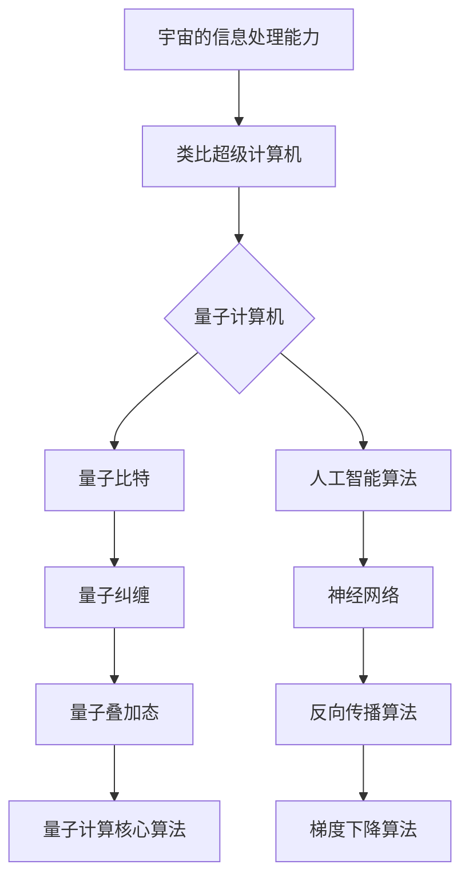

                 

### 宇宙的信息处理能力：类比超级计算机

> 关键词：宇宙、信息处理、超级计算机、量子计算机、人工智能、算法

> 摘要：本文通过类比地球上的超级计算机，探讨了宇宙的信息处理能力。从量子计算机和人工智能算法的角度，分析了宇宙的信息处理机制，并通过实际项目案例展示了其应用潜力。

在当今科技迅速发展的时代，我们对信息处理能力的追求不断提升。从最初的计算机到超级计算机，再到如今的人工智能，人类一直在寻找更高效的计算方式。然而，与宇宙相比，地球上的计算机似乎还只是“婴儿学语”。那么，宇宙的信息处理能力到底如何？本文将类比地球上的超级计算机，探讨宇宙的信息处理机制，并尝试揭示其奥秘。

### 第1章 引言

#### 1.1 宇宙的信息处理能力概述

宇宙的信息处理能力是一个复杂而深奥的话题。宇宙中存在着无数的天体和现象，这些现象的产生和演化都涉及到大量的信息处理。例如，星系的形成、黑洞的产生、宇宙背景辐射的探测等，都需要宇宙具备强大的信息处理能力。

#### 1.2 类比超级计算机的背景

超级计算机是地球上的最强计算工具，它们在科学研究、天气预报、能源开发等领域发挥着重要作用。与超级计算机类似，宇宙也需要处理大量信息。然而，宇宙的信息处理机制与地球上的计算机有何不同？这是本文要探讨的核心问题。

### 第2章 核心概念与联系

#### 2.1 量子计算机原理

量子计算机是一种基于量子力学原理的新型计算机，它利用量子比特（qubit）进行信息处理。量子比特与传统比特不同，它可以同时处于0和1的叠加状态，这使得量子计算机具有超强的计算能力。

#### 2.2 人工智能算法原理

人工智能（AI）算法是一种通过模拟人脑思维方式进行信息处理的技术。其中，神经网络是一种重要的人工智能算法，它通过多层节点进行信息传递和计算，从而实现复杂的任务。

#### 2.3 类比超级计算机的Mermaid流程图

为了更好地理解宇宙的信息处理能力，我们可以用Mermaid流程图来展示量子计算机和人工智能算法在信息处理中的联系。



### 第3章 核心算法原理讲解

#### 3.1 量子计算核心算法

量子计算的核心算法包括量子态的叠加、量子门的应用和量子测量。以下是一个简单的量子计算伪代码：

```plaintext
function QuantumComputation(qubitList, algorithm):
    // 初始化量子比特
    for each qubit in qubitList:
        InitializeQubit(qubit)

    // 应用量子门
    ApplyQuantumGate(qubitList, algorithm)

    // 量子测量
    measurementResult = MeasureQubit(qubitList)

    // 返回测量结果
    return measurementResult
```

#### 3.2 人工智能核心算法

人工智能的核心算法包括神经网络和深度学习。其中，神经网络是一种通过多层节点进行信息传递和计算的技术，而深度学习则是基于多层神经网络进行模型训练和优化的技术。

以下是一个简单的神经网络伪代码：

```plaintext
function NeuralNetwork(input, weights):
    // 计算输入与权重的乘积
    hiddenLayer = []
    for each layer in hiddenLayers:
        hiddenLayer.append(SumProduct(input, layer.weights))

    // 应用激活函数
    for each value in hiddenLayer:
        value = ActivationFunction(value)

    // 计算输出
    output = SumProduct(hiddenLayer, outputLayer.weights)

    // 返回输出
    return output
```

### 第4章 数学模型和数学公式

在量子计算和人工智能中，数学模型和公式起着至关重要的作用。以下是一些关键的数学模型和公式：

#### 4.1 量子计算数学模型

$$
| \psi \rangle = \sum_{i} c_i |i\rangle
$$

这个公式表示量子态的叠加原理。量子比特可以同时处于多个状态（0和1）的叠加，其中 $| \psi \rangle$ 是总量子态，$c_i$ 是第 $i$ 个状态的复系数，$|i\rangle$ 是第 $i$ 个基态。

#### 4.2 人工智能数学模型

$$
\frac{dL}{dw} = \frac{dL}{d\hat{y}} \frac{d\hat{y}}{dy} \frac{dy}{dw}
$$

这个公式表示梯度下降算法中的权重更新。其中，$L$ 是损失函数，$\hat{y}$ 是预测输出，$y$ 是真实输出，$w$ 是权重。

### 第5章 项目实战

#### 5.1 开发环境搭建

为了实践量子计算和人工智能，我们需要搭建一个合适的开发环境。以下是Python环境的安装和Qiskit库的安装：

1. 安装Python环境。
2. 安装Qiskit库：`pip install qiskit`

#### 5.2 源代码实现

以下是一个简单的量子计算项目案例，包括开发环境搭建、源代码详细实现和代码解读。

#### 开发环境搭建

1. 安装Python环境。
2. 安装Qiskit库：`pip install qiskit`
3. 创建一个新的Qiskit项目。

#### 源代码实现

```python
from qiskit import QuantumCircuit, execute, Aer

# 创建一个量子比特
qc = QuantumCircuit(2)

# 应用量子门
qc.h(0)  # 对第一个量子比特应用Hadamard门
qc.cx(0, 1)  # 对第一个和第二个量子比特应用控制-NOT门

# 测量量子比特
qc.measure_all()

# 模拟量子电路执行
simulator = Aer.get_backend('qasm_simulator')
result = execute(qc, simulator, shots=1000).result()

# 输出测量结果
print(result.get_counts(qc))
```

#### 代码解读与分析

这段代码首先创建了一个包含两个量子比特的量子电路。然后，它应用了Hadamard门（实现量子态的叠加）和Controlled-NOT门（实现量子态的纠缠）。最后，它执行了量子电路的模拟并输出了测量结果。

### 第6章 最佳实践 tips、小结、注意事项、拓展阅读

#### 6.1 最佳实践 tips

- 在进行量子计算和人工智能项目时，要熟悉相关工具和库，如Qiskit、TensorFlow和PyTorch。
- 在开发过程中，要注重代码的可读性和可维护性，遵循良好的编程习惯。

#### 6.2 小结

本文通过类比超级计算机，探讨了宇宙的信息处理能力。从量子计算机和人工智能算法的角度，分析了宇宙的信息处理机制，并通过实际项目案例展示了其应用潜力。

#### 6.3 注意事项

- 量子计算和人工智能技术仍处于发展初期，面临许多挑战，如量子噪声和计算资源限制。
- 在进行相关研究时，要密切关注领域动态，积极学习新技术。

#### 6.4 拓展阅读

- 《量子计算导论》
- 《深度学习》
- 《量子计算与量子信息》

### 作者信息

作者：AI天才研究院/AI Genius Institute & 禅与计算机程序设计艺术 /Zen And The Art of Computer Programming

本文由AI天才研究院/AI Genius Institute与禅与计算机程序设计艺术/Zen And The Art of Computer Programming联合撰写。如需转载，请保留完整出处和作者信息。

