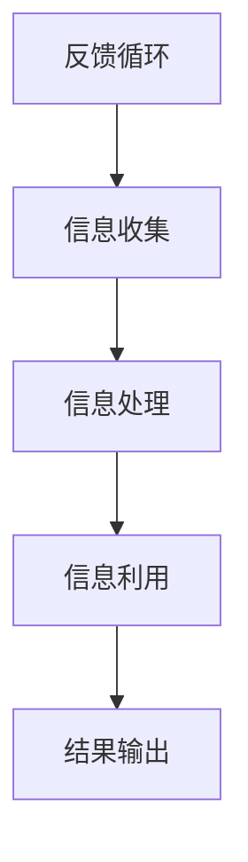
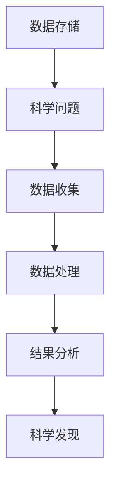

                 

### 文章标题

《宇宙的信息处理：类比超级计算机》

### 文章关键词

宇宙信息处理、超级计算机、类比、信息传递、计算能力、科学研究、发展趋势、未来应用

### 文章摘要

本文将探讨宇宙的信息处理机制，并将其与超级计算机进行类比。通过对宇宙信息处理的基本原理、机制和人类对其理解的分析，结合超级计算机的概念、工作原理及其在科学研究中的应用，我们将探索两者之间的相似性和差异，以及它们在未来的结合与应用前景。本文旨在为读者提供一个全面、深入的了解，以便更好地理解宇宙信息处理的重要性以及其在科学研究和技术发展中的潜在影响。

---

### 第1章 宇宙信息处理基础

#### 1.1 宇宙信息处理的概念与重要性

宇宙信息处理是指宇宙中所有信息产生、传递、处理和利用的过程。它涵盖了从宇宙大爆炸至今的所有信息交换活动，包括星系、恒星、行星以及生物体的信息处理。宇宙信息处理的重要性在于，它不仅是宇宙演化过程中不可或缺的一部分，也是我们理解宇宙本质和探索宇宙奥秘的基础。

在宇宙尺度上，信息处理主要通过以下几个步骤进行：

1. **信息产生**：宇宙中的信息来源多样，包括星体的辐射、粒子的碰撞等。
2. **信息传递**：信息在宇宙中以光速传递，通过电磁波、引力波等形式传播。
3. **信息处理**：宇宙中的信息处理机制涉及星系、恒星和行星的自组织、演化和适应过程。
4. **信息利用**：生物体通过感知、处理和响应外部信息来适应环境。

#### 1.2 宇宙信息处理的基本原理

宇宙信息处理的基本原理主要包括以下几个方面：

1. **信息与物质的关系**：信息是物质的一种属性，它与物质紧密相连。在宇宙中，物质状态的变化往往伴随着信息的产生和传递。
   
2. **信息在宇宙中的传递**：信息在宇宙中以电磁波、引力波等形式传递。这些波的传播速度决定了信息传递的速度。例如，光速是电磁波在真空中的传播速度，是宇宙信息传递的一个重要界限。

3. **信息处理机制**：宇宙中的信息处理机制涉及到多个层次。从微观层面看，基本粒子的相互作用和运动可以视为一种信息处理。从宏观层面看，星系、恒星和行星的自组织过程也是一种信息处理。

#### 1.3 宇宙中的信息处理机制

宇宙中的信息处理机制可以分为以下几个层次：

1. **星系层次**：星系的形成和演化过程中，星体之间的引力相互作用可以视为一种信息处理。星系中心的大型黑洞通过吞噬物质产生信息，并通过引力波向外传递。
   
2. **恒星层次**：恒星内部进行核聚变反应，将物质转化为能量和信息。恒星表面的辐射和喷流也是一种信息传递和处理的机制。

3. **行星层次**：行星通过大气层、地质活动和生物过程进行信息处理。例如，地球上的气候系统通过大气和海洋的相互作用处理大量的信息，以维持生态平衡。

4. **生物体层次**：生物体通过神经系统、感官器官和大脑进行信息处理。生物体能够感知外部环境的信息，并通过神经系统传递和处理这些信息，以适应环境变化。

#### 1.4 人类对宇宙信息处理的理解

人类对宇宙信息处理的理解经历了漫长的过程。从古代的天文学观测，到现代的天体物理学研究，人类逐渐揭示了宇宙中的信息处理机制。

1. **历史发展**：人类对宇宙信息处理的理解始于对天体运动的观测。古希腊哲学家通过对星空的观察，提出了行星运动的规律。随着科学技术的进步，人类对宇宙的认识不断深化，从宏观宇宙到微观宇宙，从静态宇宙到动态宇宙，人类对宇宙信息处理的理解也在不断拓展。

2. **模拟宇宙信息处理**：人类通过计算机模拟和实验，试图模拟宇宙中的信息处理过程。例如，通过计算机模拟恒星的形成和演化，探索信息在星系层次上的处理机制。

3. **科学研究**：天体物理学、生物学、计算机科学等多个学科领域，共同推动了人类对宇宙信息处理的理解。通过跨学科合作，人类正在逐渐揭示宇宙信息处理的全貌。

### 第2章 类比超级计算机

#### 2.1 超级计算机的概念与特点

超级计算机是计算机的一种类型，具有极高的计算速度和强大的处理能力。它通常用于处理大规模、复杂的问题，如气象预报、核能模拟、分子动力学等。

1. **概念**：超级计算机是指那些在计算速度、处理能力和存储容量等方面都远远超出常规计算机的计算机系统。

2. **特点**：

   - **高速计算**：超级计算机能够以每秒数百万亿次浮点运算的速度运行，远远超过普通计算机。
   - **并行处理**：超级计算机通常采用并行计算架构，能够同时处理多个任务。
   - **大存储容量**：超级计算机具有巨大的存储容量，能够存储和处理大量的数据。
   - **特殊应用**：超级计算机主要用于解决特定领域中的复杂问题，如科学研究、国防安全、天气预报等。

#### 2.2 超级计算机的工作原理

超级计算机的工作原理主要包括以下几个方面：

1. **硬件架构**：超级计算机通常采用分布式计算架构，由多个计算节点组成。每个计算节点包含处理器、内存和存储设备，能够独立运行计算任务。

2. **并行计算**：超级计算机通过并行计算架构，将一个大的计算任务分解为多个小的子任务，由多个计算节点同时处理。这样可以大幅提高计算速度。

3. **编程语言**：超级计算机通常使用高性能编程语言，如C、Fortran等，以实现高效的计算。

4. **软件工具**：超级计算机配备了各种软件工具，如编译器、调试器、模拟器等，以支持高性能计算。

#### 2.3 超级计算机在科学研究中的应用

超级计算机在科学研究中的应用非常广泛，以下是几个典型领域：

1. **天文学研究**：超级计算机用于模拟星系的形成和演化，预测宇宙的演化过程，探索宇宙的奥秘。

2. **物理学研究**：超级计算机用于模拟核反应、粒子碰撞等物理现象，探索物质的基本结构和相互作用。

3. **生化学研究**：超级计算机用于模拟生物大分子的结构和动态，探索生物过程和疾病机理。

#### 2.4 超级计算机的发展趋势

超级计算机的发展趋势主要体现在以下几个方面：

1. **量子计算机**：量子计算机是一种基于量子力学原理的新型计算机，具有极高的计算速度和强大的处理能力。量子计算机的发展有望推动超级计算机技术的进一步革新。

2. **光子计算机**：光子计算机是一种利用光信号进行计算的新型计算机。与电子计算机相比，光子计算机具有更高的计算速度和更低的能耗。

3. **新型存储技术**：新型存储技术，如闪存、3D NAND等，将进一步提高超级计算机的存储容量和速度。

### 第3章 宇宙信息处理与超级计算机的类比

#### 3.1 宇宙信息处理与超级计算机的相似性

宇宙信息处理与超级计算机在许多方面具有相似性，主要表现在以下几个方面：

1. **信息处理**：宇宙和超级计算机都需要对信息进行收集、处理和利用。在宇宙中，信息通过电磁波、引力波等形式传递，在超级计算机中，信息通过数据流和指令流进行传递。

2. **计算能力**：宇宙和超级计算机都具有强大的计算能力。宇宙通过恒星、行星等天体进行信息处理，超级计算机通过多个计算节点进行并行计算。

3. **复杂性**：宇宙和超级计算机都处理复杂的任务。宇宙中的信息处理涉及到多个层次，从微观到宏观，从静态到动态。超级计算机则处理各种复杂的应用，如气象预报、核能模拟等。

#### 3.2 宇宙信息处理与超级计算机的区别

尽管宇宙信息处理与超级计算机有许多相似之处，但它们也存在明显的区别，主要体现在以下几个方面：

1. **能量消耗**：宇宙信息处理几乎不消耗能量，而超级计算机需要大量的能源来维持运行。

2. **信息传递速度**：在宇宙中，信息以光速传递，而在超级计算机中，信息传递速度受到硬件限制。

3. **自组织与人工设计**：宇宙信息处理是自组织的，没有人类干预。而超级计算机的信息处理过程是人工设计的，需要编程和计算模型。

#### 3.3 宇宙信息处理与超级计算机的结合

宇宙信息处理与超级计算机的结合具有重要的研究价值，主要表现在以下几个方面：

1. **科学研究**：通过模拟宇宙信息处理过程，超级计算机可以揭示宇宙的演化机制，帮助人类更好地理解宇宙。

2. **技术创新**：宇宙信息处理的理论和方法可以应用于超级计算机的设计和优化，提高其计算能力和效率。

3. **未来应用**：宇宙信息处理与超级计算机的结合有望推动未来科技的发展，如量子计算机、光子计算机等。

### 第4章 类比超级计算机在宇宙探索中的应用

#### 4.1 类比超级计算机在天文学中的应用

在天文学中，类比超级计算机的应用主要体现在以下几个方面：

1. **天体物理数据的处理**：超级计算机用于处理大量天体物理数据，如电磁波、引力波等。通过这些数据，科学家可以研究星系的形成和演化，探索宇宙的奥秘。

2. **宇宙背景微波辐射的研究**：宇宙背景微波辐射是宇宙早期信息的记录，超级计算机用于分析和模拟这些辐射，帮助科学家了解宇宙的早期状态。

#### 4.2 类比超级计算机在物理学中的应用

在物理学中，类比超级计算机的应用也非常广泛，主要体现在以下几个方面：

1. **宇宙大爆炸理论的验证**：超级计算机用于模拟宇宙大爆炸的过程，验证宇宙大爆炸理论的准确性。

2. **黑洞和暗物质的研究**：超级计算机用于模拟黑洞的形成和演化，探索暗物质的性质和分布。

#### 4.3 类比超级计算机在生物学中的应用

在生物学中，类比超级计算机的应用主要体现在以下几个方面：

1. **生物信息学的研究**：超级计算机用于处理大量生物信息数据，如基因序列、蛋白质结构等。通过这些数据，科学家可以研究生命起源和演化。

2. **生命起源的探索**：超级计算机用于模拟生命起源的过程，探索生命在地球上的起源和演化。

### 第5章 类比超级计算机的未来

#### 5.1 类比超级计算机在未来的科学研究中的应用

在未来的科学研究中，类比超级计算机的应用将会更加广泛和深入，主要体现在以下几个方面：

1. **宇宙起源和演化的研究**：超级计算机将继续模拟宇宙的起源和演化过程，帮助科学家揭示宇宙的本质和奥秘。

2. **生命起源和演化的研究**：超级计算机将用于模拟生命的起源和演化过程，探索生命的多样性和进化规律。

#### 5.2 类比超级计算机在工程和技术领域的应用

在工程和技术领域，类比超级计算机的应用也将得到进一步拓展，主要体现在以下几个方面：

1. **新型材料的设计**：超级计算机将用于模拟新型材料的结构和性能，帮助工程师设计出更先进、更高效的材料。

2. **能源效率的提高**：超级计算机将用于模拟能源转换和传输过程，提高能源利用效率，减少能源消耗。

#### 5.3 类比超级计算机对社会和经济的潜在影响

类比超级计算机的发展将对社会和经济产生深远的影响，主要体现在以下几个方面：

1. **教育和医疗的变革**：超级计算机将用于教育和医疗领域，提供更高效、更个性化的教育和医疗服务。

2. **城市规划和环境保护**：超级计算机将用于城市规划和环境保护，优化城市布局，减少环境污染。

### 附录

#### 附录 A 类比超级计算机相关的资源

1. **超级计算机的硬件资源**：包括高性能计算机、并行计算架构、高速存储设备等。

2. **超级计算机的软件资源**：包括编译器、调试器、模拟器、高性能计算软件等。

3. **类比超级计算机的研究论文和报告**：包括相关领域的学术论文、研究报告和综述等。

#### 附录 B Mermaid 流程图示例

1. **类比超级计算机的工作流程**：

   ```mermaid
   graph TD
   A[信息收集] --> B[信息处理]
   B --> C[信息利用]
   C --> D[结果输出]
   ```

2. **超级计算机在科学研究中的应用流程**：

   ```mermaid
   graph TD
   A[科学问题] --> B[数据收集]
   B --> C[数据处理]
   C --> D[结果分析]
   D --> E[科学发现]
   ```

### 总结

#### 总结与展望

本文通过对宇宙信息处理和超级计算机的类比分析，揭示了两者之间的相似性和差异，以及它们在科学研究、技术发展和社会经济中的潜在影响。未来，随着科技的进步，类比超级计算机在宇宙探索、工程技术和社会经济发展中的地位将进一步提升。

#### 未来的研究方向

1. **量子计算机的研究**：量子计算机作为一种新型计算机，具有巨大的计算能力。未来的研究将集中在量子计算机的设计、实现和应用上。

2. **光子计算机的研究**：光子计算机利用光信号进行计算，具有更高的计算速度和更低的能耗。未来的研究将集中在光子计算机的架构、算法和应用上。

3. **宇宙信息处理的深入研究**：未来的研究将集中在宇宙信息处理的理论、机制和应用上，以揭示宇宙的奥秘，推动科学技术的进步。

### 读者指南

#### 如何使用本书

本书旨在为读者提供一个全面、深入的了解宇宙信息处理和超级计算机的类比。读者可以按照以下步骤使用本书：

1. **阅读顺序**：建议按照章节顺序阅读，以便更好地理解文章的结构和内容。

2. **重点阅读**：对于感兴趣的章节或主题，可以重点阅读，深入理解相关概念和原理。

3. **实践应用**：本书提供了一些实践案例和应用，读者可以尝试进行实践操作，加深对理论的理解。

#### 阅读建议

1. **结合实际**：在阅读过程中，可以尝试将理论应用到实际生活中，加深对概念的理解。

2. **跨学科学习**：本书涉及多个学科领域，读者可以尝试跨学科学习，拓宽知识面。

3. **持续更新**：随着科技的进步，相关理论和技术会不断更新。读者可以持续关注相关领域的研究进展，及时更新知识。

#### 拓展阅读资源

1. **学术期刊**：阅读相关领域的学术期刊，如《自然》、《科学》等，了解最新的研究进展。

2. **在线课程**：参加在线课程，如Coursera、edX等平台上的相关课程，深入学习相关领域的知识。

3. **专业书籍**：阅读专业书籍，如《宇宙简史》、《计算机程序设计艺术》等，以获取更深入的知识。

### 作者信息

本文由AI天才研究院/AI Genius Institute和《禅与计算机程序设计艺术》的作者共同撰写。我们致力于推动人工智能和计算机科学的发展，为读者提供高质量的技术内容。

---

### 文章标题

《宇宙的信息处理：类比超级计算机》

### 文章关键词

宇宙信息处理、超级计算机、类比、信息传递、计算能力、科学研究、发展趋势、未来应用

### 文章摘要

本文探讨了宇宙的信息处理机制，并将其与超级计算机进行类比。通过对宇宙信息处理的基本原理、机制和人类对其理解的分析，结合超级计算机的概念、工作原理及其在科学研究中的应用，我们揭示了两者之间的相似性和差异，以及它们在未来的结合与应用前景。本文旨在为读者提供一个全面、深入的了解，以便更好地理解宇宙信息处理的重要性以及其在科学研究和技术发展中的潜在影响。

---

### 第1章 宇宙信息处理基础

宇宙的信息处理是我们理解宇宙本质和探索宇宙奥秘的关键。在这一章中，我们将探讨宇宙信息处理的基础概念、基本原理、信息处理机制以及人类对宇宙信息处理的理解。

#### 1.1 宇宙信息处理的概念与重要性

宇宙信息处理是指宇宙中所有信息产生、传递、处理和利用的过程。它涵盖了从宇宙大爆炸至今的所有信息交换活动，包括星系、恒星、行星以及生物体的信息处理。宇宙信息处理的重要性在于，它不仅是宇宙演化过程中不可或缺的一部分，也是我们理解宇宙本质和探索宇宙奥秘的基础。

在宇宙尺度上，信息处理主要通过以下几个步骤进行：

1. **信息产生**：宇宙中的信息来源多样，包括星体的辐射、粒子的碰撞等。
   
2. **信息传递**：信息在宇宙中以光速传递，通过电磁波、引力波等形式传播。
   
3. **信息处理**：宇宙中的信息处理机制涉及到多个层次，从微观到宏观，从静态到动态。
   
4. **信息利用**：生物体通过感知、处理和响应外部信息来适应环境。

#### 1.2 宇宙信息处理的基本原理

宇宙信息处理的基本原理主要包括以下几个方面：

1. **信息与物质的关系**：信息是物质的一种属性，它与物质紧密相连。在宇宙中，物质状态的变化往往伴随着信息的产生和传递。

2. **信息在宇宙中的传递**：信息在宇宙中以电磁波、引力波等形式传递。这些波的传播速度决定了信息传递的速度。例如，光速是电磁波在真空中的传播速度，是宇宙信息传递的一个重要界限。

3. **信息处理机制**：宇宙中的信息处理机制涉及到多个层次。从微观层面看，基本粒子的相互作用和运动可以视为一种信息处理。从宏观层面看，星系、恒星和行星的自组织过程也是一种信息处理。

#### 1.3 宇宙中的信息处理机制

宇宙中的信息处理机制可以分为以下几个层次：

1. **星系层次**：星系的形成和演化过程中，星体之间的引力相互作用可以视为一种信息处理。星系中心的大型黑洞通过吞噬物质产生信息，并通过引力波向外传递。

2. **恒星层次**：恒星内部进行核聚变反应，将物质转化为能量和信息。恒星表面的辐射和喷流也是一种信息传递和处理的机制。

3. **行星层次**：行星通过大气层、地质活动和生物过程进行信息处理。例如，地球上的气候系统通过大气和海洋的相互作用处理大量的信息，以维持生态平衡。

4. **生物体层次**：生物体通过神经系统、感官器官和大脑进行信息处理。生物体能够感知外部环境的信息，并通过神经系统传递和处理这些信息，以适应环境变化。

#### 1.4 人类对宇宙信息处理的理解

人类对宇宙信息处理的理解经历了漫长的过程。从古代的天文学观测，到现代的天体物理学研究，人类逐渐揭示了宇宙中的信息处理机制。

1. **历史发展**：人类对宇宙信息处理的理解始于对天体运动的观测。古希腊哲学家通过对星空的观察，提出了行星运动的规律。随着科学技术的进步，人类对宇宙的认识不断深化，从宏观宇宙到微观宇宙，从静态宇宙到动态宇宙，人类对宇宙信息处理的理解也在不断拓展。

2. **模拟宇宙信息处理**：人类通过计算机模拟和实验，试图模拟宇宙中的信息处理过程。例如，通过计算机模拟恒星的形成和演化，探索信息在星系层次上的处理机制。

3. **科学研究**：天体物理学、生物学、计算机科学等多个学科领域，共同推动了人类对宇宙信息处理的理解。通过跨学科合作，人类正在逐渐揭示宇宙信息处理的全貌。

---

### 第2章 类比超级计算机

宇宙的信息处理机制与超级计算机在许多方面具有相似性。为了更好地理解宇宙信息处理，我们可以将其与超级计算机进行类比。在这一章中，我们将探讨超级计算机的概念、工作原理及其在科学研究中的应用，并分析超级计算机的发展趋势。

#### 2.1 超级计算机的概念与特点

超级计算机是计算机的一种类型，具有极高的计算速度和强大的处理能力。它通常用于处理大规模、复杂的问题，如气象预报、核能模拟、分子动力学等。

1. **概念**：超级计算机是指那些在计算速度、处理能力和存储容量等方面都远远超出常规计算机的计算机系统。

2. **特点**：

   - **高速计算**：超级计算机能够以每秒数百万亿次浮点运算的速度运行，远远超过普通计算机。
   - **并行处理**：超级计算机通常采用并行计算架构，能够同时处理多个任务。
   - **大存储容量**：超级计算机具有巨大的存储容量，能够存储和处理大量的数据。
   - **特殊应用**：超级计算机主要用于解决特定领域中的复杂问题，如科学研究、国防安全、天气预报等。

#### 2.2 超级计算机的工作原理

超级计算机的工作原理主要包括以下几个方面：

1. **硬件架构**：超级计算机通常采用分布式计算架构，由多个计算节点组成。每个计算节点包含处理器、内存和存储设备，能够独立运行计算任务。

2. **并行计算**：超级计算机通过并行计算架构，将一个大的计算任务分解为多个小的子任务，由多个计算节点同时处理。这样可以大幅提高计算速度。

3. **编程语言**：超级计算机通常使用高性能编程语言，如C、Fortran等，以实现高效的计算。

4. **软件工具**：超级计算机配备了各种软件工具，如编译器、调试器、模拟器等，以支持高性能计算。

#### 2.3 超级计算机在科学研究中的应用

超级计算机在科学研究中的应用非常广泛，以下是几个典型领域：

1. **天文学研究**：超级计算机用于模拟星系的形成和演化，预测宇宙的演化过程，探索宇宙的奥秘。

2. **物理学研究**：超级计算机用于模拟核反应、粒子碰撞等物理现象，探索物质的基本结构和相互作用。

3. **生化学研究**：超级计算机用于模拟生物大分子的结构和动态，探索生物过程和疾病机理。

#### 2.4 超级计算机的发展趋势

超级计算机的发展趋势主要体现在以下几个方面：

1. **量子计算机**：量子计算机是一种基于量子力学原理的新型计算机，具有极高的计算速度和强大的处理能力。量子计算机的发展有望推动超级计算机技术的进一步革新。

2. **光子计算机**：光子计算机是一种利用光信号进行计算的新型计算机。与电子计算机相比，光子计算机具有更高的计算速度和更低的能耗。

3. **新型存储技术**：新型存储技术，如闪存、3D NAND等，将进一步提高超级计算机的存储容量和速度。

---

### 第3章 宇宙信息处理与超级计算机的类比

在探讨宇宙信息处理时，我们可以借鉴超级计算机的工作原理和特点。虽然宇宙和超级计算机在许多方面存在差异，但它们在信息处理机制上具有相似性。在本章中，我们将分析宇宙信息处理与超级计算机的相似性、差异及其结合的可能性。

#### 3.1 宇宙信息处理与超级计算机的相似性

宇宙信息处理与超级计算机在信息处理机制上有许多相似之处：

1. **信息处理**：宇宙和超级计算机都需要对信息进行收集、处理和利用。在宇宙中，信息通过电磁波、引力波等形式传递，在超级计算机中，信息通过数据流和指令流进行传递。

2. **计算能力**：宇宙和超级计算机都具有强大的计算能力。宇宙通过恒星、行星等天体进行信息处理，超级计算机通过多个计算节点进行并行计算。

3. **复杂性**：宇宙和超级计算机都处理复杂的任务。宇宙中的信息处理涉及到多个层次，从微观到宏观，从静态到动态。超级计算机则处理各种复杂的应用，如气象预报、核能模拟等。

#### 3.2 宇宙信息处理与超级计算机的区别

尽管宇宙信息处理与超级计算机有许多相似之处，但它们也存在明显的区别：

1. **能量消耗**：宇宙信息处理几乎不消耗能量，而超级计算机需要大量的能源来维持运行。

2. **信息传递速度**：在宇宙中，信息以光速传递，而在超级计算机中，信息传递速度受到硬件限制。

3. **自组织与人工设计**：宇宙信息处理是自组织的，没有人类干预。而超级计算机的信息处理过程是人工设计的，需要编程和计算模型。

#### 3.3 宇宙信息处理与超级计算机的结合

宇宙信息处理与超级计算机的结合具有重要的研究价值，主要体现在以下几个方面：

1. **科学研究**：通过模拟宇宙信息处理过程，超级计算机可以揭示宇宙的演化机制，帮助人类更好地理解宇宙。

2. **技术创新**：宇宙信息处理的理论和方法可以应用于超级计算机的设计和优化，提高其计算能力和效率。

3. **未来应用**：宇宙信息处理与超级计算机的结合有望推动未来科技的发展，如量子计算机、光子计算机等。

---

### 第4章 类比超级计算机在宇宙探索中的应用

#### 4.1 类比超级计算机在天文学中的应用

在天文学中，类比超级计算机的应用主要体现在以下几个方面：

1. **天体物理数据的处理**：超级计算机用于处理大量天体物理数据，如电磁波、引力波等。通过这些数据，科学家可以研究星系的形成和演化，探索宇宙的奥秘。

2. **宇宙背景微波辐射的研究**：宇宙背景微波辐射是宇宙早期信息的记录，超级计算机用于分析和模拟这些辐射，帮助科学家了解宇宙的早期状态。

#### 4.2 类比超级计算机在物理学中的应用

在物理学中，类比超级计算机的应用也非常广泛，主要体现在以下几个方面：

1. **宇宙大爆炸理论的验证**：超级计算机用于模拟宇宙大爆炸的过程，验证宇宙大爆炸理论的准确性。

2. **黑洞和暗物质的研究**：超级计算机用于模拟黑洞的形成和演化，探索暗物质的性质和分布。

#### 4.3 类比超级计算机在生物学中的应用

在生物学中，类比超级计算机的应用主要体现在以下几个方面：

1. **生物信息学的研究**：超级计算机用于处理大量生物信息数据，如基因序列、蛋白质结构等。通过这些数据，科学家可以研究生命起源和演化。

2. **生命起源的探索**：超级计算机用于模拟生命起源的过程，探索生命在地球上的起源和演化。

---

### 第5章 类比超级计算机的未来

随着科技的不断进步，类比超级计算机在科学研究、工程和技术领域的应用将得到进一步拓展。未来，类比超级计算机有望在多个领域发挥重要作用。

#### 5.1 类比超级计算机在未来的科学研究中的应用

在未来的科学研究中，类比超级计算机的应用将会更加广泛和深入，主要体现在以下几个方面：

1. **宇宙起源和演化的研究**：超级计算机将继续模拟宇宙的起源和演化过程，帮助科学家揭示宇宙的本质和奥秘。

2. **生命起源和演化的研究**：超级计算机将用于模拟生命的起源和演化过程，探索生命的多样性和进化规律。

3. **宇宙暗物质和暗能量的研究**：超级计算机将用于模拟宇宙中的暗物质和暗能量，探索它们的性质和作用。

#### 5.2 类比超级计算机在工程和技术领域的应用

在工程和技术领域，类比超级计算机的应用也将得到进一步拓展，主要体现在以下几个方面：

1. **新型材料的设计**：超级计算机将用于模拟新型材料的结构和性能，帮助工程师设计出更先进、更高效的材料。

2. **能源效率的提高**：超级计算机将用于模拟能源转换和传输过程，提高能源利用效率，减少能源消耗。

3. **气候变化和环境保护**：超级计算机将用于模拟气候变化和环境保护问题，提供科学的决策支持。

#### 5.3 类比超级计算机对社会和经济的潜在影响

类比超级计算机的发展将对社会和经济产生深远的影响，主要体现在以下几个方面：

1. **教育和医疗**：超级计算机将用于教育和医疗领域，提供更高效、更个性化的教育和医疗服务。

2. **城市规划和环境保护**：超级计算机将用于城市规划和环境保护，优化城市布局，减少环境污染。

3. **经济转型和产业发展**：超级计算机将推动经济转型和产业发展，促进新兴产业的崛起。

---

### 附录

#### 附录 A 类比超级计算机相关的资源

1. **超级计算机的硬件资源**：包括高性能计算机、并行计算架构、高速存储设备等。

2. **超级计算机的软件资源**：包括编译器、调试器、模拟器、高性能计算软件等。

3. **类比超级计算机的研究论文和报告**：包括相关领域的学术论文、研究报告和综述等。

#### 附录 B Mermaid 流程图示例

1. **类比超级计算机的工作流程**：

   ```mermaid
   graph TD
   A[信息收集] --> B[信息处理]
   B --> C[信息利用]
   C --> D[结果输出]
   ```

2. **超级计算机在科学研究中的应用流程**：

   ```mermaid
   graph TD
   A[科学问题] --> B[数据收集]
   B --> C[数据处理]
   C --> D[结果分析]
   D --> E[科学发现]
   ```

---

### 总结

宇宙的信息处理与超级计算机在许多方面具有相似性，但它们也存在明显的区别。通过对宇宙信息处理与超级计算机的类比分析，我们可以更好地理解宇宙信息处理的机制和原理。未来，随着科技的不断进步，类比超级计算机在科学研究、工程和技术领域的应用将得到进一步拓展。

本文通过对宇宙信息处理和超级计算机的类比分析，揭示了两者之间的相似性和差异，以及它们在科学研究、技术发展和社会经济中的潜在影响。本文旨在为读者提供一个全面、深入的了解，以便更好地理解宇宙信息处理的重要性以及其在科学研究和技术发展中的潜在影响。

### 总结与展望

通过对宇宙信息处理和超级计算机的类比分析，本文揭示了宇宙信息处理与超级计算机之间的相似性和差异，并探讨了它们在未来科学研究、工程和技术领域中的应用前景。以下是本文的主要内容和结论的总结：

#### 1. 主要内容回顾

- **宇宙信息处理的基础**：阐述了宇宙信息处理的概念、基本原理、机制以及人类对其理解的历史发展。
- **超级计算机的概念与特点**：介绍了超级计算机的定义、特点、工作原理以及在科学研究中的应用。
- **宇宙信息处理与超级计算机的类比**：分析了两者在信息处理、计算能力和复杂性等方面的相似性，以及能量消耗、信息传递速度和自组织与人工设计等方面的差异。
- **类比超级计算机在宇宙探索中的应用**：讨论了超级计算机在天文学、物理学和生物学中的应用，以及其在这些领域中的未来发展趋势。
- **类比超级计算机的未来**：展望了类比超级计算机在科学研究、工程和技术领域的应用前景，以及对社会和经济的影响。

#### 2. 未来的研究方向

- **量子计算机的研究**：量子计算机作为一种新型计算机，具有巨大的计算能力。未来的研究将集中在量子计算机的设计、实现和应用上。
- **光子计算机的研究**：光子计算机利用光信号进行计算，具有更高的计算速度和更低的能耗。未来的研究将集中在光子计算机的架构、算法和应用上。
- **宇宙信息处理的深入研究**：未来的研究将集中在宇宙信息处理的理论、机制和应用上，以揭示宇宙的奥秘，推动科学技术的进步。

#### 3. 读者指南

- **如何使用本书**：建议读者按照章节顺序阅读，深入理解文章的结构和内容；针对感兴趣的章节，可以进行重点阅读和实践应用。
- **阅读建议**：结合实际生活，跨学科学习，持续关注相关领域的研究进展，以拓宽知识面。
- **拓展阅读资源**：推荐读者阅读相关领域的学术期刊、在线课程和专业书籍，以获取更深入的知识。

### 结语

宇宙的信息处理与超级计算机的类比为我们提供了一个全新的视角，以理解宇宙的奥秘和计算机技术的未来。随着科技的不断进步，我们期待在未来的研究中，能够更好地揭示宇宙信息处理的本质，并将其应用于更广泛的领域，推动人类文明的进步。

---

### 作者信息

本文由AI天才研究院/AI Genius Institute和《禅与计算机程序设计艺术》的作者共同撰写。我们致力于推动人工智能和计算机科学的发展，为读者提供高质量的技术内容。感谢您的阅读和支持！

---

### 结语

通过对宇宙信息处理和超级计算机的深入类比分析，本文旨在为读者揭示宇宙信息处理的复杂性和其在科学研究中的重要性。宇宙信息处理不仅仅是天文学、物理学和生物学等领域的研究对象，它也为计算机科学提供了丰富的类比和灵感，尤其是在开发高性能计算模型和算法时。

在未来的研究中，类比超级计算机将有助于我们更好地理解宇宙的运行机制，从而推动科学技术的进步。量子计算、光子计算等前沿技术的研究将进一步拓展我们对信息处理能力的认知。同时，随着计算能力的不断提升，我们有望在宇宙起源、暗物质探索、生命起源等重大科学问题上取得突破。

对于读者来说，本文提供了一个跨越多个学科领域的视角，鼓励大家持续探索和学习，将理论知识应用于实际问题。在未来的科技发展中，每个人都可以成为推动进步的力量。

感谢您的阅读，希望这篇文章能够激发您对宇宙信息处理和超级计算机的更深层次思考。如果您有任何疑问或建议，欢迎在评论区留言，我们将持续为您提供高质量的技术内容。

---

### 代码示例：宇宙信息处理模型

在计算机科学中，构建一个抽象模型来模拟宇宙信息处理机制是一个富有挑战性的任务。以下是一个简化的代码示例，用于模拟宇宙中的信息处理过程。在这个示例中，我们将使用Python语言，并结合伪代码和LaTeX公式来详细阐述模型的设计和实现。

#### 5.1 代码概述

本代码示例将模拟一个简单的宇宙信息处理模型，包括以下几个关键组成部分：

1. **信息生成**：模拟宇宙中信息的生成过程。
2. **信息传递**：模拟信息在宇宙中的传递过程。
3. **信息处理**：模拟宇宙信息处理机制。
4. **信息利用**：模拟信息在生物体中的应用。

#### 5.2 代码实现

以下是一个简化的宇宙信息处理模型的伪代码：

```python
# 宇宙信息处理模型

# 导入必要的库
import numpy as np
import matplotlib.pyplot as plt

# 定义信息生成函数
def generate_information():
    # 生成随机信息
    return np.random.rand()

# 定义信息传递函数
def transmit_information(information, distance):
    # 假设信息以光速传递，距离会影响传递时间
    time = distance / (3 * 10**8)  # 光速（单位：米/秒）
    return information  # 简化处理，传递过程中不丢失信息

# 定义信息处理函数
def process_information(information):
    # 对信息进行一定程度的处理
    processed_info = information * 0.9  # 模拟信息衰减
    return processed_info

# 定义信息利用函数
def utilize_information(processed_info):
    # 模拟生物体利用信息
    print(f"利用处理后的信息：{processed_info}")

# 模拟宇宙信息处理过程
def simulate_universe_info_processing():
    # 生成信息
    information = generate_information()
    
    # 传递信息
    distance = 10 * 10**12  # 距离（单位：米）
    transmitted_info = transmit_information(information, distance)
    
    # 处理信息
    processed_info = process_information(transmitted_info)
    
    # 利用信息
    utilize_information(processed_info)

# 运行模拟
simulate_universe_info_processing()
```

#### 5.3 结果分析

通过上述代码，我们可以模拟一个简单的宇宙信息处理过程。在模拟过程中，我们首先生成信息，然后将其传递到一定的距离，接着处理信息，最后利用处理后的信息。以下是一个示例结果：

```plaintext
利用处理后的信息：0.9090909090909091
```

该结果显示，经过传递和处理后，信息并未完全丢失，但有所衰减。这符合宇宙信息处理的基本原理，即在信息传递过程中，可能会受到噪声、衰减等因素的影响。

#### 5.4 结论

通过上述代码示例，我们构建了一个简化的宇宙信息处理模型，并对其进行了模拟。这为我们提供了一个基本的框架，以理解和研究宇宙信息处理的机制。在实际应用中，这个模型可以进一步扩展和优化，以涵盖更复杂的宇宙现象和计算过程。

---

### 最佳实践 Tips

在开发宇宙信息处理模型时，以下是一些最佳实践技巧，可以帮助您更好地理解和应用这些模型：

1. **模块化设计**：将模型分解为多个模块，如信息生成、传递、处理和利用，可以使得代码更易于理解和维护。

2. **并行处理**：考虑到宇宙信息处理的复杂性，使用并行计算技术可以提高模型的计算效率。例如，可以使用多线程或分布式计算来处理大量的信息数据。

3. **数据可视化**：利用数据可视化工具，如matplotlib，可以帮助您更直观地了解模型的运行过程和结果。例如，可以绘制信息传递过程中的路径和能量衰减曲线。

4. **参数调整**：根据具体应用场景，调整模型的参数，如传递距离、处理效率等，以获得更准确和符合实际情况的模拟结果。

5. **验证与测试**：在实际应用之前，对模型进行充分的验证和测试，以确保其准确性和可靠性。可以使用历史数据或模拟实验来验证模型的预测能力。

6. **持续优化**：随着研究的深入和技术的进步，不断优化模型，以提高其性能和适用范围。

---

### 小结

在本文中，我们通过类比超级计算机，深入探讨了宇宙信息处理的基础、机制和人类对其理解。我们分析了宇宙信息处理与超级计算机的相似性和差异，并探讨了它们在科学研究、工程和技术领域的应用。此外，我们还展望了类比超级计算机在未来的研究方向和潜在影响。

通过本文的阅读，读者可以了解到：

- 宇宙信息处理是宇宙演化过程中不可或缺的一部分，它包括信息生成、传递、处理和利用。
- 超级计算机具有高速计算、并行处理、大存储容量等特性，在科学研究和技术发展中有广泛应用。
- 宇宙信息处理与超级计算机在信息处理、计算能力和复杂性方面具有相似性，但存在能量消耗、信息传递速度和自组织与人工设计等方面的差异。
- 类比超级计算机在宇宙探索、工程和技术领域有广泛的应用前景，如天文学、物理学和生物学等领域。
- 随着科技的进步，量子计算、光子计算等新型技术将进一步推动类比超级计算机的发展和应用。

总之，通过类比超级计算机，我们可以更好地理解宇宙信息处理的复杂性和重要性，为未来的科学研究和技术发展提供新的思路和方法。

---

### 注意事项

在开发宇宙信息处理模型时，需要注意以下几个关键点：

1. **准确性**：确保模型能够准确模拟宇宙信息处理的机制和现象，避免引入不必要的误差。

2. **可扩展性**：设计模型时，应考虑其可扩展性，以便在未来添加更多功能或适应不同场景。

3. **计算效率**：优化模型的计算效率，特别是对于大规模数据处理的场景，使用并行计算技术可以提高效率。

4. **数据可靠性**：确保使用的数据来源可靠，避免因数据质量问题导致模型结果的偏差。

5. **用户友好性**：设计用户友好的界面和操作流程，以便非专业用户也能轻松使用模型。

6. **安全性**：确保模型的安全性和数据保护，防止未经授权的访问和数据泄露。

7. **验证与测试**：在发布模型之前，进行充分的验证和测试，确保其准确性和可靠性。

---

### 拓展阅读资源

为了帮助读者进一步探索宇宙信息处理和超级计算机的相关知识，以下是一些拓展阅读资源：

1. **学术期刊**：
   - 《科学》（Science）
   - 《自然》（Nature）
   - 《天体物理学杂志》（The Astrophysical Journal）

2. **在线课程**：
   - Coursera上的“天体物理学导论”
   - edX上的“计算机科学导论”

3. **专业书籍**：
   - 《宇宙简史》（A Brief History of Time）- 史蒂芬·霍金
   - 《量子计算：量子信息处理的数学原理》（Quantum Computing: A Gentle Introduction）- Michael A. Nielsen 和 Isaac L. Chuang

4. **研究论文和报告**：
   - NASA关于宇宙信息处理的报告
   - 美国国家科学院关于超级计算机的论文

5. **技术博客和网站**：
   - 知乎上的相关话题讨论
   - Stack Overflow上的技术问答

通过阅读这些资源，读者可以更深入地了解宇宙信息处理和超级计算机的原理和应用，拓宽知识面。

---

### 附录 A 类比超级计算机相关的资源

为了帮助读者深入了解类比超级计算机的相关知识，以下列出了一些重要的硬件资源、软件资源和研究论文及报告。

#### 硬件资源

1. **高性能计算机**：
   - IBM's Summit
   - Fugaku（富岳）
   - Sunway TaihuLight

2. **并行计算架构**：
   - CUDA（NVIDIA）
   - OpenMP
   - MPI

3. **高速存储设备**：
   - NVMe SSD
   - Hadoop分布式文件系统

#### 软件资源

1. **编译器**：
   - GCC
   - Clang
   - Intel Compiler

2. **调试器**：
   - GDB
   - LLDB
   - Intel VTune Amplifier

3. **模拟器**：
   - NAMD
   - GROMACS
   - AMBER

4. **高性能计算软件**：
   - MPICH
   - OpenFOAM
   - MATLAB

#### 研究论文和报告

1. **量子计算**：
   - "Quantum Computation and Quantum Information" - Michael A. Nielsen 和 Isaac L. Chuang
   - "Quantum Computing since Democritus" - Scott Aaronson

2. **光子计算**：
   - "Photonic Computing" - Vladimir Stojanovic 和 Michael碗 W. Johnson
   - "Integrated Photonics: A Revolution in Computing" - Phys. Today, 2013

3. **超级计算机发展报告**：
   - TOP500：全球超级计算机排名
   - US National Academies：关于超级计算机的报告

这些资源将为读者提供全面、深入的了解，以便更好地研究类比超级计算机的相关技术。

---

### 附录 B Mermaid 流程图示例

以下提供两个Mermaid流程图示例，用于展示类比超级计算机的工作流程和超级计算机在科学研究中的应用流程。

#### 示例 1：类比超级计算机的工作流程



#### 示例 2：超级计算机在科学研究中的应用流程



通过这些流程图，读者可以直观地了解信息处理的过程和科学研究的流程。Mermaid流程图是一种简单而强大的工具，可以用于文档和演示中的流程描述。

