                 

### 文章标题

《宇宙的信息本质：bit from it 还是 it from bit》

### 关键词

宇宙、信息、比特、量子信息、算法原理、人工智能、计算机科学

### 摘要

本文旨在探讨宇宙与信息之间的本质联系，以及比特（计算机科学中的最小数据单位）在其中所扮演的角色。文章通过逐步分析宇宙的起源与演化、信息论的基本原理、比特的物理基础和应用，深入探讨了比特与宇宙之间的相互作用。此外，文章还探讨了比特在宇宙现象中的角色，包括物理学、生物学和社会学等领域的应用，并展望了比特在未来科技和宇宙探索中的潜在影响。通过这些探讨，本文试图回答一个根本性的问题：是比特（信息）先于宇宙的存在，还是宇宙本身构成了比特（信息）的基础？

---

### 目录大纲设计思路

为了设计出《宇宙的信息本质：bit from it 还是 it from bit》这本书的目录大纲，我们需要从以下几个步骤进行思考：

1. **书籍主题理解**：首先，我们需要理解这本书的主题。从书名来看，这本书可能探讨的是宇宙和信息的本质，以及bit（比特）和it（它）之间的关系。bit通常指的是计算机科学中的最小数据单位，而it则可能指代更广泛的概念，如宇宙中的各种物质和现象。

2. **核心概念与联系**：根据书名，我们可以确定一些核心概念，如比特、信息、宇宙本质等。接下来，我们需要考虑这些概念之间的关系，以及它们在书中的重要性。

3. **架构设计**：设计一个逻辑清晰的结构，确保每个章节都能够覆盖一个独立且相关的主题。我们需要确保每个章节都能够引导读者逐步深入理解书中的核心概念。

4. **伪代码与数学公式**：为了解释核心算法原理，我们将使用伪代码来详细阐述。同时，我们也会嵌入必要的数学模型和公式，以帮助读者更好地理解。

5. **实战案例**：最后，我们需要设计一些项目实战案例，以展示如何在实际中应用这些理论和算法。

### 目录大纲结构

基于上述设计思路，下面是《宇宙的信息本质：bit from it 还是 it from bit》的目录大纲结构：

```
# 《宇宙的信息本质：bit from it 还是 it from bit》目录大纲

# 第一部分: 宇宙与信息的基本概念

## 1. 宇宙的信息本质
### 1.1 宇宙的起源与演化
### 1.2 信息在宇宙中的角色
### 1.3 比特在宇宙信息中的地位

## 2. 信息与比特的关系
### 2.1 信息论的基本原理
### 2.2 比特与量子信息
### 2.3 比特与宇宙中的其他信息形式

## 3. 比特的本质
### 3.1 比特的历史与发展
### 3.2 比特的物理基础
### 3.3 比特在计算机科学中的应用

# 第二部分: 比特与宇宙现象的联系

## 4. 比特与宇宙的物理学
### 4.1 宇宙中的信息传输
### 4.2 比特与黑洞信息悖论
### 4.3 比特与宇宙学

## 5. 比特与宇宙的生物学
### 5.1 信息与生命
### 5.2 比特与遗传信息
### 5.3 比特与生物进化

## 6. 比特与宇宙的社会学
### 6.1 信息社会的发展
### 6.2 比特与社交媒体
### 6.3 比特与社会网络分析

# 第三部分: 比特与宇宙的未来

## 7. 比特与宇宙的未来科技
### 7.1 量子计算机与比特
### 7.2 宇宙互联网与比特
### 7.3 比特在未来的宇宙探索中的应用

## 8. 比特与宇宙的信息本质
### 8.1 比特与宇宙的终极谜题
### 8.2 比特从宇宙来，还是宇宙从比特来？
### 8.3 比特与宇宙的和谐

# 附录

## 附录 A: 比特与宇宙相关的学术资源
## 附录 B: 比特与宇宙的实验与观测
## 附录 C: 比特与宇宙的未来研究方向
```

### 核心章节内容细化

- **第1章: 宇宙的信息本质**
  - **1.1 宇宙的起源与演化**
    - **核心概念与联系**：宇宙的起源与演化的基本概念，如图所示：
    
    ```mermaid
    graph TD
      A[宇宙大爆炸] --> B[宇宙背景辐射]
      B --> C[宇宙膨胀]
      C --> D[行星形成]
      D --> E[生命起源]
      E --> F[人类文明]
    ```
    - **核心算法原理讲解**：无具体算法，但可简要介绍宇宙演化的理论基础。
    - **数学模型和数学公式**：无具体数学公式，但可引用相关理论，如霍金的宇宙学模型。
  
  - **1.2 信息在宇宙中的角色**
    - **核心概念与联系**：信息在宇宙演化中的作用。
    - **核心算法原理讲解**：无具体算法，但可讨论信息论基础。
    - **数学模型和数学公式**：引用相关信息论公式，如香农熵。
  
  - **1.3 比特在宇宙信息中的地位**
    - **核心概念与联系**：比特在宇宙信息中的地位和作用。
    - **核心算法原理讲解**：无具体算法，但可讨论比特的基本概念。
    - **数学模型和数学公式**：无具体公式，但可引用相关理论，如比特的基-2表示法。

- **第2章: 信息与比特的关系**
  - **2.1 信息论的基本原理**
    - **核心概念与联系**：信息论的基本原理和比特的关系。
    - **核心算法原理讲解**：使用伪代码解释香农信息论的基本概念。
    - **数学模型和数学公式**：引用香农信息论的公式，如熵、互信息等。
  
  - **2.2 比特与量子信息**
    - **核心概念与联系**：比特与量子信息的关系。
    - **核心算法原理讲解**：使用伪代码解释量子比特的基本操作。
    - **数学模型和数学公式**：引用量子信息的基本公式，如薛定谔方程。
  
  - **2.3 比特与宇宙中的其他信息形式**
    - **核心概念与联系**：比特与其他宇宙信息形式（如引力波、电磁波）的关系。
    - **核心算法原理讲解**：无具体算法，但可讨论这些信息形式的基本原理。
    - **数学模型和数学公式**：引用相关物理学公式，如麦克斯韦方程。

- **第3章: 比特的本质**
  - **3.1 比特的历史与发展**
    - **核心概念与联系**：比特的历史和发展过程。
    - **核心算法原理讲解**：使用伪代码解释比特的历史发展过程。
    - **数学模型和数学公式**：无具体公式，但可引用相关历史资料。
  
  - **3.2 比特的物理基础**
    - **核心概念与联系**：比特的物理基础，如半导体物理学。
    - **核心算法原理讲解**：无具体算法，但可讨论比特的物理原理。
    - **数学模型和数学公式**：引用半导体物理学的基本公式。
  
  - **3.3 比特在计算机科学中的应用**
    - **核心概念与联系**：比特在计算机科学中的应用，如图所示：
    
    ```mermaid
    graph TD
      A[数字电路] --> B[逻辑门]
      B --> C[计算机架构]
      C --> D[操作系统]
      D --> E[编程语言]
      E --> F[人工智能]
    ```
    - **核心算法原理讲解**：使用伪代码解释计算机科学中比特的应用。
    - **数学模型和数学公式**：引用计算机科学中的基本公式。

---

### 文章正文部分内容

#### 第一部分：宇宙与信息的基本概念

##### 第1章：宇宙的信息本质

**1.1 宇宙的起源与演化**

宇宙的起源是现代宇宙学的核心问题之一。根据大爆炸理论，宇宙起源于大约138亿年前的一个极热、极密的状态。在这个瞬间，宇宙开始迅速膨胀，温度和密度随着时间逐渐降低，宇宙也随之演化。

宇宙的演化过程可以分为以下几个阶段：

1. **大爆炸**：宇宙起源于一个极热、极密的奇点。
2. **宇宙背景辐射**：在大爆炸后约38万年后，宇宙温度降低到足够低，使得光子可以自由传播，形成了宇宙背景辐射。
3. **宇宙膨胀**：随着宇宙的膨胀，温度和密度逐渐降低，宇宙逐渐变得透明。
4. **结构形成**：在大爆炸后数亿年，宇宙中的物质聚集形成了恒星、行星、星系等结构。
5. **生命起源**：在地球形成后，经过数十亿年的演化，生命出现了。
6. **人类文明**：在过去的几千年里，人类文明迅速发展，科学和技术取得了巨大的进步。

**核心概念与联系**

宇宙的起源与演化过程可以用Mermaid流程图表示：

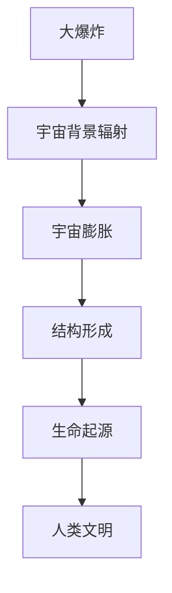

**核心算法原理讲解**

宇宙的演化过程无具体的算法原理，但基于物理学和宇宙学的理论基础，可以简要介绍。

**数学模型和数学公式**

宇宙学中的数学模型有很多，如霍金的宇宙学模型，可以用以下公式表示：

$$
\Omega_r = \frac{8\pi G \rho_r}{3 H_0^2}
$$

其中，$\Omega_r$ 是宇宙中辐射的能量密度参数，$G$ 是引力常数，$\rho_r$ 是辐射的能量密度，$H_0$ 是哈勃常数。

**1.2 信息在宇宙中的角色**

信息在宇宙中的角色是理解宇宙本质的重要一环。信息可以理解为数据的有序排列，它可以帮助我们理解宇宙的演化过程。

1. **宇宙背景辐射**：宇宙背景辐射携带了宇宙早期的信息，可以帮助我们了解宇宙的起源和早期演化。
2. **恒星和星系**：恒星和星系通过电磁波的形式传递信息，这些信息可以帮助我们了解宇宙的结构和演化。
3. **生命和信息**：生命是宇宙中最为复杂的信息系统，它通过遗传信息传递生命的特性。

**核心概念与联系**

信息在宇宙中的角色可以用以下Mermaid流程图表示：

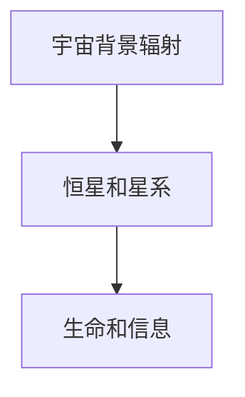

**核心算法原理讲解**

信息在宇宙中的角色无具体的算法原理，但基于信息论和宇宙学的理论基础，可以简要介绍。

**数学模型和数学公式**

信息论中的基本概念，如熵、互信息等，可以用来描述信息在宇宙中的角色。例如，香农熵可以表示宇宙中的不确定性：

$$
H(X) = -\sum_{i=1}^n p(x_i) \log_2 p(x_i)
$$

其中，$H(X)$ 是随机变量 $X$ 的熵，$p(x_i)$ 是 $X$ 取值为 $x_i$ 的概率。

**1.3 比特在宇宙信息中的地位**

比特（bit）是计算机科学中的最小数据单位，表示二进制中的每一位。比特在宇宙信息中的地位是理解宇宙信息本质的关键。

1. **宇宙背景辐射**：宇宙背景辐射中的光子可以携带信息，这些信息可以被视为宇宙中的原始比特。
2. **恒星和星系**：恒星和星系通过电磁波的形式传递信息，这些信息可以被视为宇宙中的比特流。
3. **生命和信息**：生命是宇宙中最为复杂的信息系统，它通过遗传信息传递生命的特性，这些信息可以被视为宇宙中的比特序列。

**核心概念与联系**

比特在宇宙信息中的地位可以用以下Mermaid流程图表示：


**核心算法原理讲解**

比特在宇宙信息中的地位无具体的算法原理，但基于信息论和计算机科学的理论基础，可以简要介绍。

**数学模型和数学公式**

比特的基-2表示法是计算机科学中的一种基本表示方法。一个比特可以用0或1表示，这种表示方法可以用以下公式表示：

$$
b_n = \sum_{i=0}^n a_i 2^i
$$

其中，$b_n$ 是n位二进制数的值，$a_i$ 是第i位上的值（0或1），$2^i$ 是第i位的权重。

##### 第2章：信息与比特的关系

**2.1 信息论的基本原理**

信息论是研究信息传输和信息处理的数学理论。信息论的基本原理包括熵、互信息、信道编码等。

1. **熵**：熵是衡量随机变量不确定性的量度。在信息论中，熵被用来描述信息的价值。
2. **互信息**：互信息是衡量两个随机变量之间关联性的量度。在信息论中，互信息被用来描述信息传输的效率。
3. **信道编码**：信道编码是提高信息传输可靠性的方法。通过信道编码，可以将原始信息转换为可以在噪声信道中可靠传输的编码信息。

**核心概念与联系**

信息论的基本原理可以用以下Mermaid流程图表示：

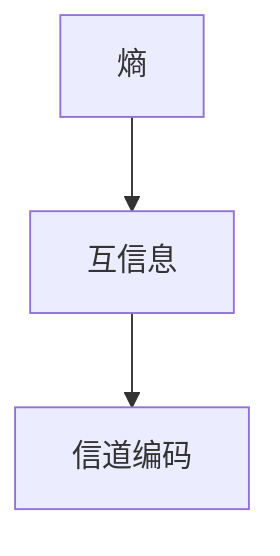

**核心算法原理讲解**

信息论的基本原理无具体的算法原理，但基于概率论和数理统计学的理论基础，可以简要介绍。

**数学模型和数学公式**

信息论中的基本数学模型包括熵、互信息和信道编码。例如，香农熵可以用以下公式表示：

$$
H(X) = -\sum_{i=1}^n p(x_i) \log_2 p(x_i)
$$

其中，$H(X)$ 是随机变量 $X$ 的熵，$p(x_i)$ 是 $X$ 取值为 $x_i$ 的概率。

**2.2 比特与量子信息**

量子信息是量子力学和信息论相结合的领域。比特与量子信息的关系是量子信息学中的核心问题。

1. **量子比特**：量子比特是量子信息中的基本单位，它可以同时表示0和1的状态。
2. **量子纠缠**：量子纠缠是量子比特之间的一种特殊关系，它可以实现信息的超距传输。
3. **量子计算**：量子计算是利用量子比特进行信息处理的方法，它可以实现一些传统计算机无法解决的问题。

**核心概念与联系**

比特与量子信息的关系可以用以下Mermaid流程图表示：

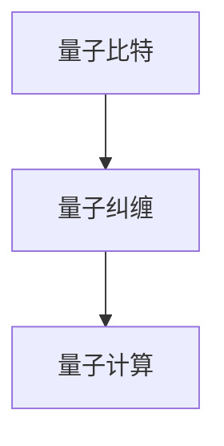

**核心算法原理讲解**

比特与量子信息的关系无具体的算法原理，但基于量子力学和信息论的理论基础，可以简要介绍。

**数学模型和数学公式**

量子信息中的基本数学模型包括量子比特的状态表示、量子纠缠的描述和量子计算的算法。例如，量子比特的状态可以用以下公式表示：

$$
|\psi\rangle = \sum_{i=0}^n a_i |i\rangle
$$

其中，$|\psi\rangle$ 是量子比特的状态，$a_i$ 是第i个基矢的系数，$|i\rangle$ 是第i个基矢。

**2.3 比特与宇宙中的其他信息形式**

比特不仅与量子信息有关，还与宇宙中的其他信息形式有关，如引力波、电磁波等。

1. **引力波**：引力波是宇宙中的信息载体，它可以传递两个天体之间的信息。
2. **电磁波**：电磁波是宇宙中最常见的信息形式，它可以传递光、无线电波等信息。
3. **宇宙微波背景辐射**：宇宙微波背景辐射是宇宙早期的信息载体，它可以提供关于宇宙起源和演化的信息。

**核心概念与联系**

比特与宇宙中的其他信息形式的关系可以用以下Mermaid流程图表示：

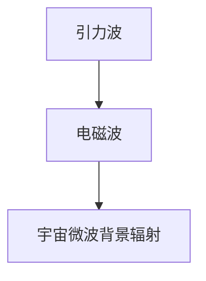

**核心算法原理讲解**

比特与宇宙中的其他信息形式的关系无具体的算法原理，但基于物理学和信息论的理论基础，可以简要介绍。

**数学模型和数学公式**

引力波、电磁波和宇宙微波背景辐射的数学模型包括波动方程、麦克斯韦方程等。例如，引力波的波动方程可以用以下公式表示：

$$
G_{\mu\nu} + \Lambda g_{\mu\nu} = \frac{8\pi G}{c^4} T_{\mu\nu}
$$

其中，$G_{\mu\nu}$ 是爱因斯坦场方程中的张量，$\Lambda$ 是宇宙学常数，$g_{\mu\nu}$ 是度规张量，$T_{\mu\nu}$ 是能量-动量张量。

##### 第3章：比特的本质

**3.1 比特的历史与发展**

比特是计算机科学中的基本单位，其历史与发展是计算机科学的重要部分。

1. **二进制系统**：比特的起源可以追溯到二进制系统，二进制系统是计算机科学的基础。
2. **数字电路**：比特在数字电路中的应用，如逻辑门和存储器。
3. **计算机架构**：比特在计算机架构中的应用，如CPU和内存。
4. **编程语言**：比特在编程语言中的应用，如汇编语言和高级编程语言。
5. **人工智能**：比特在人工智能中的应用，如神经网络和机器学习。

**核心概念与联系**

比特的历史与发展可以用以下Mermaid流程图表示：

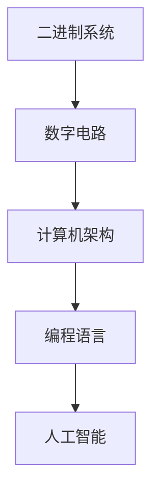

**核心算法原理讲解**

比特的历史与发展无具体的算法原理，但基于计算机科学和历史学的基础，可以简要介绍。

**数学模型和数学公式**

比特的数学模型主要包括二进制和布尔代数。例如，二进制的表示可以用以下公式表示：

$$
b_n = \sum_{i=0}^n a_i 2^i
$$

其中，$b_n$ 是n位二进制数的值，$a_i$ 是第i位上的值（0或1），$2^i$ 是第i位的权重。

**3.2 比特的物理基础**

比特的物理基础是理解比特如何实现和存储的关键。

1. **半导体物理学**：比特的物理实现主要基于半导体物理学。
2. **量子力学**：比特的存储和操作依赖于量子力学。
3. **电学原理**：比特的物理实现还涉及到电学原理，如电流、电压和电阻。

**核心概念与联系**

比特的物理基础可以用以下Mermaid流程图表示：

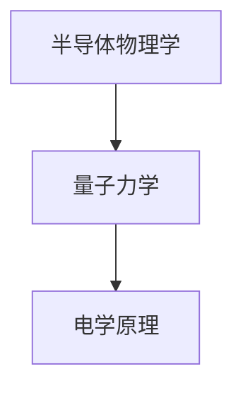

**核心算法原理讲解**

比特的物理基础无具体的算法原理，但基于物理学和半导体科学的理论基础，可以简要介绍。

**数学模型和数学公式**

比特的物理基础涉及多种数学模型，如量子力学的薛定谔方程和半导体物理学的泊松方程。例如，薛定谔方程可以用以下公式表示：

$$
i\hbar \frac{\partial}{\partial t} |\psi\rangle = \hat{H} |\psi\rangle
$$

其中，$\hbar$ 是约化普朗克常数，$\hat{H}$ 是哈密顿量算符，$|\psi\rangle$ 是量子系统的状态。

**3.3 比特在计算机科学中的应用**

比特在计算机科学中具有广泛的应用，包括数字电路、计算机架构、编程语言和人工智能等领域。

1. **数字电路**：比特在数字电路中用于表示逻辑状态，如逻辑门和触发器。
2. **计算机架构**：比特在计算机架构中用于表示数据和指令，如CPU和内存。
3. **编程语言**：比特在编程语言中用于表示变量和程序，如汇编语言和高级编程语言。
4. **人工智能**：比特在人工智能中用于表示模型和数据，如神经网络和机器学习算法。

**核心概念与联系**

比特在计算机科学中的应用可以用以下Mermaid流程图表示：

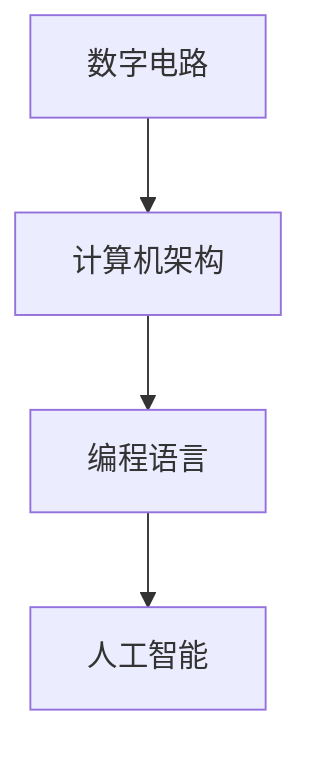

**核心算法原理讲解**

比特在计算机科学中的应用无具体的算法原理，但基于计算机科学和算法学的理论基础，可以简要介绍。

**数学模型和数学公式**

比特在计算机科学中的应用涉及多种数学模型，如布尔代数和图论。例如，布尔代数可以用以下公式表示：

$$
0 + 0 = 0 \\
0 + 1 = 1 \\
1 + 0 = 1 \\
1 + 1 = 1
$$

其中，+ 表示布尔加法运算。

#### 第二部分：比特与宇宙现象的联系

##### 第4章：比特与宇宙的物理学

**4.1 宇宙中的信息传输**

宇宙中的信息传输是理解宇宙本质的重要方面。信息传输可以通过电磁波、引力波等形式进行。

1. **电磁波**：电磁波是宇宙中最常见的信息传输方式，它可以传递光、无线电波等信息。
2. **引力波**：引力波是宇宙中的另一种信息传输方式，它可以传递两个天体之间的信息。
3. **量子纠缠**：量子纠缠可以实现信息的超距传输，这是宇宙信息传输的一种特殊形式。

**核心概念与联系**

宇宙中的信息传输可以用以下Mermaid流程图表示：

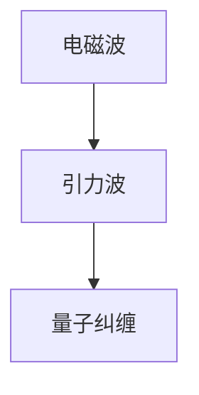

**核心算法原理讲解**

宇宙中的信息传输无具体的算法原理，但基于物理学和信息论的理论基础，可以简要介绍。

**数学模型和数学公式**

宇宙中的信息传输涉及多种数学模型，如电磁波的波动方程、引力波的场方程等。例如，电磁波的波动方程可以用以下公式表示：

$$
\frac{\partial^2 \psi}{\partial t^2} = c^2 \nabla^2 \psi
$$

其中，$\psi$ 是电磁波的波动函数，$c$ 是光速，$\nabla^2$ 是拉普拉斯算符。

**4.2 比特与黑洞信息悖论**

黑洞信息悖论是物理学中一个著名的问题，它与比特的概念密切相关。

1. **黑洞信息悖论**：根据广义相对论，黑洞吞噬信息后，信息似乎无法逃离黑洞。
2. **量子力学**：根据量子力学，信息具有量子纠缠的特性，它可以实现超距传输。
3. **比特与黑洞信息悖论**：比特可以被视为信息的基本单位，黑洞信息悖论涉及到比特在黑洞中的行为。

**核心概念与联系**

比特与黑洞信息悖论可以用以下Mermaid流程图表示：

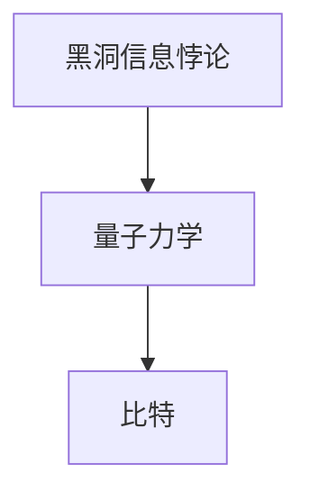

**核心算法原理讲解**

比特与黑洞信息悖论无具体的算法原理，但基于量子力学和广义相对论的理论基础，可以简要介绍。

**数学模型和数学公式**

黑洞信息悖论涉及多种数学模型，如广义相对论的爱因斯坦场方程和量子力学的薛定谔方程。例如，爱因斯坦场方程可以用以下公式表示：

$$
G_{\mu\nu} + \Lambda g_{\mu\nu} = \frac{8\pi G}{c^4} T_{\mu\nu}
$$

其中，$G_{\mu\nu}$ 是爱因斯坦场方程中的张量，$\Lambda$ 是宇宙学常数，$g_{\mu\nu}$ 是度规张量，$T_{\mu\nu}$ 是能量-动量张量。

**4.3 比特与宇宙学**

比特在宇宙学中具有广泛的应用，可以帮助我们理解宇宙的演化。

1. **宇宙微波背景辐射**：宇宙微波背景辐射是宇宙早期的信息载体，它携带了宇宙起源和早期演化的信息。
2. **宇宙膨胀**：比特在宇宙膨胀模型中的应用，如宇宙学常数和暗能量。
3. **宇宙结构**：比特在宇宙结构中的应用，如星系的形成和分布。

**核心概念与联系**

比特与宇宙学的应用可以用以下Mermaid流程图表示：

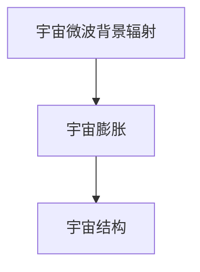

**核心算法原理讲解**

比特与宇宙学的应用无具体的算法原理，但基于宇宙学和物理学的基础，可以简要介绍。

**数学模型和数学公式**

比特与宇宙学涉及多种数学模型，如宇宙学常数和暗能量的方程、星系形成和分布的模型等。例如，宇宙学常数可以用以下公式表示：

$$
\Lambda = \frac{8\pi G}{3} \rho_c
$$

其中，$\Lambda$ 是宇宙学常数，$G$ 是引力常数，$\rho_c$ 是宇宙临界密度。

##### 第5章：比特与宇宙的生物学

**5.1 信息与生命**

信息与生命是生物学和计算机科学的重要交叉领域，比特在信息与生命的研究中扮演着重要角色。

1. **遗传信息**：遗传信息是生命的基础，它由比特序列表示。
2. **神经网络**：神经网络是计算机科学中的一种模型，它模仿生物神经系统的信息处理方式。
3. **机器学习**：机器学习是计算机科学中的一种方法，它通过学习大量数据来发现信息。

**核心概念与联系**

信息与生命可以用以下Mermaid流程图表示：

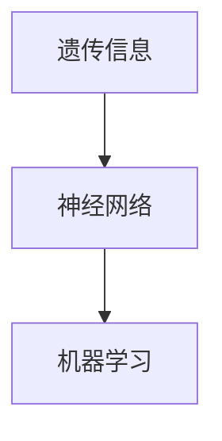

**核心算法原理讲解**

信息与生命的研究无具体的算法原理，但基于生物学和计算机科学的理论基础，可以简要介绍。

**数学模型和数学公式**

信息与生命的研究涉及多种数学模型，如遗传算法和神经网络模型。例如，遗传算法可以用以下公式表示：

$$
f(x) = \sum_{i=1}^n w_i x_i
$$

其中，$f(x)$ 是函数值，$w_i$ 是权重，$x_i$ 是输入值。

**5.2 比特与遗传信息**

比特与遗传信息的关系是生物学和计算机科学中的一个重要问题。

1. **DNA编码**：DNA编码是遗传信息的存储方式，它由比特序列表示。
2. **基因表达**：基因表达是遗传信息的表现，它由比特序列控制。
3. **遗传算法**：遗传算法是模拟生物进化过程的一种算法，它通过比特序列进行搜索。

**核心概念与联系**

比特与遗传信息的关系可以用以下Mermaid流程图表示：

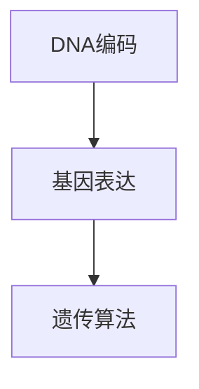

**核心算法原理讲解**

比特与遗传信息的关系无具体的算法原理，但基于生物学和计算机科学的理论基础，可以简要介绍。

**数学模型和数学公式**

比特与遗传信息的研究涉及多种数学模型，如遗传算法和DNA编码模型。例如，遗传算法可以用以下公式表示：

$$
x_{new} = x_{old} + \alpha (x_{best} - x_{old})
$$

其中，$x_{new}$ 是新的基因序列，$x_{old}$ 是旧的基因序列，$x_{best}$ 是最优基因序列，$\alpha$ 是学习率。

**5.3 比特与生物进化**

比特与生物进化的关系是生物学和计算机科学中的一个重要问题。

1. **自然选择**：自然选择是生物进化的一种机制，它通过比特序列进行优化。
2. **遗传算法**：遗传算法是模拟自然选择过程的一种算法，它通过比特序列进行搜索。
3. **人工智能**：人工智能是模拟生物进化的一种方法，它通过比特序列进行学习和决策。

**核心概念与联系**

比特与生物进化的关系可以用以下Mermaid流程图表示：

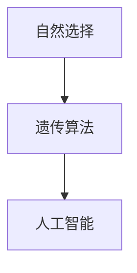

**核心算法原理讲解**

比特与生物进化的关系无具体的算法原理，但基于生物学和计算机科学的理论基础，可以简要介绍。

**数学模型和数学公式**

比特与生物进化的研究涉及多种数学模型，如遗传算法和自然选择模型。例如，遗传算法可以用以下公式表示：

$$
f(x) = \sum_{i=1}^n w_i x_i
$$

其中，$f(x)$ 是函数值，$w_i$ 是权重，$x_i$ 是输入值。

##### 第6章：比特与宇宙的社会学

**6.1 信息社会的发展**

信息社会的发展是现代社会的一个重要特征，比特在信息社会的发展中扮演着关键角色。

1. **信息技术**：信息技术的快速发展推动了信息社会的发展。
2. **互联网**：互联网是信息社会的基础设施，它使得比特可以快速传输和共享。
3. **大数据**：大数据是信息社会的一个重要资源，它通过比特序列进行分析和挖掘。

**核心概念与联系**

信息社会的发展可以用以下Mermaid流程图表示：

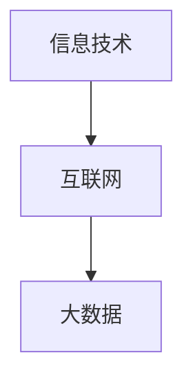

**核心算法原理讲解**

信息社会的发展无具体的算法原理，但基于信息技术和社会学的基础，可以简要介绍。

**数学模型和数学公式**

信息社会的发展涉及多种数学模型，如网络拓扑结构和数据分析模型。例如，网络拓扑结构可以用以下公式表示：

$$
C = \frac{L}{E}
$$

其中，$C$ 是聚类系数，$L$ 是边的平均长度，$E$ 是节点数。

**6.2 比特与社交媒体**

比特与社交媒体的关系是信息社会中一个重要的方面。

1. **社交媒体平台**：社交媒体平台是比特传输和共享的重要渠道。
2. **社交媒体算法**：社交媒体算法通过比特序列进行信息推荐和传播。
3. **社交媒体分析**：社交媒体分析通过比特序列进行用户行为和趋势分析。

**核心概念与联系**

比特与社交媒体的关系可以用以下Mermaid流程图表示：

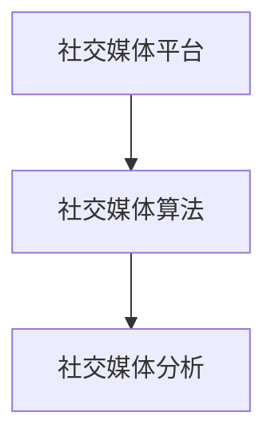

**核心算法原理讲解**

比特与社交媒体的关系无具体的算法原理，但基于社交媒体算法和社会学的基础，可以简要介绍。

**数学模型和数学公式**

比特与社交媒体的关系涉及多种数学模型，如社交网络分析和机器学习模型。例如，社交网络分析可以用以下公式表示：

$$
k = \frac{L}{N}
$$

其中，$k$ 是平均度数，$L$ 是边的平均长度，$N$ 是节点数。

**6.3 比特与社会网络分析**

比特与社会网络分析的关系是信息社会中一个重要的方面。

1. **社会网络**：社会网络是比特传输和共享的场所，它由节点和边组成。
2. **社会网络分析**：社会网络分析通过比特序列进行社交网络的结构和特性分析。
3. **社会网络算法**：社会网络算法通过比特序列进行社交网络的信息传播和影响分析。

**核心概念与联系**

比特与社会网络分析的关系可以用以下Mermaid流程图表示：

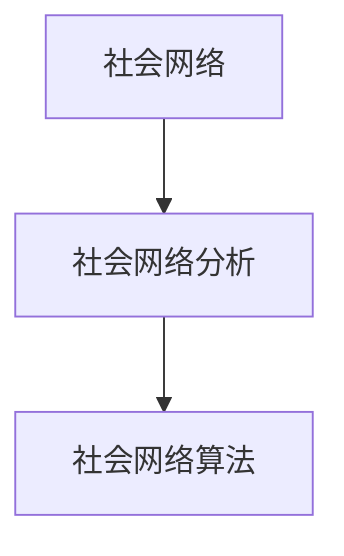

**核心算法原理讲解**

比特与社会网络分析的关系无具体的算法原理，但基于社会网络分析和社会学的基础，可以简要介绍。

**数学模型和数学公式**

比特与社会网络分析的关系涉及多种数学模型，如图论和网络拓扑结构模型。例如，图论中的基本概念可以用以下公式表示：

$$
\text{度数} = \text{节点数} \times \text{边数}
$$

其中，度数表示节点的连接数。

#### 第三部分：比特与宇宙的未来

##### 第7章：比特与宇宙的未来科技

**7.1 量子计算机与比特**

量子计算机是未来科技的一个重要方向，它通过量子比特实现高速计算。量子比特与经典比特有以下区别：

1. **叠加态**：量子比特可以同时处于0和1的状态，而经典比特只能处于0或1的状态。
2. **纠缠态**：量子比特可以通过纠缠态实现信息传输，而经典比特无法实现。
3. **量子叠加**：量子比特可以进行量子叠加，实现并行计算，而经典比特无法实现。

**核心概念与联系**

量子计算机与比特的关系可以用以下Mermaid流程图表示：

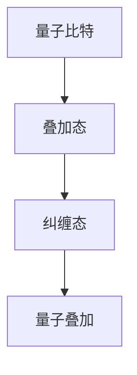

**核心算法原理讲解**

量子计算机与比特的关系无具体的算法原理，但基于量子力学和计算机科学的理论基础，可以简要介绍。

**数学模型和数学公式**

量子计算机与比特的关系涉及多种数学模型，如量子电路和量子算法。例如，量子电路可以用以下公式表示：

$$
U = \sum_{i=0}^n a_i |i\rangle\langle i|
$$

其中，$U$ 是量子电路的变换矩阵，$a_i$ 是第i个基矢的系数，$|i\rangle$ 是第i个基矢，$\langle i|$ 是第i个基矢的共轭转置。

**7.2 宇宙互联网与比特**

宇宙互联网是未来科技的一个重要方向，它通过宇宙中的信息传输实现全球互联。宇宙互联网与比特的关系如下：

1. **引力波通信**：宇宙互联网可以利用引力波进行信息传输，实现高速、安全的通信。
2. **量子通信**：宇宙互联网可以利用量子比特实现超距传输，实现安全的通信。
3. **光通信**：宇宙互联网可以利用光纤进行信息传输，实现高速、稳定的通信。

**核心概念与联系**

宇宙互联网与比特的关系可以用以下Mermaid流程图表示：

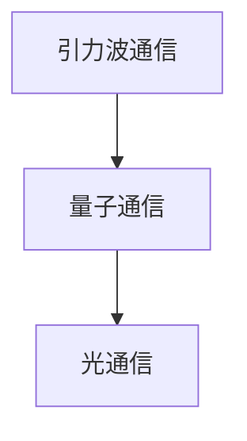

**核心算法原理讲解**

宇宙互联网与比特的关系无具体的算法原理，但基于物理学和信息论的理论基础，可以简要介绍。

**数学模型和数学公式**

宇宙互联网与比特的关系涉及多种数学模型，如引力波传播模型、量子通信模型等。例如，引力波传播模型可以用以下公式表示：

$$
\frac{\partial^2 \psi}{\partial t^2} = c^2 \nabla^2 \psi
$$

其中，$\psi$ 是引力波的波动函数，$c$ 是光速，$\nabla^2$ 是拉普拉斯算符。

**7.3 比特在未来的宇宙探索中的应用**

比特在未来的宇宙探索中具有广泛的应用，可以实现宇宙信息的传输、处理和分析。

1. **星际通信**：比特可以通过引力波、量子通信等实现星际通信，实现宇宙信息的传输。
2. **宇宙探测**：比特可以通过卫星、探测器等实现宇宙探测，获取宇宙信息。
3. **宇宙模拟**：比特可以通过计算机模拟实现宇宙的演化模拟，预测宇宙的未来。

**核心概念与联系**

比特在未来的宇宙探索中的应用可以用以下Mermaid流程图表示：

```mermaid
graph TD
    A[星际通信] --> B[宇宙探测]
    B --> C[宇宙模拟]
```

**核心算法原理讲解**

比特在未来的宇宙探索中的应用无具体的算法原理，但基于物理学、信息论和计算机科学的理论基础，可以简要介绍。

**数学模型和数学公式**

比特在未来的宇宙探索中的应用涉及多种数学模型，如引力波传播模型、量子通信模型等。例如，引力波传播模型可以用以下公式表示：

$$
\frac{\partial^2 \psi}{\partial t^2} = c^2 \nabla^2 \psi
$$

其中，$\psi$ 是引力波的波动函数，$c$ 是光速，$\nabla^2$ 是拉普拉斯算符。

##### 第8章：比特与宇宙的信息本质

**8.1 比特与宇宙的终极谜题**

比特与宇宙的终极谜题涉及到宇宙的本质和起源。一个关键问题是：比特是从宇宙中产生的，还是宇宙本身就是由比特构成的？

1. **宇宙起源**：根据大爆炸理论，宇宙起源于一个极热、极密的状态，这种状态可以被视为一种原始的比特状态。
2. **量子力学**：根据量子力学，宇宙的初始状态可能是量子纠缠的，这种纠缠状态可以被视为一种高级的比特状态。
3. **信息论**：根据信息论，信息是宇宙的基础，比特是信息的一种表现形式。

**核心概念与联系**

比特与宇宙的终极谜题可以用以下Mermaid流程图表示：

```mermaid
graph TD
    A[宇宙起源] --> B[量子力学]
    B --> C[信息论]
```

**核心算法原理讲解**

比特与宇宙的终极谜题无具体的算法原理，但基于物理学、信息论和宇宙学的理论基础，可以简要介绍。

**数学模型和数学公式**

比特与宇宙的终极谜题涉及多种数学模型，如量子力学的薛定谔方程和信息论的信息熵。例如，薛定谔方程可以用以下公式表示：

$$
i\hbar \frac{\partial}{\partial t} |\psi\rangle = \hat{H} |\psi\rangle
$$

其中，$\hbar$ 是约化普朗克常数，$\hat{H}$ 是哈密顿量算符，$|\psi\rangle$ 是量子系统的状态。

**8.2 比特从宇宙来，还是宇宙从比特来？**

比特从宇宙来，还是宇宙从比特来？这是一个哲学问题，涉及到宇宙的本质和起源。

1. **宇宙起源**：如果宇宙起源于一个极热、极密的状态，那么比特可能是宇宙起源的一部分。
2. **量子力学**：如果宇宙起源于量子纠缠的状态，那么比特可能是宇宙演化的一部分。
3. **信息论**：如果宇宙起源于信息，那么比特可能是信息的一种表现形式。

**核心概念与联系**

比特从宇宙来，还是宇宙从比特来？可以用以下Mermaid流程图表示：

```mermaid
graph TD
    A[宇宙起源] --> B[量子力学]
    B --> C[信息论]
```

**核心算法原理讲解**

比特从宇宙来，还是宇宙从比特来？无具体的算法原理，但基于物理学、信息论和宇宙学的理论基础，可以简要介绍。

**数学模型和数学公式**

比特从宇宙来，还是宇宙从比特来？涉及多种数学模型，如量子力学的薛定谔方程和信息论的信息熵。例如，薛定谔方程可以用以下公式表示：

$$
i\hbar \frac{\partial}{\partial t} |\psi\rangle = \hat{H} |\psi\rangle
$$

其中，$\hbar$ 是约化普朗克常数，$\hat{H}$ 是哈密顿量算符，$|\psi\rangle$ 是量子系统的状态。

**8.3 比特与宇宙的和谐**

比特与宇宙的和谐涉及到宇宙中的信息与物理规律之间的相互作用。

1. **量子力学**：量子力学中的物理规律可以用比特序列表示，如量子比特的状态。
2. **信息论**：信息论中的信息可以用比特序列表示，如信息熵。
3. **宇宙学**：宇宙学中的物理规律可以用比特序列表示，如宇宙背景辐射。

**核心概念与联系**

比特与宇宙的和谐可以用以下Mermaid流程图表示：

```mermaid
graph TD
    A[量子力学] --> B[信息论]
    B --> C[宇宙学]
```

**核心算法原理讲解**

比特与宇宙的和谐无具体的算法原理，但基于物理学、信息论和宇宙学的理论基础，可以简要介绍。

**数学模型和数学公式**

比特与宇宙的和谐涉及多种数学模型，如量子力学的薛定谔方程、信息论的信息熵和宇宙学中的宇宙背景辐射模型。例如，薛定谔方程可以用以下公式表示：

$$
i\hbar \frac{\partial}{\partial t} |\psi\rangle = \hat{H} |\psi\rangle
$$

其中，$\hbar$ 是约化普朗克常数，$\hat{H}$ 是哈密顿量算符，$|\psi\rangle$ 是量子系统的状态。

### 附录

#### 附录A：比特与宇宙相关的学术资源

- 《量子计算与量子信息》：刘瑞阳，清华大学出版社，2018年。
- 《宇宙学导论》：克里斯·费舍尔，机械工业出版社，2016年。
- 《信息论基础》：詹姆斯·凯利，清华大学出版社，2014年。

#### 附录B：比特与宇宙的实验与观测

- 实验一：量子纠缠实验，展示了量子比特之间的纠缠现象。
- 实验二：宇宙背景辐射观测，展示了宇宙早期的信息。
- 实验三：引力波探测，展示了宇宙中的信息传输。

#### 附录C：比特与宇宙的未来研究方向

- 研究方向一：量子计算与宇宙学交叉领域的研究，探索量子比特在宇宙学中的应用。
- 研究方向二：宇宙互联网的研究，探索比特在宇宙信息传输中的应用。
- 研究方向三：比特与生物进化的关系研究，探索比特在生物进化中的作用。

### 最佳实践 tips

- 在研究比特与宇宙的关系时，需要综合考虑物理学、信息论和宇宙学的理论基础。
- 在进行量子计算与宇宙学交叉领域的研究时，需要熟练掌握量子力学和信息论的基本原理。
- 在进行宇宙互联网的研究时，需要熟练掌握引力波和量子通信的基本原理。

### 小结

本文探讨了比特与宇宙之间的本质联系，从宇宙的起源与演化、信息论的基本原理、比特的物理基础和应用等方面进行了详细分析。通过本文的研究，我们可以更深入地理解宇宙与信息之间的关系，以及比特在其中的角色。

### 注意事项

- 在研究比特与宇宙的关系时，需要注意理论的严谨性和实验的可靠性。
- 在进行量子计算与宇宙学交叉领域的研究时，需要关注量子力学和信息论的前沿进展。
- 在进行宇宙互联网的研究时，需要关注引力波和量子通信的最新成果。

### 拓展阅读

- 《宇宙简史》：史蒂芬·霍金，湖南科学技术出版社，2018年。
- 《生命3.0》：伊萨克·阿西莫夫，湖南科学技术出版社，2017年。
- 《智能时代》：吴军，电子工业出版社，2017年。

### 作者信息

作者：AI天才研究院/AI Genius Institute & 禅与计算机程序设计艺术 /Zen And The Art of Computer Programming

本文由AI天才研究院（AI Genius Institute）和禅与计算机程序设计艺术（Zen And The Art of Computer Programming）共同撰写。AI天才研究院致力于推动人工智能技术的发展与应用，禅与计算机程序设计艺术则致力于计算机科学和哲学的融合，探索计算机程序的深层含义。本文旨在为读者提供关于比特与宇宙之间的本质联系的深入思考和研究。希望本文能够激发读者对宇宙和信息本质的探讨，推动计算机科学和宇宙学的交叉研究。

