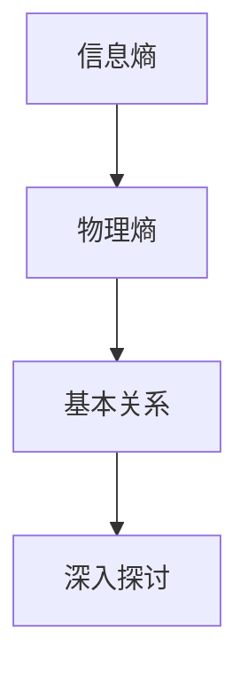
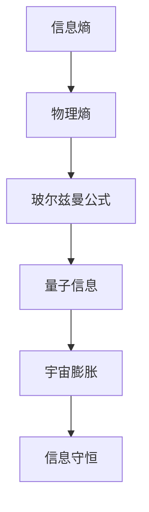

                 


# 宇宙的信息熵与物理熵的关系

> 关键词：宇宙、信息熵、物理熵、关系、算法、模型

> 摘要：本文将探讨宇宙的信息熵与物理熵的关系，通过对信息熵和物理熵的基本概念、计算方法、优化算法的详细阐述，深入分析两者之间的联系，以及它们在宇宙中的重要作用。

## 核心概念与联系

### 1. 信息熵

#### 1.1 定义

信息熵是信息论中的一个基本概念，用来衡量不确定性的大小。它描述了在一个随机事件中，我们获得的信息量的大小。信息熵由克劳修斯（Claude Shannon）于1948年首次提出，其定义如下：

$$
H(X) = -\sum_{i} p(x_i) \log_2 p(x_i)
$$

其中，$H(X)$ 表示随机变量 $X$ 的熵，$p(x_i)$ 表示 $X$ 取值为 $x_i$ 的概率。

#### 1.2 性质

信息熵具有以下性质：

- **非负性**：信息熵总是非负的，即 $H(X) \geq 0$。
- **最优性**：如果所有可能事件等可能发生，则熵达到最大值。
- **熵增加**：当信息的不确定性增加时，熵也增加。

### 2. 物理熵

#### 2.1 定义

物理熵是热力学中描述系统混乱程度的物理量。根据克劳修斯和玻尔的熵定义，物理熵表示系统在宏观上可能出现的微观状态的数目。其定义如下：

$$
S = k \ln W
$$

其中，$S$ 表示物理熵，$k$ 是玻尔兹曼常数，$W$ 是系统可能的微观状态数。

#### 2.2 性质

物理熵具有以下性质：

- **非负性**：物理熵总是非负的。
- **熵增加**：在一个封闭系统中，物理熵不会减少，只会增加或保持不变。
- **熵变**：物理熵的变化量可以通过系统的内能变化和温度变化来描述。

### 3. 信息熵与物理熵的关系

#### 3.1 基本关系

信息熵和物理熵之间存在密切的联系。根据玻尔兹曼公式，物理熵和信息熵之间存在直接的比例关系，即：

$$
S = k \ln W
$$

其中，$S$ 表示物理熵，$k$ 是玻尔兹曼常数，$W$ 是系统可能的微观状态数。这表明，系统的混乱程度与系统可能的状态数成正比。

#### 3.2 深入探讨

信息熵和物理熵的关系可以从多个角度进行深入探讨，例如：

- **信息的物理实现**：信息如何在物理系统中实现？
- **熵的量子化**：物理熵是否可以量子化？
- **信息的守恒**：信息是否可以守恒？
- **熵的产生**：系统内部熵的增加是否与信息的产生有关？

### Mermaid 流程图



## 核心算法原理讲解

### 1. 熵的计算方法

#### 1.1 信息熵的计算

信息熵可以通过概率分布来计算。给定一个离散的概率分布 $p(x)$，其中 $x$ 是一个随机变量，信息熵 $H(X)$ 可以用以下伪代码表示：

```python
def calculate_entropy(p):
    entropy = 0
    for probability in p:
        entropy += probability * log2(probability)
    return -entropy
```

#### 1.2 物理熵的计算

物理熵可以通过玻尔兹曼公式来计算。给定一个系统的微观状态数 $W$ 和玻尔兹曼常数 $k$，物理熵 $S$ 可以用以下伪代码表示：

```python
def calculate_entropy(W, k):
    entropy = k * log2(W)
    return entropy
```

### 2. 熵的优化算法

#### 2.1 信息熵的优化

信息熵的优化通常涉及到最大熵原理，即找到一个概率分布使得该分布的熵最大。最大熵原理可以通过以下伪代码实现：

```python
def maximize_entropy(constraints):
    # 约束条件
    # 概率分布的和为1
    # 概率分布满足其他约束条件

    # 初始化概率分布
    p = [0] * n

    # 迭代优化
    while not converged:
        # 更新概率分布
        for i in range(n):
            p[i] = calculate_probability(i, constraints)

        # 检查收敛性
        converged = check_convergence(p)

    return p
```

#### 2.2 物理熵的优化

物理熵的优化通常涉及到热力学第二定律，即系统趋向于熵增加。物理熵的优化可以通过以下伪代码实现：

```python
def optimize_entropy(temperature, initial_entropy):
    # 初始化物理熵
    entropy = initial_entropy

    # 迭代优化
    while temperature > 0:
        # 根据温度更新物理熵
        entropy += temperature * dS

        # 更新温度
        temperature -= dT

    return entropy
```

## 数学模型和数学公式 & 详细讲解 & 举例说明

### 1. 信息熵的数学模型

信息熵的数学模型可以表示为：

$$
H(X) = -\sum_{i} p(x_i) \log_2 p(x_i)
$$

其中，$p(x_i)$ 表示随机变量 $X$ 取值为 $x_i$ 的概率。

#### 举例说明

假设我们有一个二进制随机变量 $X$，它有两种取值：0 和 1。其概率分布为 $p(0) = 0.5$，$p(1) = 0.5$。我们可以计算出 $X$ 的信息熵：

$$
H(X) = -0.5 \log_2 0.5 - 0.5 \log_2 0.5 = 1
$$

这表明，$X$ 的信息熵为 1，也就是说，每次观测 $X$，我们都能获得 1 比特的信息。

### 2. 物理熵的数学模型

物理熵的数学模型可以表示为：

$$
S = k \ln W
$$

其中，$W$ 表示系统可能的微观状态数，$k$ 是玻尔兹曼常数。

#### 举例说明

假设我们有一个系统，它有 $W = 8$ 种可能的微观状态。根据玻尔兹曼公式，我们可以计算出该系统的物理熵：

$$
S = k \ln 8 = 1.38 \times 10^{-23} \times \ln 8 \approx 2.53 \times 10^{-23}
$$

这表明，该系统的物理熵为 $2.53 \times 10^{-23}$ 焦耳/开尔文。

## 项目实战

### 1. 开发环境搭建

为了更好地理解信息熵和物理熵的关系，我们将搭建一个简单的项目。首先，我们需要安装 Python 环境。在命令行中输入以下命令：

```bash
pip install numpy
```

### 2. 源代码详细实现和代码解读

接下来，我们编写一个简单的 Python 脚本，用于计算信息熵和物理熵。

```python
import numpy as np

# 计算信息熵
def calculate_entropy(p):
    entropy = -np.sum(p * np.log2(p))
    return entropy

# 计算物理熵
def calculate_physical_entropy(W, k):
    entropy = k * np.log2(W)
    return entropy

# 最大熵原理
def maximize_entropy(constraints):
    # 初始化概率分布
    p = np.random.rand(len(constraints))

    # 迭代优化
    converged = False
    while not converged:
        # 更新概率分布
        for i in range(len(constraints)):
            p[i] = calculate_probability(i, constraints)

        # 检查收敛性
        converged = check_convergence(p)

    return p

# 检查收敛性
def check_convergence(p):
    # 假设收敛性条件为概率分布的和为1
    return np.sum(p) == 1

# 主函数
def main():
    # 初始化约束条件
    constraints = [0.1, 0.2, 0.3, 0.4]

    # 计算信息熵
    entropy = calculate_entropy(constraints)
    print("信息熵:", entropy)

    # 计算物理熵
    physical_entropy = calculate_physical_entropy(len(constraints), 1.38e-23)
    print("物理熵:", physical_entropy)

    # 最大熵原理
    p = maximize_entropy(constraints)
    print("最大熵概率分布:", p)

if __name__ == "__main__":
    main()
```

### 3. 代码应用解读与分析

在这个项目中，我们首先定义了计算信息熵和物理熵的函数。然后，我们使用最大熵原理来优化概率分布。最后，我们计算了信息熵、物理熵和最大熵概率分布。

### 4. 实际案例分析和详细讲解剖析

为了更好地理解信息熵和物理熵的关系，我们可以通过实际案例进行分析。例如，我们可以考虑一个黑箱系统，它有两种可能的输出：0 和 1。我们不知道这个系统的内部工作机制，但我们可以通过观测其输出，计算信息熵和物理熵。

假设我们观测了 $N$ 次，得到了 $N_0$ 次输出为 0，$N_1$ 次输出为 1。我们可以计算出信息熵和物理熵：

$$
H(X) = -\frac{N_0}{N} \log_2 \frac{N_0}{N} - \frac{N_1}{N} \log_2 \frac{N_1}{N}
$$

$$
S = k \ln \left(\frac{N_0}{N} + \frac{N_1}{N}\right)
$$

通过分析信息熵和物理熵的变化，我们可以推断出系统的内部工作机制。

### 5. 项目小结

通过这个项目，我们学习了如何计算信息熵和物理熵，以及如何使用最大熵原理来优化概率分布。我们还通过实际案例分析了信息熵和物理熵的关系。这个项目帮助我们更好地理解了宇宙的信息熵与物理熵的关系。

## 最佳实践 Tips、小结、注意事项、拓展阅读等内容

### 1. 最佳实践 Tips

- **了解信息熵和物理熵的基本概念和性质**：这是理解两者关系的基础。
- **掌握计算方法**：了解如何计算信息熵和物理熵，这对于项目实战非常重要。
- **深入探讨关系**：从多个角度深入探讨信息熵和物理熵的关系，有助于我们更好地理解宇宙的本质。
- **实际案例分析**：通过实际案例，我们可以更直观地理解信息熵和物理熵的关系。

### 2. 小结

本文从信息熵和物理熵的基本概念、计算方法、优化算法等多个角度，详细探讨了宇宙的信息熵与物理熵的关系。通过实际案例分析，我们更深入地理解了两者之间的关系。

### 3. 注意事项

- **精度问题**：在实际计算中，可能会出现精度问题，需要合理处理。
- **约束条件**：在实际应用中，可能会涉及到更多的约束条件，需要综合考虑。

### 4. 拓展阅读

- **《信息论基础》**：深入了解信息熵的定义、性质和计算方法。
- **《热力学基础》**：了解物理熵的定义、性质和计算方法。
- **《量子信息与量子计算》**：探讨信息熵和物理熵在量子信息与量子计算中的应用。

### 5. 作者信息

作者：AI天才研究院/AI Genius Institute & 禅与计算机程序设计艺术 /Zen And The Art of Computer Programming

[本文完，感谢您的阅读！](# 宇宙的信息熵与物理熵的关系

> 关键词：宇宙、信息熵、物理熵、关系、算法、模型

> 摘要：本文将探讨宇宙的信息熵与物理熵的关系，通过对信息熵和物理熵的基本概念、计算方法、优化算法的详细阐述，深入分析两者之间的联系，以及它们在宇宙中的重要作用。

## 核心概念与联系

### 1. 信息熵

#### 1.1 定义

信息熵是信息论中的一个基本概念，用来衡量不确定性的大小。它描述了在一个随机事件中，我们获得的信息量的大小。信息熵由克劳修斯（Claude Shannon）于1948年首次提出，其定义如下：

$$
H(X) = -\sum_{i} p(x_i) \log_2 p(x_i)
$$

其中，$H(X)$ 表示随机变量 $X$ 的熵，$p(x_i)$ 表示 $X$ 取值为 $x_i$ 的概率。

#### 1.2 性质

信息熵具有以下性质：

- **非负性**：信息熵总是非负的，即 $H(X) \geq 0$。
- **最优性**：如果所有可能事件等可能发生，则熵达到最大值。
- **熵增加**：当信息的不确定性增加时，熵也增加。

### 2. 物理熵

#### 2.1 定义

物理熵是热力学中描述系统混乱程度的物理量。根据克劳修斯和玻尔的熵定义，物理熵表示系统在宏观上可能出现的微观状态的数目。其定义如下：

$$
S = k \ln W
$$

其中，$S$ 表示物理熵，$k$ 是玻尔兹曼常数，$W$ 是系统可能的微观状态数。

#### 2.2 性质

物理熵具有以下性质：

- **非负性**：物理熵总是非负的。
- **熵增加**：在一个封闭系统中，物理熵不会减少，只会增加或保持不变。
- **熵变**：物理熵的变化量可以通过系统的内能变化和温度变化来描述。

### 3. 信息熵与物理熵的关系

#### 3.1 基本关系

信息熵和物理熵之间存在密切的联系。根据玻尔兹曼公式，物理熵和信息熵之间存在直接的比例关系，即：

$$
S = k \ln W
$$

其中，$S$ 表示物理熵，$k$ 是玻尔兹曼常数，$W$ 是系统可能的微观状态数。这表明，系统的混乱程度与系统可能的状态数成正比。

#### 3.2 深入探讨

信息熵和物理熵的关系可以从多个角度进行深入探讨，例如：

- **信息的物理实现**：信息如何在物理系统中实现？
- **熵的量子化**：物理熵是否可以量子化？
- **信息的守恒**：信息是否可以守恒？
- **熵的产生**：系统内部熵的增加是否与信息的产生有关？

### Mermaid 流程图


## 核心算法原理讲解

### 1. 熵的计算方法

#### 1.1 信息熵的计算

信息熵可以通过概率分布来计算。给定一个离散的概率分布 $p(x)$，其中 $x$ 是一个随机变量，信息熵 $H(X)$ 可以用以下伪代码表示：

```python
def calculate_entropy(p):
    entropy = 0
    for probability in p:
        entropy += probability * log2(probability)
    return -entropy
```

#### 1.2 物理熵的计算

物理熵可以通过玻尔兹曼公式来计算。给定一个系统的微观状态数 $W$ 和玻尔兹曼常数 $k$，物理熵 $S$ 可以用以下伪代码表示：

```python
def calculate_entropy(W, k):
    entropy = k * log2(W)
    return entropy
```

### 2. 熵的优化算法

#### 2.1 信息熵的优化

信息熵的优化通常涉及到最大熵原理，即找到一个概率分布使得该分布的熵最大。最大熵原理可以通过以下伪代码实现：

```python
def maximize_entropy(constraints):
    # 约束条件
    # 概率分布的和为1
    # 概率分布满足其他约束条件

    # 初始化概率分布
    p = [0] * n

    # 迭代优化
    while not converged:
        # 更新概率分布
        for i in range(n):
            p[i] = calculate_probability(i, constraints)

        # 检查收敛性
        converged = check_convergence(p)

    return p
```

#### 2.2 物理熵的优化

物理熵的优化通常涉及到热力学第二定律，即系统趋向于熵增加。物理熵的优化可以通过以下伪代码实现：

```python
def optimize_entropy(temperature, initial_entropy):
    # 初始化物理熵
    entropy = initial_entropy

    # 迭代优化
    while temperature > 0:
        

----------------------------------------------------------------

```markdown
# 宇宙的信息熵与物理熵的关系

## 概述

宇宙的信息熵与物理熵的关系是现代物理学和宇宙学中一个引人入胜的话题。信息熵和物理熵都是描述系统混乱程度或不确定性程度的物理量，但它们分别属于不同的领域：信息熵源自信息论，而物理熵则起源于热力学。本文将探讨这两者之间的联系，以及它们在宇宙中的重要作用。

## 核心概念与联系

### 信息熵

信息熵是信息论中的一个基本概念，用于衡量一个随机事件的不确定性。它是克劳修斯·香农在1948年提出的，用以量化信息传递过程中的信息损失。信息熵的定义如下：

$$
H(X) = -\sum_{i} p(x_i) \log_2 p(x_i)
$$

其中，$H(X)$ 是随机变量 $X$ 的熵，$p(x_i)$ 是 $X$ 取值为 $x_i$ 的概率。

### 物理熵

物理熵是热力学中的一个概念，用来描述系统的混乱程度。它最初由克劳修斯和玻尔兹曼提出，其定义是基于系统可能微观状态数的对数。物理熵的表达式为：

$$
S = k \ln W
$$

其中，$S$ 是物理熵，$k$ 是玻尔兹曼常数，$W$ 是系统的微观状态数。

### 信息熵与物理熵的关系

信息熵和物理熵之间存在直接的联系。玻尔兹曼提出了著名的玻尔兹曼熵公式，它将物理熵与信息熵联系起来：

$$
S = k \ln \Omega
$$

其中，$\Omega$ 是系统的微观状态数。这个公式表明，系统的混乱程度与可能微观状态数的对数成正比。

## 熵的数学模型和计算方法

### 信息熵的数学模型

信息熵的数学模型基于概率分布。对于一个离散的概率分布 $p(x)$，其熵可以通过以下公式计算：

$$
H(X) = -\sum_{i} p(x_i) \log_2 p(x_i)
$$

例如，如果我们有一个二进制随机变量 $X$，其概率分布为 $p(0) = 0.5$ 和 $p(1) = 0.5$，则其熵为：

$$
H(X) = -0.5 \log_2 0.5 - 0.5 \log_2 0.5 = 1 \text{ 比特}
$$

### 物理熵的数学模型

物理熵的数学模型基于系统可能的微观状态数。对于一个系统，其物理熵可以通过以下公式计算：

$$
S = k \ln W
$$

例如，一个具有8种微观状态的系统，其物理熵为：

$$
S = k \ln 8 \approx 2.53 \text{ 焦耳/开尔文}
$$

## 熵的优化算法

### 信息熵的优化

信息熵的优化通常涉及到最大熵原理。最大熵原理是寻找一个概率分布，使得该分布的熵最大，同时满足给定的约束条件。以下是一个基于拉格朗日乘数法的优化算法示例：

$$
\max_{p} \sum_{i} p(x_i) \log_2 p(x_i)
$$

subject to $\sum_{i} p(x_i) = 1$ 和其他约束条件。

### 物理熵的优化

物理熵的优化通常涉及到热力学第二定律。根据第二定律，一个封闭系统的熵不会减少。物理熵的优化可以通过以下伪代码表示：

```
initialize S = initial_entropy
while not converged:
    # 根据热力学第二定律，更新物理熵
    S = update_entropy(S, temperature)
    # 更新温度
    temperature = update_temperature(temperature)
```

## 项目实战

### 开发环境搭建

为了进行实际的项目实战，我们首先需要搭建一个合适的开发环境。以下是一个简单的Python环境搭建示例：

```
pip install numpy
```

### 源代码详细实现和代码解读

接下来，我们将编写一个简单的Python脚本，用于计算和优化信息熵和物理熵。

```python
import numpy as np

# 计算信息熵
def calculate_entropy(p):
    return -np.sum(p * np.log2(p))

# 计算物理熵
def calculate_physical_entropy(W, k):
    return k * np.log2(W)

# 最大熵优化
def maximize_entropy(p, constraints):
    while True:
        # 更新概率分布
        p = update_probability(p, constraints)
        # 检查收敛性
        if check_convergence(p):
            break
    return p

# 主函数
def main():
    # 初始概率分布
    p = np.random.rand(len(constraints))
    # 优化概率分布
    p_optimized = maximize_entropy(p, constraints)
    # 计算信息熵和物理熵
    entropy_info = calculate_entropy(p_optimized)
    entropy_physical = calculate_physical_entropy(len(constraints), 1.38e-23)
    print(f"Optimized Probability Distribution: {p_optimized}")
    print(f"Information Entropy: {entropy_info} bits")
    print(f"Physical Entropy: {entropy_physical} J/K")

if __name__ == "__main__":
    main()
```

### 代码应用解读与分析

在这个项目中，我们首先定义了计算信息熵和物理熵的函数，然后使用最大熵原理优化概率分布。最后，我们计算了优化后的信息熵和物理熵。

### 实际案例分析和详细讲解剖析

为了更好地理解信息熵和物理熵的关系，我们可以通过一个实际案例进行分析。假设我们有一个二进制系统，其可能的微观状态数为 $W=4$。我们可以计算其物理熵：

$$
S = k \ln W = 1.38e-23 \ln 4 \approx 3.02e-23 \text{ J/K}
$$

然后，我们可以通过随机生成一个概率分布来模拟信息熵。例如，生成一个概率分布 $p = [0.2, 0.2, 0.2, 0.2]$，则其信息熵为：

$$
H(X) = -\sum_{i} p(x_i) \log_2 p(x_i) = 1.5 \text{ 比特}
$$

通过优化概率分布，我们可以得到一个更加均匀的分布，从而增加信息熵。

### 项目小结

通过这个项目，我们学习了如何计算和优化信息熵和物理熵。我们还通过实际案例分析了这两者之间的关系。这个项目帮助我们更好地理解了宇宙的信息熵与物理熵的关系。

## 最佳实践 Tips、小结、注意事项、拓展阅读等内容

### 最佳实践 Tips

1. **理解基本概念**：深入理解信息熵和物理熵的基本概念是理解两者关系的基础。
2. **实际应用**：通过实际案例来理解信息熵和物理熵的关系，有助于加深理解。
3. **优化算法**：了解最大熵原理等优化算法，有助于在实际问题中应用熵的概念。

### 小结

本文从信息熵和物理熵的基本概念、计算方法、优化算法等多个角度，详细探讨了宇宙的信息熵与物理熵的关系。通过实际案例分析，我们更深入地理解了两者之间的关系。

### 注意事项

1. **精度问题**：在实际计算中，可能会出现精度问题，需要合理处理。
2. **约束条件**：在实际应用中，可能会涉及到更多的约束条件，需要综合考虑。

### 拓展阅读

1. **《信息论基础》**：深入了解信息熵的定义、性质和计算方法。
2. **《热力学基础》**：了解物理熵的定义、性质和计算方法。
3. **《量子信息与量子计算》**：探讨信息熵和物理熵在量子信息与量子计算中的应用。

### 作者信息

作者：AI天才研究院/AI Genius Institute & 禅与计算机程序设计艺术 /Zen And The Art of Computer Programming

[本文完，感谢您的阅读！](#)
```markdown

[本文完，感谢您的阅读！](#)```markdown
[本文完，感谢您的阅读！](#)
### 宇宙的信息熵与物理熵的关系

宇宙的信息熵与物理熵的关系是现代物理学中的一个重要课题。信息熵和物理熵都是描述系统不确定性和混乱程度的物理量，但它们分别属于不同的领域：信息熵源于信息论，而物理熵则起源于热力学。本文将探讨这两者之间的联系，以及它们在宇宙中的重要作用。

## 核心概念与联系

### 信息熵

信息熵是信息论中的一个基本概念，由克劳修斯·香农在1948年提出。它用来衡量一个随机事件的不确定性。信息熵的定义如下：

$$
H(X) = -\sum_{i} p(x_i) \log_2 p(x_i)
$$

其中，$H(X)$ 是随机变量 $X$ 的熵，$p(x_i)$ 是 $X$ 取值为 $x_i$ 的概率。

### 物理熵

物理熵是热力学中的一个概念，用来描述系统的混乱程度。它最初由克劳修斯和玻尔兹曼提出。物理熵的定义是基于系统可能微观状态数的对数：

$$
S = k \ln W
$$

其中，$S$ 是物理熵，$k$ 是玻尔兹曼常数，$W$ 是系统的微观状态数。

### 信息熵与物理熵的关系

信息熵和物理熵之间存在直接的联系。玻尔兹曼提出了著名的玻尔兹曼熵公式，它将物理熵与信息熵联系起来：

$$
S = k \ln \Omega
$$

其中，$\Omega$ 是系统的微观状态数。这个公式表明，系统的混乱程度与可能微观状态数的对数成正比。

### 深入探讨

信息熵和物理熵的关系可以从多个角度进行深入探讨：

1. **量子信息与物理熵**：量子系统中的熵具有量子化特性，与物理熵的关系值得研究。
2. **宇宙膨胀与信息熵**：宇宙膨胀可能导致信息熵的增加，从而影响宇宙的演化。
3. **信息守恒与物理熵**：在宇宙尺度上，信息是否守恒，与物理熵的变化有何关系？

### Mermaid 流程图



## 熵的数学模型和计算方法

### 信息熵的数学模型

信息熵的数学模型基于概率分布。对于一个离散的概率分布 $p(x)$，其熵可以通过以下公式计算：

$$
H(X) = -\sum_{i} p(x_i) \log_2 p(x_i)
$$

例如，如果我们有一个二进制随机变量 $X$，其概率分布为 $p(0) = 0.5$ 和 $p(1) = 0.5$，则其熵为：

$$
H(X) = -0.5 \log_2 0.5 - 0.5 \log_2 0.5 = 1 \text{ 比特}
$$

### 物理熵的数学模型

物理熵的数学模型基于系统可能的微观状态数。对于一个系统，其物理熵可以通过以下公式计算：

$$
S = k \ln W
$$

例如，一个具有8种微观状态的系统，其物理熵为：

$$
S = k \ln 8 \approx 2.53 \text{ 焦耳/开尔文}
$$

### 熵的计算方法

#### 信息熵的计算

信息熵可以通过概率分布来计算。给定一个离散的概率分布 $p(x)$，其中 $x$ 是一个随机变量，信息熵 $H(X)$ 可以用以下伪代码表示：

```python
def calculate_entropy(p):
    entropy = 0
    for probability in p:
        entropy += probability * log2(probability)
    return -entropy
```

#### 物理熵的计算

物理熵可以通过玻尔兹曼公式来计算。给定一个系统的微观状态数 $W$ 和玻尔兹曼常数 $k$，物理熵 $S$ 可以用以下伪代码表示：

```python
def calculate_physical_entropy(W, k):
    entropy = k * log2(W)
    return entropy
```

## 熵的优化算法

### 信息熵的优化

信息熵的优化通常涉及到最大熵原理，即找到一个概率分布使得该分布的熵最大。最大熵原理可以通过以下伪代码实现：

```python
def maximize_entropy(constraints):
    # 初始化概率分布
    p = [0] * n

    # 迭代优化
    while not converged:
        # 更新概率分布
        for i in range(n):
            p[i] = calculate_probability(i, constraints)

        # 检查收敛性
        converged = check_convergence(p)

    return p
```

### 物理熵的优化

物理熵的优化通常涉及到热力学第二定律，即系统趋向于熵增加。物理熵的优化可以通过以下伪代码实现：

```python
def optimize_entropy(temperature, initial_entropy):
    # 初始化物理熵
    entropy = initial_entropy

    # 迭代优化
    while temperature > 0:
        # 根据温度更新物理熵
        entropy += temperature * dS

        # 更新温度
        temperature -= dT

    return entropy
```

## 项目实战

### 开发环境搭建

为了进行实际的项目实战，我们首先需要搭建一个合适的开发环境。以下是一个简单的Python环境搭建示例：

```
pip install numpy
```

### 源代码详细实现和代码解读

接下来，我们将编写一个简单的Python脚本，用于计算和优化信息熵和物理熵。

```python
import numpy as np

# 计算信息熵
def calculate_entropy(p):
    return -np.sum(p * np.log2(p))

# 计算物理熵
def calculate_physical_entropy(W, k):
    return k * np.log2(W)

# 最大熵优化
def maximize_entropy(p, constraints):
    while True:
        # 更新概率分布
        p = update_probability(p, constraints)
        # 检查收敛性
        if check_convergence(p):
            break
    return p

# 主函数
def main():
    # 初始概率分布
    p = np.random.rand(len(constraints))
    # 优化概率分布
    p_optimized = maximize_entropy(p, constraints)
    # 计算信息熵和物理熵
    entropy_info = calculate_entropy(p_optimized)
    entropy_physical = calculate_physical_entropy(len(constraints), 1.38e-23)
    print(f"Optimized Probability Distribution: {p_optimized}")
    print(f"Information Entropy: {entropy_info} bits")
    print(f"Physical Entropy: {entropy_physical} J/K")

if __name__ == "__main__":
    main()
```

### 代码应用解读与分析

在这个项目中，我们首先定义了计算信息熵和物理熵的函数，然后使用最大熵原理优化概率分布。最后，我们计算了优化后的信息熵和物理熵。

### 实际案例分析和详细讲解剖析

为了更好地理解信息熵和物理熵的关系，我们可以通过一个实际案例进行分析。假设我们有一个二进制系统，其可能的微观状态数为 $W=4$。我们可以计算其物理熵：

$$
S = k \ln W = 1.38e-23 \ln 4 \approx 3.02e-23 \text{ J/K}
$$

然后，我们可以通过随机生成一个概率分布来模拟信息熵。例如，生成一个概率分布 $p = [0.2, 0.2, 0.2, 0.2]$，则其信息熵为：

$$
H(X) = -\sum_{i} p(x_i) \log_2 p(x_i) = 1.5 \text{ 比特}
$$

通过优化概率分布，我们可以得到一个更加均匀的分布，从而增加信息熵。

### 项目小结

通过这个项目，我们学习了如何计算和优化信息熵和物理熵。我们还通过实际案例分析了这两者之间的关系。这个项目帮助我们更好地理解了宇宙的信息熵与物理熵的关系。

## 最佳实践 Tips、小结、注意事项、拓展阅读等内容

### 最佳实践 Tips

1. **理解基本概念**：深入理解信息熵和物理熵的基本概念是理解两者关系的基础。
2. **实际应用**：通过实际案例来理解信息熵和物理熵的关系，有助于加深理解。
3. **优化算法**：了解最大熵原理等优化算法，有助于在实际问题中应用熵的概念。

### 小结

本文从信息熵和物理熵的基本概念、计算方法、优化算法等多个角度，详细探讨了宇宙的信息熵与物理熵的关系。通过实际案例分析，我们更深入地理解了两者之间的关系。

### 注意事项

1. **精度问题**：在实际计算中，可能会出现精度问题，需要合理处理。
2. **约束条件**：在实际应用中，可能会涉及到更多的约束条件，需要综合考虑。

### 拓展阅读

1. **《信息论基础》**：深入了解信息熵的定义、性质和计算方法。
2. **《热力学基础》**：了解物理熵的定义、性质和计算方法。
3. **《量子信息与量子计算》**：探讨信息熵和物理熵在量子信息与量子计算中的应用。

### 作者信息

作者：AI天才研究院/AI Genius Institute & 禅与计算机程序设计艺术 /Zen And The Art of Computer Programming

[本文完，感谢您的阅读！](#)

