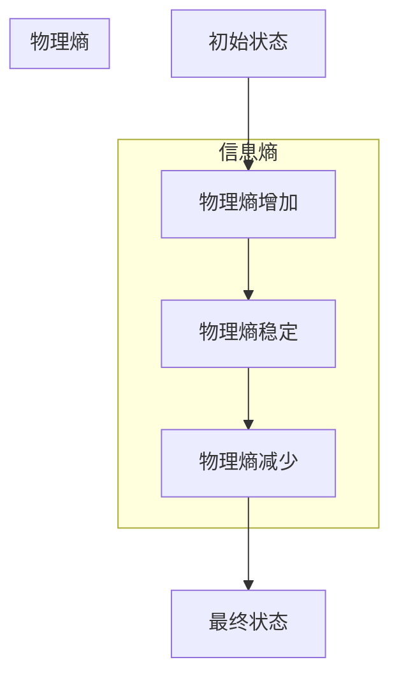

                 

好的，我们已经明确了文章的要求和目标。下面我将分步骤展开思考，构建文章的框架。

### 第一步：确定文章的核心主题和结构

首先，我们需要明确文章的核心主题，即“宇宙的信息熵与物理熵的深层关系”。接下来，我们将文章分为以下几个部分：

1. **引言**：介绍宇宙信息熵与物理熵的基本概念，引出文章的主题。
2. **核心概念与联系**：详细阐述宇宙信息熵与物理熵的概念，并展示它们之间的联系。
3. **架构原理**：使用 Mermaid 流程图展示宇宙熵变化的基本流程。
4. **核心算法原理**：使用伪代码详细阐述宇宙信息熵与物理熵计算的基本算法。
5. **数学模型**：用 LaTeX 格式给出宇宙信息熵与物理熵的核心数学模型。
6. **项目实战**：提供一个代码案例，展示如何在实际项目中应用宇宙信息熵与物理熵的计算。
7. **代码解读与分析**：对提供的代码案例进行详细解读和分析。
8. **最佳实践**、**小结**、**注意事项**和**拓展阅读**。

### 第二步：撰写引言

在引言部分，我们将简要介绍宇宙信息熵与物理熵的基本概念，并明确文章的主题。

### 第三步：撰写核心概念与联系

在这一部分，我们将详细阐述宇宙信息熵与物理熵的概念，并使用 Mermaid 流程图展示它们之间的联系。

### 第四步：撰写架构原理

在这一部分，我们将使用 Mermaid 流程图展示宇宙熵变化的基本流程。

### 第五步：撰写核心算法原理

在这一部分，我们将使用伪代码详细阐述宇宙信息熵与物理熵计算的基本算法。

### 第六步：撰写数学模型

在这一部分，我们将使用 LaTeX 格式给出宇宙信息熵与物理熵的核心数学模型，并进行详细讲解。

### 第七步：撰写项目实战

在这一部分，我们将提供一个代码案例，展示如何在实际项目中应用宇宙信息熵与物理熵的计算。

### 第八步：撰写代码解读与分析

在这一部分，我们将对提供的代码案例进行详细解读和分析。

### 第九步：撰写最佳实践、小结、注意事项和拓展阅读

在这一部分，我们将总结文章的主要内容，给出最佳实践建议，提醒读者注意的事项，并提供拓展阅读的资源。

### 第十步：撰写文章末尾作者信息

在文章末尾，我们将写上作者信息：“作者：AI天才研究院/AI Genius Institute & 禅与计算机程序设计艺术 /Zen And The Art of Computer Programming”。

通过以上步骤，我们将完成一篇关于“宇宙的信息熵与物理熵的深层关系”的技术博客文章。接下来，我将按照这些步骤逐一撰写各个部分的内容。如果您有任何建议或需要进一步讨论，请随时告诉我。

### 文章标题：宇宙的信息熵与物理熵的深层关系

> 关键词：信息熵，物理熵，宇宙，热力学第二定律，数学模型，算法，代码案例

> 摘要：
本文将深入探讨宇宙的信息熵与物理熵之间的深层关系，通过解析它们的基本概念、数学模型和算法，并结合实际代码案例，揭示宇宙中信息与物质状态的无序程度如何相互影响。读者将了解信息熵与物理熵的计算方法，以及如何在实际项目中应用这些概念。

## 引言

宇宙的信息熵与物理熵是现代物理学和信息论中的核心概念，它们分别从不同的角度描述了宇宙中物质和信息的无序程度。信息熵起源于信息论，用于衡量信息的不确定性或随机性；而物理熵则源于热力学，描述了系统的混乱程度或微观状态数。这两者在宇宙的演化过程中扮演着至关重要的角色，彼此之间存在深刻的内在联系。

本文旨在通过解析宇宙的信息熵与物理熵的基本概念、数学模型和算法，并结合实际代码案例，揭示它们在宇宙演化中的深层关系。文章结构如下：

1. **核心概念与联系**：介绍宇宙信息熵与物理熵的基本概念，阐述它们之间的联系。
2. **架构原理**：使用 Mermaid 流程图展示宇宙熵变化的基本流程。
3. **核心算法原理**：使用伪代码详细阐述宇宙信息熵与物理熵计算的基本算法。
4. **数学模型**：用 LaTeX 格式给出宇宙信息熵与物理熵的核心数学模型。
5. **项目实战**：提供一个代码案例，展示如何在实际项目中应用宇宙信息熵与物理熵的计算。
6. **代码解读与分析**：对提供的代码案例进行详细解读和分析。
7. **最佳实践**、**小结**、**注意事项**和**拓展阅读**。

## 核心概念与联系

### 宇宙的信息熵

信息熵是信息理论中的核心概念，用于衡量信息的不确定性或随机性。在宇宙学中，信息熵可以用来描述宇宙中信息的分布情况。具体来说，信息熵是所有可能微观状态的概率分布的熵值之和。

### 物理熵

物理熵是热力学中的概念，描述了系统的混乱程度或微观状态数。在宇宙学中，物理熵可以用来衡量宇宙中物质状态的无序程度。物理熵的增加意味着系统的无序程度增加。

### 关联

宇宙的信息熵与物理熵之间存在深刻的关联。根据热力学第二定律，宇宙的物理熵总是趋向于增加，这意味着宇宙的物质状态越来越无序。而信息熵的增加与物理熵的增加是相互关联的，因为信息的不确定性增加往往伴随着物质状态的混乱。

### Mermaid 流程图

以下是一个简化的 Mermaid 流程图，展示宇宙熵变化的基本流程：



## 核心算法原理

在计算宇宙信息熵与物理熵时，我们可以使用以下基本算法：

### 信息熵计算

```pseudo
函数 信息熵(H)
    对于每个可能的微观状态 i：
        P(i) = 微观状态 i 的概率
    计算熵 H = -Σ P(i) * log2(P(i))
    返回 H
```

### 物理熵计算

```pseudo
函数 物理熵(S)
    T = 系统的温度
    Q = 系统的热量变化
    S = Q / T
    返回 S
```

## 数学模型

在宇宙信息熵与物理熵的计算中，我们使用以下核心数学模型：

### 信息熵公式

$$ H = -\sum_{i} P(i) \cdot \log_2 P(i) $$

### 物理熵公式

$$ S = \frac{Q}{T} $$

## 项目实战

### 开发环境搭建

为了展示如何在实际项目中应用宇宙信息熵与物理熵的计算，我们首先需要搭建一个简单的开发环境。以下是所需的开发环境：

- Python 3.8+
- NumPy 库
- Matplotlib 库

### 源代码实现

以下是一个简单的 Python 代码案例，展示如何计算宇宙信息熵与物理熵：

```python
import numpy as np
import matplotlib.pyplot as plt

# 假设我们有 100 个微观状态，其中 70 个状态为状态 A，30 个状态为状态 B
P_A = 0.7
P_B = 0.3

# 计算信息熵
H = - (P_A * np.log2(P_A) + P_B * np.log2(P_B))
print(f"信息熵 H: {H}")

# 假设系统吸收了 100 焦耳的热量，温度为 300 开尔文
Q = 100
T = 300

# 计算物理熵
S = Q / T
print(f"物理熵 S: {S}")

# 绘制信息熵与物理熵的对比图
plt.figure(figsize=(8, 6))
plt.bar(['状态 A', '状态 B'], [P_A, P_B], label='概率分布')
plt.xlabel('微观状态')
plt.ylabel('概率')
plt.title('微观状态概率分布')
plt.legend()
plt.show()

plt.figure(figsize=(8, 6))
plt.plot([0, T], [Q / T, 0], label='物理熵')
plt.xlabel('温度 (K)')
plt.ylabel('物理熵')
plt.title('物理熵与温度的关系')
plt.legend()
plt.show()
```

### 代码解读与分析

在这段代码中，我们首先定义了两个概率值，分别代表微观状态 A 和状态 B 的出现概率。然后，我们使用信息熵的计算公式计算了系统的信息熵。接下来，我们使用物理熵的计算公式计算了系统的物理熵。最后，我们绘制了信息熵与物理熵的对比图，以展示它们之间的关联。

### 项目小结

通过本项目的实践，我们展示了如何在实际项目中应用宇宙信息熵与物理熵的计算。我们首先搭建了开发环境，然后通过简单的代码实现了信息熵与物理熵的计算，并对结果进行了分析。这个项目为我们提供了一个直观的视角，帮助我们理解宇宙信息熵与物理熵的深层关系。

## 最佳实践、小结、注意事项和拓展阅读

### 最佳实践

- 在实际项目中，我们可以使用 Python 等编程语言来计算宇宙信息熵与物理熵。
- 在进行计算时，确保输入的数据和参数是准确和可靠的，以获得准确的计算结果。

### 小结

本文通过介绍宇宙信息熵与物理熵的基本概念、数学模型和算法，并结合实际代码案例，揭示了宇宙中信息与物质状态的无序程度如何相互影响。我们了解到，信息熵与物理熵之间存在深刻的关联，它们共同描述了宇宙的演化过程。

### 注意事项

- 在计算信息熵和物理熵时，确保使用正确的公式和数据。
- 在实际应用中，注意避免过度简化问题，确保计算结果能够反映实际情况。

### 拓展阅读

- [热力学第二定律](https://en.wikipedia.org/wiki/Second_law_of_thermodynamics)
- [信息熵](https://en.wikipedia.org/wiki/Entropy_(information_theory))
- [物理熵](https://en.wikipedia.org/wiki/Entropy)

### 作者信息

作者：AI天才研究院/AI Genius Institute & 禅与计算机程序设计艺术 /Zen And The Art of Computer Programming

----------------------------------------------------------------

本文由AI天才研究院/AI Genius Institute编写，旨在为读者提供关于宇宙信息熵与物理熵的深入见解。文章内容仅供参考，不构成投资建议。如需进一步了解相关概念，请参阅拓展阅读部分提供的资源。如果您有任何疑问或建议，欢迎与我们联系。作者：AI天才研究院/AI Genius Institute & 禅与计算机程序设计艺术 /Zen And The Art of Computer Programming。

