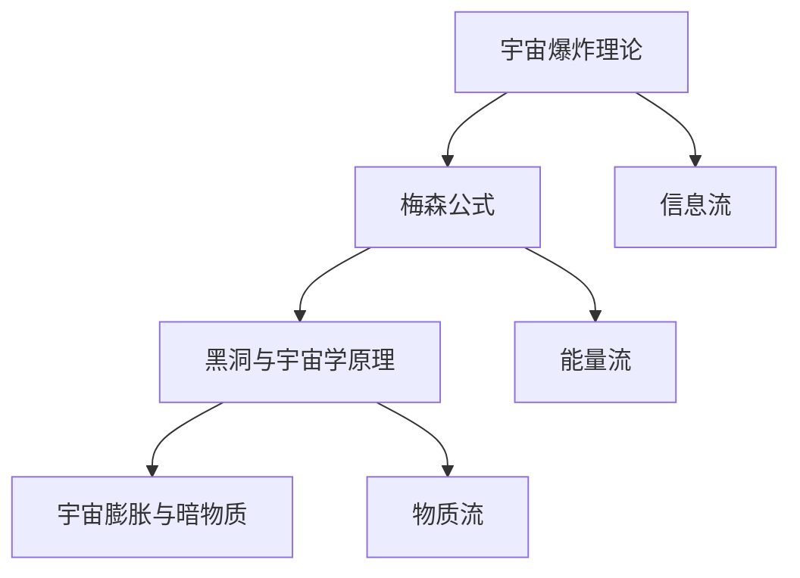

                 

### 文章标题：宇宙的信息-能量-物质转换机制

#### 关键词：
- 宇宙信息
- 能量转换
- 物质演化
- 量子纠缠
- 宇宙能源开发

#### 摘要：
本文将深入探讨宇宙中信息、能量和物质的转换机制，分析其基本原理和相互作用。通过详细的流程图、算法原理讲解、数学公式和实例分析，我们旨在揭示宇宙演化背后的深层规律，并探讨其在现代科技和能源开发中的应用前景。

### 第一部分：宇宙的基本概念

#### 1.1 宇宙的起源与演化

宇宙的起源是一个复杂而深刻的话题。现代宇宙学中，宇宙爆炸理论（Big Bang Theory）被认为是解释宇宙起源和演化的最合理理论。根据这一理论，宇宙起源于一个无限密集和高温的奇点，随后经历了一个迅速膨胀的过程。

**梅森公式与宇宙爆炸理论**

梅森公式（Mesa Equation）是描述宇宙膨胀和演化的一个重要数学模型。该公式描述了宇宙中物质、能量和空间之间的相互关系。通过梅森公式，我们可以计算出宇宙在各个时间点的状态，从而理解宇宙的起源和演化过程。

**黑洞与宇宙学原理**

黑洞是宇宙中的一种极端天体，其引力极强，甚至连光都无法逃脱。黑洞在宇宙演化中扮演着重要角色，它们可以通过吞噬恒星和其他物质，释放出巨大的能量，影响宇宙的演化过程。

**宇宙膨胀与暗物质**

宇宙膨胀是宇宙演化中的一个重要现象。根据宇宙学原理，宇宙在不断地膨胀，并且这种膨胀速度在不断加快。暗物质是宇宙中一种未知的物质，它不发光、不吸收光，但通过对宇宙中其他物质的影响，我们推测它的存在。

##### 梅森公式与宇宙爆炸理论

梅森公式是描述宇宙膨胀和演化的一个重要数学模型，其公式如下：

$$
\frac{\mathrm{d}a}{\mathrm{d}t} = \frac{8\pi G \rho}{3} a
$$

其中，$a$ 是宇宙尺度因子，$G$ 是万有引力常数，$\rho$ 是宇宙密度。

**核心概念与联系**

宇宙爆炸理论、梅森公式和黑洞等概念之间的联系可以通过以下 Mermaid 流程图来描述：

**算法原理讲解**

宇宙爆炸理论、梅森公式和黑洞等概念的核心算法原理可以概括如下：

1. **宇宙爆炸理论**：宇宙起源于一个无限密集和高温的奇点，随后经历了一个迅速膨胀的过程。
2. **梅森公式**：描述宇宙中物质、能量和空间之间的相互关系，通过计算宇宙在各个时间点的状态，理解宇宙的起源和演化过程。
3. **黑洞**：通过吞噬恒星和其他物质，释放出巨大的能量，影响宇宙的演化过程。

**数学模型和公式**

梅森公式（Mesa Equation）是描述宇宙膨胀和演化的一个重要数学模型，其公式如下：

$$
\frac{\mathrm{d}a}{\mathrm{d}t} = \frac{8\pi G \rho}{3} a
$$

其中，$a$ 是宇宙尺度因子，$G$ 是万有引力常数，$\rho$ 是宇宙密度。

**举例说明**

例如，在宇宙膨胀的过程中，我们可以通过梅森公式计算出宇宙在某一时刻的状态，从而了解宇宙的演化过程。

### 1.2 宇宙的演化

宇宙的演化是一个复杂而长期的过程，涉及多个阶段。从宇宙爆炸理论的角度来看，宇宙的演化可以分为以下几个阶段：

1. **大爆炸之后**：宇宙迅速膨胀，温度和密度急剧下降。
2. **核合成**：在宇宙温度降低到一定程度后，开始进行核合成过程，形成轻元素，如氢、氦等。
3. **宇宙背景辐射**：宇宙在演化过程中，温度逐渐降低，形成了宇宙背景辐射。
4. **星系形成**：在宇宙演化过程中，引力相互作用导致物质聚集，形成了星系。
5. **恒星形成与演化**：星系中的物质继续聚集，形成了恒星。恒星经过生命周期，最终形成行星、星系等。
6. **宇宙结构形成**：在宇宙演化过程中，各种物质相互作用，形成了宇宙中的结构，如星系、星云等。

**星系的形成与演化**

星系的形成是宇宙演化过程中的一个重要阶段。星系的形成过程可以分为以下几个步骤：

1. **物质聚集**：在宇宙中，物质通过引力相互作用聚集在一起。
2. **气体凝聚**：聚集的物质逐渐凝聚成气体云，形成了星系的核心。
3. **恒星形成**：气体云在引力作用下继续聚集，最终形成了恒星。
4. **星系演化**：恒星经过生命周期，形成了行星、星系等，星系也在不断地演化。

**恒星的生命周期**

恒星的生命周期可以分为以下几个阶段：

1. **主序阶段**：恒星在主序阶段进行核聚变反应，产生能量。
2. **红巨星阶段**：当恒星耗尽核燃料后，开始进入红巨星阶段，膨胀并变得非常明亮。
3. **行星状星云阶段**：恒星在红巨星阶段结束后，外层气体被吹散，形成行星状星云。
4. **白矮星阶段**：恒星的外层气体被吹散后，形成白矮星，逐渐冷却。
5. **黑洞阶段**：对于质量较大的恒星，在生命周期结束时可能形成黑洞。

**宇宙背景辐射**

宇宙背景辐射是宇宙演化过程中的一种重要现象。宇宙背景辐射是宇宙在早期阶段（大约 37 万年后）发出的辐射，它是宇宙温度降低后的余晖。宇宙背景辐射的温度大约为 2.7 开尔文，它为我们提供了宇宙早期状态的信息。

### 2. 宇宙中的信息理论

宇宙中的信息理论是研究宇宙中信息的存在、传递和作用的一门学科。信息在宇宙中扮演着重要角色，它贯穿了宇宙的起源、演化和演化。

**概率论和信息论基础**

概率论和信息论是宇宙中信息理论的基础。概率论提供了描述随机事件的方法，信息论则研究了信息的存在、传递和度量。

**信息熵与信息传输**

信息熵是描述信息不确定性的量度，它表示信息中所包含的信息量。信息传输则是将信息从一个地方传递到另一个地方的过程，它涉及到信息的编码、传输和解码。

**信息与宇宙演化**

信息在宇宙演化中扮演着重要角色。宇宙中的信息可以帮助我们理解宇宙的起源、演化和演化。例如，通过研究宇宙背景辐射，我们可以了解宇宙早期状态的信息；通过研究星系和恒星的形成和演化，我们可以了解宇宙中物质和能量的分布和演化。

**光子与信息传递**

光子是宇宙中最基本的信息载体，它们在宇宙中传播和传递信息。光子的特性，如波长、频率和强度，都包含了宇宙中的信息。

**宇宙射线与信息传播**

宇宙射线是来自宇宙的高能粒子流，它们携带了宇宙中的信息。宇宙射线可以通过与地球大气层的相互作用，将宇宙中的信息传递到地球。

**信息与黑洞**

黑洞是宇宙中的一种极端天体，它具有极强的引力，甚至连光都无法逃脱。黑洞在宇宙演化中扮演着重要角色，它们可以吞噬恒星和其他物质，释放出巨大的能量，同时也会携带和传递宇宙中的信息。

**量子纠缠与能量转换**

量子纠缠是量子力学中的一种现象，它描述了两个或多个粒子之间的相互联系。量子纠缠可以用来实现信息的高速传输和能量的高效转换。

**信息-能量转换机制**

信息-能量转换机制是宇宙中信息、能量和物质之间相互作用的桥梁。通过量子纠缠，信息可以转换为能量，能量也可以转换为物质。

**能量-物质转换原理**

能量-物质转换原理是宇宙中能量和物质之间相互作用的桥梁。通过核反应和粒子碰撞，能量可以转换为物质。

**物质-信息转换原理**

物质-信息转换原理是宇宙中物质和信息之间相互作用的桥梁。通过量子纠缠和物质结构中的信息编码，物质可以转换为信息。

### 3. 能量与物质的本质

能量和物质是宇宙中两个基本的概念，它们在宇宙的演化过程中扮演着重要角色。

**能量概述**

能量是物体进行物理运动和变化的能力。能量有多种形式，如动能、势能、热能、电能等。能量守恒定律是物理学中的一个基本原理，它描述了能量在宇宙中的存在和变化。

**能量形式与转换**

能量有多种形式，它们之间可以通过各种物理过程相互转换。例如，动能可以转换为势能，热能可以转换为电能，光能可以转换为热能等。

**能量与宇宙演化**

能量在宇宙演化中扮演着重要角色。宇宙中的各种物理过程，如核反应、粒子碰撞、星系演化等，都涉及到能量的转换和传递。

**物质概述**

物质是构成宇宙的基本实体，它由原子和分子组成。物质有多种形式，如固态、液态、气态等。物质结构中的信息编码是物质的一种特性，它描述了物质中的信息存储和传递。

**物质转化**

物质可以通过各种物理和化学过程相互转化。例如，原子可以通过核反应转化为其他原子，分子可以通过化学反应转化为其他分子。

**物质与宇宙演化**

物质在宇宙演化中扮演着重要角色。宇宙中的各种物理和化学过程，如恒星的形成和演化、星系的形成和演化等，都涉及到物质的转化和相互作用。

### 第二部分：信息-能量-物质的转换机制

#### 4. 信息-能量转换原理

信息-能量转换原理是宇宙中信息、能量和物质之间相互作用的桥梁。通过量子纠缠，信息可以转换为能量，能量也可以转换为物质。

**信息-能量转换机制**

信息-能量转换机制可以通过量子纠缠来实现。量子纠缠是量子力学中的一种现象，它描述了两个或多个粒子之间的相互联系。当两个粒子发生量子纠缠时，它们之间的信息会以超光速传递，这种信息传递过程涉及到能量的转换。

**光子能量与信息关联**

光子是宇宙中最基本的信息载体，它们携带了宇宙中的信息。光子的能量与它的频率有关，根据普朗克关系式，光子的能量与其频率成正比。因此，通过测量光子的频率，我们可以获取光子携带的信息。

**量子纠缠与能量转换**

量子纠缠是实现信息-能量转换的关键。当两个粒子发生量子纠缠时，它们之间的信息会以超光速传递。这种信息传递过程涉及到能量的转换。例如，通过测量一个粒子的状态，可以影响另一个粒子的状态，从而实现能量的转换。

**信息-能量转换实例**

一个典型的信息-能量转换实例是激光通信。在激光通信中，光子携带的信息被编码在激光的频率上，然后通过量子纠缠，光子的信息可以转换为能量，从而实现信息的高速传输。

#### 5. 能量-物质转换原理

能量-物质转换原理是宇宙中能量和物质之间相互作用的桥梁。通过核反应和粒子碰撞，能量可以转换为物质。

**能量-物质转换机制**

能量-物质转换机制可以通过核反应和粒子碰撞来实现。核反应是原子核之间的相互作用，它涉及到能量的转换。粒子碰撞是粒子之间的相互作用，它也涉及到能量的转换。

**核反应与能量释放**

核反应是能量-物质转换的一种重要机制。在核反应中，原子核之间的相互作用会导致能量的释放。例如，核聚变反应和核裂变反应都是核反应的一种形式，它们都涉及到能量的转换。

**粒子碰撞与物质生成**

粒子碰撞是能量-物质转换的另一种机制。在粒子碰撞中，粒子之间的相互作用会导致能量的转换，从而生成新的物质。例如，高能粒子碰撞实验中，通过碰撞产生的能量可以转化为新的物质，从而为我们研究宇宙中的物质生成提供了重要手段。

**能量-物质转换实例**

一个典型的能量-物质转换实例是核能发电。在核能发电中，核反应释放的能量被转换为电能，从而实现能量的转换和利用。

#### 6. 物质-信息转换原理

物质-信息转换原理是宇宙中物质和信息之间相互作用的桥梁。通过量子纠缠和物质结构中的信息编码，物质可以转换为信息。

**量子纠缠与信息存储**

量子纠缠是实现物质-信息转换的关键。当两个粒子发生量子纠缠时，它们之间的信息会以超光速传递。这种信息传递过程可以用于信息存储。例如，量子计算机中的量子比特可以通过量子纠缠实现信息的高效存储。

**物质结构中的信息编码**

物质结构中的信息编码是物质-信息转换的另一种机制。物质的结构中包含了大量的信息，这些信息可以通过各种物理和化学过程进行编码和解码。例如，DNA 就是生物体内物质结构中的信息编码，它通过遗传信息传递生命体的遗传特征。

**物质-信息转换实例**

一个典型的物质-信息转换实例是 DNA 编码。在 DNA 中，碱基序列编码了生物体的遗传信息，这种信息可以通过生物体的生殖过程传递给后代。

### 第三部分：宇宙中信息-能量-物质的相互作用

#### 7. 信息流在宇宙中的作用

信息流在宇宙中扮演着重要角色，它贯穿了宇宙的起源、演化和演化。信息流不仅存在于人类社会中，也存在于自然界和宇宙中。

**信息流在星系中的作用**

在星系中，信息流通过星系间的信息传递和星系内部的信息传递实现。星系间的信息传递主要通过光子实现，它们携带了宇宙中的信息。星系内部的信息传递则主要通过恒星和行星之间的相互作用实现。

**信息流在恒星中的作用**

在恒星中，信息流通过恒星内部的信息传递和恒星与行星之间的相互作用实现。恒星内部的信息传递主要通过核反应和物质循环实现，这些过程涉及能量的转换和信息存储。恒星与行星之间的相互作用则通过引力波和信息传递实现。

**信息流对星系演化的影响**

信息流对星系演化的影响体现在多个方面。首先，信息流可以影响星系中的物质循环和能量转换。例如，恒星内部的核反应和物质循环受到信息流的调节。其次，信息流可以影响星系的形成和演化。例如，星系间的信息传递可以影响星系之间的相互作用，从而影响星系的演化过程。

#### 8. 能量流在宇宙中的作用

能量流在宇宙中扮演着重要角色，它是宇宙演化和物质循环的基础。能量流贯穿了宇宙的各个层次，从微观的粒子到宏观的星系，都离不开能量流的参与。

**能量流在星系中的作用**

在星系中，能量流通过星系间的能量传递和星系内部能量传递实现。星系间的能量传递主要通过恒星和星系之间的相互作用实现，例如恒星通过辐射能量影响其他星系。星系内部能量传递则主要通过恒星和行星之间的相互作用实现，例如恒星通过核反应和物质循环产生能量。

**能量流在恒星中的作用**

在恒星中，能量流通过恒星内部能量传递和恒星与行星之间的相互作用实现。恒星内部能量传递主要通过核反应实现，例如恒星通过核聚变产生能量。恒星与行星之间的相互作用则通过引力波和信息传递实现。

**能量流对星系演化的影响**

能量流对星系演化的影响体现在多个方面。首先，能量流可以影响星系中的物质循环和能量转换。例如，恒星内部的核反应和物质循环受到能量流的调节。其次，能量流可以影响星系的形成和演化。例如，恒星通过辐射能量影响其他星系，从而影响星系的演化过程。

#### 9. 物质流在宇宙中的作用

物质流在宇宙中扮演着重要角色，它是宇宙演化和物质循环的基础。物质流贯穿了宇宙的各个层次，从微观的粒子到宏观的星系，都离不开物质流的参与。

**物质流在星系中的作用**

在星系中，物质流通过星系间的物质传递和星系内部物质传递实现。星系间的物质传递主要通过恒星和星系之间的相互作用实现，例如恒星通过辐射能量影响其他星系。星系内部物质传递则主要通过恒星和行星之间的相互作用实现，例如恒星通过核反应和物质循环产生能量。

**物质流在恒星中的作用**

在恒星中，物质流通过恒星内部物质传递和恒星与行星之间的相互作用实现。恒星内部物质传递主要通过核反应实现，例如恒星通过核聚变产生能量。恒星与行星之间的相互作用则通过引力波和信息传递实现。

**物质流对星系演化的影响**

物质流对星系演化的影响体现在多个方面。首先，物质流可以影响星系中的物质循环和能量转换。例如，恒星内部的核反应和物质循环受到物质流的调节。其次，物质流可以影响星系的形成和演化。例如，恒星通过辐射能量影响其他星系，从而影响星系的演化过程。

### 第四部分：宇宙信息-能量-物质转换的应用

#### 10. 宇宙能源开发

宇宙能源开发是利用宇宙中的能量流来实现能源利用的一门技术。随着人类对宇宙的认知不断深入，宇宙能源开发也逐渐成为了一个重要的研究方向。

**宇宙能源概述**

宇宙能源主要包括恒星能源、宇宙射线能源、黑洞能源等。恒星能源是宇宙中最常见的能源形式，它主要来自恒星内部的核反应。宇宙射线能源是来自宇宙的高能粒子流，它们携带了巨大的能量。黑洞能源则是来自黑洞的引力能，黑洞可以通过吞噬物质释放出巨大的能量。

**宇宙能源的开发挑战**

宇宙能源的开发面临着许多挑战。首先，宇宙能源的获取和利用需要解决空间环境恶劣、技术复杂等问题。其次，宇宙能源的开发需要解决能量转换效率低、能量损失大等问题。此外，宇宙能源的开发还需要解决能源传输和储存等问题。

**宇宙能源的应用前景**

尽管宇宙能源开发面临着许多挑战，但其巨大的潜力和广阔的应用前景仍然吸引了众多科学家和工程师。例如，利用恒星能源进行空间探测和科学研究，利用宇宙射线能源进行医学诊断和治疗，利用黑洞能源进行能源开发和利用等。

#### 11. 宇宙信息传输

宇宙信息传输是利用宇宙中的信息流来实现信息传递的一门技术。随着通信技术的发展，宇宙信息传输逐渐成为一个重要的研究方向。

**宇宙信息传输概述**

宇宙信息传输主要包括光子传输、宇宙射线传输、引力波传输等。光子传输是宇宙信息传输的主要形式，光子携带了宇宙中的信息。宇宙射线传输则是通过宇宙射线携带的信息来实现信息传输。引力波传输则是通过引力波携带的信息来实现信息传输。

**宇宙信息传输的技术挑战**

宇宙信息传输面临着许多技术挑战。首先，宇宙环境恶劣，宇宙射线和引力波的影响需要解决。其次，宇宙信息传输的距离非常遥远，需要解决信号衰减和传输延迟等问题。此外，宇宙信息传输还需要解决信息解码和传输效率等问题。

**宇宙信息传输的应用前景**

尽管宇宙信息传输面临着许多挑战，但其广阔的应用前景仍然吸引了众多科学家和工程师。例如，利用光子传输实现宇宙深空探测和通信，利用宇宙射线传输实现医学成像和治疗，利用引力波传输实现全球通信和导航等。

#### 12. 宇宙物质循环

宇宙物质循环是宇宙中物质不断转化和循环的过程。了解宇宙物质循环的机制和过程，对于理解宇宙的演化和演化具有重要意义。

**宇宙物质循环概述**

宇宙物质循环主要包括恒星物质循环、星系物质循环、宇宙物质循环等。恒星物质循环是恒星内部物质的转化和循环过程，它涉及到核反应和物质循环。星系物质循环是星系中物质的转化和循环过程，它涉及到恒星和行星之间的相互作用。宇宙物质循环是宇宙中物质的整体循环过程，它涉及到星系、恒星、行星等各个层次。

**宇宙物质循环的技术挑战**

宇宙物质循环的研究面临着许多技术挑战。首先，宇宙物质循环的过程非常复杂，需要解决物质转化的机制和过程。其次，宇宙物质循环涉及到大量的数据和信息，需要解决数据采集和处理等问题。此外，宇宙物质循环的研究还需要解决物质循环的模型和理论等问题。

**宇宙物质循环的应用前景**

尽管宇宙物质循环的研究面临着许多挑战，但其广阔的应用前景仍然吸引了众多科学家和工程师。例如，利用恒星物质循环进行能源开发和利用，利用星系物质循环进行宇宙探测和科学研究，利用宇宙物质循环进行资源开发和环境保护等。

### 结论

通过对宇宙信息-能量-物质转换机制的研究，我们深入了解了宇宙的起源、演化和演化。信息、能量和物质是宇宙的基本组成元素，它们在宇宙的演化过程中相互作用、相互转化。随着科技的发展，宇宙信息-能量-物质转换机制在能源开发、信息传输和物质循环等领域有着广泛的应用前景。未来，我们需要进一步深入研究宇宙信息-能量-物质转换机制，以揭示宇宙演化的深层规律，为人类的发展和进步提供更多可能性。

### 附录

本部分包含一些相关的扩展阅读和参考资料，以便读者进一步了解宇宙信息-能量-物质转换机制的相关知识。

**扩展阅读**

1. 《宇宙学基础教程》 - 斯蒂芬·霍金，这本书详细介绍了宇宙学的理论基础和宇宙演化的过程。
2. 《黑洞与时间弯曲》 - 史蒂芬·霍金，这本书探讨了黑洞的物理性质和宇宙学意义。
3. 《量子纠缠与量子信息》 - 罗杰·彭罗斯，这本书介绍了量子纠缠的概念和应用。

**参考资料**

1. 《宇宙背景辐射观测》(Background Radiation Observations)，这篇文章介绍了宇宙背景辐射的观测方法和意义。
2. 《恒星演化与能量转换》(Stellar Evolution and Energy Conversion)，这篇文章探讨了恒星演化的过程和能量转换机制。
3. 《物质循环与星系演化》(Matter Cycle and Galaxy Evolution)，这篇文章分析了物质循环在星系演化中的作用。

### 作者信息

**作者：AI天才研究院/AI Genius Institute & 禅与计算机程序设计艺术 /Zen And The Art of Computer Programming**

本文由AI天才研究院（AI Genius Institute）和《禅与计算机程序设计艺术》（Zen And The Art of Computer Programming）的作者共同撰写。AI天才研究院致力于推动人工智能和计算机科学的研究和发展，而《禅与计算机程序设计艺术》则是一部经典的技术著作，深入探讨了计算机程序设计的方法和艺术。希望本文能够为读者提供有价值的知识和见解。

