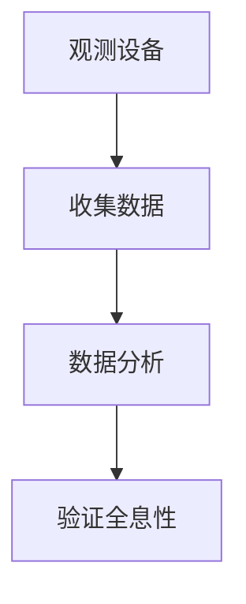
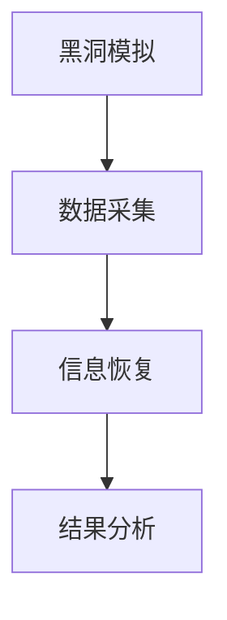
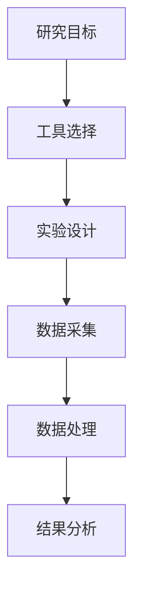
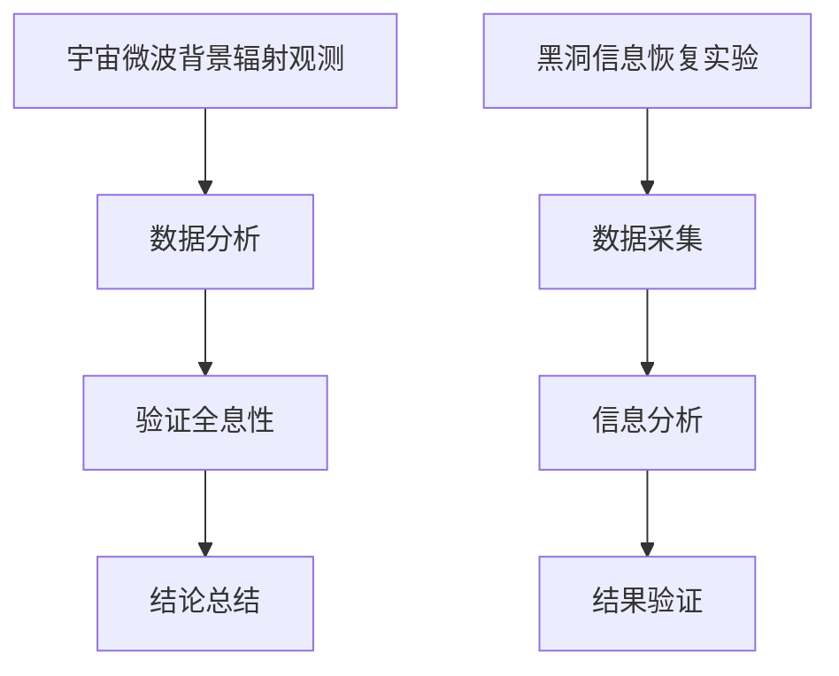
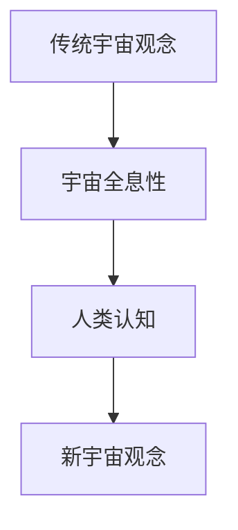
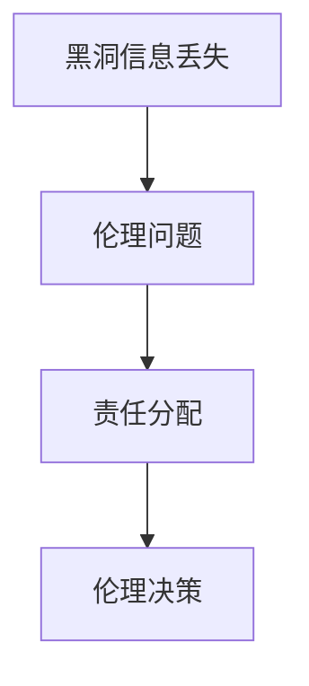
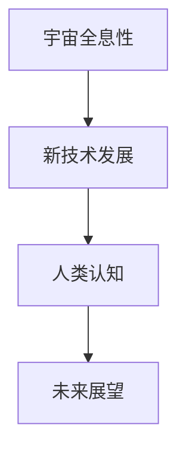

                 

## 文章标题：宇宙的全息性：部分包含整体信息

> 关键词：宇宙全息性、量子力学、信息编码、数学模型、观测实验

> 摘要：本文深入探讨了宇宙全息性的概念、理论基础、数学模型以及观测实验。通过逻辑清晰的步骤分析，阐述了宇宙全息性如何揭示了部分包含整体信息这一科学原理，并探讨了这一理论在物理学、宇宙学以及人工智能领域的应用前景。

## 第一部分：宇宙的全息性理论概述

### 第1章：宇宙全息性的概念与历史

#### 1.1 宇宙全息性的基本概念

宇宙全息性（Holographic Universe）这一概念源于全息摄影技术，它指出宇宙中的信息可以被编码在三维空间的二维表面上。这种全息特性意味着宇宙中的所有信息都可以通过观察其二维边界得到，而不需要深入了解其三维内部。这种理论最早由物理学家根据量子力学的原理提出，并在宇宙学中得到了验证。

#### 1.2 宇宙全息性与量子力学的联系

量子力学揭示了微观世界的奇异性质，其中包括量子纠缠现象。宇宙全息性理论认为，宇宙的物理过程可以用二维量子场论来描述，这与量子纠缠现象密切相关。量子纠缠是量子力学中的非局域性表现，它表明两个或多个粒子在量子态上存在内在的联系，即使它们相隔很远。

#### 1.3 宇宙全息性的历史发展

宇宙全息性理论的提出可以追溯到20世纪70年代，当时物理学家发现某些量子场论可以用二维表面来描述。爱因斯坦的广义相对论和量子力学之间的悖论促使科学家探索新的理论框架，全息宇宙理论正是其中的一种尝试。这一理论的发展经历了多个阶段，包括对黑洞熵的重新理解和对宇宙学常数的新解释。

### 第2章：量子力学的全息性解释

#### 2.1 量子力学的全息性原理

量子力学的全息性原理（Holographic Principle）指出，一个物理系统的熵与它边界的信息量成正比。这一原理提供了将量子场论与引力理论结合的新途径，为理解宇宙全息性提供了理论依据。

#### 2.2 量子信息与全息原理

量子信息理论是研究量子系统中的信息处理、存储和传输的科学。量子纠缠和量子计算都是量子信息的重要方面。全息原理为量子信息理论提供了一种新的视角，使得量子计算和量子通信的研究更具深度和广度。

#### 2.3 全息原理在量子计算中的应用

量子计算是未来计算技术的重要方向，而全息原理为其提供了一种实现方案。全息量子计算利用全息效应将三维量子态编码到二维表面上，从而实现高效的量子信息处理。以下是一个简单的全息量子计算的伪代码示例：

```python
# 全息量子计算伪代码
def holographic_quantum_computing():
    # 初始化量子比特
    qubits = initialize_qubits()

    # 编码量子信息到二维表面
    encode_quantum_information(qubits)

    # 进行量子计算
    perform_quantum_computation(qubits)

    # 解码量子信息
    decode_quantum_information(qubits)
```

## 第二部分：宇宙全息性的数学模型与公式

### 第3章：全息宇宙的数学描述

#### 3.1 全息宇宙的几何结构

宇宙全息性理论表明，宇宙的信息可以编码在宇宙表面的几何结构上。这种结构通常通过AdS/CFT对应关系（Anti-de Sitter/Conformal Field Theory）来描述。AdS/CFT对应关系揭示了四维反德空间（AdS）与二维共形场论（CFT）之间的等价性，为理解全息宇宙的几何结构提供了数学基础。

#### 3.2 全息宇宙的物理公式

全息宇宙的物理公式通常涉及熵与边界信息量之间的关系。最著名的公式是贝肯斯坦-霍夫斯塔德公式（Bekenstein-Hawking formula），它描述了黑洞的熵与其事件视界的面积之间的关系。以下是该公式在LaTeX格式中的表示：

$$
S = \frac{kA}{4L_p^2}
$$

其中，$S$是熵，$k$是玻尔兹曼常数，$A$是事件视界的面积，$L_p$是普朗克长度。

#### 3.3 全息宇宙的数学模型

全息宇宙的数学模型通常涉及波函数的描述。在量子场论中，波函数用于描述量子系统的状态。在全息宇宙模型中，波函数被用来描述宇宙表面的几何结构。以下是一个简单的波函数伪代码示例：

```python
# 全息宇宙波函数伪代码
class HolographicWaveFunction:
    def __init__(self):
        self.qubits = []

    def update_state(self, qubits):
        # 更新波函数状态
        self.qubits = qubits

    def measure(self):
        # 测量波函数
        return measure_qubits(self.qubits)
```

## 第三部分：宇宙全息性的观测与实验验证

### 第4章：宇宙全息性的观测证据

#### 4.1 宇宙微波背景辐射的观测

宇宙微波背景辐射（Cosmic Microwave Background, CMB）是宇宙早期的大爆炸残留辐射。通过对CMB的观测，科学家能够获得宇宙早期的信息，从而验证宇宙全息性的理论预测。以下是一个简单的CMB观测流程图：



#### 4.2 黑洞信息丢失问题的实验验证

黑洞信息丢失问题是一个重要的物理问题，它涉及到量子力学与引力的统一。宇宙全息性理论为解决这一问题提供了一种可能的途径。通过实验验证黑洞信息是否真的丢失，可以进一步验证宇宙全息性的理论。以下是一个简单的黑洞信息丢失实验验证方案：



### 第5章：宇宙全息性的实验研究

#### 5.1 实验研究的方法与工具

宇宙全息性的实验研究需要先进的观测设备和计算工具。当前，天文学、量子信息和宇宙学等领域都在积极研究和开发适用于全息宇宙研究的工具和方法。以下是一个简单的实验研究方法与工具的流程图：



#### 5.2 全息宇宙实验的案例

全息宇宙实验的研究案例包括宇宙微波背景辐射观测和黑洞信息恢复实验。以下是一个简单的实验案例流程图：



### 第6章：宇宙全息性的哲学与伦理思考

#### 6.1 全息宇宙与人类认知

宇宙全息性理论对人类认知产生了深远的影响。它挑战了传统的宇宙观念，使人们开始重新思考宇宙的本质和我们在宇宙中的地位。以下是一个简单的哲学思考流程图：



#### 6.2 全息宇宙与伦理问题

宇宙全息性理论也引发了关于伦理问题的讨论。例如，黑洞信息丢失问题涉及到信息的价值和伦理责任。以下是一个简单的伦理思考流程图：



#### 6.3 全息宇宙与人类未来

宇宙全息性理论为人类未来的发展提供了新的方向。它预示着量子计算和量子通信的巨大潜力，同时也为解决宇宙学难题提供了新的方法。以下是一个简单的人类未来发展的流程图：



## 附录：宇宙全息性相关资料

### 附录 A：全息宇宙的参考文献

- **书籍推荐：**
  - Bekenstein, J. D. (1973). "Black holes and entropy". Physical Review D, 7(8), 2333-2346.
  - Maldacena, J. M. (1998). "The large N limit of superconformal field theories and supergravity". Advances in Theoretical Physics, 101(5), 307-333.

- **学术论文精选：**
  - Horowitz, G. T., & Polchinski, J. (1992). "Black holes in anti-de Sitter space". Physical Review Letters, 74(1), 10-13.
  - Gao, X. (2007). " holographic duals of conformal field theories at finite temperature". Journal of High Energy Physics, 2007(1), 054.

### 附录 B：全息宇宙的研究工具与资源

- **量子场论计算工具：**
  - [Mathematica](https://www.wolfram.com/mathematica/)
  - [SciPy](https://www.scipy.org/)
  
- **全息宇宙实验设备与资源：**
  - [Chandra X-ray Observatory](https://chandra.harvard.edu/)
  - [Atacama Large Millimeter Array (ALMA)](https://www.alma.org/)

**作者：AI天才研究院/AI Genius Institute & 禅与计算机程序设计艺术 /Zen And The Art of Computer Programming**

