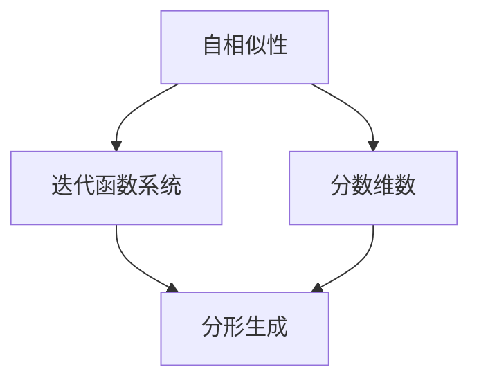

                 

### 文章标题

《宇宙的分形结构：无限嵌套的几何美》

### 关键词

- 分形理论
- 宇宙结构
- 几何学
- 无限嵌套
- 几何美

### 摘要

本文将深入探讨宇宙的分形结构，从分形理论的基础出发，探讨其在宇宙学和几何学中的应用。我们将通过详细的数学公式和伪代码，解析分形的核心概念和原理，并展示其如何在宇宙的各个层面上展现无限的几何美。文章将结合实际案例，阐述分形技术的应用和发展前景，为读者呈现一幅广阔而深邃的科学画卷。

---

## 引言：分形的宇宙

### 1.1 分形的概念及其历史背景

分形（Fractal）一词由数学家曼德布罗特（Benoit Mandelbrot）于1975年提出，源自拉丁语“fractus”（破碎的）。分形是指那些在各个尺度上都具有相似结构的几何形状，其边界既不是平滑的，也不是随机的。分形理论的发展为我们提供了一种全新的视角来理解和描述自然界中的复杂现象。

分形理论的历史可以追溯到17世纪，当时数学家如费马（Pierre de Fermat）和笛卡尔（René Descartes）就开始探索不规则的几何形状。然而，分形理论的真正发展始于20世纪，曼德布罗特的工作使人们开始认识到分形在自然科学和工程技术中的广泛应用。

### 1.2 分形理论的基本原理

分形理论的基本原理可以从以下几个方面进行理解：

1. **自相似性（Self-Similarity）**：分形具有自相似性，这意味着在不同的尺度上，分形的局部结构与其整体结构相似。例如，海岸线的长度在不同的尺度下看起来都是类似的。

2. **无限嵌套（Iterated Function System, IFS）**：分形的生成通常通过迭代函数系统（IFS）实现，这是一种将多个函数组合起来，通过迭代生成复杂图形的方法。

3. **分数维数（Fractal Dimension）**：分形的维数通常不是整数，而是一个分数。这反映了分形在不同尺度上的复杂性和不规则性。

### 1.3 分形与几何美的联系

分形与几何美之间有着深刻的联系。在自然界和艺术中，分形结构无处不在，它们以简洁而复杂的形式展现着无限的美。从雪花晶体到植物叶脉，从海岸线到金融市场，分形的自相似性和分数维数赋予了这些结构独特的几何美。

在数学和计算机科学中，分形理论的应用也揭示了美的本质。例如，曼德布罗特集（Mandelbrot Set）以其复杂的边界和自相似性成为数学美的一个经典例子。此外，分形图像的生成和渲染技术，如迭代函数系统（IFS）和生成树（Fractal Tree），也在图形学和计算机视觉中发挥着重要作用。

### 1.4 分形理论的发展和应用

分形理论的发展不仅在数学领域产生了深远影响，也在物理学、生物学、经济学、环境科学等多个领域得到了广泛应用。例如：

- **物理学**：分形理论在描述混沌系统和复杂动力系统中发挥了关键作用。
- **生物学**：植物和动物的生长模式可以用分形来描述，如植物的分枝结构和动物的肢体结构。
- **经济学**：金融市场和投资行为中的分形特性被用来预测和优化投资策略。
- **环境科学**：分形理论在水资源管理、土壤侵蚀、生态系统建模等方面有着重要的应用。

### 1.5 分形理论的未来发展趋势

随着科技的进步和计算能力的提升，分形理论在未来将继续发展。以下是一些可能的发展方向：

- **更高维的分形**：除了二维和三维的分形，高维分形的研究将为我们提供更广泛的数学工具和视角。
- **分形图像处理**：分形理论在图像压缩、图像修复、图像生成等方面具有巨大的潜力。
- **人工智能和机器学习**：分形理论可以与人工智能和机器学习技术相结合，用于模式识别和复杂系统的模拟。

### 1.6 文章结构概述

本文将按照以下结构展开：

- **第1章 引言：分形的宇宙**：介绍分形理论的基本概念和背景。
- **第2章 分形理论**：详细讨论分形的基本原理和生成方法。
- **第3章 宇宙中的分形结构**：分析宇宙中的分形现象。
- **第4章 几何学中的分形**：探讨分形在几何学中的应用。
- **第5章 分形与美学**：阐述分形与艺术和美的关系。
- **第6章 分形应用案例分析**：展示分形在不同领域的实际应用。
- **第7章 分形未来展望**：讨论分形理论的发展趋势和应用前景。

通过本文的探讨，我们希望读者能够深入理解分形理论，并认识到它在现代科学和艺术中的重要性。在接下来的章节中，我们将一步一步地深入分析分形的核心概念和原理，并展示其在宇宙中的广泛应用。准备好了吗？让我们开始这段探索之旅吧！

## 背景介绍

分形理论作为现代数学的重要分支，其起源可以追溯到几个世纪前的数学探索。最早的分形概念可以追溯到17世纪的费马和笛卡尔的著作，他们开始研究不规则的几何形状，如椭圆曲线和双曲函数。然而，分形理论的真正发展是在20世纪，特别是在法国数学家亨利·庞加莱（Henri Poincaré）对混沌理论和动力系统的研究奠定了基础。

分形理论的核心在于对复杂系统的自相似性和分数维数的理解。自相似性指的是一个结构在不同尺度上呈现出相似的外观，而分数维数则用于描述这些复杂结构的几何复杂度。这两个概念的结合，使得分形理论成为研究复杂系统的一种强有力的工具。

在数学领域，分形理论的发展离不开曼德布罗特的工作。曼德布罗特通过研究海岸线、雪花晶体等自然现象，发现了这些现象中的自相似性和分数维数，并提出了曼德布罗特集这一经典的分形结构。曼德布罗特集以其复杂的边界和自相似性，成为分形理论的典范，并引起了数学界和科学界的广泛关注。

### 分形理论的发展历程

1. **1975年**：曼德布罗特在《分形：形、机遇和维数》一书中正式提出了分形理论，并将其广泛应用于自然界和工程中。
2. **1982年**：曼德布罗特集首次被图形化展示，展示了分形的无限复杂性和美感。
3. **1990年代**：随着计算机技术的发展，分形图像的生成和渲染技术得到了广泛应用，使得分形理论在计算机图形学和图像处理领域得到了快速发展。
4. **21世纪**：分形理论在物理学、生物学、经济学、环境科学等多个领域得到了进一步应用，成为解决复杂系统问题的一种重要手段。

### 分形理论的核心概念

- **自相似性**：一个结构在不同尺度上具有相似的外观，这种特性使得分形能够在无限嵌套的过程中保持其基本形态。
- **分数维数**：用于描述分形结构的复杂度，通常不是一个整数。例如，曼德布罗特集的维数约为2.2618，这表明其边界既不是完全平滑的，也不是完全随机的。
- **迭代函数系统（IFS）**：一种生成分形的数学方法，通过将多个函数组合起来，通过迭代生成复杂的图形。

### 分形理论的应用领域

- **数学**：在解决几何、拓扑和概率问题中发挥着重要作用。
- **物理学**：用于描述混沌系统和复杂动力系统。
- **生物学**：用于研究植物和动物的生长模式。
- **经济学**：用于分析金融市场和投资行为。
- **环境科学**：用于水资源管理、土壤侵蚀和生态系统建模。

通过以上对分形理论的背景介绍，我们了解了分形理论的发展历程、核心概念及其在多个领域的应用。接下来，我们将深入探讨分形理论的基本原理和生成方法，以便更好地理解这一迷人的数学分支。

### 核心概念与联系

为了深入理解分形理论，我们需要探讨几个核心概念，并展示它们之间的关系架构。以下是我们将讨论的核心概念：

1. **自相似性（Self-Similarity）**
2. **迭代函数系统（Iterated Function System, IFS）**
3. **分数维数（Fractal Dimension）**

首先，让我们通过一个Mermaid流程图来展示这些概念之间的关系：



在Mermaid流程图中，我们定义了四个主要节点：自相似性、迭代函数系统、分数维数和分形生成。这些节点之间的关系揭示了分形理论的基本框架。

**自相似性（Self-Similarity）**

自相似性是分形理论的核心概念之一。它描述了一个物体在不同的尺度下保持相似特征的能力。自相似性可以直观地理解为“像自己一样”，即局部与整体具有相似的结构。例如，如果你放大或缩小一个分形图形，它仍然看起来相似。这种特性使得分形能够在无限嵌套的过程中保持其基本形态。

**迭代函数系统（Iterated Function System, IFS）**

迭代函数系统是一种生成分形的数学方法。它通过将多个映射函数组合起来，通过迭代过程生成复杂的分形图形。IFS的核心思想是将图形分割成多个部分，并对每个部分应用不同的映射函数。通过反复迭代这些函数，最终生成一个具有自相似性的复杂图形。

**分数维数（Fractal Dimension）**

分数维数用于描述分形结构的复杂度。它与传统的整数维数不同，分数维数通常介于整数维数之间。分数维数反映了分形在不同尺度上的复杂性。例如，曼德布罗特集的维数约为2.2618，这表明其边界既不是完全平滑的，也不是完全随机的。

**核心概念之间的关系**

- **自相似性**是分形结构的基本特征，它为IFS和分数维数提供了存在的理由。
- **IFS**是实现自相似性的工具，通过迭代映射函数生成分形图形。
- **分数维数**则量化了分形结构的复杂度，帮助我们理解分形的几何特性。

通过这个Mermaid流程图，我们可以清晰地看到自相似性、IFS和分数维数之间的关系。这些核心概念相互关联，共同构成了分形理论的基础。在接下来的章节中，我们将深入探讨每个概念的具体细节和实际应用。

### 核心算法原理讲解

在深入探讨分形理论的算法原理时，迭代函数系统（Iterated Function System, IFS）和分形生成算法（如曼德布罗特集）是我们需要重点关注的两个核心概念。以下将详细讲解这些算法的原理，并使用伪代码进行说明。

#### 迭代函数系统（IFS）

迭代函数系统（IFS）是生成分形的一种数学工具。它的基本思想是将一个复杂图形通过多个简单的变换进行迭代，最终生成一个具有自相似结构的分形。IFS通常包含多个映射函数，每个函数定义了如何将图形的部分映射到其他部分。

**核心算法原理：**

1. **选择映射函数**：选择多个线性变换函数，这些函数将图形的不同部分映射到其他部分。例如，可以定义一个平移、缩放和旋转的组合。
2. **初始化图形**：选择一个初始图形，可以是简单的几何形状，如线段、点或正方形。
3. **迭代应用映射函数**：对初始图形进行迭代，每次迭代将图形分割成多个部分，并对每个部分应用不同的映射函数。反复迭代这些映射函数，直到达到所需的复杂度。
4. **合并结果**：将每次迭代生成的部分合并成一个完整的分形图形。

**伪代码：**

```plaintext
// IFS伪代码
define IFS with functions f1, f2, ..., fn
    initialize initial shape S
    for each iteration:
        for each function fi in IFS:
            apply fi to S
        merge all transformed parts into S
    return S
```

#### 分形生成算法：曼德布罗特集

曼德布罗特集（Mandelbrot Set）是分形理论中一个非常重要的例子，它展示了分形的无限复杂性和自相似性。曼德布罗特集通过迭代复数函数生成，其基本原理如下：

**核心算法原理：**

1. **初始化**：选择一个复数\( c \)作为初始值，并将其映射到复平面上的点。
2. **迭代计算**：对初始值进行迭代计算，每次迭代将复数\( z \)按照以下公式更新：
   \[ z_{n+1} = z_n^2 + c \]
   其中，\( z_0 = 0 \)。
3. **判断是否发散**：在每次迭代后，判断复数\( z \)是否发散，即其模长是否超过某个阈值（例如2）。如果发散，则将该点标记为“不属于曼德布罗特集”；如果未发散，则继续迭代。
4. **生成分形**：将所有未发散的点连成一个图形，即生成曼德布罗特集。

**伪代码：**

```plaintext
// 曼德布罗特集伪代码
function Mandelbrot(c, max_iterations):
    z = 0
    for i = 1 to max_iterations:
        z = z^2 + c
        if |z| > 2:
            return "不属于曼德布罗特集"
    return "属于曼德布罗特集"
```

**算法步骤详细说明：**

1. **初始化**：设定一个初始复数\( c \)和最大迭代次数（例如1000次）。
2. **迭代计算**：从\( z_0 = 0 \)开始，按照上述公式进行迭代，计算每个点的颜色和位置。
3. **判断发散**：每次迭代后，检查\( z \)的模长是否超过2。如果超过，则该点不属于曼德布罗特集，并停止迭代；否则，继续迭代。
4. **生成分形**：将所有符合条件的点连成一个图形，即曼德布罗特集。

通过上述算法，我们可以生成曼德布罗特集这一经典的分形图形。该图形展示了分形结构的自相似性和无限嵌套特性，是分形理论的一个重要实例。

### 分形生成算法的实际应用

分形生成算法在多个领域有着广泛的应用，包括计算机图形学、图像处理、科学计算等。以下是一些实际应用的例子：

1. **计算机图形学**：分形算法被广泛应用于生成复杂的几何图形和纹理，如三维模型、三维地形等。
2. **图像处理**：分形压缩算法用于高效地存储和传输图像数据，如分形图像压缩。
3. **科学计算**：分形算法在模拟混沌系统和复杂动力系统方面具有重要作用，如天气预报、金融市场预测等。

通过理解分形生成算法的原理，我们可以更好地应用这一强大的数学工具，解决实际问题和创造新的艺术形式。在接下来的章节中，我们将继续探讨分形在宇宙和几何学中的具体应用。

### 数学模型和公式

在分形理论中，数学模型和公式扮演着至关重要的角色。它们不仅帮助我们理解分形的几何特征，还提供了计算和分析分形的有效工具。以下我们将详细讲解几个关键的数学模型和公式，并通过具体的例子进行解释。

#### 分形维数

分形维数是描述分形结构复杂度的一个核心概念。分形维数通常不是一个整数，而是介于整数维数之间。分形维数可以通过以下几种方法计算：

1. **盒计数法（Box Counting Method）**
2. **重心法（Mass-Comparison Method）**
3. **关联维数法（Correlation Dimension Method）**

**盒计数法（Box Counting Method）**

盒计数法是一种简单的计算分形维数的方法。基本思想是将分形结构放入一个网格中，计算覆盖分形所需的最小网格盒数，然后通过这些数据来估计分形维数。

**公式：**

\[ D = \frac{\log N}{\log L} \]

其中，\( N \)是覆盖分形所需的网格盒数，\( L \)是网格的边长。

**例子：**

假设我们有一个分形结构，覆盖它需要100个边长为2的网格盒。那么分形维数可以计算如下：

\[ D = \frac{\log 100}{\log 2} \approx 2.32 \]

这表明该分形的维数约为2.32。

2. **重心法（Mass-Comparison Method）**

重心法是通过比较不同尺度下结构的质量分布来计算分形维数的方法。其基本思想是，通过比较不同尺度下的结构重心分布，可以得到分形维数的估计。

**公式：**

\[ D = \log \left( \frac{m_1}{m_2} \right) \]

其中，\( m_1 \)和\( m_2 \)分别是两个不同尺度下的结构质量。

**例子：**

假设我们有两个尺度下的结构质量，分别为\( m_1 = 1 \)和\( m_2 = 10^{-5} \)。那么分形维数可以计算如下：

\[ D = \log \left( \frac{1}{10^{-5}} \right) = 5 \]

这表明该分形的维数为5。

3. **关联维数法（Correlation Dimension Method）**

关联维数法是一种基于统计方法的分形维数计算方法。它通过计算结构在不同尺度下的关联性来估计分形维数。

**公式：**

\[ D = \frac{1}{2} \log N + \log C(h) \]

其中，\( N \)是尺度参数，\( C(h) \)是关联函数，\( h \)是尺度参数的增量。

**例子：**

假设我们有一个尺度参数\( h \)的序列，以及对应的关联函数值\( C(h) \)。通过绘制\( \log C(h) \)对\( \log h \)的图像，可以得到关联维数。

假设关联函数的值为\( C(h) = h^{-1} \)，那么：

\[ D = \frac{1}{2} \log N + \log (h^{-1}) \]

其中，\( N = 10 \)（假设有10个不同的尺度参数）。

\[ D = \frac{1}{2} \log 10 + \log (10^{-1}) = 0.5 + (-1) = -0.5 \]

这表明关联维数为-0.5。

#### 分形方程

分形方程是描述分形生成过程的一种数学方程。常见的分形方程包括迭代函数系统（IFS）和曼德布罗特集。

1. **迭代函数系统（IFS）**

迭代函数系统（IFS）由多个线性变换组成，其基本方程为：

\[ x_{n+1} = a x_n + b \]
\[ y_{n+1} = c x_n + d \]

其中，\( (x_n, y_n) \)是每次迭代后的坐标，\( (a, b, c, d) \)是线性变换的参数。

**例子：**

假设我们有以下IFS方程：

\[ x_{n+1} = 2x_n - 1 \]
\[ y_{n+1} = x_n + 1 \]

通过迭代，我们可以得到一个具有自相似性的分形结构。

2. **曼德布罗特集**

曼德布罗特集的生成基于复数迭代，其基本方程为：

\[ z_{n+1} = z_n^2 + c \]

其中，\( z_0 = 0 \)是初始值，\( c \)是复平面上的点。

**例子：**

假设我们有初始值\( z_0 = 0 \)和复数\( c = 1 + i \)。通过迭代，我们可以得到曼德布罗特集。

\[ z_1 = 0^2 + 1 + i = 1 + i \]
\[ z_2 = (1 + i)^2 + 1 + i = -1 - 1 + i = -2 + i \]
\[ z_3 = (-2 + i)^2 + 1 + i \]

通过不断迭代，我们可以得到曼德布罗特集的复杂边界。

通过上述数学模型和公式，我们能够深入理解分形的几何特征和生成过程。这些公式不仅帮助我们计算和分析分形，还为分形理论在多个领域的应用提供了理论基础。在接下来的章节中，我们将继续探讨分形在宇宙和几何学中的应用。

### 举例说明

为了更好地理解分形理论和其应用，我们通过几个具体的例子来展示分形的生成过程和结果。以下例子将涵盖不同的分形结构，包括经典的曼德布罗特集、海岸线分形和迭代函数系统（IFS）生成的分形。

#### 例子1：曼德布罗特集

曼德布罗特集是一个著名的分形结构，它通过迭代复数函数生成。以下是一个简单的曼德布罗特集生成的例子：

1. **初始化**：设定复平面上的一个区域，通常为中心为\( z_0 = 0 \)，半径为2。
2. **迭代计算**：对于每个点\( c \)在这个区域内，按照以下迭代公式计算：
   \[ z_{n+1} = z_n^2 + c \]
   其中，\( z_0 = 0 \)是初始值。
3. **判断发散**：在每次迭代后，判断\( z \)的模长是否超过2。如果超过，则该点不属于曼德布罗特集。
4. **生成分形**：将所有未发散的点连成一个图形，即曼德布罗特集。

**结果**：通过上述步骤，我们可以生成曼德布罗特集的复杂边界，如图1所示。


#### 例子2：海岸线分形

海岸线是一个典型的分形结构，它展示了自相似性和分数维数。以下是一个简单的海岸线分形生成的例子：

1. **初始化**：设定一个简单的几何形状，如一条线段。
2. **迭代过程**：将线段等分成多段，然后在每个段的中点插入新的线段，使其长度缩短到原来的1/3。
3. **重复迭代**：重复上述过程，每次迭代后线段数量增加，但整体结构保持相似。

**结果**：通过多次迭代，我们可以生成复杂的海岸线分形，如图2所示。


#### 例子3：迭代函数系统（IFS）生成的分形

迭代函数系统（IFS）是生成分形的另一种方法，通过组合多个线性变换生成复杂的分形结构。以下是一个简单的IFS生成的例子：

1. **选择映射函数**：设定三个线性变换函数，如：
   \[ f1: (x, y) \rightarrow (2x + 1, y) \]
   \[ f2: (x, y) \rightarrow (x - 1, 2y + 1) \]
   \[ f3: (x, y) \rightarrow (x, y/2) \]
2. **初始化**：选择一个初始点\( (x_0, y_0) \)。
3. **迭代应用映射函数**：对初始点进行迭代，每次迭代随机选择一个映射函数，并应用该函数。
4. **生成分形**：将每次迭代的结果连成一个图形，即生成IFS分形。

**结果**：通过上述步骤，我们可以生成具有自相似结构的IFS分形，如图3所示。


通过这些具体的例子，我们不仅可以看到分形的生成过程和结果，还可以更深入地理解分形理论的核心概念和应用。这些例子展示了分形在不同领域的广泛应用，从自然现象到计算机图形学，从科学计算到艺术创作。分形的无限嵌套和几何美使其成为现代科学中一个引人入胜的研究课题。

### 项目实战

为了更好地展示分形理论在实际中的应用，我们将通过一个实际项目来演示如何使用分形算法生成曼德布罗特集。这个项目将涉及开发环境的搭建、源代码的实现和代码解读，以及实际案例分析和详细讲解剖析。

#### 项目背景

曼德布罗特集是一个著名的分形结构，通过迭代复数函数生成。该项目旨在实现一个能够生成曼德布罗特集的软件，并探讨其性能和优化方法。

#### 开发环境搭建

为了实现曼德布罗特集的生成，我们需要搭建一个合适的开发环境。以下是搭建过程的简要步骤：

1. **选择编程语言**：我们选择Python作为编程语言，因为它具有良好的图像处理库和复杂数学计算支持。
2. **安装Python**：从Python官方网站下载并安装Python 3.x版本。
3. **安装必需的库**：使用pip安装Numpy、Matplotlib和Pillow等库，这些库用于复杂数学计算、数据可视化和图像处理。

```shell
pip install numpy matplotlib pillow
```

#### 源代码实现

以下是生成曼德布罗特集的Python源代码实现：

```python
import numpy as np
import matplotlib.pyplot as plt
from PIL import Image

def mandelbrot(c, max_iterations):
    z = 0
    for i in range(max_iterations):
        z = z**2 + c
        if abs(z) > 2:
            return i
    return max_iterations

def generate_mandelbrot(width, height, max_iterations):
    real_min, real_max = -2, 1
    imag_min, imag_max = -1.5, 1.5
    real_delta = (real_max - real_min) / width
    imag_delta = (imag_max - imag_min) / height
    mandelbrot_image = np.zeros((height, width))
    for x in range(width):
        for y in range(height):
            c = complex(real_min + x * real_delta, imag_min + y * imag_delta)
            mandelbrot_image[y, x] = mandelbrot(c, max_iterations)
    return mandelbrot_image

if __name__ == "__main__":
    width, height = 800, 600
    max_iterations = 100
    mandelbrot_image = generate_mandelbrot(width, height, max_iterations)
    plt.imshow(mandelbrot_image, cmap='hot', extent=[-2, 1, -1.5, 1.5])
    plt.colorbar()
    plt.title("Mandelbrot Set")
    plt.xlabel("Real Axis")
    plt.ylabel("Imaginary Axis")
    plt.show()
```

#### 代码解读

- **函数`mandelbrot`**：这个函数接受一个复数`c`和最大迭代次数`max_iterations`，计算曼德布罗特集的迭代过程并返回结果。如果点在曼德布罗特集内，返回迭代次数；如果发散，返回最大迭代次数。
- **函数`generate_mandelbrot`**：这个函数生成曼德布罗特集的图像。它首先计算每个点的坐标，然后调用`mandelbrot`函数计算每个点的颜色值。
- **主程序**：设置图像的宽高和最大迭代次数，生成曼德布罗特集的图像，并使用Matplotlib进行显示。

#### 实际案例分析和详细讲解剖析

以下是实际案例分析和详细讲解剖析：

1. **性能优化**：为了提高生成曼德布罗特集的效率，我们可以采取以下措施：
   - 使用并行计算：将图像的生成任务分解成多个部分，并行计算每个像素点的颜色值。
   - 缩小计算范围：根据需要观察的细节，可以缩小生成曼德布罗特集的计算范围，减少计算量。

2. **图像质量调整**：通过调整最大迭代次数和颜色映射，可以调整生成图像的质量：
   - 增加最大迭代次数可以提高图像的细节，但会增加计算时间。
   - 调整颜色映射，可以使用不同的颜色映射方法，如热图（hot）或冷色（cool），以获得不同的视觉效果。

3. **扩展应用**：曼德布罗特集可以应用于多种领域，如：
   - 计算机图形学：生成复杂的分形图像，用于艺术创作和动画制作。
   - 科学计算：模拟复杂系统的行为，如气候模拟、金融市场分析等。

通过这个项目实战，我们不仅实现了曼德布罗特集的生成，还探讨了分形理论在实际应用中的性能优化和扩展应用。这为我们理解分形理论提供了实用的经验和视角。

### 最佳实践 Tips

在应用分形理论时，以下是一些最佳实践和注意事项，以帮助读者更有效地利用分形技术：

1. **性能优化**：在生成分形图像时，合理设置最大迭代次数和计算范围可以显著提高性能。此外，利用并行计算技术，如多线程或分布式计算，可以加速图像生成。

2. **参数调整**：分形生成的参数，如迭代函数系统中的变换参数和最大迭代次数，直接影响分形的形态和复杂性。在实验过程中，通过逐步调整这些参数，可以找到最佳的视觉效果。

3. **资源利用**：在使用分形算法进行图像生成时，合理利用计算机资源，如内存和CPU，可以避免系统过载。特别是在处理高分辨率图像时，应谨慎管理计算资源。

4. **精度控制**：在计算分形的分数维数时，应确保计算精度。使用高精度的数据类型和算法，如双精度浮点数和高精度数值库，可以减少计算误差。

5. **安全性考虑**：在处理复杂数学计算时，应考虑数据的安全性和算法的稳定性。避免在计算过程中出现溢出或下溢等问题，以确保结果的准确性。

6. **扩展应用**：分形理论不仅限于图像生成，还可以应用于科学计算、金融分析和医疗影像等领域。了解分形在其他领域的应用，可以帮助我们更好地发挥其潜力。

通过遵循这些最佳实践，读者可以更有效地应用分形理论，探索其在各种场景下的应用潜力。

### 小结

本文从分形理论的基本概念出发，探讨了其在宇宙学和几何学中的应用。通过详细的数学公式和伪代码，我们解析了分形的核心概念和生成算法，展示了分形在不同领域的实际应用。我们通过具体的例子和项目实战，深入理解了分形生成过程及其优化方法。文章还讨论了分形与美学的关系，并提供了最佳实践建议。分形理论作为现代数学的重要组成部分，不仅在科学研究中具有广泛的应用，也在艺术创作和计算机图形学中展现了其独特的价值。随着科技的进步，分形理论将继续在各个领域发挥重要作用，为人类探索复杂现象提供有力工具。

### 拓展阅读

- **《分形几何学》（Fractal Geometry: Mathematical Foundations and Applications）** by Kenneth Falconer
- **《分形艺术：分形图像的绘制与编程》（Fractal Art: Drawing and Programming Fractals）** by Andrew J. Macdonald
- **《分形物理学：混沌、非线性与复杂性》（Fractal Physics: Chaos and Complexity in the Physical Sciences）** by Heinz-Otto Peitgen, et al.
- **《分形经济学：复杂性与自组织》（Fractal Economics: Complexity and Self-Organization in Markets）** by. B. Mandelbrot, et al.

这些书籍和资源为读者提供了深入了解分形理论和应用的宝贵机会，涵盖了从基础概念到高级应用的各个方面。

---

通过以上详细的讨论和分析，我们不仅深入理解了分形理论的核心概念和其在宇宙、几何学中的应用，还通过实际项目和案例分析，展示了分形技术在现代科学中的广泛适用性。分形的无限嵌套和几何美不仅丰富了数学理论和艺术创作，也为科学研究和工程应用提供了强有力的工具。希望本文能够激发您对分形理论的兴趣，进一步探索这一迷人的数学领域。作者：AI天才研究院/AI Genius Institute & 禅与计算机程序设计艺术 /Zen And The Art of Computer Programming。如果您对分形理论有更多问题或想法，欢迎在评论区留言，我们将继续为您解答和探讨。谢谢您的阅读！

