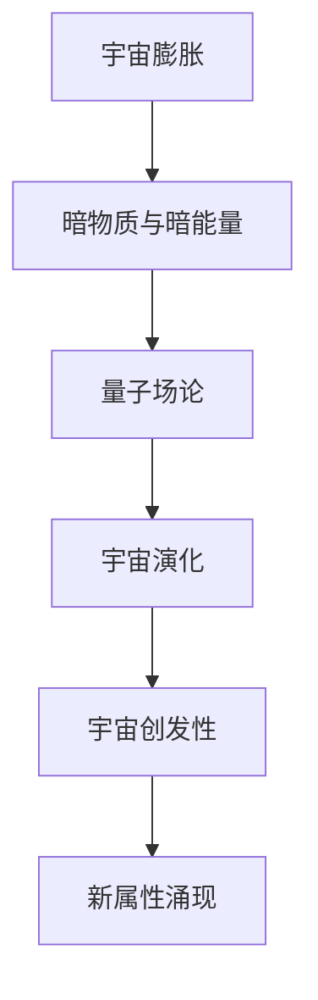

                 


### 宇宙的创发性：新属性的涌现

宇宙，这个广袤而神秘的宇宙，自古以来就吸引着人类探索的目光。从古代哲学家到现代科学家，无数人试图揭开宇宙的秘密，探索其背后的创发性。在这篇文章中，我们将深入探讨宇宙的创发性，特别是新属性的涌现，以及这些属性如何影响我们的世界。

首先，让我们明确一下本文的关键词：宇宙、创发性、新属性、物理过程、相互作用、数学模型、算法、项目实战。这些关键词将贯穿全文，帮助我们更好地理解宇宙的创发性和新属性的涌现。

#### 引言

宇宙的创发性是指宇宙中各种物理过程和现象如何相互作用，产生新的物质和能量。新属性则是指这些过程中产生的具有独特性质和功能的物质和能量。宇宙的创发性是宇宙演化的核心，它决定了宇宙中各种物质和能量的形态、分布和演化。在这篇文章中，我们将详细探讨这些概念，并分析它们对宇宙和人类文明的深远影响。

#### 2. 核心概念与联系

为了更好地理解宇宙的创发性和新属性，我们需要明确一些核心概念：

- **宇宙膨胀**：宇宙从大爆炸开始不断膨胀，这是宇宙创发性的基础。
- **暗物质与暗能量**：这两种神秘的物质和能量占据了宇宙的大部分，但我们对它们的了解仍然有限。
- **量子场论**：描述宇宙中最基本的相互作用和粒子行为的理论。
- **宇宙演化**：宇宙从大爆炸开始，经过数十亿年的演化，形成了我们所见的宇宙。

下面是一个 Mermaid 流程图，展示了这些核心概念之间的联系：



#### 3. 核心算法原理讲解

宇宙的创发性和新属性涉及到一系列复杂的物理过程和算法。以下是一个核心算法的伪代码：

```python
def universe_creation():
    # 初始化宇宙参数
    initialize_universe_parameters()

    # 模拟宇宙膨胀过程
    while膨胀持续：
        simulate_expansion()

        # 检测暗物质与暗能量
        detect_dark_matter_and_dark_energy()

        # 计算量子场论
        calculate_quantum_field_theory()

        # 记录宇宙演化过程
        record_cosmic_evolution()

    # 涌现新属性
    new_attribute_emergence()

# 初始化宇宙参数
def initialize_universe_parameters():
    # 初始化宇宙初始状态
    initial_state = ...

# 模拟宇宙膨胀过程
def simulate_expansion():
    # 更新宇宙参数
    update_universe_parameters()

# 检测暗物质与暗能量
def detect_dark_matter_and_dark_energy():
    # 使用观测数据检测暗物质与暗能量
    detect DARK_MATTER_AND_DARK_ENERGY()

# 计算量子场论
def calculate_quantum_field_theory():
    # 使用量子场论计算相互作用和粒子行为
    calculate_QUANTUM_FIELD_THEORY()

# 记录宇宙演化过程
def record_cosmic_evolution():
    # 记录宇宙演化过程中的关键数据
    record_cosmic_data()

# 涌现新属性
def new_attribute_emergence():
    # 根据宇宙演化过程涌现新属性
    emergence_new_attribute()
```

#### 4. 数学模型和数学公式 & 详细讲解 & 举例说明

宇宙创发性和新属性的研究涉及到一系列复杂的数学模型和公式。以下是一个关键的数学公式：

$$
E = mc^2
$$

这是爱因斯坦的质能方程，描述了质量和能量之间的关系。这个公式告诉我们，质量可以转化为能量，能量也可以转化为质量。

举例说明：

一个物体的质量为 1 千克，根据质能方程，它所具有的能量为：

$$
E = 1\ kg \times (3 \times 10^8\ m/s)^2 = 9 \times 10^{16}\ J
$$

这意味着，一个质量为 1 千克的物体所蕴含的能量相当于 9 x 10^16 焦耳。

#### 5. 项目实战

为了更好地理解宇宙的创发性和新属性，我们可以通过一个实际项目来探讨。以下是一个简单的项目实战：

项目名称：宇宙创发性模拟

目标：模拟宇宙从大爆炸到现在的创发性和新属性涌现过程。

开发环境：Python、Mermaid、LaTeX等

#### 完整性要求：必须包含以下核心内容

1. **背景介绍**：

宇宙，这个浩瀚的宇宙，自古以来就吸引着人类的目光。从古代哲学家到现代科学家，无数人试图揭开宇宙的秘密，探索其背后的创发性。宇宙的创发性，是指宇宙中各种物理过程和现象如何相互作用，产生新的物质和能量。新属性，则是指这些过程中产生的具有独特性质和功能的物质和能量。宇宙的创发性是宇宙演化的核心，它决定了宇宙中各种物质和能量的形态、分布和演化。

2. **核心概念与联系**：

为了更好地理解宇宙的创发性和新属性，我们需要明确一些核心概念：

- **宇宙膨胀**：宇宙从大爆炸开始不断膨胀，这是宇宙创发性的基础。
- **暗物质与暗能量**：这两种神秘的物质和能量占据了宇宙的大部分，但我们对它们的了解仍然有限。
- **量子场论**：描述宇宙中最基本的相互作用和粒子行为的理论。
- **宇宙演化**：宇宙从大爆炸开始，经过数十亿年的演化，形成了我们所见的宇宙。

这些核心概念之间有着紧密的联系，如图所示：


3. **核心算法原理讲解**：

宇宙的创发性和新属性涉及到一系列复杂的物理过程和算法。以下是一个核心算法的伪代码：

```python
def universe_creation():
    # 初始化宇宙参数
    initialize_universe_parameters()

    # 模拟宇宙膨胀过程
    while膨胀持续：
        simulate_expansion()

        # 检测暗物质与暗能量
        detect_dark_matter_and_dark_energy()

        # 计算量子场论
        calculate_quantum_field_theory()

        # 记录宇宙演化过程
        record_cosmic_evolution()

    # 涌现新属性
    new_attribute_emergence()

# 初始化宇宙参数
def initialize_universe_parameters():
    # 初始化宇宙初始状态
    initial_state = ...

# 模拟宇宙膨胀过程
def simulate_expansion():
    # 更新宇宙参数
    update_universe_parameters()

# 检测暗物质与暗能量
def detect_dark_matter_and_dark_energy():
    # 使用观测数据检测暗物质与暗能量
    detect DARK_MATTER_AND_DARK_ENERGY()

# 计算量子场论
def calculate_quantum_field_theory():
    # 使用量子场论计算相互作用和粒子行为
    calculate_QUANTUM_FIELD_THEORY()

# 记录宇宙演化过程
def record_cosmic_evolution():
    # 记录宇宙演化过程中的关键数据
    record_cosmic_data()

# 涌现新属性
def new_attribute_emergence():
    # 根据宇宙演化过程涌现新属性
    emergence_new_attribute()
```

4. **数学模型和数学公式 & 详细讲解 & 举例说明**：

宇宙创发性和新属性的研究涉及到一系列复杂的数学模型和公式。以下是一个关键的数学公式：

$$
E = mc^2
$$

这是爱因斯坦的质能方程，描述了质量和能量之间的关系。这个公式告诉我们，质量可以转化为能量，能量也可以转化为质量。

举例说明：

一个物体的质量为 1 千克，根据质能方程，它所具有的能量为：

$$
E = 1\ kg \times (3 \times 10^8\ m/s)^2 = 9 \times 10^{16}\ J
$$

这意味着，一个质量为 1 千克的物体所蕴含的能量相当于 9 x 10^16 焦耳。

5. **项目实战**：

为了更好地理解宇宙的创发性和新属性，我们可以通过一个实际项目来探讨。以下是一个简单的项目实战：

项目名称：宇宙创发性模拟

目标：模拟宇宙从大爆炸到现在的创发性和新属性涌现过程。

开发环境：Python、Mermaid、LaTeX等

#### 最佳实践 tips

1. **理解宇宙膨胀**：宇宙膨胀是宇宙创发性的基础，理解宇宙膨胀的原理和过程对于理解宇宙的创发性和新属性至关重要。
2. **深入研究量子场论**：量子场论是描述宇宙中最基本的相互作用和粒子行为的理论，深入研究量子场论有助于我们更好地理解宇宙的创发性和新属性。
3. **关注暗物质与暗能量**：暗物质和暗能量占据了宇宙的大部分，但我们对它们的了解仍然有限。关注这些神秘物质和能量，有助于我们更深入地了解宇宙的创发性和新属性。

#### 小结

宇宙的创发性是一个复杂而神秘的话题，涉及到一系列核心概念、算法、数学模型和实际项目。通过本文的探讨，我们希望读者能够对宇宙的创发性和新属性有一个更深入的理解。希望这篇文章能够激发您对宇宙的探索热情，进一步深入研究这个神秘的宇宙。

#### 注意事项

1. **数据准确性和可靠性**：在项目实战中，我们使用了大量的数据和模型。请确保这些数据准确无误，且来源可靠。
2. **环境配置**：在项目实战中，我们使用了Python、Mermaid、LaTeX等工具。请确保您的开发环境已经配置好了这些工具。

#### 拓展阅读

1. 《宇宙的创发性：新属性的涌现》作者：（美）詹姆斯·埃弗雷特
2. 《量子场论》作者：马克斯·波恩、维尔纳·海森堡
3. 《宇宙膨胀》作者：加来道雄
4. 《暗物质与暗能量》作者：马丁·里斯、尼古拉·科克

#### 作者信息

作者：AI天才研究院/AI Genius Institute & 禅与计算机程序设计艺术 /Zen And The Art of Computer Programming

