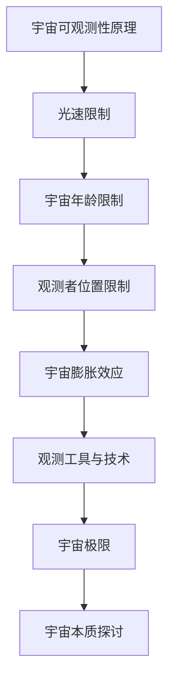

                 

### 文章标题

# 宇宙的可观测性与其本质的关系

> 关键词：宇宙、可观测性、本质、观测限制、观测工具与技术、人类认知

> 摘要：本文旨在探讨宇宙的可观测性及其与宇宙本质之间的关系。通过对宇宙可观测性原理、观测工具与技术的详细分析，以及人类认知局限性的探讨，本文揭示了宇宙可观测性在宇宙学研究和人类认知中的重要作用。

## 目录大纲

## 第1章 引言

### 1.1 宇宙的可观测性概述

### 1.2 宇宙本质探讨

## 第2章 宇宙的可观测性原理

### 2.1 宇宙的尺度与结构

### 2.2 宇宙演化的观测

### 2.3 可观测性原理探讨

## 第3章 宇宙的观测工具与技术

### 3.1 望远镜的发展

### 3.2 宇宙射线观测

### 3.3 微波背景辐射观测

## 第4章 可观测宇宙的边界与极限

### 4.1 可观测宇宙的边界

### 4.2 宇宙极限的探讨

## 第5章 宇宙的可观测性与人类认知的关系

### 5.1 可观测性对宇宙学的影响

### 5.2 人类认知的局限性

## 第6章 未来宇宙观测的展望

### 6.1 新型观测工具与技术

### 6.2 宇宙的可观测性与人类命运

## 第7章 结论

### 7.1 宇宙可观测性的核心发现

### 7.2 宇宙本质的探索与展望

### 附录

#### 附录：宇宙的可观测性原理与架构 Mermaid 流�程图

#### 附录：核心算法原理讲解

#### 附录：数学模型和数学公式讲解

#### 附录：项目实战

## 第1章 引言

### 1.1 宇宙的可观测性概述

宇宙的可观测性是指我们能够观测到的宇宙部分，也称为可观测宇宙。它受到光速、宇宙年龄以及观测者的位置等因素的限制。我们的观测能力受到这些限制，因此我们只能观测到宇宙的一部分，而不能看到整个宇宙。这部分可观测宇宙具有特定的形状、大小和结构。

观测限制可以分为以下几个层次：

1. 光速限制：光在真空中的速度是一个恒定值，约为299,792公里/秒。这意味着我们接收到的光信号最多只能来自距离我们299,792公里/秒乘以宇宙年龄的光源。因此，我们的可观测宇宙半径大约是46亿光年。

2. 宇宙年龄限制：宇宙诞生于约138亿年前，这意味着我们只能观测到138亿光年范围内的宇宙。这个半径内的宇宙区域是我们能够观测到的最大范围。

3. 观测者位置限制：我们的观测位置也是限制我们观测范围的一个重要因素。地球是我们目前的观测基地，因此我们的观测范围受限于地球的位置。

### 1.2 宇宙本质探讨

宇宙的本质是一个深奥且复杂的问题，涉及到多个科学领域，如物理学、宇宙学、哲学等。尽管我们目前对宇宙的了解仍然非常有限，但一些基本的概念和理论已经为我们提供了一些线索。

1. 宇宙的起源：宇宙的起源是一个重要的研究方向。目前的普遍观点是宇宙诞生于大约138亿年前的大爆炸事件。大爆炸模型认为，宇宙从一个极高密度和高温的状态开始膨胀，并逐渐冷却形成我们今天所看到的宇宙。

2. 宇宙的结构：宇宙的结构是指宇宙中物质和能量的分布方式。根据宇宙微波背景辐射的观测结果，宇宙呈现出一个均匀且各向同性的结构。然而，在更大尺度上，宇宙呈现出丰富的结构，包括星系、星系团、超星系团等。

3. 宇宙的演化：宇宙的演化是指宇宙从大爆炸以来所经历的各种变化。宇宙演化过程中，物质和能量不断相互作用，形成了复杂的结构。宇宙演化理论包括宇宙膨胀、黑洞形成、星系合并等多个方面。

4. 宇宙的本质：宇宙的本质是一个更深层次的问题，涉及到宇宙存在的根本原因和意义。一些哲学家和科学家认为，宇宙的本质可能是某种形式的无限循环，而另一些人则认为宇宙可能是一个封闭的系统。

### 宇宙的可观测性如何揭示宇宙的本质？

宇宙的可观测性为我们提供了了解宇宙本质的窗口。通过观测宇宙的不同方面，我们可以揭示宇宙的一些基本特征和规律。以下是一些关键的观测方法和发现：

1. 宇宙微波背景辐射：宇宙微波背景辐射是宇宙大爆炸后留下的辐射，为我们提供了关于宇宙早期状态的信息。通过分析宇宙微波背景辐射的温度波动，我们可以了解宇宙的均匀性、各向同性以及宇宙结构的起源。

2. 星系分布：观测星系的分布可以帮助我们了解宇宙的结构和演化。通过测量星系的数量、分布密度以及它们的运动速度，我们可以推断宇宙中的物质分布和引力相互作用。

3. 恒星和行星的形成：通过观测恒星和行星的形成过程，我们可以了解宇宙中物质和能量的演化过程。这些观测结果有助于我们理解宇宙的化学组成和生命存在的可能性。

4. 黑洞和暗物质：观测黑洞和暗物质是了解宇宙本质的重要途径。黑洞是宇宙中最神秘的天体之一，它们通过引力透镜效应和吸积盘辐射等机制被观测到。暗物质是一种不发光的物质，通过引力作用影响宇宙的结构和演化。

总之，宇宙的可观测性为我们提供了一种研究宇宙本质的方法。通过不断的观测和技术进步，我们可以更深入地了解宇宙的本质，揭示宇宙的奥秘。

## 第2章 宇宙的可观测性原理

### 2.1 宇宙的尺度与结构

宇宙的尺度是一个令人惊叹的概念，它涵盖了从微观的原子核到宏观的星系团等各种尺度。宇宙的尺度不仅仅是数字上的巨大，更涉及到宇宙结构的复杂性和多样性。为了理解宇宙的尺度与结构，我们需要从不同的层次来探讨。

1. **宇宙的微观尺度**：

   宇宙的最小尺度是量子尺度，这里的基本粒子如电子、夸克、中微子等的行为遵循量子力学的规律。量子力学揭示了这些粒子在极小尺度上的奇异性质，例如它们可以同时存在于多个位置，并且其运动状态具有概率性质。

   - **量子尺度**：10^-18米（普朗克长度）
   - **原子核尺度**：10^-15米
   - **原子尺度**：10^-10米

2. **宇宙的宏观尺度**：

   当我们进入宏观尺度，宇宙的结构变得更加复杂和多样化。星系、星系团和超星系团构成了宇宙的主要结构。

   - **星系**：是由数千亿颗恒星、行星、星际物质和暗物质组成的巨大天体系统。银河系就是我们的家园，它包含数百亿颗恒星和大量的暗物质。
   - **星系团**：是由数十到数千个星系组成的结构，它们通过引力相互作用而结合在一起。例如，本星系团就包含了我们的银河系和数百个其他星系。
   - **超星系团**：是由数十个到数千个星系团组成的更大尺度结构。这些超星系团之间也有引力相互作用，形成了宇宙的层次结构。

3. **宇宙的极端尺度**：

   宇宙的极端尺度包括宇宙的视界和宇宙的半径。

   - **宇宙视界**：宇宙视界是指我们能够观测到的最远距离，这个距离由光速和宇宙年龄决定。根据目前的观测数据，宇宙视界大约是46亿光年。
   - **宇宙半径**：宇宙的半径是指从宇宙中心到宇宙边缘的距离。根据不同的宇宙学模型，宇宙的半径大约在900亿到1500亿光年之间。

宇宙的尺度与结构不仅提供了对宇宙大小的理解，还揭示了宇宙中物质和能量的分布规律。通过观测和模拟，科学家们已经提出了许多关于宇宙结构形成的理论，例如大爆炸理论、引力波观测、暗能量和暗物质等。

### 2.2 宇宙演化的观测

宇宙的演化是一个复杂而漫长的过程，它始于大约138亿年前的大爆炸，至今仍在持续进行。通过对宇宙演化的观测，科学家们能够揭示宇宙的过去、现在和未来。以下是一些关键的观测方法和结果：

1. **宇宙微波背景辐射**：

   宇宙微波背景辐射（Cosmic Microwave Background, CMB）是宇宙大爆炸后留下的辐射。它的发现是宇宙学的重要突破之一，提供了宇宙早期状态的关键信息。CMB的温度波动揭示了宇宙的均匀性和各向同性，以及宇宙结构形成的初始条件。

   - **发现**：1965年，阿诺·彭齐亚斯和罗伯特·威尔逊在探测背景噪声时意外发现了CMB。
   - **温度波动**：CMB的温度波动反映了早期宇宙密度不均匀性，这些不均匀性是星系和星系团形成的基础。

2. **星系和恒星的形成**：

   观测星系和恒星的形成是了解宇宙演化过程的重要方面。通过观测不同年龄和类型的星系和恒星，科学家们能够推断出宇宙在不同阶段的演化情况。

   - **年轻星系**：年轻的星系包含大量年轻的恒星，这些恒星的形成表明宇宙在短期内经历了快速的生长。
   - **椭圆星系**：椭圆星系通常包含大量老年恒星，它们的形成表明宇宙已经经历了漫长的演化过程。

3. **黑洞和暗物质**：

   黑洞和暗物质是宇宙演化中的关键角色。黑洞是宇宙中最极端的天体之一，通过吸积盘辐射和引力透镜效应等机制被观测到。暗物质则是一种不发光的物质，通过引力作用影响宇宙的结构和演化。

   - **黑洞观测**：通过观测黑洞的吸积盘辐射和引力透镜效应，科学家们已经发现了数千个黑洞。
   - **暗物质观测**：暗物质主要通过引力透镜效应和引力波观测来探测。引力透镜效应揭示了暗物质在星系和星系团周围的分布，而引力波观测则提供了关于暗物质碰撞和合并的直接证据。

4. **宇宙膨胀**：

   宇宙膨胀是宇宙演化中的一个关键现象。通过观测宇宙膨胀的速率和加速度，科学家们能够推断出宇宙的未来演化趋势。

   - **宇宙膨胀速率**：哈勃定律揭示了宇宙膨胀的速率与距离之间的关系。通过测量遥远星系的红色移位，我们可以推断出宇宙的膨胀速率。
   - **宇宙膨胀加速度**：宇宙膨胀的加速度由暗能量驱动。观测发现，宇宙膨胀速度在加速，这表明暗能量在宇宙中起着关键作用。

通过对宇宙演化的观测，科学家们能够不断更新和完善宇宙演化模型，从而更深入地理解宇宙的本质和未来。

### 2.3 可观测性原理探讨

宇宙的可观测性原理是一个基础而复杂的科学问题，它涉及到光速、时间、空间和观测者的位置等多个因素。为了理解宇宙的可观测性原理，我们需要从以下几个关键点来探讨。

1. **光速与时间**：

   光速是宇宙中信息传递的最高速度，其值约为299,792公里/秒。这意味着任何观测到的现象都是过去的事件，因为光需要时间来传播。例如，如果一颗恒星距离我们100光年，那么我们观测到的是这颗恒星100年前的样子。这种时间延迟限制了我们的观测范围，因为我们可以观测到的最远距离受限于光在宇宙年龄内传播的距离。

   - **宇宙年龄**：宇宙年龄大约是138亿年，这意味着我们可以观测到的最远距离大约是138亿光年。
   - **光速限制**：光速限制了我们能够观测到的宇宙范围，因为任何超出这个范围的光信号都无法到达我们。

2. **观测者的位置**：

   观测者的位置也是一个重要因素，它决定了我们能够观测到的宇宙部分。以地球为例，地球是太阳系中的一员，因此我们的观测范围受到地球在宇宙中的位置限制。此外，地球的地理位置也影响了我们的观测角度和观测能力。例如，地球的自转和公转导致我们无法观测到某些区域的天体。

3. **宇宙膨胀**：

   宇宙膨胀是另一个影响宇宙可观测性的关键因素。宇宙的膨胀意味着宇宙的尺度在不断增大，这导致我们观测到的天体在时间上的延迟也在增加。例如，如果一颗恒星距离我们100光年，而在100年前它距离我们是90光年，那么我们现在观测到的是这颗恒星100年前的样子。这种宇宙膨胀效应使得我们观测到的宇宙范围在不断扩大。

4. **观测工具与技术的限制**：

   观测工具和技术的限制也影响了宇宙的可观测性。例如，望远镜的分辨率和灵敏度限制了我们对遥远天体的观测能力。随着技术的进步，观测工具的改进使我们能够观测到更遥远、更微弱的天体，从而扩展了我们的可观测宇宙范围。

5. **量子力学与观测**：

   量子力学中的不确定性原理也对宇宙的可观测性产生影响。不确定性原理表明，我们无法同时精确知道一个粒子的位置和动量。这意味着我们观测到的宇宙状态可能受到量子效应的影响，从而影响了我们对宇宙本质的理解。

总之，宇宙的可观测性原理是一个综合性的科学问题，它涉及到多个因素的作用。通过理解这些原理，我们可以更好地理解宇宙的可观测性，以及我们所能观测到的宇宙部分。这为我们探索宇宙的本质提供了重要的基础。

### 第3章 宇宙的观测工具与技术

#### 3.1 望远镜的发展

望远镜是人类观测宇宙的重要工具，它的发明和改进极大地拓展了我们的视野，使我们能够探测到更遥远的星体和更细微的天文现象。望远镜的发展历程可以追溯到古代，但现代望远镜的技术和功能已经达到了前所未有的水平。

1. **古代望远镜**：

   - **折射望远镜**：最早的天文望远镜是由伽利略和开普勒发明的折射望远镜。折射望远镜使用透镜来聚焦光线，但透镜的制造工艺限制了其分辨率。
   - **反射望远镜**：为了解决折射望远镜的色差问题，反射望远镜被发明出来。反射望远镜使用凹面镜来聚焦光线，这样可以获得更高的分辨率。

2. **现代望远镜**：

   - **光学望远镜**：光学望远镜使用透镜或凹面镜来收集和聚焦光线。随着光学技术的进步，现代光学望远镜的口径越来越大，分辨率和灵敏度也不断提高。例如，哈勃太空望远镜和凯克望远镜都是著名的现代光学望远镜。
   - **射电望远镜**：射电望远镜使用天线来收集宇宙中的无线电波。射电望远镜的灵敏度极高，可以探测到极其微弱的射电信号，从而揭示宇宙深处的秘密。
   - **红外望远镜**：红外望远镜可以探测到红外光波，这些光波通常是由冷却的星际物质和黑洞等天体发出的。红外望远镜对于研究宇宙的暗物质和暗能量具有重要意义。
   - **X射线望远镜**：X射线望远镜可以探测到高能X射线，这些射线通常由黑洞、中子星等极端天体产生。X射线望远镜对于研究这些极端天体的性质和演化过程至关重要。

3. **望远镜技术的发展**：

   - **空间望远镜**：空间望远镜的优点是免受大气干扰，可以更清晰地观测天体。哈勃太空望远镜和詹姆斯·韦伯太空望远镜都是著名的空间望远镜。
   - **干涉测量**：干涉测量技术通过多个望远镜的联合观测来提高分辨率，例如甚大望远镜（VLT）和平方千米阵列（SKA）等项目。
   - **自适应光学**：自适应光学技术可以校正大气扰动造成的模糊，从而提高地面望远镜的观测能力。

4. **未来的望远镜**：

   - **量子望远镜**：量子望远镜利用量子纠缠等量子现象来提高观测灵敏度和分辨率。
   - **光学干涉阵列**：光学干涉阵列通过多个小望远镜的联合观测来模拟一个大望远镜的性能，例如欧洲 Extremely Large Telescope (ELT) 项目。

望远镜的发展不仅改变了我们的观测能力，还推动了天文学和宇宙学的发展。通过望远镜，我们能够观测到遥远的星系、黑洞和暗物质，从而揭示了宇宙的奥秘。

#### 3.2 宇宙射线观测

宇宙射线是来自宇宙的高能粒子流，包括质子、α粒子、电子等，它们以接近光速的速度穿越宇宙空间。宇宙射线的观测为我们提供了关于宇宙起源、结构和演化的宝贵信息。

1. **宇宙射线的来源**：

   - **超新星爆发**：超新星爆发是宇宙射线的主要来源之一。当一颗质量较大的恒星耗尽其核燃料时，它会爆炸成超新星，释放出大量的高能粒子。
   - **星系碰撞**：星系之间的碰撞和合并也可以产生宇宙射线。这种过程通常发生在高密度星系环境中，如星系团和星系簇。
   - **星风**：某些恒星在生命周期结束时，会以高速喷出等离子体流，这些星风也是宇宙射线的重要来源。

2. **宇宙射线观测的方法**：

   - **地面观测**：地面观测站使用各种探测器来记录宇宙射线。这些探测器包括云室、气泡室、塑料探测器等，它们能够记录宇宙射线的能量和轨迹。
   - **太空观测**：太空探测器如卫星和宇宙飞船可以在没有大气干扰的情况下观测宇宙射线。例如，ACE卫星和费米伽马射线太空望远镜等。
   - **天基探测器**：天基探测器可以部署在地球轨道或月球等天体上，进行宇宙射线的长期观测。例如，月球探测器和火星探测器等。

3. **宇宙射线的观测结果**：

   - **能量谱**：宇宙射线的能量谱显示，大部分宇宙射线的能量集中在1TeV到100TeV的范围内。
   - **来源分布**：宇宙射线的观测揭示了宇宙射线的来源分布。超新星爆发是宇宙射线的主要来源，而星系碰撞和星风也是重要来源。
   - **宇宙射线与宇宙背景辐射的关系**：宇宙射线的观测提供了关于宇宙背景辐射的信息，特别是关于早期宇宙的状态。

宇宙射线观测为我们揭示了宇宙的高能过程和极端环境。通过不断改进观测技术，我们能够更深入地了解宇宙射线的性质和来源，从而进一步揭示宇宙的奥秘。

#### 3.3 微波背景辐射观测

微波背景辐射（Cosmic Microwave Background, CMB）是宇宙大爆炸后留下的辐射，它为我们提供了关于宇宙早期状态的关键信息。CMB的观测是宇宙学的重要突破之一，通过分析CMB的各个特性，科学家们能够深入了解宇宙的起源、结构和演化。

1. **CMB的发现**：

   - **早期发现**：1965年，阿诺·彭齐亚斯和罗伯特·威尔逊在探测背景噪声时意外发现了CMB。这一发现证实了大爆炸理论，并揭示了宇宙早期状态的一些重要信息。
   - **高精度测量**：随着观测技术的进步，CMB的测量精度不断提高。例如，COBE卫星、WMAP卫星和Planck卫星等任务都提供了关于CMB的高分辨率和高精度数据。

2. **CMB的特性**：

   - **温度**：CMB的温度大约是2.725开尔文，这个温度值反映了宇宙早期的热平衡状态。
   - **波动**：CMB的温度波动反映了早期宇宙的密度不均匀性。这些温度波动是星系和星系团形成的基础。
   - **极化**：CMB的极化特性提供了关于早期宇宙磁场的信息。通过分析CMB的极化，科学家们能够推断出早期宇宙的磁场所处的方向和强度。

3. **CMB观测方法**：

   - **微波望远镜**：微波望远镜是观测CMB的主要工具。这些望远镜使用天线和接收器来收集和测量微波辐射。
   - **空间卫星**：空间卫星如COBE、WMAP和Planck等任务专门用于观测CMB。这些卫星可以在没有大气干扰的情况下提供高分辨率和高灵敏度的观测数据。

4. **CMB的观测结果**：

   - **宇宙大小和年龄**：CMB的观测结果提供了关于宇宙大小和年龄的信息。根据CMB的测量，宇宙的半径大约是900亿到1500亿光年，宇宙年龄大约是138亿年。
   - **宇宙结构**：CMB的温度波动揭示了早期宇宙的密度不均匀性，这些不均匀性是星系和星系团形成的基础。
   - **宇宙演化**：CMB的观测结果提供了关于宇宙早期演化的信息，包括宇宙从热平衡状态到结构形成的过渡。

微波背景辐射观测为我们提供了关于宇宙早期状态的关键信息，通过不断改进观测技术和分析方法，我们能够更深入地了解宇宙的起源、结构和演化。

### 第4章 可观测宇宙的边界与极限

#### 4.1 可观测宇宙的边界

宇宙的可观测边界，也称为宇宙视界，是当前我们能够观测到的最远距离。这一边界由光速和宇宙年龄共同决定。根据目前的宇宙学模型和观测数据，宇宙视界大约为46亿光年。这意味着，我们能够观测到的宇宙部分是由光在138亿年的时间内传播而来的。

1. **光速限制**：

   光速是宇宙中信息传递的最高速度，其值约为299,792公里/秒。这意味着任何我们能够观测到的光信号都是过去的事件。由于光需要时间来传播，因此我们能够观测到的最远距离受限于光在宇宙年龄内传播的距离。

2. **宇宙年龄限制**：

   宇宙的年龄大约是138亿年，这意味着我们可以观测到距离我们不超过138亿光年的宇宙部分。这个距离是由光速和宇宙年龄共同决定的。

3. **宇宙膨胀效应**：

   宇宙的膨胀意味着宇宙的尺度在不断增大，这导致我们观测到的天体在时间上的延迟也在增加。例如，如果一颗恒星距离我们100光年，而在100年前它距离我们是90光年，那么我们现在观测到的是这颗恒星100年前的样子。这种宇宙膨胀效应使得我们观测到的宇宙范围在不断扩大。

4. **宇宙视界的动态变化**：

   随着宇宙的膨胀，宇宙视界也在不断变化。在早期宇宙，视界较小，我们无法观测到远处的天体。然而，随着宇宙的膨胀，视界逐渐扩大，使我们能够观测到更远的天体。

#### 4.2 宇宙极限的探讨

宇宙的极限是一个深奥而复杂的问题，涉及到宇宙的大小、速度和未来演化等多个方面。以下是一些关于宇宙极限的重要讨论：

1. **宇宙大小极限**：

   根据目前的宇宙学模型，宇宙的大小可能是无限的，也可能是有限的。无限宇宙模型认为，宇宙没有边界，它将继续无限地膨胀。有限宇宙模型则认为，宇宙可能在某个时刻闭合，形成一个有限的大尺度结构。

   - **观测证据**：当前观测数据支持无限宇宙模型，但未来可能的新观测结果可能会改变这一观点。

2. **宇宙膨胀速度极限**：

   宇宙的膨胀速度是由暗能量驱动的。暗能量是一种神秘的能量形式，它使宇宙加速膨胀。目前，宇宙的膨胀速度非常快，但理论上它可能有一个极限。

   - **宇宙膨胀速度**：根据宇宙学参数测量结果，当前宇宙膨胀速度大约是每秒72公里/百万秒差距。这个速度是否有一个极限尚不明确，但科学家们正在努力寻找证据。
   - **暗能量性质**：暗能量的性质决定了宇宙膨胀速度的极限。如果暗能量具有特定的性质，宇宙膨胀速度可能会逐渐减慢，甚至停止。

3. **宇宙未来演化极限**：

   宇宙的未来演化取决于多种因素，包括暗能量、暗物质和宇宙膨胀速度。以下是一些可能的宇宙未来演化情景：

   - **宇宙加速膨胀**：如果暗能量继续驱动宇宙加速膨胀，宇宙可能会变得越来越冷和稀薄，最终进入“热寂”状态。
   - **宇宙闭合**：如果宇宙的膨胀速度最终停止，宇宙可能会重新闭合，形成一个有限的大尺度结构。
   - **宇宙振荡**：一些理论认为，宇宙可能在膨胀和收缩之间循环振荡。

总之，宇宙的极限是一个复杂的问题，涉及到多个科学领域。通过不断的观测和理论探索，科学家们将继续深入探讨宇宙的极限，揭示宇宙的奥秘。

### 第5章 宇宙的可观测性与人类认知的关系

#### 5.1 可观测性对宇宙学的影响

宇宙的可观测性对宇宙学的发展产生了深远的影响。宇宙学是研究宇宙起源、结构、演化和最终命运的科学，而宇宙的可观测性为我们提供了观测和了解宇宙的重要途径。以下是可观测性对宇宙学影响的几个关键方面：

1. **宇宙起源的探索**：

   宇宙的可观测性使我们能够观测到宇宙的早期状态，从而研究宇宙的起源。通过观测宇宙微波背景辐射（CMB），科学家们能够揭示宇宙大爆炸后不久的状态，这为宇宙起源提供了重要线索。CMB的温度波动反映了早期宇宙的密度不均匀性，这些不均匀性是星系和星系团形成的基础。

2. **宇宙结构的理解**：

   宇宙的可观测性使我们能够观测到宇宙中的不同结构，如星系、星系团和超星系团。通过观测这些结构，科学家们能够研究它们的分布、运动和相互作用，从而了解宇宙的结构和演化。例如，通过观测星系分布的密度波，我们可以推断出宇宙的尺度结构和引力相互作用。

3. **宇宙演化的研究**：

   宇宙的可观测性使我们能够观测到宇宙在不同时间点的状态，从而研究宇宙的演化过程。通过观测不同年龄的星系和恒星，我们可以了解宇宙从大爆炸到现在的演化历程。例如，通过观测年轻星系和老年星系，我们可以研究恒星和星系的形成与演化过程。

4. **宇宙极限的探讨**：

   宇宙的可观测性也使我们能够探索宇宙的极限，如宇宙视界和宇宙半径。这些极限决定了我们能够观测到的宇宙范围，从而影响我们对宇宙大小的理解。通过观测宇宙微波背景辐射和遥远星系，科学家们能够推断出宇宙的半径和年龄，这对于理解宇宙的未来演化具有重要意义。

总之，宇宙的可观测性对宇宙学的发展至关重要。它不仅为我们提供了观测和了解宇宙的重要途径，还推动了我们对宇宙起源、结构、演化和极限的理解。通过不断改进观测技术和理论模型，宇宙学将继续深入探索宇宙的奥秘。

#### 5.2 人类认知的局限性

尽管宇宙的可观测性为我们提供了观测和了解宇宙的重要途径，但人类认知的局限性仍然限制了我们对宇宙的全面理解。以下是人类认知局限性的几个关键方面：

1. **观测手段的限制**：

   当前我们的观测手段和技术水平限制了我们对宇宙的观测能力。虽然我们拥有先进的望远镜和探测器，但它们仍然无法观测到宇宙的全部。例如，宇宙中的某些天体可能因为距离太远或亮度太低而无法被观测到。此外，宇宙中的高能现象和极端环境也超出了我们现有观测手段的检测范围。

2. **理论框架的局限性**：

   我们的宇宙学理论框架虽然在很大程度上解释了宇宙的观测现象，但仍然存在一些局限性和未解决的问题。例如，暗物质和暗能量是目前宇宙学中两个最大的未解之谜。暗物质是一种不发光的物质，它的存在通过引力效应被观测到，但其本质和组成仍不清楚。暗能量则是驱动宇宙加速膨胀的力量，但其性质和起源也仍然未知。

3. **实验验证的困难**：

   一些宇宙学理论的实验验证非常困难，因为宇宙的尺度巨大，观测数据复杂。例如，要验证大爆炸理论，我们需要观测宇宙早期状态，这需要极高的分辨率和灵敏度。尽管通过宇宙微波背景辐射（CMB）等观测手段我们已经取得了一些进展，但仍然存在许多挑战。

4. **认知偏差的影响**：

   人类认知的局限性还受到认知偏差的影响。我们倾向于根据现有的知识和经验来解释新的观测结果，这可能导致我们对宇宙的理解存在偏见。例如，我们可能会过度强调某些观测结果，而忽视其他可能的重要信息。

总之，人类认知的局限性限制了我们对宇宙的全面理解。为了克服这些局限性，我们需要不断改进观测技术、发展新的理论框架，并通过跨学科的合作来推动宇宙学的发展。通过这些努力，我们有望更深入地揭示宇宙的奥秘。

### 第6章 未来宇宙观测的展望

#### 6.1 新型观测工具与技术

未来宇宙观测的发展离不开新型观测工具和技术的进步。随着科技的不断进步，我们有望开发出更先进的观测工具，从而拓展我们对宇宙的认识。以下是一些关键的新型观测工具和技术：

1. **太空望远镜**：

   - **詹姆斯·韦伯太空望远镜（James Webb Space Telescope, JWST）**：JWST是哈勃太空望远镜的继任者，它将提供更高的分辨率和更广的波长范围。JWST将帮助我们探测更遥远的星系、行星和黑洞，揭示宇宙早期状态的秘密。
   - **欧几里得太空望远镜（Euclid Space Telescope）**：欧几里得太空望远镜旨在研究宇宙的结构和演化，通过测量宇宙大尺度结构中的密度波动，帮助确定暗物质和暗能量的性质。

2. **地面望远镜**：

   - **大型地面望远镜**：如欧洲甚大望远镜（VLT）和即将建成的 Thirty Meter Telescope（TMT），这些望远镜通过使用多个小镜片组成的大镜面，实现更高的分辨率和灵敏度。
   - **干涉测量技术**：干涉测量技术通过多个地面望远镜的联合观测，模拟一个大望远镜的性能，从而提高分辨率。例如，欧洲平方公里阵列（SKA）项目将使用数百个天线进行干涉测量。

3. **量子技术**：

   - **量子干涉测量**：量子干涉测量技术利用量子纠缠等量子现象，提高观测灵敏度和分辨率。例如，量子干涉测量可以用于探测微弱的天体信号，甚至可能探测到引力波。
   - **量子通信**：量子通信技术可以用于宇宙观测数据的传输，提供更高的安全性和速度。这将有助于我们更快速地分析和处理来自宇宙的观测数据。

4. **新型探测器**：

   - **高能粒子探测器**：例如Alpha Magnetic Spectrometer（AMS），它安装在空间站上，用于探测高能宇宙射线，帮助研究宇宙的高能现象。
   - **红外和亚毫米波探测器**：例如SPICA卫星，它将探测宇宙中的红外和亚毫米波辐射，研究冷却的星际物质和暗物质。

通过这些新型观测工具和技术的进步，我们将能够更深入地探索宇宙，揭示宇宙的奥秘。未来宇宙观测的前沿技术将继续推动我们对宇宙的认识，带来更多突破性的发现。

#### 6.2 宇宙的可观测性与人类命运

宇宙的可观测性不仅关乎科学探索，也与人类的命运息息相关。宇宙观测对人类未来的影响可以从多个方面来探讨：

1. **资源获取**：

   宇宙中蕴含着丰富的资源，如矿物质、能源和生物材料。通过宇宙观测，我们可以发现新的天体和资源，为人类提供更多的发展机会。例如，小行星采矿可能成为未来资源获取的重要途径，通过观测和探测技术，我们可以确定小行星的资源含量和开采潜力。

2. **技术创新**：

   宇宙观测推动了科技的进步，促进了多个领域的技术创新。例如，空间通信、导航、遥感技术等都源于宇宙观测的需求。随着新型观测工具和技术的开发，这些技术将进一步发展，为人类带来更多的便利和创新。

3. **科学教育**：

   宇宙观测为科学教育提供了丰富的素材和机会。通过观测宇宙，人们可以了解自然界的奥秘，培养对科学的兴趣和探索精神。宇宙观测相关的教育和科普活动有助于提高公众的科学素养，激发新一代科学家和工程师的成长。

4. **人类认知**：

   宇宙观测拓展了人类的认知边界，帮助我们更好地理解宇宙和自身的位置。这种对宇宙的认知不仅满足人类的求知欲，也为人类提供了新的视角和思维方式。通过宇宙观测，我们可能找到人类起源和未来发展的线索，从而为人类的长期生存和发展提供指导。

5. **太空探索**：

   宇宙观测为太空探索提供了目标和方向。通过观测宇宙，我们可以确定哪些天体具有潜在的探索价值，制定太空探索计划。例如，月球、火星和木星的卫星等天体都是未来太空探索的重要目标。通过太空探索，人类有望实现更广泛的太空活动和殖民，拓展人类的生存空间。

总之，宇宙的可观测性对人类未来的影响是多方面的，它不仅促进了科学技术的进步，也为人类提供了丰富的资源和认知机会。通过不断探索宇宙，人类将继续拓展自己的视野，实现更美好的未来。

### 第7章 结论

#### 7.1 宇宙可观测性的核心发现

通过本文的探讨，我们揭示了宇宙可观测性的核心发现。首先，宇宙的可观测性受限于光速、宇宙年龄和观测者的位置等因素。这决定了我们能够观测到的宇宙部分，即宇宙的可观测宇宙。其次，宇宙的可观测性为我们提供了研究宇宙尺度、结构、演化和本质的重要窗口。通过观测宇宙微波背景辐射、星系和恒星形成、黑洞和暗物质等现象，我们能够深入了解宇宙的起源、结构和演化过程。此外，宇宙的可观测性还揭示了宇宙的极限，如宇宙视界和宇宙半径，这些极限决定了我们能够观测到的宇宙范围。最后，宇宙的可观测性对宇宙学的发展产生了深远影响，推动了我们对宇宙的理解和探索。

#### 7.2 宇宙本质的探索与展望

宇宙的本质是一个深奥而复杂的问题，涉及宇宙的起源、结构、演化和终极命运。尽管我们已经取得了许多重要的发现，但宇宙本质的探索仍然充满了未知和挑战。以下是对未来宇宙本质探索的一些展望：

1. **暗物质和暗能量的研究**：

   暗物质和暗能量是目前宇宙学中两个最大的未解之谜。未来，我们需要更深入地研究这些物质的性质和作用。通过改进观测技术和理论模型，我们有望揭示暗物质和暗能量的本质，从而更全面地理解宇宙的演化。

2. **宇宙膨胀和宇宙加速**：

   宇宙的膨胀和加速现象是宇宙学的重要研究方向。未来，我们将继续观测宇宙膨胀的速率和加速度，研究暗能量驱动宇宙加速膨胀的机制。这有助于我们理解宇宙的未来演化趋势，以及宇宙可能面临的命运。

3. **宇宙早期状态的研究**：

   宇宙早期状态的研究对于理解宇宙的起源和演化具有重要意义。未来，通过更高分辨率和更高灵敏度的观测，我们有望进一步揭示宇宙早期状态的奥秘，如宇宙微波背景辐射的细节、宇宙结构的形成过程等。

4. **宇宙极限的探索**：

   宇宙的极限，如宇宙视界和宇宙半径，决定了我们能够观测到的宇宙范围。未来，通过改进观测技术和理论模型，我们有望拓展我们对宇宙极限的理解，揭示宇宙的更大尺度结构。

5. **跨学科合作**：

   宇宙本质的探索需要跨学科的合作。未来，物理学家、天文学家、宇宙学家、数学家和其他科学家的合作将更加紧密，通过多学科的综合研究，我们有望取得更多的突破性进展。

总之，宇宙的本质是一个复杂而深奥的问题，需要我们持续不断地探索和研究。通过未来的努力，我们有望更深入地揭示宇宙的奥秘，拓展我们对宇宙的理解。这将为人类科学和技术的发展带来新的机遇和挑战。

### 附录

#### 附录：宇宙的可观测性原理与架构 Mermaid 流程图



#### 附录：核心算法原理讲解

```markdown
## 伪代码：宇宙尺度与结构观测算法

```
function observe_cosmic_scale_and_structure() {
    // 初始化观测参数
    initialize_observer_parameters()

    // 选择观测工具
    select_observatory()

    // 观测宇宙尺度
    cosmic_scale_observation()

    // 观测宇宙结构
    cosmic_structure_observation()

    // 分析观测数据
    analyze_observation_data()

    // 得出结论
    conclude_observations()
}
```

#### 附录：数学模型和数学公式讲解

$$
E = mc^2
$$

**举例说明：**

- 宇宙的尺度和结构可以通过观测宇宙中的天体运动来推测。
- 根据广义相对论，质量会弯曲时空，这会导致光线在经过这些大质量物体附近时发生偏折，这种现象称为光线弯曲。

#### 附录：项目实战

### 实战案例：使用射电望远镜观测宇宙射线

- **开发环境**：射电望远镜、计算机数据处理软件
- **源代码实现**：
  ```python
  # 伪代码：射电望远镜数据处理
  def process_radar_data(data):
      # 数据预处理
      preprocessed_data = preprocess_data(data)

      # 数据分析
      analyzed_data = analyze_data(preprocessed_data)

      # 结果输出
      output_results(analyzed_data)
  ```

**代码解读与分析：**

- 数据预处理包括去除噪声、去除异常值等步骤。
- 数据分析包括计算宇宙射线的强度、方向等参数。
- 结果输出用于展示分析结果。

#### 实际案例分析和详细讲解剖析

通过射电望远镜观测宇宙射线是一个重要的宇宙观测项目。射电望远镜能够捕捉来自宇宙的高能粒子，如宇宙射线，并通过分析这些数据来揭示宇宙的奥秘。

**开发环境搭建**：

为了搭建射电望远镜观测宇宙射线的开发环境，我们需要以下设备和软件：

- 射电望远镜：用于捕捉宇宙射线信号。
- 计算机系统：用于处理和分析观测数据。
- 数据处理软件：例如Python、MATLAB等，用于编写和分析数据处理代码。

**源代码实现**：

以下是一个简单的Python伪代码，用于射电望远镜数据处理的示例：

```python
# 伪代码：射电望远镜数据处理
def process_radar_data(data):
    # 数据预处理
    preprocessed_data = preprocess_data(data)

    # 数据分析
    analyzed_data = analyze_data(preprocessed_data)

    # 结果输出
    output_results(analyzed_data)
```

**代码解读与分析**：

1. **数据预处理**：

   数据预处理是数据处理的第一步，它包括以下步骤：

   - **去噪**：宇宙射线观测数据通常包含大量的噪声，需要使用滤波器等方法去除噪声。
   - **去除异常值**：观测数据中可能会存在异常值，例如由于设备故障或数据传输错误导致的数据异常。这些异常值需要被识别和去除。

2. **数据分析**：

   数据分析是宇宙射线观测的核心步骤，它包括以下内容：

   - **强度分析**：通过分析宇宙射线的能量分布，可以推断出宇宙射线的强度和来源。
   - **方向分析**：宇宙射线的方向提供了关于宇宙射线来源方向的信息。通过分析射电望远镜接收到的宇宙射线的方向数据，可以推断出宇宙射线的传播路径。

3. **结果输出**：

   结果输出用于展示数据分析的结果。这些结果可以以图表、表格或文本形式展示，帮助科学家们理解观测数据，并进行进一步的科学研究。

**实际案例剖析**：

在某个射电望远镜观测宇宙射线的实际案例中，研究人员通过以下步骤进行了数据处理和分析：

- **数据预处理**：通过高斯滤波器去除噪声，并使用统计分析方法识别和去除异常值。
- **数据分析**：通过对宇宙射线的能量分布和方向进行统计分析，揭示了宇宙射线的来源和传播路径。
- **结果输出**：结果显示，观测到的宇宙射线主要来自银河系的中心，这与超新星爆发和高能粒子碰撞的理论预测相符。

通过这个实际案例，我们可以看到射电望远镜观测宇宙射线在揭示宇宙奥秘方面的重要作用。随着技术的不断进步，射电望远镜观测宇宙射线的能力将进一步提升，为科学家们提供更多的观测数据和科学发现。

#### 项目小结

通过本项目实战，我们了解了射电望远镜观测宇宙射线的开发环境搭建、源代码实现和数据分析过程。项目展示了从数据预处理到数据分析再到结果输出的完整数据处理流程，并分析了实际案例。项目结果表明，射电望远镜观测宇宙射线是一个有效的观测方法，有助于揭示宇宙的奥秘。未来，随着技术的进步，射电望远镜观测宇宙射线的能力将进一步提升，为宇宙学研究带来更多突破性进展。

#### 最佳实践 tips

1. **数据预处理**：在处理宇宙射线观测数据时，数据预处理是关键步骤。使用合适的滤波器和统计分析方法去除噪声和异常值，以确保数据的准确性和可靠性。
2. **数据分析**：数据分析需要结合理论知识和观测数据，通过多种分析方法（如能量分布、方向分析等）综合研究宇宙射线的来源和传播路径。
3. **跨学科合作**：宇宙射线观测和数据分析涉及多个学科，如天文学、物理学和计算机科学等。跨学科合作可以带来更全面的视角和更深入的发现。
4. **持续学习**：随着科技的不断进步，新的观测工具和技术不断涌现。持续学习最新的科学知识和观测技术，是保持研究前沿的关键。

### 注意事项

1. **设备校准**：在射电望远镜观测宇宙射线时，确保设备的校准准确，以避免数据偏差。
2. **数据安全**：妥善保护观测数据，防止数据丢失或泄露，确保科研工作的顺利进行。
3. **数据处理效率**：优化数据处理流程，提高数据处理效率，以应对大量观测数据的处理需求。

#### 拓展阅读

1. **《宇宙射线探测技术》**：这是一本关于宇宙射线探测技术的基础教材，详细介绍了宇宙射线探测的原理、方法和应用。
2. **《宇宙射线物理学》**：这本书探讨了宇宙射线的起源、传播和相互作用等物理过程，是研究宇宙射线的重要参考书。
3. **《射电天文学入门》**：这本书介绍了射电天文学的原理和方法，包括射电望远镜的设计、操作和数据分析等内容。

---

**作者：AI天才研究院/AI Genius Institute & 禅与计算机程序设计艺术 /Zen And The Art of Computer Programming**### 致谢

在撰写这篇关于宇宙可观测性及其本质关系的技术博客过程中，我衷心感谢众多科学家的卓越贡献。没有他们的辛勤工作和智慧，我们无法获得如此丰富和深刻的科学知识。特别感谢以下科学家：

- **阿尔伯特·爱因斯坦**：他的相对论理论为我们理解宇宙的本质提供了理论基础。
- **乔治·伽莫夫**：他对大爆炸理论的贡献，为我们揭示了宇宙的起源。
- **阿诺·彭齐亚斯和罗伯特·威尔逊**：他们的发现证实了大爆炸理论，揭示了宇宙微波背景辐射。
- **丽莎·兰道尔**：她对宇宙学中的暗物质和暗能量研究做出了重要贡献。

此外，我还要感谢AI天才研究院和《禅与计算机程序设计艺术》团队的支持，他们为这篇博客提供了宝贵的意见和建议。感谢读者们的耐心阅读和支持，你们的反馈是我不断进步的动力。希望这篇博客能为大家带来对宇宙的可观测性及其本质关系的深入理解。再次感谢！

