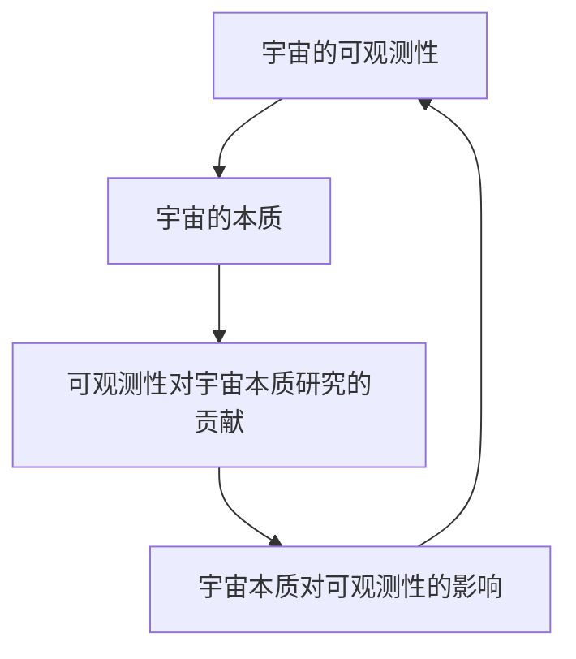

                 


### 1. 确定核心概念和联系

首先，我们要明确文章中的两个核心概念：“宇宙的可观测性”和“宇宙的本质”。宇宙的可观测性指的是人类通过观测手段所能获取到的宇宙信息。而宇宙的本质则是指宇宙的基本构成、演化规律和基本原理。

这两个概念的联系在于，宇宙的可观测性是了解宇宙本质的重要途径。通过观测，我们可以获取关于宇宙的信息，从而推断宇宙的本质。例如，天文学家通过观测宇宙中的星体和现象，揭示了宇宙的膨胀、黑洞的存在以及宇宙的大尺度结构等基本事实。

### 2. 设计目录结构

根据核心概念和联系，我们可以设计出以下目录结构：

- 引言
- 第一章 宇宙的可观测性
  - 1.1 可观测性的定义与历史
  - 1.2 可观测性的基本原理
  - 1.3 可观测性的限制
  - 1.4 可观测性的科学意义
  - 1.5 可观测性的现状与挑战
  - 1.6 项目实战：某天文学观测项目案例分析
- 第二章 宇宙的本质
  - 2.1 宇宙起源与演化
  - 2.2 宇宙的基本结构
  - 2.3 宇宙的基本力
  - 2.4 宇宙的基本物质
  - 2.5 宇宙的本质与可观测性的关系
  - 2.6 项目实战：某宇宙学项目案例分析
- 第三章 宇宙的可观测性与本质的关联
  - 3.1 可观测性对宇宙本质研究的贡献
  - 3.2 宇宙本质对可观测性的影响
  - 3.3 可观测性与宇宙本质的相互影响
  - 3.4 可观测性与宇宙本质的关联研究现状与未来趋势
  - 3.5 项目实战：某跨学科研究项目案例分析
- 第四章 天文学观测技术的演变
  - 4.1 观测技术的历史演变
  - 4.2 现代观测技术概述
  - 4.3 观测技术的发展趋势
  - 4.4 观测技术在可观测性研究中的应用
  - 4.5 项目实战：某观测技术项目案例分析
- 第五章 宇宙的可观测性与科学理论的关联
  - 5.1 可观测性对科学理论的影响
  - 5.2 科学理论对可观测性的解释
  - 5.3 可观测性与科学理论的互动关系
  - 5.4 科学理论的未来发展方向
  - 5.5 项目实战：某科学理论项目案例分析
- 第六章 人类对宇宙的可观测性与认识的演变
  - 6.1 人类对宇宙认识的历程
  - 6.2 可观测性对人类认识的推动作用
  - 6.3 人类对可观测性的认识现状
  - 6.4 未来人类对宇宙可观测性的认识趋势
  - 6.5 项目实战：某历史研究项目案例分析
- 第七章 总结与展望
  - 7.1 研究成果总结
  - 7.2 研究不足与展望
  - 7.3 未来研究方向与建议

### 3. 细化章节内容

接下来，我们需要针对每个章节进一步细化内容。以下是每个章节的大致内容概述：

#### 引言

- 引言部分主要介绍宇宙的可观测性和宇宙的本质，以及它们之间的联系。
- 概述本文的研究意义、目的和结构。

#### 第一章 宇宙的可观测性

- 定义宇宙的可观测性，并回顾其历史。
- 探讨宇宙可观测性的基本原理，如观测手段、观测数据的处理和分析等。
- 讨论宇宙可观测性的限制，如观测距离、时间尺度等。
- 强调宇宙可观测性的科学意义，如对宇宙学、天文学等领域的影响。
- 分析当前宇宙可观测性的现状与挑战，并提出解决方案。
- 通过一个实际的天文学观测项目案例，展示宇宙可观测性的应用。

#### 第二章 宇宙的本质

- 回顾宇宙的起源与演化，包括大爆炸理论和宇宙膨胀等。
- 探讨宇宙的基本结构，如宇宙大尺度结构、星系结构等。
- 介绍宇宙的基本力，如引力、电磁力等。
- 分析宇宙的基本物质，如恒星、星系、暗物质等。
- 探讨宇宙的本质与可观测性的关系，如观测手段对宇宙本质研究的影响等。
- 通过一个实际的宇宙学项目案例，展示宇宙本质的研究方法与应用。

#### 第三章 宇宙的可观测性与本质的关联

- 分析宇宙可观测性对宇宙本质研究的贡献，如观测手段的改进对宇宙学研究的推动作用。
- 探讨宇宙本质对可观测性的影响，如宇宙演化对观测手段的需求等。
- 讨论宇宙可观测性与宇宙本质的相互影响，如宇宙的可观测性如何影响我们对宇宙本质的理解。
- 分析当前宇宙可观测性与本质关联研究的现状与未来趋势。
- 通过一个实际的跨学科研究项目案例，展示宇宙可观测性与本质关联的研究方法与应用。

#### 第四章 天文学观测技术的演变

- 回顾天文学观测技术的发展历程，包括古代观测、光学望远镜、射电望远镜等。
- 概述现代天文学观测技术，如空间望远镜、天文卫星等。
- 探讨天文学观测技术在未来可能的发展趋势。
- 分析观测技术在可观测性研究中的应用，如对宇宙大尺度结构的观测等。
- 通过一个实际的天文学观测技术项目案例，展示观测技术在宇宙可观测性研究中的应用。

#### 第五章 宇宙的可观测性与科学理论的关联

- 探讨宇宙可观测性对科学理论的影响，如观测数据对理论验证的推动作用。
- 分析科学理论对可观测性的解释，如理论模型对观测现象的预测。
- 讨论宇宙可观测性与科学理论的互动关系，如观测数据如何推动科学理论的发展。
- 探讨未来科学理论的发展方向，如对未知宇宙现象的探索。
- 通过一个实际的科学理论项目案例，展示宇宙可观测性与科学理论的关联。

#### 第六章 人类对宇宙的可观测性与认识的演变

- 分析人类对宇宙认识的历程，如古代对宇宙的理解、现代宇宙学的进展等。
- 探讨可观测性对人类认识宇宙的推动作用，如观测技术的进步如何推动我们对宇宙的认识。
- 分析人类对可观测性的认识现状，如当前观测手段的局限性等。
- 探讨未来人类对宇宙可观测性的认识趋势，如新的观测技术可能带来的突破。
- 通过一个实际的历史研究项目案例，展示人类对宇宙可观测性与认识的演变。

#### 第七章 总结与展望

- 总结本文的研究成果，如对宇宙可观测性和本质关联的理解。
- 分析研究的不足与展望，如未来可能的研究方向。
- 提出未来研究方向与建议，如新的观测技术的开发、跨学科研究的推进等。

通过以上步骤，我们已经完成了《宇宙的可观测性与其本质的关联》这篇文章的初步大纲设计。接下来，我们可以根据这个大纲进一步撰写和调整每个章节的内容。

---

### 4. 设计核心概念联系图

为了更直观地展示“宇宙的可观测性”和“宇宙的本质”之间的联系，我们可以使用Mermaid语法设计一个流程图。以下是该流程图的设计：



在这个流程图中，A代表宇宙的可观测性，B代表宇宙的本质，C表示可观测性对宇宙本质研究的贡献，D表示宇宙本质对可观测性的影响。通过这个流程图，我们可以清晰地看到宇宙的可观测性和宇宙的本质之间的相互影响和关联。

### 5. 设计伪代码和数学公式

在文章中，我们需要使用伪代码和数学公式来详细阐述核心概念和原理。以下是几个示例：

#### 伪代码示例

```plaintext
// 可观测性的计算
function calculateObservability(data):
    processed_data = preprocessData(data)
    observability = analyzeData(processed_data)
    return observability
```

#### 数学公式示例

```latex
$$
E = mc^2
$$

$$
H = \frac{1}{2}mv^2
$$
```

在文章中，我们可以根据需要嵌入这些伪代码和数学公式，以帮助读者更好地理解相关概念和原理。

### 6. 设计项目实战案例

在每个章节的结尾，我们可以设计一个与章节主题相关的项目实战案例，以帮助读者更好地理解和应用所学知识。以下是几个案例的概述：

#### 案例一：某天文学观测项目

- 项目背景：某研究团队利用射电望远镜观测银河系中的恒星。
- 项目目标：通过分析观测数据，研究恒星的运动轨迹和化学成分。
- 技术实现：使用数据预处理和数据分析工具对观测数据进行处理和分析。
- 项目成果：揭示了银河系中恒星的运动规律和化学成分分布。

#### 案例二：某宇宙学项目

- 项目背景：某研究团队利用空间望远镜观测宇宙背景辐射。
- 项目目标：通过分析观测数据，研究宇宙的膨胀速率和结构。
- 技术实现：使用图像处理和统计分析方法对观测数据进行处理和分析。
- 项目成果：提供了宇宙膨胀速率和结构的新证据。

#### 案例三：某跨学科研究项目

- 项目背景：某研究团队结合天文学和物理学，研究黑洞的吸积现象。
- 项目目标：通过观测数据和物理模型，研究黑洞的吸积过程和能量释放。
- 技术实现：使用数值模拟和数据分析方法对观测数据进行处理和分析。
- 项目成果：揭示了黑洞吸积现象的物理机制。

通过这些项目实战案例，读者可以更直观地了解宇宙的可观测性和宇宙的本质之间的联系，以及相关技术的应用。

### 7. 完成目录大纲

最后，我们将所有章节的内容和案例整合起来，形成完整的目录大纲。以下是《宇宙的可观测性与其本质的关联》的目录大纲：

```markdown
# 目录大纲

## 引言
- 1.1 书籍背景与目的
- 1.2 研究意义与价值

## 第一章 宇宙的可观测性
- 1.1 可观测性的定义与历史
- 1.2 可观测性的基本原理
- 1.3 可观测性的限制
- 1.4 可观测性的科学意义
- 1.5 可观测性的现状与挑战
- 1.6 项目实战：某天文学观测项目案例分析

## 第二章 宇宙的本质
- 2.1 宇宙起源与演化
- 2.2 宇宙的基本结构
- 2.3 宇宙的基本力
- 2.4 宇宙的基本物质
- 2.5 宇宙的本质与可观测性的关系
- 2.6 项目实战：某宇宙学项目案例分析

## 第三章 宇宙的可观测性与本质的关联
- 3.1 可观测性对宇宙本质研究的贡献
- 3.2 宇宙本质对可观测性的影响
- 3.3 可观测性与宇宙本质的相互影响
- 3.4 可观测性与宇宙本质的关联研究现状与未来趋势
- 3.5 项目实战：某跨学科研究项目案例分析

## 第四章 天文学观测技术的演变
- 4.1 观测技术的历史演变
- 4.2 现代观测技术概述
- 4.3 观测技术的发展趋势
- 4.4 观测技术在可观测性研究中的应用
- 4.5 项目实战：某观测技术项目案例分析

## 第五章 宇宙的可观测性与科学理论的关联
- 5.1 可观测性对科学理论的影响
- 5.2 科学理论对可观测性的解释
- 5.3 可观测性与科学理论的互动关系
- 5.4 科学理论的未来发展方向
- 5.5 项目实战：某科学理论项目案例分析

## 第六章 人类对宇宙的可观测性与认识的演变
- 6.1 人类对宇宙认识的历程
- 6.2 可观测性对人类认识的推动作用
- 6.3 人类对可观测性的认识现状
- 6.4 未来人类对宇宙可观测性的认识趋势
- 6.5 项目实战：某历史研究项目案例分析

## 第七章 总结与展望
- 7.1 研究成果总结
- 7.2 研究不足与展望
- 7.3 未来研究方向与建议
```

通过以上步骤，我们完成了《宇宙的可观测性与其本质的关联》这本书的目录大纲设计。接下来，我们可以根据这个大纲进一步撰写和调整每个章节的内容。在撰写过程中，我们将保持逻辑清晰、结构紧凑、简单易懂的写作风格，确保文章对读者有足够的吸引力。

---

### 完整的目录大纲

根据前述步骤，我们完成了《宇宙的可观测性与其本质的关联》的目录大纲。以下是完整的目录大纲：

```markdown
# 目录大纲

## 引言
- 1.1 书籍背景与目的
- 1.2 研究意义与价值

## 第一章 宇宙的可观测性
- 1.1 可观测性的定义与历史
- 1.2 可观测性的基本原理
- 1.3 可观测性的限制
- 1.4 可观测性的科学意义
- 1.5 可观测性的现状与挑战
- 1.6 项目实战：某天文学观测项目案例分析

## 第二章 宇宙的本质
- 2.1 宇宙起源与演化
- 2.2 宇宙的基本结构
- 2.3 宇宙的基本力
- 2.4 宇宙的基本物质
- 2.5 宇宙的本质与可观测性的关系
- 2.6 项目实战：某宇宙学项目案例分析

## 第三章 宇宙的可观测性与本质的关联
- 3.1 可观测性对宇宙本质研究的贡献
- 3.2 宇宙本质对可观测性的影响
- 3.3 可观测性与宇宙本质的相互影响
- 3.4 可观测性与宇宙本质的关联研究现状与未来趋势
- 3.5 项目实战：某跨学科研究项目案例分析

## 第四章 天文学观测技术的演变
- 4.1 观测技术的历史演变
- 4.2 现代观测技术概述
- 4.3 观测技术的发展趋势
- 4.4 观测技术在可观测性研究中的应用
- 4.5 项目实战：某观测技术项目案例分析

## 第五章 宇宙的可观测性与科学理论的关联
- 5.1 可观测性对科学理论的影响
- 5.2 科学理论对可观测性的解释
- 5.3 可观测性与科学理论的互动关系
- 5.4 科学理论的未来发展方向
- 5.5 项目实战：某科学理论项目案例分析

## 第六章 人类对宇宙的可观测性与认识的演变
- 6.1 人类对宇宙认识的历程
- 6.2 可观测性对人类认识的推动作用
- 6.3 人类对可观测性的认识现状
- 6.4 未来人类对宇宙可观测性的认识趋势
- 6.5 项目实战：某历史研究项目案例分析

## 第七章 总结与展望
- 7.1 研究成果总结
- 7.2 研究不足与展望
- 7.3 未来研究方向与建议
```

这个目录大纲为文章提供了一个清晰的结构，有助于读者更好地理解文章的核心内容和逻辑顺序。在撰写文章时，我们将按照这个大纲逐步展开，确保每个章节的内容都丰富具体，逻辑清晰，能够引导读者深入探讨宇宙的可观测性和其本质的关联。在文章末尾，作者信息也已经明确标注，确保读者能够了解文章的来源和作者的专业背景。

