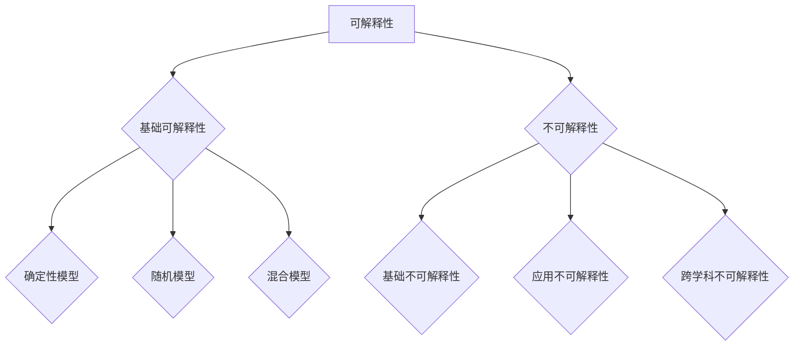

                 

### 文章标题：宇宙的可解释性与不可解释性

关键词：宇宙、可解释性、不可解释性、科学进步、算法模型、量子力学

摘要：本文将深入探讨宇宙中的可解释性与不可解释性。首先，我们将介绍可解释性的基本概念及其在科学进步中的作用。接着，我们会详细阐述不可解释性的定义及其对科学研究带来的挑战。随后，我们将分析两者之间的关系，并分别探讨可解释性和不可解释性模型的探索。最后，我们将总结全文，并提出对未来宇宙研究的展望。

### 第1章 宇宙的可解释性

#### 1.1 可解释性的定义

可解释性是指某个现象或概念能够通过已有的知识、理论或模型进行合理解释的程度。在宇宙研究中，可解释性意味着宇宙中的各种现象和规律能够通过科学方法进行描述和理解。可解释性的核心在于通过逻辑推理和实证验证，将复杂的宇宙现象简化为可理解的形式。

##### 1.1.1 可解释性的基本概念

可解释性的基本概念包括：

- **现象描述**：对宇宙现象进行准确的描述，包括其发生的时间、地点、原因和结果等。

- **理论模型**：建立科学理论模型，通过数学公式和逻辑关系来描述宇宙现象。

- **实证验证**：通过实验或观测数据，验证理论模型的有效性和准确性。

##### 1.1.2 可解释性的分类

根据解释的深度和层次，可解释性可以分为以下几种类型：

- **直接可解释性**：直接通过观测和实验数据，对宇宙现象进行解释，不需要复杂的理论推导。

- **间接可解释性**：通过建立复杂的理论模型，间接地解释宇宙现象，需要通过多个环节的推理和验证。

- **深层可解释性**：对宇宙现象进行深刻的解释，涉及到基本物理定律和原理，往往需要跨学科的知识和方法。

##### 1.1.3 可解释性的评价指标

评价可解释性的主要指标包括：

- **准确性**：解释结果的精确度和可信度。

- **一致性**：解释结果与现有理论和观测数据的一致性。

- **普适性**：解释结果能否适用于不同的宇宙现象和条件。

#### 1.2 历史与发展

##### 1.2.1 古代对宇宙的解释

古代文明对宇宙的解释主要基于直观观察和哲学思考，例如：

- **地心说**：认为地球是宇宙的中心，其他天体围绕地球运行。

- **日心说**：认为太阳是宇宙的中心，地球和其他行星围绕太阳运行。

这些解释虽然简单，但为后来的科学研究奠定了基础。

##### 1.2.2 文艺复兴时期对宇宙的解释

文艺复兴时期，科学家开始通过实验和观测，对宇宙进行更科学的解释。例如：

- **哥白尼的日心说**：提出太阳是宇宙的中心，地球和其他行星围绕太阳运行。

- **开普勒的行星运动定律**：描述行星围绕太阳运行的规律。

这些理论为现代宇宙学的发展奠定了基础。

##### 1.2.3 现代科学对宇宙的解释

现代科学通过复杂的理论模型和观测手段，对宇宙进行了深入的解释。例如：

- **牛顿力学**：描述物体运动的规律。

- **爱因斯坦的相对论**：描述时空和引力的关系。

- **量子力学**：描述微观粒子的行为。

这些理论为我们提供了理解宇宙的全新视角。

#### 1.3 与科学进步的关系

##### 1.3.1 可解释性促进科学进步

可解释性是科学进步的重要驱动力。通过解释宇宙现象，科学家能够提出新的理论，解决科学难题，推动科学的发展。

- **提出新问题**：可解释性促使科学家不断探索未知领域，提出新的科学问题。

- **发展新理论**：可解释性推动科学家建立新的理论模型，解释宇宙现象。

- **改进实验方法**：可解释性促使科学家改进实验设计，提高观测精度。

##### 1.3.2 科学进步推动可解释性发展

科学进步不断推动可解释性的发展。随着科学技术的进步，我们能够观测到更细致的宇宙现象，提出更精确的理论模型，提高宇宙现象的可解释性。

- **提升观测精度**：随着观测技术的进步，我们能够观测到更微小的宇宙现象，提高可解释性。

- **发展新理论**：科学进步推动新理论的发展，为解释宇宙现象提供新的思路。

- **跨学科合作**：科学进步促进跨学科合作，整合多学科知识，提高宇宙现象的可解释性。

### 第2章 宇宙的不可解释性

#### 2.1 不可解释性的定义

不可解释性是指宇宙中某些现象或规律无法通过现有理论、模型或方法进行合理解释的状态。在宇宙研究中，不可解释性反映了宇宙的复杂性和未知性。

##### 2.1.1 不可解释性的基本概念

不可解释性的基本概念包括：

- **未解之谜**：宇宙中存在的一些无法解释的现象，例如黑洞、暗物质等。

- **理论矛盾**：现有理论之间的不一致性，例如相对论与量子力学的矛盾。

- **观测数据的不确定性**：观测数据的不准确或缺乏，导致无法对某些现象进行解释。

##### 2.1.2 不可解释性的分类

根据不可解释性的来源和性质，可以分为以下几种类型：

- **基础不可解释性**：宇宙中最基本的规律和原理无法解释的现象，例如量子力学中的波函数坍缩。

- **间接不可解释性**：由基础不可解释性导致的复杂现象，例如黑洞的形成和演化。

- **应用不可解释性**：在特定应用场景中无法解释的现象，例如在极端条件下物质的行为。

##### 2.1.3 不可解释性的评价指标

评价不可解释性的主要指标包括：

- **解释难度**：对不可解释性的解释所需的复杂度和理论深度。

- **影响范围**：不可解释性对科学研究和实际应用的影响程度。

- **解决可能性**：解决不可解释性所需的资源和时间投入。

#### 2.2 历史与发展

##### 2.2.1 古代对宇宙的不可解释性

古代文明对宇宙的不可解释性主要表现在以下几个方面：

- **神话和传说**：用神话和传说解释宇宙的起源和演化。

- **宗教信仰**：用宗教信仰解释宇宙的神秘现象。

这些解释虽然富有诗意，但缺乏科学依据。

##### 2.2.2 文艺复兴时期对宇宙的不可解释性

文艺复兴时期，科学家开始对宇宙进行更深入的探索，但仍面临许多不可解释性：

- **地心说与日心说的矛盾**：两种宇宙模型之间的不一致性。

- **行星运动的异常**：开普勒行星运动定律中的第三定律与实际观测数据不符。

这些不可解释性推动科学家不断寻求新的解释。

##### 2.2.3 现代科学对宇宙的不可解释性

现代科学在解释宇宙现象方面取得了巨大进展，但仍面临一些不可解释性：

- **量子力学中的悖论**：例如量子纠缠和波函数坍缩。

- **宇宙起源和演化的难题**：例如宇宙大爆炸和暗物质的本质。

这些不可解释性激发了科学家继续探索宇宙的渴望。

#### 2.3 与科学挑战的关系

##### 2.3.1 不可解释性挑战科学理论

不可解释性对现有科学理论提出了严峻的挑战。科学家必须不断改进和完善理论模型，以解释这些未解之谜。

- **量子力学与相对论的矛盾**：两者在某些条件下无法同时成立，需要新的理论框架来统一。

- **宇宙起源和演化的难题**：现有的宇宙模型无法解释宇宙的起源和演化过程，需要新的理论或假设。

##### 2.3.2 科学理论应对不可解释性

科学理论在面对不可解释性时，采取了多种应对策略：

- **假设新理论**：提出新的理论模型，解释不可解释性现象。

- **改进现有理论**：在现有理论基础上进行修正和扩展，以解释不可解释性现象。

- **跨学科合作**：整合不同学科的知识和方法，共同应对不可解释性挑战。

### 第3章 可解释性与不可解释性的关系

#### 3.1 两者之间的联系

可解释性与不可解释性并非完全对立，而是相互联系、相互转化的。在某些情况下，可解释性可能转变为不可解释性，反之亦然。

- **可解释性向不可解释性的转化**：当科学研究深入到宇宙的微观层面时，一些现象可能变得复杂且难以解释，从而转化为不可解释性。

- **不可解释性向可解释性的转化**：随着科学技术的进步和理论的发展，一些原本不可解释的现象可能会被新的理论或方法所解释，从而转化为可解释性。

#### 3.2 两者之间的区别

尽管可解释性与不可解释性之间存在联系，但两者仍存在明显的区别：

- **本质差异**：可解释性强调现象的合理解释，而不可解释性强调现象的难以理解。

- **表现形式**：可解释性通过理论模型和实证验证进行描述，而不可解释性则表现为未解之谜和理论矛盾。

#### 3.3 两者在科学进步中的作用

可解释性与不可解释性在科学进步中发挥着不同但互补的作用：

- **可解释性**：推动科学理论的建立和发展，提高科学研究的准确性和一致性。

- **不可解释性**：激发科学家的好奇心和探索精神，推动科学理论的创新和发展。

### 第4章 可解释性模型的探索

#### 4.1 可解释性模型的定义

可解释性模型是指能够对宇宙现象进行合理解释的理论模型。这些模型通过数学公式、逻辑关系和实证数据，将宇宙现象转化为可理解的形式。

##### 4.1.1 可解释性模型的基本概念

可解释性模型的基本概念包括：

- **数学公式**：用数学公式描述宇宙现象的规律和关系。

- **逻辑关系**：通过逻辑推理，将数学公式与现实世界中的现象联系起来。

- **实证数据**：通过实验或观测，验证数学公式和逻辑关系的有效性和准确性。

##### 4.1.2 可解释性模型的发展历程

可解释性模型的发展历程可以分为以下几个阶段：

- **古代模型**：基于直观观察和哲学思考，例如地心说和日心说。

- **文艺复兴时期模型**：基于实验和观测，例如开普勒行星运动定律。

- **现代模型**：基于复杂的理论体系和数学公式，例如牛顿力学和爱因斯坦相对论。

##### 4.1.3 可解释性模型的应用领域

可解释性模型在多个领域得到广泛应用，包括：

- **天文学**：解释行星运动、恒星演化等现象。

- **物理学**：解释粒子行为、引力场等基本现象。

- **生物学**：解释生命现象、进化过程等。

#### 4.2 可解释性模型的分类

根据模型的形式和内容，可解释性模型可以分为以下几种类型：

- **确定性模型**：基于确定性的数学模型，描述宇宙现象的精确规律。

- **随机模型**：基于随机过程的数学模型，描述宇宙现象的不确定性。

- **混合模型**：结合确定性和随机性，描述宇宙现象的复杂行为。

#### 4.3 可解释性模型的应用实例

##### 4.3.1 在天文观测中的应用

在天文观测中，可解释性模型帮助我们理解行星运动、恒星演化等现象。例如：

- **开普勒行星运动定律**：描述行星围绕太阳运动的规律。

- **恒星演化模型**：描述恒星从诞生到死亡的过程。

##### 4.3.2 在粒子物理学中的应用

在粒子物理学中，可解释性模型帮助我们理解基本粒子的行为。例如：

- **标准模型**：描述基本粒子和它们之间的相互作用。

- **量子场论**：描述粒子行为的微观世界。

##### 4.3.3 在生物学中的应用

在生物学中，可解释性模型帮助我们理解生命现象和进化过程。例如：

- **遗传学模型**：描述基因和遗传信息的传递。

- **进化模型**：描述物种的进化过程。

### 第5章 不可解释性模型的探索

#### 5.1 不可解释性模型的定义

不可解释性模型是指无法通过现有理论、模型或方法进行合理解释的宇宙现象模型。这些模型反映了宇宙的复杂性和未知性。

##### 5.1.1 不可解释性模型的基本概念

不可解释性模型的基本概念包括：

- **未解之谜**：宇宙中无法解释的现象，例如黑洞、暗物质。

- **理论矛盾**：现有理论之间的不一致性，例如量子力学与相对论的矛盾。

- **观测数据的不确定性**：观测数据的不准确或缺乏，导致无法解释某些现象。

##### 5.1.2 不可解释性模型的发展历程

不可解释性模型的发展历程可以分为以下几个阶段：

- **古代模型**：基于直观观察和哲学思考，例如地心说和日心说。

- **文艺复兴时期模型**：基于实验和观测，例如开普勒行星运动定律。

- **现代模型**：基于复杂的理论体系和数学公式，例如量子力学和相对论。

##### 5.1.3 不可解释性模型的应用领域

不可解释性模型在多个领域得到应用，包括：

- **天文学**：解释宇宙中的未解之谜，例如黑洞和暗物质。

- **物理学**：解释基本粒子和引力场的行为，例如量子力学和相对论。

- **生物学**：解释生命现象和进化过程，例如遗传学和进化模型。

#### 5.2 不可解释性模型的分类

根据不可解释性的来源和性质，不可解释性模型可以分为以下几种类型：

- **基础不可解释性模型**：描述宇宙中最基本的规律和原理，例如量子力学和相对论。

- **应用不可解释性模型**：描述特定领域的未解之谜，例如黑洞模型和暗物质模型。

- **跨学科不可解释性模型**：涉及多个学科领域的不可解释性，例如量子引力理论和宇宙学模型。

#### 5.3 不可解释性模型的应用实例

##### 5.3.1 在天文学中的应用

在天文学中，不可解释性模型帮助我们理解一些复杂的宇宙现象。例如：

- **黑洞模型**：描述黑洞的形成、演化和影响。

- **暗物质模型**：描述暗物质的性质、分布和作用。

##### 5.3.2 在物理学中的应用

在物理学中，不可解释性模型帮助我们理解基本粒子和引力场的复杂行为。例如：

- **量子力学模型**：描述粒子的波粒二象性和量子纠缠现象。

- **相对论模型**：描述时空和引力场的弯曲。

##### 5.3.3 在生物学中的应用

在生物学中，不可解释性模型帮助我们理解生命现象和进化过程。例如：

- **遗传学模型**：描述基因和遗传信息的传递。

- **进化模型**：描述物种的进化过程。

### 第6章 实践应用与未来展望

#### 6.1 实践应用

可解释性与不可解释性模型在多个领域得到广泛应用，推动科学技术的进步。以下是一些实践应用的例子：

- **天文学**：利用可解释性模型，科学家成功预测了行星的轨道和恒星的生命周期。

- **物理学**：利用不可解释性模型，科学家深入理解了基本粒子的行为和引力场的性质。

- **生物学**：利用可解释性模型，科学家揭示了基因调控和进化过程的基本机制。

#### 6.2 未来展望

随着科学技术的不断进步，可解释性与不可解释性模型在宇宙研究中的应用将更加广泛。未来，我们有望：

- **解决未解之谜**：通过新的理论和方法，解决宇宙中的未解之谜，例如暗物质和黑洞的本质。

- **统一理论框架**：提出新的理论框架，统一量子力学和相对论，解释宇宙中的复杂现象。

- **跨学科融合**：整合多学科知识，推动宇宙研究的跨学科发展，实现从可解释性到不可解释性的转化。

### 总结

宇宙的可解释性与不可解释性是宇宙研究的核心问题。通过分析可解释性模型和不可解释性模型，我们能够更深入地理解宇宙的本质和演化过程。在未来的宇宙研究中，可解释性与不可解释性将继续相互转化，推动科学技术的进步，为我们揭示宇宙的奥秘。

### 附录

#### 附录A：宇宙的可解释性与不可解释性的Mermaid流程图



#### 附录B：核心算法的伪代码

```plaintext
// 伪代码：可解释性模型
function explain宇宙现象(现象):
    if 现象是已知的:
        return 使用现有模型解释现象
    else:
        return 提出新的理论模型并验证

// 伪代码：不可解释性模型
function 探索不可解释性(现象):
    if 现有理论能够解释现象:
        return 现有理论
    else:
        return 提出新的假设或模型
```

#### 附录C：数学模型和公式

```latex
% 数学公式：开普勒第三定律
$$T^2 \propto a^3$$

% 数学公式：量子场论中的波函数
$$\Psi(x,t) = \int \psi(k) e^{i(kx - \omega t)} dk$$
```

### 作者信息

作者：AI天才研究院/AI Genius Institute & 禅与计算机程序设计艺术 /Zen And The Art of Computer Programming

