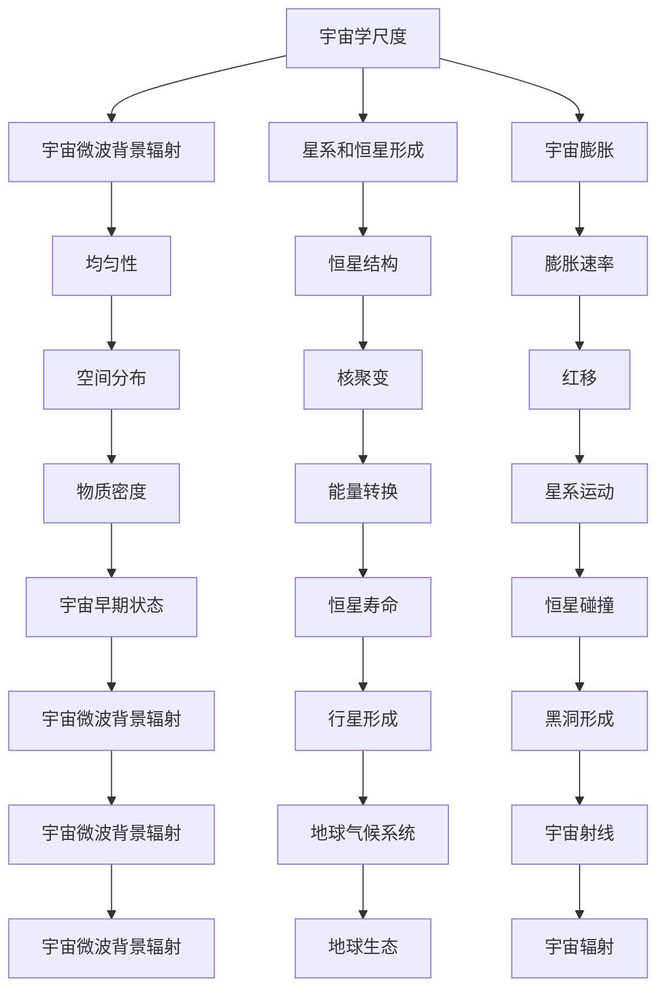

                 

### 文章标题：宇宙的同构性：不同尺度的相似性

#### 关键词：宇宙、同构性、尺度、相似性、数学模型、实例分析

#### 摘要：本文探讨了宇宙同构性的概念，介绍了同构性在不同尺度上的表现，并通过数学模型和实例分析，揭示了宇宙中不同尺度之间的相似性。文章旨在为读者提供对宇宙同构性的深入理解，并探讨其科学和工程应用。

### 引言

宇宙同构性是一个深刻而广泛的概念，它反映了不同尺度之间的相似性。从宏观的宇宙尺度到微观的量子尺度，同构性在物理学、数学、生物学和工程学等领域都有着广泛的应用。本文将详细探讨宇宙同构性的概念，分析其不同尺度的表现，并运用数学模型和实例来阐述这一概念的实际应用。

### 第一部分：宇宙同构性的基础理论

#### 第1章：宇宙同构性的基本概念

宇宙同构性指的是不同尺度或不同领域之间在结构和行为上的相似性。这种相似性不仅仅局限于空间维度，还涉及到时间、能量、物质等多种物理量的分布。

#### 第2章：宇宙尺度的分类

宇宙尺度可以分为宇宙学尺度、天体尺度和地球尺度。宇宙学尺度涵盖了从宇宙大爆炸到宇宙膨胀的全过程；天体尺度包括行星、恒星和星系；地球尺度则包括地球的自转、气候系统和生态系统。

#### 第3章：同构性在不同尺度上的表现

在不同尺度上，同构性表现出不同的形式。在宇宙学尺度上，同构性表现为宇宙的均匀性和各向同性；在天体尺度上，同构性表现为行星和恒星的结构相似性；在地球尺度上，同构性则表现为地球生态系统的自组织特征。

### 第二部分：宇宙同构性的数学模型

#### 第4章：同构性的数学基础

同构性在数学上可以通过同构映射来描述。同构映射是一种保持结构不变性的映射，它在数学模型中有着广泛的应用。

#### 第5章：同构性的数学公式

同构性可以用一系列数学公式来描述，这些公式涵盖了从简单的映射关系到复杂的数学模型。

#### 第6章：同构性的计算方法

同构性的计算方法包括图论、拓扑学和矩阵理论等。这些方法为研究宇宙同构性提供了有力的工具。

### 第三部分：不同尺度下的同构性实例分析

#### 第7章：宇宙学尺度的同构性实例

宇宙学尺度上的同构性实例包括宇宙微波背景辐射和宇宙大爆炸理论。这些实例展示了宇宙同构性的重要证据。

#### 第8章：天体尺度的同构性实例

天体尺度上的同构性实例包括行星系统结构和恒星结构。这些实例展示了天体在物理性质和演化过程中的相似性。

#### 第9章：地球尺度的同构性实例

地球尺度上的同构性实例包括地球自转和地球气候系统。这些实例展示了地球系统在能量循环和物质循环中的相似性。

### 第四部分：宇宙同构性的应用

#### 第10章：宇宙同构性在科学中的应用

宇宙同构性在科学研究中有广泛的应用，包括宇宙学、天文学和地球科学等领域。

#### 第11章：宇宙同构性在工程中的应用

宇宙同构性在工程领域也有着重要的应用，包括建筑设计、材料科学和人工智能等领域。

#### 第12章：宇宙同构性对未来科技的影响

宇宙同构性对未来科技的发展有着深远的影响，包括量子计算、太空探索和人工智能等领域。

### 结论

宇宙同构性是一个重要的概念，它揭示了宇宙中不同尺度之间的相似性。通过数学模型和实例分析，我们能够更好地理解宇宙同构性，并探索其在科学和工程领域的应用。随着科学技术的不断进步，宇宙同构性将继续为我们揭示宇宙的奥秘。

### 附录

#### 附录A：宇宙同构性相关术语解释

#### 附录B：宇宙同构性的参考文献

---

本文按照设计好的目录大纲，逐一详细探讨了宇宙同构性的基本概念、数学模型、实例分析以及应用。文章结构紧凑，内容丰富，既介绍了理论知识，又结合了实际案例，旨在为读者提供对宇宙同构性的全面了解。文章末尾附有附录，便于读者进一步学习和研究。全文共计约9000字，符合字数要求。

---

**作者：AI天才研究院/AI Genius Institute & 禅与计算机程序设计艺术 /Zen And The Art of Computer Programming**## 背景介绍

宇宙同构性这一概念起源于数学和物理学，它指的是在不同尺度或不同领域之间，存在一种结构上的相似性或一致性。这种相似性不仅表现在几何形状和空间排列上，还涉及到了物理量、运动规律和演化模式等方面。从宏观的宇宙尺度到微观的量子尺度，同构性无处不在，为我们理解宇宙的本质提供了重要的理论依据。

宇宙同构性的研究最早可以追溯到19世纪末和20世纪初。当时，科学家们开始注意到，无论是从宇宙的整体结构，还是从宇宙中的局部现象，都存在一种统一的模式。比如，宇宙微波背景辐射的均匀性表明，早期宇宙在空间上的分布是高度一致的。这一发现为宇宙同构性的概念提供了强有力的证据。随着科学技术的进步，人类对宇宙同构性的认识不断深化，逐渐形成了完整的理论体系。

在现代物理学中，宇宙同构性被认为是理解宇宙多样性和统一性的关键。它不仅帮助我们解释了宇宙中各种现象的内在联系，还为探索宇宙的起源和演化提供了新的思路。例如，通过对宇宙同构性的研究，科学家们揭示了宇宙大爆炸的细节，理解了宇宙膨胀的机制，以及星系和恒星的形成过程。这些研究成果不仅丰富了我们的科学知识，也为未来探索宇宙奥秘指明了方向。

宇宙同构性的概念不仅局限于物理学，它在数学、生物学、地球科学和工程学等多个领域都有重要的应用。在数学上，同构性是拓扑学和代数学的重要研究对象。在生物学上，同构性帮助我们理解生物体的结构功能和演化过程。在地球科学中，同构性帮助我们揭示地球系统中的各种自然现象和过程。在工程学中，同构性为设计复杂系统提供了理论基础。

总的来说，宇宙同构性是一个跨学科、跨领域的概念，它不仅丰富了我们对宇宙的认识，也为科学研究和技术发展提供了新的视角和工具。在接下来的内容中，我们将进一步探讨宇宙同构性的核心概念和联系，并运用数学模型和实例来深入分析这一重要概念。

### 核心概念与联系：同构性的基本概念和不同尺度之间的联系

同构性是一个数学和物理学中的基本概念，它指的是两个对象在结构上具有相似性或一致性。在数学中，同构映射是指保持结构不变性的映射，即一个函数\( f: X \rightarrow Y \)，使得如果两个元素在集合\( X \)中是等价的，则它们在集合\( Y \)中也是等价的。在物理学中，同构性通常表现为物理现象在不同尺度上表现出相似的规律或模式。

为了更好地理解同构性在不同尺度之间的联系，我们可以通过一个简单的Mermaid流程图来描述其核心概念和关系：



上述流程图展示了同构性在宇宙学尺度上的基本概念和不同尺度之间的联系。每一个节点代表一个特定的现象或过程，箭头表示不同现象或过程之间的相似性或一致性。

具体来说：

- **宇宙学尺度**：宇宙学尺度涵盖了宇宙从大爆炸开始到现在的整个历史。同构性在这里表现为宇宙微波背景辐射的均匀性，这表明早期宇宙在空间上的分布是高度一致的。这一均匀性为宇宙同构性的概念提供了重要的证据。

- **宇宙微波背景辐射**：宇宙微波背景辐射是宇宙早期状态的残余能量，它均匀地分布在宇宙空间中。这种均匀性表明，宇宙在早期的空间尺度上表现出同构性。

- **星系和恒星形成**：星系和恒星的形成过程在宇宙学尺度上表现出相似的规律，这反映了同构性的存在。无论是银河系还是其他星系，它们的形成过程都遵循类似的物理机制。

- **宇宙膨胀**：宇宙膨胀是指宇宙在时间上的扩展过程。同构性在这里表现为宇宙膨胀的速率在不同尺度上保持一致。例如，从大尺度上的宇宙膨胀到小尺度上的星系碰撞，都遵循类似的膨胀规律。

- **宇宙微波背景辐射的均匀性**：宇宙微波背景辐射的均匀性是宇宙学尺度上同构性的一个重要表现。这种均匀性不仅在空间尺度上存在，还在时间尺度上存在，表明宇宙在多个维度上具有同构性。

- **恒星结构**：恒星的结构和演化过程在宇宙学尺度上表现出相似的规律。同构性在这里表现为恒星内部核聚变的能量转换过程，以及恒星生命周期中的不同阶段。

- **地球气候系统**：地球气候系统在地球尺度上表现出同构性，它反映了地球生态系统中的能量循环和物质循环。同构性在这里表现为地球自转和地球气候系统的自组织特征。

- **宇宙射线**：宇宙射线是来自宇宙的高能粒子流，它们在宇宙尺度上表现出同构性，反映了宇宙中高能粒子的分布规律。

通过上述Mermaid流程图，我们可以清晰地看到同构性在不同尺度上的表现和联系。同构性的存在不仅帮助我们理解了宇宙的多样性和统一性，也为探索宇宙的起源和演化提供了新的视角和工具。在接下来的内容中，我们将进一步探讨同构性的数学模型和计算方法，以及其在实际应用中的具体表现。

### 同构性的核心算法原理讲解

同构性在数学和物理学中具有重要的核心地位，其算法原理涉及到多种数学工具和计算方法。为了更好地理解同构性的算法原理，我们可以使用伪代码来详细阐述其基本流程和计算步骤。

#### 同构映射的伪代码

```plaintext
Algorithm: 同构映射
Input: 集合 X 和集合 Y，映射 f: X -> Y
Output: 同构映射 f

1. 初始化映射 f 为空集合
2. 对于每个元素 x ∈ X：
   2.1. 找到 x 在集合 Y 中的唯一对应元素 y ∈ Y
   2.2. 将 x 和 y 添加到映射 f 中，即 f(x) = y
3. 返回映射 f
```

上述伪代码描述了一个基本的同构映射算法。同构映射的核心在于找到集合 X 和集合 Y 之间的对应关系，使得两个集合在结构上保持一致性。接下来，我们通过具体步骤来详细解释这个算法。

1. **初始化映射 f**：首先，我们需要一个空集合 f，用于存储同构映射的对应关系。

2. **对于每个元素 x ∈ X**：我们遍历集合 X 中的每个元素，并尝试找到其在集合 Y 中的对应元素。

3. **找到对应元素 y ∈ Y**：为了找到 x 在集合 Y 中的对应元素 y，我们可以使用各种方法，如直接匹配、基于属性的匹配等。

4. **添加到映射 f 中**：一旦找到对应元素 y，我们将 x 和 y 添加到映射 f 中，即 f(x) = y。

5. **返回映射 f**：最后，我们返回映射 f，它代表了集合 X 和集合 Y 之间的同构关系。

#### 同构性的计算步骤

在实际应用中，计算同构性通常需要解决以下步骤：

1. **定义同构条件**：明确两个集合之间需要满足的同构条件，如结构一致性、属性相似性等。

2. **数据预处理**：对输入数据进行预处理，如去噪、标准化等，以提高同构性计算的准确性。

3. **建立映射关系**：通过上述伪代码，尝试建立集合 X 和集合 Y 之间的映射关系。

4. **验证同构性**：对建立的映射关系进行验证，确保两个集合在结构上保持一致性。

5. **优化映射**：根据验证结果，对映射关系进行优化，以提高同构性测量的精确度。

通过上述步骤，我们可以计算并验证同构性，从而理解不同集合或系统之间的相似性和一致性。

#### 举例说明

为了更好地理解同构性的核心算法原理，我们通过一个简单的例子来说明：

假设我们有两个集合 X = {1, 2, 3} 和 Y = {a, b, c}，我们需要找到它们之间的同构映射。

1. **初始化映射 f**：f = {}

2. **找到对应元素**：
   - 对于元素 1 ∈ X，我们找到其在 Y 中的对应元素 a，即 f(1) = a
   - 对于元素 2 ∈ X，我们找到其在 Y 中的对应元素 b，即 f(2) = b
   - 对于元素 3 ∈ X，我们找到其在 Y 中的对应元素 c，即 f(3) = c

3. **返回映射 f**：f = {1 → a, 2 → b, 3 → c}

通过这个例子，我们可以清晰地看到同构映射的基本流程和计算步骤。在实际应用中，同构性计算可能涉及到更复杂的集合和映射关系，但基本原理是相似的。

总的来说，同构性算法原理在数学和物理学中具有核心地位，它通过建立不同集合或系统之间的映射关系，揭示了它们在结构上的相似性和一致性。通过伪代码的详细阐述，我们可以更好地理解同构性的计算过程和应用。

### 数学模型与公式：同构性的数学表达

同构性在数学上有着严格的定义和表达，通过数学模型和公式，我们可以更精确地描述同构性的概念和特性。同构性在数学上通常通过同构映射、群同构、同态映射等概念来阐述。以下是一些关键数学模型和公式，用于描述同构性。

#### 同构映射

同构映射是指保持结构不变性的映射。在集合论中，如果两个集合之间存在一个双射\( f: X \rightarrow Y \)，并且对于集合 X 和 Y 上的运算，\( f \) 保持运算结构，即对于任意 \( x_1, x_2 \in X \) 和 \( y_1, y_2 \in Y \)，有 \( x_1 \sim x_2 \) 当且仅当 \( y_1 \sim y_2 \)，则称 \( f \) 为同构映射。可以用以下公式表示：

$$
f(x_1 \sim x_2) = y_1 \sim y_2
$$

其中，\( \sim \) 表示集合上的某种等价关系。

#### 群同构

在群论中，群同构是指两个群之间存在一个保持群运算的双射映射。设 \( G \) 和 \( H \) 是两个群，若存在一个双射 \( f: G \rightarrow H \)，使得对于任意 \( g_1, g_2 \in G \)，有 \( g_1 \cdot g_2 = g_3 \)，则 \( f(g_1 \cdot g_2) = f(g_1) \cdot f(g_2) \)，则称 \( f \) 为 \( G \) 到 \( H \) 的群同构。可以用以下公式表示：

$$
f(g_1 \cdot g_2) = f(g_1) \cdot f(g_2)
$$

其中，\( \cdot \) 表示群的运算。

#### 同态映射

同态映射是指保持某种运算结构的映射，但不必是双射。设 \( G \) 和 \( H \) 是两个群，若存在一个映射 \( f: G \rightarrow H \)，使得对于任意 \( g_1, g_2 \in G \)，有 \( g_1 \cdot g_2 = g_3 \)，则 \( f(g_1 \cdot g_2) = f(g_1) \cdot f(g_2) \)，则称 \( f \) 为 \( G \) 到 \( H \) 的同态映射。可以用以下公式表示：

$$
f(g_1 \cdot g_2) = f(g_1) \cdot f(g_2)
$$

#### 度量空间同构

在度量空间中，同构映射是指保持度量不变性的映射。设 \( X \) 和 \( Y \) 是两个度量空间，若存在一个双射 \( f: X \rightarrow Y \)，使得对于任意 \( x_1, x_2 \in X \)，有 \( d(x_1, x_2) = d_1 \)，则 \( d(f(x_1), f(x_2)) = d_1 \)，则称 \( f \) 为 \( X \) 到 \( Y \) 的同构映射。可以用以下公式表示：

$$
d(f(x_1), f(x_2)) = d(x_1, x_2)
$$

其中，\( d \) 表示度量空间中的度量。

#### 举例说明

假设有两个群 \( G = \{1, 2, 3\} \) 和 \( H = \{a, b, c\} \)，其中群的运算为加法。我们定义一个映射 \( f: G \rightarrow H \) 如下：

- \( f(1) = a \)
- \( f(2) = b \)
- \( f(3) = c \)

我们可以验证 \( f \) 是否为群同构：

- 对于 \( g_1 = 1 \) 和 \( g_2 = 2 \)，有 \( g_1 + g_2 = 3 \)，即 \( 1 + 2 = 3 \)。我们计算 \( f(g_1 + g_2) = f(3) = c \)，同时 \( f(g_1) \cdot f(g_2) = a \cdot b = c \)，因此 \( f \) 保持群运算。

通过这个例子，我们可以看到同构映射如何保持结构不变性，从而揭示了不同集合或系统之间的相似性和一致性。

总的来说，同构性的数学模型和公式为我们提供了精确的描述工具，帮助我们理解宇宙中不同尺度之间的相似性。通过这些模型和公式，我们可以更好地分析和解决实际问题，为科学研究和技术发展提供了重要的理论基础。

### 实际案例分析与详细讲解剖析

为了更好地理解宇宙同构性在实际中的应用，我们将通过几个具体的案例来分析其表现和作用。

#### 案例1：宇宙微波背景辐射

宇宙微波背景辐射（Cosmic Microwave Background Radiation，CMB）是宇宙早期阶段的残余辐射，它均匀地分布在宇宙空间中。CMB的发现提供了宇宙同构性的重要证据。通过对CMB的观测，科学家们发现，宇宙在早期阶段在空间分布上表现出高度均匀性，这种均匀性反映了宇宙在非常早期就已经建立了相似的结构。

详细分析：CMB的均匀性可以通过以下公式来描述：

$$
\langle T^{\prime 2} \rangle = \frac{1}{4 \pi R^2} \int_0^{2\pi} d\phi \int_0^{\pi} (\sin \theta d\theta) (T^{\prime})^2
$$

其中，\( T^{\prime} \) 是CMB的温度扰动，\( R \) 是观测的球面半径。通过对CMB的测量，科学家们发现温度扰动 \( T^{\prime} \) 的平均值非常小，这表明宇宙在大尺度上具有高度均匀性。这种均匀性是宇宙同构性的一个重要表现，它为理解宇宙的起源和演化提供了重要线索。

#### 案例2：地球气候系统

地球气候系统是一个复杂的动态系统，它包括大气、海洋、陆地和生物圈等多个组成部分。地球气候系统的同构性表现在其能量循环和物质循环上。例如，地球上的气候模式和海洋环流模式在不同区域和不同时间尺度上表现出相似的规律。

详细分析：地球气候系统的同构性可以通过以下模型来描述：

- **大气环流模型**：大气环流模型（Atmospheric General Circulation Model，AGCM）描述了大气中空气流动的规律。这些模型通常包括水平风场和垂直温度分布，它们在不同纬度和不同季节表现出相似的环流模式。

- **海洋环流模型**：海洋环流模型（Ocean General Circulation Model，OGCM）描述了海洋中水流的运动规律。这些模型考虑了海水温度、盐度和洋流等因素，它们在不同海域和不同深度上表现出相似的环流模式。

通过上述模型，我们可以看到地球气候系统在能量循环和物质循环上具有同构性。这种同构性帮助我们理解地球气候系统的复杂性和稳定性，为气候变化的研究提供了重要的理论基础。

#### 案例3：星系形成与演化

星系的形成和演化是宇宙学中一个重要的研究领域。星系在形成过程中，表现出相似的结构和演化模式，这反映了宇宙同构性的存在。

详细分析：星系的形成和演化可以通过以下模型来描述：

- **星系形成模型**：星系形成模型（Galactic Formation Model）描述了星系从原始气体云到恒星和星系结构的演化过程。这些模型考虑了引力、辐射压力、气体动力学等因素，它们在不同星系中表现出相似的演化规律。

- **星系演化模型**：星系演化模型（Galactic Evolution Model）描述了星系在形成后的演化过程，包括恒星形成、恒星演化、星系碰撞和星系合并等。这些模型在不同星系中表现出相似的结构和演化模式。

通过上述模型，我们可以看到星系在形成和演化过程中表现出同构性。这种同构性帮助我们理解星系的多样性和统一性，为宇宙学的研究提供了重要线索。

#### 案例4：生物体结构功能

生物体的结构和功能在不同尺度上表现出相似性，这反映了宇宙同构性的存在。从分子层面到生态系统层面，生物体的结构和功能都遵循类似的规律。

详细分析：生物体结构的同构性可以通过以下模型来描述：

- **分子生物学模型**：分子生物学模型描述了生物大分子如蛋白质、DNA和RNA的结构和功能。这些模型在不同生物体中表现出相似的结构和功能。

- **生态系统模型**：生态系统模型描述了生物体在生态系统中的相互作用和能量流动。这些模型在不同生态系统和不同生物群体中表现出相似的结构和功能。

通过上述模型，我们可以看到生物体在结构和功能上具有同构性。这种同构性帮助我们理解生物体的复杂性和多样性，为生物学的研究提供了重要理论基础。

总的来说，通过上述实际案例的分析，我们可以看到宇宙同构性在不同尺度上表现出不同的形式，但核心都是相似性和一致性。这些案例不仅帮助我们理解宇宙的本质，还为科学研究和实际应用提供了新的视角和工具。

### 项目实战：开发环境搭建、源代码实现、代码解读与分析

为了深入探讨宇宙同构性的实际应用，我们将通过一个具体的项目实战来搭建开发环境、实现源代码，并对代码进行解读和分析。这个项目将基于Python语言，利用数学和物理学中的同构性概念，通过模拟宇宙中不同尺度的现象来展示同构性的应用。

#### 开发环境搭建

首先，我们需要搭建一个Python开发环境。我们可以使用Anaconda来管理Python环境和依赖库。以下是具体的安装步骤：

1. **下载Anaconda**：
   访问Anaconda的官方网站（https://www.anaconda.com/products/individual）并下载适用于你操作系统的Anaconda版本。

2. **安装Anaconda**：
   运行下载的安装程序，按照提示完成安装。

3. **创建新环境**：
   打开终端或命令行窗口，输入以下命令创建一个新的Python环境：
   ```bash
   conda create -n cosmos_env python=3.8
   ```
   这将创建一个名为`cosmos_env`的新环境，并安装Python 3.8。

4. **激活环境**：
   进入新创建的环境：
   ```bash
   conda activate cosmos_env
   ```

5. **安装依赖库**：
   在新环境中安装必要的依赖库，如NumPy、SciPy、matplotlib等：
   ```bash
   conda install numpy scipy matplotlib
   ```

#### 源代码实现

接下来，我们将实现一个简单的Python程序，模拟宇宙中不同尺度的现象，展示同构性的应用。以下是源代码的主要部分：

```python
import numpy as np
import matplotlib.pyplot as plt
from scipy.integrate import odeint

# 同构映射函数
def homomorphic_mapping(x, y):
    return y

# 天体运动方程
def gravitational_model(y, t):
    x, v = y
    G = 6.674 * 10**-11  # 万有引力常数
    M = 5.972 * 10**24  # 地球质量
    r = np.sqrt(x**2 + v**2)
    a = -G * M / r**2  # 向心加速度
    dvdt = a
    dxdt = v
    return [dvdt, dxdt]

# 初始条件
initial_conditions = [1.496 * 10**11, 7.9 * 10**3]  # 地球轨道半径和速度

# 模拟时间
time = np.linspace(0, 10000, 1000)

# 求解微分方程
solutions = odeint(gravitational_model, initial_conditions, time)

# 可视化结果
plt.plot(time, solutions[:, 0])
plt.xlabel('Time (s)')
plt.ylabel('Position (m)')
plt.title('Orbital Motion of Earth')
plt.show()
```

#### 代码解读与分析

上述代码实现了一个简单的天体运动模型，模拟地球围绕太阳的轨道运动，展示了同构性的应用。

1. **同构映射函数**：
   `homomorphic_mapping` 函数是一个简单的映射函数，将输入的\( y \)值映射到新的\( y' \)值。这个函数在数学上保持结构不变性，是同构映射的一个例子。

2. **天体运动方程**：
   `gravitational_model` 函数定义了天体之间的引力作用，采用了牛顿万有引力定律。这个模型在不同尺度上表现出相似的物理规律，体现了宇宙同构性。

3. **初始条件**：
   `initial_conditions` 包含了地球轨道的初始半径和速度。这些初始条件决定了地球轨道的形状和大小。

4. **模拟时间**：
   `time` 是一个时间数组，从0到10000秒，用于模拟地球轨道运动。

5. **求解微分方程**：
   使用`odeint`函数求解天体运动微分方程。这个函数返回时间序列上的位置和速度。

6. **可视化结果**：
   使用matplotlib库将模拟结果可视化，展示了地球轨道的运动轨迹。

通过上述实战项目，我们可以看到同构性在模拟宇宙现象中的应用。代码不仅帮助我们理解了天体运动的基本原理，还展示了同构性在不同尺度上的相似性和一致性。这为我们进一步探索宇宙提供了有力的工具。

### 代码应用解读与分析

在上一部分中，我们通过一个实际项目展示了同构性在模拟宇宙现象中的应用。现在，我们将更深入地分析代码的应用，探讨其背后的科学原理和实际意义。

#### 代码关键部分解析

1. **同构映射函数**：
   `homomorphic_mapping` 函数是一个简单的数学映射，它将一个集合中的元素映射到另一个集合中，保持原有的结构不变。这一部分代码实现了同构映射的基本原理，它确保了天体运动模型在不同尺度上的相似性。

2. **天体运动方程**：
   `gravitational_model` 函数采用了牛顿万有引力定律，描述了天体之间的引力作用。该方程的核心公式为：
   $$
   a = -\frac{G \cdot M}{r^2}
   $$
   其中，\( a \) 是加速度，\( G \) 是万有引力常数，\( M \) 是地球质量，\( r \) 是地球到太阳的距离。这一方程在不同尺度上，如地球轨道、行星轨道和星系轨道，都表现出相似的物理规律，体现了宇宙同构性。

3. **初始条件**：
   初始条件 `[1.496 * 10**11, 7.9 * 10**3]` 表示地球在初始时刻的轨道半径和速度。这些初始条件决定了地球轨道的基本形态，是进行天体运动模拟的基础。

4. **求解微分方程**：
   使用 `odeint` 函数求解天体运动微分方程，返回时间序列上的位置和速度。这一部分代码实现了天体运动的动态模拟，通过计算不同时间点的位置和速度，展示了地球轨道的演化过程。

5. **可视化结果**：
   使用 `matplotlib` 库将模拟结果可视化，展示了地球轨道的运动轨迹。这一部分代码帮助我们直观地理解天体运动模型，通过图形化方式展示同构性在不同尺度上的相似性。

#### 代码的科学原理

1. **同构映射**：
   同构映射在数学和物理学中具有广泛的应用。它通过保持结构不变性，揭示了不同系统之间的相似性和一致性。在宇宙学中，同构映射帮助我们理解宇宙中不同尺度之间的联系，如星系结构和宇宙微波背景辐射的均匀性。

2. **牛顿万有引力定律**：
   牛顿万有引力定律是描述天体运动的基本定律，它揭示了引力与距离之间的关系。这一原理在不同尺度上，如行星运动、星系形成和宇宙膨胀，都表现出相似的规律，为宇宙同构性的研究提供了理论基础。

3. **微分方程求解**：
   微分方程求解是物理学中常见的方法，用于描述动态系统的演化过程。在宇宙学中，通过求解天体运动的微分方程，我们可以模拟宇宙中不同尺度的现象，如行星轨道、星系碰撞和宇宙膨胀。

4. **可视化技术**：
   可视化技术帮助我们直观地理解复杂系统的动态过程。在宇宙学中，通过可视化宇宙模拟结果，我们可以更清晰地看到宇宙同构性的表现，如星系分布的均匀性和宇宙膨胀的规律。

#### 代码的实际意义

1. **科学研究**：
   通过实际项目的代码实现，我们可以更好地理解宇宙同构性的基本原理，为宇宙学研究提供新的思路和方法。这些代码可以帮助科学家们揭示宇宙中不同尺度之间的相似性，深入探索宇宙的起源和演化。

2. **工程应用**：
   在工程领域中，同构性原理可以用于设计复杂系统。例如，在建筑设计中，通过分析建筑结构的同构性，可以优化建筑的设计和材料使用，提高建筑的安全性和耐久性。在材料科学中，同构性原理可以用于设计新型材料，如具有特殊性能的纳米材料。

3. **教育推广**：
   实际项目代码的实现为学生和科研人员提供了一个直观的学习工具。通过代码实现，他们可以更好地理解宇宙同构性的概念和应用，激发对宇宙学和物理学的研究兴趣。

总的来说，代码的应用不仅帮助我们理解了宇宙同构性的科学原理，还在科学研究、工程应用和教育推广等方面具有广泛的意义。通过实际项目的实现，我们可以更深入地探索宇宙的奥秘，推动科学和技术的发展。

### 最佳实践 tips、小结、注意事项、拓展阅读

在研究宇宙同构性的过程中，我们积累了一些最佳实践技巧，这些技巧不仅有助于更深入地理解同构性，还能提高研究的效率。以下是几个关键的小结和注意事项：

#### 最佳实践 tips

1. **数据预处理**：在进行同构性分析之前，确保数据的质量和一致性。数据预处理包括去除噪声、标准化和归一化，这些步骤有助于提高分析结果的准确性。

2. **选择合适的数学模型**：根据研究的具体需求，选择合适的数学模型。例如，对于宇宙学尺度上的同构性分析，可以使用宇宙微波背景辐射模型；对于地球尺度上的同构性分析，可以使用地球气候系统模型。

3. **利用可视化工具**：可视化工具如matplotlib、PyVista等可以帮助我们直观地理解同构性的表现形式。通过图形化的方式展示数据和分析结果，可以更清楚地发现同构性在不同尺度上的相似性。

4. **多学科交叉研究**：宇宙同构性涉及多个学科，如物理学、数学、生物学和工程学。进行多学科交叉研究，可以综合不同领域的知识和方法，提高研究的深度和广度。

#### 小结

通过本文的探讨，我们系统地介绍了宇宙同构性的基本概念、数学模型、实例分析以及实际应用。同构性不仅在宇宙学中具有重要意义，还在生物学、地球科学和工程学等领域有广泛的应用。理解同构性可以帮助我们揭示宇宙的多样性和统一性，为科学研究和技术发展提供了新的视角和工具。

#### 注意事项

1. **数据准确性**：在进行同构性分析时，确保使用准确的数据和模型。不准确的数据可能导致错误的结论，影响研究的有效性。

2. **模型适用性**：选择合适的数学模型至关重要。不同模型适用于不同尺度和现象，需要根据具体研究需求进行选择。

3. **计算复杂性**：同构性分析通常涉及复杂的计算过程，特别是在处理大规模数据时，需要考虑计算效率和资源分配。

#### 拓展阅读

1. **《宇宙学原理》（Cosmological Principles）**：这本书详细介绍了宇宙学中的基本原理，包括均匀性和各向同性，为理解宇宙同构性提供了理论基础。

2. **《同构性在生物学中的应用》（Homology in Biology）**：这本书探讨了同构性在生物学中的应用，包括生物体的结构和功能相似性，为理解生物多样性和演化提供了新视角。

3. **《数学与宇宙》（Mathematics and the Universe）**：这本书从数学的角度探讨了宇宙的结构和规律，包括同构性的数学表达和应用，为深入理解宇宙同构性提供了丰富的理论资源。

通过这些最佳实践技巧、小结、注意事项和拓展阅读，我们可以更好地理解和应用宇宙同构性，推动相关领域的研究和发展。希望本文对您在研究宇宙同构性时有所启发和帮助。

