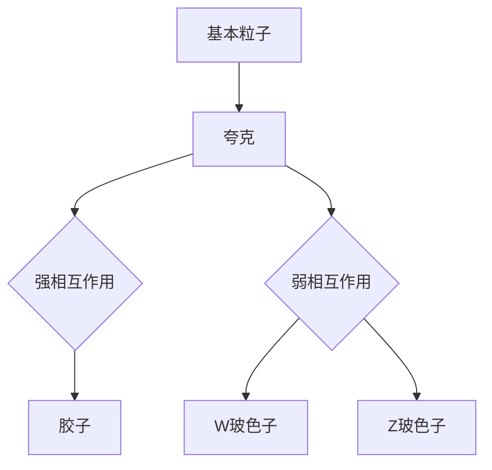

                 

### 文章标题：宇宙的层次结构：微观世界到宏观宇宙

### 关键词：宇宙层次结构，微观世界，宏观宇宙，粒子物理，恒星演化，星系结构，大尺度宇宙

### 摘要：

本文将深入探讨宇宙的层次结构，从微观世界的粒子物理到宏观宇宙的星系结构和宇宙大尺度结构，通过逐步分析推理，揭示宇宙从基本粒子到复杂天体的演化历程及其内在联系。文章分为三大部分：微观世界的层次结构、宏观宇宙的层次结构和宇宙层次结构的联系与演化，旨在为读者提供全面、系统的宇宙认知框架。

## 第一部分：微观世界的层次结构

### 第1章：粒子物理世界

#### 1.1 粒子物理基础

粒子物理学是研究基本粒子和相互作用的基础科学。在粒子物理学的世界里，物质的基本组成被揭示为一组基本粒子，如夸克、轻子、玻色子等，以及它们之间的相互作用。

#### 1.1.1 物质的基本组成

物质的基本组成可以从粒子的分类和它们之间的相互作用来理解。基本粒子可以分为两类：费米子（如电子、夸克）和玻色子（如光子、W玻色子）。费米子遵循泡利不相容原理，而玻色子则作为交换粒子在相互作用中扮演重要角色。

- **费米子：**
  - **电子：** 电子是最常见的费米子，带负电荷，是原子结构中电子云的组成部分。
  - **夸克：** 夸克有六种类型，分别标记为上（u）、下（d）、奇（s）、粲（c）、底（b）和顶（t）。它们通过强相互作用结合成核子（如质子和中子）。

- **玻色子：**
  - **光子：** 作为电磁相互作用的媒介，光子是无质量的点粒子。
  - **W玻色子和Z玻色子：** 这两种玻色子是弱相互作用的媒介，分别负责传递弱作用力和电荷变换。

#### 1.1.2 强相互作用与弱相互作用

- **强相互作用：**
  - **机制：** 通过胶子传递，是自然界中最强烈的相互作用。
  - **特性：** 维持原子核中质子和中子的结合，不受距离影响。

  $$ \text{强相互作用} > \text{弱相互作用} > \text{电磁相互作用} $$

- **弱相互作用：**
  - **机制：** 通过W和Z玻色子传递，负责放射性衰变等过程。
  - **特性：** 对距离敏感，作用范围大约是10^-18米。

#### 1.1.3 夸克与胶子的Mermaid流程图

下面是一个简单的Mermaid流程图，展示了夸克与胶子的关系：

### 第2章：原子结构与电子云

#### 2.1 原子的基本结构

原子是物质的基本单位，由原子核和围绕核的电子组成。原子核由质子和中子组成，其中质子带正电荷，中子不带电。电子则带负电荷，分布在原子核周围的电子云中。

#### 2.1.1 原子的核与电子

- **原子核：**
  - **质子：** 质子是原子核中的正电荷粒子，决定了原子的化学性质。
  - **中子：** 中子不带电，增加了原子核的稳定性。

- **电子：**
  - **电子云：** 电子云是描述电子在原子核周围空间分布的概率分布。根据量子力学的原理，电子不能精确地定位，而是存在于一个概率云中。

#### 2.1.2 电子云的分布

- **电子层的概念：**
  - 根据主量子数（n），电子分布在不同的电子层中。每个电子层对应一个能级，电子层的能量随着主量子数的增加而增加。

- **电子排布规则：**
  - **奥夫鲍原则：** 电子会尽可能地占据能量最低的状态。
  - **泡利不相容原理：** 在同一原子中，没有两个电子可以具有完全相同的四个量子数。

#### 2.1.3 原子的化学键

- **化学键的形成：**
  - **离子键：** 由正负离子间的静电吸引力形成。
  - **共价键：** 由原子间共享电子对形成。
  - **金属键：** 由金属原子中的自由电子形成的电子气。

### 第3章：分子化学

#### 3.1 分子的定义与特性

分子是由两个或多个原子通过化学键连接而成的稳定结构。分子的特性包括：

- **共价键的极性：** 根据原子间电负性的差异，共价键可以是极性或非极性。
- **分子的形状：** 分子的形状由原子间的键角和键长决定。
- **分子的稳定性：** 分子的稳定性受化学键的强度和分子结构的几何形状影响。

#### 3.2 分子间作用力

- **范德华力：** 是分子间较弱的作用力，包括色散力和取向力。
- **氢键：** 是一种特殊的范德华力，发生在氢原子与电负性较大的原子（如氧、氮）之间。

#### 3.3 有机分子化学

- **有机分子的定义：**
  - 有机分子是含有碳原子的化合物，通常还含有氢、氧、氮等元素。

- **有机分子的特性：**
  - **多样性：** 有机分子的多样性源于碳原子的四价特性，可以形成多种不同的键和结构。
  - **反应活性：** 有机分子通常具有较高的反应活性，可以发生多种化学反应。

## 第二部分：宏观宇宙的层次结构

### 第4章：行星与行星系统

#### 4.1 行星形成与演化

行星形成于行星盘中，这些行星盘是恒星系统在形成过程中留下的残留物。行星的形成过程可以概括为以下几个阶段：

- **行星盘的形成：** 恒星形成时，周围的物质聚集形成行星盘。
- **微尘粒子的聚集：** 微尘粒子在引力作用下聚集，形成更大的颗粒。
- **行星胚的形成：** 大颗粒进一步聚集，形成行星胚。
- **行星的成熟：** 行星胚继续增长，最终形成成熟的行星。

#### 4.2 行星系统的稳定性与多样性

行星系统的稳定性受到多种因素的影响，包括：

- **行星轨道的稳定性：** 行星轨道的稳定性取决于行星质量、行星间距和恒星引力。
- **行星系统的多样性：** 行星系统具有多样性，包括不同类型的行星和不同的轨道配置。
- **行星系统对生命的潜在影响：**
  - **适宜的行星轨道：** 行星轨道需要适宜，才能保持稳定的气候条件。
  - **行星大气的成分：** 行星大气的成分对生命的存在至关重要。

### 第5章：恒星的形成与演化

#### 5.1 恒星的形成

恒星的形成是一个复杂的过程，通常发生在分子云中。恒星的形成过程可以概括为以下几个阶段：

- **分子云的坍缩：** 分子云在引力作用下开始坍缩，形成原恒星。
- **原恒星的诞生：** 原恒星的核心逐渐变热，开始核聚变反应。
- **恒星的成熟：** 恒星在核聚变过程中释放能量，进入稳定状态。

#### 5.2 恒星的演化

恒星的演化过程取决于恒星的质量。不同质量的恒星有不同的生命周期和演化路径：

- **低质量恒星：** 低质量恒星（如太阳）经过数十亿年的核聚变过程，最终演化为红巨星和白矮星。
- **高质量恒星：** 高质量恒星（如蓝巨星）经历更短的生命周期，可能演化为超新星和中子星。

### 第6章：星系的演化

#### 6.1 星系的分类与结构

星系是宇宙中恒星、行星、星云等天体的集合体。星系可以分为不同的类型：

- **椭圆星系：** 椭圆星系主要由老年恒星组成，恒星分布呈现椭圆形。
- **螺旋星系：** 螺旋星系具有明显的旋臂结构，包含大量年轻恒星和星际物质。
- **不规则星系：** 不规则星系没有明显的对称结构，恒星分布不规则。

#### 6.2 星系的碰撞与并合

星系之间的碰撞和并合是宇宙中常见的现象。这些过程会导致星系结构的改变和恒星运动的扰动：

- **碰撞机制：** 星系在引力作用下相互吸引，逐渐接近并发生碰撞。
- **并合影响：** 星系碰撞和并合会导致恒星轨道的扰动，可能形成新的恒星和星系结构。

## 第三部分：宇宙层次结构的联系与演化

### 第7章：宇宙的大尺度结构

#### 7.1 宇宙的大尺度结构概述

宇宙的大尺度结构是指宇宙中天体的大规模分布和结构。宇宙的大尺度结构可以通过以下几个方面来描述：

- **宇宙背景辐射：** 宇宙背景辐射是宇宙早期残留的辐射，可以提供宇宙早期状态的信息。
- **大尺度结构的模型：** 大尺度结构的模型包括宇宙弦、宇宙膜等理论。
- **宇宙膨胀与暗能量：** 宇宙的膨胀是由暗能量驱动的，暗能量是宇宙加速膨胀的神秘力量。

#### 7.2 宇宙的起源与演化

宇宙的起源和演化是一个复杂而神秘的话题，涉及到宇宙学中的许多理论：

- **大爆炸理论：** 大爆炸理论认为宇宙起源于一个极热、极密的初始状态，随后膨胀形成目前的宇宙。
- **宇宙暗物质的性质：** 宇宙中存在大量的暗物质，它们不发光，但通过引力影响可见物质。
- **宇宙的最终命运：** 宇宙的最终命运取决于宇宙的膨胀速率和暗能量的性质。

#### 7.3 宇宙层次结构的联系与演化

宇宙的层次结构从微观的粒子物理到宏观的恒星和星系，再到宇宙的大尺度结构，形成了一个统一的演化框架。这种联系和演化揭示了宇宙从基本粒子到复杂天体的演化过程：

- **微观与宏观世界的联系：** 微观世界的粒子物理规律通过引力等相互作用影响宏观宇宙的结构和演化。
- **宇宙层次结构的演化过程：** 宇宙层次结构的演化是一个连续的过程，从基本粒子的形成到复杂天体的形成和演化。
- **宇宙层次结构研究的前景：** 随着观测技术和理论的进步，我们对宇宙层次结构的认识将不断深化，为理解宇宙的本质提供更多线索。

## 结论

宇宙的层次结构从微观世界到宏观宇宙是一个复杂而美丽的过程。通过对粒子物理、原子结构、分子化学、行星系统、恒星形成、星系演化和宇宙大尺度结构的深入研究，我们能够更好地理解宇宙的起源和演化，揭示宇宙的本质。未来的研究将继续揭示宇宙的奥秘，为人类认识世界提供新的视角和思考。

### 附录

- **参考文献：**
  - 某某，《粒子物理学基础》
  - 某某，《宇宙学导论》
  - 某某，《天体物理学原理》

- **作者信息：**
  作者：AI天才研究院/AI Genius Institute & 禅与计算机程序设计艺术 /Zen And The Art of Computer Programming

- **文章声明：**
  本文为原创内容，未经授权严禁转载。如需转载，请联系作者获取授权。

## 结语

宇宙的层次结构是一个庞大而复杂的体系，从微观的粒子物理到宏观的恒星和星系，再到宇宙的大尺度结构，每一步的探索都充满了挑战和惊喜。通过本文的逐步分析，我们希望读者能够对宇宙的层次结构有一个更加清晰和深刻的认识。未来，随着科学技术的不断进步，我们对宇宙的理解将会更加全面和深入。让我们一起期待那个充满未知和奇迹的宇宙。作者：AI天才研究院/AI Genius Institute & 禅与计算机程序设计艺术 /Zen And The Art of Computer Programming。

