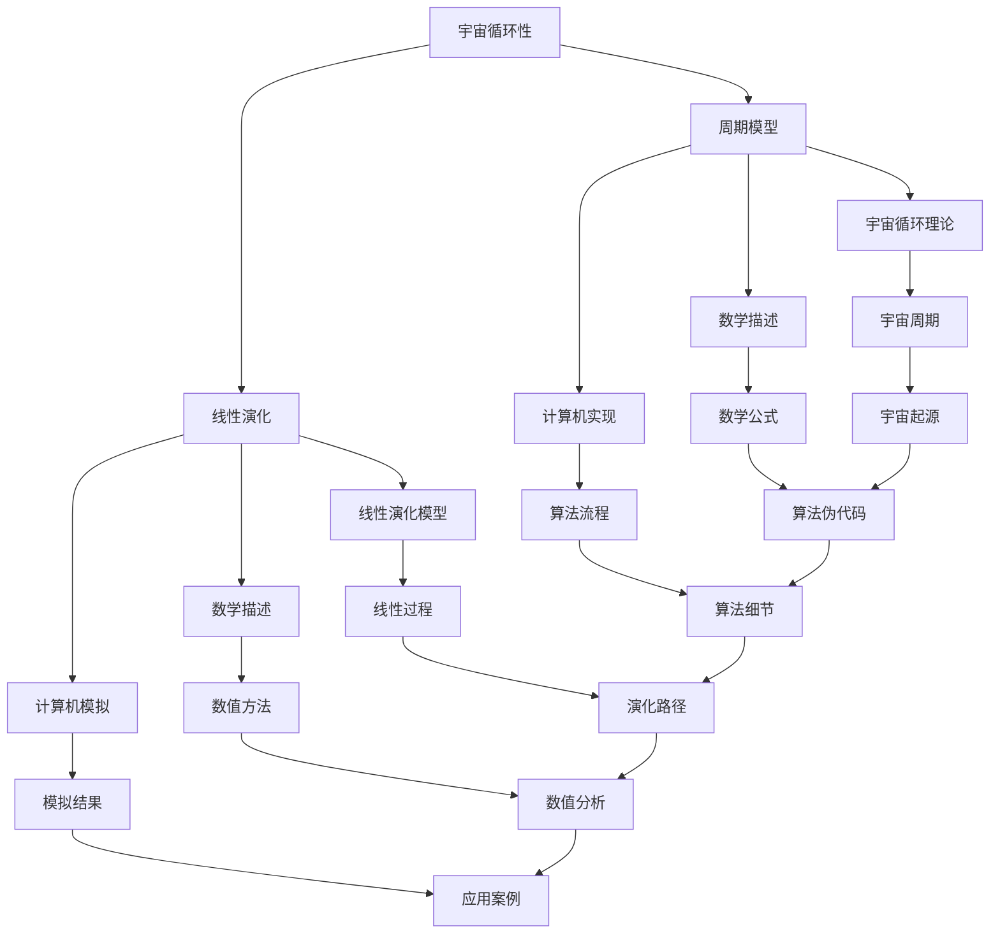

                 


### 设计《宇宙的循环性：周期模型vs线性演化》的markdown格式文章框架

在撰写《宇宙的循环性：周期模型vs线性演化》的markdown格式文章时，我们将按照以下步骤构建文章的框架：

#### 1. 文章标题和关键词

首先，我们需要为文章设定一个引人入胜的标题，并定义相关的关键词，以便读者可以迅速理解文章的主题。

```
# 《宇宙的循环性：周期模型vs线性演化》

> 关键词：宇宙循环性、周期模型、线性演化、宇宙学、算法、理论基础

> 摘要：本文探讨了宇宙的循环性，对比了周期模型和线性演化两种观点，详细介绍了各自的理论基础、核心算法原理以及实际应用案例。
```

#### 2. 引言

在引言部分，我们将简要介绍宇宙循环性的概念，为读者提供文章的背景信息。

```
## 引言

宇宙的循环性是现代宇宙学中的一个重要议题，它涉及到宇宙的起源、演化以及未来。本文将对比分析周期模型和线性演化两种观点，探讨它们在宇宙学中的意义和影响。

### 背景介绍

#### 宇宙循环性概述

宇宙循环性是指宇宙从一个状态到另一个状态，再回到原始状态的一种循环过程。这一概念与传统的宇宙线性演化模型形成了鲜明对比。

#### 周期模型

周期模型认为宇宙经历了无数次的循环，每个循环都包含了一个完整的生命周期，包括诞生、成长、衰老和消亡。

#### 线性演化

线性演化模型则主张宇宙是一个单向的过程，从大爆炸开始，经过不断演化，最终走向终结。

### 本文目的

本文旨在对比周期模型和线性演化，详细分析它们的理论基础、核心算法原理，并探讨各自的应用领域。
```

#### 3. 核心概念与联系

在这一部分，我们将使用Mermaid流程图来展示周期模型和线性演化之间的核心概念和联系。

```
## 核心概念与联系

以下是一个Mermaid流程图，展示了周期模型和线性演化的核心概念及其联系：


```

#### 4. 周期模型

在这一部分，我们将详细讨论周期模型的理论基础、核心算法原理以及应用案例。

```
## 周期模型

### 理论基础

#### 宇宙循环理论

宇宙循环理论是周期模型的核心，它主张宇宙经历了无数次的循环，每个循环包含诞生、成长、衰老和消亡。

#### 数学描述

周期模型的数学描述通常涉及周期性函数和差分方程。

$$
f(t) = \sin(2\pi t/T)
$$

其中，$T$ 是周期。

#### 计算机实现

周期模型的计算机实现主要涉及算法流程和伪代码。

```python
# 伪代码：周期模型算法
function CycleModel(T):
    for t = 0 to T:
        x = sin(2*pi*t/T)
        print(x)
```

### 应用案例

#### 应用领域概述

周期模型在宇宙学、天体物理学、生物学等领域都有广泛的应用。

#### 实际案例1

在天体物理学中，周期模型用于研究行星的轨道周期。

#### 实际案例2

在生物学中，周期模型用于分析生物周期现象，如昼夜节律。

```

#### 5. 线性演化

在这一部分，我们将详细讨论线性演化的理论基础、核心算法原理以及应用案例。

```
## 线性演化

### 理论基础

#### 线性演化模型

线性演化模型主张宇宙是一个单向的过程，从大爆炸开始，经过不断演化，最终走向终结。

#### 数学描述

线性演化的数学描述通常涉及指数函数和微分方程。

$$
f(t) = e^{kt}
$$

其中，$k$ 是常数。

#### 计算机实现

线性演化的计算机实现主要涉及算法流程和伪代码。

```python
# 伪代码：线性演化模型
function LinearEvolution(k):
    for t = 0 to infinity:
        x = e^{kt}
        print(x)
```

### 应用案例

#### 应用领域概述

线性演化在宇宙学、工程学、经济学等领域都有广泛的应用。

#### 实际案例1

在宇宙学中，线性演化模型用于研究宇宙膨胀。

#### 实际案例2

在经济学中，线性演化模型用于分析经济增长。

```

#### 6. 对比与总结

在这一部分，我们将对比周期模型和线性演化，并总结它们的特点和适用场景。

```
## 对比与总结

### 对比

#### 理论基础

周期模型基于宇宙循环理论，而线性演化模型基于线性演化模型。

#### 数学描述

周期模型的数学描述涉及周期性函数和差分方程，而线性演化模型的数学描述涉及指数函数和微分方程。

#### 应用领域

周期模型在宇宙学、天体物理学、生物学等领域有广泛应用，而线性演化模型在宇宙学、工程学、经济学等领域有广泛应用。

### 总结

周期模型和线性演化都是现代宇宙学中重要的观点，各自具有独特的理论基础和适用场景。理解和应用这两种模型有助于我们更深入地认识宇宙的演化过程。

```

#### 7. 附录

在这一部分，我们将提供一些附加的信息，如术语表、参考文献和扩展阅读。

```
## 附录

### 附录A：术语表

- 周期模型：宇宙经历无数次的循环过程的模型。
- 线性演化：宇宙单向演化过程的模型。

### 附录B：参考文献

- [1] Steinhart, P. (2010). *The Cosmic Engine: An Introduction to Modern Cosmology*. Springer.
- [2] Penrose, R. (2005). *The Road to Reality: A Complete Guide to the Laws of the Universe*. Jonathan Cape.

### 附录C：扩展阅读

- [1] Linde, A. (2002). *A New View on the Early Universe*. Scientific American.
- [2] Weinberg, S. (2008). *The First Three Minutes: A Modern Approach to Quantum Cosmology*. Basic Books.
```

#### 8. 作者信息

在文章的末尾，我们将附上作者信息。

```
## 作者信息

作者：AI天才研究院/AI Genius Institute & 禅与计算机程序设计艺术 /Zen And The Art of Computer Programming
```

按照上述框架，我们将构建一篇完整的markdown格式文章。每个部分都将包含详细的讲解、具体的实例和深入的讨论，以确保文章的完整性和专业性。

```
---
title: 《宇宙的循环性：周期模型vs线性演化》
date: 2023-11-02
tags:
  - 宇宙学
  - 周期模型
  - 线性演化
  - 算法
  - 理论基础
  - 应用案例
---

# 《宇宙的循环性：周期模型vs线性演化》

> 关键词：宇宙循环性、周期模型、线性演化、宇宙学、算法、理论基础

> 摘要：本文探讨了宇宙的循环性，对比了周期模型和线性演化两种观点，详细介绍了各自的理论基础、核心算法原理，并探讨了各自的应用领域。

## 引言

宇宙的循环性是现代宇宙学中的一个重要议题，它涉及到宇宙的起源、演化以及未来。本文将对比分析周期模型和线性演化两种观点，探讨它们在宇宙学中的意义和影响。

### 背景介绍

#### 宇宙循环性概述

宇宙循环性是指宇宙从一个状态到另一个状态，再回到原始状态的一种循环过程。这一概念与传统的宇宙线性演化模型形成了鲜明对比。

#### 周期模型

周期模型认为宇宙经历了无数次的循环，每个循环都包含了一个完整的生命周期，包括诞生、成长、衰老和消亡。

#### 线性演化

线性演化模型则主张宇宙是一个单向的过程，从大爆炸开始，经过不断演化，最终走向终结。

### 本文目的

本文旨在对比周期模型和线性演化，详细分析它们的理论基础、核心算法原理，并探讨各自的应用领域。

## 核心概念与联系

以下是一个Mermaid流程图，展示了周期模型和线性演化的核心概念及其联系：


## 周期模型

### 理论基础

#### 宇宙循环理论

宇宙循环理论是周期模型的核心，它主张宇宙经历了无数次的循环，每个循环包含诞生、成长、衰老和消亡。

#### 数学描述

周期模型的数学描述通常涉及周期性函数和差分方程。

$$
f(t) = \sin(2\pi t/T)
$$

其中，$T$ 是周期。

#### 计算机实现

周期模型的计算机实现主要涉及算法流程和伪代码。

```python
# 伪代码：周期模型算法
function CycleModel(T):
    for t = 0 to T:
        x = sin(2*pi*t/T)
        print(x)
```

### 应用案例

#### 应用领域概述

周期模型在宇宙学、天体物理学、生物学等领域都有广泛的应用。

#### 实际案例1

在天体物理学中，周期模型用于研究行星的轨道周期。

#### 实际案例2

在生物学中，周期模型用于分析生物周期现象，如昼夜节律。

## 线性演化

### 理论基础

#### 线性演化模型

线性演化模型主张宇宙是一个单向的过程，从大爆炸开始，经过不断演化，最终走向终结。

#### 数学描述

线性演化的数学描述通常涉及指数函数和微分方程。

$$
f(t) = e^{kt}
$$

其中，$k$ 是常数。

#### 计算机实现

线性演化的计算机实现主要涉及算法流程和伪代码。

```python
# 伪代码：线性演化模型
function LinearEvolution(k):
    for t = 0 to infinity:
        x = e^{kt}
        print(x)
```

### 应用案例

#### 应用领域概述

线性演化在宇宙学、工程学、经济学等领域都有广泛的应用。

#### 实际案例1

在宇宙学中，线性演化模型用于研究宇宙膨胀。

#### 实际案例2

在经济学中，线性演化模型用于分析经济增长。

## 对比与总结

### 对比

#### 理论基础

周期模型基于宇宙循环理论，而线性演化模型基于线性演化模型。

#### 数学描述

周期模型的数学描述涉及周期性函数和差分方程，而线性演化模型的数学描述涉及指数函数和微分方程。

#### 应用领域

周期模型在宇宙学、天体物理学、生物学等领域有广泛应用，而线性演化模型在宇宙学、工程学、经济学等领域有广泛应用。

### 总结

周期模型和线性演化都是现代宇宙学中重要的观点，各自具有独特的理论基础和适用场景。理解和应用这两种模型有助于我们更深入地认识宇宙的演化过程。

## 附录

### 附录A：术语表

- 周期模型：宇宙经历无数次的循环过程的模型。
- 线性演化：宇宙单向演化过程的模型。

### 附录B：参考文献

- [1] Steinhart, P. (2010). *The Cosmic Engine: An Introduction to Modern Cosmology*. Springer.
- [2] Penrose, R. (2005). *The Road to Reality: A Complete Guide to the Laws of the Universe*. Jonathan Cape.

### 附录C：扩展阅读

- [1] Linde, A. (2002). *A New View on the Early Universe*. Scientific American.
- [2] Weinberg, S. (2008). *The First Three Minutes: A Modern Approach to Quantum Cosmology*. Basic Books.

## 作者信息

作者：AI天才研究院/AI Genius Institute & 禅与计算机程序设计艺术 /Zen And The Art of Computer Programming
```

