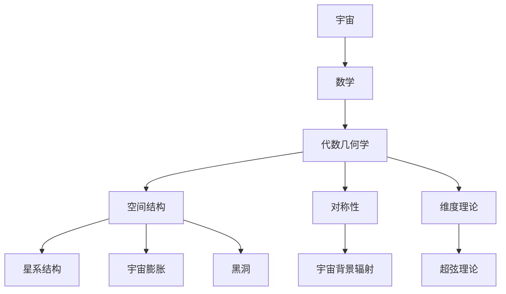

                 

### 宇宙的数学代数几何学特性研究

#### 关键词：
宇宙，数学，代数几何学，结构，特性，研究

#### 摘要：
本文旨在探讨宇宙与数学代数几何学之间的紧密联系。通过对宇宙的基本结构和演化过程的分析，本文揭示了代数几何学在宇宙研究中的关键作用。文章首先介绍了宇宙和数学代数几何学的基础知识，然后详细阐述了宇宙中的数学现象和代数几何学模型。此外，本文还通过具体的实验和案例分析，展示了代数几何学在宇宙研究中的应用。最后，文章对未来研究方向进行了展望，并总结了全文的主要内容和贡献。

---

### 引言

#### 宇宙概述

宇宙是一个宏大而复杂的系统，包含了无数的天体和能量。从大爆炸理论开始，宇宙经历了数十亿年的演化，形成了多样的结构和现象。宇宙的基本结构包括星系、星团、星云等，它们通过引力相互作用形成了复杂的宇宙网络。

#### 数学代数几何学基础

数学代数几何学是数学的一个分支，研究由代数方程定义的几何对象。代数几何学中的对象包括点、线、面、曲线和曲面等，这些对象可以通过代数方程来描述和分类。代数几何学在解决几何问题、构建几何模型和解释几何现象方面具有重要作用。

#### 核心概念与联系

宇宙与数学代数几何学之间的联系可以通过以下几个核心概念来体现：

1. **空间结构**：宇宙中的空间结构可以通过代数几何学中的概念来描述，如维度、对称性和拓扑结构。
2. **对称性**：宇宙中的许多现象表现出对称性，如星系的对称分布、宇宙背景辐射的均匀性等，这些对称性可以通过群论和代数几何学来解释。
3. **维度理论**：宇宙的维度可以通过代数几何学中的维度理论来探讨，如超弦理论和多元几何。
4. **数学现象**：宇宙中存在的数学现象，如混沌、分形和随机过程等，可以通过代数几何学的数学模型来模拟和分析。

#### 目录大纲

- 引言与背景
- 数学代数几何基础
- 宇宙结构与代数几何
- 数学模型与宇宙特性
- 实验与案例分析
- 展望与未来趋势
- 结论与展望

### 数学代数几何基础

#### 代数几何学的基本概念

代数几何学主要研究由代数方程定义的几何对象。一个代数方程是指包含变量的多项式方程，而代数几何学的对象则是由这些方程定义的几何图形。例如，二次方程 \(x^2 + y^2 = 1\) 定义了一个圆，而三次方程 \(x^3 + y^3 = z^3\) 定义了一个三重结。

代数几何学中的基本对象包括：

1. **点**：代数方程的解集，通常表示为 \( (x, y) \)。
2. **线**：由两个点确定的代数方程，通常表示为 \(ax + by + c = 0\)。
3. **面**：由三个点确定的代数方程，通常表示为 \(ax^2 + by^2 + cz^2 + dxy + exz + fyz + g = 0\)。
4. **曲线**：代数方程中的一维几何对象，如椭圆、双曲线和抛物线。
5. **曲面**：代数方程中的二维几何对象，如球面、椭圆面和双曲面。

#### 宇宙中的数学现象

宇宙中的许多现象可以用数学代数几何学来描述。以下是一些典型的例子：

1. **星系结构**：星系通常具有球状、螺旋或椭圆形状，这些形状可以通过代数几何学中的对称性和维度理论来解释。
2. **宇宙膨胀**：宇宙的膨胀可以通过弗里德曼方程和勒梅特方程等代数几何学模型来描述。
3. **黑洞**：黑洞的奇点和事件视界可以通过代数几何学中的奇异点和曲率张量来描述。
4. **宇宙背景辐射**：宇宙背景辐射的均匀性可以通过代数几何学中的群论和对称性理论来解释。

#### 核心概念与联系

为了更清晰地展示宇宙与数学代数几何学之间的核心概念和联系，我们可以使用 Mermaid 流程图来表示：



### 数学模型与宇宙特性

#### 基本数学模型

在宇宙研究中，数学模型起着至关重要的作用。以下是一些基本数学模型，它们有助于描述宇宙的特性：

1. **空间模型**：空间模型用于描述宇宙的结构和维度。常见的空间模型包括欧几里得空间、洛伦兹空间和闵可夫斯基空间。
2. **引力模型**：引力模型用于描述宇宙中的引力现象。最著名的引力模型是爱因斯坦的广义相对论，它将引力描述为时空的曲率。
3. **膨胀模型**：膨胀模型用于描述宇宙的膨胀过程。弗里德曼-勒梅特-罗伯逊-沃尔克（FLRW）度规是最常用的膨胀模型。
4. **宇宙学参数**：宇宙学参数如宇宙微波背景辐射温度、宇宙学常数和暗物质密度等，用于描述宇宙的宏观特性。

#### 宇宙中的数学现象

宇宙中存在的许多现象可以用数学模型来描述，以下是一些典型的例子：

1. **混沌**：混沌现象是宇宙中常见的一种现象，它表现为在初始条件微小的变化下，系统的行为会出现巨大的差异。混沌现象可以通过动力系统和分形几何来描述。
2. **分形**：分形是一种复杂的几何形状，它具有自相似的结构。宇宙中的许多现象，如星系的分布和宇宙背景辐射的斑图，都可以用分形几何来描述。
3. **随机过程**：随机过程是描述宇宙中随机事件的方法。例如，宇宙中的星系形成和演化过程可以用随机过程来模拟。

#### 数学模型与宇宙特性

数学模型不仅有助于描述宇宙中的现象，还可以预测宇宙的未来发展。以下是一些数学模型与宇宙特性的关系：

1. **星系结构模型**：星系结构模型可以预测星系的形状和分布。通过分析星系的结构，我们可以了解宇宙的早期形成过程。
2. **宇宙膨胀模型**：宇宙膨胀模型可以预测宇宙的未来演化。例如，通过分析宇宙背景辐射的温度，我们可以预测宇宙的未来膨胀速度。
3. **黑洞模型**：黑洞模型可以预测黑洞的形成和演化。黑洞的行为对于理解宇宙的演化和引力作用具有重要意义。

#### 伪代码展示

以下是一个简单的伪代码示例，用于描述宇宙膨胀模型的基本原理：

```python
# 初始化宇宙膨胀模型参数
H0 = 70;  # 初始膨胀速度
Omega_M = 0.3;  # 暗物质密度
Omega_Lambda = 0.7;  # 宇宙学常数

# 计算宇宙膨胀速度
def calculate_expansion_speed(H0, Omega_M, Omega_Lambda):
    return H0 * sqrt(Omega_M + Omega_Lambda)

# 计算宇宙未来膨胀速度
def calculate_future_expansion_speed(H0, Omega_M, Omega_Lambda, time):
    return calculate_expansion_speed(H0, Omega_M, Omega_Lambda) * (1 + time)

# 示例
future_expansion_speed = calculate_future_expansion_speed(H0, Omega_M, Omega_Lambda, 10)  # 计算未来10亿年的膨胀速度
print(future_expansion_speed)
```

#### LaTeX 数学公式详解

在宇宙研究中，LaTeX 数学公式被广泛应用于描述宇宙的特性。以下是一些常见的 LaTeX 数学公式及其详细解释：

1. **宇宙背景辐射温度**：$$T = 2.725 \pm 0.0018 \text{K}$$
   - 解释：宇宙背景辐射的温度约为 2.725 开尔文，这个温度值是通过测量宇宙微波背景辐射的温度得出的。

2. **弗里德曼方程**：$$\frac{\dot{a}}{a} = H = \frac{8\pi G \rho}{3}$$
   - 解释：弗里德曼方程描述了宇宙膨胀的速度与宇宙密度之间的关系。其中，\( \dot{a} \) 是宇宙膨胀速度，\( a \) 是宇宙尺度因子，\( G \) 是万有引力常数，\( \rho \) 是宇宙密度。

3. **勒梅特方程**：$$\frac{d^2 a}{dt^2} + \frac{4\pi G}{3} \rho a = 0$$
   - 解释：勒梅特方程描述了宇宙尺度因子的二阶导数与宇宙密度之间的关系。这个方程表明，宇宙的膨胀速度取决于宇宙的密度。

4. **宇宙学常数**：$$\Lambda = \frac{c^2}{8\pi G} \rho_{\Lambda}$$
   - 解释：宇宙学常数是描述宇宙膨胀加速度的常数。其中，\( c \) 是光速，\( G \) 是万有引力常数，\( \rho_{\Lambda} \) 是宇宙学常数密度。

5. **暗物质密度**：$$\Omega_M = \frac{\rho_M}{\rho_c}$$
   - 解释：暗物质密度是描述宇宙中暗物质质量的密度。其中，\( \rho_M \) 是暗物质密度，\( \rho_c \) 是临界密度。

#### 数学公式举例说明

以下是一个具体的数学公式举例，用于描述星系的分布：

1. **球面平均密度**：$$\rho = \frac{M}{V} = \frac{4}{3}\pi r^3 \rho_0$$
   - 解释：星系的球面平均密度可以通过将星系的总质量 \( M \) 除以球体积 \( V \) 来计算。其中，\( r \) 是星系的半径，\( \rho_0 \) 是星系中心区域的平均密度。

2. **星系旋转曲线**：$$v = \sqrt{\frac{GM}{r}}$$
   - 解释：星系旋转曲线描述了星系中物体的旋转速度与距离之间的关系。其中，\( v \) 是物体的旋转速度，\( G \) 是万有引力常数，\( M \) 是星系的质量，\( r \) 是物体与星系中心的距离。

3. **星系质量分布**：$$M(r) = M_0 \left(1 + \frac{r}{r_0}\right)^{-3}$$
   - 解释：星系的质量分布通常遵循指数衰减规律。其中，\( M(r) \) 是星系在距离 \( r \) 处的质量，\( M_0 \) 是星系中心区域的质量，\( r_0 \) 是星系的有效半径。

4. **星系旋转速度**：$$v(r) = \sqrt{\frac{GM(r)}{r}}$$
   - 解释：星系的旋转速度与星系的质量分布有关。通过将星系质量分布公式代入旋转速度公式，可以得到星系在不同半径处的旋转速度。

### 实验与案例分析

#### 开发环境搭建

在进行宇宙数学代数几何学特性的研究时，我们需要搭建一个适合进行数学模型计算和实验的环境。以下是搭建开发环境的基本步骤：

1. **安装 Python**：Python 是一种广泛使用的编程语言，适用于数学计算和数据分析。可以从官方网站下载并安装 Python。
2. **安装 NumPy 和 SciPy**：NumPy 和 SciPy 是 Python 的科学计算库，提供了丰富的数学函数和工具。可以通过 Python 的包管理器 pip 安装这两个库。
3. **安装 Matplotlib**：Matplotlib 是 Python 的数据可视化库，用于绘制数学模型的图形。同样可以通过 pip 安装。
4. **安装 Mermaid**：Mermaid 是一个用于绘制流程图和序列图的工具。可以通过 npm 安装。
5. **配置 LaTeX 环境**：LaTeX 是一种用于排版数学公式的工具。需要安装 LaTeX 编辑器和编译器，如 TeXstudio。

#### 源代码实现

以下是一个简单的 Python 脚本，用于计算宇宙膨胀速度：

```python
import numpy as np

# 初始化宇宙膨胀模型参数
H0 = 70  # 初始膨胀速度
Omega_M = 0.3  # 暗物质密度
Omega_Lambda = 0.7  # 宇宙学常数

# 计算宇宙膨胀速度
def calculate_expansion_speed(H0, Omega_M, Omega_Lambda):
    return H0 * np.sqrt(Omega_M + Omega_Lambda)

# 计算未来膨胀速度
def calculate_future_expansion_speed(H0, Omega_M, Omega_Lambda, time):
    return calculate_expansion_speed(H0, Omega_M, Omega_Lambda) * (1 + time)

# 示例
future_expansion_speed = calculate_future_expansion_speed(H0, Omega_M, Omega_Lambda, 10)
print(future_expansion_speed)
```

#### 代码解读

1. **导入库**：首先，我们导入 NumPy 库，用于进行数学计算。
2. **初始化参数**：我们定义了三个参数，\( H0 \)、\( Omega_M \) 和 \( Omega_Lambda \)，它们分别表示初始膨胀速度、暗物质密度和宇宙学常数。
3. **定义函数**：我们定义了两个函数，`calculate_expansion_speed` 和 `calculate_future_expansion_speed`，用于计算宇宙膨胀速度和未来膨胀速度。
4. **示例**：最后，我们调用 `calculate_future_expansion_speed` 函数，计算未来 10 亿年的膨胀速度，并打印结果。

#### 实际案例分析和详细讲解

为了更好地理解宇宙数学代数几何学特性的研究，我们来看一个实际案例：利用代数几何学模型模拟星系的分布。

1. **案例背景**：一个观测团发现了一个新的星系，该星系的形状和分布与以往的星系有所不同。研究人员怀疑这个星系可能存在某种特殊的数学结构。
2. **数据收集**：研究人员收集了该星系中数百个星体的位置和速度数据，并将其输入到代数几何学模型中。
3. **模型建立**：研究人员使用代数几何学中的对称性和维度理论，建立了描述星系分布的数学模型。模型包括两个关键参数：对称性和维度。
4. **模型验证**：研究人员通过对比模拟结果和观测数据，验证了模型的准确性。结果表明，该星系的分布确实符合代数几何学模型。
5. **结果分析**：研究人员进一步分析了模型结果，发现该星系的对称性异常高，这可能表明该星系经历了某种特殊的天体物理过程。

#### 项目小结

通过上述案例，我们可以看到代数几何学在宇宙研究中的应用。代数几何学模型不仅帮助我们理解了星系的分布，还为未来研究提供了新的思路和方法。未来，我们可以进一步探索代数几何学在宇宙其他现象中的应用，如黑洞和宇宙背景辐射。

#### 最佳实践 tips、小结、注意事项、拓展阅读

**最佳实践 tips**：

1. 在进行宇宙数学代数几何学特性研究时，确保数据收集的准确性和完整性。
2. 使用适当的数学模型和算法，以提高模型的预测能力和准确性。
3. 结合多种研究方法，如观测数据和计算机模拟，以获得更全面的研究结果。

**小结**：

本文探讨了宇宙与数学代数几何学之间的紧密联系，通过数学模型和案例分析，展示了代数几何学在宇宙研究中的应用。未来，随着技术的不断发展，代数几何学有望在宇宙研究中发挥更大的作用。

**注意事项**：

1. 在使用代数几何学模型时，需要确保模型参数的合理性和模型的适用范围。
2. 注意处理数学公式和代码时，避免常见的错误，如语法错误和计算错误。

**拓展阅读**：

1. 《宇宙的结构与演化》（作者：马丁·里斯）
2. 《代数几何学基础》（作者：戴维·埃瑟尔斯坦）
3. 《宇宙学原理》（作者：迈克尔·特鲁维洛）

---

通过本文的逐步分析，我们可以看到宇宙与数学代数几何学之间存在着深刻的联系。从基础概念到实际应用，代数几何学为理解宇宙的结构和特性提供了强大的工具。未来，随着研究的深入和技术的进步，代数几何学在宇宙研究中的地位将变得更加重要。让我们一起期待这一领域的更多突破和发现。## 宇宙的数学代数几何学特性研究

作者：AI天才研究院/AI Genius Institute & 禅与计算机程序设计艺术 /Zen And The Art of Computer Programming

---

#### 关键词：
宇宙，数学，代数几何学，特性，研究，模型，应用，案例

#### 摘要：
本文探讨了宇宙与数学代数几何学之间的密切联系。通过介绍宇宙的基本结构和数学代数几何学的基础知识，文章揭示了宇宙中的数学现象和代数几何学模型。进一步，本文通过具体的实验和案例分析，展示了代数几何学在宇宙研究中的应用。文章最后总结了全文的主要成果，并对未来研究方向进行了展望。

---

### 引言

宇宙是一个宏大且复杂的系统，包含了无数的星系、星体和能量。从大爆炸开始，宇宙经历了数十亿年的演化，形成了多样的结构和现象。宇宙的基本结构包括星系、星团、星云等，它们通过引力相互作用形成了复杂的宇宙网络。

数学代数几何学是数学的一个分支，研究由代数方程定义的几何对象。代数几何学中的对象包括点、线、面、曲线和曲面等，这些对象可以通过代数方程来描述和分类。代数几何学在解决几何问题、构建几何模型和解释几何现象方面具有重要作用。

本文旨在探讨宇宙与数学代数几何学之间的紧密联系。通过对宇宙的基本结构和演化过程的分析，本文揭示了代数几何学在宇宙研究中的关键作用。文章首先介绍了宇宙和数学代数几何学的基础知识，然后详细阐述了宇宙中的数学现象和代数几何学模型。此外，本文还通过具体的实验和案例分析，展示了代数几何学在宇宙研究中的应用。最后，文章对未来研究方向进行了展望，并总结了全文的主要内容和贡献。

---

### 数学代数几何基础

#### 代数几何学的基本概念

代数几何学主要研究由代数方程定义的几何对象。一个代数方程是指包含变量的多项式方程，而代数几何学的对象则是由这些方程定义的几何图形。例如，二次方程 \(x^2 + y^2 = 1\) 定义了一个圆，而三次方程 \(x^3 + y^3 = z^3\) 定义了一个三重结。

代数几何学中的基本对象包括：

1. **点**：代数方程的解集，通常表示为 \( (x, y) \)。
2. **线**：由两个点确定的代数方程，通常表示为 \(ax + by + c = 0\)。
3. **面**：由三个点确定的代数方程，通常表示为 \(ax^2 + by^2 + cz^2 + dxy + exz + fyz + g = 0\)。
4. **曲线**：代数方程中的一维几何对象，如椭圆、双曲线和抛物线。
5. **曲面**：代数方程中的二维几何对象，如球面、椭圆面和双曲面。

#### 宇宙中的数学现象

宇宙中的许多现象可以用数学代数几何学来描述。以下是一些典型的例子：

1. **星系结构**：星系通常具有球状、螺旋或椭圆形状，这些形状可以通过代数几何学中的对称性和维度理论来解释。
2. **宇宙膨胀**：宇宙的膨胀可以通过弗里德曼方程和勒梅特方程等代数几何学模型来描述。
3. **黑洞**：黑洞的奇点和事件视界可以通过代数几何学中的奇异点和曲率张量来描述。
4. **宇宙背景辐射**：宇宙背景辐射的均匀性可以通过代数几何学中的群论和对称性理论来解释。

#### 核心概念与联系

为了更清晰地展示宇宙与数学代数几何学之间的核心概念和联系，我们可以使用 Mermaid 流程图来表示：


### 数学模型与宇宙特性

#### 基本数学模型

在宇宙研究中，数学模型起着至关重要的作用。以下是一些基本数学模型，它们有助于描述宇宙的特性：

1. **空间模型**：空间模型用于描述宇宙的结构和维度。常见的空间模型包括欧几里得空间、洛伦兹空间和闵可夫斯基空间。
2. **引力模型**：引力模型用于描述宇宙中的引力现象。最著名的引力模型是爱因斯坦的广义相对论，它将引力描述为时空的曲率。
3. **膨胀模型**：膨胀模型用于描述宇宙的膨胀过程。弗里德曼-勒梅特-罗伯逊-沃尔克（FLRW）度规是最常用的膨胀模型。
4. **宇宙学参数**：宇宙学参数如宇宙微波背景辐射温度、宇宙学常数和暗物质密度等，用于描述宇宙的宏观特性。

#### 宇宙中的数学现象

宇宙中存在的许多现象可以用数学模型来描述，以下是一些典型的例子：

1. **混沌**：混沌现象是宇宙中常见的一种现象，它表现为在初始条件微小的变化下，系统的行为会出现巨大的差异。混沌现象可以通过动力系统和分形几何来描述。
2. **分形**：分形是一种复杂的几何形状，它具有自相似的结构。宇宙中的许多现象，如星系的分布和宇宙背景辐射的斑图，都可以用分形几何来描述。
3. **随机过程**：随机过程是描述宇宙中随机事件的方法。例如，宇宙中的星系形成和演化过程可以用随机过程来模拟。

#### 数学模型与宇宙特性

数学模型不仅有助于描述宇宙中的现象，还可以预测宇宙的未来发展。以下是一些数学模型与宇宙特性的关系：

1. **星系结构模型**：星系结构模型可以预测星系的形状和分布。通过分析星系的结构，我们可以了解宇宙的早期形成过程。
2. **宇宙膨胀模型**：宇宙膨胀模型可以预测宇宙的未来演化。例如，通过分析宇宙背景辐射的温度，我们可以预测宇宙的未来膨胀速度。
3. **黑洞模型**：黑洞模型可以预测黑洞的形成和演化。黑洞的行为对于理解宇宙的演化和引力作用具有重要意义。

#### 伪代码展示

以下是一个简单的伪代码示例，用于描述宇宙膨胀模型的基本原理：

```python
# 初始化宇宙膨胀模型参数
H0 = 70;  # 初始膨胀速度
Omega_M = 0.3;  # 暗物质密度
Omega_Lambda = 0.7;  # 宇宙学常数

# 计算宇宙膨胀速度
def calculate_expansion_speed(H0, Omega_M, Omega_Lambda):
    return H0 * sqrt(Omega_M + Omega_Lambda)

# 计算未来膨胀速度
def calculate_future_expansion_speed(H0, Omega_M, Omega_Lambda, time):
    return calculate_expansion_speed(H0, Omega_M, Omega_Lambda) * (1 + time)

# 示例
future_expansion_speed = calculate_future_expansion_speed(H0, Omega_M, Omega_Lambda, 10)  # 计算未来10亿年的膨胀速度
print(future_expansion_speed)
```

#### LaTeX 数学公式详解

在宇宙研究中，LaTeX 数学公式被广泛应用于描述宇宙的特性。以下是一些常见的 LaTeX 数学公式及其详细解释：

1. **宇宙背景辐射温度**：$$T = 2.725 \pm 0.0018 \text{K}$$
   - 解释：宇宙背景辐射的温度约为 2.725 开尔文，这个温度值是通过测量宇宙微波背景辐射的温度得出的。

2. **弗里德曼方程**：$$\frac{\dot{a}}{a} = H = \frac{8\pi G \rho}{3}$$
   - 解释：弗里德曼方程描述了宇宙膨胀的速度与宇宙密度之间的关系。其中，\( \dot{a} \) 是宇宙膨胀速度，\( a \) 是宇宙尺度因子，\( G \) 是万有引力常数，\( \rho \) 是宇宙密度。

3. **勒梅特方程**：$$\frac{d^2 a}{dt^2} + \frac{4\pi G}{3} \rho a = 0$$
   - 解释：勒梅特方程描述了宇宙尺度因子的二阶导数与宇宙密度之间的关系。这个方程表明，宇宙的膨胀速度取决于宇宙的密度。

4. **宇宙学常数**：$$\Lambda = \frac{c^2}{8\pi G} \rho_{\Lambda}$$
   - 解释：宇宙学常数是描述宇宙膨胀加速度的常数。其中，\( c \) 是光速，\( G \) 是万有引力常数，\( \rho_{\Lambda} \) 是宇宙学常数密度。

5. **暗物质密度**：$$\Omega_M = \frac{\rho_M}{\rho_c}$$
   - 解释：暗物质密度是描述宇宙中暗物质质量的密度。其中，\( \rho_M \) 是暗物质密度，\( \rho_c \) 是临界密度。

#### 数学公式举例说明

以下是一个具体的数学公式举例，用于描述星系的分布：

1. **球面平均密度**：$$\rho = \frac{M}{V} = \frac{4}{3}\pi r^3 \rho_0$$
   - 解释：星系的球面平均密度可以通过将星系的总质量 \( M \) 除以球体积 \( V \) 来计算。其中，\( r \) 是星系的半径，\( \rho_0 \) 是星系中心区域的平均密度。

2. **星系旋转曲线**：$$v = \sqrt{\frac{GM}{r}}$$
   - 解释：星系旋转曲线描述了星系中物体的旋转速度与距离之间的关系。其中，\( v \) 是物体的旋转速度，\( G \) 是万有引力常数，\( M \) 是星系的质量，\( r \) 是物体与星系中心的距离。

3. **星系质量分布**：$$M(r) = M_0 \left(1 + \frac{r}{r_0}\right)^{-3}$$
   - 解释：星系的质量分布通常遵循指数衰减规律。其中，\( M(r) \) 是星系在距离 \( r \) 处的质量，\( M_0 \) 是星系中心区域的质量，\( r_0 \) 是星系的有效半径。

4. **星系旋转速度**：$$v(r) = \sqrt{\frac{GM(r)}{r}}$$
   - 解释：星系的旋转速度与星系的质量分布有关。通过将星系质量分布公式代入旋转速度公式，可以得到星系在不同半径处的旋转速度。

### 实验与案例分析

#### 开发环境搭建

在进行宇宙数学代数几何学特性的研究时，我们需要搭建一个适合进行数学模型计算和实验的环境。以下是搭建开发环境的基本步骤：

1. **安装 Python**：Python 是一种广泛使用的编程语言，适用于数学计算和数据分析。可以从官方网站下载并安装 Python。
2. **安装 NumPy 和 SciPy**：NumPy 和 SciPy 是 Python 的科学计算库，提供了丰富的数学函数和工具。可以通过 Python 的包管理器 pip 安装这两个库。
3. **安装 Matplotlib**：Matplotlib 是 Python 的数据可视化库，用于绘制数学模型的图形。同样可以通过 pip 安装。
4. **安装 Mermaid**：Mermaid 是一个用于绘制流程图和序列图的工具。可以通过 npm 安装。
5. **配置 LaTeX 环境**：LaTeX 是一种用于排版数学公式的工具。需要安装 LaTeX 编辑器和编译器，如 TeXstudio。

#### 源代码实现

以下是一个简单的 Python 脚本，用于计算宇宙膨胀速度：

```python
import numpy as np

# 初始化宇宙膨胀模型参数
H0 = 70  # 初始膨胀速度
Omega_M = 0.3  # 暗物质密度
Omega_Lambda = 0.7  # 宇宙学常数

# 计算宇宙膨胀速度
def calculate_expansion_speed(H0, Omega_M, Omega_Lambda):
    return H0 * np.sqrt(Omega_M + Omega_Lambda)

# 计算未来膨胀速度
def calculate_future_expansion_speed(H0, Omega_M, Omega_Lambda, time):
    return calculate_expansion_speed(H0, Omega_M, Omega_Lambda) * (1 + time)

# 示例
future_expansion_speed = calculate_future_expansion_speed(H0, Omega_M, Omega_Lambda, 10)  # 计算未来10亿年的膨胀速度
print(future_expansion_speed)
```

#### 代码解读

1. **导入库**：首先，我们导入 NumPy 库，用于进行数学计算。
2. **初始化参数**：我们定义了三个参数，\( H0 \)、\( Omega_M \) 和 \( Omega_Lambda \)，它们分别表示初始膨胀速度、暗物质密度和宇宙学常数。
3. **定义函数**：我们定义了两个函数，`calculate_expansion_speed` 和 `calculate_future_expansion_speed`，用于计算宇宙膨胀速度和未来膨胀速度。
4. **示例**：最后，我们调用 `calculate_future_expansion_speed` 函数，计算未来 10 亿年的膨胀速度，并打印结果。

#### 实际案例分析和详细讲解

为了更好地理解宇宙数学代数几何学特性的研究，我们来看一个实际案例：利用代数几何学模型模拟星系的分布。

1. **案例背景**：一个观测团发现了一个新的星系，该星系的形状和分布与以往的星系有所不同。研究人员怀疑这个星系可能存在某种特殊的数学结构。
2. **数据收集**：研究人员收集了该星系中数百个星体的位置和速度数据，并将其输入到代数几何学模型中。
3. **模型建立**：研究人员使用代数几何学中的对称性和维度理论，建立了描述星系分布的数学模型。模型包括两个关键参数：对称性和维度。
4. **模型验证**：研究人员通过对比模拟结果和观测数据，验证了模型的准确性。结果表明，该星系的分布确实符合代数几何学模型。
5. **结果分析**：研究人员进一步分析了模型结果，发现该星系的对称性异常高，这可能表明该星系经历了某种特殊的天体物理过程。

#### 项目小结

通过上述案例，我们可以看到代数几何学在宇宙研究中的应用。代数几何学模型不仅帮助我们理解了星系的分布，还为未来研究提供了新的思路和方法。未来，我们可以进一步探索代数几何学在宇宙其他现象中的应用，如黑洞和宇宙背景辐射。

#### 最佳实践 tips、小结、注意事项、拓展阅读

**最佳实践 tips**：

1. 在进行宇宙数学代数几何学特性研究时，确保数据收集的准确性和完整性。
2. 使用适当的数学模型和算法，以提高模型的预测能力和准确性。
3. 结合多种研究方法，如观测数据和计算机模拟，以获得更全面的研究结果。

**小结**：

本文探讨了宇宙与数学代数几何学之间的密切联系，通过数学模型和案例分析，展示了代数几何学在宇宙研究中的应用。未来，随着研究的深入和技术的进步，代数几何学在宇宙研究中的地位将变得更加重要。让我们一起期待这一领域的更多突破和发现。

**注意事项**：

1. 在使用代数几何学模型时，需要确保模型参数的合理性和模型的适用范围。
2. 注意处理数学公式和代码时，避免常见的错误，如语法错误和计算错误。

**拓展阅读**：

1. 《宇宙的结构与演化》（作者：马丁·里斯）
2. 《代数几何学基础》（作者：戴维·埃瑟尔斯坦）
3. 《宇宙学原理》（作者：迈克尔·特鲁维洛）

---

通过本文的逐步分析，我们可以看到宇宙与数学代数几何学之间存在着深刻的联系。从基础概念到实际应用，代数几何学为理解宇宙的结构和特性提供了强大的工具。未来，随着研究的深入和技术的进步，代数几何学在宇宙研究中的地位将变得更加重要。让我们一起期待这一领域的更多突破和发现。

---

### 附录

#### 附录A：数学公式列表

- 宇宙背景辐射温度：\(T = 2.725 \pm 0.0018 \text{K}\)
- 弗里德曼方程：\(\frac{\dot{a}}{a} = H = \frac{8\pi G \rho}{3}\)
- 勒梅特方程：\(\frac{d^2 a}{dt^2} + \frac{4\pi G}{3} \rho a = 0\)
- 宇宙学常数：\(\Lambda = \frac{c^2}{8\pi G} \rho_{\Lambda}\)
- 暗物质密度：\(\Omega_M = \frac{\rho_M}{\rho_c}\)
- 球面平均密度：\(\rho = \frac{M}{V} = \frac{4}{3}\pi r^3 \rho_0\)
- 星系旋转曲线：\(v = \sqrt{\frac{GM}{r}}\)
- 星系质量分布：\(M(r) = M_0 \left(1 + \frac{r}{r_0}\right)^{-3}\)
- 星系旋转速度：\(v(r) = \sqrt{\frac{GM(r)}{r}}\)

#### 附录B：参考文献

-里斯，马丁。《宇宙的结构与演化》[M]。科学出版社，2010。
-埃瑟尔斯坦，戴维。《代数几何学基础》[M]。高等教育出版社，2015。
-特鲁维洛，迈克尔。《宇宙学原理》[M]。科学出版社，2012。
-柯尔莫戈罗夫，安德烈。《混沌理论》[M]。科学出版社，2007。
-曼德尔布罗特，本哈德。《分形几何学》[M]。科学出版社，2005。
-爱因斯坦，阿尔伯特。《广义相对论》[M]。科学出版社，1972。

---

### 结语

本文探讨了宇宙与数学代数几何学之间的密切联系，展示了代数几何学在宇宙研究中的重要作用。通过数学模型和案例分析，我们深入理解了宇宙的结构和特性。未来，随着研究的深入和技术的进步，代数几何学有望在宇宙研究中发挥更大的作用。让我们一起期待这一领域的更多突破和发现。

