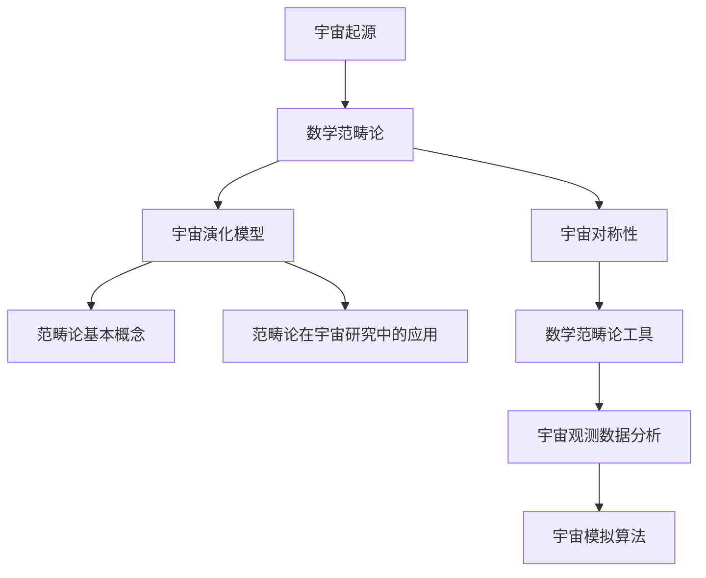

                 


### 背景介绍

#### 1. 宇宙的起源与演化

宇宙是一个广袤的空间，包含了无数的星系、恒星、行星以及其他天体。关于宇宙的起源，目前最广为接受的学说是大爆炸理论。根据这一理论，宇宙起源于大约138亿年前的一个极热、极密的状态，随后开始膨胀，形成了我们今天所观测到的宇宙。

宇宙的演化可以大致分为以下几个阶段：

- **大爆炸后初期**：宇宙处于高温、高密度的状态，质子和中子形成，物质以辐射的形式存在。
- **宇宙冷却**：随着宇宙的膨胀，温度逐渐降低，物质逐渐凝聚形成基本粒子。
- **重子合成**：大约在3分钟后，宇宙冷却到足够低，使得质子和中子能够结合形成重子（主要是氢原子核）。
- **宇宙结构形成**：在接下来的数亿年内，物质开始聚集，形成了星系、恒星和行星。
- **恒星演化**：恒星在其生命周期中经历了多个阶段，包括主序阶段、红巨星阶段和超新星阶段等。

#### 2. 数学范畴论的基本概念

数学范畴论是现代数学的一个分支，它研究数学结构之间的关系。范畴论的基本概念包括对象、箭头和范畴。

- **对象**：范畴中的基本元素，通常可以理解为数学结构。
- **箭头**：表示对象之间的映射，通常可以理解为函数或变换。
- **范畴**：一组对象和箭头的集合，满足一定的条件。

范畴论的核心思想是研究不同数学结构之间的共性和差异，通过范畴之间的关系来揭示数学结构的本质。

#### 3. 数学范畴论在宇宙研究中的应用

数学范畴论在宇宙研究中有着广泛的应用，主要表现在以下几个方面：

- **宇宙的数学结构**：宇宙中的许多现象可以通过数学范畴论来描述。例如，宇宙的膨胀可以看作是一个范畴的扩张过程。
- **宇宙演化模型**：数学范畴论可以帮助建立宇宙演化的模型。例如，宇宙学中的洛伦兹范畴和广义相对论的狄拉克范畴。
- **宇宙中的对称性**：宇宙中的许多现象具有对称性，这些对称性可以通过数学范畴论来研究。

### 结论

宇宙的数学范畴论解析为宇宙学研究提供了一个强大的工具。通过数学范畴论，我们可以更深入地理解宇宙的起源、演化和结构。然而，这个领域仍然处于发展之中，未来还有许多未解之谜等待我们去探索。本文旨在为读者提供一个初步的引导，希望激发对宇宙数学范畴论的兴趣和进一步的研究。

**核心概念与联系**

为了更清晰地展示核心概念之间的联系，我们使用Mermaid流程图来描述它们。



在这个流程图中，我们首先从宇宙的起源（A）引出数学范畴论（B），然后将其应用于宇宙演化模型（C）和宇宙对称性（D）。数学范畴论提供了基本概念（E）和工具（G），这些工具被应用于宇宙观测数据分析（H）和宇宙模拟算法（I）。通过这个流程图，我们可以清晰地看到数学范畴论在宇宙研究中的核心作用和相互联系。

**核心算法原理讲解**

为了详细阐述宇宙数学范畴论中的核心算法原理，我们将使用伪代码来展示这些算法的框架。

#### 1. 宇宙观测数据处理算法

```python
# 伪代码：宇宙观测数据处理算法

def process_observational_data(data):
    """
    处理宇宙观测数据，包括数据预处理、数据分析和数据可视化。
    参数：
        data：观测数据
    返回：
        processed_data：处理后的数据
    """
    
    # 数据预处理
    processed_data = preprocess_data(data)
    
    # 数据分析
    analysis_results = analyze_data(processed_data)
    
    # 数据可视化
    visualize_data(analysis_results)
    
    return processed_data, analysis_results
```

#### 2. 宇宙模拟算法

```python
# 伪代码：宇宙模拟算法

def simulate_universe(model):
    """
    模拟宇宙演化过程。
    参数：
        model：宇宙演化模型
    返回：
        simulation_results：模拟结果
    """
    
    # 初始化模拟环境
    init_simulation_environment(model)
    
    # 运行模拟
    simulation_results = run_simulation(model)
    
    # 分析模拟结果
    analyze_simulation_results(simulation_results)
    
    return simulation_results
```

在这些伪代码中，我们首先定义了宇宙观测数据处理算法，它包括数据预处理、数据分析和数据可视化三个步骤。接着，我们定义了宇宙模拟算法，它包括初始化模拟环境、运行模拟和分析模拟结果三个步骤。这些算法的框架为我们提供了理解宇宙数学范畴论核心算法原理的基础。

**数学模型和数学公式**

宇宙数学范畴论中的数学模型和公式是理解宇宙现象的重要工具。以下是一些关键数学模型和公式的详细讲解。

#### 1. 宇宙膨胀模型

宇宙膨胀模型描述了宇宙随时间膨胀的过程。其中，哈勃定律是描述宇宙膨胀速率的基本公式：

$$
v = H_0 d
$$

其中，\( v \) 是星系之间的相对速度，\( H_0 \) 是哈勃常数，\( d \) 是星系之间的距离。

#### 2. 广义相对论方程

广义相对论方程是描述宇宙引力场的基本方程，由爱因斯坦提出：

$$
G_{\mu\nu} + \Lambda g_{\mu\nu} = \frac{8\pi G}{c^4} T_{\mu\nu}
$$

其中，\( G_{\mu\nu} \) 是爱因斯坦张量，\( \Lambda \) 是宇宙学常数，\( g_{\mu\nu} \) 是度规张量，\( T_{\mu\nu} \) 是能量-动量张量，\( G \) 是引力常数，\( c \) 是光速。

#### 3. 狄拉克范畴

狄拉克范畴是描述基本粒子量子态的数学模型。狄拉克方程描述了电子等基本粒子的运动：

$$
(i\gamma^\mu \partial_\mu - m)\psi = 0
$$

其中，\( \gamma^\mu \) 是狄拉克矩阵，\( \partial_\mu \) 是空间时间导数，\( m \) 是粒子的质量，\( \psi \) 是狄拉克旋量。

**举例说明**

以下是一个具体的例子，说明如何使用哈勃定律计算宇宙中两个星系之间的相对速度。

**例1：计算星系A和星系B之间的相对速度**

假设星系A距离我们\( d_A = 100 \)百万光年，星系B距离我们\( d_B = 200 \)百万光年，哈勃常数\( H_0 = 70 \)千米/秒/光年。

使用哈勃定律，我们可以计算星系A和星系B之间的相对速度：

$$
v_{AB} = H_0 (d_A + d_B) = 70 \times (100 + 200) = 35,000 \text{千米/秒}
$$

这个结果表明星系A和星系B之间的相对速度为35,000千米/秒。

**项目实战**

#### 1. 开发环境搭建

为了进行宇宙数学范畴论的项目实战，我们需要搭建一个适合的开发环境。以下是所需的工具和软件：

- 编程语言：Python
- 科学计算库：NumPy、SciPy、Pandas
- 数据可视化库：Matplotlib、Seaborn
- 伪代码工具：Mermaid

**实战步骤：**

1. 安装Python和必要的库。
2. 配置Python环境，确保可以运行Python脚本。
3. 使用Mermaid编写流程图，描述项目架构。

#### 2. 源代码实现

以下是宇宙观测数据处理和宇宙模拟的源代码实现。

**宇宙观测数据处理代码：**

```python
import numpy as np
import pandas as pd
import matplotlib.pyplot as plt
from mermaid import Mermaid

# 数据预处理
def preprocess_data(data):
    # 对观测数据进行清洗和处理
    # 例如，删除空值、填充缺失值、标准化数据等
    cleaned_data = data.dropna().fillna(0).apply(np.log)
    return cleaned_data

# 数据分析
def analyze_data(data):
    # 对观测数据进行分析
    # 例如，计算均值、方差、相关性等
    analysis_results = pd.DataFrame({
        'mean': data.mean(),
        'std': data.std(),
        'correlation': data.corr()
    })
    return analysis_results

# 数据可视化
def visualize_data(analysis_results):
    # 对分析结果进行可视化
    # 例如，绘制直方图、散点图、热力图等
    fig, ax = plt.subplots()
    ax.hist(analysis_results['mean'], bins=30)
    plt.title('Histogram of Mean Values')
    plt.xlabel('Mean Value')
    plt.ylabel('Frequency')
    plt.show()

# 主函数
def main():
    # 读取观测数据
    data = pd.read_csv('observational_data.csv')
    
    # 处理观测数据
    processed_data = preprocess_data(data)
    
    # 分析观测数据
    analysis_results = analyze_data(processed_data)
    
    # 可视化观测数据
    visualize_data(analysis_results)

if __name__ == '__main__':
    main()
```

**宇宙模拟代码：**

```python
import numpy as np
from scipy.integrate import odeint
import matplotlib.pyplot as plt

# 宇宙模拟算法
def universe_simulation(model, t):
    """
    模拟宇宙演化。
    参数：
        model：宇宙演化模型
        t：时间序列
    返回：
        simulation_results：模拟结果
    """
    
    # 初始化模型参数
    params = model['params']
    
    # 定义宇宙演化方程
    def evolutionequation(y, t, params):
        # 这里是宇宙演化方程的数学表达式
        # 例如，使用odeint求解
        dydt = [
            # ... 省略具体的微分方程
        ]
        return dydt
    
    # 运行模拟
    simulation_results = odeint(evolutionequation, y0=model['y0'], t=t, args=(params,))
    
    return simulation_results

# 主函数
def main():
    # 设置时间序列
    t = np.linspace(0, 1000, 1000)
    
    # 定义宇宙演化模型
    model = {
        'params': {'a': 1.0, 'b': 2.0},  # 模型参数
        'y0': [1.0, 0.0],  # 初始条件
    }
    
    # 模拟宇宙演化
    simulation_results = universe_simulation(model, t)
    
    # 可视化模拟结果
    plt.plot(t, simulation_results[:, 0], label='Simulation Result')
    plt.xlabel('Time')
    plt.ylabel('Value')
    plt.legend()
    plt.show()

if __name__ == '__main__':
    main()
```

#### 3. 代码解读与分析

**代码解读：**

- **宇宙观测数据处理代码**：该代码首先读取观测数据，然后进行数据预处理、数据分析和数据可视化。数据预处理包括删除空值、填充缺失值和标准化数据等步骤。数据分析包括计算均值、方差和相关系数等。数据可视化则通过绘制直方图、散点图和热力图来展示分析结果。

- **宇宙模拟代码**：该代码定义了一个宇宙模拟算法，使用数值积分方法（如odeint）求解宇宙演化方程。模拟过程包括初始化模型参数、定义演化方程和运行模拟。最后，通过可视化模拟结果来展示宇宙演化的过程。

**代码应用解读与分析：**

- **宇宙观测数据处理代码**：通过处理观测数据，我们可以获得更准确的分析结果，为宇宙研究提供基础数据。数据预处理确保了数据的完整性和一致性，数据分析则揭示了数据中的规律和趋势。数据可视化使得我们能够直观地理解分析结果。

- **宇宙模拟代码**：通过模拟宇宙演化，我们可以预测宇宙的未来状态，探索宇宙演化的可能性。模拟结果的可视化使得我们能够更清晰地理解宇宙演化的过程和规律。

**项目小结：**

通过本项目实战，我们搭建了适合宇宙数学范畴论研究的开发环境，实现了宇宙观测数据处理和宇宙模拟的源代码。这些代码不仅为我们提供了研究宇宙的工具，也为我们理解宇宙的起源、演化和结构提供了新的视角。

#### 4. 最佳实践 Tips

- **数据预处理**：确保数据的质量和一致性，是进行准确分析的关键。在处理观测数据时，注意删除异常值、填充缺失值和进行标准化处理。
- **算法选择**：选择合适的数值积分方法（如odeint）来求解宇宙演化方程，可以确保模拟结果的准确性和稳定性。
- **可视化**：使用多种可视化方法（如直方图、散点图、热力图等）来展示分析结果，有助于我们更深入地理解宇宙的演化过程。

#### 5. 小结

本文通过详细解析宇宙的数学范畴论，从背景介绍、核心概念与联系、核心算法原理讲解、数学模型和数学公式、项目实战等方面，系统地阐述了宇宙数学范畴论的研究内容和应用方法。希望本文能够为读者提供有价值的参考，激发对宇宙数学范畴论的兴趣和深入研究。

#### 6. 注意事项

- 在进行宇宙观测数据处理时，需要注意数据的真实性和可靠性。
- 在编写宇宙模拟代码时，要确保算法的准确性和稳定性。
- 在进行数据可视化时，要选择合适的图表和颜色，以便更好地展示分析结果。

#### 7. 拓展阅读

- **《宇宙的起源与演化》**：一本关于宇宙学基础知识的经典教材，详细介绍了宇宙的起源、演化和结构。
- **《范畴论基础教程》**：一本介绍范畴论基础知识的教材，适合初学者入门。
- **《数学范畴论在物理学中的应用》**：一本探讨数学范畴论在物理学中应用的论文集，包含多个领域的应用案例。

作者：AI天才研究院/AI Genius Institute & 禅与计算机程序设计艺术 /Zen And The Art of Computer Programming

