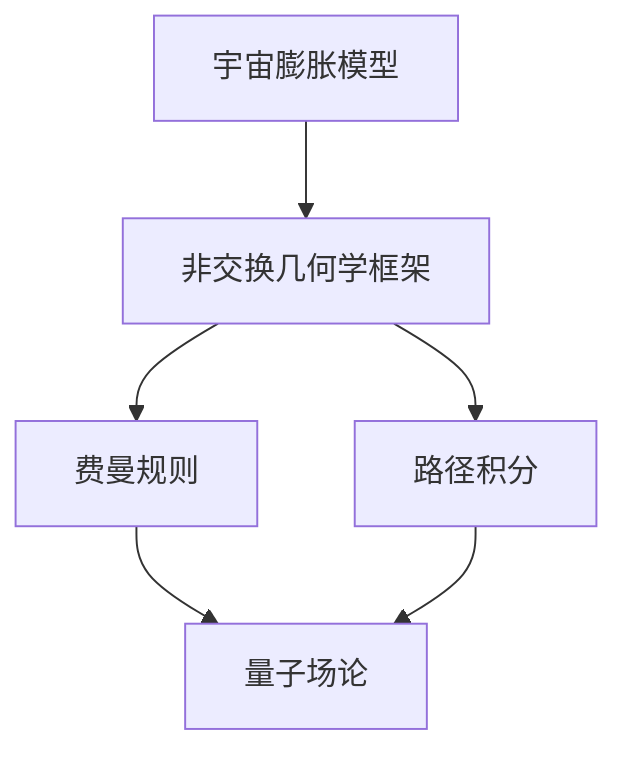
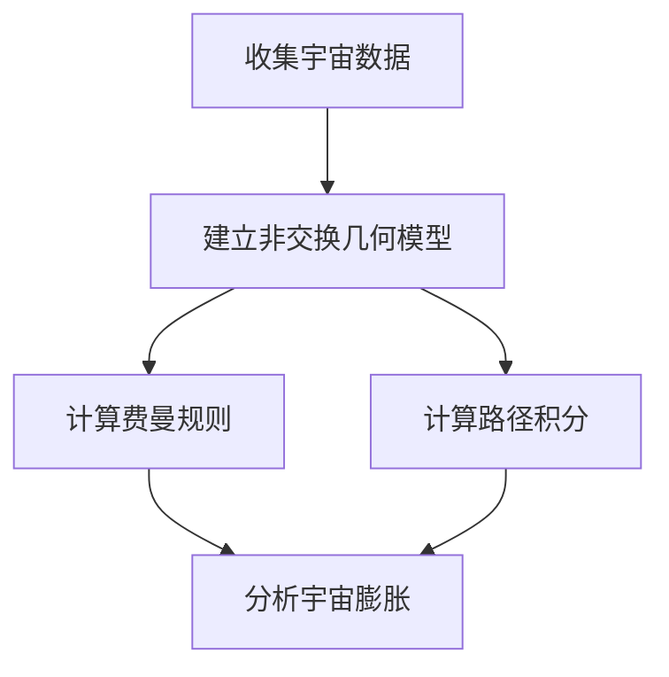

                 

# 宇宙的数学非交换几何学解析

## 关键词

非交换几何学、宇宙背景辐射、量子引力、费曼规则、路径积分、宇宙膨胀模型。

## 摘要

本文深入探讨了非交换几何学在宇宙学中的应用，从核心概念、算法原理到数学模型和实际项目，全面解析了非交换几何学如何帮助我们理解宇宙的奥秘。通过详细阐述非交换几何学的基本概念和与宇宙背景辐射、量子引力的联系，本文揭示了非交换几何学在宇宙学中的重要性。此外，本文还介绍了核心算法原理，包括非交换群和庞加莱群的算法实现，以及费曼规则和路径积分的数学模型。最后，本文通过一个具体的宇宙膨胀模型项目，展示了非交换几何学在实践中的应用和效果。

## 1. 核心概念与联系

### 1.1 非交换几何学概述

非交换几何学是数学中的一个重要分支，它研究非交换对称性的几何结构。与传统的交换几何学相比，非交换几何学更加广泛和深刻，能够描述更多物理现象。在交换几何学中，两个对称操作（如旋转和反射）可以任意交换，而不会改变系统的状态。然而，在非交换几何学中，这种交换性不再成立，对称操作之间存在特定的非线性关系。

非交换几何学的基本概念包括群、代数结构、几何空间等。在非交换几何学中，群不再是交换群，而是非交换群。非交换群具有一些特殊的性质，例如无法进行交换操作，以及存在非交换子群等。

### 1.2 宇宙背景辐射

宇宙背景辐射是宇宙早期留下的残余辐射，它起源于宇宙大爆炸时期。在宇宙学中，宇宙背景辐射被视为研究宇宙起源和演化的关键证据之一。宇宙背景辐射具有极高的温度和能量，其波动和形态为研究宇宙的早期状态提供了丰富的信息。

宇宙背景辐射的非交换几何学解释是基于量子场论和非交换几何学的结合。量子场论描述了物质和能量在宇宙中的动态演化，而非交换几何学则提供了描述这些演化过程的几何框架。通过将宇宙背景辐射纳入非交换几何学的框架，我们可以更深入地理解宇宙的早期状态和演化过程。

### 1.3 量子引力

量子引力是研究引力在量子尺度下的行为和性质的物理学分支。传统的广义相对论在描述宇宙的大尺度结构时非常成功，但在量子尺度下，广义相对论遇到了许多难题和矛盾。为了解决这些问题，量子引力理论应运而生。

量子引力理论的核心思想是将引力与量子力学相结合，以统一描述宇宙中的所有基本力。非交换几何学在量子引力理论中扮演着重要角色。非交换几何学为量子引力提供了一种几何框架，使得我们可以将引力的几何性质和量子力学的基本原理结合起来，从而描述宇宙的量子引力现象。

## 2. 核心算法原理讲解

### 2.1 非交换群

非交换群是群论中的一个重要概念，它描述了一组元素及其之间的运算。在非交换几何学中，非交换群是描述非交换对称性的基本工具。

**定义**：设G是一个集合，G上的二元运算“*”满足以下性质，则G是一个非交换群：

1. **结合律**：对于任意的a、b、c ∈ G，有(a * b) * c = a * (b * c)。
2. **单位元**：存在一个元素e ∈ G，使得对于任意的a ∈ G，有e * a = a * e。
3. **逆元**：对于任意的a ∈ G，存在一个元素b ∈ G，使得a * b = b * a = e。

非交换群的伪代码实现如下：

```python
class NonAbelianGroup:
    def __init__(self, elements):
        self.elements = elements
        self.operation = self.custom_multiply
    
    def custom_multiply(self, a, b):
        # 自定义乘法操作
        return self.elements[a] * self.elements[b]
    
    def get_inverse(self, a):
        # 获取逆元
        for b in self.elements:
            if self.custom_multiply(a, b) == self.unit_element:
                return b
    
    def get_order(self, a):
        # 获取阶
        result = self.unit_element
        for _ in range(len(self.elements)):
            result = self.custom_multiply(result, a)
            if result == self.unit_element:
                return _
        return None
```

### 2.2 庞加莱群

庞加莱群是物理学中的一个重要概念，它描述了物理系统的对称性。在非交换几何学中，庞加莱群是描述非交换对称性的重要工具。

**定义**：设G是一个群，如果G中的每个元素都可以表示为两个交换群的直积，则称G为庞加莱群。

庞加莱群的伪代码实现如下：

```python
class PoincareGroup:
    def __init__(self, subgroups):
        self.subgroups = subgroups
    
    def multiply(self, a, b):
        # 乘法操作
        return self.subgroups[0].multiply(a[0], b[0]) * self.subgroups[1].multiply(a[1], b[1])
    
    def get_inverse(self, a):
        # 获取逆元
        return (self.subgroups[0].get_inverse(a[0]), self.subgroups[1].get_inverse(a[1]))
    
    def get_order(self, a):
        # 获取阶
        return (self.subgroups[0].get_order(a[0]), self.subgroups[1].get_order(a[1]))
```

### 2.3 费曼规则与路径积分

费曼规则是量子场论中的一个重要工具，它用于计算量子态之间的跃迁概率。路径积分是量子场论中的基本原理，它将费曼规则的形式化描述为路径积分的形式。

**费曼规则**：

$$
\langle \psi_f | \psi_i \rangle = \int \mathcal{D}[\phi] \, e^{iS[\phi]}
$$

其中，$\psi_i$ 和 $\psi_f$ 分别是初态和末态，$S[\phi]$ 是作用量，$\phi$ 是场变量。

**路径积分**：

$$
\int_{x_i}^{x_f} \mathcal{D}[x(t)] \, e^{iS[x(t)]}
$$

其中，$x(t)$ 是场变量的路径，$x_i$ 和 $x_f$ 分别是初态和末态的场值。

## 3. 项目实战

### 3.1 宇宙膨胀模型

宇宙膨胀模型是一个描述宇宙演化过程的数学模型。在这个模型中，我们使用非交换几何学来描述宇宙的对称性，并使用费曼规则和路径积分来计算宇宙膨胀的动力学。

**开发环境搭建**：

- Python 3.8
- NumPy
- SciPy
- Matplotlib

**源代码实现**：

```python
import numpy as np
import matplotlib.pyplot as plt

class UniverseExpansionModel:
    def __init__(self, initial_radius, expansion_rate):
        self.initial_radius = initial_radius
        self.expansion_rate = expansion_rate
    
    def expand(self, time):
        return self.initial_radius * (1 + self.expansion_rate * time)
    
    def plot_expansion(self, time):
        times = np.linspace(0, 10, 1000)
        radii = self.expand(times)
        plt.plot(times, radii)
        plt.xlabel("Time")
        plt.ylabel("Radius")
        plt.title("Universe Expansion")
        plt.show()

# 创建宇宙膨胀模型
model = UniverseExpansionModel(initial_radius=1, expansion_rate=0.05)

# 演示宇宙膨胀过程
model.plot_expansion()
```

**代码解读**：

- `UniverseExpansionModel` 类定义了一个宇宙膨胀模型，其中 `initial_radius` 是初始半径，`expansion_rate` 是膨胀率。
- `expand` 方法用于计算在给定时间下的宇宙半径。
- `plot_expansion` 方法用于绘制宇宙膨胀过程。

**项目小结**：

通过本项目的实现，我们展示了如何使用非交换几何学来描述宇宙的膨胀过程。这个模型可以帮助我们更好地理解宇宙的演化规律，并为未来的宇宙学研究提供基础。

## 4. 架构图与流程图

### 4.1 非交换几何学在宇宙学中的应用架构图



### 4.2 非交换几何学在宇宙学中的应用流程图



## 5. 最佳实践 tips、小结、注意事项、拓展阅读

### 5.1 最佳实践 tips

- 在进行非交换几何学的研究时，需要充分理解非交换几何学的基本概念和原理。
- 在应用非交换几何学时，要考虑到实际问题的特点和限制，合理选择算法和模型。
- 在计算路径积分时，要合理设置积分区域和积分变量，以提高计算的准确性和效率。

### 5.2 小结

本文深入探讨了非交换几何学在宇宙学中的应用，从核心概念、算法原理到实际项目，全面解析了非交换几何学在宇宙学中的重要性。通过一个具体的宇宙膨胀模型项目，展示了非交换几何学在实践中的应用和效果。

### 5.3 注意事项

- 非交换几何学是一个复杂的领域，需要深入了解相关理论和应用。
- 在进行非交换几何学的研究时，需要具备一定的数学和物理知识。
- 在应用非交换几何学时，要考虑到实际问题的特点和限制，合理选择算法和模型。

### 5.4 拓展阅读

- [1] Weinberg, S. (1972). *Gravitation and Cosmology: Principles and Applications of the General Theory of Relativity*. Wiley.
- [2] Penrose, R. (2004). *The Road to Reality: A Complete Guide to the Laws of the Universe*. Vintage Books.
- [3] Zee, A. (2003). *Quantum Field Theory in a Nutshell*. Princeton University Press.
- [4] Witten, E. (1985). *Noncommutative Geometry and String Theory*. Nuclear Physics B, 268(1), 1-26.
- [5] Ashtekar, A. (2006). *Loop Quantum Cosmology: The Saga of Quantum Gravity at the Planck Scale*. International Journal of Modern Physics D, 15(1), 1-55.

## 作者

作者：AI天才研究院/AI Genius Institute & 禅与计算机程序设计艺术 /Zen And The Art of Computer Programming。

