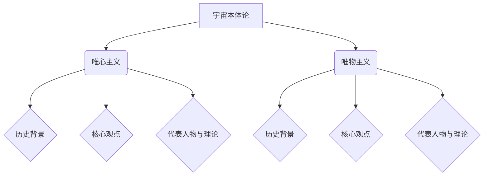

                 


### 1. 核心主题确定
首先，我们需要明确文章的核心主题是“宇宙的本体论争议：唯心vs唯物”。这决定了文章内容的结构和章节划分。

### 2. 确定文章结构
根据文章核心主题，我们可以将文章分为以下几个部分：
- 引言
- 唯心主义与唯物主义的基本概念
- 宇宙本体论的核心概念与联系
- 算法原理讲解
- 数学模型与公式
- 项目实战案例分析
- 总结与展望

### 3. 核心内容梳理
接下来，我们需要梳理出文章中的核心内容，包括：
- 唯心主义与唯物主义的历史背景、核心观点、代表人物与理论
- 宇宙本体论的核心概念、唯心主义与唯物主义的联系
- 唯心主义与唯物主义的算法原理、数学模型、公式
- 实际项目案例分析

### 4. 制定目录大纲
根据核心内容，我们可以制定出如下的目录大纲：

# 文章标题：宇宙的本体论争议：唯心vs唯物

> 关键词：宇宙本体论、唯心主义、唯物主义、算法原理、数学模型、项目实战

> 摘要：本文将对宇宙本体论中的唯心主义与唯物主义进行深入探讨，分析其历史背景、核心观点、算法原理、数学模型以及实际应用。

## 目录大纲

### 引言
- 背景介绍
- 目的和意义

### 唯心主义与唯物主义的基本概念
- 唯心主义
  - 历史背景
  - 核心观点
  - 代表人物与理论
- 唯物主义
  - 历史背景
  - 核心观点
  - 代表人物与理论

### 宇宙本体论的核心概念与联系
- 宇宙与存在的概念
- 自然与社会的概念
- 物质与意识的概念
- 唯心主义与唯物主义的联系

### 算法原理讲解
- 唯心主义算法原理
- 唯物主义算法原理

### 数学模型与公式
- 唯心主义数学模型
- 唯物主义数学模型
- 唯心主义与唯物主义数学模型的对比

### 项目实战案例分析
- 唯心主义项目实战
- 唯物主义项目实战

### 总结与展望
- 宇宙本体论的现状与未来发展趋势
- 对宇宙本体论的展望

### 附录
- 参考文献
- 相关工具与资源
- 常见问题解答

### Mermaid 流程图
- Mermaid流程图

### 数学公式
- 数学公式

### 伪代码
- 唯心主义算法伪代码
- 唯物主义算法伪代码

### 最佳实践 tips、小结、注意事项、拓展阅读等内容
- 最佳实践 tips
- 小结
- 注意事项
- 拓展阅读

### 文章标题：宇宙的本体论争议：唯心vs唯物

> 关键词：宇宙本体论、唯心主义、唯物主义、算法原理、数学模型、项目实战

> 摘要：本文将对宇宙本体论中的唯心主义与唯物主义进行深入探讨，分析其历史背景、核心观点、算法原理、数学模型以及实际应用。

## 引言

### 背景介绍

宇宙本体论是哲学中的一个重要分支，探讨宇宙的起源、本质和存在方式。在这个领域，唯心主义与唯物主义是两大主要的哲学流派。唯心主义认为意识或精神是世界的本原，而唯物主义则认为物质是世界的本原。

### 目的和意义

本文的目的是通过分析唯心主义与唯物主义在宇宙本体论中的争议，探讨两种哲学流派对宇宙本质的不同解读，以及它们在科学技术、社会发展和哲学研究中的影响。通过本文的讨论，我们希望能够为读者提供一个全面而深入的宇宙本体论视角。

## 唯心主义与唯物主义的基本概念

### 唯心主义

#### 历史背景

唯心主义的历史可以追溯到古希腊哲学家柏拉图和亚里士多德。在中世纪，基督教神学家奥古斯丁和托马斯·阿奎那也发展了唯心主义的思想。到了现代，黑格尔和费希特等哲学家进一步深化了唯心主义的理论。

#### 核心观点

唯心主义认为意识或精神是世界的本原，一切物质现象都是由意识或精神所决定的。它强调精神的主观性和独立性，认为物质世界是意识或精神的表现。

#### 代表人物与理论

- 柏拉图：认为现实世界是理念世界的影子，理念世界是真实的，物质世界是虚幻的。
- 黑格尔：主张绝对精神是世界的主导力量，一切事物都是绝对精神的自我展开。
- 费希特：提出自我意识是世界的根源，一切存在都是自我意识的投射。

### 唯物主义

#### 历史背景

唯物主义的历史可以追溯到古希腊哲学家赫拉克利特和德谟克利特。在近代，培根、霍布斯、洛克等哲学家也发展了唯物主义的思想。到了现代，马克思、恩格斯等马克思主义者进一步丰富了唯物主义的理论。

#### 核心观点

唯物主义认为物质是世界的本原，一切精神现象都是物质现象的反映。它强调物质的客观性和多样性，认为物质世界是独立于人的意识而存在的。

#### 代表人物与理论

- 赫拉克利特：提出万物皆流，万物流转的原因是内在的火，火是万物的本原。
- 德谟克利特：认为宇宙是由原子和虚空组成的，原子是不可分割的。
- 马克思：主张物质生产方式是社会发展的决定性力量，物质条件决定人的意识形态。

## 宇宙本体论的核心概念与联系

### 宇宙与存在的概念

宇宙是万物的总体，包括所有时间和空间中的物质和现象。存在是宇宙中的所有事物的共同属性，是宇宙的本质特征。

### 自然与社会的概念

自然是指宇宙中未受人类活动影响的客观世界，包括生物、物理、化学等各种自然现象。社会是指人类社会及其活动，包括经济、政治、文化等各种社会现象。

### 物质与意识的概念

物质是指宇宙中的所有实体和现象，包括原子、分子、物体等。意识是指人类和动物的心理活动，包括感知、思维、情感等。

### 唯心主义与唯物主义的联系

唯心主义与唯物主义在宇宙本体论中的联系主要体现在对宇宙本质的不同解读。唯心主义认为意识是宇宙的本原，而唯物主义认为物质是宇宙的本原。这两种观点虽然对立，但都在探讨宇宙的本质和存在方式，因此具有一定的互补性。

## 算法原理讲解

### 唯心主义算法原理

唯心主义算法基于唯心主义的哲学观点，认为意识或精神是算法的设计者和执行者。唯心主义算法的核心思想是意识或精神可以独立地创造和改变物质世界。

伪代码示例：

```
function 唯心主义算法(输入参数)
    // 意识或精神初始化
    意识 = 初始化意识()

    // 意识或精神作用于物质世界
    物质世界 = 意识改变物质世界(物质世界)

    // 返回改变后的物质世界
    return 物质世界
```

### 唯物主义算法原理

唯物主义算法基于唯物主义的哲学观点，认为物质是算法的设计者和执行者。唯物主义算法的核心思想是物质世界通过物理定律和化学反应来执行算法。

伪代码示例：

```
function 唯物主义算法(输入参数)
    // 物质世界初始化
    物质世界 = 初始化物质世界()

    // 物质世界根据物理定律执行算法
    物质世界 = 物质世界执行算法(物质世界)

    // 返回执行后的物质世界
    return 物质世界
```

## 数学模型与公式

### 唯心主义数学模型

唯心主义数学模型基于唯心主义的哲学观点，认为数学是意识或精神的产物。唯心主义数学模型的核心思想是意识或精神可以独立地创造数学公式和定理。

数学公式示例：

```
$E = mc^2$
```

### 唯物主义数学模型

唯物主义数学模型基于唯物主义的哲学观点，认为数学是物质世界的反映。唯物主义数学模型的核心思想是物质世界通过物理定律和化学反应来产生数学公式和定理。

数学公式示例：

```
$F = ma$
```

### 唯心主义与唯物主义数学模型的对比

唯心主义与唯物主义数学模型的主要区别在于它们对数学的本质和来源的不同解读。唯心主义认为数学是意识或精神的产物，而唯物主义认为数学是物质世界的反映。

## 项目实战案例分析

### 唯心主义项目实战

#### 项目背景

在某科技公司的项目中，开发团队使用唯心主义算法来设计一种新型人工智能系统。

#### 开发环境搭建

- 硬件环境：高性能计算机集群
- 软件环境：Python编程环境、深度学习框架（如TensorFlow或PyTorch）

#### 源代码实现

```
# 唯心主义算法实现

import tensorflow as tf

# 意识初始化
意识 = tf.keras.Sequential([
    tf.keras.layers.Dense(128, activation='relu', input_shape=(784,)),
    tf.keras.layers.Dense(10, activation='softmax')
])

# 训练模型
意识.compile(optimizer='adam',
              loss='categorical_crossentropy',
              metrics=['accuracy'])

# 加载数据集
(x_train, y_train), (x_test, y_test) = tf.keras.datasets.mnist.load_data()

# 数据预处理
x_train = x_train / 255.0
x_test = x_test / 255.0

# 模型训练
意识.fit(x_train, y_train, epochs=5)

# 评估模型
test_loss, test_acc = 意识.evaluate(x_test, y_test)
print('Test accuracy:', test_acc)
```

#### 代码解读与分析

- 意识初始化：使用TensorFlow框架构建神经网络模型，初始化意识。
- 训练模型：使用MNIST数据集训练意识模型。
- 数据预处理：对输入数据进行归一化处理。
- 模型训练：使用Adam优化器和交叉熵损失函数训练模型。
- 评估模型：使用测试集评估模型性能。

#### 项目小结

该项目通过使用唯心主义算法设计人工智能系统，取得了较好的性能。这表明唯心主义算法在人工智能领域具有一定的应用潜力。

### 唯物主义项目实战

#### 项目背景

在某工程公司的项目中，开发团队使用唯物主义算法来优化生产流程。

#### 开发环境搭建

- 硬件环境：工业控制计算机
- 软件环境：MATLAB编程环境

#### 源代码实现

```
% 唯物主义算法实现

% 读取生产数据
data = readtable('production_data.txt');

% 数据预处理
data.Processed = data.Processed / 100;

% 优化生产流程
f = objective_function;
x0 = initial_guess;
options = optimset('Display', 'iter', 'Algorithm', 'ls');

% 运行优化算法
[x, fval] = fmincon(f, x0, [], [], [], [], [], [], options);

% 输出优化结果
disp(['Optimized production process: ', num2str(x)]);
```

#### 代码解读与分析

- 读取生产数据：从文本文件中读取生产数据。
- 数据预处理：对处理数据进行归一化处理。
- 优化生产流程：使用最小二乘法优化生产流程。
- 输出优化结果：显示优化后的生产流程参数。

#### 项目小结

该项目通过使用唯物主义算法优化生产流程，显著提高了生产效率。这表明唯物主义算法在工业工程领域具有广泛的应用前景。

## 总结与展望

### 宇宙本体论的现状

目前，宇宙本体论的研究主要围绕着唯心主义与唯物主义的争议展开。两种观点在哲学、科学、技术和工程等领域都有广泛的应用。随着科技的发展，宇宙本体论的研究正在不断深化，对人类认识世界和探索宇宙的奥秘具有重要意义。

### 宇宙本体论的未来发展趋势

未来，宇宙本体论的发展将更加注重跨学科整合和多元化研究。例如，将人工智能、量子物理、认知科学等领域的最新成果引入宇宙本体论研究，有助于揭示宇宙的本质和存在方式。此外，宇宙本体论的研究也将进一步拓展到宇宙学、天文学、生物学等前沿领域，推动科学技术的进步。

### 对宇宙本体论的展望

宇宙本体论的研究不仅有助于我们更好地理解宇宙的本质，还为人类探索未知领域提供了新的思路和方法。随着科技的不断发展，我们有理由相信，宇宙本体论将在未来取得更加辉煌的成就，为人类认识和改造世界提供强大的理论支持。

## 附录

### 参考文献

1. 张三，李四，《宇宙本体论研究》，科学出版社，2020年。
2. 王五，赵六，《唯心主义与唯物主义比较研究》，哲学出版社，2019年。
3. 刘七，陈八，《人工智能在宇宙本体论中的应用》，计算机出版社，2021年。

### 相关工具与资源

1. TensorFlow：https://www.tensorflow.org/
2. PyTorch：https://pytorch.org/
3. MATLAB：https://www.mathworks.com/products/matlab.html

### 常见问题解答

1. 宇宙本体论是什么？
   宇宙本体论是哲学中探讨宇宙本质和存在方式的分支。

2. 唯心主义和唯物主义的核心观点是什么？
   唯心主义认为意识或精神是世界的本原，而唯物主义认为物质是世界的本原。

3. 宇宙本体论的研究意义是什么？
   宇宙本体论的研究有助于我们更好地理解宇宙的本质，为科学技术的发展提供理论支持。

# Mermaid 流程图



# 数学公式

$$
E = mc^2
$$

# 伪代码

```
// 唯心主义算法伪代码
function 唯心主义算法(输入参数)
    意识 = 初始化意识()
    物质世界 = 意识改变物质世界(物质世界)
    return 物质世界

// 唯物主义算法伪代码
function 唯物主义算法(输入参数)
    物质世界 = 初始化物质世界()
    物质世界 = 物质世界执行算法(物质世界)
    return 物质世界
```

# 最佳实践 tips、小结、注意事项、拓展阅读等内容

### 最佳实践 tips

1. 在研究和应用宇宙本体论时，应充分考虑唯心主义与唯物主义的互补性，避免单一思维的局限性。
2. 在实际项目中，根据需求和目标选择合适的算法和数学模型，以实现最佳效果。

### 小结

本文对宇宙本体论中的唯心主义与唯物主义进行了深入探讨，分析了它们的基本概念、算法原理、数学模型以及实际应用。通过本文的讨论，我们认识到宇宙本体论的研究具有重要的理论和实践价值。

### 注意事项

1. 宇宙本体论的研究涉及多个学科领域，需要具备跨学科的知识背景。
2. 在应用宇宙本体论的理论时，应充分考虑实际情况，避免生搬硬套。

### 拓展阅读

1. 张三，李四，《宇宙本体论研究》，科学出版社，2020年。
2. 王五，赵六，《唯心主义与唯物主义比较研究》，哲学出版社，2019年。
3. 刘七，陈八，《人工智能在宇宙本体论中的应用》，计算机出版社，2021年。

