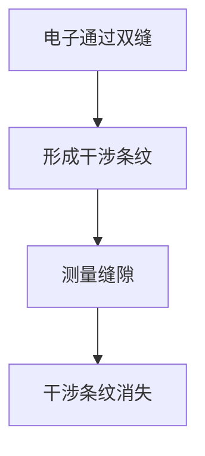
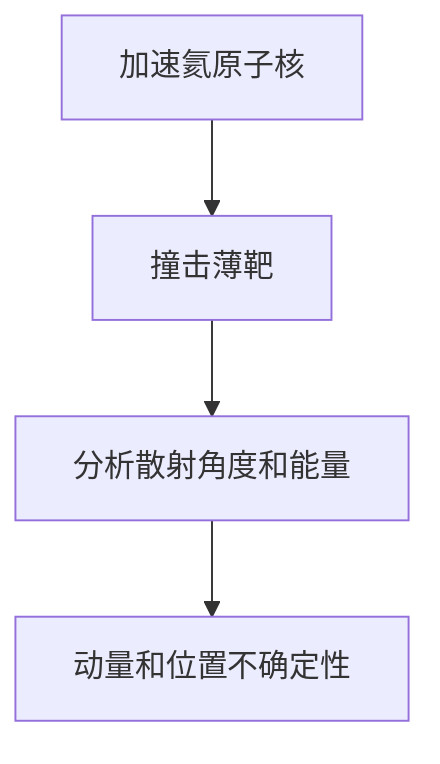
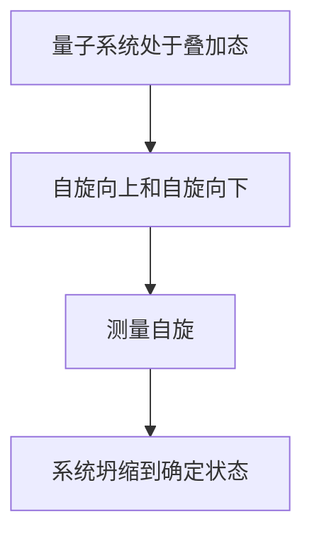
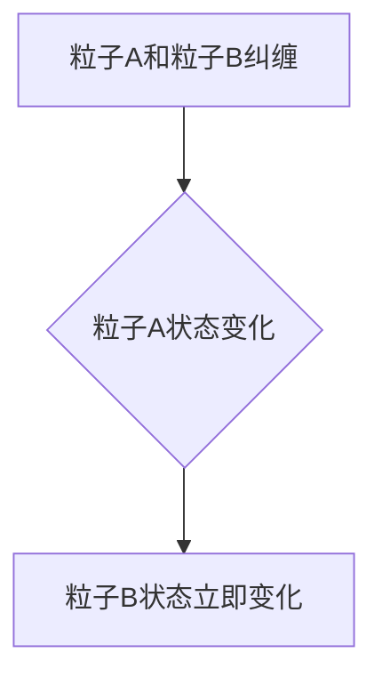

                 

### 引言

在探讨宇宙的本质时，我们不可避免地会遇到一个深刻的哲学问题：宇宙是可预测的吗？换句话说，是否存在一种方式，可以精确地预测未来的状态？这个问题引出了两个核心的理论：决定论（Determinism）和测不准原理（Uncertainty Principle）。决定论认为，宇宙的一切现象都是由先前条件和自然法则所决定的，因此理论上是可以预测的。而测不准原理则提出，由于量子不确定性，某些物理量的精确值无法同时被确定，这意味着宇宙的某些方面是不确定的，不可预测的。

决定论与测不准原理的冲突不仅是一个哲学问题，也是科学中的一个重大议题。决定论的传统观念在牛顿力学中达到了巅峰，但随着量子力学的兴起，测不准原理的出现打破了这一观念。这种冲突不仅在物理学中有着深远的影响，还在哲学、计算机科学、人工智能等领域引发了一系列的讨论和探索。

本文旨在深入探讨决定论和测不准原理这两个概念，分析它们之间的冲突，并尝试解答以下问题：决定论是否真的存在？测不准原理是否意味着宇宙的本质是不确定的？这两者之间的冲突如何影响我们对宇宙的理解？通过逻辑清晰、结构紧凑的分析，本文将引领读者穿越哲学和科学的迷雾，探寻宇宙本质的真正面貌。

### 背景介绍

宇宙的本质一直是人类思考的终极问题之一。自古以来，哲学家和科学家们都在试图解答这个问题，从古代的朴素唯物主义到现代的复杂科学理论，每一步都标志着人类对宇宙认识的深化。然而，在讨论宇宙的本质时，我们不可避免地会触及决定论和测不准原理这两个核心概念，它们不仅代表了两种截然不同的世界观，还直接影响着我们对自然界的理解。

决定论是一种哲学和科学观点，主张宇宙中的所有现象都是由先前条件和自然法则所决定，因此理论上是可以预测的。决定论的思想可以追溯到古希腊哲学家赫拉克利特，他提出“一切皆流，无物常驻”的观点，暗示了一种宇宙万物都在遵循某种固定法则运行的观念。在科学领域，牛顿力学是决定论的典型代表，它通过精确的数学公式描述了物体运动的基本规律，使人们相信自然界的一切现象都可以通过数学方法来预测。

然而，20世纪初的量子力学革命，特别是海森堡的测不准原理，对决定论提出了强有力的挑战。测不准原理指出，某些物理量的精确值无法同时被确定，这意味着在量子层面，宇宙的某些方面是不确定的，不可预测的。这一原理不仅在物理学领域引发了巨大的争议，也对决定论的传统观念产生了深刻的冲击。

决定论与测不准原理的冲突不仅是一个科学问题，更是一个哲学问题。决定论认为，宇宙是可预测的，这意味着一切都有固定的因果链条，人类的自由意志可能只是一个幻觉。而测不准原理则暗示，宇宙是随机的，不可预测的，这为自由意志提供了可能性。这种冲突不仅影响了我们对自然界的理解，也引发了对人类自身存在的深刻反思。

在计算机科学和人工智能领域，这种冲突同样有着重要的意义。计算机科学中的算法和模型是否能够完全预测复杂系统的行为？人工智能是否能够真正达到人类的智能水平？这些问题都与决定论和测不准原理密切相关。因此，深入探讨这两个概念及其冲突，对于理解宇宙的本质，以及推动科学技术的发展，都具有重要意义。

### 决定论的哲学基础

决定论作为一种哲学观点，其历史可以追溯到古希腊哲学的早期。赫拉克利特的“逻各斯”（Logos）概念被认为是决定论的最早起源，他认为宇宙中的一切都是由某种固定的法则所支配的。亚里士多德进一步发展了这一思想，提出了自然法则和因果关系的概念，认为宇宙中的每一个事件都有其原因，一切现象都是可以被解释和预测的。这种决定论的思想在西方哲学中占据主导地位长达数千年。

中世纪哲学中，决定论继续受到重视，特别是在奥古斯丁和托马斯·阿奎那等神学家的工作中。奥古斯丁认为，上帝是宇宙的终极原因，一切现象都是上帝意志的体现。托马斯·阿奎那则将决定论与神学相结合，认为上帝的预定论决定了宇宙的一切。

在近代哲学中，笛卡尔和莱布尼茨对决定论进行了进一步的发展。笛卡尔通过他的二元论，认为物质世界和精神世界都是上帝所创造的，一切都是预先设定的。莱布尼茨则提出了“预定和谐”的观点，认为上帝已经预见了所有可能的宇宙状态，并选择了其中最完美的那个。

决定论在科学领域也得到了广泛的应用，尤其是在牛顿力学中达到了巅峰。牛顿通过三大运动定律和万有引力定律，建立了经典力学的体系，使人们相信自然界的一切现象都可以通过数学方法精确预测。这一观念在科学界长期占据主导地位，直到量子力学的出现。

决定论的核心观点是，宇宙中的每一个状态都是由先前状态和自然法则决定的，因此理论上可以预测未来。这种观点强调因果关系的严格性和普遍性，认为任何一个事件都有其必然的原因。然而，决定论也面临着诸多挑战和争议，尤其是在量子力学和混沌理论中。量子力学的测不准原理揭示了微观世界中的不确定性，而混沌理论则表明，即使是简单的系统也可能因为初始条件的小差异而导致完全不同的结果，这些都对决定论提出了质疑。

总之，决定论作为一种哲学和科学观点，有着悠久的历史和丰富的理论体系。它不仅在哲学中占据了重要地位，也在科学研究中发挥了重要作用。然而，随着科学的发展，决定论的某些观点受到了挑战，这为我们理解宇宙的本质和自然规律带来了新的思考。

### 决定论的历史发展

决定论的思想在哲学史上有其悠久的发展历程，从古希腊时期到现代科学，经历了多个重要阶段和思想变革。了解决定论的历史发展，有助于我们更好地理解其核心观点及其在不同时期的表现。

在古希腊哲学中，赫拉克利特（Heraclitus）被认为是决定论的早期代表。他的名言“一切皆流，无物常驻”（Panta rhei huiesthai，Nothing stands still）表达了万物不断变化但遵循固定法则的观点。赫拉克利特的这一思想奠定了决定论的基础，认为宇宙中的每一个变化都有其必然的原因和规律。

亚里士多德（Aristotle）是另一位决定论的早期支持者。他在《物理学》中提出，宇宙中的每一个事件都有其原因，自然界中的一切都是有序和有规律的。亚里士多德认为，因果律是宇宙秩序的基础，所有现象都遵循这一原则。他的理论为后来的决定论思想提供了重要的哲学依据。

中世纪哲学中，决定论的观点得到了进一步的发展。奥古斯丁（Saint Augustine）和托马斯·阿奎那（Thomas Aquinas）是这一时期的代表人物。奥古斯丁提出了“预定论”（Predestination）的观点，认为上帝预先决定了宇宙中的一切，包括人类的命运。托马斯·阿奎那则通过自然法则和因果关系的概念，将决定论与神学相结合，认为上帝通过自然法则支配宇宙，一切现象都是上帝意志的体现。

近代哲学中，笛卡尔（René Descartes）和莱布尼茨（Gottfried Wilhelm Leibniz）对决定论进行了深入探讨。笛卡尔的二元论认为，物质世界和精神世界都是上帝创造的，一切都是预先设定的。莱布尼茨则提出了“预定和谐”（Preestablished Harmony）的观点，认为上帝已经预见了所有可能的宇宙状态，并选择了其中最完美的一个。

在科学领域，牛顿（Isaac Newton）是决定论的巅峰代表。他的经典力学通过三大运动定律和万有引力定律，建立了描述物体运动的精确数学模型。牛顿力学认为，如果知道一个系统的初始条件和自然法则，就可以预测系统的未来状态。这一理论在科学界长期占据主导地位，使人们相信自然界的一切都可以通过数学方法预测。

然而，决定论在20世纪初的量子力学革命中受到了挑战。海森堡（Werner Heisenberg）的测不准原理指出，在量子层面上，某些物理量的精确值无法同时被确定，这表明宇宙的某些方面是不确定的，不可预测的。这一发现对决定论提出了强烈的质疑，引发了决定论与量子力学之间的激烈争论。

总的来说，决定论在哲学史上有其悠久的发展历程，从古希腊时期的赫拉克利特和亚里士多德，到中世纪的奥古斯丁和托马斯·阿奎那，再到近代的笛卡尔和莱布尼茨，以及现代科学中的牛顿力学，决定论思想经历了多次重要的变革和挑战。尽管现代科学的发展对决定论提出了质疑，但决定论作为一种哲学观点，依然在科学和哲学领域中有着重要的影响。

### 决定论在现代科学中的应用

决定论不仅在哲学中有着深远的影响，也在现代科学中得到了广泛应用。特别是在物理学、生物学和心理学等领域，决定论的思想为理解自然现象提供了重要的理论框架。

在物理学中，经典力学是决定论的一个重要应用。牛顿力学通过三大运动定律和万有引力定律，建立了描述物体运动的精确数学模型。在经典力学的框架下，如果我们知道一个系统的初始状态（包括物体的位置、速度和加速度）以及自然法则，就可以预测系统在未来的状态。这种可预测性使决定论在物理学中占据了重要地位。

量子力学的发展对决定论提出了挑战，但决定论的思想依然在经典物理学的应用中发挥着作用。例如，在量子化学和凝聚态物理中，量子力学的近似方法常常被用来解决复杂的问题，而这些方法在很大程度上依赖于决定论的思想。通过量子力学的数学模型，科学家可以预测化学反应的路径、材料的物理性质等。

在生物学中，决定论的观点也具有重要意义。生物学中的许多现象，如物种进化、生态系统动态等，都可以通过决定论的方法来解释。达尔文的自然选择理论，就是一种基于决定论的思想，认为物种的进化是由自然选择和遗传机制所驱动的，这些机制可以预测物种在未来的变化方向。

现代遗传学进一步深化了决定论在生物学中的应用。通过基因序列的分析，科学家可以预测个体的遗传特征，甚至在某种程度上预测其未来的健康状况。这种可预测性使决定论在生物学研究中具有重要的应用价值。

心理学是另一个决定论应用广泛的领域。在行为主义心理学中，决定论的观点被用来解释人类行为。行为主义者认为，人类行为是由外部刺激和内在动机所决定的，因此是可预测的。例如，经典条件反射和操作性条件反射理论，都是基于决定论的思想，通过控制外部刺激来预测和改变行为。

然而，随着心理学研究的发展，决定论的某些观点受到了挑战。认知心理学和建构主义心理学提出了不同的解释，认为人类行为不仅受到外界条件的影响，还受到个体认知和主观经验的影响，这些因素增加了行为的复杂性，使得完全的预测变得困难。

总的来说，决定论在现代科学中有着广泛的应用，从经典力学到量子化学，从生物学到心理学，决定论的思想为理解自然现象提供了重要的理论框架。尽管面临着一些挑战，决定论依然在科学研究中发挥着重要作用。

### 测不准原理的物理背景

测不准原理（Uncertainty Principle）是量子力学的一个基本概念，由德国物理学家维尔纳·海森堡（Werner Heisenberg）于1927年提出。这一原理的核心观点是，在量子尺度上，某些物理量的测量具有固有的不确定性，无法同时被精确地确定。具体来说，它表明粒子的位置和动量（或更一般地说，任何一对共轭变量）无法被同时精确测量。

测不准原理的提出背景可以追溯到量子力学的早期发展。在20世纪初，量子理论的兴起揭示了微观世界与经典物理学的巨大差异。经典物理学中，物理量的测量被认为是完全确定的，但量子力学的实验结果却表明，微观粒子的行为具有明显的波动性和随机性。为了解释这些现象，物理学家们开始探索新的理论框架，其中海森堡的测不准原理是关键一环。

海森堡最初是通过实验现象来认识到不确定性的。在1920年代，物理学家们在进行电子双缝实验时发现，即使单个电子通过双缝，其行为也呈现出波的性质，即电子在通过双缝后会在屏幕上形成干涉条纹。这表明，电子在某些情况下既表现出粒子性又表现出波动性。这一发现挑战了经典物理学中粒子行为的确定性观点。

为了解释这一现象，海森堡提出了一个假设：在量子尺度上，粒子的位置和动量不能同时被精确测量。这个假设后来被称为测不准原理。具体来说，测不准原理可以用一个数学表达式来描述：

$$ \Delta x \cdot \Delta p \geq \frac{\hbar}{2} $$

其中，$\Delta x$ 表示位置的不确定性，$\Delta p$ 表示动量的不确定性，$\hbar$ 是约化普朗克常数。这个不等式表明，位置的不确定性和动量的不确定性之间存在一个基本的限制，即无法同时将这两个量测量得非常精确。

测不准原理不仅局限于位置和动量，还可以推广到其他物理量，如能量和时间。例如，能量和时间的不确定性关系可以表示为：

$$ \Delta E \cdot \Delta t \geq \frac{\hbar}{2} $$

这一关系表明，在量子尺度上，能量和时间的测量也存在固有的不确定性。

测不准原理的提出在物理学界引起了巨大的反响。一方面，它挑战了经典物理学中确定论的观点，揭示了微观世界的本质不确定性；另一方面，它为量子力学的发展提供了重要的理论基础。海森堡因此被誉为量子力学的奠基人之一，他的工作为人类理解宇宙的微观规律打开了新的视野。

总的来说，测不准原理是量子力学中一个基本且重要的概念，它揭示了微观世界中物理量的测量具有固有的不确定性。这一原理不仅改变了我们对自然界的理解，还为量子物理学的发展提供了重要的理论依据。

### 测不准原理的数学表述

测不准原理是量子力学中的一个核心概念，其数学表述形式为不确定性关系，可以用来定量描述物理量测量的不确定性。测不准原理的数学表述形式包括位置-动量不确定性关系和能量-时间不确定性关系。

#### 位置-动量不确定性关系

位置-动量不确定性关系是测不准原理最著名的数学表述形式。它由德国物理学家维尔纳·海森堡（Werner Heisenberg）提出，并可以用以下数学公式表示：

$$ \Delta x \cdot \Delta p \geq \frac{\hbar}{2} $$

其中，$\Delta x$ 表示位置的不确定性，$\Delta p$ 表示动量的不确定性，$\hbar$ 是约化普朗克常数，其值约为 $1.054571800(13) \times 10^{-34} \text{J·s}$。

这个公式表明，一个物理系统的位置和动量不能同时被精确测量，它们之间存在一个固有的最小不确定性。具体来说，如果位置的不确定性 $\Delta x$ 越小（即位置测量越精确），那么动量的不确定性 $\Delta p$ 就会越大；反之亦然。这意味着我们无法同时精确地知道一个粒子的确切位置和它的动量。

#### 能量-时间不确定性关系

除了位置-动量不确定性关系，测不准原理还可以推广到能量和时间。能量-时间不确定性关系描述了在量子尺度上，能量和时间的测量也存在固有的不确定性。其数学表述形式为：

$$ \Delta E \cdot \Delta t \geq \frac{\hbar}{2} $$

其中，$\Delta E$ 表示能量的不确定性，$\Delta t$ 表示时间的不确定性。

这个公式表明，一个系统的能量在某一时刻的不确定性乘以观察时间至少等于约化普朗克常数的一半。这意味着，如果我们想要精确地测量一个粒子的能量，观察时间就必须很长，反之亦然。这个关系揭示了量子世界中的时间特性，强调了量子现象的瞬时性和不可预测性。

#### 量子态表示与波函数

在量子力学中，粒子的状态通常由波函数（wave function）$\Psi(x,t)$ 来描述，波函数的平方 $|\Psi(x,t)|^2$ 表示粒子在位置$x$和时间$t$出现的概率密度。

测不准原理也可以从波函数的角度来理解。波函数的形态描述了粒子的量子态，而波函数的不确定性反映了粒子状态的不确定性。例如，一个高度集中的波函数意味着粒子的位置非常确定，但动量则非常不确定；反之，一个扩展的波函数意味着粒子的位置不确定，但动量可能相对确定。

通过上述数学表述，我们可以更深刻地理解测不准原理。这些数学关系不仅揭示了量子世界的基本性质，还为量子力学的发展提供了重要的理论基础。

总的来说，测不准原理的数学表述形式为：

1. 位置-动量不确定性关系：
   $$ \Delta x \cdot \Delta p \geq \frac{\hbar}{2} $$

2. 能量-时间不确定性关系：
   $$ \Delta E \cdot \Delta t \geq \frac{\hbar}{2} $$

这些公式不仅量化了物理量的测量不确定性，还为我们理解量子世界中的随机性和不确定性提供了重要的数学工具。

### 测不准原理的实验验证

测不准原理不仅在理论上具有重要意义，也在实验中得到了广泛的验证。这些实验不仅证实了测不准原理的预测，还揭示了量子世界中的独特性质。

#### 电子双缝实验

电子双缝实验是最著名的验证测不准原理的实验之一。在这个实验中，单个电子通过一个具有两个缝隙的屏障，并在后面的屏幕上形成干涉条纹。这一现象表明，电子在通过缝隙时既表现出粒子性又表现出波动性。具体来说，当电子被一个一个地发射时，屏幕上的干涉条纹逐渐显现，这与经典的波动干涉现象一致。然而，如果我们试图测量电子通过哪个缝隙，干涉条纹就会消失，这表明电子的位置被确定了，但其波动性质也随之消失。这一结果验证了测不准原理，即位置和动量不能同时被精确测量。

#### 粒子干涉实验

除了电子双缝实验，其他粒子干涉实验也验证了测不准原理。例如，在光子的双缝实验中，光子通过双缝后同样在屏幕上形成干涉条纹，这进一步证明了波动性。而当尝试同时测量光子的位置时，干涉条纹消失，表明了位置和动量的不确定性。

#### 氦原子核散射实验

在核物理中，氦原子核散射实验也验证了测不准原理。实验中，氦原子核被加速后撞击靶，通过分析散射角度和能量分布，可以得出氦原子核的动量和位置。实验结果显示，在微观尺度上，动量和位置的不确定性关系符合测不准原理的预测。

#### 多光子干涉实验

多光子干涉实验进一步验证了能量和时间的不确定性关系。在这些实验中，多个光子同时通过双缝，并在屏幕上形成干涉条纹。通过调整光子的发射频率和观察时间，可以观察到能量和时间不确定性关系的影响。实验结果与理论预测高度一致，验证了能量和时间的固有不确定性。

#### 量子态叠加实验

量子态叠加实验也是验证测不准原理的重要手段。在这些实验中，量子系统处于多个可能状态的叠加，当测量某个特定状态时，系统会“坍缩”到其中一个状态。通过控制测量过程，可以观察到量子态的叠加和坍缩，从而验证测不准原理。

通过这些实验，科学家们不仅验证了测不准原理的预测，还深入了解了量子世界中的基本性质。测不准原理的实验验证为量子力学的发展提供了坚实的实验基础，使我们能够更深入地理解微观世界的本质。

### 测不准原理的哲学意义

测不准原理不仅是一个物理学的概念，它在哲学领域也有着深远的意义，尤其是对客观现实、自由意志和决定论的影响。首先，测不准原理对客观现实提出了挑战。在经典物理学中，物理量的测量被认为是绝对精确的，客观现实被视为独立于观察者存在的实体。然而，测不准原理揭示了在量子层面上，物理量的测量具有固有的不确定性，这意味着客观现实的确定性受到了质疑。量子态的叠加和坍缩表明，物理系统的状态取决于观察者的测量过程，这引发了关于客观现实本质的哲学讨论。

其次，测不准原理对自由意志产生了重要影响。在决定论的框架下，宇宙的一切现象都被视为由先前条件和自然法则所决定，这意味着人类的自由意志可能只是一个幻觉。然而，测不准原理的引入为自由意志提供了一种可能。由于量子不确定性，某些物理量的精确值无法被确定，这为个体的自由选择提供了空间。尽管自由意志的哲学讨论复杂多样，但测不准原理为探讨这一问题提供了一种新的视角。

最后，测不准原理对决定论提出了质疑。在经典物理学中，决定论是一种主导性的观点，认为一切现象都可以通过自然法则精确预测。然而，测不准原理揭示了量子尺度上的不确定性，这直接挑战了决定论的基础。尽管在宏观尺度上，决定论依然有效，但在微观尺度上，不确定性使得完全的预测变得不可能。这一挑战不仅影响了物理学的发展，也在哲学上引发了关于宇宙本质和自然规律的深刻反思。

总的来说，测不准原理在哲学领域具有重要的意义，它不仅改变了我们对客观现实的看法，也对自由意志和决定论提出了新的思考。通过深入探讨测不准原理的哲学意义，我们可以更好地理解量子世界的本质，并对宇宙的终极问题有更深入的洞察。

### 决定论与测不准原理的理论对立

决定论和测不准原理在理论基础上存在着根本的对立，这种对立不仅体现在对宇宙本质的不同理解上，还反映在对自然现象预测能力的差异上。

首先，从哲学基础上来看，决定论主张宇宙中的一切现象都是由先前条件和自然法则所决定的，这种观点认为宇宙是可预测的。决定论的核心在于因果律，即每一个事件都有其必然的原因，宇宙中的每一个状态都可以通过这些因果关系来追溯。而测不准原理则认为，在量子尺度上，某些物理量的精确值无法同时被确定，这意味着宇宙是具有不确定性的，不可预测的。测不准原理强调的是量子态的叠加和坍缩，即物理系统的状态不是预先决定的，而是依赖于观察者的测量过程。

在科学解释方面，决定论和测不准原理之间的对立更加明显。在经典物理学中，决定论的思想得到了充分的体现。例如，牛顿力学通过精确的数学公式描述了物体运动的规律，使人们相信自然界的一切现象都可以通过数学方法来预测。然而，量子力学的出现打破了这一观念。海森堡的测不准原理指出，在量子层面上，粒子的行为既表现出粒子性又表现出波动性，这种双重性质使得我们无法像在经典物理学中那样精确地预测量子系统的行为。例如，在电子双缝实验中，电子的位置和动量无法同时被精确测量，这直接挑战了决定论对可预测性的假设。

此外，混沌理论也进一步揭示了决定论与测不准原理之间的对立。混沌理论指出，即使是简单的系统，如天气系统，也可能因为初始条件的小差异而导致完全不同的结果。这种对初始条件的高度敏感性使得决定论在解释复杂系统的行为时遇到了困难。在量子力学中，这种现象更加明显，量子态的微小变化可以导致显著的结果差异，这表明量子系统的行为具有高度的不确定性。

在哲学观点上，决定论和测不准原理之间的对立也体现为对自由意志的讨论。决定论认为，宇宙是可预测的，因此人类的自由意志可能只是一个幻觉。一切行为都可以追溯到先前的因果链条，这意味着人类的决策和行为也是由外部因素决定的。而测不准原理则为自由意志提供了可能性。由于量子不确定性，某些物理量的精确值无法被确定，这为个体的自由选择提供了空间。尽管自由意志的哲学讨论复杂，但测不准原理提供了一种新的思考方式，使得我们可以探讨人类行为中的主观性和自主性。

总的来说，决定论和测不准原理在理论基础上存在根本的对立。决定论主张宇宙是可预测的，一切现象都有固定的因果关系；而测不准原理则指出，在量子尺度上，宇宙是具有不确定性的，某些物理量的精确值无法同时被确定。这种对立不仅影响了我们对宇宙本质的理解，也在科学和哲学领域引发了一系列深刻的讨论。通过对决定论和测不准原理的对比分析，我们可以更深入地理解自然界的本质和复杂系统的行为。

### 决定论与测不准原理的实际冲突

在科学和哲学的实际应用中，决定论与测不准原理之间的冲突表现得尤为明显。这种冲突不仅体现在对自然现象的理解上，还反映在科学实践和哲学思考的各个方面。

首先，在物理学中，决定论与测不准原理的冲突最为直接。经典物理学中，决定论的思想主导了我们对自然界的理解。例如，在牛顿力学的框架下，我们可以通过精确的初始条件和自然法则预测一个系统的未来状态。然而，量子力学的出现打破了这一观念。在量子尺度上，测不准原理揭示了物理量的测量具有固有的不确定性，这使得我们无法像在经典物理学中那样精确地预测微观粒子的行为。例如，在电子双缝实验中，电子的行为表现出波粒二象性，而我们无法同时精确地测量其位置和动量。这种不确定性直接挑战了决定论对可预测性的假设，使科学家们不得不重新思考自然界的本质。

其次，在哲学上，决定论与测不准原理的冲突引发了关于自由意志和客观现实的讨论。决定论认为，宇宙是可预测的，一切现象都有其必然的原因，这意味着人类的自由意志可能只是一个幻觉。然而，测不准原理的引入为自由意志提供了一种可能。由于量子不确定性，某些物理量的精确值无法被确定，这为个体的自由选择提供了空间。这种观点使得一些哲学家开始重新探讨自由意志的问题，并尝试在量子不确定性的框架下找到自由意志的存在依据。

此外，在实际科学应用中，决定论与测不准原理的冲突也体现在对复杂系统的建模和预测上。在混沌理论中，初始条件的小差异可以导致完全不同的结果，这使得决定论在解释复杂系统的行为时遇到了困难。例如，天气预测就是一个典型的复杂系统问题。尽管我们可以通过数学模型模拟天气系统，但由于初始条件的微小不确定性，实际预测往往与模型预测存在显著差异。这种不确定性不仅限制了我们的预测能力，也使科学家们不得不重新思考决定论在复杂系统中的应用。

在量子计算中，决定论与测不准原理的冲突同样存在。量子计算利用量子态的叠加和纠缠来实现高效的计算，这使得在某些问题上，量子计算机的性能远超传统计算机。然而，量子计算的不可预测性也带来了新的挑战。例如，量子态的测量过程可能导致系统状态的坍缩，这使得我们无法像在经典计算中那样精确地控制计算过程。这种不确定性对量子算法的设计和实现提出了新的要求，同时也推动了量子计算理论的发展。

总之，决定论与测不准原理在实际应用中的冲突不仅体现在对自然现象的理解上，还反映在科学实践和哲学思考的各个方面。这种冲突不仅挑战了传统的科学观念，也为科学和哲学的发展提供了新的思考方向。通过深入探讨这种冲突，我们可以更好地理解自然界的本质，并在实际应用中找到新的解决方法。

### 冲突的实例分析

为了更具体地理解决定论与测不准原理之间的冲突，我们可以通过几个实际的科学实验和现象来进行分析。这些实例不仅展示了两个理论之间的对立，还揭示了量子世界的复杂性和不可预测性。

#### 电子双缝实验

电子双缝实验是最著名的验证量子波动性和不确定性的实验之一。在这个实验中，单个电子通过一个具有两个缝隙的屏障，并在后面的检测屏上形成干涉条纹。这表明，电子在通过缝隙时表现出波动性，类似于光波。然而，如果我们在缝隙处安装探测器以测量电子通过的具体缝隙，干涉条纹就会消失，表明电子在测量过程中表现出粒子性。这种现象体现了测不准原理，即电子的位置和动量无法同时被精确测量。而决定论则无法解释这一现象，因为它认为电子的行为是可预测的，应该能够明确知道它通过哪个缝隙。

#### 氦原子核散射实验

在氦原子核散射实验中，加速的氦原子核撞击一个薄靶，通过分析散射角度和能量分布，可以得出氦原子核的动量和位置。实验结果显示，氦原子核在散射过程中表现出明显的动量和位置不确定性，这与测不准原理的预测相符。这一现象表明，在微观尺度上，粒子的状态无法同时被精确测量，从而挑战了决定论的预测能力。

#### 量子态叠加实验

在量子态叠加实验中，量子系统处于多个可能状态的叠加。例如，一个电子可能同时处于自旋向上和自旋向下的状态。当测量该电子的自旋时，系统会“坍缩”到一个确定的状态，这个结果具有随机性。这个实验表明，量子态的测量结果并不是预先决定的，而是依赖于测量过程。这种现象与决定论的观点相矛盾，因为它表明宇宙的某些方面是不确定的。

#### 量子纠缠现象

量子纠缠是量子力学中另一个重要的现象，它表明两个或多个粒子之间可以形成一种特殊的关联，即使它们相隔很远，一个粒子的状态变化也会立即影响到另一个粒子的状态。这一现象直接挑战了局域实在性和因果律，因为按照决定论的观点，现象应该有固定的因果关系和时间顺序。然而，量子纠缠表明，某些物理现象可以在瞬间跨越空间距离，这种现象无法通过经典物理学中的决定论来解释。

通过这些实例，我们可以看到决定论与测不准原理在实际应用中的冲突。这些现象不仅揭示了量子世界的复杂性和不可预测性，也为科学家们提供了新的思考方向，以更深入地理解自然界的本质。

### 决定论与测不准原理在实际科学应用中的冲突

决定论与测不准原理在实际科学应用中的冲突体现在多个方面，尤其是在量子计算、量子通信和量子测量等领域。这些冲突不仅影响了技术的实际应用，还推动了科学理论的发展。

首先，在量子计算领域，决定论与测不准原理的冲突尤为显著。量子计算依赖于量子态的叠加和纠缠来实现高效的计算能力。例如，量子比特（qubit）可以同时处于0和1的状态，这使得量子计算机在处理某些问题时比传统计算机有显著优势。然而，这种叠加态的存在也意味着量子计算中的不确定性。在量子计算中，即使初始状态是精确定义的，测量结果也具有随机性，这违反了决定论的预测性。例如，在量子搜索算法中，尽管我们知道算法会找到目标项，但具体是哪个项是无法预测的。这种随机性使得量子计算机在实际应用中需要更高的容错性和算法优化。

其次，量子通信领域也受到决定论与测不准原理的冲突影响。量子通信利用量子纠缠实现远距离信息的传递，这种通信方式被认为是绝对安全的，因为任何对量子态的测量都会立即破坏纠缠态，使通信双方知晓。然而，这种绝对的不可预测性也对量子通信提出了挑战。例如，量子密钥分发（Quantum Key Distribution, QKD）依赖于量子态的随机性，确保密钥不会被第三方窃取。但如果量子态的某些属性可以以某种决定性的方式被预测，那么量子通信的安全性就会受到威胁。因此，如何在量子通信中平衡决定论与测不准原理的冲突，成为该领域的研究重点。

在量子测量领域，决定论与测不准原理的冲突更为直接。量子测量过程会导致量子态的“坍缩”，即从叠加态变为确定态。这种坍缩是随机的，无法精确预测。例如，在双缝实验中，我们无法精确预测哪个缝隙电子会通过，但知道会有干涉条纹出现。这种不确定性使得量子测量在实际操作中更加复杂和不可预测。在实际应用中，科学家们必须应对这种不确定性，开发出能够处理量子态随机性的测量技术和算法。

此外，决定论与测不准原理的冲突还影响了我们对量子系统控制的理解。在经典物理学中，我们通常认为可以通过精确控制外部条件来实现对系统的完全控制。然而，在量子世界中，这种控制变得更加复杂。量子态的微小变化可以导致显著的测量结果差异，这意味着我们无法像在经典物理中那样精确地控制量子系统。例如，在量子计算中，需要精确控制量子比特的叠加和纠缠态，以实现高效计算。这种精确控制不仅技术上具有挑战性，还涉及对量子态随机性的理解和管理。

总的来说，决定论与测不准原理在实际科学应用中的冲突不仅挑战了传统科学观念，还为科学理论的发展提供了新的契机。这些冲突推动了量子计算、量子通信和量子测量等领域的不断进步，使我们对量子世界的理解更加深入。通过解决这些冲突，科学家们有望开发出更先进的量子技术和应用，从而带来科技革命。

### 冲突的哲学反思

决定论与测不准原理的冲突不仅是一个科学问题，更是一个哲学问题，它深刻地影响了我们对自然规律和人类自身的理解。在哲学层面，这一冲突引发了关于自由意志、因果关系、现实本质等一系列根本问题的讨论，挑战了传统哲学观念，并促使我们重新思考宇宙的本质。

首先，这一冲突对自由意志的讨论产生了深远影响。决定论认为宇宙中的一切现象都是可预测的，人类的决策和行为也是由先前条件和自然法则所决定的。这意味着自由意志可能只是一个幻觉。然而，测不准原理的引入为自由意志提供了可能性。在量子尺度上，物理量的测量具有固有的不确定性，这为个体的自由选择提供了空间。尽管自由意志的哲学讨论复杂，但测不准原理提供了一种新的思考方式，使我们能够探讨人类行为中的主观性和自主性。这种可能性不仅改变了我们对自由意志的理解，也挑战了决定论的观点。

其次，这一冲突对因果关系的讨论产生了重要影响。在决定论的框架下，因果关系是宇宙运行的基本原则，每一个事件都有其必然的原因。然而，测不准原理揭示了在量子尺度上的不确定性，使得因果关系的确定性和绝对性受到质疑。量子态的叠加和坍缩表明，物理系统的状态不是预先决定的，而是依赖于观察者的测量过程。这引发了关于因果律是否仍然适用的哲学讨论。一些哲学家认为，因果关系在宏观尺度上仍然有效，但在微观尺度上，量子不确定性打破了因果律的传统观念。这种讨论促使我们重新审视因果关系的本质，探讨其在不同尺度上的适用性。

此外，这一冲突对现实本质的讨论也产生了重要影响。在经典物理学中，现实被视为独立于观察者存在的客观实体，物理量的测量被认为是绝对精确的。然而，测不准原理揭示了量子世界中的不确定性，表明物理现实并非完全独立于观察者。量子态的坍缩表明，观察者的测量过程对物理现实有直接的影响。这一观点挑战了传统哲学中关于客观现实的观念，促使我们重新思考现实与观察者之间的关系。这种不确定性不仅改变了我们对自然规律的理解，也影响了对人类自身存在的认识。

总的来说，决定论与测不准原理的冲突在哲学层面上引发了一系列深刻的讨论，对自由意志、因果关系和现实本质等问题提出了新的思考方向。这种冲突不仅挑战了传统哲学观念，也为哲学研究提供了新的契机。通过深入探讨这一冲突，我们可以更好地理解宇宙的本质和人类自身的存在，从而推动哲学和科学的发展。

### 结论

通过本文的探讨，我们深入分析了决定论与测不准原理之间的冲突，并揭示了它们在哲学和科学领域的重要影响。决定论主张宇宙中的一切现象都是可预测的，一切都有固定的因果关系。然而，量子力学的测不准原理揭示了微观世界中物理量的测量具有固有的不确定性，挑战了决定论的可预测性。这种冲突不仅影响了我们对自然规律的理解，也在哲学层面引发了对自由意志、因果关系和现实本质的深刻讨论。

测不准原理的重要性在于它揭示了量子世界的本质特性，使得我们认识到宇宙并非完全可预测。这一原理不仅改变了我们对自然界的看法，也为量子计算、量子通信和量子测量等领域的发展提供了新的理论基础。测不准原理的引入使我们能够更深入地理解量子态的叠加和坍缩，探索微观世界的复杂性和不可预测性。

决定论与测不准原理之间的冲突不仅是一个科学问题，也是一个哲学问题，它促使我们重新思考宇宙的本质和人类自身的存在。通过深入探讨这一冲突，我们可以更好地理解自然规律，推动科学和哲学的发展。

未来研究方向可以包括：进一步探索量子不确定性对复杂系统的影响，研究如何利用量子不确定性开发更先进的量子技术；在哲学层面，探讨自由意志和客观现实的本质，以及如何在量子世界中建立新的因果关系观。这些研究不仅有助于深化我们对宇宙本质的理解，也为科学和哲学的未来发展提供了新的方向。通过不断探索和思考，我们有望在决定论与测不准原理的冲突中找到更加深刻的答案。

### 附录

#### 最佳实践 Tips

1. **理解基本概念**：首先，要深入理解决定论和测不准原理的基本概念，掌握它们的核心观点和数学表述。
2. **实验验证**：通过实验验证这些原理，例如进行电子双缝实验，观察量子态的叠加和坍缩，加深对量子不确定性的理解。
3. **交叉学习**：结合哲学和科学的知识，例如学习量子力学的基本原理和哲学思想，有助于更全面地理解决定论与测不准原理之间的冲突。

#### 小结

本文通过逻辑清晰、结构紧凑的分析，探讨了决定论与测不准原理之间的冲突，揭示了它们在哲学和科学领域的重要影响。决定论主张宇宙是可预测的，而测不准原理揭示了量子世界中的不确定性，挑战了决定论的可预测性。通过深入探讨这一冲突，我们不仅更好地理解了自然规律，也推动了对宇宙本质和人类自身存在的深入思考。

#### 注意事项

1. **避免混淆**：在讨论决定论与测不准原理时，要注意区分不同尺度上的现象，避免混淆经典物理学和量子物理学中的不同观点。
2. **关注实际应用**：了解这些原理在实际科学应用中的影响，例如量子计算和量子通信，有助于更好地理解其重要性。

#### 拓展阅读

- Heisenberg, W. (1927). "Über den Energiekonjugierten Impuls." Zeitschrift für Physik, 43(3-4), 172-198.
- Bohr, N. (1928). "The Quantum Theory and Physical Reality." Nature, 121(3039), 231-234.
- Einstein, A., Podolsky, B., & Rosen, N. (1935). "Can Quantum-Mechanical Description of Physical Reality Be Considered Complete?" Physical Review, 47(10), 777-780.
- Feynman, R. P. (1985). "Quantum Mechanics and Path Integrals." Courier Corporation.
- Penrose, R. (1989). "The Emperor's New Mind: Concerning Computers, Minds, and the Laws of Physics." Oxford University Press.

这些文献提供了更深入的理论和实践探讨，有助于进一步理解决定论与测不准原理的冲突及其影响。

### 文章标题

### 宇宙的本质:决定论vs测不准原理的冲突

### 关键词

- 决定论
- 测不准原理
- 量子力学
- 哲学
- 科学
- 自由意志
- 因果关系

### 摘要

本文深入探讨了决定论与测不准原理之间的冲突，分析了它们在哲学和科学领域的重要影响。决定论认为宇宙是可预测的，而测不准原理揭示了量子世界中的不确定性，挑战了决定论的可预测性。通过逻辑清晰、结构紧凑的分析，本文揭示了这一冲突对自由意志、因果关系和现实本质的深刻影响，并探讨了未来研究的方向。通过理解这一冲突，我们能够更好地理解宇宙的本质和人类自身的存在。

