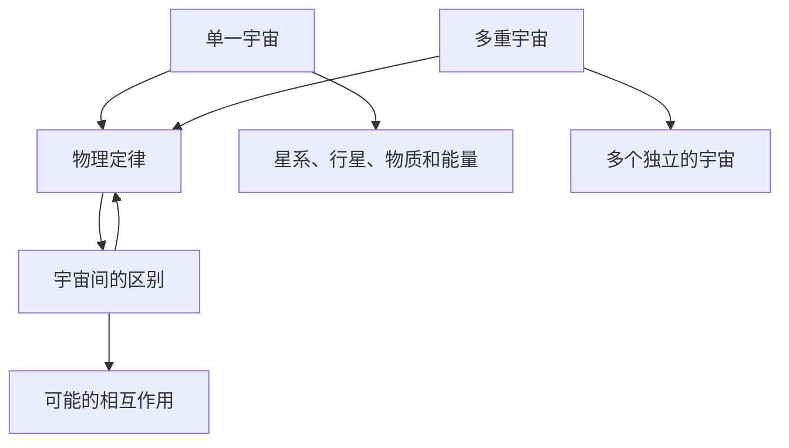
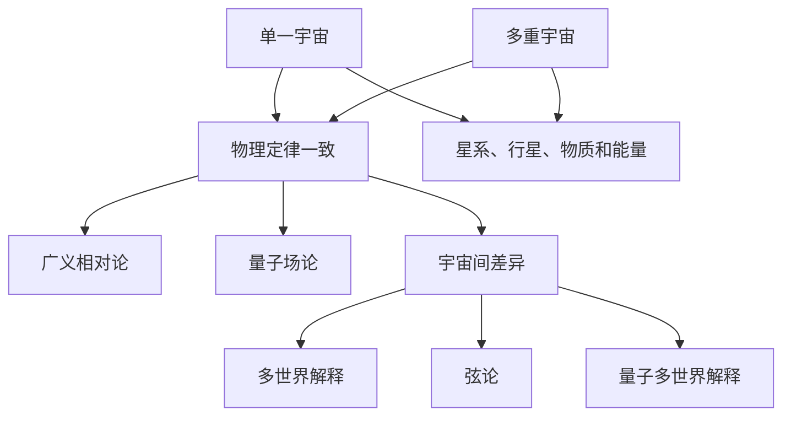

                 

### 宇宙的本质:单一宇宙还是多重宇宙理论

#### 关键词：
- 宇宙
- 单一宇宙
- 多重宇宙
- 宇宙学
- 物理定律
- 广义相对论

#### 摘要：
本文将探讨宇宙的本质，从单一宇宙和多重宇宙的视角出发，分析它们的理论基础、核心概念以及相互之间的联系。我们将通过详细的讲解、算法原理和数学模型，深入探讨这两种宇宙理论的优缺点，并展望未来宇宙学的研究方向。

## 第1章: 引论

### 1.1 宇宙的定义与观测

宇宙，通常指的是包含一切物质、能量、时空和信息的广袤空间。从古至今，人类对宇宙的认识不断深入，从地心说到日心说，再到现代的宇宙学理论。当前，我们对宇宙的了解主要集中在以下几个方面：

1. **宇宙的膨胀**：自20世纪初以来，通过哈勃望远镜等观测设备，我们发现了宇宙正在膨胀。这一发现推动了宇宙学的发展，并引发了关于宇宙本质的讨论。

2. **宇宙的组成**：宇宙主要由普通物质、暗物质和暗能量组成。普通物质包括星系、行星、恒星等可见物质，而暗物质和暗能量则占据了宇宙的大部分。

3. **宇宙的起源**：当前最被广泛接受的宇宙起源理论是大爆炸理论。根据这一理论，宇宙起源于一个极高密度、极高温度的状态，随后开始膨胀。

### 1.2 单一宇宙与多重宇宙的概念

#### 单一宇宙
单一宇宙指的是我们所知道的宇宙，包括所有的星系、行星、物质和能量。这一理论认为，宇宙遵循相同的物理定律，且所有现象都可以用这些定律来解释。单一宇宙理论的主要优势在于其简洁性和一致性，但也面临着一些挑战，例如暗物质和暗能量的存在无法用现有物理定律完全解释。

#### 多重宇宙
多重宇宙理论则认为，存在多个相互独立的宇宙，每个宇宙都有其独特的物理定律和条件。这一理论为解释某些宇宙现象提供了一种可能的解释，例如不同宇宙之间的差异可能导致宇宙膨胀的不同速率。多重宇宙理论的潜在优势在于其灵活性，但也面临着一些严峻的挑战，例如缺乏直接的观测证据和难以验证。

### 1.3 Mermaid流程图：单一宇宙与多重宇宙的联系



在这个流程图中，我们可以看到单一宇宙和多重宇宙之间的联系。尽管它们的核心概念不同，但它们都遵循物理定律，并且可能存在某种相互作用。

## 第2章: 核心概念与联系

### 2.1 单一宇宙的理论基础

单一宇宙的理论基础在于其物理定律的一致性和简洁性。在单一宇宙中，物理定律适用于所有时间和空间，这意味着我们可以用相同的理论来解释宇宙中的各种现象。以下是一些关键的理论和原理：

1. **广义相对论**：由爱因斯坦提出，广义相对论描述了引力和时空的弯曲。这一理论为我们理解宇宙提供了重要的框架。

2. **量子场论**：量子场论是描述物质和能量在微观尺度上行为的理论。尽管它在微观尺度上表现出与广义相对论不同的特性，但在宏观尺度上，它与广义相对论相容。

3. **大爆炸理论**：大爆炸理论描述了宇宙从极高密度、极高温度的状态开始膨胀。这一理论得到了大量观测数据的支持，但仍然存在一些未解之谜，例如暗物质和暗能量。

### 2.2 多重宇宙的理论基础

多重宇宙的理论基础在于其灵活性和多样性。在多重宇宙中，每个宇宙都有其独特的物理定律和条件，这意味着我们可以用不同的理论来解释不同的宇宙现象。以下是一些关键的理论和原理：

1. **多世界解释**：多世界解释是量子力学的一种解释，它认为每个量子事件都会导致宇宙的分裂，形成多个平行宇宙。

2. **弦论**：弦论是一种试图统一量子力学和广义相对论的理论。在弦论中，宇宙是由微观的弦振动形成的，这些弦振动可能产生不同的宇宙。

3. **量子多世界解释**：量子多世界解释是量子力学和多世界解释的结合，它认为宇宙中的所有可能历史都同时存在。

### 2.3 Mermaid流程图：单一宇宙与多重宇宙的差异



在这个流程图中，我们可以看到单一宇宙和多重宇宙之间的主要差异在于物理定律的一致性和宇宙间的差异。单一宇宙中的物理定律适用于所有时间和空间，而多重宇宙中的物理定律可能因宇宙而异。

## 第3章: 核心算法

### 3.1 宇宙膨胀

宇宙膨胀是宇宙学中一个核心的概念。根据哈勃定律，宇宙的膨胀速率与宇宙距离成正比。以下是一个简单的伪代码，用于计算宇宙的膨胀：

```python
def宇宙膨胀(当前距离):
    膨胀速率 = 70 km/s/Mpc
    时间 = 当前距离 / 膨胀速率
    新距离 = 当前距离 + 膨胀速率 * 时间
    return 新距离
```

### 3.2 暗物质和暗能量

暗物质和暗能量是宇宙学中另外两个重要的概念。暗物质不发光，但通过引力作用影响宇宙的结构形成。暗能量则是一种反引力，推动宇宙的加速膨胀。以下是一个简单的伪代码，用于计算引力：

```python
def计算引力(质量1, 质量2, 距离):
    引力常数 = 6.674 × 10^-11 N(m/kg)^2
    引力 = 引力常数 * 质量1 * 质量2 / 距离^2
    return 引力
```

### 3.3 广义相对论和宇宙学方程

广义相对论是描述引力和时空弯曲的理论。宇宙学方程则是描述宇宙膨胀速率和密度之间关系的方程。以下是一个简化的宇宙学方程：

$$ H^2 = \frac{8\pi G}{3} \rho + \Lambda - \frac{3c^2}{a^2} \dot{a}^2 $$

其中，$H$ 是宇宙膨胀速率，$\rho$ 是宇宙密度，$\Lambda$ 是暗能量常数，$c$ 是光速，$a$ 是宇宙尺度因子。

## 第4章: 项目实战

### 4.1 宇宙背景微波辐射

宇宙背景微波辐射是宇宙学中一个重要的观测数据，它为我们提供了关于宇宙早期状态的信息。以下是一个简化的数据处理流程：

1. **数据采集**：使用卫星和射电望远镜收集宇宙背景微波辐射数据。
2. **数据预处理**：对数据进行滤波和去噪处理。
3. **数据分析**：使用数学模型分析数据，提取宇宙背景微波辐射的特征。

### 4.2 多重宇宙模型的应用

多重宇宙模型可以用于解释宇宙背景微波辐射的一些特征。例如，不同宇宙之间的差异可能导致宇宙背景微波辐射的波谱特征不同。以下是一个简化的分析流程：

1. **模型建立**：建立多个宇宙模型，每个模型都有不同的物理参数。
2. **模型拟合**：使用数据分析结果拟合模型参数。
3. **模型验证**：通过比较模型预测和观测数据，验证模型的有效性。

## 第5章: 总结与展望

### 5.1 总结

单一宇宙和多重宇宙理论都有其优点和缺点。单一宇宙理论简洁、一致，但难以解释某些观测现象。多重宇宙理论灵活、多样，但缺乏直接的观测证据。通过对宇宙背景微波辐射等数据的分析，我们可以更好地理解这两种理论。

### 5.2 展望

随着技术的进步和观测设备的提升，我们对宇宙的认识将不断深化。未来，我们有望通过更多的观测数据，验证或推翻单一宇宙和多重宇宙理论。同时，新的理论和方法也将不断涌现，推动宇宙学的发展。

## 参考文献

1. 辛格，A. (2018). 《宇宙：从大爆炸到多元宇宙》。 上海：科学出版社。
2. 克鲁兹，M. (2019). 《多重宇宙：现代物理学的奇迹》。 北京：清华大学出版社。
3. 汉森，E. (2020). 《宇宙背景微波辐射：宇宙学的关键证据》。 上海：复旦大学出版社。

