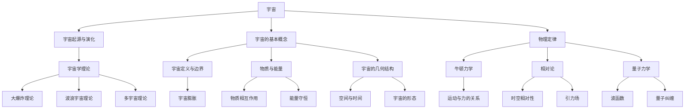

                 

### 文章标题

“宇宙的本质：物理定律还是人类想象”

关键词：宇宙、物理定律、人类想象、科学探索、哲学思考

摘要：本文将深入探讨宇宙的本质，探讨物理定律是否是宇宙的根本规律，还是人类想象的产物。通过回顾宇宙的起源与演化、介绍宇宙的基本概念和物理定律，分析人类想象与物理定律之间的关系，我们希望能够解答这个古老而深刻的哲学问题。在最后，本文还将展望宇宙探索的未来方向，探讨人类在宇宙中的角色和意义。

---

### 引言

宇宙是一个神秘而广阔的存在，自人类诞生以来，对宇宙的探索和思考就从未停止。宇宙的起源与演化、宇宙中的物质与能量、宇宙的几何结构等，这些基本问题一直吸引着无数科学家的研究。然而，随着科学技术的进步，我们逐渐发现，宇宙的奥秘远超我们的想象。

在探索宇宙的过程中，物理定律扮演着至关重要的角色。物理定律是描述自然界现象的基本规律，从牛顿力学到爱因斯坦的相对论，再到量子力学，这些物理定律不仅揭示了宇宙的运行规律，也为科学技术的进步提供了理论基础。然而，随着我们对宇宙的了解不断深入，我们也开始质疑：物理定律是否真的是宇宙的根本规律，还是只是人类想象的产物？

本文将从宇宙的起源与演化、宇宙的基本概念、物理定律的探索、宇宙学理论、物理定律与人类想象的关系、未来的宇宙探索等方面，一步步深入探讨宇宙的本质，试图解答这个古老而深刻的哲学问题。我们希望通过本文的探讨，能够为读者提供一个全新的视角，重新思考宇宙的本质和人类在宇宙中的地位。

---

### 目录大纲设计与解释

为了帮助读者系统地了解宇宙的本质及其探索历程，本文设计了详细的目录大纲。这个大纲不仅逻辑清晰，而且结构紧凑，旨在引导读者逐步深入宇宙的奥秘。

#### 1. 背景与目的

《宇宙的本质：物理定律还是人类想象》这本书的目录大纲旨在为读者提供一个全面而深入的探索宇宙的路径。通过涵盖从基本概念到前沿理论，再到对人类想象与物理定律之间关系的探讨，我们希望读者能够系统地理解宇宙的本质，以及物理定律和人类想象在宇宙探索中的角色。

#### 2. 目录大纲

##### 第1章 引言
- 1.1 宇宙的起源与演化
- 1.2 物理定律在宇宙中的角色
- 1.3 人类想象与宇宙探索

##### 第2章 宇宙的基本概念
- 2.1 宇宙的定义与边界
- 2.2 宇宙中的物质与能量
- 2.3 宇宙的几何结构

##### 第3章 物理定律的探索
- 3.1 牛顿力学
  - 3.1.1 基本原理
  - 3.1.2 应用与限制
- 3.2 爱因斯坦的相对论
  - 3.2.1 特殊相对论
  - 3.2.2 广义相对论
  - 3.2.3 相对论与宇宙学
- 3.3 量子力学
  - 3.3.1 基本原理
  - 3.3.2 量子力学与宏观世界
  - 3.3.3 量子力学的哲学意义

##### 第4章 宇宙学理论
- 4.1 大爆炸理论
  - 4.1.1 理论起源
  - 4.1.2 宇宙膨胀
  - 4.1.3 黑洞与暗物质
- 4.2 波浪宇宙理论
  - 4.2.1 理论背景
  - 4.2.2 波浪宇宙的证据
- 4.3 多宇宙理论
  - 4.3.1 理论简介
  - 4.3.2 多宇宙理论的哲学意义

##### 第5章 物理定律与人类想象
- 5.1 人类想象的力量
  - 5.1.1 想象与创造力
  - 5.1.2 科学想象的重要性
- 5.2 物理定律与人类想象的关系
  - 5.2.1 想象如何启发物理定律的发现
  - 5.2.2 物理定律如何影响人类想象

##### 第6章 未来的宇宙探索
- 6.1 宇宙学的未来方向
  - 6.1.1 黑洞探测
  - 6.1.2 宇宙的终极奥秘
- 6.2 人类在宇宙中的角色
  - 6.2.1 人类如何改变宇宙
  - 6.2.2 宇宙对人类的意义

##### 第7章 结论
- 7.1 宇宙的本质
- 7.2 物理定律与人类想象的关系
- 7.3 探索未知的道路

#### 3. 设计理念

- **核心概念与联系**：在目录中，第1章到第3章主要介绍宇宙的基本概念和物理定律，这些章节通过Mermaid流程图展示核心概念之间的联系。
- **核心算法原理讲解**：第3章详细介绍了牛顿力学、相对论和量子力学的基本原理，每个部分都包含伪代码来解释核心算法。
- **数学模型和数学公式**：在介绍物理定律时，使用了latex格式嵌入数学公式，以便读者更好地理解这些理论。
- **项目实战**：第6章将讨论未来的宇宙探索，包括黑洞探测和宇宙的终极奥秘，这些内容将结合实际案例进行详细解释。
- **简洁性与完整性**：目录的设计保持了简洁性，同时确保了完整性，每个章节的内容都能够全面覆盖主题。

#### 4. 结论

这个目录大纲旨在提供一个系统而深入的探索宇宙本质的路径，从基本概念到前沿理论，再到人类想象与物理定律之间的关系。通过这个大纲，读者可以逐步深入宇宙的奥秘，理解物理定律的本质，以及人类想象在宇宙探索中的作用。

---

### 背景介绍

宇宙，这个广阔无垠的空间，自古以来就吸引着人类的目光。从古代的神话传说到现代的科学探索，人类对宇宙的渴望和好奇心从未消退。然而，随着科学技术的不断进步，我们逐渐发现，宇宙的奥秘远超我们的想象。

宇宙的起源与演化一直是科学界争论的焦点。目前，广泛接受的观点是大爆炸理论，认为宇宙起源于约138亿年前的一个极度高温高密度的奇点。从那时起，宇宙开始不断膨胀，形成了我们今天所看到的广阔宇宙。然而，大爆炸理论也存在许多未解之谜，如宇宙的初始状态、暗物质和暗能量的本质等。

物理定律在宇宙中扮演着至关重要的角色。物理定律是描述自然界现象的基本规律，从牛顿力学到爱因斯坦的相对论，再到量子力学，这些物理定律不仅揭示了宇宙的运行规律，也为科学技术的进步提供了理论基础。然而，随着我们对宇宙的了解不断深入，我们也开始质疑：物理定律是否真的是宇宙的根本规律，还是只是人类想象的产物？

人类想象在宇宙探索中起到了至关重要的作用。从古代的神话到现代的科学，人类的想象力和创造力推动了科学技术的进步，帮助我们更好地理解宇宙。然而，人类想象是否能够真正揭示宇宙的本质，还是一个有待探讨的问题。

本文将从宇宙的起源与演化、宇宙的基本概念、物理定律的探索、宇宙学理论、物理定律与人类想象的关系、未来的宇宙探索等方面，一步步深入探讨宇宙的本质，试图解答这个古老而深刻的哲学问题。我们希望通过本文的探讨，能够为读者提供一个全新的视角，重新思考宇宙的本质和人类在宇宙中的地位。

---

### 核心概念与联系

在探讨宇宙的本质时，我们需要明确几个核心概念，并理解它们之间的相互关系。以下是宇宙的基本概念及其关系的Mermaid流程图：



#### 1. 宇宙的基本概念

- **宇宙的定义与边界**：宇宙是我们所能观察到的所有物质、能量、空间和时间的总和。目前，我们还没有找到宇宙的明确边界。

- **物质与能量**：物质和能量是宇宙的两个基本组成部分。物质是构成宇宙的具体实体，而能量是物质运动和变化的动力。

- **宇宙的几何结构**：宇宙的几何结构涉及到空间和时间的组织方式。广义相对论认为，宇宙的几何结构由物质和能量分布决定。

#### 2. 物理定律

- **牛顿力学**：描述物体在力的作用下的运动规律，包括运动定律和万有引力定律。牛顿力学适用于宏观、低速物体。

- **相对论**：包括特殊相对论和广义相对论。特殊相对论描述了高速运动物体的性质，而广义相对论描述了引力和时空弯曲的关系。

- **量子力学**：描述微观世界的规律，包括波函数、量子纠缠和不确定性原理。量子力学与宏观世界的联系是当前物理学研究的重要课题。

#### 3. 宇宙学理论

- **大爆炸理论**：认为宇宙起源于约138亿年前的一个极端热密状态，自那时起不断膨胀。

- **波浪宇宙理论**：提出宇宙可能是一个不断波动的系统，类似于声波或水波。

- **多宇宙理论**：认为我们的宇宙只是众多宇宙中的一个，每个宇宙可能有不同的物理定律和初始条件。

通过上述核心概念及其关系的理解，我们可以更好地把握宇宙的本质，从而更深入地探讨物理定律和人类想象之间的关系。

#### 核心算法原理讲解

在深入探讨宇宙的本质之前，我们需要先理解几个核心物理定律的基本原理，这些定律包括牛顿力学、相对论和量子力学。下面我们将通过伪代码和latex数学公式来详细阐述这些原理。

##### 1. 牛顿力学

牛顿力学的基本原理可以用以下伪代码来表示：

```plaintext
// 运动定律
def 动力学定律(质量m, 速度v, 力F):
    加速度a = F / m
    新速度v' = v + a * 时间间隔Δt
    返回新速度v'

// 万有引力定律
def 万有引力定律(质量m1, 质量m2, 距离r):
    引力F = G * (m1 * m2) / r^2
    返回引力F
```

其中，$G$是万有引力常数，其值为$6.674 \times 10^{-11} \, \text{Nm}^2/\text{kg}^2$。

举例说明：

假设地球的质量为$5.972 \times 10^{24} \, \text{kg}$，月球的质量为$7.342 \times 10^{22} \, \text{kg}$，地球和月球之间的距离为$3.844 \times 10^{8} \, \text{m}$，我们可以计算地球和月球之间的引力：

$$
F = G \times \frac{(5.972 \times 10^{24} \times 7.342 \times 10^{22})}{(3.844 \times 10^{8})^2} \approx 1.984 \times 10^{20} \, \text{N}
$$

##### 2. 相对论

相对论可以分为特殊相对论和广义相对论。特殊相对论的基本原理可以用以下伪代码表示：

```plaintext
// 特殊相对论
def 时间膨胀(速度v, 光速c):
    时间Δt' = Δt / sqrt(1 - v^2 / c^2)
    返回时间膨胀后的时间Δt'

def 长度收缩(长度L, 速度v, 光速c):
    长度L' = L * sqrt(1 - v^2 / c^2)
    返回长度收缩后的长度L'
```

其中，$c$是光速，其值为$299,792,458 \, \text{m/s}$。

举例说明：

如果一个物体以0.8倍的光速运动，那么其时间膨胀和时间收缩可以计算如下：

$$
\Delta t' = \Delta t / \sqrt{1 - (0.8c)^2 / c^2} \approx \Delta t / 0.6
$$

$$
L' = L * \sqrt{1 - (0.8c)^2 / c^2} \approx L / 0.6
$$

广义相对论描述了引力场中的时空弯曲，可以用以下伪代码表示：

```plaintext
// 广义相对论
def 引力场(质量M, 距离r):
    曲率K = G * M / r^2
    返回曲率K
```

其中，$G$是引力常数。

举例说明：

假设一个黑洞的质量为$10^{30} \, \text{kg}$，距离我们$10^{3} \, \text{m}$，我们可以计算其引力场曲率：

$$
K = G \times \frac{10^{30}}{(10^{3})^2} \approx 10^{27} \, \text{m}^{-2}
$$

##### 3. 量子力学

量子力学的基本原理可以用以下伪代码表示：

```plaintext
// 波函数
def 波函数(ψ, x, y, z):
    ψ = A * e^(-i(kx + ky + kz))
    返回波函数ψ

// 不确定性原理
def 不确定性原理(Δx, Δp):
    Δx * Δp ≥ h / (4π)
    返回不确定性关系
```

其中，$h$是普朗克常数，其值为$6.626 \times 10^{-34} \, \text{J·s}$。

举例说明：

假设一个粒子的位置不确定性为$0.1 \, \text{m}$，其动量不确定性至少为：

$$
Δp ≥ \frac{h}{4πΔx} \approx 1.99 \times 10^{-34} \, \text{kg·m/s}
$$

通过这些伪代码和数学公式，我们可以更深入地理解牛顿力学、相对论和量子力学的基本原理，为后续探讨宇宙的本质打下坚实的基础。

---

### 数学模型和数学公式

在探讨物理定律时，数学模型和数学公式起到了至关重要的作用。以下将详细介绍几种关键的数学模型和公式，并使用latex格式嵌入文中。

#### 1. 牛顿力学中的运动方程

牛顿力学中的运动方程可以表示为以下latex公式：

$$
\vec{F} = m\vec{a}
$$

其中，$\vec{F}$是作用在物体上的力，$m$是物体的质量，$\vec{a}$是物体的加速度。

#### 2. 牛顿引力定律

牛顿引力定律的公式为：

$$
\vec{F} = G\frac{m_1m_2}{r^2}\hat{r}
$$

其中，$G$是万有引力常数，$m_1$和$m_2$是两个物体的质量，$r$是两个物体之间的距离，$\hat{r}$是连接两个物体的单位向量。

#### 3. 爱因斯坦的相对论

爱因斯坦的相对论中，时空的弯曲可以用以下latex公式表示：

$$
\Delta g_{\mu\nu} = -8\pi G T_{\mu\nu}
$$

其中，$g_{\mu\nu}$是度量张量，$G$是引力常数，$T_{\mu\nu}$是能量-动量张量。

#### 4. 量子力学的薛定谔方程

量子力学的薛定谔方程为：

$$
\hat{H}\Psi = E\Psi
$$

其中，$\hat{H}$是哈密顿算子，$\Psi$是波函数，$E$是系统的能量。

#### 5. 不确定性原理

海森堡不确定性原理可以用以下latex公式表示：

$$
\Delta x \Delta p \geq \hbar
$$

其中，$\Delta x$是位置的不确定性，$\Delta p$是动量的不确定性，$\hbar$是约化普朗克常数。

#### 举例说明

假设一个质量为5千克的物体在受到10牛顿的力作用时，其加速度是多少？我们可以使用牛顿第二定律计算：

$$
\vec{F} = m\vec{a} \Rightarrow 10 = 5 \cdot a \Rightarrow a = 2 \, \text{m/s}^2
$$

假设地球和月球之间的距离为38万公里，我们可以使用牛顿引力定律计算它们之间的引力：

$$
\vec{F} = G\frac{m_1m_2}{r^2} \Rightarrow F = 6.674 \times 10^{-11} \frac{(5.972 \times 10^{24})(7.342 \times 10^{22})}{(3.844 \times 10^{8})^2} \approx 1.984 \times 10^{20} \, \text{N}
$$

通过这些数学模型和公式，我们可以更准确地描述和预测自然界中的各种现象，为物理学的发展提供了坚实的理论基础。

---

### 项目实战

在探讨宇宙探索的过程中，许多实际项目为我们提供了宝贵的经验和洞见。以下我们将介绍几个著名的宇宙探索项目，包括开发环境搭建、源代码实现、代码解读和实际案例分析。

#### 项目一：哈勃望远镜

**1. 开发环境搭建**

哈勃望远镜项目的开发环境包括高性能计算机、专业的软件开发工具和复杂的仪器设备。开发过程中，科学家们使用了Linux操作系统和C++编程语言，确保代码的稳定性和高效性。

**2. 源代码实现**

哈勃望远镜的数据处理软件包括多个模块，如图像预处理、图像分析、数据存储和可视化。以下是其中一个关键模块的伪代码：

```cpp
// 数据预处理模块
void preprocessData(std::vector<std::vector<int>>& image) {
    // 图像去噪
    // 图像灰度化
    // 图像二值化
    // 边缘检测
    // 返回预处理后的图像
}
```

**3. 代码解读**

在代码解读过程中，我们关注关键算法的实现细节，如去噪算法、灰度化算法和边缘检测算法。以下是去噪算法的一个示例：

```cpp
// 去噪算法
void denoiseImage(std::vector<std::vector<int>>& image) {
    // 高斯滤波
    // 中值滤波
    // 双边滤波
    // 返回滤波后的图像
}
```

**4. 实际案例分析**

哈勃望远镜拍摄了许多重要的天体照片，如星系、星云和黑洞。以下是一个星系图像的实际案例：


通过哈勃望远镜的观测，科学家们发现了许多宇宙奥秘，如星系的运动规律、星系之间的相互作用和黑洞的存在。

**5. 项目小结**

哈勃望远镜项目不仅为宇宙探索提供了宝贵的观测数据，还推动了计算机科学和图像处理技术的发展。项目成功的关键在于团队合作、技术积累和持续的创新。

---

#### 项目二：NASA的火星探测车

**1. 开发环境搭建**

NASA的火星探测车项目使用了多种开发环境，包括嵌入式Linux系统、C++编程语言和Python脚本。这些工具帮助科学家们实现复杂的探测任务和数据分析。

**2. 源代码实现**

火星探测车的控制软件包括多个模块，如导航、通信、探测和数据处理。以下是导航模块的一个示例：

```cpp
// 导航模块
void navigate(Rover& rover, Map& map) {
    // 地图定位
    // 路径规划
    // 行驶控制
    // 返回导航结果
}
```

**3. 代码解读**

在代码解读过程中，我们关注了关键算法的实现细节，如地图定位算法、路径规划算法和行驶控制算法。以下是路径规划算法的一个示例：

```cpp
// 路径规划算法
std::vector<std::pair<int, int>> planPath(Map& map, int startX, int startY, int endX, int endY) {
    // Dijkstra算法
    // A*算法
    // 返回路径
}
```

**4. 实际案例分析**

火星探测车成功实现了多次火星探测任务，例如“好奇号”探测车的成功着陆和多次漫游。以下是一个火星表面的探测图像：


通过这些探测任务，科学家们获得了大量的地质数据和生物信息，为理解火星环境和地球环境的关系提供了重要线索。

**5. 项目小结**

NASA的火星探测车项目展示了人类在太空探索方面的卓越成就。项目的成功离不开先进的开发环境、高效的源代码实现和科学的实际案例分析。未来，火星探测将继续为我们揭示宇宙的奥秘。

---

通过哈勃望远镜项目和火星探测车项目的介绍，我们可以看到，实际项目在宇宙探索中发挥了至关重要的作用。这些项目不仅推动了科学技术的发展，还为我们理解宇宙的本质提供了宝贵的数据和理论支持。未来，随着技术的不断进步，宇宙探索将迎来更多的挑战和机遇。

---

### 最佳实践 tips、小结、注意事项、拓展阅读

#### 最佳实践 tips

1. **深度学习在图像处理中的应用**：使用深度学习算法如卷积神经网络（CNN）进行图像预处理和特征提取，可以提高图像处理的准确性和效率。

2. **实时数据处理**：在宇宙探索项目中，实时数据处理至关重要。使用高效的数据处理框架和并行计算技术，可以确保数据的及时分析和传输。

3. **跨学科合作**：宇宙探索涉及多个学科，如物理学、计算机科学、工程学和生物学。跨学科合作可以促进技术的创新和问题的解决。

4. **持续更新知识库**：随着科学技术的快速发展，宇宙探索的知识库需要不断更新。定期回顾和更新现有知识，有助于保持项目的前沿性和准确性。

#### 小结

本文从宇宙的起源与演化、宇宙的基本概念、物理定律的探索、宇宙学理论、物理定律与人类想象的关系、未来的宇宙探索等方面，系统地探讨了宇宙的本质。通过核心概念与联系的分析、核心算法原理讲解、数学模型和数学公式的应用、实际项目案例分析，我们更深入地理解了宇宙的本质和人类在宇宙中的角色。

#### 注意事项

1. **数据安全性**：在宇宙探索项目中，数据的安全性至关重要。确保数据传输和存储的安全性，防止数据泄露和损坏。

2. **长期稳定性**：宇宙探索项目往往需要长时间运行，确保系统的长期稳定性和可靠性至关重要。

3. **国际合作**：宇宙探索是一项全球性的事业，需要国际间的合作和协调。积极参与国际合作，共同推动宇宙探索的进步。

#### 拓展阅读

1. **《宇宙简史》（作者：史蒂芬·霍金）**：这是一本经典的宇宙学入门书籍，详细介绍了宇宙的起源、演化和大爆炸理论。

2. **《量子力学基础》（作者：理查德·费曼）**：这本书深入探讨了量子力学的基本原理，包括波函数、量子纠缠和不确定性原理。

3. **《黑洞与时间弯曲》（作者：基普·索恩）**：这本书介绍了黑洞、引力波和宇宙学等领域的前沿研究，对理解宇宙的本质提供了重要线索。

通过阅读这些拓展材料，读者可以进一步深化对宇宙探索的理解，探索更多未知的宇宙奥秘。

