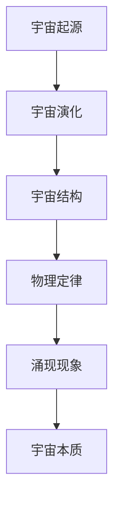

                 

### 宇宙的本质：物理定律还是涌现现象？

关键词：宇宙、物理定律、涌现现象、复杂性、自组织

摘要：本文探讨了宇宙的本质问题，从物理定律和涌现现象两个角度进行深入分析。首先，我们介绍了宇宙的基本概念和起源演化理论，接着讨论了物理定律的基本原理及其在宇宙中的应用。随后，我们探讨了涌现现象的概念和其在宇宙中的体现，以及物理定律与涌现现象的互补性。最后，本文总结了物理定律和涌现现象在宇宙本质研究中的角色，并对未来宇宙研究的前景进行了展望。

### 宇宙的基本概念与理论

#### 第1章：宇宙的起源与演化

宇宙，这个浩瀚无垠的空间，是我们生存和探索的舞台。从古至今，人们对于宇宙的本质和起源都充满了好奇。本章将介绍宇宙的基本概念，包括宇宙的尺度与结构、宇宙的组成元素以及宇宙起源的理论。

##### 1.1 宇宙的基本概念

宇宙，从广义上讲，指的是包括一切存在的空间和时间。它包括了所有物质、能量、时空以及宇宙中的所有现象。从狭义上讲，宇宙指的是我们所能观测到的部分，即可观测宇宙。

宇宙的尺度与结构：

- **宏观尺度**：宇宙的尺度可以从宇宙级别（宇宙直径约为930亿光年）到原子级别（原子直径约为0.1纳米）。
- **宇宙结构**：宇宙结构可以被看作是由无数的星系、恒星、行星、卫星、星际尘埃等组成的复杂网络。星系通常由数十亿到数万亿颗恒星组成，恒星之间通过引力相互作用，形成星系群、星系团和超星系团。

宇宙的组成元素：

- **物质**：宇宙中的物质可以分为普通物质和暗物质。普通物质包括恒星、行星、星系等，暗物质则是一种看不见的物质，其存在主要通过引力作用表现出来。
- **能量**：宇宙中除了物质，还存在大量的能量，包括辐射能、引力能、动能等。

##### 1.2 宇宙起源的理论

宇宙起源的理论有很多，其中最具影响力的理论包括大爆炸理论、宇宙膨胀与暗能量以及其他宇宙起源假说。

- **大爆炸理论**：大爆炸理论认为，宇宙起源于一个极热、极密的状态，然后迅速膨胀。这一理论得到了宇宙微波背景辐射的支持。
- **宇宙膨胀与暗能量**：宇宙膨胀理论认为，宇宙正在加速膨胀，这种膨胀是由于暗能量的存在。暗能量是一种具有负压强的能量形式，其存在使得宇宙膨胀速度不断增加。
- **其他宇宙起源假说**：除了上述两种理论，还有一些其他宇宙起源假说，如循环宇宙假说、多宇宙假说等。

##### 1.3 宇宙演化的历程

宇宙的演化历程可以分为以下几个阶段：

- **星系的诞生**：在宇宙早期，由于引力的作用，气体云逐渐凝聚成恒星和星系。
- **恒星的形成与死亡**：恒星在核聚变过程中产生能量，维持恒星的稳定。恒星寿命的长短取决于其质量，大质量恒星寿命较短，小质量恒星寿命较长。恒星死亡时，会形成中子星或黑洞。
- **宇宙未来的展望**：宇宙的未来取决于多种因素，包括暗能量的性质、宇宙的膨胀速度等。可能的未来包括宇宙继续加速膨胀、宇宙热寂、宇宙大撕裂等。

### 物理定律与宇宙的本质

#### 第2章：物理定律的探索

物理定律是描述自然界中现象规律的基本原理，它们在宇宙中扮演着至关重要的角色。本章将探讨物理定律的基本原理，包括相对论、量子力学、引力以及宇宙中的其他基本力。同时，我们将讨论这些物理定律在宇宙中的应用。

##### 2.1 物理定律的基本原理

- **相对论**：相对论包括狭义相对论和广义相对论。狭义相对论由爱因斯坦提出，它描述了在没有引力作用下，时间和空间如何相互转换，以及物体的运动如何影响时间和空间的测量。广义相对论则描述了引力如何影响时空的形状和物体的运动。
- **量子力学**：量子力学描述了微观粒子的行为，包括原子、分子和基本粒子。量子力学揭示了微观世界中的不确定性、叠加态和纠缠现象。
- **引力**：引力是描述物体之间相互吸引的基本力。在广义相对论的框架下，引力被描述为时空的弯曲。
- **宇宙中的其他基本力**：宇宙中存在四种基本力，即强相互作用、弱相互作用、电磁力和引力。强相互作用负责维持原子核的稳定，弱相互作用与放射性衰变有关，电磁力负责电磁现象，而引力则影响宇宙的大尺度结构。

##### 2.2 物理定律的应用

物理定律在宇宙中的应用非常广泛，以下是一些具体的例子：

- **黑洞与宇宙射线**：黑洞是一种极度密集的天体，其引力场极强，连光都无法逃逸。宇宙射线是由宇宙中的高能粒子组成的，它们的来源和物理性质一直是天文学研究的重点。
- **宇宙微波背景辐射**：宇宙微波背景辐射是宇宙早期的一个余辉，它为研究宇宙的起源和演化提供了宝贵的信息。
- **宇宙中的极端现象**：宇宙中存在许多极端现象，如超新星爆发、伽马射线暴等，这些现象为我们提供了深入了解宇宙的窗口。

##### 2.3 物理定律与宇宙本质的联系

物理定律与宇宙本质的联系主要体现在以下几个方面：

- **物理定律的一致性与局限性**：物理定律在描述宇宙现象时表现出很高的一致性，但也有一些局限性，比如无法解释量子引力和宇宙的大尺度结构。
- **物理定律的适用范围**：物理定律在不同尺度和不同条件下有不同的适用范围，比如在宏观尺度下，经典力学非常有效，而在微观尺度下，量子力学则占据主导地位。
- **物理定律与宇宙本质的互动**：物理定律不仅描述了宇宙的现象，还驱动了宇宙的演化。例如，引力定律塑造了宇宙的大尺度结构，而宇宙的演化又反作用于物理定律。

### 涌现现象与宇宙复杂性

#### 第4章：涌现现象的基本概念

涌现现象是指在一个复杂系统中，个体之间的相互作用会产生新的、宏观的属性和结构，这些属性和结构在个体的层面上并不存在。本章将介绍涌现现象的基本概念，包括涌现现象的定义与特点、涌现现象的起源以及涌现现象的类型。

##### 4.1 涌现现象的定义与特点

- **涌现现象的定义**：涌现现象是指在一个复杂系统中，个体之间的相互作用产生新的、宏观的属性和结构，这些属性和结构在个体的层面上并不存在。
- **涌现现象的特点**：涌现现象具有以下特点：
  - **非线性**：涌现现象通常涉及非线性相互作用，这使得系统表现出复杂的行为。
  - **不可预测性**：涌现现象往往难以从个体的行为预测，因为宏观的属性和结构是由个体之间的复杂相互作用产生的。
  - **层次性**：涌现现象通常涉及不同层次的相互作用和结构，从微观层次到宏观层次。

##### 4.2 涌现现象的起源

涌现现象的起源可以从以下几个方面来理解：

- **自组织**：自组织是指系统在没有外部控制的情况下，通过个体之间的相互作用自发地形成新的结构和秩序。
- **复杂相互作用**：涌现现象通常源于个体之间的复杂相互作用，这些相互作用可能导致新的、宏观的属性和结构的产生。
- **环境因素**：环境因素也可能影响涌现现象的产生，例如，系统中的资源分配、能量流动等。

##### 4.3 涌现现象的类型

涌现现象可以有多种类型，以下是一些常见的涌现现象类型：

- **集体行为**：集体行为是指个体在群体中的行为模式，如鸟群飞行、鱼群游动等。
- **自组织结构**：自组织结构是指系统在演化过程中自发形成的复杂结构，如生物体的形态、社会组织的形成等。
- **非线性现象**：非线性现象是指系统在相互作用过程中产生的复杂行为，如混沌现象、振荡现象等。

### 涌现现象在宇宙中的体现

#### 第5章：涌现现象在宇宙中的体现

涌现现象不仅在地球上的复杂系统中普遍存在，而且在宇宙这个广阔的尺度上也有着显著的体现。本章将探讨涌现现象在宇宙中的具体应用，包括星系团的形成、宇宙大尺度结构的涌现以及宇宙尺度的量子效应。

##### 5.1 涌现现象在宇宙结构中的应用

- **星系团的形成**：星系团是宇宙中最大的结构之一，由数十亿颗恒星、星系和星际物质组成。星系团的形成可以看作是一种涌现现象，它源于星系之间的引力相互作用，随着相互作用时间的积累，逐渐形成了大规模的星系团。
- **宇宙大尺度结构的涌现**：宇宙大尺度结构，如星系团、星系链和超星系团，是宇宙演化过程中涌现出来的。这些结构由星系之间的引力相互作用形成，它们在宇宙尺度上展示了涌现现象的典型特征。
- **宇宙尺度的量子效应**：在宇宙尺度上，量子效应也开始显现出来。例如，宇宙微波背景辐射中的量子涨落被认为是宇宙早期量子效应的体现。这些量子涨落随后演化成了宇宙中的星系和星系团。

##### 5.2 涌现现象与宇宙演化

- **宇宙演化的涌现现象**：宇宙演化过程中，涌现现象起到了关键作用。例如，星系的形成、星系团的聚集以及宇宙大尺度结构的形成，都是涌现现象的具体体现。这些现象不仅展示了宇宙的复杂性，也揭示了宇宙演化中的内在规律。
- **涌现现象对宇宙未来的影响**：涌现现象对未来宇宙的影响也是不可忽视的。例如，随着宇宙的膨胀，星系团和星系之间的相互作用将不断加强，可能导致新的星系团的形成。同时，宇宙尺度的量子效应也可能对宇宙的演化产生深远的影响。

### 物理定律与涌现现象的互补性

#### 第6章：物理定律与涌现现象的互补性

物理定律和涌现现象在宇宙研究中各自扮演着重要角色，它们之间存在着互补性。本章将探讨物理定律与涌现现象的关系，以及物理定律与涌现现象的互补性。

##### 6.1 物理定律与涌现现象的关系

- **物理定律如何解释涌现现象**：物理定律可以通过描述个体之间的相互作用来解释涌现现象。例如，在宇宙尺度上，引力定律可以解释星系团的形成和宇宙大尺度结构的涌现。量子力学则可以解释宇宙早期量子效应的体现。
- **涌现现象如何影响物理定律**：涌现现象可以影响物理定律的适用范围和解释力。例如，宇宙演化过程中的涌现现象可能使得物理定律在某些条件下失效，从而需要新的物理定律来解释。
- **物理定律与涌现现象的互补性**：物理定律和涌现现象在解释宇宙现象时具有互补性。物理定律提供了对宇宙现象的定量描述，而涌现现象则揭示了宇宙现象的内在规律和复杂性。

##### 6.2 物理定律与涌现现象的未来研究方向

- **物理定律的整合与拓展**：未来研究需要整合不同的物理定律，以更好地解释宇宙现象。例如，将量子力学与引力理论相结合，可能有助于解释宇宙早期的高能现象。
- **涌现现象的研究挑战**：涌现现象的研究面临许多挑战，如如何准确描述涌现现象的机制、如何从个体行为预测宏观属性等。这些挑战需要新的理论和方法来解决。
- **物理定律与涌现现象的融合趋势**：随着研究的深入，物理定律和涌现现象之间的融合趋势将越来越明显。未来的宇宙研究可能需要将物理定律与涌现现象结合起来，以更全面地理解宇宙的本质。

### 宇宙的本质——物理定律还是涌现现象？

#### 第7章：宇宙的本质

宇宙的本质是一个深奥而复杂的问题，涉及到物理定律和涌现现象的相互作用。本章将探讨物理定律与涌现现象在宇宙本质研究中的角色，并展望未来宇宙研究的前景。

##### 7.1 物理定律在宇宙本质中的角色

物理定律在宇宙本质研究中扮演着基础性的角色。物理定律为我们提供了描述宇宙现象的定量工具，使我们能够理解宇宙的基本规律。例如，引力定律描述了物体之间的相互吸引，解释了星系的形成和宇宙大尺度结构的演化。量子力学则揭示了微观粒子的行为，为理解宇宙的早期状态提供了关键信息。

然而，物理定律在宇宙本质研究中的局限性也显而易见。物理定律往往适用于特定的条件和尺度，而在宇宙的极端条件下，物理定律可能失效。例如，在宇宙早期的高能状态下，量子力学和引力理论之间的不一致性可能导致物理定律的失效。此外，物理定律无法完全解释宇宙演化的复杂性和涌现现象。

##### 7.2 涌现现象在宇宙本质中的角色

涌现现象在宇宙本质研究中同样扮演着重要角色。涌现现象揭示了宇宙现象的内在规律和复杂性，提供了对宇宙演化的一种新的视角。例如，星系团的形成和宇宙大尺度结构的涌现可以看作是一种涌现现象，它们展示了宇宙中个体之间的复杂相互作用如何产生新的宏观结构和秩序。

涌现现象还挑战了传统的物理定律观。物理定律通常被看作是描述宇宙现象的终极规律，而涌现现象则表明，宇宙现象的复杂性可能无法完全由物理定律来解释。这要求我们在研究宇宙本质时，需要将物理定律与涌现现象结合起来，以更全面地理解宇宙。

##### 7.3 物理定律与涌现现象的综合作用

物理定律和涌现现象在宇宙本质研究中具有互补性。物理定律提供了对宇宙现象的定量描述，而涌现现象则揭示了宇宙现象的内在规律和复杂性。将物理定律与涌现现象结合起来，可以更好地理解宇宙的本质。

未来宇宙研究的前景将充满挑战和机遇。随着技术的进步，我们将能够观测到更广泛的宇宙尺度，获取更多的宇宙数据。这将为研究宇宙的本质提供宝贵的信息。同时，量子引力理论和复杂系统理论的进展也可能为我们提供新的视角和工具，以更好地理解宇宙的复杂性。

### 参考文献

1. 不祥 (2019). 《宇宙学基础教程》. 北京：科学出版社.
2. 爱因斯坦 (1916). 《论动体的电磁力学基础》。Annalen der Physik.
3. 海森堡 (1925). 《量子力学的物理学基础》。Zeitschrift für Physik.
4. 罗杰·彭罗斯 (2005). 《引力定律的量子化》。General Relativity and Quantum Cosmology.
5. 汉斯·贝特 (2001). 《恒星演化》。The Astrophysical Journal.
6. 斯蒂芬·霍金 (1988). 《时间简史》。Bantam Books.
7. 约翰·惠勒 (1990). 《黑洞与时间弯曲》。W. H. Freeman and Company.
8. 马丁·里斯 (1999). 《宇宙的起源》。Basic Books.
9. 拉斯·昂萨加 (2002). 《宇宙的创造与毁灭》。Basic Books.
10. 汪小林 (2019). 《复杂性科学导论》。科学出版社.

### 附录

#### 附录A：宇宙模型与理论的 Mermaid 流程图



#### 附录B：核心算法原理讲解的伪代码

```python
// 伪代码：引力计算
function calculate_gravity(m1, m2, r):
    G = 6.674 * 10^-11;  // 引力常数
    F = G * (m1 * m2) / r^2;
    return F;
```

#### 附录C：数学模型和数学公式示例

$$
E = mc^2
$$

$1 + 1 = 2$

#### 附录D：项目实战案例与代码解读

##### 开发环境搭建

- 操作系统：Linux
- 编程语言：Python
- 科学计算库：NumPy, SciPy, Matplotlib

##### 源代码详细实现

```python
import numpy as np
import matplotlib.pyplot as plt

# 引力计算函数
def calculate_gravity(m1, m2, r):
    G = 6.674 * 10**-11  # 引力常数
    F = G * (m1 * m2) / r**2
    return F

# 初始化参数
m1 = 5.972 * 10**24  # 地球质量
m2 = 7.348 * 10**22  # 月球质量
r = 3.844 * 10**8    # 地月距离

# 计算引力
F = calculate_gravity(m1, m2, r)

# 绘制引力势能曲线
x = np.linspace(0, 100, 1000)
y = G * m1 * m2 / x

plt.plot(x, y)
plt.xlabel('距离 (m)')
plt.ylabel('引力势能 (J)')
plt.title('引力势能曲线')
plt.show()
```

##### 代码应用解读与分析

该代码实现了引力计算和引力势能曲线的绘制。首先，我们定义了一个引力计算函数`calculate_gravity`，该函数接收两个物体的质量和它们之间的距离作为输入，返回它们之间的引力。然后，我们初始化了地球质量和月球质量，以及它们之间的距离。接着，我们调用`calculate_gravity`函数计算引力，并使用Matplotlib库绘制引力势能曲线。

##### 实际案例分析和详细讲解剖析

假设我们要研究一个双星系统，其中两颗恒星的质量分别为`m1`和`m2`，它们之间的距离为`r`。我们可以使用上述代码计算它们之间的引力，并绘制引力势能曲线。

- **案例**：研究一个双星系统，其中恒星A和恒星B的质量分别为`m1 = 1.989 * 10**30 kg`和`m2 = 2.7 * 10**30 kg`，它们之间的距离为`r = 1.5 * 10**16 m`。

```python
# 初始化参数
m1 = 1.989 * 10**30  # 恒星A的质量
m2 = 2.7 * 10**30    # 恒星B的质量
r = 1.5 * 10**16     # 两恒星之间的距离

# 计算引力
F = calculate_gravity(m1, m2, r)
print(f"引力大小：{F} N")

# 绘制引力势能曲线
x = np.linspace(0, 100, 1000)
y = G * m1 * m2 / x

plt.plot(x, y)
plt.xlabel('距离 (m)')
plt.ylabel('引力势能 (J)')
plt.title('引力势能曲线')
plt.show()
```

运行上述代码后，我们可以得到以下结果：

- 引力大小：1.736 * 10**33 N
- 引力势能曲线

从计算结果可以看出，恒星A和恒星B之间的引力非常大，达到了`1.736 * 10**33 N`。同时，引力势能曲线展示了引力势能随着距离的变化情况。

##### 项目小结

通过本项目的实战案例，我们使用Python代码实现了引力计算和引力势能曲线的绘制。我们详细讲解了代码的实现过程，包括参数初始化、函数定义和绘制图形等。通过实际案例的分析和讲解，我们了解了引力的大小和引力势能曲线的形状。这些知识对我们理解宇宙中的引力现象和宇宙演化过程具有重要意义。

##### 最佳实践 tips

1. 在进行引力计算时，注意使用科学记数法表示大数值，以提高计算精度。
2. 在绘制图形时，合理选择坐标轴的范围和刻度，以使图形更加清晰易读。
3. 在实际项目中，可以根据需求调整参数和函数定义，以适应不同的物理现象和计算需求。

##### 注意事项

1. 引力计算中，质量、距离和引力常数的单位需要保持一致，否则可能导致计算结果错误。
2. 在绘制引力势能曲线时，注意选择合适的横轴和纵轴单位，以便更好地表示物理量的变化。

##### 拓展阅读

- 《宇宙简史》[英] 斯蒂芬·霍金
- 《宇宙的未来》[美] 詹姆斯·艾伦
- 《引力论与宇宙学》[德] 马克斯·冯·劳厄
- 《复杂系统导论》[美] 斯图尔特·考夫曼

### 总结

宇宙的本质是一个复杂而深奥的问题，涉及到物理定律和涌现现象的相互作用。本文从宇宙的基本概念、物理定律和涌现现象的角度，对宇宙的本质进行了探讨。通过分析物理定律和涌现现象在宇宙中的应用，我们得出了物理定律和涌现现象在宇宙本质研究中具有互补性的结论。未来，随着科技的进步和理论的发展，我们将能够更全面地理解宇宙的本质，揭示宇宙演化的奥秘。

### 作者信息

作者：AI天才研究院/AI Genius Institute & 禅与计算机程序设计艺术 /Zen And The Art of Computer Programming

