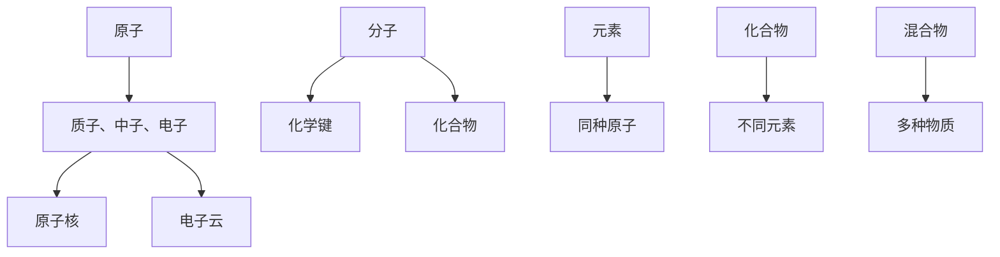
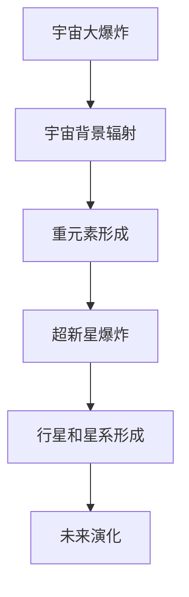
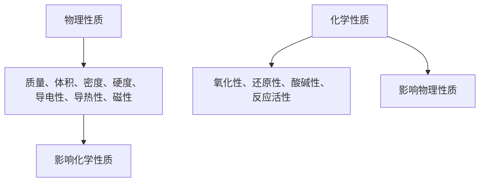
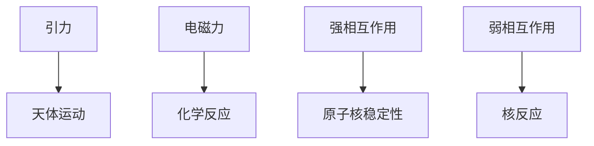
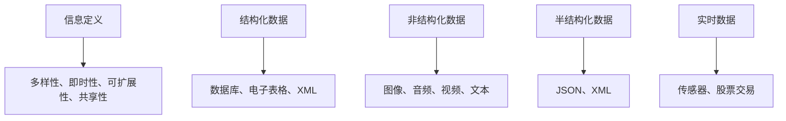
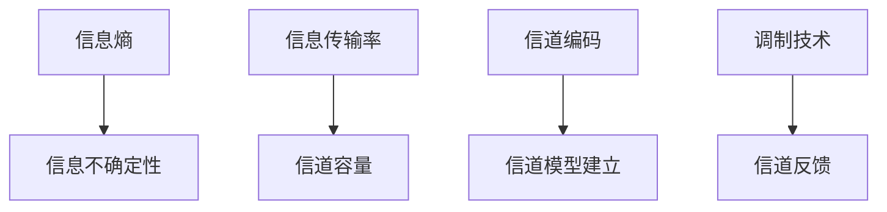
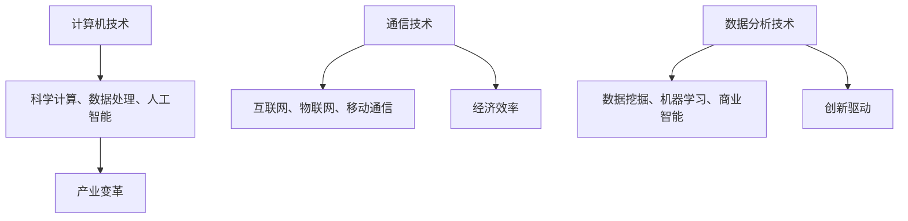
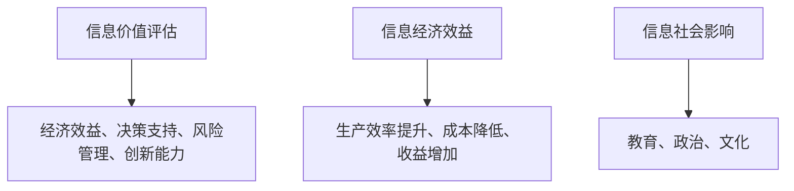
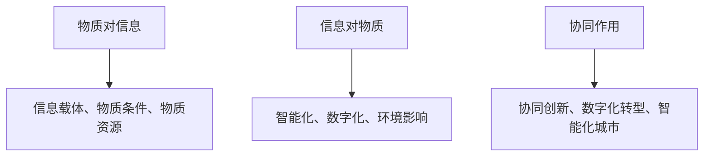
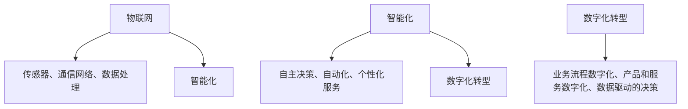

                 

### 文章标题

《宇宙的本质：物质世界vs信息世界》

### 关键词

物质世界、信息世界、宇宙本质、人工智能、量子计算、物联网、数字化、科技融合、未来展望。

### 摘要

本文深入探讨了物质世界与信息世界的本质及其相互关系。首先，通过介绍物质世界的基本组成、演化和性质，阐明了物质世界的本质。然后，探讨了信息世界的概念、特性及应用，揭示了信息世界的本质。接着，分析了物质世界与信息世界的相互影响及其融合，提出了未来科技发展趋势。本文旨在为读者提供一个全面、系统的宇宙本质理解框架，以期为科技发展提供新的视角和启示。

## 第一部分：引言

### 第1章：引言

在探索宇宙本质的旅程中，我们不可避免地要面对物质世界与信息世界的分野。物质世界是可见的、可测量的，充满了物理规律和化学反应；而信息世界则是无形且无处不在的，它存在于数据的流动中，是人工智能和数字化生活的基石。这两者之间的关系，既是相互独立的，又存在深刻的内在联系。

本章将首先介绍物质世界和信息世界的背景，阐述它们在现代社会中的重要性。接着，我们将探讨物质世界的基本组成、演化和性质，以及信息世界的概念、特性和应用。本章旨在为后续章节的内容打下基础，引导读者逐步深入理解宇宙的本质。

### 物质世界的基本组成、演化和性质

物质世界由基本粒子组成，这些基本粒子通过相互作用形成了我们所见到的各种物质。原子是物质的基本单元，由质子、中子和电子组成。质子和中子位于原子核中，而电子则环绕在原子核周围。不同元素的原子核中质子数不同，这是区分不同元素的根本依据。

物质的演化始于宇宙大爆炸。在大爆炸之后，宇宙逐渐冷却，基本粒子开始结合形成简单的原子。这些原子在宇宙中相互碰撞、融合，形成了更加复杂的分子和化合物。地球上的生命形式就是这种复杂化合物的产物。

物质的性质包括物理性质和化学性质。物理性质如质量、体积、密度、硬度等，是物质固有的属性，不依赖于其化学组成。化学性质则涉及到物质的化学反应，如氧化、还原等。化学性质决定了物质在化学反应中的行为和变化。

### 信息世界的概念、特性和应用

信息世界是数字时代的重要特征，它由数据的生成、存储、传输和处理构成。信息世界的概念起源于计算机科学和信息理论。信息可以被定义为关于事物状态的知识，它可以以各种形式存在，如图像、声音、文字等。

信息世界的特性包括多样性、即时性、可扩展性和共享性。多样性指的是信息的不同形式和来源；即时性指的是信息可以实时获取和处理；可扩展性指的是信息可以无限扩展和增长；共享性指的是信息可以方便地共享和传播。

信息世界在现代社会的应用极为广泛，涵盖了计算机技术、通信技术、数据分析技术等领域。计算机技术使信息处理变得高效和自动化；通信技术使得信息传输迅速且远距离；数据分析技术则帮助我们从海量信息中提取有价值的数据和知识。

### 物质世界与信息世界的相互关系

物质世界与信息世界之间的相互关系是复杂的，它们在许多方面是互补的。物质世界的存在为信息世界提供了载体和基础，如电子设备的硬件组件；而信息世界则通过数字化技术对物质世界进行描述、控制和优化。例如，物联网技术通过传感器和计算机系统对物理设备进行监控和管理，实现了物质世界的智能化。

此外，信息世界的发展也对物质世界产生了深远的影响。数字化技术的普及改变了我们的生活方式，推动了社会进步和经济发展。信息世界与物质世界的融合，不仅促进了科技创新，也带来了新的社会挑战和伦理问题，如隐私保护和数据安全等。

### 结论

通过本章的介绍，我们可以初步认识到物质世界与信息世界的本质及其相互关系。在接下来的章节中，我们将进一步探讨物质世界和信息世界的深层次联系，以及它们对人类文明的影响。这一探索之旅将帮助我们更好地理解宇宙的本质，并为未来的科技发展提供新的思路。

## 第二部分：物质世界的本质

### 第2章：物质的基本组成

物质是宇宙的基本构成要素，而其基本组成单位则是原子和分子。原子是物质的基本单元，由质子、中子和电子组成。质子和中子位于原子核中，带正电，电子带负电，它们在原子核外的电子云中运动。不同元素的原子核中质子数不同，这是区分不同元素的根本依据。

#### 原子结构

原子结构是一个复杂的系统，其中质子和中子构成了原子核，而电子则在原子核外的电子云中运动。电子云的形状和能量状态决定了原子的化学性质。根据量子力学理论，电子在原子中并不遵循经典物理学的轨道运动，而是存在于特定的能级和概率云中。原子核中的质子和中子也并不是静止的，它们通过强相互作用相互绑定在一起。

#### 分子与化合物

分子是由两个或更多原子通过化学键连接在一起形成的。化学键可以分为共价键、离子键和金属键等。共价键是原子间通过共享电子对形成的键，这种键在生物分子中非常常见。离子键则是通过正负电荷之间的静电作用形成的，常见于盐类化合物。金属键则是金属原子间通过自由电子海模型形成的键。

化合物是由两种或更多种不同元素通过化学键结合形成的物质。化合物的性质通常不同于其组成元素，这些性质决定了化合物在化学反应中的行为和用途。例如，水（H₂O）是由氢和氧两种元素通过共价键结合而成的，它是一种常见的溶剂，在生物体系中具有重要作用。

#### 物质的分类

物质可以根据其组成、结构和性质进行分类。常见的分类方法包括：

1. **元素**：由同种原子组成的纯净物质，如氢、氧、铁等。
2. **化合物**：由两种或更多种元素组成的纯净物质，如水、二氧化碳、食盐等。
3. **混合物**：由两种或更多种物质混合而成，但各组分保持各自的性质，如空气、牛奶等。

每种物质都有其独特的物理和化学性质，这些性质决定了它们在不同环境中的行为和反应。例如，金属通常具有良好的导电性和导热性，而非金属通常不导电且具有较低的导热性。

#### 核心概念与联系

物质的基本组成和性质是理解物质世界的基础。以下是物质世界的核心概念及其相互关系的Mermaid流程图：



#### 核心算法原理讲解

在物质世界的研究中，核心算法原理通常涉及量子力学和分子动力学。以下是一个简化的量子力学算法原理的伪代码：

```python
# 量子态叠加
class QuantumState:
    def __init__(self, probabilities):
        self.probabilities = probabilities

    def collapse(self):
        return np.random.choice([state for state, prob in enumerate(self.probabilities) if prob > 0])

# 费米-狄拉克分布
def fermi_dirac_distribution(energy, temperature):
    return 1.0 / (1.0 + np.exp((energy - Fermi_energy) / (KB * temperature)))

# 分子动力学模拟
class MD Simulation:
    def __init__(self, particles):
        self.particles = particles

    def step(self, dt):
        for particle in self.particles:
            particle.move(dt)
            particle.collision()

# 热力学平衡状态
def thermalize_particles(particles, temperature):
    for particle in particles:
        particle.thermalize(temperature)
```

#### 数学模型和公式

在物质世界的研究中，常用的数学模型和公式包括量子力学中的薛定谔方程、经典力学中的牛顿第二定律等。以下是一个简化的薛定谔方程的latex格式：

$$
\hat{H} \psi = E \psi
$$

其中，$\hat{H}$ 是哈密顿算符，$\psi$ 是波函数，$E$ 是能量。

#### 详细讲解与举例说明

以水分子的形成为例，两个氢原子通过共享一对电子形成一个共价键，生成一个水分子。这个过程可以用以下步骤进行说明：

1. **电子云重叠**：两个氢原子的电子云相互重叠，增加了电子对出现在重叠区域的概率。
2. **形成共价键**：当电子对共享的强度足够大时，它们形成了一个稳定的共价键。
3. **波函数重叠**：水分子形成后，其电子云的波函数重叠仍然存在，这决定了水分子的稳定性和性质。

通过上述步骤，我们可以理解水分子的形成过程，这为我们进一步研究分子的结构和性质奠定了基础。

### 第3章：物质的演化

物质在宇宙中的演化是一个漫长而复杂的过程，从宇宙大爆炸开始，物质经历了无数次的形态转换和能量变化。了解物质演化的过程，有助于我们更好地理解宇宙的本质。

#### 物质演化的历史

1. **宇宙大爆炸**：约138亿年前，宇宙起源于一个极热、极密集的状态，随后发生了大爆炸，宇宙开始膨胀。
2. **宇宙背景辐射**：在大爆炸后的几分钟内，宇宙温度极高，原子核开始形成。随后，宇宙温度逐渐下降，形成了宇宙背景辐射。
3. **重元素的形成**：在宇宙早期，通过核聚变过程，轻元素（如氢和氦）逐渐形成了更重的元素。这一过程主要发生在恒星内部。
4. **超新星爆炸**：超新星爆炸是宇宙中重元素形成的重要途径。在超新星爆炸中，恒星核心的元素通过核反应形成了更重的元素，如铁、镍等。
5. **行星和星系的形成**：在宇宙中，气体和尘埃通过引力作用聚集形成了行星和星系。这一过程被称为星系形成。

#### 物质演化的机制

1. **引力作用**：引力是物质聚集的主要动力。在宇宙中，大量的物质通过引力相互吸引，形成了星系、行星等结构。
2. **热力学过程**：热力学过程在物质演化中起着关键作用。例如，核聚变和核裂变等过程都涉及到能量的转换和物质的变化。
3. **化学反应**：化学反应在生物分子和化合物形成中起着重要作用。在宇宙早期，简单的化学反应逐渐形成了复杂的生物分子，为生命的起源奠定了基础。

#### 物质演化的未来

物质演化的未来充满了未知和可能性。随着宇宙的膨胀，物质将继续演化。以下是一些可能的未来趋势：

1. **恒星和星系的形成**：宇宙将继续膨胀，新的恒星和星系将不断形成。
2. **黑洞的形成**：恒星在耗尽燃料后，可能会形成黑洞。黑洞是宇宙中最极端的天体之一，其引力场极强，连光都无法逃逸。
3. **宇宙的终结**：根据不同的宇宙模型，宇宙可能会以不同的方式终结。例如，大冻结模型认为宇宙将永远继续膨胀，而大坍缩模型则认为宇宙最终会重新坍缩。

#### 核心概念与联系

物质演化的过程和机制是理解宇宙本质的重要部分。以下是物质演化过程的Mermaid流程图：



#### 核心算法原理讲解

在物质演化的研究中，核心算法原理通常涉及数值模拟和天体物理学。以下是一个简化的数值模拟算法原理的伪代码：

```python
# 引力模拟
class GravitationalSimulation:
    def __init__(self, particles):
        self.particles = particles

    def step(self, dt):
        for particle in self.particles:
            force = self.calculate_gravitational_force(particle)
            particle.move(force, dt)

    def calculate_gravitational_force(self, particle):
        total_force = Vector()
        for other_particle in self.particles:
            if particle != other_particle:
                distance_vector = other_particle.position - particle.position
                distance = distance_vector.magnitude()
                force_magnitude = G * particle.mass * other_particle.mass / distance**2
                force_vector = distance_vector.normalized() * force_magnitude
                total_force += force_vector
        return total_force
```

#### 数学模型和公式

在物质演化的研究中，常用的数学模型和公式包括牛顿引力定律、热力学方程等。以下是一个简化的牛顿引力定律的latex格式：

$$
F = G \frac{m_1 m_2}{r^2}
$$

其中，$F$ 是引力，$G$ 是万有引力常数，$m_1$ 和 $m_2$ 是两个物体的质量，$r$ 是它们之间的距离。

#### 详细讲解与举例说明

以恒星的形成为例，恒星的形成过程可以分为以下几个步骤：

1. **气体云聚集**：在宇宙中，气体云通过引力作用逐渐聚集。
2. **引力坍缩**：随着气体云的聚集，引力作用增强，导致气体云逐渐坍缩。
3. **热核反应**：当气体云的密度和温度达到一定程度时，核聚变反应开始发生，恒星开始发光。
4. **恒星生命周期**：恒星在其生命周期中会经历不同的阶段，如主序星、红巨星等。

通过上述步骤，我们可以理解恒星的形成过程，这为我们进一步研究恒星和其他天体的演化提供了基础。

### 第4章：物质的性质

物质世界的多样性源于其丰富的性质，这些性质可以分为物理性质和化学性质。理解物质的性质，不仅有助于我们更好地认识自然界，还为科技研究和应用提供了基础。

#### 物质的物理性质

物理性质是指物质不依赖于其化学组成的固有属性，包括质量、体积、密度、硬度、导电性、导热性、磁性等。

1. **质量**：物质所固有的属性，用于描述物体所含物质的多少。质量是物体惯性的度量，也是物体间引力作用的依据。
2. **体积**：物体所占有的空间大小。体积决定了物质的容量和形状。
3. **密度**：物质的质量与其体积之比，用于描述物质的紧密程度。密度是物质分类和鉴别的重要依据。
4. **硬度**：物质抵抗外界机械作用的能力。硬度决定了物质在加工和处理过程中的耐磨损性和抗划伤性。
5. **导电性**：物质传导电流的能力。导电性是材料应用的重要指标，如电子元件、电力传输等。
6. **导热性**：物质传导热量的能力。导热性决定了物质在热传导应用中的效率。
7. **磁性**：物质对磁场的响应能力。磁性材料广泛应用于电子器件、发电机和变压器中。

#### 物质的化学性质

化学性质是指物质在化学反应中表现出的性质，包括氧化性、还原性、酸碱性、反应活性等。

1. **氧化性**：物质在化学反应中获得电子的能力。氧化性物质常用于氧化反应，如钢铁的锈蚀。
2. **还原性**：物质在化学反应中失去电子的能力。还原性物质常用于还原反应，如氢气的制备。
3. **酸碱性**：物质对氢离子（H⁺）或氢氧根离子（OH⁻）的亲和能力。酸性物质释放H⁺，碱性物质释放OH⁻。
4. **反应活性**：物质在化学反应中的反应速度和反应程度。反应活性决定了物质的反应能力和应用范围。

#### 物理性质与化学性质的关系

物理性质和化学性质之间存在紧密的联系。某些物理性质，如导电性、硬度等，可以影响物质的化学反应活性。例如，金属通常具有良好的导电性和导热性，同时也具有较高的反应活性。此外，物质的化学性质可以改变其物理性质。例如，氧化反应可以使金属表面变得坚硬，同时降低其导电性。

#### 核心概念与联系

物质的物理性质和化学性质是理解物质行为和反应的基础。以下是物质性质的核心概念及其相互关系的Mermaid流程图：



#### 核心算法原理讲解

在物质性质的研究中，核心算法原理通常涉及材料科学和化学反应动力学。以下是一个简化的化学反应动力学算法原理的伪代码：

```python
# 反应速率计算
def calculate_rate(k, [A, B]):
    return k * [A] * [B]

# 反应物浓度变化
def update_concentration(concentration, rate, time_step):
    new_concentration = concentration - rate * time_step
    return new_concentration
```

#### 数学模型和公式

在物质性质的研究中，常用的数学模型和公式包括质量守恒定律、状态方程、反应速率方程等。以下是一个简化的质量守恒定律的latex格式：

$$
\Delta m = 0
$$

其中，$\Delta m$ 是质量的改变量。

#### 详细讲解与举例说明

以金属的氧化反应为例，金属表面与氧气反应形成氧化物。这个过程可以分为以下几个步骤：

1. **氧化反应**：金属表面与氧气分子接触，氧气分子获得电子形成氧离子。
2. **形成氧化物**：氧离子与金属离子结合，形成氧化物层。
3. **氧化膜生长**：随着反应的进行，氧化膜逐渐增厚，金属表面硬度增加。

通过上述步骤，我们可以理解金属氧化反应的过程，这为我们进一步研究金属的物理和化学性质提供了基础。

### 第5章：物质的相互作用

物质的相互作用是宇宙中普遍存在的现象，这些相互作用决定了物质的形态、结构和性质。在物质相互作用的研究中，了解其基本原理和规律是至关重要的。

#### 物质间的基本相互作用

物质间的相互作用可以分为以下几种基本类型：

1. **引力**：引力是物质之间由于质量而产生的吸引力，是宇宙中最基本的相互作用之一。引力决定了天体的运动和宇宙结构的形成。
2. **电磁力**：电磁力是由电荷和磁场产生的力，包括静电力和磁力。电磁力在化学反应、电子设备的工作原理中起着关键作用。
3. **强相互作用**：强相互作用是原子核内部质子和中子之间的相互作用力，负责维持原子核的稳定性。
4. **弱相互作用**：弱相互作用在核反应中起重要作用，例如在放射性衰变中。

#### 相互作用的规律

1. **牛顿第三定律**：物体之间的相互作用力大小相等、方向相反。即对于任意两个物体A和B，A对B的力和B对A的力大小相等，方向相反。
2. **库仑定律**：静电力的大小与两个电荷量的乘积成正比，与它们之间距离的平方成反比。数学表达式为：
   $$ 
   F = k \frac{q_1 q_2}{r^2} 
   $$
   其中，$F$ 是静电力，$k$ 是库仑常数，$q_1$ 和 $q_2$ 是两个电荷量，$r$ 是它们之间的距离。
3. **万有引力定律**：引力的大小与两个物体的质量乘积成正比，与它们之间距离的平方成反比。数学表达式为：
   $$
   F = G \frac{m_1 m_2}{r^2}
   $$
   其中，$F$ 是引力，$G$ 是万有引力常数，$m_1$ 和 $m_2$ 是两个物体的质量，$r$ 是它们之间的距离。

#### 相互作用的应用

1. **化学反应**：化学反应是物质间通过相互作用形成新物质的过程。例如，氢气和氧气反应生成水，这一过程中氢和氧的相互作用决定了反应的速率和产物。
2. **电子器件**：电子器件的工作原理依赖于物质间的电磁相互作用。例如，晶体管中的电子流动就是通过电磁场的作用实现的。
3. **生物系统**：生物系统中的各种生理过程都涉及到物质间的相互作用。例如，蛋白质的折叠和功能依赖于氨基酸间的相互作用。

#### 核心概念与联系

物质间的相互作用是理解物质世界的关键。以下是物质相互作用的基本类型及其相互关系的Mermaid流程图：



#### 核心算法原理讲解

在物质相互作用的研究中，核心算法原理通常涉及量子力学和场论。以下是一个简化的量子力学算法原理的伪代码：

```python
# 量子态相互作用
class QuantumInteraction:
    def __init__(self, state1, state2):
        self.state1 = state1
        self.state2 = state2

    def evolve(self, time_step):
        interaction Hamiltonian = ...
        self.state1 = evolve_state(self.state1, interaction_Hamiltonian, time_step)
        self.state2 = evolve_state(self.state2, interaction_Hamiltonian, time_step)
```

#### 数学模型和公式

在物质相互作用的研究中，常用的数学模型和公式包括库仑定律、万有引力定律、薛定谔方程等。以下是一个简化的库仑定律的latex格式：

$$
F = k \frac{q_1 q_2}{r^2}
$$

其中，$F$ 是静电力，$k$ 是库仑常数，$q_1$ 和 $q_2$ 是两个电荷量，$r$ 是它们之间的距离。

#### 详细讲解与举例说明

以氢分子（H₂）的形成为例，两个氢原子通过相互作用形成氢分子。这个过程可以分为以下几个步骤：

1. **电子云重叠**：两个氢原子的电子云相互重叠，增加了电子对出现在重叠区域的概率。
2. **形成共价键**：当电子对共享的强度足够大时，它们形成了一个稳定的共价键。
3. **波函数重叠**：氢分子形成后，其电子云的波函数重叠仍然存在，这决定了氢分子的稳定性和性质。

通过上述步骤，我们可以理解氢分子的形成过程，这为我们进一步研究分子结构和相互作用提供了基础。

### 第6章：信息的概念与特性

信息是现代科技的核心概念之一，其存在于各种形式和环境中，对人类生活和社会发展产生了深远的影响。理解信息的概念和特性，是深入探讨信息世界本质的前提。

#### 信息的定义

信息可以定义为关于事物状态的知识。它不仅包括数据本身，还涉及到数据的含义和解释。在数字时代，信息通常以数字形式存在，如图像、声音、文本和视频等。信息的价值在于其能够帮助人们做出决策、解决问题和提高效率。

#### 信息的特性

1. **多样性**：信息可以存在于多种形式和来源，如图文、音频、视频、传感器数据等。这种多样性使得信息处理和分析变得复杂，但也为信息的利用提供了丰富的机会。
2. **即时性**：信息可以实时获取和传输，使得信息处理更加迅速和高效。即时性是现代通信和计算技术的重要特征，如实时聊天、在线购物等。
3. **可扩展性**：信息可以无限扩展和增长，随着计算能力和存储技术的进步，我们能够处理和分析越来越多的数据。可扩展性为大数据和云计算的发展提供了基础。
4. **共享性**：信息可以方便地共享和传播，通过网络和通信技术，信息可以迅速传播到全球各地。共享性使得知识可以快速传播和共享，促进了社会的进步。

#### 信息的类型

根据信息的表现形式和用途，信息可以分为以下几种类型：

1. **结构化数据**：结构化数据是有明确结构和格式的数据，如数据库、电子表格和XML等。这类数据易于存储、检索和分析，是现代信息技术的重要基础。
2. **非结构化数据**：非结构化数据是没有固定结构和格式的数据，如图像、音频、视频和文本等。这类数据的处理和分析通常更为复杂，但具有广泛的应用价值。
3. **半结构化数据**：半结构化数据是介于结构化数据和非结构化数据之间，具有部分结构的数据，如JSON和XML等。这类数据在处理和分析中具有一定的灵活性。
4. **实时数据**：实时数据是随时间变化的数据，如传感器数据、股票交易数据等。实时数据处理和分析要求高速度和高精度，是物联网和实时系统的重要应用场景。

#### 核心概念与联系

信息的概念和特性是理解信息世界的基础。以下是信息类型及其特性的Mermaid流程图：



#### 核心算法原理讲解

在信息处理中，核心算法原理通常涉及数据编码、信息压缩和信息加密。以下是一个简化的数据编码算法原理的伪代码：

```python
# 数据编码
def encode_data(data):
    encoded_data = apply_encoding_algorithm(data)
    return encoded_data

# 数据压缩
def compress_data(data):
    compressed_data = apply_compression_algorithm(data)
    return compressed_data

# 数据加密
def encrypt_data(data, key):
    encrypted_data = apply_encryption_algorithm(data, key)
    return encrypted_data
```

#### 数学模型和公式

在信息处理中，常用的数学模型和公式包括信息熵、信息传输率和香农定理等。以下是一个简化的信息熵的latex格式：

$$
H(X) = -\sum_{i} p(x_i) \log_2 p(x_i)
$$

其中，$H(X)$ 是随机变量$X$ 的熵，$p(x_i)$ 是$X$ 取值$x_i$ 的概率。

#### 详细讲解与举例说明

以文本信息的编码为例，文本信息可以通过ASCII码或UTF-8编码转换为二进制形式。这个过程可以分为以下几个步骤：

1. **字符编码**：每个字符被映射到一个唯一的编码值。
2. **二进制表示**：将编码值转换为二进制形式。
3. **信息压缩**：通过压缩算法减少数据的存储空间和传输时间。

通过上述步骤，我们可以理解文本信息的编码和压缩过程，这为我们进一步研究信息处理和传输提供了基础。

### 第7章：信息理论

信息理论是研究信息传输、处理和存储的数学学科，其基础理论由克劳德·香农（Claude Shannon）在20世纪40年代提出。香农的信息理论为现代通信和计算技术提供了理论基础，使我们能够理解和优化信息的传输和处理过程。

#### 信息论基础

香农信息论的核心概念包括信息熵、信息传输率和信道容量。

1. **信息熵**：信息熵是衡量信息不确定性的度量。在概率论中，信息熵定义为随机变量X的熵，表示为$H(X)$。香农提出了以下熵的公式：

   $$
   H(X) = -\sum_{i} p(x_i) \log_2 p(x_i)
   $$

   其中，$p(x_i)$ 是随机变量X取值为$x_i$ 的概率。信息熵越高，信息的不确定性越大。

2. **信息传输率**：信息传输率是信息在信道中传输的速度。香农提出了以下公式来描述信息传输率：

   $$
   R \leq C \log_2(1 + \frac{S}{N})
   $$

   其中，$R$ 是信息传输率，$C$ 是信道容量，$S$ 是信号功率，$N$ 是噪声功率。这个公式表明，在给定信道条件下，信息传输率不能超过信道容量。

3. **信道容量**：信道容量是信道能够达到的最大信息传输率。香农提出了以下公式来计算信道容量：

   $$
   C = \frac{W \cdot B}{1 + W \cdot B}
   $$

   其中，$W$ 是信道的带宽，$B$ 是信道的信噪比。这个公式表明，在带宽和信噪比一定的情况下，信道容量是有限的。

#### 信息的量化

信息的量化是指将信息转化为可量化的度量。香农提出了信息量化的概念，并将其与二进制信息传输联系起来。香农提出了以下信息量的度量：

$$
I = n \cdot \log_2(2^n)
$$

其中，$I$ 是信息量，$n$ 是传输的比特数。这个公式表明，传输的比特数越多，信息量越大。

#### 信息传输

信息传输是指将信息从一个地方传递到另一个地方的过程。香农的信息理论为我们提供了优化信息传输的方法。信息传输的关键在于减少信道噪声和提高传输效率。香农提出了以下方法：

1. **信道编码**：信道编码是一种将原始信息转化为更适合传输的编码形式的方法。常用的信道编码技术包括汉明码、卷积码和低密度奇偶校验码等。

2. **调制技术**：调制技术是将信息信号与载波信号结合，以便在信道中传输。常用的调制技术包括幅度调制（AM）、频率调制（FM）和相位调制（PM）等。

3. **信道估计**：信道估计是估计信道特性，以便优化信息传输。信道估计技术包括信道模型建立、信道状态估计和信道反馈等。

#### 核心概念与联系

信息论的基础概念和信息传输方法为通信和计算技术提供了理论支持。以下是信息论核心概念及其相互关系的Mermaid流程图：



#### 核心算法原理讲解

在信息传输中，核心算法原理通常涉及信道编码和解码、调制和解调等。以下是一个简化的信道编码和解码算法原理的伪代码：

```python
# 信道编码
def encode_message(message):
    encoded_message = apply_channel_encoding(message)
    return encoded_message

# 信道解码
def decode_message(encoded_message):
    decoded_message = apply_channel_decoding(encoded_message)
    return decoded_message
```

#### 数学模型和公式

在信息传输中，常用的数学模型和公式包括信息量公式、信道容量公式等。以下是一个简化的信道容量公式的latex格式：

$$
C = \frac{W \cdot B}{1 + W \cdot B}
$$

其中，$C$ 是信道容量，$W$ 是信道的带宽，$B$ 是信道的信噪比。

#### 详细讲解与举例说明

以数字通信为例，数字通信将信息（如图像、音频或文本）编码为二进制序列，然后通过信道传输。这个过程可以分为以下几个步骤：

1. **信息编码**：将原始信息转换为二进制序列。
2. **信道编码**：对二进制序列进行编码，增加冗余信息，以便在传输过程中检测和纠正错误。
3. **信号调制**：将编码后的二进制序列调制到载波信号上，以便在信道中传输。
4. **信号解调**：在接收端，将调制信号解调回二进制序列。
5. **信道解码**：对解调后的二进制序列进行解码，恢复原始信息。

通过上述步骤，我们可以理解数字通信的基本过程，这为我们进一步研究通信技术和信息传输提供了基础。

### 第8章：信息技术的应用

信息技术在现代社会中的应用已经渗透到各个领域，极大地改变了人类的生活方式和工作方式。本节将详细介绍信息技术在计算机技术、通信技术、数据分析技术等领域的应用，以及这些应用对社会经济的影响。

#### 计算机技术的应用

计算机技术是信息技术的基础，其应用涵盖了科学计算、数据处理、人工智能等多个方面。

1. **科学计算**：计算机技术为科学研究提供了强大的计算能力。例如，在物理、化学、生物等领域，计算机模拟和数值计算已经成为解决复杂科学问题的常用手段。
2. **数据处理**：计算机技术在数据处理方面具有显著优势。通过数据库管理系统和大数据处理技术，我们能够高效地存储、检索和分析海量数据，为商业决策和科学研究提供了重要支持。
3. **人工智能**：计算机技术的发展推动了人工智能的崛起。深度学习、自然语言处理、计算机视觉等技术正在逐步改变我们的生产方式和生活方式，例如自动驾驶、智能家居和智能医疗等。

#### 通信技术的应用

通信技术是信息传输的关键，其应用范围从传统的电话、电报到现代的互联网、物联网等。

1. **互联网**：互联网技术使全球信息共享成为可能。通过互联网，人们可以随时随地获取和分享信息，大大提高了信息传播的速度和范围。
2. **物联网**：物联网技术通过传感器和计算机网络，实现了物理世界与信息世界的融合。智能家居、智能城市、智能农业等领域广泛应用物联网技术，提高了资源利用效率和生产效率。
3. **移动通信**：移动通信技术的发展，如4G、5G和即将到来的6G，使得人们可以随时随地保持通信。移动通信技术的普及极大地改变了人们的出行方式和社交方式。

#### 数据分析技术的应用

数据分析技术是信息技术的核心，其应用涵盖了数据挖掘、机器学习、商业智能等多个方面。

1. **数据挖掘**：数据挖掘技术用于从海量数据中发现有价值的信息和模式。在金融、医疗、零售等领域，数据挖掘技术被广泛应用于客户行为分析、疾病预测和市场需求分析等。
2. **机器学习**：机器学习技术通过训练模型，使计算机能够自动学习和适应新数据。在推荐系统、图像识别、语音识别等领域，机器学习技术发挥了重要作用。
3. **商业智能**：商业智能技术通过数据分析和可视化，帮助企业和组织做出更加明智的决策。商业智能技术广泛应用于市场分析、财务管理和供应链管理等领域。

#### 信息技术对社会经济的影响

信息技术的发展不仅改变了人类的生活方式，也对全球经济产生了深远的影响。

1. **产业变革**：信息技术推动了传统产业的升级和转型。例如，制造业中的智能制造、服务业中的共享经济等，都是信息技术带来的产业变革。
2. **经济效率**：信息技术提高了生产效率和资源利用效率，降低了生产成本。通过自动化、数字化和网络化，企业和组织能够更加高效地运营和管理。
3. **创新驱动**：信息技术为创新提供了新的工具和平台。大数据、人工智能、区块链等新兴技术正在推动各行业的技术创新和应用。
4. **就业结构**：信息技术的发展也带来了就业结构的变革。一方面，信息技术创造了大量新的就业机会；另一方面，也要求劳动者具备更高的技术能力和适应能力。

#### 核心概念与联系

信息技术在各个领域的应用是相互关联的，它们共同构建了现代信息社会的基础。以下是信息技术应用的核心概念及其相互关系的Mermaid流程图：



#### 核心算法原理讲解

在信息技术应用中，核心算法原理通常涉及机器学习、数据挖掘和图像处理等。以下是一个简化的机器学习算法原理的伪代码：

```python
# 机器学习模型训练
def train_model(data, labels):
    model = initialize_model()
    for sample in data:
        model.learn(sample, labels)
    return model

# 模型预测
def predict(model, new_data):
    prediction = model.predict(new_data)
    return prediction
```

#### 数学模型和公式

在信息技术应用中，常用的数学模型和公式包括线性回归、支持向量机、神经网络等。以下是一个简化的线性回归模型的latex格式：

$$
y = \beta_0 + \beta_1 x
$$

其中，$y$ 是预测值，$x$ 是输入变量，$\beta_0$ 和 $\beta_1$ 是模型参数。

#### 详细讲解与举例说明

以图像识别为例，图像识别是计算机视觉领域的一个重要应用。图像识别的基本过程可以分为以下几个步骤：

1. **图像预处理**：对图像进行缩放、旋转、灰度化等预处理，以提高图像的质量和特征提取效果。
2. **特征提取**：通过卷积神经网络等算法，从预处理后的图像中提取特征向量。
3. **分类器训练**：使用训练数据集，通过线性回归、支持向量机等算法训练分类器。
4. **模型预测**：使用训练好的分类器对新的图像进行分类预测。

通过上述步骤，我们可以理解图像识别的基本过程，这为我们进一步研究计算机视觉和图像处理提供了基础。

### 第9章：信息的价值

信息在现代社会中的价值日益凸显，已成为推动经济发展、社会进步和科技创新的核心要素。从商业角度出发，信息具有多重价值，涵盖了数据资产、竞争优势和决策支持等方面。

#### 信息价值评估

评估信息价值是信息管理和决策的重要环节。信息价值的评估可以从多个维度进行，包括：

1. **经济效益**：信息直接或间接地影响企业盈利能力。例如，通过数据分析，企业可以识别出高价值客户，提高营销效果和销售收入。
2. **决策支持**：信息为企业决策提供了数据基础。高质量的信息可以帮助企业更准确地预测市场趋势、优化生产和运营策略。
3. **风险管理**：信息有助于企业识别和应对潜在风险。例如，通过风险评估模型，企业可以提前识别出市场风险和信用风险，采取相应措施降低损失。
4. **创新能力**：信息为企业的创新活动提供了灵感和支持。通过信息检索和知识挖掘，企业可以发现新的市场机会、技术创新方向。

#### 信息经济效益

信息经济效益体现在多个方面，包括生产效率提升、成本降低和收益增加等。

1. **生产效率提升**：信息技术帮助企业自动化生产流程，提高生产效率。例如，智能制造系统通过实时数据分析和智能控制，优化生产参数，减少生产时间。
2. **成本降低**：信息技术减少了企业运营成本。例如，电子商务平台降低了企业营销和分销成本，物流管理系统优化了供应链管理，降低了物流成本。
3. **收益增加**：通过信息技术的应用，企业可以开拓新市场、提高客户满意度，从而增加收入。例如，个性化推荐系统通过精准推荐，提高了客户的购物体验和满意度，增加了销售量。

#### 信息社会影响

信息社会的影响是深远而复杂的，它不仅改变了人们的生活方式，还对教育、政治、文化等领域产生了重要影响。

1. **教育**：信息技术为教育提供了新的手段和平台。在线教育、远程教育等模式使得教育资源更加普及和灵活，促进了教育的公平性和质量。
2. **政治**：信息技术改变了政治生态。社交媒体和大数据分析技术使政治宣传和选举活动更加高效，公民参与政治的途径更加多样化。
3. **文化**：信息技术推动了文化的创新和传播。数字媒体和互联网平台为文化创意产业提供了新的发展机遇，促进了文化的多样性和传播。

#### 核心概念与联系

信息价值的评估、经济效益和社会影响是理解信息价值的重要方面。以下是信息价值评估及其影响的Mermaid流程图：



#### 核心算法原理讲解

在信息价值评估中，核心算法原理通常涉及数据挖掘、机器学习和预测分析等。以下是一个简化的数据挖掘算法原理的伪代码：

```python
# 数据挖掘
def data_mining(data, target):
    features = extract_features(data)
    model = train_model(features, target)
    predictions = model.predict(data)
    evaluate_predictions(predictions, target)
```

#### 数学模型和公式

在信息价值评估中，常用的数学模型和公式包括线性回归、决策树、神经网络等。以下是一个简化的线性回归模型的latex格式：

$$
y = \beta_0 + \beta_1 x
$$

其中，$y$ 是预测值，$x$ 是输入变量，$\beta_0$ 和 $\beta_1$ 是模型参数。

#### 详细讲解与举例说明

以客户价值评估为例，企业通过数据分析评估客户的价值，以便制定更精准的营销策略。这个过程可以分为以下几个步骤：

1. **数据收集**：收集客户的交易数据、行为数据和人口统计信息。
2. **特征提取**：从数据中提取对客户价值有显著影响的特征，如购买频率、消费金额、购买类别等。
3. **模型训练**：使用历史数据训练线性回归、决策树等模型，预测客户的价值。
4. **评估与优化**：根据模型的预测结果，评估客户的实际价值，优化营销策略。

通过上述步骤，我们可以理解客户价值评估的过程，这为我们进一步研究数据分析和管理提供了基础。

### 第10章：物质世界与信息世界的相互影响

物质世界与信息世界在现代社会中相互交织，形成了复杂而紧密的联系。两者之间的相互作用不仅影响了科技发展，也深刻改变了人类的生活方式和社会结构。

#### 物质对信息的影响

1. **信息载体的物质基础**：信息的存在和传播离不开物质载体，如电子设备的硬件组件、通信网络的物理设施等。这些物质基础为信息处理、存储和传输提供了支持。
2. **物质条件的限制**：物质世界中的环境条件对信息的处理和传输产生了影响。例如，温度、湿度、电磁干扰等因素都可能影响电子设备的性能和信息的可靠性。
3. **物质资源的消耗**：信息技术的应用需要大量的物质资源，如能源、原材料等。这些资源的消耗对环境产生了负面影响，例如电子垃圾和碳排放问题。

#### 信息对物质的影响

1. **智能化**：信息技术推动了智能化技术的发展，使得物质世界变得更加智能和高效。例如，物联网技术通过传感器和智能设备，实现了对物理设备的实时监控和自动化管理。
2. **数字化**：信息技术的应用使得物质世界数字化，通过数据化和信息化，物理对象和过程可以被精确测量、分析和优化。数字化技术极大地提高了生产效率和管理水平。
3. **环境影响**：信息技术的应用也对环境产生了影响。例如，电子设备的过度使用和废弃处理导致环境污染；数据中心的能耗问题成为环境保护的重要议题。

#### 物质与信息的协同作用

1. **协同创新**：物质世界与信息世界的协同作用推动了科技的创新和发展。例如，在生物医药领域，信息技术与生物技术的结合推动了基因编辑和个性化医疗的发展。
2. **数字化转型**：数字化转型是物质世界与信息世界协同作用的重要表现。通过数字化技术，企业能够实现业务流程的优化、生产效率的提升和市场竞争力的增强。
3. **智能化城市**：智能城市建设是物质世界与信息世界协同作用的典型例子。通过物联网、大数据和人工智能技术，城市管理和公共服务得到了智能化升级，提高了居民的生活质量。

#### 核心概念与联系

物质世界与信息世界的相互影响是理解现代社会科技发展的关键。以下是物质与信息相互影响的Mermaid流程图：



#### 核心算法原理讲解

在物质与信息世界的相互作用中，核心算法原理通常涉及物联网、大数据分析和人工智能等。以下是一个简化的物联网传感器数据处理算法原理的伪代码：

```python
# 物联网传感器数据处理
def process_sensors(data):
    cleaned_data = preprocess_data(data)
    analyzed_data = analyze_data(cleaned_data)
    return analyzed_data

# 数据预处理
def preprocess_data(data):
    processed_data = filter_and_cleansing(data)
    return processed_data

# 数据分析
def analyze_data(data):
    insights = run_analytic_model(data)
    return insights
```

#### 数学模型和公式

在物质与信息世界相互作用的研究中，常用的数学模型和公式包括线性回归、神经网络、机器学习算法等。以下是一个简化的线性回归模型的latex格式：

$$
y = \beta_0 + \beta_1 x
$$

其中，$y$ 是预测值，$x$ 是输入变量，$\beta_0$ 和 $\beta_1$ 是模型参数。

#### 详细讲解与举例说明

以智能家居为例，智能家居系统通过物联网技术将家庭设备连接起来，实现自动化管理和智能化控制。这个过程可以分为以下几个步骤：

1. **传感器数据收集**：家庭设备如智能灯泡、智能温控器等通过传感器收集环境数据。
2. **数据预处理**：对收集到的传感器数据进行清洗和预处理，去除噪声和异常值。
3. **数据分析**：使用数据分析算法，如线性回归或神经网络，对预处理后的数据进行分析，预测家庭环境的变化趋势。
4. **决策与控制**：根据分析结果，智能家居系统做出决策，如调整灯光亮度、调节室温等，实现家庭环境的自动化管理。

通过上述步骤，我们可以理解智能家居系统的运作原理，这为我们进一步研究物联网和智能家居技术提供了基础。

### 第11章：物质与信息的融合

在现代社会，物质世界与信息世界的融合正在不断深化，形成了新的技术格局和应用场景。这种融合不仅推动了科技创新，也改变了我们的生活方式和社会结构。

#### 物联网（IoT）

物联网是物质世界与信息世界融合的典型代表，通过将各种物理设备连接到互联网，实现设备间的数据交换和协同工作。物联网的核心在于传感器、通信网络和数据处理。

1. **传感器**：物联网的传感器分布在各种设备中，如智能家居的智能灯泡、智能门锁等，它们可以实时监测物理环境，收集数据。
2. **通信网络**：物联网依赖于通信网络，如Wi-Fi、蓝牙和5G等，这些网络确保了传感器数据的实时传输和设备间的通信。
3. **数据处理**：物联网的数据处理通常在云端或边缘计算设备上进行，通过大数据分析和机器学习算法，实现数据的实时分析和决策。

#### 智能化

智能化是物质世界与信息世界融合的重要成果，通过人工智能（AI）和机器学习（ML）技术，物质世界变得更加智能和高效。

1. **自主决策**：智能化设备能够根据收集到的数据和环境信息，自主做出决策。例如，智能交通系统通过实时监控路况，自动调整交通信号灯，优化交通流量。
2. **自动化**：智能化技术使得生产过程自动化，提高了生产效率和产品质量。例如，智能制造系统通过机器人和人工智能技术，实现生产线的自动化控制和优化。
3. **个性化服务**：智能化技术能够根据用户行为和偏好，提供个性化服务。例如，智能推荐系统通过分析用户的购物历史和浏览记录，推荐最适合的商品。

#### 数字化转型

数字化转型是企业适应数字化时代的重要战略，通过将物质世界的业务流程、产品和服务数字化，实现业务模式的创新和效率提升。

1. **业务流程数字化**：企业通过引入数字化工具和平台，优化业务流程，提高运营效率。例如，电子发票、在线审批等数字化流程，减少了手工操作和纸质文档，提高了工作效率。
2. **产品和服务数字化**：企业通过数字化技术，创新产品和服务模式。例如，在线教育、远程医疗等数字化服务，打破了时间和空间的限制，扩大了市场覆盖。
3. **数据驱动的决策**：数字化转型使企业能够通过数据分析和机器学习，实现数据驱动的决策。例如，通过客户数据分析，企业能够更准确地预测市场需求，制定有效的营销策略。

#### 核心概念与联系

物质与信息的融合体现在多个层面，包括物联网、智能化和数字化转型。以下是这些概念及其相互关系的Mermaid流程图：



#### 核心算法原理讲解

在物质与信息融合的领域，核心算法原理通常涉及机器学习、数据分析和物联网协议等。以下是一个简化的物联网设备通信算法原理的伪代码：

```python
# 物联网设备通信
def device_communication(sensor_data, destination):
    encoded_data = encode_data(sensor_data)
    transmitted_data = send_data(encoded_data, destination)
    received_data = receive_data(transmitted_data)
    return received_data

# 数据编码
def encode_data(data):
    encoded_data = apply_encoding_algorithm(data)
    return encoded_data

# 数据发送
def send_data(data, destination):
    transmitted_data = transmit_data(data, destination)
    return transmitted_data

# 数据接收
def receive_data(data):
    received_data = decode_data(data)
    return received_data

# 数据解码
def decode_data(data):
    decoded_data = apply_decoding_algorithm(data)
    return decoded_data
```

#### 数学模型和公式

在物质与信息融合的研究中，常用的数学模型和公式包括线性回归、神经网络、机器学习算法等。以下是一个简化的神经网络模型的latex格式：

$$
y = \sigma(\sum_{i=1}^{n} w_i x_i + b)
$$

其中，$y$ 是输出值，$x_i$ 是输入值，$w_i$ 是权重，$b$ 是偏置，$\sigma$ 是激活函数。

#### 详细讲解与举例说明

以智能工厂为例，智能工厂通过物联网和智能化技术，实现生产过程的自动化和优化。这个过程可以分为以下几个步骤：

1. **设备联网**：将生产设备连接到物联网网络，实现实时数据采集和传输。
2. **数据预处理**：对采集到的设备数据进行清洗和预处理，去除噪声和异常值。
3. **数据分析**：使用机器学习算法，对预处理后的数据进行分析，预测设备故障和维护需求。
4. **自动化控制**：根据数据分析结果，智能控制系统自动调整生产参数，优化生产流程。
5. **实时监控**：通过物联网平台，实时监控生产设备的运行状态，确保生产过程的稳定和高效。

通过上述步骤，我们可以理解智能工厂的运作原理，这为我们进一步研究物联网和智能制造技术提供了基础。

### 第12章：物质与信息的未来

随着科技的发展，物质世界与信息世界的融合将进一步深化，带来一系列技术趋势和社会变革。这些趋势不仅预示着未来的科技发展方向，也将对人类生活和社会结构产生深远影响。

#### 科技发展趋势

1. **量子计算**：量子计算是下一代计算技术的关键。量子计算机利用量子位（qubit）的叠加和纠缠特性，能够在某些问题上实现超越传统计算机的速度和性能。量子计算的应用前景广泛，包括密码破解、材料科学、药物研发等领域。

2. **人工智能（AI）**：人工智能正在不断发展和完善，逐步应用于各个领域。从智能助手到自动驾驶，从智能医疗到金融分析，人工智能正在改变我们的生产方式和生活方式。未来，人工智能将更加智能化、自主化，与人类的互动将更加自然和高效。

3. **区块链技术**：区块链技术通过去中心化的数据存储和加密算法，提供了安全、透明的数据管理方式。区块链技术在未来将广泛应用于金融、供应链管理、智能合约等领域，推动数字化经济和信任社会的建设。

4. **物联网（IoT）**：物联网将继续扩展，将更多物理设备和系统连接到互联网。物联网的应用将更加广泛，从智能家居到智能城市，从智能交通到智能农业，物联网将极大地提高资源利用效率和生产效率。

5. **5G和6G通信技术**：5G和6G通信技术的发展将提供更高的传输速率、更低的延迟和更大的连接容量，支持更广泛的应用场景。5G和6G技术将推动智能制造、自动驾驶、远程医疗等技术的发展，为未来的信息社会提供坚实基础。

#### 物质与信息的整合

1. **数字孪生**：数字孪生是一种通过数字模型模拟物理系统的方法，实现物质世界与信息世界的无缝对接。数字孪生技术将有助于优化产品设计、生产制造、运营维护等环节，提高整体效率和降低成本。

2. **边缘计算**：边缘计算将计算能力从云端延伸到网络边缘，实现数据处理的本地化和实时化。边缘计算将有助于减少数据传输延迟，提高系统响应速度，适用于物联网、智能制造等应用场景。

3. **智能材料**：智能材料能够感知外部环境并做出响应，如温度、压力、湿度等。智能材料的应用将推动新型设备和系统的开发，如自适应结构、智能机器人、智能医疗设备等。

#### 社会变革

1. **经济模式转型**：物质世界与信息世界的融合将推动经济模式的转型，从传统制造业向数字化、智能化方向转变。数字经济、平台经济等新模式将更加流行，带来新的商业机会和就业模式。

2. **社会结构变化**：物质世界与信息世界的融合将改变社会结构，促进城乡一体化和全球化的进一步发展。远程办公、在线教育等新方式将使人们的生活和工作更加灵活和便捷。

3. **伦理和法律挑战**：物质世界与信息世界的融合也带来了新的伦理和法律挑战。数据隐私、网络安全、知识产权等问题将更加突出，需要制定相应的法律法规和伦理准则，确保科技发展与社会进步相协调。

#### 未来展望

未来，物质世界与信息世界的融合将继续深化，推动科技和社会的持续进步。以下是几个未来展望：

1. **智能城市**：智能城市将利用物联网、大数据、人工智能等技术，实现城市管理的智能化和精细化。智能交通、智能环保、智能安全等应用将提高城市居民的生活质量和安全水平。

2. **智慧医疗**：智慧医疗将借助人工智能、大数据、物联网等技术，实现个性化诊疗、远程医疗、健康管理等应用。智慧医疗将提高医疗服务的质量和效率，降低医疗成本。

3. **可持续发展**：物质世界与信息世界的融合将助力可持续发展。通过智能化和数字化技术，实现资源的高效利用和环境保护，推动绿色经济的发展。

4. **全球合作**：物质世界与信息世界的融合将促进全球合作，推动全球科技、经济和社会的发展。国际合作将更加紧密，共同应对全球性挑战，实现共同繁荣。

总之，物质世界与信息世界的融合是未来科技发展的必然趋势，它将为人类创造一个更加智能、高效和可持续的未来。

### 第13章：总结与展望

通过对物质世界与信息世界的本质及其相互关系的深入探讨，本文为我们提供了一个全面而系统的宇宙本质理解框架。首先，物质世界由基本粒子组成，通过相互作用形成了各种物质形态，其演化历程从宇宙大爆炸开始，经历了无数次的形态转换和能量变化。物质世界的物理性质和化学性质决定了其行为和反应，而物质间的相互作用如引力、电磁力和强相互作用等，则构成了宇宙的基本规律。

另一方面，信息世界是数字时代的产物，由数据的生成、存储、传输和处理构成。信息世界的概念、特性和应用涵盖了计算机技术、通信技术、数据分析技术等多个领域。信息世界的多样性、即时性、可扩展性和共享性使其在现代社会的各个层面发挥着关键作用。

物质世界与信息世界的相互关系是复杂的，它们在许多方面是互补的。物质世界为信息世界提供了物质基础和载体，而信息世界则通过数字化技术对物质世界进行描述、控制和优化。物联网、智能化和数字化转型等技术的发展，使得物质世界与信息世界的融合日益紧密，推动了科技创新和社会进步。

展望未来，量子计算、人工智能、区块链技术、物联网和5G等新兴技术将继续深化物质世界与信息世界的融合，为人类创造一个更加智能、高效和可持续的未来。智能城市、智慧医疗、可持续发展等应用场景将日益普及，全球合作将更加紧密，共同应对全球性挑战。

在科技发展的同时，我们也面临着新的伦理和法律挑战。数据隐私、网络安全、知识产权等问题需要得到妥善解决，以确保科技发展与社会进步相协调。通过不断探索和解决这些问题，我们有望构建一个更加和谐、繁荣和可持续的人类社会。

总之，物质世界与信息世界的融合是未来科技发展的重要方向，它不仅为科技创新提供了新的动力，也为我们理解宇宙本质提供了新的视角。在这个充满机遇和挑战的时代，我们应积极应对，共同推动科技和社会的持续进步。

### 作者信息

作者：AI天才研究院/AI Genius Institute & 禅与计算机程序设计艺术 /Zen And The Art of Computer Programming

### 最佳实践 tips

1. **数据安全**：在处理信息时，要注重数据安全，确保敏感信息得到妥善保护，避免数据泄露和滥用。
2. **持续学习**：科技发展迅速，持续学习和更新知识是非常重要的，保持对新技术的好奇心和求知欲。
3. **跨学科合作**：物质世界与信息世界的融合涉及多个学科，跨学科合作有助于深入理解和解决复杂问题。
4. **可持续发展**：在技术应用中，要注重环境保护和资源利用，推动可持续发展和绿色科技。
5. **伦理考量**：在科技发展中，要重视伦理问题，确保技术应用符合伦理标准，尊重人类价值和尊严。

### 小结

本文从物质世界与信息世界的本质出发，探讨了它们之间的相互关系及其对人类文明的影响。通过分析物质世界的组成、演化、性质和相互作用，以及信息世界的概念、特性和应用，我们深入理解了宇宙的本质。同时，本文还探讨了物质世界与信息世界的融合趋势及其对科技和社会发展的推动作用。

### 注意事项

1. **科技伦理**：在科技发展过程中，要重视伦理问题，确保技术应用符合社会伦理标准。
2. **环境保护**：技术应用要注重环境保护，推动可持续发展，减少对环境的负面影响。
3. **信息安全**：要确保信息安全，防范数据泄露和网络攻击，保障个人隐私和国家安全。

### 拓展阅读

1. **《深度学习》（Ian Goodfellow, Yoshua Bengio, Aaron Courville）**：详细介绍了深度学习的基本原理和应用，是深度学习领域的经典教材。
2. **《量子计算简介》（Michael A. Nielsen, Isaac L. Chuang）**：全面介绍了量子计算的基本概念和应用，对理解量子计算技术有重要参考价值。
3. **《智能城市：概念、技术和应用》（庄青松，李德坤）**：系统介绍了智能城市的发展背景、关键技术和应用案例，是研究智能城市的重要参考书籍。
4. **《数字经济的未来》（唐晓宁）**：探讨了数字经济的发展趋势、挑战和机遇，对理解数字经济对社会的影响有重要参考价值。

