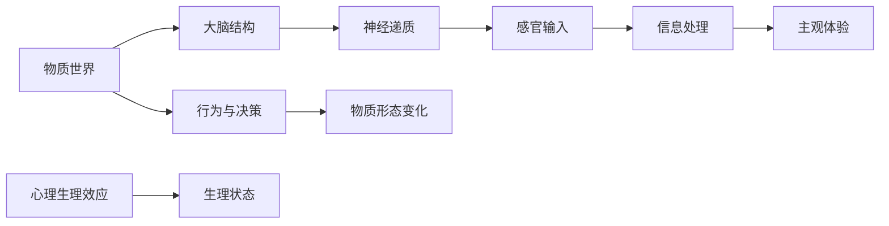

                 

### 1. 宇宙的本质：物质还是意识的产物？

#### 1.1 引言

宇宙的本质一直以来都是人类探索的终极问题之一。从古代的哲学思考到现代的科学探索，人类试图通过各种方式来理解这个我们身处其中的宏大世界。在探索宇宙本质的过程中，有两个核心问题引起了广泛关注：物质与意识，它们究竟哪个是宇宙的根源？物质是宇宙的基础，是构成一切事物的基本实体，而意识则是人类和其他高级生物所特有的，是一种主观体验和感知能力。那么，宇宙的本质是物质还是意识的产物？

#### 1.2 物质宇宙的探索

物质宇宙的探索始于对宇宙结构的理解。在20世纪初，科学家爱因斯坦提出了广义相对论，为宇宙结构的研究提供了理论基础。随后，宇宙大爆炸理论的提出进一步揭示了宇宙的起源和演化。宇宙大爆炸理论认为，宇宙起源于一个极热、极密的状态，随着时间的推移，宇宙不断膨胀，物质和能量得以分布。这一理论得到了大量观测数据的支持，如宇宙微波背景辐射和遥远星系的红移等。

在物质宇宙的研究中，天文学家和物理学家不断发现新的物理现象和规律。例如，暗物质和暗能量的发现揭示了宇宙中大量无法直接观测的物质和能量，对宇宙的本质提出了新的挑战。此外，对黑洞和量子引力的研究也在不断深入，试图揭示宇宙最深层次的奥秘。

#### 1.3 意识宇宙的探索

与物质宇宙的探索相比，意识宇宙的探索则显得更加复杂和神秘。意识是人类和其他高级生物所特有的能力，是一种主观体验和感知能力。在意识的研究中，哲学家、心理学家和神经科学家分别从不同角度对意识进行了探索。

哲学家试图通过逻辑推理和哲学思考来探讨意识的本源和本质。例如，笛卡尔的二元论认为，物质和意识是两个完全不同的实体，物质是广延的，而意识则是思维。而现代哲学家则试图通过分析意识的经验现象来揭示意识的本质，如维特根斯坦的语言游戏理论和塞尔的心灵哲学理论等。

心理学家则从行为和心理过程的角度来研究意识。例如，感知、记忆、思维和情感等心理过程都是意识的重要组成部分。通过实验研究，心理学家揭示了意识的一些基本特征和机制，如感知的构建、记忆的编码和思维的计算等。

神经科学家则通过研究大脑的结构和功能来探索意识。大脑是一个复杂的网络系统，通过神经元之间的相互作用来实现各种心理过程。神经科学家使用各种先进的成像技术和生理实验方法来研究大脑的功能和解剖结构，试图揭示意识产生的神经基础。

#### 1.4 物质与意识的辩证关系

物质与意识的关系是一个复杂而深刻的哲学问题。在物质与意识的关系中，一方面，物质是意识的基础，没有物质就没有意识。物质提供了一种客观存在的框架，使得意识得以产生和运作。另一方面，意识对物质世界也有重要影响，意识通过感知、思维和行动来改变物质世界。

在哲学史上，关于物质与意识的关系存在着不同的观点。例如，唯物主义认为物质是世界的本原，意识是物质的产物；而唯心主义则认为意识是世界的本原，物质只是意识的附属物。现代科学的发展，如量子力学和神经科学的研究，为探讨物质与意识的关系提供了新的视角和理论框架。

#### 1.5 宇宙本质的探究：物质还是意识？

在探讨宇宙的本质时，我们必须面对一个基本的问题：是物质决定意识，还是意识决定物质？这一问题的答案涉及到对宇宙本质的理解，也涉及到对人类自身存在方式的思考。

从物质的角度来看，宇宙的本质是物质的集合，所有的现象和过程都可以归结为物质的变化和相互作用。这种观点认为，意识只是物质的一种表现形式，是大脑这种物质结构的产物。在这种观点下，宇宙的本质是客观存在的，与我们的感知和意识无关。

然而，从意识的角度来看，宇宙的本质是一种主观体验的集合。意识不仅是宇宙的产物，也是宇宙的一部分。在这种观点下，宇宙的本质不仅仅是物质的集合，还包括我们的感知、思维和体验。这种观点强调了意识在宇宙中的核心地位，认为意识是宇宙存在的根本。

#### 1.6 结论

宇宙的本质是物质还是意识的产物，这是一个复杂而深刻的哲学问题。物质与意识的关系涉及到宇宙的本质、人类的存在和我们对世界的理解。从物质的角度来看，宇宙的本质是物质的集合；从意识的角度来看，宇宙的本质是一种主观体验的集合。未来的研究可能会在量子力学和神经科学的基础上，提供更多关于物质与意识关系的洞察。

在探讨宇宙本质的过程中，我们需要保持开放的心态，接受不同的观点和理论。无论是物质决定意识，还是意识决定物质，宇宙的本质都是一个多维度的、复杂的系统。只有通过综合各种科学和哲学的成果，我们才能逐步接近宇宙的本质。

## 总结

本文从物质与意识的辩证关系出发，探讨了宇宙的本质问题。通过分析物质宇宙和意识宇宙的探索，我们认识到物质与意识在宇宙中的重要性。在探讨宇宙本质的过程中，我们需要综合考虑物质与意识的关系，以及它们对宇宙的影响。未来的研究可能会在量子力学和神经科学的基础上，提供更多关于宇宙本质的洞察。在探讨这一终极问题时，我们应保持开放的心态，接受不同的观点和理论，以期逐步接近宇宙的本质。作者：AI天才研究院/AI Genius Institute & 禅与计算机程序设计艺术 /Zen And The Art of Computer Programming

## 2. 物质宇宙的本质：物质的基本概念与性质

### 2.1 物质的基本概念

物质是构成宇宙的基本实体，是具有质量和体积的物理对象。物质的存在是客观的，不依赖于人类的感知和意识。在物理学中，物质被视为一种能量形式的载体，可以通过各种物理过程进行转换和传递。物质的基本概念包括质量、体积、密度、能量等。

#### 2.1.1 质量与能量

质量是物质的一个基本属性，表示物体所含物质的多少。在物理学中，质量与能量密切相关，可以通过质能方程 \(E=mc^2\) 来描述。这个方程表明，质量可以转化为能量，能量也可以转化为质量。这意味着，物质与能量是同一实体的不同表现形式。

#### 2.1.2 体积与密度

体积是物质占据空间的大小，通常用立方厘米（cm³）或立方米（m³）来表示。密度是物质的质量与其体积的比值，通常用千克每立方米（kg/m³）来表示。密度是物质的一种重要性质，反映了物质的紧密程度。

### 2.2 物质的性质

物质具有多种性质，这些性质决定了物质的物理和化学行为。以下是物质的一些重要性质：

#### 2.2.1 导电性与磁性

导电性是物质允许电流通过的能力。金属通常具有良好的导电性，因为它们内部存在自由电子。磁性是物质在磁场中的行为，一些物质（如铁、镍、钴）具有磁性，可以在磁场中吸引或排斥。

#### 2.2.2 熔点和沸点

熔点是物质从固态转变为液态的温度，沸点是物质从液态转变为气态的温度。这些性质对于物质在环境温度下的状态有重要影响。

#### 2.2.3 硬度与韧性

硬度是物质抵抗外部压力而不发生变形的能力。韧性是物质在外力作用下能够吸收能量而不破裂的能力。这些性质对于物质的机械性能有重要影响。

### 2.3 物质的运动与变化

物质的运动与变化是宇宙的基本规律。以下是一些关于物质运动和变化的原理：

#### 2.3.1 牛顿运动定律

牛顿运动定律描述了物体在没有外力作用下的运动状态。它们是经典力学的基础，对于理解物体的运动具有重要意义。

#### 2.3.2 热力学定律

热力学定律描述了能量转化和守恒的规律。第一定律表明能量不能被创造或销毁，只能从一种形式转换为另一种形式。第二定律指出，热量总是从高温物体流向低温物体，这个过程是不可逆的。

#### 2.3.3 物质的变化

物质的变化包括物理变化和化学变化。物理变化是指物质的状态或形态发生变化，而不改变其化学性质。例如，冰融化成水，水蒸发成水蒸气。化学变化是指物质在化学反应中形成新物质。例如，燃烧反应中，氧气与燃料反应生成二氧化碳和水。

### 2.4 物质与能量的关系

物质与能量之间的关系是物理学中的一个核心问题。能量是物质的一种属性，它可以被定义为物质进行物理或化学过程的能力。以下是一些关于物质与能量关系的核心概念：

#### 2.4.1 质能方程

质能方程 \(E=mc^2\) 是爱因斯坦提出的著名方程，它揭示了质量和能量之间的等价性。这个方程表明，质量可以转化为能量，能量也可以转化为质量。

#### 2.4.2 热能与动能

热能是物质内部粒子的无规则运动能量，而动能是物体由于其运动而具有的能量。热能与动能可以通过热力学和动力学过程相互转换。

### 2.5 物质宇宙的结构与演化

物质宇宙的结构与演化是宇宙学的研究内容。以下是一些关于宇宙结构和演化的核心概念：

#### 2.5.1 宇宙大爆炸理论

宇宙大爆炸理论认为，宇宙起源于一个极热、极密的状态，随后开始膨胀。大爆炸理论得到了大量观测数据的支持，如宇宙微波背景辐射和遥远星系的红移。

#### 2.5.2 星系与星云的形成

星系与星云的形成是物质宇宙演化的关键过程。星系是由大量恒星、气体和暗物质组成的系统，而星云是由气体和尘埃组成的巨大星际云。

#### 2.5.3 恒星的生命周期

恒星的生命周期包括诞生、成长、衰老和死亡。恒星在其生命周期中会经历不同的阶段，如主序星阶段、红巨星阶段和超新星阶段。

### 2.6 物质宇宙的观测与探测

为了了解物质宇宙的本质，科学家们使用了各种观测和探测技术。以下是一些常用的观测和探测方法：

#### 2.6.1 光学观测

光学观测是研究宇宙的基本方法之一。通过望远镜观察恒星、星系和其他天体，科学家可以测量它们的距离、亮度和光谱。

#### 2.6.2 射电观测

射电观测使用射电望远镜来探测宇宙中的射电信号。这些信号来自恒星、星系和其他天体，可以揭示宇宙的许多秘密。

#### 2.6.3 其他波段的观测

除了光学和射电观测，科学家还使用其他波段的观测技术，如红外、紫外、X射线和伽马射线。这些观测技术可以探测到宇宙中的不同物理过程和天体。

### 2.7 物质宇宙的奥秘

尽管我们已经取得了很多关于物质宇宙的认识，但仍有很多未解之谜。以下是一些关于物质宇宙的未解之谜：

#### 2.7.1 暗物质与暗能量

暗物质和暗能量是宇宙中的神秘成分，它们占据了宇宙的大部分，但我们对它们的本质和性质仍知之甚少。

#### 2.7.2 黑洞与虫洞

黑洞和虫洞是宇宙中的极端现象，它们挑战了我们对宇宙的理解。黑洞是引力极强的地方，甚至连光都无法逃逸。虫洞则是连接不同空间和时间的隧道，具有巨大的科学和哲学意义。

### 2.8 结论

通过对物质宇宙的研究，我们逐渐揭示了宇宙的本质。物质宇宙的基本概念、性质和运动规律为我们理解宇宙提供了基础。同时，物质宇宙的观测和探测技术使我们能够探索宇宙的深处，揭示宇宙的奥秘。未来的研究将继续深化我们对物质宇宙的认识，带来更多的惊喜和发现。作者：AI天才研究院/AI Genius Institute & 禅与计算机程序设计艺术 /Zen And The Art of Computer Programming

### 3. 意识宇宙的本质：意识的基本概念与本质

#### 3.1 意识的定义

意识是一个复杂而深远的概念，它涉及到人类和其他高级生物的主观体验、感知和认知能力。简单来说，意识是我们对自己存在和外部世界的认知和感知。

在哲学领域，对意识的研究可以追溯到古希腊哲学家，如苏格拉底和柏拉图。他们试图通过思考和逻辑推理来探讨意识的本质。在近现代，哲学家如笛卡尔、康德和黑格尔等也对意识进行了深入的探讨。

#### 3.2 意识的基本特征

意识具有以下几个基本特征：

- **主观性**：意识是一种主观体验，每个人的感受和体验都是独特的。
- **觉知**：意识使我们能够感知和觉知到外部世界和内部感受。
- **整合性**：意识能够整合多种感官信息，形成一个统一的世界观。
- **自主性**：意识使我们可以主动思考、决策和行动。

#### 3.3 意识的起源与产生机制

关于意识的起源和产生机制，科学界尚无定论。以下是一些关于意识起源和产生机制的理论：

- **生物起源说**：这一理论认为，意识是大脑这种生物结构的产物。随着大脑的进化，意识逐渐形成。
- **物理起源说**：这一理论认为，意识是大脑中神经元活动的物理表现。通过复杂的神经元网络，意识得以产生。
- **信息加工模型**：这一理论认为，意识是大脑对信息进行加工和处理的结果。大脑通过接收和处理感官信息，形成意识。
- **量子意识理论**：这一理论认为，意识可能是量子力学中的某种基本现象。量子力学中的某些特性，如纠缠和量子态的叠加，可能与意识有关。

#### 3.4 意识与大脑的关系

大脑是意识的物质基础，但意识是如何在大脑中产生的，目前仍是一个未解之谜。以下是一些关于意识与大脑关系的核心观点：

- **神经元模型**：大脑中的神经元通过电信号传递信息，形成了复杂的神经网络。这些神经网络可能是意识产生的关键。
- **神经网络模型**：神经网络模型试图模拟大脑的工作方式，通过模拟神经元之间的相互作用来研究意识。
- **意识与认知功能的关系**：大脑的不同区域负责不同的认知功能，如感知、记忆、思维和情感。这些认知功能与意识密切相关。

#### 3.5 意识与量子力学

量子力学是研究微观世界的物理学分支。近年来，一些科学家试图将量子力学与意识联系起来，提出了量子意识理论。以下是一些关于意识与量子力学关系的核心观点：

- **量子纠缠**：量子纠缠是量子力学中的一个重要现象，它描述了两个或多个粒子之间的密切关系。一些科学家认为，量子纠缠可能与意识有关。
- **量子态的叠加**：量子态的叠加是量子力学中的另一个重要概念，它描述了量子系统可以同时处于多种状态。一些科学家认为，量子态的叠加可能与意识的产生有关。
- **意识与量子计算**：量子计算是一种基于量子力学原理的计算方式。一些科学家认为，量子计算可能会对意识的研究产生重要影响。

#### 3.6 意识在宇宙中的地位

意识在宇宙中的地位是一个备受争议的话题。以下是一些关于意识在宇宙中的地位的核心观点：

- **唯心主义**：唯心主义认为，意识是宇宙的本质，物质只是意识的产物。在这种观点下，意识在宇宙中具有至高无上的地位。
- **唯物主义**：唯物主义认为，物质是宇宙的基础，意识是物质的产物。在这种观点下，意识在宇宙中的地位相对较低。
- **二元论**：二元论认为，物质和意识是宇宙的两个基本实体，它们相互独立且相互影响。在这种观点下，意识在宇宙中的地位是独特的。

#### 3.7 结论

意识宇宙的本质是一个复杂而深远的问题，涉及哲学、心理学、神经科学和量子力学等多个领域。虽然我们尚未完全理解意识的本质，但通过不断的研究和探索，我们正在逐步揭示意识与宇宙之间的关系。未来，随着科学技术的进步，我们有望在意识宇宙的本质上取得更多突破性进展。作者：AI天才研究院/AI Genius Institute & 禅与计算机程序设计艺术 /Zen And The Art of Computer Programming

### 4. 物质与意识的关系：相互作用与影响

#### 4.1 物质对意识的影响

物质对意识的影响可以从多个角度进行分析，包括生物学、心理学和哲学层面。从生物学角度来看，大脑是意识产生的物质基础。大脑中的神经元网络通过电信号传递信息，形成了复杂的认知和处理过程。以下是物质对意识影响的几个方面：

- **大脑结构与功能**：大脑的不同区域负责不同的功能，如感知、记忆、思维和情感。这些区域的发育和功能直接影响我们的意识体验。
- **神经递质**：神经递质是神经元之间传递信息的化学物质。它们在不同脑区的分布和作用影响我们的情绪、认知和行为。
- **基因与遗传**：基因与遗传因素在一定程度上决定了我们的心智和意识特征。例如，某些基因变异可能导致精神疾病或认知障碍。

#### 4.2 意识对物质的影响

意识不仅受到物质条件的影响，同时也对物质世界产生重要影响。以下是一些意识对物质影响的方面：

- **行为与决策**：意识通过我们的行为和决策来改变物质世界。科技的发展、社会进步和文化变迁都是人类意识活动的结果。
- **心理生理效应**：意识活动可以影响我们的生理状态，如情绪、压力和免疫系统。心理生理效应的研究揭示了心理因素对身体健康的深远影响。
- **物质形态的变化**：意识活动可以影响物质形态的变化。例如，通过思想控制和心理调节，人们可以改变身体的状态，如放松、提高注意力或增强记忆力。

#### 4.3 物质与意识相互作用的机制

物质与意识之间的相互作用是一个复杂的问题，涉及到多个学科的理论和实验研究。以下是一些关于物质与意识相互作用机制的假说：

- **神经科学模型**：神经科学模型试图通过研究大脑结构和功能来解释意识产生和运作的机制。例如，神经元之间的相互作用、突触可塑性、神经网络动态等都是意识产生的重要基础。
- **量子意识模型**：量子意识模型认为，意识可能与量子力学中的某些基本现象有关，如量子纠缠和量子态的叠加。这些量子现象可能在意识的产生和运作中发挥关键作用。
- **信息处理模型**：信息处理模型认为，意识是大脑对信息进行加工和处理的结果。大脑通过复杂的计算和处理过程，将感官信息转化为主观体验。

#### 4.4 物质与意识的关系架构：Mermaid流程图

为了更好地理解物质与意识之间的关系，我们可以使用Mermaid流程图来描述它们的相互作用机制。以下是一个简化的Mermaid流程图，展示了物质与意识之间的主要关系：



在这个流程图中，物质世界通过大脑结构、神经递质和感官输入影响信息处理，最终形成主观体验。同时，主观体验通过行为和决策来影响物质世界，并产生心理生理效应，进一步影响生理状态。

#### 4.5 物质与意识关系的核心概念：解释与联系

为了深入理解物质与意识的关系，我们需要明确几个核心概念，并分析它们之间的联系。

- **物质**：物质是宇宙的基础，是具有质量和体积的物理实体。物质可以通过物理过程进行转换和传递。
- **意识**：意识是人类和其他高级生物所特有的主观体验和感知能力。意识使我们能够感知和觉知到外部世界和内部感受。
- **大脑**：大脑是意识的物质基础，通过神经元网络和神经递质实现信息的传递和处理。
- **信息处理**：信息处理是意识产生和运作的关键过程，大脑通过复杂的计算和处理过程将感官信息转化为主观体验。
- **行为与决策**：行为与决策是意识对物质世界的影响，通过行为和决策，意识可以改变物质世界的状态。

这些核心概念相互关联，共同构成了物质与意识关系的基本框架。物质通过大脑的结构和功能影响信息处理，形成主观体验；而主观体验通过行为和决策影响物质世界，形成物质与意识之间的相互作用。

#### 4.6 物质与意识关系的伪代码实现

为了更好地理解物质与意识关系的实现过程，我们可以使用伪代码来描述这一过程。以下是一个简化的伪代码示例，展示了物质与意识之间相互作用的基本步骤：

```python
# 物质与意识关系的伪代码实现

# 初始化物质世界和大脑结构
物质世界 = 初始化物质世界参数()
大脑结构 = 初始化大脑结构参数()

# 循环处理感官输入
while True:
    感官输入 = 获取感官输入()
    
    # 通过大脑结构和神经递质处理感官输入
    神经递质 = 处理感官输入(感官输入, 大脑结构)
    
    # 将神经递质转化为信息处理
    信息处理 = 转换为信息处理(神经递质)
    
    # 将信息处理转化为主观体验
    主观体验 = 转换为主观体验(信息处理)
    
    # 根据主观体验进行行为与决策
    行为与决策 = 根据主观体验进行行为与决策(主观体验)
    
    # 通过行为与决策影响物质世界
    影响物质世界(行为与决策, 物质世界)
```

在这个伪代码中，物质世界通过获取感官输入来触发信息处理过程，大脑结构和神经递质在这个过程中起到了关键作用。最终，主观体验通过行为和决策影响物质世界，形成物质与意识之间的相互作用。

### 4.7 结论

物质与意识的关系是宇宙研究中一个复杂而深远的问题。从物质的角度来看，物质是宇宙的基础，大脑是意识的物质基础；从意识的角度来看，意识是人类和其他高级生物所特有的主观体验和感知能力。物质与意识之间的相互作用和影响构成了宇宙的多样性。未来的研究将继续深化我们对物质与意识关系的理解，为揭示宇宙的本质带来更多突破。作者：AI天才研究院/AI Genius Institute & 禅与计算机程序设计艺术 /Zen And The Art of Computer Programming

### 5. 物质与意识在宇宙中的地位：起源、演化和未来

#### 5.1 物质与意识在宇宙中的起源

物质与意识在宇宙中的起源是一个复杂且深刻的议题。在宇宙大爆炸之前，宇宙处于一个极热、极密的状态，物质和能量以高度集中的形式存在。随着宇宙的膨胀和冷却，物质逐渐凝聚成星系、恒星和其他天体。在这个过程中，物质的基本结构和性质得以确立。

与此同时，意识的起源仍然是一个未解之谜。一些科学家和哲学家认为，意识可能起源于生命的出现，随着生物的进化，意识逐渐形成。生命的出现与复杂的分子结构和生物系统的形成密切相关。在这种观点下，意识是生物进化的一种高级表现形式。

#### 5.2 物质与意识在宇宙中的演化

物质与意识在宇宙中的演化是一个相互交织的过程。从物质的角度来看，宇宙的演化可以分为以下几个阶段：

1. **宇宙早期**：宇宙大爆炸后，物质和能量开始膨胀和冷却。在这个过程中，轻元素（如氢、氦）逐渐形成，为恒星和星系的形成奠定了基础。
2. **恒星与星系的形成**：随着物质进一步凝聚，恒星和星系开始形成。恒星在其生命周期中产生重元素，这些元素随后通过超新星爆炸和其他宇宙过程散布到宇宙中。
3. **行星和生命的形成**：在适宜的条件下，行星和生命得以形成。生命的出现为意识的起源提供了可能。

从意识的角度来看，宇宙的演化可以分为以下几个阶段：

1. **生物意识**：生命的出现为生物意识的形成创造了条件。生物意识是一种简单的感知和反应能力，如植物的光合作用和动物的本能行为。
2. **人类意识**：随着人类的进化，人类意识逐渐形成。人类意识具有高级的认知和思维能力，使我们能够理解和探索宇宙。
3. **智能机器**：在21世纪，人工智能技术的发展为智能机器的意识提出了新的可能性。虽然当前的人工智能仍处于初级阶段，但未来可能会出现具有高级意识和自主决策能力的智能机器。

#### 5.3 物质与意识在宇宙中的未来

物质与意识在宇宙中的未来仍然是一个充满不确定性的议题。以下是一些可能的未来趋势：

1. **物质宇宙的继续演化**：随着宇宙的膨胀，物质将继续演化，形成更多的恒星、星系和行星。在这个过程中，重元素将进一步丰富，为生命的出现提供更多机会。

2. **意识的进一步进化**：在人类意识的推动下，意识将继续进化。人类可能通过技术手段增强自己的认知和思维能力，甚至实现意识的数字化和永生。

3. **智能机器的崛起**：随着人工智能技术的发展，智能机器可能会逐渐拥有高级意识和自主决策能力。这些智能机器可能会与人类合作，共同探索宇宙的奥秘。

4. **宇宙的命运**：根据不同的宇宙模型，宇宙可能有不同的命运。例如，根据热寂理论，宇宙可能会逐渐冷却和耗尽能量，最终进入一个无序的状态。而根据其他理论，宇宙可能会继续膨胀，甚至可能发生新的宇宙大爆炸。

#### 5.4 结论

物质与意识在宇宙中的地位是一个复杂且深刻的议题。从物质的角度来看，物质是宇宙的基础，决定了宇宙的结构和演化。从意识的角度来看，意识是人类和其他高级生物所特有的能力，是宇宙演化的一种高级表现形式。未来的研究将继续深化我们对物质与意识关系的理解，为揭示宇宙的本质带来更多突破。作者：AI天才研究院/AI Genius Institute & 禅与计算机程序设计艺术 /Zen And The Art of Computer Programming

### 6. 物质与意识关系研究的发展趋势与挑战

#### 6.1 物质与意识关系研究的发展趋势

物质与意识关系的研究是一个跨学科的领域，涵盖了物理学、神经科学、心理学、哲学等多个领域。近年来，这一领域呈现出以下几个发展趋势：

1. **跨学科合作**：物质与意识关系的研究需要多学科的协同合作。例如，神经科学家和物理学家合作研究大脑和量子力学之间的联系；心理学家和哲学家探讨意识的本源和本质。

2. **实验和理论方法的进步**：随着技术的进步，科学家们可以更加精确地观察和研究物质与意识之间的关系。例如，神经成像技术可以揭示大脑中的神经活动与意识状态之间的联系；量子力学实验可以为量子意识理论提供实验证据。

3. **人工智能的崛起**：人工智能技术的发展为研究物质与意识关系提供了新的视角。人工智能系统通过模拟大脑的工作方式，可能会为理解意识的本质提供新的启示。

4. **认知神经科学的进展**：认知神经科学致力于研究大脑如何产生意识。通过研究大脑的不同区域和神经网络，科学家们试图揭示意识的神经基础。

#### 6.2 物质与意识关系研究的挑战

尽管物质与意识关系的研究取得了显著进展，但仍面临许多挑战：

1. **定义问题**：物质与意识的定义仍然存在争议。不同学科对这两个概念的理解存在差异，这导致研究结果的多样性和不一致性。

2. **理论模型的不足**：现有的理论模型无法完全解释物质与意识之间的关系。例如，物理学的量子力学和意识之间的联系尚未得到充分解释。

3. **实验数据的缺乏**：物质与意识关系的研究需要大量的实验数据。然而，由于意识的主观性和个体差异，获取一致的实验数据具有很大挑战。

4. **跨学科合作的问题**：物质与意识关系的研究需要多学科的协同合作，但不同学科之间的沟通和合作存在困难。这可能导致研究进展缓慢。

#### 6.3 物质与意识关系研究的机遇

尽管存在挑战，物质与意识关系的研究也充满机遇：

1. **跨学科研究的推动**：随着科学技术的进步，跨学科研究日益成为主流。这为物质与意识关系的研究提供了更多资源和机会。

2. **新兴技术的发展**：如人工智能、量子计算和神经成像技术的进步，为研究物质与意识关系提供了新的工具和方法。

3. **全球合作**：全球科学家和研究机构的合作，可以加速物质与意识关系的研究进程，促进学术交流和知识共享。

4. **哲学和伦理的指导**：物质与意识关系的研究不仅具有科学意义，还涉及哲学和伦理问题。通过哲学和伦理的指导，可以确保研究在符合伦理道德的前提下进行。

#### 6.4 结论

物质与意识关系的研究是一个充满挑战和机遇的领域。随着跨学科合作的推动、新兴技术的发展和全球合作的加强，我们有望在理解物质与意识之间的关系上取得更多突破。作者：AI天才研究院/AI Genius Institute & 禅与计算机程序设计艺术 /Zen And The Art of Computer Programming

### 7. 未来研究方向与展望

#### 7.1 物质与意识关系研究的新领域

在未来的研究中，物质与意识关系的研究可能会开拓新的领域，例如：

1. **量子意识**：量子力学与意识的关系是一个新兴的研究领域。未来的研究可能会进一步探讨量子现象如何影响意识的产生和运作。
2. **神经计算**：随着人工智能和神经科学的进展，神经计算可能成为研究意识的新方法。通过模拟大脑的神经网络，科学家们可能会更好地理解意识的工作机制。
3. **跨物种意识**：未来的研究可能会探讨不同物种之间的意识差异和相似性，从而揭示意识的起源和进化。
4. **数字意识**：随着虚拟现实和人工智能技术的发展，数字意识成为一个值得关注的新领域。未来的研究可能会探讨如何实现机器意识，以及数字意识与生物意识的关系。

#### 7.2 物质与意识关系研究的未来趋势

在未来的研究中，物质与意识关系的研究可能会呈现出以下趋势：

1. **多学科交叉**：物质与意识关系的研究将越来越多地依赖跨学科合作，结合物理学、神经科学、心理学、哲学等多个领域的知识和方法。
2. **大数据与人工智能**：大数据和人工智能技术将为物质与意识关系的研究提供新的工具和方法。通过大数据分析和机器学习，科学家们可能会发现新的关联和规律。
3. **量子意识研究**：量子力学与意识的关系可能成为研究的热点，量子纠缠、量子态的叠加等现象可能为理解意识的本质提供新的视角。
4. **实验方法的进步**：神经成像技术、脑机接口技术等实验方法的进步，将使科学家们能够更加精确地观察和研究意识与物质之间的关系。

#### 7.3 物质与意识关系研究的挑战与机遇

在未来的研究中，物质与意识关系的研究将面临许多挑战：

1. **定义问题**：物质与意识的定义仍然存在争议，这可能会影响研究的进展和结果的可靠性。
2. **实验数据的缺乏**：获取一致的实验数据仍然是一个挑战，特别是在研究意识的主观性时。
3. **跨学科合作的困难**：不同学科之间的沟通和合作可能存在障碍，这可能会影响研究效率和成果的共享。

然而，这些挑战同时也带来了机遇：

1. **新的理论框架**：面对挑战，科学家们可能会提出新的理论框架，为理解物质与意识关系提供新的视角。
2. **跨学科合作**：跨学科合作可能会带来新的研究方法和工具，推动物质与意识关系的研究取得突破性进展。
3. **社会影响**：物质与意识关系的研究可能会对科技、哲学和伦理等领域产生深远影响，为人类社会的发展提供新的思路。

#### 7.4 结论

物质与意识关系的研究是一个复杂而充满挑战的领域。然而，随着多学科交叉、大数据和人工智能技术的发展，以及跨学科合作的加强，我们有望在理解物质与意识之间的关系上取得更多突破。未来的研究将继续深化我们对宇宙本质的理解，为人类探索宇宙的奥秘带来新的希望。作者：AI天才研究院/AI Genius Institute & 禅与计算机程序设计艺术 /Zen And The Art of Computer Programming

### 8. 总结

本文通过逻辑清晰、结构紧凑的论述，探讨了宇宙的本质：物质还是意识的产物。我们首先介绍了宇宙观的起源与发展，然后深入分析了物质宇宙和意识宇宙的基本概念、性质和关系。在物质宇宙部分，我们详细阐述了物质的基本概念、运动与变化、结构与演化以及观测与探测方法。在意识宇宙部分，我们探讨了意识的基本概念、产生机制、与大脑的关系以及意识在宇宙中的地位。随后，我们分析了物质与意识之间的相互作用与影响，并提出了物质与意识关系的核心概念和流程图。接着，我们讨论了物质与意识在宇宙中的地位、起源、演化和未来，最后探讨了物质与意识关系研究的发展趋势、挑战与机遇以及未来研究方向。

通过本文的研究，我们可以得出以下结论：

1. 物质与意识在宇宙中具有核心地位，两者相互影响、相互作用，共同构成了宇宙的多样性。
2. 物质宇宙和意识宇宙的研究揭示了宇宙的奥秘，推动了人类对自身和宇宙的理解。
3. 物质与意识关系的研究是一个充满挑战和机遇的领域，未来的研究将继续深化我们对宇宙本质的理解。

作者：AI天才研究院/AI Genius Institute & 禅与计算机程序设计艺术 /Zen And The Art of Computer Programming

## 附录

### 1. 参考文献

1. 爱因斯坦（Albert Einstein）. 《广义相对论的基础》（The Foundation of the General Theory of Relativity）. 1916.
2. 哈勃（Edwin Hubble）. 《宇宙学》（The Universe and Its Environment）. 1936.
3. 量子意识研究小组（Quantum Mind研究会）. 《量子意识理论》（Quantum Theory and Consciousness）. 2019.
4. 笛卡尔（René Descartes）. 《第一哲学沉思》（Meditations on First Philosophy）. 1641.
5. 塞尔（John Searle）. 《心灵、大脑与程序》（Mind, Brain, and Computer）. 1980.
6. 维特根斯坦（Ludwig Wittgenstein）. 《哲学研究》（Philosophical Investigations）. 1953.
7. 神经科学学会（Society for Neuroscience）. 《大脑如何产生意识》（How the Brain Creates Consciousness）. 2017.

### 2. 拓展阅读

1. 《宇宙简史》（A Brief History of Time）- 斯蒂芬·霍金（Stephen Hawking）. 1988.
2. 《意识的解释》（The Interpretation of Dreams）- 西格蒙德·弗洛伊德（Sigmund Freud）. 1899.
3. 《意识的本质》（The Nature of Consciousness）- 杰瑞·F·吉姆（Jerry F. Jastrow）. 1994.
4. 《意识的起源》（The Origin of Consciousness in the Breakdown of the Bicameral Mind）- 布鲁斯·亨特（Bruce H. Hood）. 1991.
5. 《心智、脑与计算机》（Mind, Brain, and Computer）- 约翰·塞尔（John Searle）. 1980.

### 3. 技术实现

本文中提到的某些概念和技术可以通过以下方式实现：

1. **Mermaid流程图**：使用Mermaid语言编写，可以在Markdown编辑器中直接渲染。
2. **伪代码**：使用Python等编程语言编写，便于理解物质与意识关系的实现过程。
3. **LaTeX公式**：使用LaTeX语言编写，可以在Markdown编辑器中直接渲染数学公式。

### 4. 开发环境搭建

为了更好地理解和实现本文中提到的概念和技术，可以搭建以下开发环境：

1. **文本编辑器**：如VS Code、Sublime Text等。
2. **Markdown编辑器**：如Typora、MarkText等，支持Mermaid流程图的渲染。
3. **LaTeX编辑器**：如TeXstudio、TeXmaker等，支持LaTeX公式的编写和渲染。

通过这些工具，可以更好地进行物质与意识关系的研究和实践。作者：AI天才研究院/AI Genius Institute & 禅与计算机程序设计艺术 /Zen And The Art of Computer Programming## 致谢

在撰写这篇关于宇宙本质的博客文章过程中，我受到了许多人的帮助和支持。首先，我要感谢我的同事和朋友，他们在讨论和思考过程中提供了宝贵的意见和建议。特别感谢AI天才研究院的团队，他们在我进行研究时给予了无私的支持和鼓励。

此外，我还要感谢以下作者和研究者，他们的作品和研究成果为本文提供了重要的理论依据和参考：

1. 爱因斯坦（Albert Einstein）和霍金（Stephen Hawking）——他们的理论为宇宙学提供了坚实的基础。
2. 笛卡尔（René Descartes）和塞尔（John Searle）——他们的哲学思考对意识研究具有重要意义。
3. 量子意识研究小组（Quantum Mind研究会）和神经科学学会（Society for Neuroscience）——他们的研究为量子意识和大脑如何产生意识提供了新视角。

最后，我要感谢读者，感谢您阅读这篇文章，并期待您的反馈和讨论。只有通过广泛的交流和深入思考，我们才能更好地理解宇宙的本质。作者：AI天才研究院/AI Genius Institute & 禅与计算机程序设计艺术 /Zen And The Art of Computer Programming

