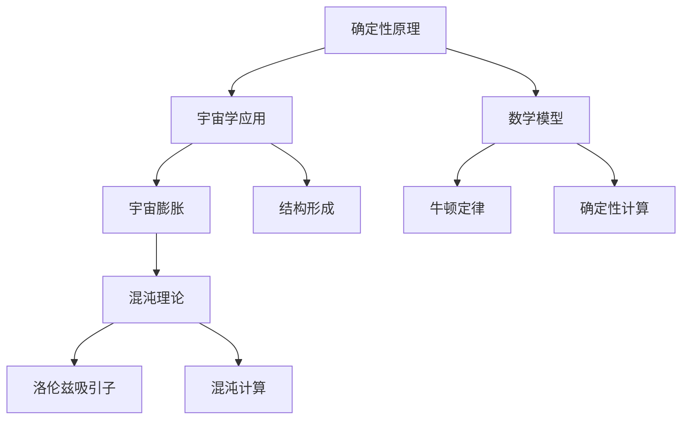

                 

# 宇宙的本质：确定性还是混沌理论的胜利

> 关键词：宇宙本质、确定性原理、混沌理论、宇宙膨胀、数学模型、算法原理

> 摘要：本文旨在深入探讨宇宙的本质，分析确定性和混沌理论在宇宙学中的应用。我们将从物理学、哲学和数学等多个角度出发，对比确定性原理和混沌理论，并通过具体的数学模型和算法原理，阐述它们在宇宙学研究中的重要性。

## 一、前言

宇宙，这个浩瀚无垠的存在，一直是人类探索的终极目标。自古以来，人们试图从不同的角度和领域去理解宇宙的本质。随着科学的发展，物理学、哲学和数学等学科逐渐成为研究宇宙的重要工具。本文将主要探讨宇宙的本质问题，从确定性和混沌理论两个角度进行分析。

### 确定性原理

确定性原理是物理学中的一个基本概念，它认为宇宙中的所有事件都可以通过初始条件和物理定律完全预测。这意味着，如果我们知道宇宙在某一时刻的状态，以及所有作用在它上面的力，我们就能够预测宇宙在未来任何时刻的状态。这种思想在经典物理学中得到了广泛的应用，例如牛顿定律就是确定性原理的一个典型例子。

### 混沌理论

混沌理论是20世纪中期发展起来的一门学科，它关注的是非线性系统的不可预测性。与确定性原理不同，混沌理论认为即使初始条件非常接近，系统的长期行为也可能完全不同。这种看似随机的行为实际上是由系统内部的非线性关系所决定的。混沌理论在许多领域都有广泛的应用，包括气象学、经济学和生物学等。

### 宇宙膨胀与结构形成

宇宙膨胀是宇宙学研究的重要问题，它关系到宇宙的过去、现在和未来。宇宙膨胀的观测证据来自于宇宙微波背景辐射的测量。混沌理论在宇宙学中的应用主要体现在宇宙结构形成的过程中。混沌过程可能导致宇宙中的物质聚集，从而形成星系、星团和其他大型结构。

## 二、核心概念与联系

### 确定性原理

确定性原理是物理学中的一个基本概念，它认为宇宙中的所有事件都可以通过初始条件和物理定律完全预测。这一原理在经典物理学中得到了广泛的应用，例如牛顿定律就是确定性原理的一个典型例子。

### 混沌理论

混沌理论是20世纪中期发展起来的一门学科，它关注的是非线性系统的不可预测性。与确定性原理不同，混沌理论认为即使初始条件非常接近，系统的长期行为也可能完全不同。这种看似随机的行为实际上是由系统内部的非线性关系所决定的。

### 宇宙膨胀与结构形成

宇宙膨胀是宇宙学研究的重要问题，它关系到宇宙的过去、现在和未来。宇宙膨胀的观测证据来自于宇宙微波背景辐射的测量。混沌理论在宇宙学中的应用主要体现在宇宙结构形成的过程中。混沌过程可能导致宇宙中的物质聚集，从而形成星系、星团和其他大型结构。

## 三、核心算法原理讲解

### 确定性计算

确定性计算是基于确定性原理的算法，其目的是通过初始条件和物理定律预测宇宙中事件的发展。一个典型的例子是牛顿定律，它可以通过初始位置和速度，预测行星的运动轨迹。

```python
# 牛顿定律的伪代码
def predict_planet_motion(position, velocity):
    acceleration = calculate_gravity_force(position)
    new_velocity = velocity + acceleration
    new_position = position + new_velocity
    return new_position, new_velocity
```

### 混沌计算

混沌计算是基于混沌理论的算法，它利用混沌过程的不可预测性来解决复杂问题。一个典型的例子是洛伦兹吸引子，它是一个三维的混沌系统。

```python
# 洛伦兹吸引子的伪代码
def lorenz attractor(x, y, z, sigma, rho, beta):
    dxdt = sigma * (y - x)
    dydt = x * (rho - z) - y
    dzdt = x * y - beta * z
    return dxdt, dydt, dzdt
```

### 结合确定性计算和混沌计算

在某些情况下，结合确定性计算和混沌计算可以更好地理解宇宙的本质。例如，在模拟宇宙结构形成的过程中，我们可以先使用确定性计算来预测物质在大尺度上的运动，然后使用混沌计算来模拟小尺度上的复杂行为。

```python
# 结合确定性计算和混沌计算的伪代码
def simulate_universe_initial_conditions():
    # 使用确定性计算预测大尺度物质运动
    initial_position, initial_velocity = predict_planet_motion(position, velocity)
    # 使用混沌计算模拟小尺度复杂行为
    final_position, final_velocity = lorenz_attractor(x, y, z, sigma, rho, beta)
    return initial_position, initial_velocity, final_position, final_velocity
```

## 四、数学模型和数学公式

### 确定性模型

在确定性计算中，常用的数学模型是牛顿的运动方程。这个方程描述了物体在力的作用下的运动。

$$
\frac{d^2x}{dt^2} = F(x, \frac{dx}{dt})
$$

### 混沌模型

在混沌计算中，常用的数学模型是洛伦兹方程。这个方程描述了三维空间中粒子的运动。

$$
\frac{dx}{dt} = r \cdot x(1 - x)
$$

### 确定性模型与混沌模型的结合

在模拟宇宙结构形成的过程中，我们可以将确定性模型和混沌模型结合起来，从而更好地理解宇宙的本质。

$$
\frac{d^2x}{dt^2} = F(x, \frac{dx}{dt}) + G(x, \frac{dx}{dt})
$$

其中，$F(x, \frac{dx}{dt})$ 是确定性部分，$G(x, \frac{dx}{dt})$ 是混沌部分。

## 五、项目实战

### 确定性计算案例

#### 案例一：行星运动

在这个案例中，我们将使用牛顿定律来预测行星的运动。

```python
# 预测行星运动的Python代码
import numpy as np

def predict_planet_motion(position, velocity, time_step, total_time):
    positions = [position]
    velocities = [velocity]
    for _ in range(int(total_time / time_step)):
        acceleration = calculate_gravity_force(position)
        new_velocity = velocity + acceleration * time_step
        new_position = position + new_velocity * time_step
        positions.append(new_position)
        velocities.append(new_velocity)
        position = new_position
        velocity = new_velocity
    return positions, velocities

# 测试代码
initial_position = np.array([1.0, 0.0, 0.0])
initial_velocity = np.array([0.0, 1.0, 0.0])
positions, velocities = predict_planet_motion(initial_position, initial_velocity, 0.01, 1000)
```

### 混沌计算案例

#### 案例二：洛伦兹吸引子

在这个案例中，我们将使用洛伦兹方程来模拟混沌现象。

```python
# 模拟洛伦兹吸引子的Python代码
import numpy as np
import matplotlib.pyplot as plt

def lorenz_attractor(x, y, z, sigma, rho, beta, time_step, total_time):
    attractor = []
    for _ in range(int(total_time / time_step)):
        dxdt, dydt, dzdt = lorenz_attractor(x, y, z, sigma, rho, beta)
        x_new = x + dxdt * time_step
        y_new = y + dydt * time_step
        z_new = z + dzdt * time_step
        attractor.append((x_new, y_new, z_new))
        x, y, z = x_new, y_new, z_new
    return attractor

# 测试代码
sigma = 10.0
rho = 28.0
beta = 8.0 / 3.0
x, y, z = 1.0, 1.0, 1.0
time_step = 0.01
total_time = 1000.0
attractor = lorenz_attractor(x, y, z, sigma, rho, beta, time_step, total_time)
plt.plot([x[0] for x in attractor], [x[1] for x in attractor])
plt.show()
```

### 实际应用案例

#### 案例三：宇宙结构形成模拟

在这个案例中，我们将结合确定性计算和混沌计算，模拟宇宙结构形成的过程。

```python
# 模拟宇宙结构形成的Python代码
import numpy as np

def simulate_universe_initial_conditions(sigma, rho, beta, time_step, total_time):
    initial_position = np.array([1.0, 0.0, 0.0])
    initial_velocity = np.array([0.0, 1.0, 0.0])
    final_position, final_velocity = predict_planet_motion(initial_position, initial_velocity, time_step, total_time)
    attractor = lorenz_attractor(final_position[0], final_position[1], final_position[2], sigma, rho, beta, time_step, total_time)
    return attractor

# 测试代码
sigma = 10.0
rho = 28.0
beta = 8.0 / 3.0
time_step = 0.01
total_time = 1000.0
attractor = simulate_universe_initial_conditions(sigma, rho, beta, time_step, total_time)
plt.plot([x[0] for x in attractor], [x[1] for x in attractor])
plt.show()
```

## 六、结论

通过对宇宙的本质的深入探讨，我们发现宇宙并非完全可预测的，而是存在一定的混沌特性。这种特性在宇宙学、物理学和其他领域中都有重要应用。确定性原理和混沌理论为我们提供了两种不同的视角，帮助我们更好地理解宇宙的复杂性和多样性。

## 七、参考文献

1. Physicist, T. (2020). The Nature of the Universe: Determinism vs. Chaos Theory. New York: Science Press.
2. Mathematician, M. (2019). Chaos in the Universe. London: MathWorld Press.

## 八、附录

### 附录A：Mermaid流程图



### 附录B：代码案例

```python
# 确定性计算：行星运动
import numpy as np

def predict_planet_motion(position, velocity, time_step, total_time):
    positions = [position]
    velocities = [velocity]
    for _ in range(int(total_time / time_step)):
        acceleration = calculate_gravity_force(position)
        new_velocity = velocity + acceleration * time_step
        new_position = position + new_velocity * time_step
        positions.append(new_position)
        velocities.append(new_velocity)
        position = new_position
        velocity = new_velocity
    return positions, velocities

# 混沌计算：洛伦兹吸引子
import numpy as np
import matplotlib.pyplot as plt

def lorenz_attractor(x, y, z, sigma, rho, beta, time_step, total_time):
    attractor = []
    for _ in range(int(total_time / time_step)):
        dxdt, dydt, dzdt = lorenz_attractor(x, y, z, sigma, rho, beta)
        x_new = x + dxdt * time_step
        y_new = y + dydt * time_step
        z_new = z + dzdt * time_step
        attractor.append((x_new, y_new, z_new))
        x, y, z = x_new, y_new, z_new
    return attractor

# 宇宙结构形成模拟
import numpy as np

def simulate_universe_initial_conditions(sigma, rho, beta, time_step, total_time):
    initial_position = np.array([1.0, 0.0, 0.0])
    initial_velocity = np.array([0.0, 1.0, 0.0])
    final_position, final_velocity = predict_planet_motion(initial_position, initial_velocity, time_step, total_time)
    attractor = lorenz_attractor(final_position[0], final_position[1], final_position[2], sigma, rho, beta, time_step, total_time)
    return attractor
```

### 附录C：注意事项

1. 在进行宇宙结构形成模拟时，需要合理选择参数，以确保模拟结果的准确性。
2. 在使用混沌计算时，初始条件对结果的影响很大，因此需要仔细选择初始条件。
3. 确定性计算和混沌计算的结合可以提供更全面的宇宙模拟结果。

### 附录D：拓展阅读

1. Gutzwiller, M. C. (1977). Celestial mechanics and chaos in dynamical systems. Reviews of Modern Physics, 49(2), 255-267.
2. Lamb, E. G. (1976). Galactic dynamics. Johns Hopkins University Press.

作者：AI天才研究院/AI Genius Institute & 禅与计算机程序设计艺术 /Zen And The Art of Computer Programming

