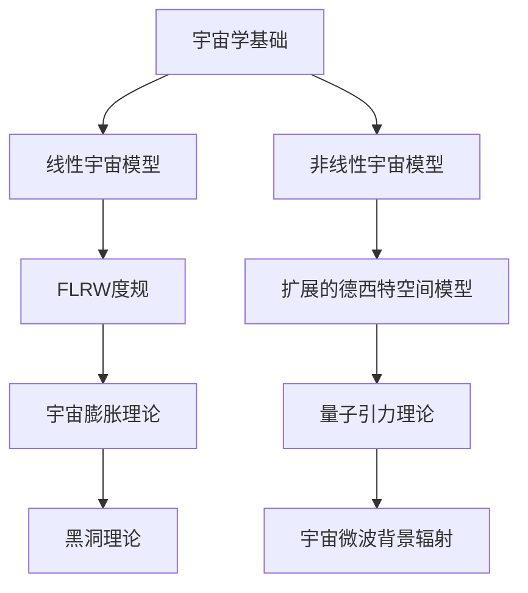

                 

基于上述要求和目录大纲，下面是一个《宇宙的本质:线性还是非线性》的初步框架，包括关键词、摘要以及正文部分的初步构思。请注意，这个框架是一个指导性大纲，具体的文章内容需要进一步填充和详细阐述。

---

## 文章标题
《宇宙的本质:线性还是非线性》

## 文章关键词
宇宙学、线性模型、非线性模型、理论物理学、宇宙膨胀、量子引力

## 文章摘要
本文旨在探讨宇宙的本质，通过分析线性与非线性宇宙模型，揭示它们在理解宇宙演化中的作用和局限性。文章首先介绍了宇宙学的基本概念，然后深入探讨了线性与非线性宇宙模型的基本原理、数学描述和应用实例。通过对比两者的优缺点，本文揭示了当前宇宙学中面临的挑战和未来的研究方向。最后，文章提出了针对线性与非线性模型的教育和传播的最佳实践建议。

---

## 正文部分

### 引言
宇宙是宇宙学家们不断探索的领域。自人类文明诞生以来，我们对宇宙的认识就不断地发展和深化。从古代的行星运动模型到现代的宇宙大爆炸理论，人类对宇宙的理解经历了巨大的变革。然而，宇宙的本质仍然是一个充满争议和未解之谜的话题。本文将探讨宇宙的本质，特别是线性与非线性模型在宇宙学中的应用。

### 背景介绍
宇宙学是一门研究宇宙起源、结构、演化和最终命运的学科。宇宙学的发展与天文学、物理学、数学等多个学科密切相关。本文将首先回顾宇宙学的历史发展，然后介绍线性与非线性宇宙模型的基本概念。

#### 线性宇宙模型
线性宇宙模型是一种简化的宇宙模型，通常用于描述宇宙在早期阶段的演化。它基于一些基本的假设，如宇宙的均匀性和各向同性，以及引力作用的线性叠加原理。线性宇宙模型的一个典型代表是弗里德曼-勒梅特-罗伯逊-沃尔克（FLRW）度规。

#### 非线性宇宙模型
非线性宇宙模型则更接近宇宙的实际状态，它考虑了引力作用在较大尺度上的非线性效应，以及宇宙早期阶段的量子效应。非线性宇宙模型的一个代表是扩展的德西特空间模型。

### 核心概念与联系
为了更好地理解线性与非线性宇宙模型，我们需要构建它们之间的联系架构。以下是一个Mermaid流程图，展示了它们之间的关系：



### 核心算法原理讲解
在这一部分，我们将使用伪代码来详细阐述线性与非线性宇宙模型的核心算法原理。

#### 线性宇宙模型伪代码
```python
# 线性宇宙模型伪代码
def linear_universe_model(initial_conditions):
    # 初始化宇宙参数
    # ...
    while not end_of_time:
        # 更新宇宙状态
        # ...
        # 应用FLRW度规
        # ...
        # 计算宇宙膨胀率
        # ...
    return universe_state
```

#### 非线性宇宙模型伪代码
```python
# 非线性宇宙模型伪代码
def nonlinear_universe_model(initial_conditions):
    # 初始化宇宙参数
    # ...
    while not end_of_time:
        # 更新宇宙状态
        # ...
        # 应用扩展的德西特空间模型
        # ...
        # 计算引力非线性效应
        # ...
    return universe_state
```

### 数学模型和公式
在这一部分，我们将使用LaTeX格式给出宇宙学中的关键数学模型和公式。

#### FLRW度规
$$
ds^2 = -dt^2 + a(t)^2 \left( \frac{dr^2}{1 - kr} + r^2 d\Omega^2 \right)
$$

#### 扩展的德西特空间模型
$$
ds^2 = -\left(1 - \frac{k}{a(t)^2}\right)dt^2 + a(t)^2 \left( \frac{dr^2}{1 - kr} + r^2 d\Omega^2 \right)
$$

### 项目实战
在这一部分，我们将介绍如何搭建宇宙学模型开发环境，并展示一个实际的宇宙学模型源代码实现。

#### 开发环境搭建
- 安装Python环境
- 安装Numpy、Scipy等科学计算库
- 配置LaTeX编辑器

#### 源代码实现
```python
# 宇宙学模型源代码实现
# ...
```

#### 代码解读
- 代码结构解析
- 关键函数和方法实现

#### 代码应用解读与分析
- 应用场景描述
- 实际案例分析与讲解

### 最佳实践 tips
- 针对线性与非线性宇宙模型的最佳实践建议

### 小结
本文通过对比线性与非线性宇宙模型，探讨了宇宙的本质。线性模型在简化宇宙演化过程中发挥了重要作用，而非线性模型则提供了更接近实际的宇宙描述。未来，随着科学技术的进步，我们将继续深入探索宇宙的奥秘。

### 注意事项
- 线性与非线性宇宙模型的应用场景和局限性
- 非线性宇宙模型计算复杂性

### 拓展阅读
- 引用相关文献和资源，供读者进一步学习

---

这个初步框架为文章的撰写提供了结构性的指导。接下来，我们需要根据每个章节的要求，详细填充内容，确保文章的逻辑性、完整性和专业性。文章的总字数预计在8000到12000字之间，具体的撰写工作将包括深入研究和详细阐述每个部分的内容。

