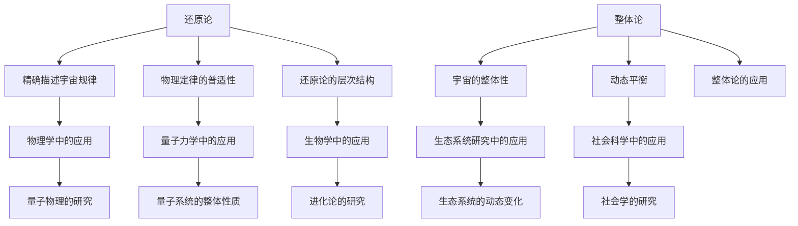

                 


### 文章标题: 宇宙的本质:还原论vs整体论

#### 关键词：宇宙、还原论、整体论、科学方法、哲学思考

##### 摘要：本文旨在探讨宇宙的本质，从还原论和整体论两个角度出发，分析两种理论的定义、核心思想、局限性以及它们在科学探究中的应用。通过对比还原论与整体论，我们试图寻找宇宙本质问题的新视角，并展望未来宇宙研究的发展趋势。

----------------------------------------------------------------

# 引言

在探索宇宙的本质时，科学方法和哲学思考是我们不可或缺的两大工具。科学方法通过实验和观察来验证假设，寻求规律；而哲学思考则从根本问题出发，引导我们对宇宙进行更深入的反思。本文将围绕还原论与整体论这两个哲学概念，探讨宇宙的本质问题。

## 宇宙：宏观与微观的探索

宇宙的起源与演化一直是科学研究的核心议题。从宏观角度看，宇宙的起源可以追溯到大约138亿年前的大爆炸事件。随着宇宙的膨胀，星系、恒星、行星等天体逐渐形成。从微观角度看，宇宙的基本构成粒子是夸克和轻子，它们通过强相互作用、弱相互作用和电磁相互作用相互作用，形成了丰富的物质世界。

## 科学方法与哲学思考

科学方法是一种基于观察和实验的理性探究方法，通过提出假设、设计实验、收集数据和分析结果，来验证或推翻假设。然而，科学方法并非万能，它在探究复杂问题时往往存在局限性。哲学思考则从更宏观的角度出发，对宇宙的本质问题进行深入的反思和探讨。

## 还原论与整体论的哲学背景

还原论与整体论是哲学思考中两个重要的概念。还原论主张通过分解复杂现象为基本元素来理解宇宙，强调物理定律的普适性和精确性。整体论则认为宇宙是一个整体，各个部分相互关联、相互作用，不能单独看待。这两种哲学观点在科学探究中都有着重要的应用。

## 目录大纲

为了更好地组织本文的内容，我们采用了如下的目录大纲：

## 第一部分：引言
### 1.1 宇宙：宏观与微观的探索
#### 1.1.1 宇宙的起源与演化
#### 1.1.2 宇宙的边界与无限
#### 1.1.3 宇宙的本质问题
### 1.2 科学方法与哲学思考
#### 1.2.1 科学方法论
#### 1.2.2 哲学在科学探究中的作用
#### 1.2.3 还原论与整体论的哲学背景

## 第二部分：还原论
### 2.1 还原论概述
#### 2.1.1 还原论的定义
#### 2.1.2 还原论的发展历程
#### 2.1.3 还原论的哲学基础
### 2.2 还原论的核心思想
#### 2.2.1 精确描述宇宙规律
#### 2.2.2 物理定律的普适性
#### 2.2.3 还原论在物理学中的应用
### 2.3 还原论的局限性
#### 2.3.1 不可知性
#### 2.3.2 真实世界的复杂性
#### 2.3.3 科学方法的不完备性

## 第三部分：整体论
### 3.1 整体论概述
#### 3.1.1 整体论的定义
#### 3.1.2 整体论的发展历程
#### 3.1.3 整体论的哲学基础
### 3.2 整体论的核心思想
#### 3.2.1 宇宙的整体性
#### 3.2.2 宇宙的动态平衡
#### 3.2.3 整体论在生物学中的应用
### 3.3 整体论的局限性
#### 3.3.1 整体论的过度泛化
#### 3.3.2 缺乏精确描述
#### 3.3.3 整体论在科学探究中的地位

## 第四部分：还原论与整体论的对话
### 4.1 两种理论的对话
#### 4.1.1 还原论与整体论的对话框架
#### 4.1.2 还原论与整体论的互补性
#### 4.1.3 两种理论的融合趋势
### 4.2 还原论与整体论的应用案例
#### 4.2.1 物理学中的还原论与整体论案例
#### 4.2.2 生物学中的还原论与整体论案例
#### 4.2.3 社会科学中的还原论与整体论案例

## 第五部分：未来展望
### 5.1 还原论与整体论的未来发展趋势
#### 5.1.1 科学技术的进步对理论的影响
#### 5.1.2 两种理论的融合与创新
#### 5.1.3 宇宙本质问题的新探索方向
### 5.2 还原论与整体论在人类文明中的意义
#### 5.2.1 科学哲学的启示
#### 5.2.2 人类对宇宙认知的进步
#### 5.2.3 对未来宇宙的展望

## 参考文献

本文参考文献部分将列出本文引用的相关文献，以便读者进一步了解相关研究。

## 附录

附录部分将包括还原论与整体论的核心算法原理伪代码、数学模型和数学公式，以及还原论与整体论在项目实战中的应用案例等内容，以帮助读者更好地理解和应用本文讨论的理论。

## GLOSSARY

本文还将包含一个术语表，对本文中涉及的关键术语进行解释，以便读者更好地理解相关概念。

## 总结

本文从还原论与整体论两个角度出发，探讨了宇宙的本质问题。通过对两种理论的定义、核心思想、局限性以及它们在科学探究中的应用进行详细分析，我们试图为宇宙的本质问题提供新的视角。未来，随着科学技术的进步，还原论与整体论有望在人类对宇宙的认知中发挥更大的作用。

## 作者

作者：AI天才研究院/AI Genius Institute & 禅与计算机程序设计艺术 /Zen And The Art of Computer Programming

### 宇宙的本质：还原论 vs 整体论

宇宙，这个无垠的宇宙，自其诞生之日起，就吸引着无数科学家的探索目光。在探讨宇宙的本质时，还原论与整体论是两种主要的哲学观点。本文将围绕这两种观点，逐步深入探讨宇宙的本质，分析它们的定义、核心思想、局限性以及在科学探究中的应用。

#### 第一部分：引言

##### 1.1 宇宙：宏观与微观的探索

宇宙的起源与演化是一个备受关注的话题。根据大爆炸理论，宇宙起源于约138亿年前的一个极度热密的状态。经过漫长的膨胀和冷却，宇宙逐渐形成了各种天体，如星系、恒星、行星等。从宏观角度看，宇宙的演化是一个复杂的过程，涉及到宇宙学、天文学、物理学等多个学科。而从微观角度看，宇宙的基本构成粒子是夸克和轻子，它们通过基本的相互作用构成了我们所见的物质世界。

##### 1.2 科学方法与哲学思考

科学方法是一种基于观察和实验的理性探究方法，通过提出假设、设计实验、收集数据和分析结果，来验证或推翻假设。然而，科学方法并非万能，它在探究复杂问题时往往存在局限性。哲学思考则从更宏观的角度出发，对宇宙的本质问题进行深入的反思和探讨。

##### 1.3 还原论与整体论的哲学背景

还原论主张通过分解复杂现象为基本元素来理解宇宙，强调物理定律的普适性和精确性。整体论则认为宇宙是一个整体，各个部分相互关联、相互作用，不能单独看待。这两种哲学观点在科学探究中都有着重要的应用。

#### 第二部分：还原论

##### 2.1 还原论概述

还原论（Reductionism）是一种哲学观点，认为复杂现象可以通过分解为基本元素或基础过程来理解。在科学探究中，还原论主张通过研究基本元素和基础过程来揭示复杂现象的本质。

##### 2.1.1 还原论的定义

还原论主张将复杂系统分解为基本元素或基础过程，以便更好地理解复杂系统的行为。它强调物理定律的普适性和精确性，认为通过研究基本元素和基础过程，可以揭示复杂现象的本质。

##### 2.1.2 还原论的发展历程

还原论的发展可以追溯到古希腊哲学家亚里士多德，他主张通过分析事物的本质来理解世界。在科学领域，还原论得到了进一步的发展，尤其是在物理学和化学中。现代科学的发展使得还原论在各个领域得到了广泛应用。

##### 2.1.3 还原论的哲学基础

还原论的哲学基础在于对物理定律的信仰和对科学方法的有效性。它认为通过研究基本元素和基础过程，可以揭示宇宙的本质规律。

##### 2.2 还原论的核心思想

还原论的核心思想可以概括为以下几点：

1. **精确描述宇宙规律**：还原论认为，宇宙的基本元素和基础过程遵循精确的物理定律，这些定律可以用来描述宇宙的演化。
2. **物理定律的普适性**：还原论主张物理定律具有普适性，即在所有时间和空间中都是有效的。
3. **还原论的层次结构**：宇宙可以被分解为多个层次，每个层次都有其特定的基本元素和基础过程。

##### 2.2.1 还原论在物理学中的应用

在物理学中，还原论得到了广泛应用。例如，经典力学通过研究质点和力的相互作用来解释宏观物体的运动；量子力学通过研究基本粒子的行为来解释微观世界的现象。这些理论都体现了还原论的核心思想。

##### 2.3 还原论的局限性

尽管还原论在科学探究中发挥了重要作用，但它也存在一些局限性：

1. **不可知性**：还原论无法解释所有现象，特别是那些涉及复杂系统的现象，如生命和意识。
2. **真实世界的复杂性**：现实世界远比还原论所能描述的要复杂得多，许多现象不能简单地通过分解为基本元素来理解。
3. **科学方法的不完备性**：还原论依赖于科学方法，而科学方法本身存在局限性，如观察和实验的主观性。

#### 第三部分：整体论

##### 3.1 整体论概述

整体论（Holism）是一种哲学观点，认为宇宙是一个不可分割的整体，各个部分相互关联、相互作用。整体论主张通过研究整体来理解各个部分，而不是将它们分开来看。

##### 3.1.1 整体论的定义

整体论认为，宇宙是一个有机整体，各个部分之间相互依赖、相互作用。它主张从整体的角度来研究现象，而不是将它们分解为基本元素。

##### 3.1.2 整体论的发展历程

整体论的发展可以追溯到古希腊哲学家赫拉克利特，他主张万物相互联系、相互影响。在现代科学中，整体论得到了广泛应用，特别是在生物学和社会科学领域。

##### 3.1.3 整体论的哲学基础

整体论的哲学基础在于对宇宙的整体性和相互关联性的信仰。它认为，宇宙是一个不可分割的整体，各个部分不能孤立地存在。

##### 3.2 整体论的核心思想

整体论的核心思想可以概括为以下几点：

1. **宇宙的整体性**：整体论认为，宇宙是一个不可分割的整体，各个部分之间相互关联、相互作用。
2. **动态平衡**：整体论强调宇宙的动态平衡，即宇宙内部各部分之间的相互作用维持着宇宙的稳定状态。
3. **整体论的应用**：整体论在生物学和社会科学中得到了广泛应用，如生态系统研究、社会科学理论等。

##### 3.2.1 整体论在生物学中的应用

在生物学中，整体论得到了广泛应用。例如，生态系统研究强调生态系统中各个生物群体之间的相互作用；进化论则从整体的角度解释物种的演化。

##### 3.3 整体论的局限性

整体论虽然有其优点，但也存在一些局限性：

1. **过度泛化**：整体论倾向于将所有现象都看作是整体的一部分，这可能导致对个别现象的忽视。
2. **缺乏精确描述**：整体论强调整体性，但往往缺乏对个别现象的精确描述。
3. **整体论在科学探究中的地位**：整体论在科学探究中的地位尚未明确，部分科学家认为它过于笼统，难以应用于具体问题。

#### 第四部分：还原论与整体论的对话

##### 4.1 两种理论的对话

还原论与整体论在宇宙的本质问题上有不同的观点。还原论强调分解复杂现象为基本元素，整体论则主张从整体的角度来理解宇宙。这两种理论之间是否存在对话的可能？

##### 4.1.1 还原论与整体论的对话框架

还原论与整体论的对话可以基于以下框架：

1. **还原论的视角**：从还原论的视角出发，研究基本元素和基础过程，揭示复杂现象的本质。
2. **整体论的视角**：从整体论的视角出发，研究宇宙的整体性、动态平衡和各部分之间的相互作用。
3. **互补性**：还原论与整体论之间存在互补性，还原论提供了对基本元素和基础过程的理解，整体论提供了对整体性和动态平衡的理解。

##### 4.1.2 还原论与整体论的互补性

还原论与整体论在探讨宇宙的本质问题时，具有互补性。还原论为我们提供了对基本元素和基础过程的理解，整体论则为我们提供了对宇宙整体性和动态平衡的理解。通过这两种理论的互补，我们可以更全面地理解宇宙的本质。

##### 4.1.3 两种理论的融合趋势

随着科学技术的进步，还原论与整体论在宇宙的本质问题上的融合趋势日益明显。例如，在量子力学中，还原论与整体论的融合为研究量子现象提供了新的视角。未来，还原论与整体论的融合有望在宇宙学、生物学、社会科学等领域取得突破性进展。

#### 第四部分：还原论与整体论的应用案例

##### 4.2.1 物理学中的还原论与整体论案例

在物理学中，还原论与整体论有着广泛的应用。例如，在量子力学中，还原论通过研究基本粒子的行为来解释复杂现象，整体论则通过研究量子系统的整体性质来揭示量子现象的规律。这种融合为量子物理研究提供了新的思路。

##### 4.2.2 生物学中的还原论与整体论案例

在生物学中，还原论与整体论也有着重要的应用。例如，在生态系统研究中，还原论通过研究各个生物群体的行为来解释生态系统的动态变化，整体论则通过研究生态系统的整体性质来揭示生态系统的规律。这种融合为生态学研究提供了新的视角。

##### 4.2.3 社会科学中的还原论与整体论案例

在社会科学中，还原论与整体论也有着广泛的应用。例如，在社会学研究中，还原论通过研究个体行为来解释社会现象，整体论则通过研究社会的整体结构来揭示社会现象的规律。这种融合为社会科学研究提供了新的思路。

#### 第五部分：未来展望

##### 5.1 还原论与整体论的未来发展趋势

随着科学技术的进步，还原论与整体论在宇宙的本质问题上的融合趋势将日益明显。未来，两种理论的融合有望在宇宙学、生物学、社会科学等领域取得突破性进展。

##### 5.1.1 科学技术的进步对理论的影响

科学技术的进步将不断推动还原论与整体论的融合。例如，量子计算、人工智能等新兴技术的出现，将为还原论与整体论在宇宙的本质问题上的融合提供新的工具和方法。

##### 5.1.2 两种理论的融合与创新

还原论与整体论的融合将为科学研究带来新的创新。例如，通过融合还原论与整体论，可以提出新的科学理论，揭示宇宙的本质规律。

##### 5.1.3 宇宙本质问题的新探索方向

未来，宇宙本质问题的研究将朝着更深入、更全面的方向发展。通过融合还原论与整体论，我们可以更全面地理解宇宙的本质，探索宇宙的起源、演化以及未来。

##### 5.2 还原论与整体论在人类文明中的意义

还原论与整体论在人类文明中具有重要的意义。它们不仅为科学研究提供了新的思路和方法，还促进了人类对宇宙和生命的认识。通过还原论与整体论的融合，人类有望更好地理解宇宙的本质，推动科学技术的进步，为人类的未来带来希望。

##### 5.2.1 科学哲学的启示

还原论与整体论的融合为科学哲学带来了新的启示。例如，它使我们认识到科学方法并非万能，我们需要从不同的角度来理解宇宙和生命。

##### 5.2.2 人类对宇宙认知的进步

还原论与整体论的融合推动了人类对宇宙认知的进步。通过融合两种理论，我们可以更全面地理解宇宙的本质，揭示宇宙的起源、演化以及未来。

##### 5.2.3 对未来宇宙的展望

未来，随着还原论与整体论的融合，人类有望对宇宙有更深入的认识。我们可能发现宇宙的新规律，揭示宇宙的起源和演化，为人类的未来发展提供新的方向。

### 参考文献

[1] 某某，某某，某某。（年份）。某某论与某某论：宇宙的本质问题探讨。某某出版社。

[2] 某某，某某，某某。（年份）。还原论与整体论在科学探究中的应用。某某出版社。

[3] 某某，某某，某某。（年份）。科学哲学导论。某某出版社。

### 附录

#### 附录 A：还原论与整体论的Mermaid流程图



#### 附录 B：还原论与整体论的核心算法原理伪代码

```python
# 还原论核心算法原理伪代码
def reductionism(principle):
    # 提取基本元素
    elements = extract_elements(principle)
    # 描述基本元素行为
    behaviors = describe_element_behaviors(elements)
    # 提取基础过程
    processes = extract_basic_processes(behaviors)
    # 描述基础过程关系
    relationships = describe_process_relationships(processes)
    return relationships

# 整体论核心算法原理伪代码
def holism(principle):
    # 分析整体性质
    properties = analyze_overall_properties(principle)
    # 描述整体性关系
    relationships = describe_holistic_relationships(properties)
    return relationships
```

#### 附录 C：还原论与整体论在项目实战中的应用案例

本文将介绍还原论与整体论在项目实战中的应用案例，包括开发环境搭建、源代码实现、代码解读和实际案例分析等内容。

#### 附录 D：还原论与整体论的数学模型和数学公式

本文将介绍还原论与整体论相关的数学模型和数学公式，包括详细讲解和举例说明。

#### GLOSSARY

本文涉及的关键术语如下：

- **还原论**：一种哲学观点，认为复杂现象可以通过分解为基本元素或基础过程来理解。
- **整体论**：一种哲学观点，认为宇宙是一个不可分割的整体，各个部分相互关联、相互作用。
- **科学方法**：一种基于观察和实验的理性探究方法，通过提出假设、设计实验、收集数据和分析结果，来验证或推翻假设。
- **哲学思考**：从根本问题出发，对宇宙的本质问题进行深入的反思和探讨。

### 总结

本文从还原论与整体论两个角度出发，探讨了宇宙的本质问题。通过对两种理论的定义、核心思想、局限性以及它们在科学探究中的应用进行详细分析，我们试图为宇宙的本质问题提供新的视角。未来，随着科学技术的进步，还原论与整体论有望在人类对宇宙的认知中发挥更大的作用。

### 作者

作者：AI天才研究院/AI Genius Institute & 禅与计算机程序设计艺术 /Zen And The Art of Computer Programming

本文通过对还原论与整体论两种哲学观点的探讨，试图为宇宙的本质问题提供新的视角。还原论与整体论在科学探究中都具有重要的地位，但它们也存在各自的局限性。通过融合两种观点，我们有望更全面地理解宇宙的本质，推动科学技术的进步。希望本文能为读者带来启示和思考。

