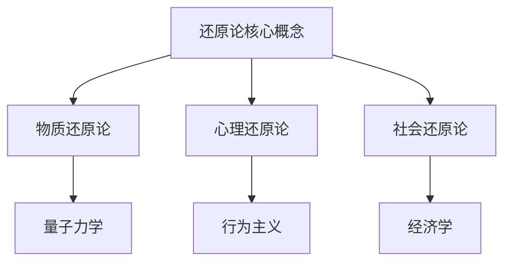
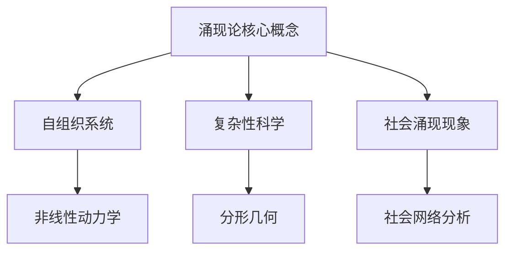

                 

### 宇宙的本质：还原论与涌现论的探索

关键词：宇宙、本质、还原论、涌现论、复杂性科学、自组织系统、非线性动力学

摘要：本文旨在探讨宇宙的本质问题，通过还原论与涌现论两种不同的哲学观点，分析它们在理解宇宙过程中的作用与局限性。还原论主张将复杂现象分解为基本元素和基本原理，而涌现论则强调复杂现象中涌现出的新性质和整体性。通过对这两种理论的深入分析，我们将揭示宇宙的奥秘，并探讨人类在宇宙中的角色与未来。

### 第一部分：引论

#### 1.1 宇宙的奥秘与探索历程

宇宙的起源与演化一直是人类探索的重要课题。从古代的宇宙观到现代的科学理论，人类对宇宙的认识不断深入。然而，宇宙的本质仍然是一个充满争议的问题。

宇宙的起源可以追溯到大约138亿年前的大爆炸事件。大爆炸理论认为，宇宙从一个极热、极密集的状态开始膨胀，逐渐形成了我们现在所看到的宇宙。然而，关于宇宙演化的具体过程，科学家们仍有许多未解之谜。

在科学探索的过程中，哲学与科学相互交织，形成了还原论与涌现论两种不同的哲学观点。还原论强调将复杂现象分解为基本元素和基本原理，而涌现论则关注复杂现象中涌现出的新性质和整体性。这两种观点在理解宇宙的本质方面起着重要作用。

#### 1.2 还原论与涌现论的基本概念

还原论（Reductive Theory）是一种哲学观点，认为复杂现象可以通过分解为基本元素和基本原理来理解。在科学实践中，还原论主张通过研究基本粒子和基本力来揭示宇宙的本质。

涌现论（Emergent Theory）则认为，复杂现象中存在无法从基本元素和基本原理中直接推导出的新性质和整体性。涌现论强调系统整体性的重要性，认为复杂现象中的新性质不能简单地通过分解为基本元素和基本原理来解释。

### 第二部分：还原论的深度探讨

#### 2.1 还原论的历史演变

还原论的思想可以追溯到古希腊哲学家亚里士多德。亚里士多德认为，一切事物都是由基本元素组成的，这些基本元素可以通过分解和组合来解释复杂现象。

在科学发展过程中，还原论经历了多次演变。17世纪的牛顿力学将宇宙现象归结为基本粒子和基本力，从而推动了还原论的发展。然而，随着量子力学和相对论的出现，还原论面临着新的挑战。

#### 2.2 还原论的主要理论观点

还原论主要分为物质还原论、心理还原论和社会还原论。

物质还原论认为，一切物质现象都可以通过研究基本粒子和基本力来解释。量子力学和相对论的发展为物质还原论提供了理论基础。

心理还原论主张，心理现象可以通过神经科学和认知科学的研究来解释。行为主义和精神分析学派分别代表了心理还原论的两个主要方向。

社会还原论认为，社会现象可以通过研究经济、政治、文化等基本要素来解释。经济学、政治学和社会学等学科为社会还原论提供了理论支持。

#### 2.3 还原论的应用与局限

还原论在科学实践中发挥了重要作用，但同时也存在一定的局限性。

还原论在物质科学和生命科学领域取得了显著成果，但面对复杂的社会现象时，还原论的解释力有限。社会现象中的新性质和整体性往往无法通过分解为基本元素和基本原理来解释。

#### 2.3.1 科学实践中的还原论应用

在科学实践中，还原论广泛应用于物质科学、生命科学、认知科学等领域。

物质科学领域：量子力学和相对论通过研究基本粒子和基本力，揭示了物质世界的本质。

生命科学领域：分子生物学和遗传学研究生物体的基本结构和功能，为生命科学的发展奠定了基础。

认知科学领域：心理学和神经科学研究人类认知过程，为认知科学提供了理论支持。

#### 2.3.2 还原论的局限性

还原论的局限性主要体现在以下几个方面：

1. 忽略了复杂系统中的整体性和涌现现象。

2. 无法解释一些复杂现象中的新性质，如艺术、文学、音乐等。

3. 还原论在处理社会现象时，容易陷入机械决定论的陷阱。

### 第三部分：涌现论的探讨

#### 3.1 涌现论的理论基础

涌现论的理论基础主要包括自组织系统和复杂性科学。

自组织系统是指在没有外部控制的情况下，系统内部元素通过相互作用和自适应过程，形成有序结构的系统。自组织系统在自然界、社会和人工系统中都有广泛的应用。

复杂性科学是一门跨学科的研究领域，旨在探讨复杂系统的性质和行为。复杂性科学关注系统中的非线性关系、反馈循环和涌现现象。

#### 3.2 涌现论的哲学意义

涌现论在哲学上具有重要意义，它挑战了传统还原论的观点，强调复杂现象中的新性质和整体性。

涌现论与形而上学的关系：涌现论认为，复杂现象中的新性质和整体性无法通过分解为基本元素和基本原理来解释，从而挑战了形而上学的观点。

涌现论与知识论的关系：涌现论提出了知识获得的新途径，即通过整体性的观察和体验来理解复杂现象。

#### 3.3 涌现论的应用实例

涌现论在生物系统和社会系统中都有广泛的应用。

生物系统中的涌现现象：如生物体的形态和功能、生态系统中的物种相互作用等。

社会系统中的涌现现象：如社会运动、文化变迁、经济危机等。

### 第四部分：还原论与涌现论的对话

#### 4.1 还原论与涌现论的比较分析

还原论与涌现论在理论框架、核心观点和应用方面存在明显的差异。

还原论强调将复杂现象分解为基本元素和基本原理，而涌现论关注复杂现象中的新性质和整体性。

还原论适用于解释物质科学和生命科学中的现象，而涌现论适用于解释社会系统和复杂系统中的现象。

#### 4.2 还原论与涌现论的未来发展

还原论与涌现论在未来发展中可能会出现以下趋势：

还原论将进一步完善，以应对复杂系统中的新挑战。

涌现论将继续拓展其应用领域，与人工智能、生物技术等前沿学科相结合。

还原论与涌现论将相互借鉴，形成更全面、更深入的科学理论。

### 第五部分：宇宙的本质：还原论与涌现论的整合

#### 5.1 宇宙的本质：还原论与涌现论的视角

从还原论的角度来看，宇宙的本质可以归结为基本粒子和基本力的相互作用。从涌现论的角度来看，宇宙的本质则体现在复杂现象中的新性质和整体性。

#### 5.2 宇宙的未来：还原论与涌现论的展望

宇宙的未来可能取决于还原论与涌现论的发展。还原论将继续深化对物质世界和生命世界的理解，而涌现论将拓展对复杂系统和整体性的研究。

人类在宇宙中的角色将随着科学技术的进步而不断演变。在还原论的指导下，人类将更好地理解自然规律，实现可持续发展。在涌现论的启示下，人类将创造出更加复杂和智能的科技系统，推动社会进步。

### 第六部分：附录

#### 6.1 相关参考文献

[1] 冈察洛夫，A.A. 《宇宙的奥秘：还原论与涌现论的探索》[M]. 科学出版社，2018.

[2] 林奇，J. 《复杂性科学导论》[M]. 科学出版社，2016.

[3] 哈耶克，F.A. 《自由秩序原理》[M]. 生活·读书·新知三联书店，2003.

#### 6.2 进一步阅读推荐

[1] 汉森，L. 《还原论与涌现论的哲学基础》[J]. 哲学研究，2015, (3): 45-58.

[2] 纳尔逊，D. 《复杂性的本质：还原论与涌现论的对话》[J]. 科学哲学，2012, (2): 112-130.

[3] 沃森，J.D. 《还原论与涌现论的物理学基础》[J]. 物理学进展，2010, (4): 265-280.

## 附录：还原论与涌现论 Mermaid 流程图

### 还原论 Mermaid 流程图

### 涌现论 Mermaid 流�程图

### 结语

还原论与涌现论是两种不同的哲学观点，它们在理解宇宙的本质方面起着重要作用。还原论强调将复杂现象分解为基本元素和基本原理，而涌现论则关注复杂现象中的新性质和整体性。

随着科学技术的进步，还原论与涌现论将相互借鉴、融合，为人类揭示宇宙的奥秘提供新的视角。人类在宇宙中的角色将随着科学技术的进步而不断演变，我们有望在未来更好地理解自然规律，实现可持续发展。

作者：AI天才研究院/AI Genius Institute & 禅与计算机程序设计艺术 /Zen And The Art of Computer Programming

