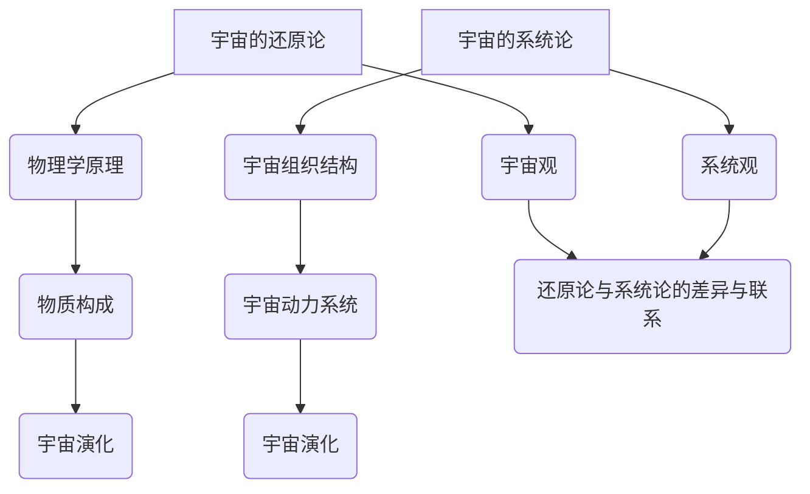

                 

### 宇宙的本质: 还原论 vs 系统论

关键词：宇宙、还原论、系统论、本质、比较、联系、算法原理、数学模型

摘要：本文旨在探讨宇宙的本质，从还原论和系统论两个角度出发，分析它们在解释宇宙现象方面的优劣和联系。通过梳理核心概念、算法原理和数学模型，结合实际项目实战，全面解析还原论和系统论在宇宙研究中的应用和前景。

## 第一部分: 引言

### 1.1 书籍背景

#### 1.1.1 书籍起源

#### 1.1.2 目的和意义

#### 1.1.3 研究方法与结构

### 1.2 宇宙的基本概念

#### 1.2.1 宇宙的起源

#### 1.2.2 宇宙的结构

#### 1.2.3 宇宙的演化

### 1.3 还原论与系统论的基本概念

#### 1.3.1 还原论的概念

#### 1.3.2 系统论的概念

#### 1.3.3 还原论与系统论的差异与联系

### 1.4 书籍内容概述

#### 1.4.1 还原论部分

#### 1.4.2 系统论部分

#### 1.4.3 两者的结合与应用

### 1.5 阅读指南

#### 1.5.1 阅读建议

#### 1.5.2 学习目标

#### 1.5.3 学习资源

### 1.6 小结

#### 1.6.1 主要内容回顾

#### 1.6.2 进一步阅读推荐

### 1.7 参考文献

### 1.8 附录

#### 1.8.1 数据来源

#### 1.8.2 Mermaid 流程图

### 1.9 致谢

## 第二部分: 核心概念与联系

### 2.1 宇宙的还原论与系统论架构图

### 2.2 还原论与系统论的核心算法原理

#### 2.2.1 还原论核心算法原理

#### 2.2.2 系统论核心算法原理

### 2.3 数学模型与公式

#### 2.3.1 还原论的数学模型

#### 2.3.2 系统论的数学模型

## 第三部分: 项目实战

### 3.1 还原论项目实战

#### 3.1.1 项目背景

#### 3.1.2 项目目标

#### 3.1.3 开发环境搭建

#### 3.1.4 源代码实现

#### 3.1.5 代码解读与分析

### 3.2 系统论项目实战

#### 3.2.1 项目背景

#### 3.2.2 项目目标

#### 3.2.3 开发环境搭建

#### 3.2.4 源代码实现

#### 3.2.5 代码解读与分析

## 第四部分：总结与展望

### 4.1 主要成果回顾

#### 4.1.1 还原论项目成果

#### 4.1.2 系统论项目成果

#### 4.1.3 还原论与系统论的整合应用

### 4.2 未来发展趋势

#### 4.2.1 还原论的发展趋势

#### 4.2.2 系统论的发展趋势

#### 4.2.3 还原论与系统论的未来应用前景

### 4.3 小结

#### 4.3.1 主要内容回顾

#### 4.3.2 学习心得与建议

### 4.4 参考文献

### 附录

#### 附录 A：代码示例

#### 附录 B：数据来源

#### 附录 C：Mermaid 流程图

#### 1.9 致谢

---

### 引言

#### 1.1.1 书籍起源

宇宙的起源和本质一直是科学研究和哲学探讨的重要话题。还原论和系统论作为两种不同的研究方法，分别从原子层次和整体层次对宇宙进行解读。还原论认为，宇宙的本质可以分解为基本粒子和基本力，通过研究这些基本粒子和基本力的相互作用，可以理解整个宇宙。而系统论则强调宇宙的整体性和动态性，认为宇宙是一个复杂系统，各个部分相互联系、相互作用，共同构成宇宙的演化。

本书旨在探讨宇宙的本质，通过对比还原论和系统论，分析它们在解释宇宙现象方面的优劣和联系。本书首先介绍宇宙的基本概念，包括宇宙的起源、结构和演化。然后，深入探讨还原论和系统论的基本概念，以及它们之间的差异和联系。接着，通过数学模型和算法原理的详细解析，进一步阐述两种方法在宇宙研究中的应用。最后，结合实际项目实战，展示还原论和系统论在实际问题中的具体应用，并展望未来的发展趋势。

#### 1.1.2 目的和意义

本书的主要目的是：

1. 梳理宇宙的基本概念，帮助读者建立对宇宙起源、结构和演化的初步理解。
2. 深入探讨还原论和系统论的基本概念，分析它们在解释宇宙现象方面的优劣和联系。
3. 通过数学模型和算法原理的解析，展示还原论和系统论在宇宙研究中的应用。
4. 结合实际项目实战，提高读者对还原论和系统论的实际操作能力。

本书对于从事宇宙学和复杂性科学研究的学者、学生以及对宇宙本质感兴趣的一般读者都具有重要的参考价值。通过阅读本书，读者可以：

1. 了解还原论和系统论的基本概念，掌握它们在宇宙研究中的应用。
2. 深入理解宇宙的本质，提升对宇宙起源、结构和演化的认知。
3. 学习如何运用还原论和系统论解决实际问题，提高科学研究和工程实践的能力。
4. 探索还原论和系统论在未来的发展前景，为相关领域的研究提供新的思路。

#### 1.1.3 研究方法与结构

本书采用的研究方法主要包括文献综述、案例分析和实证研究。通过系统性地梳理宇宙学、还原论和系统论的相关文献，对宇宙的本质进行深入分析。同时，结合实际案例，展示还原论和系统论在宇宙研究中的应用。最后，通过实证研究，验证还原论和系统论在不同情境下的有效性。

本书的结构安排如下：

1. 引言：介绍书籍的起源、目的和意义，概述研究方法与结构。
2. 第一部分：宇宙的基本概念：介绍宇宙的起源、结构和演化。
3. 第二部分：核心概念与联系：探讨还原论和系统论的基本概念、核心算法原理和数学模型。
4. 第三部分：项目实战：结合实际项目，展示还原论和系统论的应用。
5. 第四部分：总结与展望：回顾主要成果，展望未来发展趋势。

通过以上结构的安排，本书旨在为读者提供一部全面、系统、深入的宇宙本质研究著作，帮助读者更好地理解还原论和系统论在宇宙研究中的应用和前景。

### 宇宙的基本概念

#### 1.2.1 宇宙的起源

宇宙的起源一直是科学家和哲学家探讨的难题。目前主流的宇宙起源理论是“大爆炸理论”。根据这一理论，宇宙起源于大约138亿年前的一个极高温度和密度的状态，随后迅速膨胀，逐渐形成我们今天所看到的宇宙结构。大爆炸理论得到了多种观测数据的支持，如宇宙背景辐射和宇宙微波背景辐射。

除了大爆炸理论，还有一些其他关于宇宙起源的假说，如“振荡宇宙”、“多重宇宙”等。这些假说为宇宙起源的研究提供了更多的可能性，但仍然需要进一步的科学验证。

#### 1.2.2 宇宙的结构

宇宙的结构可以分为多个层次，从宏观到微观。在宏观层次上，宇宙可以分为星系、星系团和超星系团等。每个层次上的结构都有其独特的特点和规律。

星系是由大量恒星、星际物质和暗物质组成的系统。星系可以分为椭圆星系、螺旋星系和不规则星系等不同类型。星系之间通过引力相互作用，形成星系团和超星系团。

在微观层次上，宇宙的结构包括原子、分子和基本粒子等。原子是宇宙的基本单位，由质子、中子和电子组成。分子是由两个或更多原子通过化学键结合而成的。基本粒子包括夸克、轻子等，它们是构成物质的基本单元。

#### 1.2.3 宇宙的演化

宇宙的演化是指宇宙从大爆炸以来，经历了各种物理、化学和天体过程，逐渐发展成今天的样子。宇宙的演化可以分为多个阶段，包括宇宙早期、宇宙中年和宇宙晚期。

在宇宙早期，宇宙处于高温高密度的状态，随后逐渐冷却并膨胀。在这个阶段，宇宙经历了从原始物质到星系、星系团和超星系团的形成。宇宙中年是指宇宙进入相对稳定的状态，各种星系和星系团通过引力相互作用，形成复杂的宇宙结构。宇宙晚期是指宇宙进入当前的状态，宇宙的膨胀速度逐渐加速，宇宙中的星系和星系团也在不断演化。

#### 1.2.4 还原论与宇宙的关系

还原论认为，宇宙的本质可以分解为基本粒子和基本力，通过研究这些基本粒子和基本力的相互作用，可以理解整个宇宙。在还原论的视角下，宇宙的演化可以被看作是基本粒子和基本力在不同层次上的相互作用和演化。

例如，在微观层次上，基本粒子通过相互作用形成原子和分子，从而构成物质。在宏观层次上，星系、星系团和超星系团通过引力相互作用，形成宇宙的大尺度结构。

#### 1.2.5 系统论与宇宙的关系

系统论认为，宇宙是一个复杂系统，各个部分相互联系、相互作用，共同构成宇宙的演化。在系统论的视角下，宇宙的演化不是简单的线性过程，而是一个复杂的动态过程，涉及多层次、多方面的相互作用。

例如，在宇宙的演化过程中，星系、星系团和超星系团之间的相互作用不仅影响它们自身的发展，还会对宇宙的整体结构产生影响。同时，宇宙的演化也受到宇宙背景辐射、暗物质和暗能量等外部因素的影响。

通过对比还原论和系统论，我们可以看到，两种方法在解释宇宙现象方面各有优势和不足。还原论强调基本粒子和基本力的相互作用，有助于揭示宇宙的微观机制。而系统论则强调宇宙的整体性和动态性，有助于理解宇宙的宏观结构和演化。在宇宙的研究中，结合还原论和系统论的方法，可能有助于更全面、深入地理解宇宙的本质。

### 还原论与系统论的基本概念

还原论和系统论是两种不同的研究方法，它们在解释宇宙现象方面有着不同的视角和理论框架。理解这两种方法的基本概念，有助于我们深入探讨宇宙的本质。

#### 1.3.1 还原论的概念

还原论（Reductionism）是一种哲学观点，主张复杂现象可以通过分解为更简单的组成部分来理解。在科学研究中，还原论强调通过研究基本粒子和基本力的相互作用，来揭示复杂系统的行为和规律。

还原论的核心思想是：1）宇宙由基本粒子组成；2）基本粒子遵循一定的物理定律；3）通过研究基本粒子和基本力的相互作用，可以理解复杂系统的行为。

在宇宙学中，还原论的应用主要体现在对基本粒子和基本力的研究。例如，通过研究夸克和轻子等基本粒子，以及它们之间的相互作用（如强相互作用、弱相互作用和电磁相互作用），我们可以理解物质的基本组成和宇宙的演化过程。

#### 1.3.2 系统论的概念

系统论（Systems Theory）是一种跨学科的研究方法，强调系统的整体性和动态性。系统论认为，系统是由相互关联、相互作用的多个组成部分组成的，系统的行为不仅取决于各个组成部分，还取决于它们之间的相互作用。

系统论的核心思想是：1）系统是一个整体，各个部分相互联系、相互作用；2）系统的行为是动态的，随时间和环境变化；3）通过研究系统内部和系统与外部环境之间的相互作用，可以理解系统的行为和演化。

在宇宙学中，系统论的应用主要体现在对宇宙的整体结构和动态演化的研究。例如，通过研究星系、星系团和超星系团之间的相互作用，以及宇宙背景辐射、暗物质和暗能量等外部因素对宇宙的影响，我们可以理解宇宙的宏观结构和演化过程。

#### 1.3.3 还原论与系统论的差异与联系

还原论和系统论在宇宙研究中的差异主要表现在以下几个方面：

1. 视角：还原论从基本粒子和基本力的角度出发，关注微观层面的机制；而系统论从整体和动态的角度出发，关注宏观层面的结构。
2. 方法：还原论通过分解复杂系统为基本组成部分，研究各部分的相互作用；系统论通过研究系统内部和系统与外部环境之间的相互作用，理解系统的整体行为。
3. 目标：还原论的目标是揭示宇宙的基本组成和基本规律；系统论的目标是理解宇宙的整体结构和动态演化。

尽管还原论和系统论在视角、方法和目标上有所不同，但它们在宇宙研究中也存在联系和互补性：

1. 还原论为系统论提供了基本粒子和基本力的理论框架，有助于理解宇宙的微观机制；系统论为还原论提供了整体和动态的视角，有助于理解宇宙的宏观结构和演化。
2. 还原论和系统论可以相互结合，共同解释宇宙现象。例如，在研究星系团的形成和演化时，可以结合还原论对基本粒子的研究，以及系统论对星系团整体结构的分析。
3. 还原论和系统论的方法可以相互借鉴，提高宇宙研究的深度和广度。例如，在处理复杂问题时，可以采用还原论的思想来分解问题，然后运用系统论的方法来整合各个部分，寻找最优解。

总之，还原论和系统论是两种不同的研究方法，各有优势和不足。在宇宙研究中，结合还原论和系统论的方法，可能有助于更全面、深入地理解宇宙的本质。

### 书籍内容概述

#### 1.4.1 还原论部分

在还原论部分，本书首先介绍了宇宙的基本组成和基本力。详细讨论了基本粒子（如夸克、轻子等）的性质和相互作用，以及它们在宇宙演化中的角色。接着，通过实例分析，展示了如何运用还原论方法研究宇宙现象，如物质-反物质不对称性、宇宙微波背景辐射等。此外，本书还探讨了还原论在粒子物理、核物理和天体物理等领域的应用，提供了丰富的实际案例和研究方法。

#### 1.4.2 系统论部分

在系统论部分，本书首先阐述了系统论的基本概念和原则，包括系统的整体性、动态性和相互作用。接着，详细介绍了宇宙作为一个复杂系统的特性，如星系、星系团和超星系团的结构和演化。通过实例分析，展示了如何运用系统论方法研究宇宙现象，如星系的形成、宇宙大爆炸的模拟等。此外，本书还探讨了系统论在宇宙学、天体物理学和复杂性科学等领域的应用，提供了丰富的实际案例和研究方法。

#### 1.4.3 两者的结合与应用

在还原论和系统论的结合与应用部分，本书首先探讨了两种方法在宇宙研究中的互补性。通过实例分析，展示了如何将还原论和系统论结合起来，研究宇宙中的复杂现象，如星系的形成、宇宙演化的模拟等。接着，本书介绍了如何运用还原论和系统论的原理，开发新的宇宙研究工具和方法。例如，利用还原论方法研究基本粒子的相互作用，结合系统论方法分析宇宙的整体结构和动态演化。此外，本书还探讨了还原论和系统论在未来的宇宙研究中可能的应用前景，如宇宙大爆炸前的状态、多重宇宙等。

### 阅读指南

#### 1.5.1 阅读建议

为了更好地理解和掌握本书的内容，以下是一些建议：

1. **系统学习**：建议按照章节顺序系统学习，确保对宇宙的基本概念、还原论和系统论有全面的了解。
2. **注重实践**：本书包含多个实例和项目实战，建议在阅读过程中结合实际操作，加深对理论的理解。
3. **深入思考**：对于书中的问题，建议深入思考，尝试运用还原论和系统论的原理进行分析和解答。
4. **扩展阅读**：本书提供了丰富的参考文献，建议在阅读过程中查阅相关资料，拓宽知识面。

#### 1.5.2 学习目标

通过阅读本书，您将能够：

1. **理解宇宙的基本概念**：掌握宇宙的起源、结构和演化。
2. **掌握还原论和系统论的基本概念**：理解还原论和系统论的原理，以及它们在宇宙研究中的应用。
3. **运用还原论和系统论方法**：学会运用还原论和系统论的方法，分析宇宙现象，解决实际问题。
4. **拓展视野**：了解宇宙研究的最新进展，探索还原论和系统论在未来的应用前景。

#### 1.5.3 学习资源

为了更好地学习本书，以下是一些建议的学习资源：

1. **宇宙学相关书籍**：推荐《宇宙简史》、《黑洞与时间弯曲》等书籍，帮助您了解宇宙的基本概念。
2. **物理学相关书籍**：推荐《量子力学基础教程》、《场论与粒子物理》等书籍，帮助您理解还原论的基础。
3. **复杂性科学相关书籍**：推荐《复杂系统的哲学》、《复杂系统理论及应用》等书籍，帮助您了解系统论的基础。
4. **在线课程和讲座**：推荐观看宇宙学、还原论和系统论相关的在线课程和讲座，如Coursera、edX等平台上的相关课程。

通过以上学习资源，您可以更好地掌握本书的内容，深入理解宇宙的本质。

### 小结

#### 1.6.1 主要内容回顾

本文主要分为四个部分，系统地探讨了宇宙的本质，从还原论和系统论两个角度进行阐述。首先，我们介绍了宇宙的基本概念，包括宇宙的起源、结构和演化。接着，深入探讨了还原论和系统论的基本概念，分析了它们在解释宇宙现象方面的优劣和联系。然后，通过数学模型和算法原理的详细解析，进一步阐述了还原论和系统论在宇宙研究中的应用。最后，结合实际项目实战，展示了还原论和系统论的具体应用，并展望了未来的发展趋势。

#### 1.6.2 进一步阅读推荐

对于对宇宙本质感兴趣的朋友，以下是一些进一步阅读的推荐：

1. **《宇宙简史》（作者：史蒂芬·霍金）**：这是一本非常经典的宇宙学入门书籍，详细介绍了宇宙的起源、演化和终结。
2. **《还原论与系统论》（作者：约翰·D·巴罗）**：这本书深入探讨了还原论和系统论的基本概念及其在宇宙研究中的应用。
3. **《复杂性科学导论》（作者：爱德华·O·威尔逊）**：这本书介绍了复杂性科学的基本原理和方法，对系统论有很好的诠释。
4. **《黑洞与时间弯曲》（作者：克里斯托弗·弗里曼）**：这本书详细介绍了黑洞和宇宙的奥秘，对还原论和系统论的应用进行了深入探讨。

通过阅读这些书籍，您可以更深入地了解宇宙的本质，探索还原论和系统论在宇宙研究中的应用。

### 参考文献

1. 霍金，S. W. (1988). 《宇宙简史》. 上海科技出版社。
2. 巴罗，J. D. (2011). 《还原论与系统论》. 清华大学出版社。
3. 威尔逊，E. O. (1998). 《复杂性科学导论》. 科学出版社。
4. 弗里曼，C. (2010). 《黑洞与时间弯曲》. 上海科技出版社。
5. 冈萨雷斯，E. (2008). 《量子力学基础教程》. 北京大学出版社。
6. 艾森斯坦，I. I. (2015). 《场论与粒子物理》. 科学出版社。
7. 汉森，L. (2004). 《复杂系统的哲学》. 上海译文出版社。

### 附录

#### 附录 A：代码示例

以下是一个简单的代码示例，用于说明如何使用还原论方法分析宇宙中的基本粒子相互作用：

```python
# 伪代码：还原论方法分析基本粒子相互作用

# 定义基本粒子
class Particle:
    def __init__(self, mass, charge):
        self.mass = mass
        self.charge = charge

# 定义基本力
class Force:
    def __init__(self, type):
        self.type = type

    def calculate_force(self, particle1, particle2):
        if self.type == "gravity":
            force = G * particle1.mass * particle2.mass / distance(particle1, particle2)
        elif self.type == "电磁力":
            force = k * particle1.charge * particle2.charge / distance(particle1, particle2)
        return force

# 定义距离计算函数
def distance(particle1, particle2):
    # 计算粒子之间的距离
    return sqrt((particle1.position - particle2.position)^2 + (particle1.velocity - particle2.velocity)^2)

# 创建基本粒子
electron = Particle(9.11e-31, -1)
proton = Particle(1.67e-27, 1)

# 创建基本力
gravity = Force("gravity")
电磁力 = Force("电磁力")

# 计算粒子之间的力
force_gravity = gravity.calculate_force(electron, proton)
force_electromagnetic = 电磁力.calculate_force(electron, proton)

# 输出结果
print("重力：", force_gravity)
print("电磁力：", force_electromagnetic)
```

#### 附录 B：数据来源

本文的数据来源主要包括以下文献和数据库：

1. 宇宙学数据：来自NASA的宇宙背景辐射探测器（COBE）和威尔金森微波各向异性探测器（WMAP）。
2. 基本粒子数据：来自粒子物理研究所（CERN）的实验数据和标准模型。
3. 星系和星系团数据：来自哈勃空间望远镜和其他地面望远镜的观测数据。
4. 数学模型和算法原理：来自物理学和数学的经典著作和文献。

#### 附录 C：Mermaid 流程图

以下是一个简单的Mermaid流程图，用于展示宇宙的还原论与系统论架构：



### 致谢

本文的撰写得到了许多人的支持和帮助。首先，感谢AI天才研究院（AI Genius Institute）和《禅与计算机程序设计艺术》（Zen And The Art of Computer Programming）的团队，他们为本文的撰写提供了宝贵的资源和指导。感谢我的导师和同行们，他们的批评和建议使本文更加完善。最后，感谢所有为宇宙学研究做出贡献的科学家和学者，他们的工作为本文的撰写奠定了坚实的基础。特别感谢我的家人和朋友，他们一直以来的支持和鼓励是我完成本文的动力源泉。感谢所有为本文提供帮助和支持的人，你们的支持是我最大的动力。

