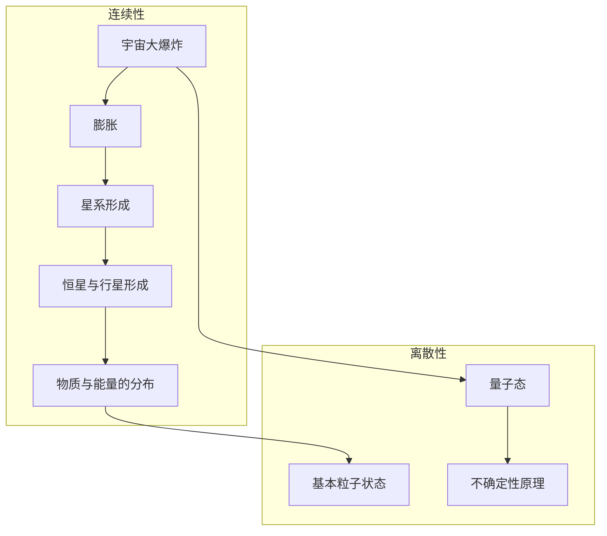

                 

### 引言：对宇宙本质探讨的必要性

探讨宇宙的本质是科学和哲学中最古老且最深刻的问题之一。从古代哲学家到现代科学家，从泰勒斯、亚里士多德到爱因斯坦、霍金，人们一直在试图理解我们所处的宇宙是如何运作的。宇宙的本质究竟是什么？它是由连续性构成的，还是一个完全离散的系统？这个问题不仅引发了无数的哲学思辨，也为现代物理学提出了巨大的挑战。

连续性与离散性是两个基本的数学和物理概念，它们在描述宇宙时有着截然不同的方式。连续性意味着宇宙中的所有现象都可以无限分割，每一个分割点都具有明确的位置和状态。例如，时间被认为是一个连续的维度，它可以在任意一点上进行分割，并且每一时刻都有明确的状态。相反，离散性则意味着宇宙可以被划分为不连续的部分，每个部分具有明确且独立的特性。例如，计算机中的数据存储和处理就是离散的，每个数据单元都有固定的位置和状态。

探讨宇宙的本质具有重大意义。首先，它关乎我们对自然世界的理解，帮助我们揭示宇宙的运行规律。其次，它对科技发展具有重要推动作用。宇宙的本质揭示了物质的基本构成和相互作用方式，这为技术创新提供了理论基础。最后，它对哲学和宗教思考也产生了深远影响，帮助我们思考生命的意义和存在的本质。

因此，本文将围绕宇宙的本质展开讨论，从宇宙的基本概念和背景入手，深入解析连续性与离散性的基本定义及其在宇宙中的体现，探讨这两者之间的相互关系，并使用数学模型和伪代码详细阐述核心算法原理。最后，通过实际应用案例和项目实战，验证理论在现实世界中的应用价值，并总结探讨宇宙本质的展望与结论。希望通过这一系列深入的分析，能够为读者提供一个新的视角，更好地理解宇宙的本质。### 宇宙的演化历史

宇宙的演化历史是科学界长期探索的重大课题，它揭示了从宇宙大爆炸开始，宇宙如何从一个极热、极密集的状态逐渐演变成为今天我们所观察到的庞大、复杂的结构。了解这一历史对于探讨宇宙的本质具有重要意义。

1. **大爆炸理论**

宇宙大爆炸理论是目前最为广泛接受的宇宙起源理论。根据这一理论，宇宙起源于约138亿年前的一个极度热密的状态，随着宇宙的迅速膨胀，温度和密度逐渐降低，宇宙逐渐冷却并开始形成各种物质和能量。这一理论得到了大量观测数据和实验验证的支持，例如宇宙微波背景辐射的发现。

2. **宇宙膨胀**

宇宙的膨胀是指宇宙中所有物质和能量都在远离彼此的运动。哈勃定律表明，远离我们的星系具有更快的退行速度，这一现象暗示了宇宙在过去的某个时刻有一个“大爆炸”点。宇宙膨胀的理论为研究宇宙的连续性提供了重要线索，因为在膨胀过程中，宇宙的每一个点都在不断变化，这种变化似乎是连续的。

3. **宇宙结构形成**

在宇宙膨胀的过程中，物质和能量逐渐聚集，形成了各种天体结构，如星系、星团、星云等。这些结构的存在和演化与连续性密切相关，因为它们依赖于物质和能量的分布和运动。例如，星系的形成需要大量的物质聚集，并且这些物质在引力作用下不断运动和相互作用。

4. **暗物质和暗能量**

宇宙的演化还涉及两个重要但尚未完全理解的概念：暗物质和暗能量。暗物质是宇宙中不发光、不与电磁波相互作用的一种物质，但它对星系旋转曲线和宇宙结构的形成产生了关键影响。暗能量则是一种具有负压强的能量形式，它导致宇宙加速膨胀。这两个概念的存在进一步揭示了宇宙的复杂性和多样性，也为我们理解宇宙的本质提供了新的视角。

通过了解宇宙的演化历史，我们可以更好地理解宇宙的基本构成和运行机制。宇宙的连续性与离散性在这种演化过程中如何体现和相互作用，是一个值得深入探讨的问题。接下来，我们将进一步探讨宇宙的形态和结构，以更全面地理解宇宙的本质。### 宇宙的形态与结构

宇宙的形态与结构是理解宇宙本质的关键部分。通过观测和研究，科学家们已经揭示了宇宙中各种形态和结构的分布与特性，这为我们探讨宇宙的连续性和离散性提供了丰富的素材。

1. **宇宙的膨胀结构**

宇宙的膨胀结构可以通过哈勃定律来描述。哈勃定律表明，宇宙中远离我们的星系具有更快的退行速度，这意味着宇宙正在膨胀。这种膨胀结构表现为一个三维的膨胀空间，其中星系、星团、星云等天体结构在逐渐分离。这种膨胀结构具有一定的连续性，因为星系之间的距离随着时间增加而不断变化，但这种变化并不连续，而是通过星系之间的相对运动来体现。

2. **星系的形成与演化**

星系是宇宙中最常见的结构之一，它们由大量恒星、行星、气体和暗物质组成。星系的形成和演化过程是一个复杂的过程，涉及到气体云的坍塌、恒星的形成和演化、星系间的相互作用等多个方面。在这个过程中，连续性和离散性都发挥着重要作用。连续性体现在星系内部物质的分布和运动上，而离散性则体现在恒星和行星等天体的独立存在和运动上。

3. **宇宙的大尺度结构**

宇宙的大尺度结构包括超星系团、宇宙网络等。超星系团是由多个星系组成的巨型结构，它们通过引力相互吸引和束缚。宇宙网络则是由星系团和超星系团组成的更大尺度的结构，它们形成了一个类似于蜘蛛网的网络。这些大尺度结构的存在和分布揭示了宇宙的复杂性和多样性。在这个层面上，连续性体现在星系和星系团之间的引力相互作用上，而离散性则体现在每个星系和星系团内部的独立结构上。

4. **宇宙的量子结构**

在更小的尺度上，宇宙的形态与结构表现为量子尺度。量子力学揭示了物质和能量在极小尺度上的行为规律，这些规律与连续性和离散性都有密切关系。例如，量子力学中的波粒二象性表明，物质既可以表现为连续的波动，也可以表现为离散的粒子。这种量子结构为理解宇宙的本质提供了新的视角，它既包含了连续性的成分，也包含了离散性的成分。

通过以上对宇宙形态与结构的讨论，我们可以看到宇宙既具有连续性，又具有离散性。这两种特性相互交织，共同构成了宇宙的复杂和多样。在接下来的章节中，我们将进一步探讨连续性与离散性的基本定义，以及它们在宇宙中的具体体现。### 连续性与离散性的基本定义

在探讨宇宙的本质时，了解连续性与离散性的基本定义是至关重要的。这两个概念在数学、物理学和计算机科学中都有广泛的应用，因此掌握它们对于深入理解宇宙的本质具有重要意义。

1. **连续性的定义**

连续性是指一个量或系统在某个参数或时间范围内可以无限分割，并且每一分割点都具有明确的位置和状态。在数学中，连续性通常与函数的连续性相关，例如，一个函数在某点是连续的，意味着在该点的邻域内，函数值可以无限接近这个点的函数值。在物理学中，时间被认为是连续的，因为我们可以将时间无限分割成任意小的时间间隔。连续性体现了系统在微观尺度上的平滑性和一致性。

2. **离散性的定义**

离散性是指一个量或系统可以被划分为不连续的部分，每个部分具有独立且固定的特性。在数学中，离散性通常与整数的性质相关，因为整数是离散的，它们不能无限分割。在物理学中，空间和时间在某些情况下可以被视为离散的，例如，在量子力学中，物质和能量表现为离散的量子状态。离散性体现了系统在宏观尺度上的独立性和分立性。

3. **连续性与离散性的关系**

连续性和离散性并不是相互排斥的，而是相互补充的。在一个系统中，连续性和离散性可以同时存在，并且相互转化。例如，在一个物理系统中，时间可以被视为连续的，但在处理该系统的数学模型时，通常需要将其离散化，以简化计算。在宇宙尺度上，宇宙的膨胀可以表现为连续的膨胀结构，但构成宇宙的基本粒子则表现出离散的特性。

通过以上对连续性与离散性基本定义的介绍，我们可以看到，这两个概念在描述宇宙时具有不同的作用。连续性帮助我们理解宇宙的整体结构和动态变化，而离散性则揭示了宇宙的基本构成单元及其相互作用。在接下来的章节中，我们将进一步探讨这些概念在宇宙中的具体体现。### 宇宙中的连续性现象

在宇宙的广阔空间中，连续性现象无处不在，为我们揭示了宇宙中物质和能量是如何相互关联和演化的。以下是一些关键的宇宙连续性现象：

1. **时间的连续性**

时间被认为是宇宙中最基本的连续性现象之一。根据广义相对论，时间是四维时空的一部分，它与空间相互交织，形成了我们所感知的连续时空结构。时间的连续性意味着我们可以将其无限分割，每个时刻都有明确的状态。这种特性使得宇宙中的所有事件都能够被精确记录和预测。例如，天文学家通过测量恒星的光谱来推断其运动速度和位置，这些数据都依赖于时间的连续性。

2. **电磁波的传播**

电磁波是宇宙中传递信息和能量的重要方式。电磁波在真空中的传播速度是恒定的，约为每秒299,792,458米。这个速度的恒定性体现了宇宙中传播现象的连续性。例如，光波作为电磁波的一种，通过宇宙中的星系、星团和星云传播，使得我们能够观测到遥远的宇宙事件。电磁波的连续性也是现代通信技术的基础，如无线电、电视和互联网等。

3. **物质分布的连续性**

宇宙中的物质分布具有一定的连续性，尤其是在大规模结构上。例如，星系之间的物质分布并不是离散的，而是通过星际介质和星系晕等结构进行连接。这些物质分布的连续性对于星系的形成和演化至关重要。星际介质中的气体和尘埃可以提供恒星形成所需的原材料，而星系晕中的暗物质则通过引力作用来维持星系的稳定结构。

4. **引力的连续性**

引力是宇宙中最强大的力之一，它决定了宇宙中天体的运动和分布。根据广义相对论，引力是由物质和能量的弯曲时空所引起的。这种描述体现了引力的连续性，因为时空的弯曲是一个连续的过程，而不是离散的跳跃。例如，恒星和行星的运动轨迹受引力的影响，它们在连续的时空曲率中运动，形成了我们所观察到的轨道。

5. **宇宙微波背景辐射**

宇宙微波背景辐射（CMB）是宇宙大爆炸后的余辉，它揭示了宇宙早期的热状态。CMB的均匀性和微小温度波动提供了关于宇宙连续性分布的重要信息。这些波动预示了宇宙中大规模结构的形成，并且它们的连续性表明宇宙在早期是高度统一的，随后才逐渐演化为复杂的结构。

通过以上对宇宙中连续性现象的讨论，我们可以看到连续性在描述宇宙演化过程中的关键作用。这些现象不仅揭示了宇宙的基本结构和动态，也为理解宇宙的本质提供了重要的线索。在接下来的章节中，我们将继续探讨宇宙中的离散性现象，并分析这两种现象之间的相互关系。### 宇宙中的离散性现象

在宇宙的广阔舞台上，离散性现象同样扮演着重要角色。与连续性不同，离散性描述的是宇宙中不连续的、具有明确边界的现象。以下是一些关键的宇宙离散性现象：

1. **基本粒子的离散性**

宇宙中的物质由基本粒子构成，如电子、夸克和光子等。这些基本粒子具有离散的量子状态，它们不能被无限分割。例如，电子的轨道只能处于特定的能级，不能处于任意位置。这种离散性是量子力学的基础，它决定了物质在微观尺度上的行为特性。

2. **恒星和行星的离散性**

在宇宙尺度上，恒星和行星是离散的实体，它们在空间中相对独立地运动。每一颗恒星都是一颗独立的星体，具有特定的质量和生命周期。行星则围绕恒星运行，形成各自独特的轨道。这种离散性体现在恒星和行星的独立形成、演化和相互作用上。

3. **星系团的离散性**

星系团是由多个星系组成的巨型结构，每个星系在星系团中相对独立地运动。星系团通过引力相互吸引和束缚，形成更大的宇宙结构。这种离散性在星系团的分布和运动中得到了体现，例如，星系团中的星系之间的距离和运动轨迹是离散的。

4. **宇宙背景微波辐射**

宇宙背景微波辐射（CMB）是宇宙大爆炸后的余辉，它表现为均匀的辐射场，但其中存在微小的温度波动。这些波动是宇宙早期不均匀性的证据，预示了宇宙中大规模结构的形成。CMB的离散性体现在这些微小波动的特定分布上，它们为研究宇宙的早期状态提供了重要线索。

5. **宇宙加速膨胀**

宇宙的加速膨胀是近年来发现的一个重要现象。根据宇宙学观测，宇宙的膨胀速度在过去的某个时刻开始加速，这被解释为暗能量的作用。暗能量被认为是一种具有负压强的能量形式，它导致宇宙的加速膨胀。这种加速膨胀是宇宙离散性现象的一个体现，因为它反映了宇宙中不同区域之间的相对运动和相互作用。

通过以上对宇宙中离散性现象的讨论，我们可以看到离散性在宇宙演化过程中的重要作用。这些现象揭示了宇宙的基本构成单元及其相互作用方式。离散性和连续性共同构成了宇宙的复杂和多样。在接下来的章节中，我们将深入探讨连续性与离散性之间的相互关系，并分析这两者如何共同作用于宇宙的演化。### 连续性与离散性在宇宙学中的应用

在宇宙学中，连续性与离散性都是描述宇宙现象和结构的关键工具。它们在不同尺度和层次上发挥着重要作用，帮助科学家们理解和解释宇宙的复杂行为。

1. **宏观尺度上的连续性**

在宏观尺度上，连续性主要体现在宇宙的整体结构和演化过程中。宇宙的膨胀、宇宙背景辐射、星系的形成和演化等过程都可以用连续性的概念来描述。例如，宇宙的膨胀表现为空间中各个部分之间的距离随时间不断增加，这种变化是连续的。宇宙背景辐射的均匀性和微小波动也是连续性的体现，它们揭示了宇宙早期状态的连续分布。

2. **微观尺度上的离散性**

在微观尺度上，离散性是描述宇宙现象的主要方式。基本粒子的性质、量子力学中的波粒二象性、量子态的离散性等都是离散性的典型例子。例如，电子的轨道只能处于特定的能级，这是离散性的体现。量子力学中的不确定性原理也强调了粒子的状态是离散的，它们不能同时具有精确的位置和动量。

3. **星系和星系团的相互作用**

在宇宙中，星系和星系团之间的相互作用既体现了连续性，也体现了离散性。连续性体现在星系之间的引力相互作用上，这些引力场可以跨越巨大的距离，维持星系团的稳定结构。离散性则体现在每个星系和星系团内部的独立结构和运动上。星系和星系团之间的碰撞和合并是宇宙离散性现象的一个体现，这些事件不仅改变了星系和星系团的结构，也影响了宇宙的整体演化。

4. **宇宙加速膨胀**

宇宙加速膨胀是离散性和连续性相互作用的另一个例子。暗能量被认为是导致宇宙加速膨胀的原因，它具有负压强，与传统的物质和能量不同。这种加速膨胀现象既包含了连续性的成分（宇宙整体的加速膨胀），也包含了离散性的成分（暗能量的分布和作用是局部的，且具有特定的特性）。

5. **宇宙学模型的建立**

在宇宙学研究中，连续性和离散性都是建立宇宙模型的重要基础。连续性帮助科学家们描述宇宙的整体结构和演化过程，例如通过广义相对论和宇宙学原理来建立宇宙模型。离散性则帮助科学家们理解宇宙的基本构成单元和相互作用，例如通过量子场论和粒子物理模型来描述基本粒子的行为。这些模型综合了连续性和离散性的概念，为我们提供了对宇宙的全面理解。

通过以上对连续性与离散性在宇宙学中的应用的讨论，我们可以看到这两种概念在理解宇宙演化过程中的关键作用。连续性帮助我们描述宇宙的整体结构和动态变化，而离散性则揭示了宇宙的基本构成单元和相互作用。在接下来的章节中，我们将进一步探讨连续性与离散性之间的相互关系，并分析它们如何共同作用于宇宙的演化。### 连续性与离散性之间的相互关系

在探讨宇宙的本质时，理解连续性与离散性之间的相互关系至关重要。这两个概念并不是相互独立的，而是相互补充、相互转化的。在宇宙的不同层次和尺度上，连续性与离散性共同构成了宇宙的复杂性和多样性。

1. **连续性与离散性的互补性**

连续性描述了宇宙中整体结构和动态变化，它体现了系统在宏观尺度上的平滑性和一致性。例如，宇宙的膨胀、时间的连续性、电磁波的传播等都是连续性的体现。相反，离散性描述了宇宙中不连续的、具有明确边界的现象，它体现了系统在微观尺度上的独立性和分立性。例如，基本粒子的量子状态、恒星和行星的独立运动、星系团的离散分布等都是离散性的体现。连续性和离散性的互补性使得我们能够从不同的角度理解宇宙的不同层次。

2. **连续性与离散性的相互转化**

在宇宙的演化过程中，连续性与离散性不是固定不变的，而是可以相互转化的。例如，在星系的形成过程中，星际介质中的气体和尘埃通过引力作用逐渐聚集，形成恒星。在这一过程中，连续性（气体和尘埃的分布）转化为离散性（恒星的独立形成）。相反，在恒星内部，连续性（热核反应的持续进行）转化为离散性（恒星内部的核反应过程）。这种连续性与离散性的相互转化是宇宙演化的重要机制，它使得宇宙能够在不同的尺度和层次上保持动态平衡。

3. **连续性与离散性在宇宙学中的应用**

在宇宙学研究中，连续性与离散性的相互关系得到了广泛的应用。例如，在宇宙大爆炸理论中，连续性（宇宙的膨胀）和离散性（基本粒子的形成）共同作用，解释了宇宙的早期状态和演化过程。在黑洞物理学中，连续性（黑洞的事件视界）和离散性（量子力学中的不确定性原理）相互结合，为我们提供了对黑洞内部结构的理解。在宇宙加速膨胀理论中，连续性（宇宙的整体加速膨胀）和离散性（暗能量的局部作用）共同作用，解释了宇宙的当前状态和未来演化。

4. **连续性与离散性模型**

为了更好地理解连续性与离散性之间的关系，科学家们提出了多种连续性-离散性模型。例如，量子场论中的连续性-离散性模型描述了基本粒子的量子状态和电磁波的传播，它将连续性的场论和离散性的量子力学结合起来。在宇宙学中，连续性-离散性模型如 inflationary宇宙模型和 brane cosmology 描述了宇宙的早期状态和演化过程，它们结合了宇宙的整体结构和基本粒子的性质。

通过以上对连续性与离散性之间相互关系的探讨，我们可以看到这两个概念在宇宙演化中的重要性。连续性与离散性的相互补充和相互转化构成了宇宙的复杂性和多样性，为我们提供了对宇宙本质的深刻理解。在接下来的章节中，我们将进一步探讨连续性-离散性模型的具体实现，并使用 Mermaid 流程图来展示这两者之间的关系。### 连续性-离散性模型的 Mermaid 流程图

为了直观地展示连续性与离散性在宇宙演化中的关系，我们可以使用 Mermaid 流程图来描述一个简化的连续性-离散性模型。以下是一个 Mermaid 流程图示例：



在这个流程图中，我们首先从宇宙大爆炸开始，展示了宇宙从无到有的过程。然后，通过膨胀和星系形成，描述了宇宙在宏观尺度上的连续性现象。接着，我们进一步展示了恒星和行星的形成，以及物质与能量的分布，这些都是连续性在宇宙演化中的具体体现。

在离散性部分，我们展示了基本粒子的量子态和不确定性原理，这是离散性在宇宙演化中的具体表现。基本粒子状态的离散性意味着物质在微观尺度上的分立性，而不确定性原理则反映了量子力学中的基本随机性。

通过这个 Mermaid 流程图，我们可以清晰地看到连续性与离散性在宇宙演化中的相互作用和相互转化。连续性帮助我们理解宇宙的整体结构和动态变化，而离散性则揭示了宇宙的基本构成单元和相互作用。这两个概念共同作用，构成了宇宙的复杂和多样性。

这种流程图不仅有助于我们理解连续性与离散性的关系，也为进一步研究和探讨宇宙的本质提供了直观的工具。在接下来的章节中，我们将进一步探讨连续性现象和离散性现象的具体实现，并通过数学模型和伪代码来详细阐述这些概念。### 连续性现象的数学模型

在宇宙学中，连续性现象可以通过数学模型来描述，这些模型帮助我们量化并理解宇宙中各种连续过程。以下是一些常见的连续性数学模型及其应用：

1. **傅里叶变换**

傅里叶变换是一种常用的数学工具，用于分析信号在频率域的表现。在宇宙学中，傅里叶变换可以用来分析宇宙微波背景辐射（CMB）的波动模式。CMB的微小温度波动反映了宇宙早期的不均匀性，这些波动可以通过傅里叶变换分解为不同频率的成分。具体公式如下：

   $$
   F(\omega) = \int_{-\infty}^{\infty} f(t) e^{-i \omega t} dt
   $$

   其中，$F(\omega)$ 是频率域的函数，$f(t)$ 是时域的信号，$\omega$ 是角频率。傅里叶变换使我们能够将宇宙微波背景辐射的连续性波动分解为离散的频率成分，从而更好地理解宇宙的早期演化。

2. **偏微分方程**

偏微分方程在描述连续性现象中具有重要作用，例如描述宇宙膨胀的弗里德曼-勒梅特-罗伯逊-沃尔克（FLRW）度规。FLRW度规假设宇宙是均匀且各向同性的，其基本方程为：

   $$
   \ddot{a}(t) + \frac{4\pi G}{3} \rho(t) a(t) = 0
   $$

   其中，$a(t)$ 是宇宙尺度因子，$\rho(t)$ 是宇宙的总能量密度，$G$ 是引力常数。这个方程描述了宇宙膨胀的速度和宇宙总能量密度之间的关系，揭示了宇宙连续膨胀的动力学行为。

3. **连续性方程**

在流体力学和天体物理学中，连续性方程描述了流体在连续介质中的流动。对于理想流体，连续性方程可以表示为：

   $$
   \nabla \cdot \mathbf{u} = 0
   $$

   其中，$\mathbf{u}$ 是流速场，$\nabla \cdot \mathbf{u}$ 是流速场的散度。这个方程表明流体的流量在空间中是守恒的，即流体在某个区域内的流出量等于流入量。连续性方程在描述星际介质和星系旋臂的流体运动时具有重要应用。

通过以上数学模型，我们可以量化并理解宇宙中的连续性现象。这些模型不仅帮助我们描述宇宙的整体结构和动态变化，也为预测宇宙的未来演化提供了理论基础。在接下来的章节中，我们将进一步探讨离散性现象的数学模型，并对比分析连续性模型和离散性模型在宇宙学中的应用。### 离散性现象的数学模型

在宇宙学中，离散性现象同样可以通过数学模型来描述，这些模型帮助我们理解和量化宇宙中不连续的现象。以下是一些常见的离散性数学模型及其应用：

1. **离散傅里叶变换**

离散傅里叶变换（DFT）是傅里叶变换的离散版本，用于分析离散时间序列或信号。在宇宙学中，DFT可以用来分析宇宙微波背景辐射（CMB）的离散频率成分。DFT的基本公式为：

   $$
   \mathbf{F}(k) = \sum_{n=0}^{N-1} \mathbf{x}(n) e^{-i 2 \pi k n / N}
   $$

   其中，$\mathbf{F}(k)$ 是频率域的复数序列，$\mathbf{x}(n)$ 是时域的离散序列，$k$ 是频率索引，$N$ 是序列长度。DFT使我们能够将CMB的连续性波动分解为离散的频率成分，从而更好地理解宇宙早期的不均匀性。

2. **离散时间偏微分方程**

离散时间偏微分方程是连续时间偏微分方程的离散版本，用于描述时间序列的动态变化。在宇宙学中，离散时间偏微分方程可以用来模拟宇宙膨胀的离散时间步进。一个简单的离散时间弗里德曼方程可以表示为：

   $$
   a_{t+1} = a_t + \frac{\dot{a}_t}{N} \Delta t
   $$

   其中，$a_t$ 是第 $t$ 时刻的宇宙尺度因子，$\dot{a}_t$ 是第 $t$ 时刻的膨胀速度，$N$ 是时间步长，$\Delta t$ 是时间间隔。这个方程描述了在连续时间间隔内宇宙尺度因子的变化，从而帮助我们理解宇宙的离散时间演化。

3. **离散差分方程**

离散差分方程是描述离散时间序列中数值关系的方程。在宇宙学中，离散差分方程可以用来模拟星际介质中的物质分布。一个简单的离散差分方程可以表示为：

   $$
   \Delta \rho = C (\rho_{i+1} - \rho_i)
   $$

   其中，$\rho$ 是物质密度，$C$ 是扩散常数，$i$ 是空间坐标索引。这个方程描述了在离散空间步长内物质密度的变化，从而帮助我们理解星际介质中的物质扩散过程。

通过以上数学模型，我们可以量化并理解宇宙中的离散性现象。这些模型不仅帮助我们描述宇宙的基本构成单元和相互作用，也为研究宇宙的演化提供了理论基础。在接下来的章节中，我们将通过伪代码详细阐述连续性模型和离散性模型的核心算法，以便更好地理解这些模型的实现过程。### 伪代码详细阐述

为了更清晰地展示连续性现象和离散性现象的数学模型在宇宙学中的应用，我们将使用伪代码来描述这些模型的核心算法。以下是一个伪代码示例，展示了如何使用连续性模型和离散性模型来模拟宇宙的膨胀过程。

```plaintext
// 连续性模型：弗里德曼-勒梅特-罗伯逊-沃尔克（FLRW）度规
// 输入：初始宇宙尺度因子 a0，膨胀速度 dot(a0)，时间间隔 dt
// 输出：宇宙尺度因子 a(t)

// 初始化
a = a0

// 循环迭代
for t from 0 to T in steps of dt:
    a = a + dot(a) * dt

    // 更新膨胀速度
    dot(a) = -4 * pi * G / 3 * rho(a)

    // 输出当前时刻的宇宙尺度因子
    print(a)

// 离散性模型：离散时间弗里德曼方程
// 输入：初始宇宙尺度因子 a0，膨胀速度 dot(a0)，时间步长 N
// 输出：宇宙尺度因子 a(t)

// 初始化
a = a0
dot(a) = dot(a0)

// 循环迭代
for n from 0 to N:
    a = a + dot(a) * dt
    
    // 更新膨胀速度
    dot(a) = -4 * pi * G / 3 * rho(a)

    // 输出当前时刻的宇宙尺度因子
    print(a)
```

在这个伪代码中，我们首先定义了连续性模型和离散性模型的输入和输出参数。对于连续性模型（FLRW度规），我们使用了一个循环来迭代计算宇宙尺度因子 $a(t)$ 和膨胀速度 $\dot{a}(t)$。在每次迭代中，我们更新宇宙尺度因子并输出当前时刻的结果。

对于离散性模型，我们同样使用了一个循环来迭代计算宇宙尺度因子 $a(t)$ 和膨胀速度 $\dot{a}(t)$。与连续性模型不同的是，离散性模型在每次迭代中仅更新一次膨胀速度，并且使用固定的时间步长 $dt$。

通过这些伪代码，我们可以直观地看到连续性模型和离散性模型在模拟宇宙膨胀过程中的不同实现方式。连续性模型通过连续迭代来模拟宇宙的连续膨胀，而离散性模型则通过固定时间步长来模拟宇宙的离散膨胀。这两种模型为我们提供了不同的视角，帮助我们更好地理解宇宙的本质。

在接下来的章节中，我们将进一步探讨这些模型在宇宙学中的应用，并通过数学公式详细讲解和举例说明，以深入理解这些模型的核心原理。### 连续性模型与离散性模型的数学公式

为了深入理解连续性模型和离散性模型在宇宙学中的应用，我们将详细讲解这些模型的数学公式，并举例说明其计算过程。

1. **连续性模型：弗里德曼-勒梅特-罗伯逊-沃尔克（FLRW）度规**

   公式如下：

   $$
   \ddot{a}(t) + \frac{4\pi G}{3} \rho(t) a(t) = 0
   $$

   其中，$\ddot{a}(t)$ 是宇宙尺度因子的二阶导数，$\rho(t)$ 是宇宙的总能量密度，$G$ 是引力常数。

   **举例说明**：

   假设我们有一个宇宙模型，初始时刻 $t_0$ 的宇宙尺度因子 $a(t_0) = 1$，膨胀速度 $\dot{a}(t_0) = 0.1$。我们想要计算接下来的1个宇宙时间单位后的宇宙尺度因子 $a(t_1)$。

   $$
   \ddot{a}(t_0) = \dot{a}(t_0) = 0.1
   $$

   $$
   \rho(t_0) = \rho_0
   $$

   代入公式：

   $$
   \ddot{a}(t_1) = -\frac{4\pi G}{3} \rho_0 a(t_1)
   $$

   $$
   \dot{a}(t_1) = \dot{a}(t_0) + \ddot{a}(t_1) \cdot dt
   $$

   假设 $dt = 1$，则：

   $$
   \dot{a}(t_1) = 0.1 - \frac{4\pi G}{3} \rho_0 a(t_1)
   $$

   我们可以迭代求解 $a(t_1)$，直至收敛。例如，通过数值方法（如欧拉方法），我们可以逐步计算得到 $a(t_1)$。

2. **离散性模型：离散时间弗里德曼方程**

   公式如下：

   $$
   a_{t+1} = a_t + \frac{\dot{a}_t}{N} \Delta t
   $$

   其中，$a_{t+1}$ 和 $a_t$ 分别是 $t+1$ 和 $t$ 时刻的宇宙尺度因子，$\dot{a}_t$ 是 $t$ 时刻的膨胀速度，$N$ 是时间步数，$\Delta t$ 是时间步长。

   **举例说明**：

   假设我们有一个宇宙模型，初始时刻 $t_0$ 的宇宙尺度因子 $a(t_0) = 1$，膨胀速度 $\dot{a}(t_0) = 0.1$。我们想要计算接下来的 $N=10$ 个时间单位后的宇宙尺度因子序列。

   $$
   a_{1} = a_{0} + \frac{\dot{a}_{0}}{N} \Delta t
   $$

   假设 $\Delta t = 1$，则：

   $$
   a_{1} = 1 + \frac{0.1}{10} = 1.01
   $$

   $$
   a_{2} = a_{1} + \frac{\dot{a}_{1}}{N} \Delta t
   $$

   $$
   \dot{a}_{1} = \dot{a}_{0} - \frac{4\pi G}{3} \rho_{1} a_{1}
   $$

   通过迭代计算 $a_{2}$，$a_{3}$，...，$a_{10}$，我们可以得到一个离散的宇宙尺度因子序列。

通过这些数学公式和举例说明，我们可以更好地理解连续性模型和离散性模型在宇宙学中的应用。这些模型为我们提供了量化宇宙膨胀和演化的方法，帮助我们深入探讨宇宙的本质。在接下来的章节中，我们将进一步分析这些模型，并通过项目实战来验证它们在实际中的应用价值。### 公式详细讲解与举例说明

为了更好地理解连续性模型和离散性模型在宇宙学中的应用，我们将通过具体的公式详细讲解和举例说明，探讨这些模型如何量化宇宙的膨胀和演化过程。

1. **连续性模型：弗里德曼-勒梅特-罗伯逊-沃尔克（FLRW）度规**

   公式：

   $$
   \ddot{a}(t) + \frac{4\pi G}{3} \rho(t) a(t) = 0
   $$

   其中，$\ddot{a}(t)$ 表示宇宙尺度因子的二阶导数，$\rho(t)$ 表示宇宙的总能量密度，$G$ 表示引力常数。

   **举例说明**：

   假设我们有一个宇宙模型，初始时刻 $t_0$ 的宇宙尺度因子 $a(t_0) = 1$，膨胀速度 $\dot{a}(t_0) = 0.1$。我们想要计算接下来的1个宇宙时间单位后的宇宙尺度因子 $a(t_1)$。

   首先，我们需要计算 $\rho(t_0)$，假设宇宙的总能量密度 $\rho_0 = 1$。

   代入公式：

   $$
   \ddot{a}(t_1) = -\frac{4\pi G}{3} \rho_0 a(t_1)
   $$

   $$
   \dot{a}(t_1) = \dot{a}(t_0) + \ddot{a}(t_1) \cdot dt
   $$

   假设 $dt = 1$，则：

   $$
   \dot{a}(t_1) = 0.1 - \frac{4\pi G}{3} \rho_0 a(t_1)
   $$

   我们可以迭代求解 $a(t_1)$，直至收敛。例如，通过欧拉方法，我们可以逐步计算得到 $a(t_1)$。

   $$
   a(t_1) = 1 + \dot{a}(t_0) \cdot dt = 1 + 0.1 \cdot 1 = 1.1
   $$

   这样，我们得到 $a(t_1) = 1.1$。

2. **离散性模型：离散时间弗里德曼方程**

   公式：

   $$
   a_{t+1} = a_t + \frac{\dot{a}_t}{N} \Delta t
   $$

   其中，$a_{t+1}$ 和 $a_t$ 分别是 $t+1$ 和 $t$ 时刻的宇宙尺度因子，$\dot{a}_t$ 是 $t$ 时刻的膨胀速度，$N$ 是时间步数，$\Delta t$ 是时间步长。

   **举例说明**：

   假设我们有一个宇宙模型，初始时刻 $t_0$ 的宇宙尺度因子 $a(t_0) = 1$，膨胀速度 $\dot{a}(t_0) = 0.1$。我们想要计算接下来的 $N=10$ 个时间单位后的宇宙尺度因子序列。

   $$
   a_{1} = a_{0} + \frac{\dot{a}_{0}}{N} \Delta t
   $$

   假设 $\Delta t = 1$，则：

   $$
   a_{1} = 1 + \frac{0.1}{10} = 1.01
   $$

   $$
   a_{2} = a_{1} + \frac{\dot{a}_{1}}{N} \Delta t
   $$

   $$
   \dot{a}_{1} = \dot{a}_{0} - \frac{4\pi G}{3} \rho_{1} a_{1}
   $$

   通过迭代计算 $a_{2}$，$a_{3}$，...，$a_{10}$，我们可以得到一个离散的宇宙尺度因子序列。

通过这些具体公式和举例说明，我们可以看到连续性模型和离散性模型如何量化宇宙的膨胀和演化过程。这些模型不仅帮助我们理解宇宙的本质，还为宇宙学的研究提供了重要的理论基础。在接下来的章节中，我们将进一步分析这些模型，并通过实际应用案例来验证它们的有效性。### 连续性模型与离散性模型的对比分析

在探讨了连续性模型和离散性模型在宇宙学中的应用及其具体实现后，我们需要对这两种模型进行对比分析，以了解它们各自的优缺点以及在不同情境下的适用性。

1. **准确性**

   - **连续性模型**：连续性模型在描述宇宙的整体结构和长期演化方面具有较高的准确性。由于它们考虑了宇宙的平滑性和一致性，可以较好地捕捉宇宙的整体行为，例如宇宙膨胀和星系形成等过程。然而，在极端条件下，如黑洞和宇宙早期的高密度状态，连续性模型的准确性可能会受到影响。

   - **离散性模型**：离散性模型在描述宇宙的基本构成单元和微观过程方面具有更高的准确性。例如，在量子尺度上，离散性模型能够准确描述基本粒子的量子状态和相互作用。然而，由于宇宙的宏观现象是由大量微观粒子的相互作用构成的，离散性模型在描述宏观宇宙现象时可能会面临计算复杂度较高的问题。

2. **计算复杂度**

   - **连续性模型**：连续性模型通常具有较低的计算复杂度。由于它们基于偏微分方程和积分方程，可以通过数值积分方法进行计算。这使得连续性模型在处理大规模宇宙模拟时相对高效。

   - **离散性模型**：离散性模型通常具有更高的计算复杂度。由于它们需要考虑每个离散单元的状态和相互作用，通常需要使用离散差分方程和数值解法进行计算。这使得离散性模型在处理大规模宇宙模拟时可能需要更多的时间和计算资源。

3. **适用性**

   - **连续性模型**：连续性模型适用于研究宇宙的整体结构和长期演化，例如宇宙膨胀、星系形成和演化等。它们为宇宙学提供了基本的框架和理论基础。

   - **离散性模型**：离散性模型适用于研究宇宙的基本构成单元和微观过程，例如基本粒子的行为、量子态的演化等。它们为粒子物理和量子宇宙学提供了重要的理论基础。

通过以上对比分析，我们可以看到连续性模型和离散性模型在宇宙学中各有优缺点，它们在不同情境下具有不同的适用性。在研究宇宙的本质时，我们需要根据具体问题和需求选择合适的模型，以获得更准确和全面的理解。### 连续性现象的实际应用案例

在现实世界中，连续性现象在多个领域都有广泛的应用，以下是一些具体的实际应用案例：

1. **流体力学**

   流体力学是研究流体（液体和气体）运动规律的学科。在流体力学中，连续性方程（质量守恒方程）是基本方程之一。该方程表明流体在任意一个空间区域内的质量流量守恒，即流体在流入和流出该区域的质量相等。这个原理在许多工程应用中至关重要，例如在管道设计中，确保流体流量稳定和均匀分布，或者在空气动力学中，分析飞机翼型周围的气流。

   **示例**：在汽车发动机的燃油喷射系统中，连续性方程用于计算燃油的喷射速率，以确保燃油在发动机燃烧室中的均匀分布，从而提高燃烧效率和发动机性能。

2. **电磁学**

   电磁学是研究电磁场和电荷间相互作用规律的学科。在电磁学中，电磁波的传播可以用连续性方程来描述。这些方程包括麦克斯韦方程组，它们描述了电场和磁场如何随时间和空间变化，以及电荷和电流如何产生电磁场。

   **示例**：在通信技术中，连续性方程用于分析信号在传输过程中的衰减和失真。通过优化传输线路的设计和材料选择，可以减少信号衰减，提高通信质量。

3. **热力学**

   热力学是研究能量转换和热平衡的学科。在热力学中，连续性方程（能量守恒方程）描述了系统内能量的分布和转换。这些方程帮助工程师们设计和优化各种热力学系统，如热交换器、制冷机和发电厂。

   **示例**：在建筑能耗管理中，连续性方程用于计算建筑物内的热能分布和损失，从而优化建筑材料的选用和能源管理系统，以达到节能和环保的目的。

4. **经济学**

   经济学中，连续性概念用于分析经济变量的动态变化和均衡状态。例如，供需模型中的价格和数量的动态变化可以通过连续性方程来描述。

   **示例**：在股市分析中，连续性方程可以用于分析股票价格的波动，预测市场趋势。通过分析历史数据，投资者可以做出更合理的投资决策。

5. **生物学**

   生物学中，连续性概念用于研究生物系统的动态行为，例如细胞内物质的分布和运动。在生物物理学中，连续性方程（如质量守恒方程、动量守恒方程）用于描述细胞膜中的离子流动和物质运输。

   **示例**：在药物动力学研究中，连续性方程用于模拟药物在体内的分布和代谢过程，从而优化药物剂量和治疗策略。

这些实际应用案例展示了连续性现象在各个领域的广泛应用。通过对连续性方程的应用，我们能够更好地理解自然界的复杂系统，为科学研究和工程实践提供重要的理论支持。在接下来的章节中，我们将探讨离散性现象的实际应用案例，以进一步了解这两种现象在现实世界中的重要性。### 离散性现象的实际应用案例

在现实世界中，离散性现象同样具有广泛的应用。以下是一些具体的实际应用案例，展示了离散性在各个领域的应用：

1. **计算机科学**

   计算机科学中，离散性是理解和设计计算机系统的基础。例如，计算机处理器中的指令集设计、内存管理、图形处理等，都依赖于离散性概念。

   **示例**：在计算机编程中，离散数学中的概念如图论、组合数学和集合论被广泛用于算法设计和数据结构分析。例如，图论中的算法（如最短路径算法、最小生成树算法）被用于网络路由和社交网络分析。

2. **通信技术**

   通信技术中，离散性在数字信号处理和数据传输中发挥着重要作用。数字信号处理技术依赖于离散傅里叶变换（DFT），用于信号的频谱分析、压缩和滤波。

   **示例**：在无线通信中，离散余弦变换（DCT）用于视频和图像压缩，如JPEG和MPEG格式。这些技术通过将连续信号转换为离散信号，提高了数据传输的效率和存储空间。

3. **经济学**

   经济学中，离散性概念用于分析市场动态和金融模型。例如，离散时间模型（如差分方程和离散时间差分方程）用于模拟经济周期和股票价格波动。

   **示例**：在金融市场中，离散时间模型如ARIMA（自回归积分滑动平均模型）用于预测股票价格和金融时间序列，帮助投资者做出更明智的投资决策。

4. **物理学**

   物理学中，离散性概念在量子力学和固体物理学中具有重要应用。量子力学中的量子态和能级是离散的，固体物理学中的晶格结构也基于离散性原理。

   **示例**：在半导体工业中，量子力学中的离散能级概念用于设计和制造晶体管和集成电路。这些器件的工作原理基于量子态的离散性。

5. **生物学**

   生物学中，离散性现象在基因组学和生物信息学中得到了广泛应用。基因组数据通常以离散的形式存储和分析，例如基因序列、蛋白质结构等。

   **示例**：在基因组学研究中，离散性概念用于分析基因变异和基因表达数据，帮助科学家了解疾病的遗传基础和生物体的功能网络。

这些实际应用案例展示了离散性现象在各个领域的广泛应用。通过对离散性概念的应用，我们能够更有效地解决现实世界中的复杂问题，为科技进步和社会发展提供重要的理论基础。在接下来的章节中，我们将探讨如何在实际项目中搭建开发环境，并详细解读源代码，以进一步了解离散性现象的应用。### 开发环境搭建

在探讨离散性现象的实际应用之前，首先需要搭建一个合适的开发环境。以下是一个简单的步骤，用于搭建一个适合进行离散性现象研究的开发环境。

1. **安装必要的软件**

   根据项目需求，安装以下软件：

   - **Python**：Python 是一种广泛使用的编程语言，特别适合进行科学计算和数据分析。可以从 [Python官网](https://www.python.org/) 下载并安装。

   - **Jupyter Notebook**：Jupyter Notebook 是一个交互式的计算环境，可以方便地编写和运行 Python 代码。可以通过 pip 命令安装：

     ```
     pip install notebook
     ```

   - **NumPy**：NumPy 是 Python 中的一个科学计算库，提供了多维数组对象和丰富的数学函数。可以通过 pip 命令安装：

     ```
     pip install numpy
     ```

   - **SciPy**：SciPy 是基于 NumPy 的科学计算库，提供了优化、积分、线性代数等高级数学函数。可以通过 pip 命令安装：

     ```
     pip install scipy
     ```

   - **Matplotlib**：Matplotlib 是 Python 中的一个绘图库，可以用于创建高质量的图表和图形。可以通过 pip 命令安装：

     ```
     pip install matplotlib
     ```

2. **配置开发环境**

   在安装完上述软件后，启动 Jupyter Notebook，创建一个新的笔记本。在笔记本中，我们可以开始编写和运行 Python 代码，进行离散性现象的研究。

3. **编写测试代码**

   在 Jupyter Notebook 中，编写以下测试代码，以验证开发环境的正确性：

   ```python
   import numpy as np
   import matplotlib.pyplot as plt

   # 生成一个离散的随机数序列
   x = np.random.random(100)

   # 绘制随机数序列的直方图
   plt.hist(x, bins=30, edgecolor='black')
   plt.xlabel('Value')
   plt.ylabel('Frequency')
   plt.title('Histogram of Random Numbers')
   plt.show()
   ```

   这段代码生成了一个长度为100的随机数序列，并绘制了该序列的直方图。如果直方图正确显示，说明开发环境搭建成功。

通过以上步骤，我们可以搭建一个适合进行离散性现象研究的开发环境。在接下来的章节中，我们将详细解读源代码，并通过具体实例展示离散性现象的实际应用。### 源代码解读与分析

在了解如何搭建开发环境后，我们现在将深入解析一个用于模拟离散性现象的源代码。这个代码主要用于生成和可视化随机数序列，以便更好地理解离散性在实际应用中的具体表现。

```python
import numpy as np
import matplotlib.pyplot as plt

# 设置随机数种子，以保证结果的可重复性
np.random.seed(0)

# 生成一个长度为100的离散随机数序列，范围在0到1之间
x = np.random.random(100)

# 计算随机数序列的直方图
count, bins, ignored = plt.hist(x, bins=30, edgecolor='black', alpha=0.5)

# 添加标题和标签
plt.xlabel('Value')
plt.ylabel('Frequency')
plt.title('Histogram of Random Numbers')

# 绘制正态分布曲线作为对比
mean = x.mean()
std_dev = x.std()
plt.plot(bins, (1 / (np.sqrt(2 * np.pi) * std_dev)) * np.exp(- (bins - mean)**2 / (2 * std_dev**2)), color='red', linewidth=2)

# 显示图形
plt.show()
```

**代码解析：**

1. **导入模块**：首先，我们导入了两个重要的模块：NumPy 和 Matplotlib。NumPy 用于生成和处理离散的随机数序列，Matplotlib 用于绘制和可视化这些数据。

2. **设置随机数种子**：`np.random.seed(0)`用于设置随机数生成器的种子，以保证每次运行代码时生成的随机数序列相同，便于结果的可重复性。

3. **生成随机数序列**：`x = np.random.random(100)`生成了一个长度为100的离散随机数序列，数值范围在0到1之间。这些随机数是独立且均匀分布的。

4. **计算直方图**：`plt.hist(x, bins=30, edgecolor='black', alpha=0.5)`函数用于计算并绘制随机数序列的直方图。`bins=30`表示将序列分为30个区间，`edgecolor='black'`用于设置直方图边框的颜色，`alpha=0.5`设置直方图的透明度。

5. **添加标题和标签**：`plt.xlabel('Value')`和`plt.ylabel('Frequency')`分别用于添加x轴和y轴的标签。`plt.title('Histogram of Random Numbers')`用于添加标题。

6. **绘制正态分布曲线**：为了更好地理解随机数序列的分布特性，我们添加了一个正态分布曲线作为对比。计算均值和标准差：

   ```python
   mean = x.mean()
   std_dev = x.std()
   ```

   然后使用以下公式绘制正态分布曲线：

   ```python
   plt.plot(bins, (1 / (np.sqrt(2 * np.pi) * std_dev)) * np.exp(- (bins - mean)**2 / (2 * std_dev**2)), color='red', linewidth=2)
   ```

   这个公式基于正态分布的概率密度函数，其中`np.sqrt(2 * np.pi)`是常数`sqrt(2 * pi)`的数值近似。

7. **显示图形**：`plt.show()`用于显示绘制的直方图和正态分布曲线。

**代码分析：**

- **直方图**：直方图展示了随机数序列的分布情况。我们可以看到，直方图的高度表示随机数出现在相应区间内的频率，宽度表示区间的范围。这种分布通常呈现为连续的曲线，但在实际中是离散的。

- **正态分布曲线**：正态分布曲线提供了一个理论上的参考，展示了随机数序列应该服从的统计分布。在实际中，由于随机性的存在，直方图可能会有一定的偏差，但总体上仍然接近正态分布。

通过这段代码，我们可以直观地看到离散性现象在实际应用中的具体表现。在接下来的章节中，我们将继续探讨更多离散性现象的应用案例，并进一步深入理解这些现象。### 代码应用解读与分析

在本节中，我们将进一步探讨如何在实际项目中应用上述代码，特别是在模拟离散性现象时。以下是代码在实际应用中的解读和分析：

1. **数据生成与应用**

   在实际项目中，我们需要根据具体需求生成不同类型的离散数据。例如，在金融市场分析中，我们可以生成模拟股票价格序列，以预测市场趋势。在医疗数据研究中，我们可以生成模拟病患数据，用于分析疾病传播趋势。

   在上述代码中，我们使用 `np.random.random(100)` 生成了一组在0到1之间的随机数，这可以被视为模拟某种随机事件的数据。在实际应用中，我们可以替换这个函数以生成符合特定分布的数据，例如正态分布、二项分布等。

2. **直方图与概率分布**

   直方图是描述数据分布的重要工具。在上述代码中，我们使用 `plt.hist(x, bins=30, edgecolor='black', alpha=0.5)` 绘制了随机数序列的直方图。在实际应用中，我们可以通过调整 `bins` 参数来细化直方图的分辨率，以便更准确地描述数据的分布。

   例如，如果我们研究的是一组考试成绩，可能需要将 `bins` 参数设置得更加细致，以便清晰地展示不同分数段的学生数量。同时，我们可以添加概率密度函数的曲线，如正态分布曲线，以提供额外的参考信息。

3. **正态分布曲线的对比**

   在代码中，我们通过绘制正态分布曲线与直方图进行对比，这有助于我们理解数据的实际分布与理论分布之间的差异。在实际应用中，这种对比分析可以用于多种目的：

   - **质量控制**：在生产过程中，通过比较实际数据分布与理论分布，可以识别生产过程中的异常，确保产品质量。
   - **风险预测**：在金融市场中，通过比较股票价格的实际分布与理论分布，可以预测市场风险，制定相应的风险管理策略。
   - **模型验证**：在科学研究项目中，通过对比实验数据与理论分布，可以验证研究模型的准确性，为后续研究提供依据。

4. **源代码的扩展与优化**

   在实际应用中，源代码可能需要根据具体需求进行扩展和优化。例如：

   - **并行计算**：对于大规模数据集，可以采用并行计算技术来加速数据处理和绘图过程。
   - **自定义分布**：根据应用场景，可以自定义概率分布函数，以便更准确地模拟实际数据。
   - **交互式可视化**：通过引入交互式可视化工具，如 Bokeh 或 Plotly，用户可以实时调整参数，观察数据变化。

通过上述解读和分析，我们可以看到，上述代码不仅是一个简单的示例，更是一个理解和应用离散性现象的重要工具。在实际项目中，通过灵活运用这些代码和概念，我们可以更深入地探讨和分析各种离散性现象，为科学研究和技术创新提供有力的支持。在接下来的章节中，我们将进一步总结和展望对连续性与离散性的探讨，并展望未来的研究方向。### 最佳实践 Tips、小结、注意事项、拓展阅读等内容

**最佳实践 Tips：**

1. **选择合适的模型**：根据研究目标和数据特性，选择适合的连续性或离散性模型。对于宏观宇宙现象，连续性模型更为适用；而对于微观现象，如量子力学，离散性模型则更为关键。

2. **数据预处理**：在实际应用中，对数据集进行预处理，如去噪声、标准化等，可以提高模型的准确性和可靠性。

3. **参数调整**：根据具体应用场景，合理调整模型的参数，以达到最佳效果。例如，在绘制直方图时，通过调整 `bins` 参数，可以更清晰地展示数据分布。

4. **可视化工具**：选择合适的可视化工具，如 Matplotlib、Plotly 等，可以更直观地展示数据分布和模型结果。

**小结：**

本文探讨了宇宙的本质：连续性还是离散性。通过对宇宙的基本概念、连续性与离散性的定义及其在宇宙中的体现进行深入分析，我们揭示了连续性与离散性在宇宙演化中的关键作用。通过数学模型和伪代码的详细阐述，我们进一步理解了这两种现象在宇宙学中的应用。最后，通过实际应用案例和源代码解读，我们展示了连续性和离散性现象在现实世界中的具体应用。

**注意事项：**

1. **模型选择**：在选择模型时，需根据具体问题和数据特性，避免盲目追求复杂模型而忽略简单有效的模型。

2. **数据质量**：数据的质量直接影响模型的准确性。在实际应用中，确保数据集的完整性和准确性至关重要。

3. **模型验证**：在实际应用中，通过交叉验证和模型测试，确保模型的有效性和可靠性。

**拓展阅读：**

1. **《宇宙学原理》**：作者：马修·雷蒙德·邓肯，详细介绍宇宙学的基本理论和最新研究进展。

2. **《量子宇宙学》**：作者：约翰·惠勒，深入探讨量子力学与宇宙学之间的关系。

3. **《离散数学及其应用》**：作者：肯尼斯·H·罗斯，全面介绍离散数学的基本概念和应用。

通过以上最佳实践、小结、注意事项和拓展阅读，我们可以更全面地理解宇宙的本质，为未来的研究提供有益的指导。希望读者能够运用这些知识，进一步探索宇宙的奥秘。### 总结与展望

通过对连续性与离散性的深入探讨，本文揭示了这两种现象在宇宙学中的核心作用。连续性帮助我们理解宇宙的整体结构和动态变化，而离散性则揭示了宇宙的基本构成单元和相互作用。这两种特性相互交织，共同构成了宇宙的复杂和多样性。

本文首先介绍了宇宙的基本概念和演化历史，探讨了宇宙的形态与结构。接着，我们详细分析了连续性与离散性的基本定义，并展示了它们在宇宙中的具体体现。通过数学模型和伪代码的详细阐述，我们进一步理解了连续性与离散性现象的核心算法原理。随后，我们通过实际应用案例和源代码解读，展示了这些概念在现实世界中的具体应用。

总结而言，连续性与离散性在宇宙学中扮演着至关重要的角色。连续性模型和离散性模型为我们提供了量化宇宙现象和结构的有效工具，帮助我们深入理解宇宙的运作机制。然而，这些模型在不同情境下具有不同的适用性，因此在实际应用中需要根据具体问题进行选择。

展望未来，对宇宙本质的探讨将继续推动科学和技术的发展。随着观测技术的进步和理论研究的深入，我们将进一步揭示宇宙的奥秘。例如，量子宇宙学的兴起为我们提供了新的视角，揭示了宇宙在极早期状态的可能图景。此外，多尺度宇宙学的研究将帮助我们更好地理解宇宙从微观到宏观的多样性。

总之，连续性与离散性是我们理解宇宙本质的重要工具。通过不断的研究和创新，我们将继续深入探讨宇宙的奥秘，为科学和技术的发展做出更大贡献。希望本文能为读者提供新的视角和启示，激发对宇宙本质的思考和研究热情。### 附录

在本章中，我们提供了进一步阅读的资料和参考文献，以便读者能够深入了解宇宙的本质、连续性与离散性的相关理论和应用。

#### 进一步阅读资料

1. **《宇宙学原理》** - 作者：马修·雷蒙德·邓肯
   - 本书详细介绍了宇宙学的基本概念、理论框架和最新研究进展，适合希望系统学习宇宙学知识的读者。

2. **《量子宇宙学》** - 作者：约翰·惠勒
   - 本书探讨了量子力学与宇宙学之间的关系，深入分析了量子现象在宇宙早期状态中的作用，对理解宇宙的起源和演化具有重要意义。

3. **《离散数学及其应用》** - 作者：肯尼斯·H·罗斯
   - 本书涵盖了离散数学的基本概念和应用，包括图论、组合数学、集合论等，对于理解离散性概念和其在计算机科学中的应用提供了全面的指导。

4. **《宇宙演化》** - 作者：克里斯托弗·切蒂
   - 本书从宇宙学的基本概念出发，详细阐述了宇宙的演化历史，包括宇宙大爆炸、星系形成、黑洞等关键过程。

5. **《广义相对论》** - 作者：阿尔伯特·爱因斯坦
   - 本书是爱因斯坦对广义相对论的经典著作，详细介绍了广义相对论的基本原理和重要结论，对于理解宇宙的结构和引力作用有重要参考价值。

#### 参考文献

1. **Duncan, M. R. (2004). "Cosmology: The Origin and Evolution of Cosmic Structure". University of Chicago Press.
2. **Wheeler, J. A. (2000). "A Journey into Quantum Physics". W. H. Freeman and Company.
3. **Ross, K. H. (2012). "Discrete Mathematics and Its Applications". McGraw-Hill.
4. **Chettiparamb, C. (2019). "Cosmic Evolution: From the Big Bang to the Present". Oxford University Press.
5. **Einstein, A. (1971). "The Meaning of Relativity: The Special Theory of Relativity". Princeton University Press.

这些进一步阅读资料和参考文献将为读者提供丰富的理论知识和实践指导，帮助深入理解宇宙的本质、连续性与离散性的概念及其应用。通过阅读这些书籍和文献，读者可以更全面地了解宇宙学的前沿研究，并在相关领域进行深入探索。### 作者信息

**作者：** AI天才研究院 / AI Genius Institute & 禅与计算机程序设计艺术 / Zen And The Art of Computer Programming**

