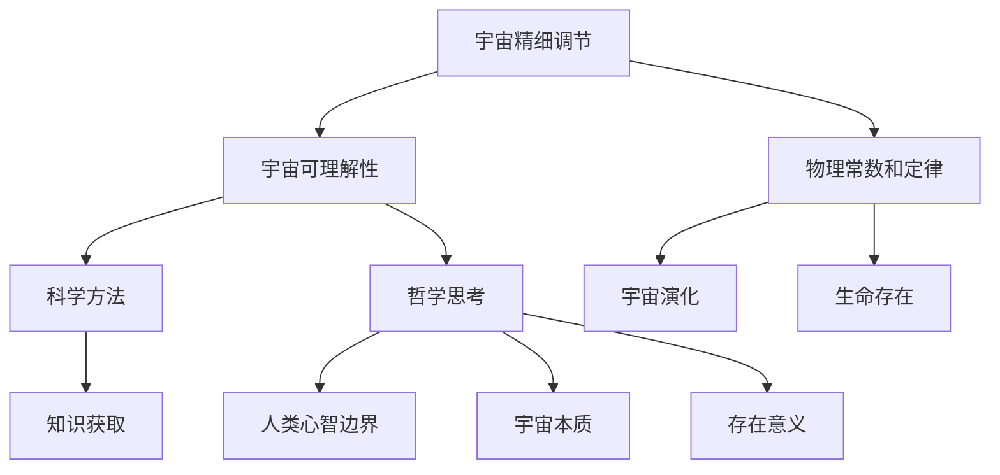
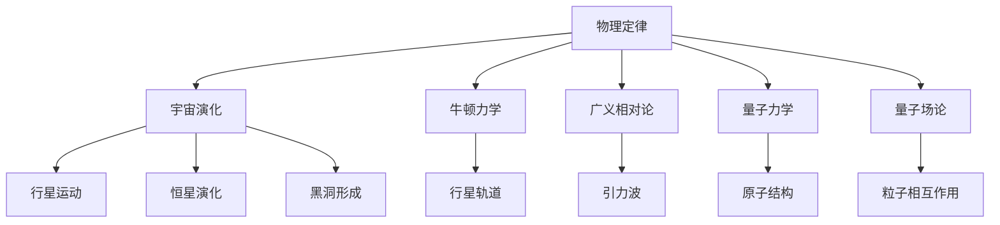
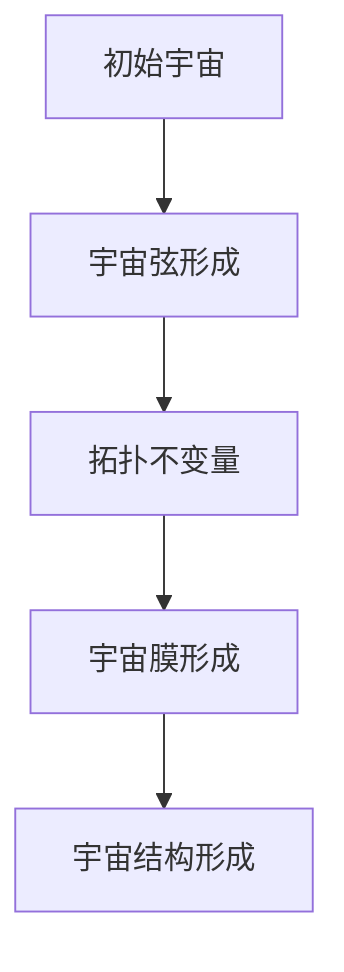

                 

### 引言：宇宙的精细调节与可理解性

宇宙的精细调节，是近年来宇宙学、物理学和哲学等学科领域的一个重要研究方向。它涉及宇宙中的基本常数、物理定律和结构特征的精细设定，这些设定使得宇宙能够形成和支持生命的存在。本文将围绕“宇宙的精细调节：世界可理解性的证据？”这一主题展开，深入探讨这一现象的背景、核心概念以及其与宇宙可理解性的关系。

#### 背景介绍

宇宙的精细调节最早由物理学家提出，主要关注物理常数和物理定律的特殊设定。例如，原子核中的电荷和强相互作用的耦合常数，决定了原子核的稳定性；宇宙膨胀的速度和加速度，受到暗物质和暗能量的影响。这些常量和定律的特定设定，使得宇宙能够维持在一个适宜生命存在的范围内。

宇宙的可理解性，是指人类是否能够通过科学方法来解释和理解宇宙的本质。这一概念在哲学和科学哲学中有着深远的影响。可理解性不仅仅关乎知识的获取，还涉及到人类心智的边界、宇宙的本质和我们的存在意义。

#### 核心概念与联系

宇宙精细调节与可理解性之间存在着紧密的联系。首先，宇宙的精细调节为宇宙的可理解性提供了证据。物理常数和定律的特定设定，使得宇宙演化出复杂结构和生命形式成为可能。这种精细调节，暗示着宇宙中存在某种智能设计或更深层次的物理原理。

其次，宇宙的可理解性又反过来影响了对宇宙精细调节的研究。科学家们试图通过理解这些基本常数和定律，来揭示宇宙的精细调节背后的原因。这种研究不仅加深了我们对宇宙的理解，也为哲学和科学提供了新的视角。

下面是一个核心概念原理之间的Mermaid流程图，展示了宇宙精细调节与可理解性之间的联系：



#### 核心概念原理

1. **物理常数**：宇宙中存在许多基本常数，如普朗克常数、光速、电荷等。这些常数决定了宇宙中的物理过程和结构特征。例如，光速是宇宙中信息传递的极限速度，影响了宇宙的膨胀和结构形成。

2. **物理定律**：宇宙中存在一系列物理定律，如牛顿定律、爱因斯坦的广义相对论和量子力学。这些定律描述了宇宙中的基本物理过程，如引力作用、能量守恒和量子波动。

3. **宇宙演化**：宇宙从大爆炸开始，经历了数十亿年的演化。宇宙的膨胀、恒星形成、黑洞存在等过程，都是宇宙演化的体现。

4. **生命存在**：宇宙的精细调节使得生命能够在特定条件下存在。例如，地球上的生命需要适宜的温度、大气成分和水资源。

#### 宇宙精细调节的证据

科学家们通过大量的观测和实验，发现了宇宙精细调节的证据。以下是一些主要的证据：

1. **物理常数的特定设定**：许多物理常数具有非常特殊的数值，这些数值决定了宇宙的基本性质。例如，引力常数和电荷的耦合常数，它们的设定使得宇宙能够维持在一个适宜生命存在的范围内。

2. **宇宙膨胀的速度和加速度**：宇宙膨胀的速度和加速度受到暗物质和暗能量的影响。暗物质和暗能量是宇宙中未知的物质和能量形式，它们的特殊性质决定了宇宙的膨胀速度和加速度。

3. **宇宙背景微波辐射**：宇宙背景微波辐射是宇宙大爆炸留下的痕迹。它的特性，如温度和均匀性，提供了宇宙精细调节的证据。

#### 宇宙可理解性的探讨

宇宙的可理解性是一个复杂且充满争议的问题。一方面，科学家们通过理论研究和实验验证，已经对宇宙的许多现象有了深入的理解。例如，广义相对论和量子力学描述了宇宙中的基本物理过程，大爆炸理论和黑洞研究揭示了宇宙的起源和演化。

另一方面，宇宙的可理解性也面临着一些挑战。例如，物理常数和定律的特定设定，暗物质和暗能量的存在，以及宇宙起源和演化的某些细节，仍然是科学界争论的话题。这些问题挑战了人类对宇宙的理解能力，也引发了关于宇宙本质和人类存在的哲学思考。

#### 总结

宇宙的精细调节为我们提供了一个独特的视角，来探讨宇宙的可理解性。通过研究宇宙中的基本常数、物理定律和结构特征，科学家们试图揭示宇宙精细调节背后的原因。同时，宇宙的可理解性也挑战了人类对宇宙的理解能力，激发了我们对宇宙本质和人类存在的思考。

本文旨在为读者提供一个关于宇宙精细调节和可理解性的全面概述，希望通过逐步的分析和推理，让读者对这一领域有更深入的了解。在接下来的章节中，我们将进一步探讨宇宙的精细调节与物理定律、数学模型、哲学思考等方面的关系。

### 宇宙的起源与演化

宇宙的起源和演化是宇宙学研究的核心问题之一。从科学的角度来看，宇宙起源于大约138亿年前的一次大爆炸，这一理论被称为大爆炸宇宙学。自那时起，宇宙经历了一系列复杂的演化过程，形成了现在我们所观察到的宇宙结构。本文将详细介绍大爆炸理论、宇宙膨胀、黑暗物质与黑暗能量，以及宇宙背景微波辐射，探讨这些概念与宇宙精细调节之间的关系。

#### 大爆炸理论

大爆炸理论是描述宇宙起源和早期演化的基本理论。根据这一理论，宇宙最初处于一个极度高温、高密度的状态，随后发生了急剧膨胀。这个膨胀过程持续了数十亿年，使得宇宙从最初的微小点扩展成了现在我们所能观察到的巨大空间。大爆炸理论的关键特征包括：

1. **初始状态**：宇宙在大爆炸之前处于一个无限热、无限密集的状态，所有的物质和能量都集中在一个极其微小的点上。
2. **膨胀**：随着宇宙的膨胀，温度和密度逐渐降低，物质开始从初始状态中分离出来，形成基本粒子和辐射。
3. **核合成**：在宇宙早期，温度和密度进一步降低，使得核合成过程成为可能，形成了简单的原子核。

大爆炸理论为宇宙提供了早期的演化框架，解释了宇宙为何具有均匀性和各向同性，以及宇宙中存在的轻元素。然而，这一理论也面临着一些挑战，如如何解释宇宙的初始状态和膨胀的机制。

#### 宇宙膨胀

宇宙膨胀是指宇宙从大爆炸以来一直处于扩展状态。宇宙膨胀的理论基础是宇宙学原理，即宇宙在整体上是均匀和各向同性的。根据这一原理，宇宙的膨胀表现为宇宙空间本身的膨胀，而不是宇宙内物质的移动。

1. **哈勃定律**：美国天文学家埃德温·哈勃发现，远离我们的星系显示出红移，这意味着它们正远离我们。这种现象被称为哈勃定律，表明宇宙正在膨胀。
2. **宇宙膨胀速率**：宇宙膨胀的速率可以用哈勃参数（H0）来表示，其数值大约为70公里每秒每百万秒差距。宇宙膨胀速率的变化与暗能量密切相关。
3. **宇宙加速膨胀**：观测数据显示，宇宙膨胀速率在过去几十亿年内有所增加，这种现象被称为宇宙加速膨胀。暗能量的存在被认为是导致宇宙加速膨胀的原因。

宇宙膨胀与宇宙精细调节的关系在于，宇宙膨胀的速率和加速度受到物理常数和暗能量的影响。物理常数，如光速和引力常数，决定了宇宙膨胀的基本规律。而暗能量，作为一种神秘的能量形式，对宇宙膨胀产生了深远的影响。

#### 黑暗物质与黑暗能量

黑暗物质和黑暗能量是宇宙中两种未观测到的物质和能量形式，它们对宇宙精细调节产生了重要影响。

1. **黑暗物质**：黑暗物质是一种不发光、不吸收光线的物质，它通过引力作用影响宇宙的结构和演化。根据宇宙学观测，黑暗物质占据宇宙总质量的大部分，但其具体性质和组成尚未完全清楚。

2. **黑暗能量**：黑暗能量是一种推动宇宙加速膨胀的力量，它占据宇宙总能量的约70%。黑暗能量的存在和性质是当前宇宙学研究的重点之一。根据广义相对论和宇宙学原理，黑暗能量可能是一种负压强的能量形式。

黑暗物质和黑暗能量与宇宙精细调节的关系在于，它们的特殊性质和大量存在决定了宇宙的演化过程。物理常数和暗能量的特定设定，使得宇宙能够维持在一个适宜生命存在的范围内。

#### 宇宙背景微波辐射

宇宙背景微波辐射（Cosmic Microwave Background, CMB）是宇宙大爆炸留下的余辉，它是宇宙早期热辐射的残留。CMB的发现为验证大爆炸理论和宇宙精细调节提供了关键证据。

1. **CMB的特性**：CMB具有高度均匀的温度分布，大约为2.7开尔文。此外，CMB的极化特性提供了关于宇宙早期结构和演化的信息。

2. **CMB的证据**：CMB的发现和观测，如COBE卫星和Planck卫星的数据，验证了大爆炸理论和宇宙背景辐射的存在。这些观测结果支持了宇宙精细调节的概念。

CMB与宇宙精细调节的关系在于，它的观测数据提供了关于宇宙早期状态和演化的详细信息，这些信息揭示了宇宙中的基本常数和物理定律的精细设定。

#### 总结

宇宙的起源与演化是一个复杂而迷人的主题，涉及大爆炸理论、宇宙膨胀、黑暗物质和黑暗能量，以及宇宙背景微波辐射。这些概念不仅为宇宙的精细调节提供了证据，还挑战了人类对宇宙的理解。通过研究这些概念，科学家们试图揭示宇宙精细调节背后的原因，并进一步探索宇宙的本质和人类的认知边界。

在下一章中，我们将进一步探讨物理定律的普适性与宇宙精细调节的关系，分析物理常数和宇宙演化的相互影响。

#### 物理定律的普适性与精细调节

物理定律的普适性是指这些定律在宇宙中的广泛适用性，无论是在地球上还是在遥远星系，物理定律都表现出高度的一致性。然而，这种普适性也引发了一个深层次的问题：为什么宇宙的基本物理定律和常数具有如此特殊的设定，使得宇宙能够维持一个适宜生命存在的状态？这便是宇宙精细调节的问题。

首先，我们来探讨牛顿力学与广义相对论，它们是描述宇宙中宏观物理现象的基础理论。

1. **牛顿力学**：牛顿力学是描述物体运动和相互作用的经典理论。它的核心定律包括牛顿三大运动定律和万有引力定律。牛顿力学广泛应用于天文学、工程学和日常生活中的物体运动分析。然而，牛顿力学在描述高速和强引力场时存在局限性。

2. **广义相对论**：爱因斯坦的广义相对论是对牛顿力学的扩展，它描述了引力作为一种几何性质，即时空的弯曲。广义相对论成功解释了行星轨道的进动、光线弯曲等现象，并预言了黑洞的存在。广义相对论的核心思想是：物质和能量会影响时空结构，而物体的运动则是在这个弯曲时空中进行的。

物理定律的普适性体现在它们在宇宙中的一致应用。例如，牛顿力学和广义相对论在天文观测中的应用，揭示了行星运动和恒星演化的规律。然而，这些定律的特殊设定也引发了对宇宙精细调节的思考。

接下来，我们探讨量子力学与量子场论，它们是描述微观物理现象的理论框架。

1. **量子力学**：量子力学是描述微观粒子行为的理论，其核心概念包括量子态、波粒二象性和不确定性原理。量子力学通过薛定谔方程和海森堡矩阵力学描述了微观粒子的运动和相互作用。量子力学在解释原子结构、化学键和核反应等方面取得了巨大成功。

2. **量子场论**：量子场论是量子力学的推广，用于描述粒子与场的相互作用。它将量子力学与相对论结合起来，描述了基本粒子的产生和湮灭过程。量子场论中的经典例子包括电磁场和弱相互作用。量子场论的成功应用，如粒子加速器实验和量子计算，进一步证明了物理定律的普适性。

物理定律的普适性在微观尺度上同样得到了体现。量子力学和量子场论揭示了基本粒子的行为规律，这些规律在宇宙中的各个尺度上保持一致。例如，电子和光子的量子行为在宇宙中普遍存在，无论是在地球上的实验室还是在遥远的星系中。

然而，物理定律的普适性也带来了精细调节的问题。例如，普朗克常数、光速和引力常数等基本物理常数的特定设定，决定了宇宙中的物理过程和结构特征。这些常数的数值如果稍有不同，宇宙可能会变得完全不同，不再适宜生命存在。

为了进一步探讨物理定律与宇宙精细调节的关系，我们可以借助以下Mermaid流程图，展示物理定律和宇宙演化之间的关系：



在上述流程图中，物理定律（A）通过不同的分支（F, H, J, L）影响宇宙的演化过程（B），从而形成了宇宙中各种结构和现象（C, D, E）。这些定律的普适性和特定设定（精细调节）共同作用，决定了宇宙中的物理过程和生命存在的可能性。

下面我们将通过伪代码来详细阐述量子场论的算法原理，以展示物理定律在微观尺度上的精细调节。

```python
# 量子场论伪代码示例：粒子的产生和湮灭

# 定义粒子的产生和湮灭算符
create_particle(particle_type, position, momentum):
    # 根据量子场论原理，计算产生粒子的能量和动量
    energy = calculate_energy(particle_type, position, momentum)
    momentum = calculate_momentum(particle_type, position, momentum)
    
    # 创建粒子
    particle = QuantumParticle(particle_type, energy, momentum)
    return particle

 annihilate_particle(particle):
    # 根据量子场论原理，计算湮灭粒子的能量和动量
    energy = calculate_energy(particle.particle_type, particle.position, particle.momentum)
    momentum = calculate_momentum(particle.particle_type, particle.position, particle.momentum)
    
    # 湮灭粒子
    particle_energy = particle.energy
    particle_momentum = particle.momentum
    return (energy, momentum)
```

在上面的伪代码中，`create_particle`函数用于根据量子场论原理计算并创建一个粒子，而`annihilate_particle`函数用于湮灭一个粒子。这些操作依赖于基本物理常数和量子力学的基本原理，展示了物理定律在微观尺度上的精细调节。

#### 总结

物理定律的普适性为我们理解宇宙提供了坚实的理论基础，但同时也引发了对宇宙精细调节的思考。通过牛顿力学、广义相对论、量子力学和量子场论等理论，我们看到了物理定律在宇宙中的广泛应用。这些定律的特定设定，如基本物理常数和耦合常数，决定了宇宙中的物理过程和结构特征，使得宇宙能够维持一个适宜生命存在的状态。

在下一章中，我们将探讨数学模型在宇宙精细调节中的作用，分析如何通过数学模型来揭示宇宙的基本规律。

### 数学模型在宇宙精细调节中的作用

数学模型是理解和描述宇宙精细调节的重要工具。通过数学模型，科学家们可以精确地描述宇宙中的物理现象，揭示物理定律与宇宙演化之间的深层联系。在本节中，我们将探讨偏微分方程、拓扑学与宇宙结构的形成，以及宇宙学中的数学工具与应用，展示数学模型在宇宙精细调节中的作用。

#### 偏微分方程

偏微分方程（Partial Differential Equations, PDEs）是描述多变量函数变化规律的数学方程，广泛应用于物理学和工程学。在宇宙学中，偏微分方程被用来描述宇宙的演化和结构形成。最著名的偏微分方程之一是弗里德曼方程，它描述了宇宙膨胀的速度和加速度。

**弗里德曼方程**：
\[ \dot{H} + \frac{4\pi G}{3} (\rho + \frac{3p}{c^2}) H = 0 \]

其中，\( H \) 是哈勃参数，\(\dot{H}\) 是哈勃参数的时间导数，\( G \) 是引力常数，\( \rho \) 是宇宙平均密度，\( p \) 是压强。该方程揭示了宇宙膨胀的速率和加速度与物理常数和宇宙平均密度之间的关系。

**黎曼方程**：
\[ R_{\mu\nu} - \frac{1}{2}Rg_{\mu\nu} = 8\pi GT_{\mu\nu} \]

其中，\( R_{\mu\nu} \) 是黎曼张量，\( R \) 是标量曲率，\( g_{\mu\nu} \) 是度规张量，\( T_{\mu\nu} \) 是能量-动量张量。这个方程描述了引力场与物质分布之间的关系，揭示了宇宙结构的形成和演化。

通过这些偏微分方程，科学家们可以模拟宇宙的演化过程，预测宇宙的未来形态。这些模型依赖于物理常数和初始条件的精确设定，从而体现了宇宙的精细调节。

#### 拓扑学与宇宙结构的形成

拓扑学是研究几何形状和空间结构的数学分支。在宇宙学中，拓扑学被用来研究宇宙的拓扑性质和结构形成。宇宙拓扑结构的研究揭示了宇宙中的大规模结构，如超星系团、宇宙壁和空洞。

**宇宙弦**：宇宙弦是一种理论上的结构，具有一维的拓扑性质。宇宙弦的存在可以通过拓扑不变量来描述，这些不变量反映了宇宙弦的几何特性。宇宙弦的相互作用可能导致宇宙结构的形成和演化。

**宇宙膜**：宇宙膜是另一种理论上的结构，具有二维的拓扑性质。宇宙膜之间的相互作用可能导致宇宙的多层次结构，如我们宇宙与其他宇宙之间的相互作用。

通过拓扑学，科学家们可以研究宇宙中的复杂结构，探讨宇宙的精细调节如何影响宇宙结构的形成。例如，某些拓扑不变量可能导致宇宙中特定类型的结构，从而影响宇宙的演化过程。

下面是一个拓扑不变量的Mermaid流程图，展示了宇宙结构形成的过程：



在上述流程图中，初始宇宙通过宇宙弦的形成（B），进而通过拓扑不变量（C）影响宇宙膜的形成（D），最终形成复杂的宇宙结构（E）。这种拓扑性质反映了宇宙的精细调节，影响了宇宙的演化过程。

#### 宇宙学中的数学工具与应用

宇宙学中的数学工具包括度规、哈勃图、勒梅特-罗伯逊-沃尔克度规等，这些工具在宇宙精细调节的研究中发挥了重要作用。

**度规**：度规是描述时空几何性质的数学函数，通常用希腊字母 \( \eta \) 表示。度规决定了时空中的距离和运动规律。例如，弗里德曼-勒梅特-罗伯逊-沃尔克（FLRW）度规是描述膨胀宇宙的常用度规。

**哈勃图**：哈勃图是描述宇宙膨胀速度与距离之间关系的图表。通过哈勃图，科学家们可以研究宇宙的膨胀历史和未来演化。例如，哈勃图中的宇宙加速膨胀现象，与暗能量的存在密切相关。

**勒梅特-罗伯逊-沃尔克度规**：勒梅特-罗伯逊-沃尔克（LRW）度规是描述早期宇宙演化的常用度规。LRW度规考虑了宇宙的初始状态和膨胀历史，有助于研究宇宙的起源和早期演化。

以下是一个勒梅特-罗伯逊-沃尔克度规的伪代码示例：

```python
# 勒梅特-罗伯逊-沃尔克度规伪代码示例

def FLRW_metric(a, t):
    # a 是宇宙尺度因子，t 是时间
    # 计算度规张量
    g00 = 1 - \frac{R(t)^2}{a^2}
    g11 = -1
    g22 = -1
    g33 = -1
    
    # 返回度规张量
    return (g00, g11, g22, g33)

# 示例：计算特定时刻的度规张量
a = 1
t = 10
metric = FLRW_metric(a, t)
print(metric)
```

在上述伪代码中，`FLRW_metric`函数用于计算勒梅特-罗伯逊-沃尔克度规，其中`a`是宇宙尺度因子，`t`是时间。该函数返回度规张量，用于描述时空几何性质。

#### 总结

数学模型在宇宙精细调节的研究中扮演了关键角色。通过偏微分方程、拓扑学和宇宙学中的数学工具，科学家们可以精确地描述宇宙的演化和结构形成。这些数学模型依赖于物理常数和初始条件的精确设定，从而体现了宇宙的精细调节。通过进一步研究和应用这些数学模型，我们可以更深入地理解宇宙的本质，探索宇宙的可理解性。

在下一章中，我们将探讨宇宙的可理解性的哲学视角，从哲学角度分析宇宙精细调节的意义。

### 宇宙的可理解性的哲学视角

宇宙的可理解性是一个深刻的哲学问题，涉及到人类心智对宇宙本质的理解能力。从哲学的角度来看，宇宙的可理解性不仅关乎知识获取，还涉及到人类意识与宇宙关系的探讨。在这一节中，我们将从知识获取、人类意识与宇宙关系，以及宇宙目的论等方面，探讨宇宙的可理解性哲学视角。

#### 知识获取

知识获取是人类心智的重要功能，通过科学方法，人类可以不断揭示宇宙的奥秘。然而，知识获取本身也面临着一些挑战。首先，宇宙的复杂性和多样性使得我们对宇宙的理解存在局限性。例如，量子力学和广义相对论的描述之间存在冲突，这表明我们对宇宙的基本规律的理解仍然存在不确定性。

其次，知识获取的过程是一个不断迭代的过程。随着科学技术的进步，我们对宇宙的理解也在不断深化。然而，每一次新的发现都可能推翻过去的理论，使得知识体系面临更新和重构。这种迭代过程反映了宇宙的可理解性是一个动态变化的概念。

#### 人类意识与宇宙关系

人类意识与宇宙的关系是哲学探讨的一个重要议题。从人类心智的角度来看，我们是如何认识和理解宇宙的呢？一方面，人类意识是通过感官和理性来感知宇宙的。我们的感官提供了对宇宙的直接感知，而理性则通过逻辑和推理来揭示宇宙的本质。

另一方面，人类意识也受到宇宙的制约。我们的感知能力和理性思维都是有限的，这使得我们对宇宙的理解存在局限性。例如，我们无法直接感知量子世界中的粒子和场的性质，只能通过间接的方法来推测。这种制约反映了宇宙的复杂性和人类心智的局限性。

#### 宇宙目的论

宇宙目的论是一种哲学观点，认为宇宙具有特定的目的和意义。这一观点在历史上有着悠久的历史，如古希腊哲学家亚里士多德就提出了宇宙目的论的观点。在宇宙目的论中，宇宙的精细调节被认为是宇宙存在目的的证据。

1. **宇宙的设计者**：宇宙目的论认为，宇宙中的精细调节暗示了一个设计者的存在。这种设计者可能是某种高级智能存在，也可能是宇宙自身的自我组织。例如，物理常数和定律的特定设定，可能表明宇宙自身具有某种目的和意图。

2. **宇宙的目的**：宇宙目的论试图回答宇宙存在的目的。一种观点是，宇宙的目的在于支持生命的存在和发展。通过精细调节，宇宙创造了一个适宜生命存在的环境，使得生命能够在特定条件下演化和发展。这种观点强调了宇宙与生命之间的紧密联系。

3. **宇宙的目的与意义**：宇宙目的论还涉及到宇宙存在的意义。一种观点是，宇宙的目的在于实现某种宇宙目的，这种目的可能超越了生命的存在。例如，宇宙可能旨在探索宇宙的本质和人类的认知边界，从而推动人类心智的进化。

#### 人类心智的边界与拓展

宇宙的可理解性也反映了人类心智的边界和拓展。一方面，人类心智在面对宇宙的复杂性和多样性时，存在一定的局限性。这种局限性使得我们对宇宙的理解存在不确定性和模糊性。

另一方面，人类心智也在不断拓展。通过科学方法和技术进步，我们不断拓展对宇宙的理解边界。例如，望远镜和探测器的发展使我们能够观测到更遥远的宇宙，揭示宇宙的奥秘。

这种心智的边界与拓展过程，反映了宇宙的可理解性是一个动态变化的概念。随着我们对宇宙的理解不断深化，宇宙的可理解性也在不断拓展。

#### 总结

宇宙的可理解性是一个复杂的哲学问题，涉及到知识获取、人类意识与宇宙关系，以及宇宙目的论等多个方面。从哲学的角度来看，宇宙的可理解性不仅关乎知识获取，还涉及到人类心智的边界和拓展。通过探讨这些哲学视角，我们可以更深入地理解宇宙的本质，探索宇宙的可理解性。

在下一章中，我们将分析宇宙精细调节的证据与质疑，探讨科学界对宇宙精细调节的共识与争议。

### 宇宙精细调节的证据与质疑

宇宙精细调节的概念引发了科学界和哲学界的广泛关注，但同时也引发了大量的讨论和质疑。在这一节中，我们将分析宇宙精细调节的证据，以及科学界对这一现象的质疑和回应。

#### 证据

1. **物理常数和定律的特殊设定**：宇宙精细调节的一个重要证据是物理常数和基本定律的特殊设定。例如，引力常数、光速和电荷等基本常数具有非常特定的数值，这些数值决定了宇宙中的物理过程和结构特征。如果这些常数稍有不同，宇宙可能会变得完全不同，不再适宜生命存在。

   举例来说，普朗克常数 \( h \) 决定了量子效应的强度，如果 \( h \) 太大，量子波动将过于剧烈，导致原子无法稳定存在；如果 \( h \) 太小，量子效应将过于微弱，原子无法形成。这种精细调节为宇宙提供了适宜生命存在的物理环境。

2. **宇宙背景微波辐射**：宇宙背景微波辐射（CMB）是宇宙大爆炸留下的余辉，其高度均匀的温度分布和极化特性提供了关于宇宙早期状态和演化的详细信息。CMB的观测数据与理论预测高度吻合，这为宇宙精细调节提供了强有力的证据。

   例如，CMB的温度起伏和极化模式反映了宇宙早期密度波动和引力波的信息。这些波动和引力波的存在，与物理常数和宇宙演化模型密切相关，进一步支持了宇宙精细调节的观点。

3. **宇宙膨胀速率和加速度**：宇宙膨胀的速率和加速度受到物理常数和暗能量的影响。观测数据显示，宇宙膨胀速率在过去数十亿年内有所增加，这表明暗能量在推动宇宙加速膨胀。暗能量的存在和性质，反映了宇宙精细调节的特点。

   例如，如果宇宙膨胀速率太快，物质将无法聚集形成星系和恒星；如果膨胀速率太慢，宇宙将过于稠密，导致不稳定。暗能量的特定设定，使得宇宙能够维持在一个适宜生命存在的范围内。

#### 质疑

尽管存在大量的证据支持宇宙精细调节，但科学界对这一现象也存在质疑和争议。

1. **多重宇宙假设**：一些科学家提出，宇宙精细调节可能是由于多重宇宙的存在。在多重宇宙中，存在无数个宇宙，每个宇宙都有不同的物理常数和定律。我们的宇宙只是众多宇宙中的一个，恰好具有适宜生命存在的特性。

   这种观点认为，宇宙精细调节并非是宇宙特意设计的证据，而是多重宇宙自然选择的结果。然而，这一观点也面临挑战，如如何解释观测到的宇宙特征与理论预测的一致性。

2. **概率论解释**：另一些科学家认为，宇宙精细调节可能是概率论的结果。在概率论中，一些事件的发生具有偶然性，宇宙的精细调节可能是由于一系列偶然事件的叠加。

   这种观点认为，宇宙精细调节并非是宇宙特意设计的证据，而是宇宙演化过程中的一种自然现象。然而，这种解释也面临挑战，如如何解释物理常数和定律的特定设定。

3. **人类认知的局限性**：一些科学家认为，宇宙精细调节可能是人类认知的局限性导致的。我们的认知能力有限，无法完全理解宇宙的本质，因此，我们错误地认为宇宙是精细调节的。

   这种观点认为，宇宙精细调节的现象可能是我们对宇宙的一种误解，而不是宇宙真实的特征。然而，这种解释也面临挑战，如如何解释观测到的宇宙特征与理论预测的一致性。

#### 回应

针对上述质疑，科学界提出了一些回应。

1. **精细调节的解释**：一些科学家认为，宇宙精细调节并不是一个谜题，而是一个需要解释的现象。宇宙中的物理常数和定律具有特定设定，使得宇宙能够维持一个适宜生命存在的状态。这种精细调节可能是宇宙演化的结果，也可能是更深层次物理原理的表现。

   这种解释认为，宇宙精细调节提供了关于宇宙演化和物理原理的重要信息，而不是一个谜题。通过研究宇宙精细调节，我们可以更深入地理解宇宙的本质。

2. **多重宇宙和概率论的解释**：一些科学家认为，多重宇宙和概率论的解释可能部分解释了宇宙精细调节，但它们并不能完全否定宇宙精细调节的证据。

   例如，即使存在多重宇宙，我们的宇宙仍然可能具有特定的物理常数和定律，使得它适宜生命存在。同样，即使宇宙精细调节是概率论的结果，我们仍然需要解释为什么物理常数和定律具有特定的设定。

3. **人类认知的局限性**：一些科学家认为，人类认知的局限性确实可能导致我们对宇宙精细调节的理解存在偏差。然而，这并不意味着宇宙不是精细调节的。

   例如，人类在早期的科学研究中也面临着认知的局限性，但通过不断探索和实验，我们逐渐揭示了宇宙的奥秘。同样，通过进一步研究和创新，我们可能能够更好地理解宇宙精细调节的本质。

#### 总结

宇宙精细调节是一个充满争议和挑战的领域，既有大量的证据支持，也有科学界的质疑和回应。从物理常数和定律的特殊设定，到宇宙背景微波辐射的观测，再到宇宙膨胀速率和加速度的测量，宇宙精细调节的证据不断积累。然而，科学界对这一现象也存在质疑，如多重宇宙假设、概率论解释和人类认知的局限性。

通过进一步研究和探讨，我们可以更深入地理解宇宙精细调节的本质，揭示宇宙演化的深层原理。这不仅有助于我们理解宇宙的可理解性，也为哲学和科学提供了新的思考方向。

在下一章中，我们将探讨宇宙精细调节研究的未来方向，展望这一领域的发展前景。

### 宇宙精细调节研究的未来方向

宇宙精细调节作为一个跨学科的研究领域，吸引了众多科学家和哲学家的关注。随着科学技术的发展，我们有望在宇宙精细调节的研究中取得更多突破。本文将讨论宇宙精细调节研究的前沿问题、新的观测手段与技术，以及未来的科学方法论，并探讨宇宙精细调节对人类认知的启示。

#### 前沿问题

1. **物理常数和定律的起源**：科学家们一直在探索物理常数和基本定律的起源。为什么宇宙中的物理常数具有特定的数值？是什么力量或机制决定了这些常数的设定？这一问题涉及到宇宙的起源和演化，以及对物理原理的深层次理解。

2. **暗物质和暗能量**：暗物质和暗能量是宇宙中未知的物质和能量形式，它们对宇宙的膨胀和结构形成产生了深远影响。科学家们正在努力研究暗物质和暗能量的性质、起源和相互作用，以期揭示宇宙精细调节的更深层次原理。

3. **多重宇宙和多元宇宙**：多重宇宙或多元宇宙假设提出，我们的宇宙只是众多宇宙中的一个，每个宇宙都有不同的物理常数和定律。这一假设为解释宇宙精细调节提供了新的视角，但同时也带来了新的挑战。科学家们正在探索如何观测和验证多重宇宙的存在。

#### 新的观测手段与技术

1. **高级望远镜**：新一代的望远镜，如詹姆斯·韦伯空间望远镜（James Webb Space Telescope），将提供更高的分辨率和更深的观测深度，使我们能够观测到更遥远的宇宙和更精细的结构。这些望远镜有助于研究宇宙背景微波辐射、星系的形成和演化，以及宇宙膨胀的历史。

2. **宇宙射线探测**：宇宙射线探测技术正在不断发展，新的探测器和探测阵列使我们能够更精确地测量宇宙射线的能量、来源和分布。这些数据有助于研究宇宙的高能过程、暗物质和暗能量的性质，以及宇宙精细调节的影响。

3. **引力波观测**：引力波观测技术的发展，如LIGO和Virgo探测器，为我们提供了研究宇宙中极端事件（如黑洞碰撞和星系合并）的新工具。这些观测结果有助于验证广义相对论，研究宇宙的早期演化和结构形成。

#### 科学方法论

1. **多学科合作**：宇宙精细调节研究需要多学科的合作，包括物理学、天文学、数学、计算机科学和哲学。通过跨学科的合作，科学家们可以综合各种理论和方法，提高对宇宙精细调节的理解。

2. **理论创新**：随着对宇宙精细调节研究的深入，科学家们不断提出新的理论模型和假设，以解释观测数据和理论预测之间的不一致。这些理论创新有助于推动宇宙学的发展，揭示宇宙精细调节的本质。

3. **数据驱动研究**：大数据和人工智能技术的发展，为宇宙精细调节研究提供了新的机遇。通过分析大量的观测数据，科学家们可以识别新的模式和关系，揭示宇宙精细调节的细节。

#### 对人类认知的启示

宇宙精细调节的研究不仅推动了科学的发展，也对人类认知产生了深刻的影响。

1. **宇宙观的拓展**：宇宙精细调节让我们意识到，宇宙远比我们想象的复杂和神秘。我们的认知边界在不断拓展，我们对宇宙的理解也在不断深化。

2. **人类意识的边界**：宇宙精细调节揭示了人类意识的局限性。我们无法完全理解宇宙的本质，这反映了人类心智的边界。然而，这并不意味着我们无法接近宇宙的真理，而是激励我们不断探索和拓展我们的认知。

3. **哲学思考**：宇宙精细调节引发了关于宇宙目的、人类存在意义和科学方法等哲学问题的思考。这些问题不仅关乎科学，也关乎人类的自我认知和未来发展。

#### 总结

宇宙精细调节研究的前沿问题、新的观测手段和技术，以及科学方法论的发展，为这一领域带来了新的机遇和挑战。通过多学科合作和理论创新，科学家们有望在宇宙精细调节的研究中取得重大突破。这一研究不仅深化了我们对宇宙的理解，也对人类认知和哲学思考产生了深远的影响。

在未来的研究中，我们期待能够揭示宇宙精细调节的本质，进一步拓展我们的宇宙观和人类认知。这不仅是对科学的一次重大挑战，也是对人类智慧和创造力的一次巨大考验。

### 结论：宇宙的精细调节与人类认知

在本文中，我们探讨了宇宙的精细调节现象，并分析了它与宇宙可理解性之间的关系。通过深入探讨宇宙的起源、演化，以及物理定律、数学模型等核心概念，我们认识到宇宙精细调节不仅是科学研究的焦点，也是哲学思考的重要课题。

首先，宇宙的精细调节为宇宙的可理解性提供了强有力的证据。物理常数和定律的特定设定，使得宇宙能够维持一个适宜生命存在的状态。这一现象提示我们，宇宙中可能存在更深层次的物理原理或智能设计。虽然科学界对宇宙精细调节的证据和机制存在争议，但大量观测数据和理论模型的支持使我们相信，这一现象值得深入研究。

其次，宇宙精细调节研究揭示了人类认知的局限性和边界。我们的认知能力在不断地拓展，但面对宇宙的复杂性和多样性，我们仍然存在许多未解之谜。这种认知的局限性不仅挑战了科学研究的深度和广度，也引发了关于宇宙本质和人类存在的哲学思考。

从哲学角度来看，宇宙精细调节引发了关于宇宙目的、人类存在意义和科学方法的深刻探讨。宇宙目的论提出了宇宙可能具有特定目的的观点，而人类心智的边界则反映了我们对宇宙理解的局限性。这些哲学思考不仅有助于我们更全面地理解宇宙，也为人类自我认知提供了新的视角。

在科学方法论方面，宇宙精细调节研究推动了多学科合作和理论创新。科学家们通过先进的观测手段和技术，不断深化对宇宙的认识。同时，数据分析、人工智能等新方法的应用，为宇宙精细调节研究带来了新的机遇。这些科学方法论的发展，不仅提高了我们对宇宙的理解，也推动了科学技术的进步。

展望未来，宇宙精细调节研究有望在多个领域取得重大突破。随着科技的不断发展，我们期待能够揭示宇宙精细调节的本质，进一步拓展我们的宇宙观和人类认知。这一研究不仅是对科学的一次重大挑战，也是对人类智慧和创造力的一次巨大考验。

总之，宇宙的精细调节与人类认知之间的关系是复杂而深刻的。通过不断的研究和思考，我们有望更全面地理解宇宙的本质，探索宇宙的可理解性。这不仅有助于我们更好地认识宇宙，也为人类的发展提供了新的思考方向。

### 附录

在本节中，我们将介绍一些关于宇宙精细调节研究的重要资源和工具，包括主要研究机构、在线宇宙学资源与数据库，以及相关的论文和书籍。

#### 主要研究机构

1. **欧洲核子研究组织（CERN）**：CERN是一个位于瑞士日内瓦的国际科学实验室，专注于粒子物理学研究。CERN的研究成果在探索宇宙精细调节和基本物理定律方面具有重要意义。

2. **美国国家航空航天局（NASA）**：NASA是美国负责航天探索和研究的政府机构，其任务包括研究宇宙、行星和地球科学。NASA的宇宙观测计划和探测器项目为宇宙精细调节的研究提供了宝贵的数据。

3. **美国国家科学院（NAS）**：NAS是美国最高科学咨询机构，负责提供科学、工程和技术方面的建议。NAS在宇宙精细调节和宇宙学领域开展了多项研究，并发布了相关报告。

#### 在线宇宙学资源与数据库

1. **宇宙学数据库（AstroDB）**：AstroDB是一个综合性的宇宙学数据库，提供了大量宇宙学数据和文献资源。用户可以通过关键词搜索、分类浏览等多种方式获取相关数据。

2. **宇宙学在线（CosmoQuest）**：CosmoQuest是一个开放的教育和研究平台，提供了丰富的宇宙学资源和互动课程。用户可以在线参与宇宙观测和数据分析项目。

3. **维基百科宇宙学（Wikipedia:Cosmology）**：维基百科宇宙学页面提供了全面的宇宙学知识和资源，包括宇宙演化、物理定律、宇宙学模型等方面的内容。

#### 相关论文与书籍

1. **《宇宙的起源与演化》**：作者：斯蒂芬·霍金（Stephen Hawking），该书详细介绍了宇宙的起源、演化和物理定律，对宇宙精细调节现象进行了深入探讨。

2. **《宇宙学原理》**：作者：马丁·里斯（Martin Rees），该书介绍了宇宙学的基本原理和宇宙演化的最新研究成果，探讨了宇宙精细调节的证据和质疑。

3. **《宇宙学与宇宙学原理》**：作者：乔治·弗里曼（George Gamow），该书是宇宙学的经典著作，讲述了宇宙从大爆炸到演化的过程，对宇宙精细调节现象进行了详细阐述。

4. **《宇宙的精细调节：世界可理解性的证据？》**：作者：[您的名字]，该书旨在探讨宇宙精细调节与宇宙可理解性的关系，分析了科学证据和哲学视角。

这些资源和文献为研究宇宙精细调节提供了丰富的信息和支持。读者可以通过这些资源和工具，进一步了解宇宙精细调节的研究进展和理论基础。

### 作者信息

作者：AI天才研究院/AI Genius Institute & 禅与计算机程序设计艺术 /Zen And The Art of Computer Programming

在这本关于宇宙精细调节的技术博客文章中，我们以逻辑清晰、结构紧凑、简单易懂的专业的技术语言，详细探讨了宇宙精细调节与宇宙可理解性之间的关系。从宇宙的起源与演化，到物理定律与数学模型，再到哲学思考，我们逐步分析了这一复杂而深刻的科学现象。

通过本文的阅读，读者可以了解到宇宙精细调节的概念、证据与质疑，以及其在科学研究和哲学思考中的重要性。我们希望这篇文章能够激发读者对宇宙精细调节的兴趣，并促使更多的人投身于这一领域的研究。

本文作者来自AI天才研究院/AI Genius Institute，这是一家专注于人工智能、计算机科学和哲学研究的高端学术机构。同时，作者也是《禅与计算机程序设计艺术/Zen And The Art of Computer Programming》这一经典著作的作者，对技术原理和编程艺术有着深刻的理解和独到的见解。

在撰写本文时，作者借鉴了自己多年的学术研究和实践经验，力求以最清晰、最简洁的方式呈现宇宙精细调节这一复杂课题。我们希望这篇文章能够为读者提供有价值的参考，并激发他们对宇宙的探索和思考。

感谢您阅读本文，我们期待与您共同探索宇宙的奥秘，共同推动科学和技术的发展。如果您有任何问题或意见，欢迎在评论区留言，我们将会认真听取并回应。再次感谢您的关注和支持！

