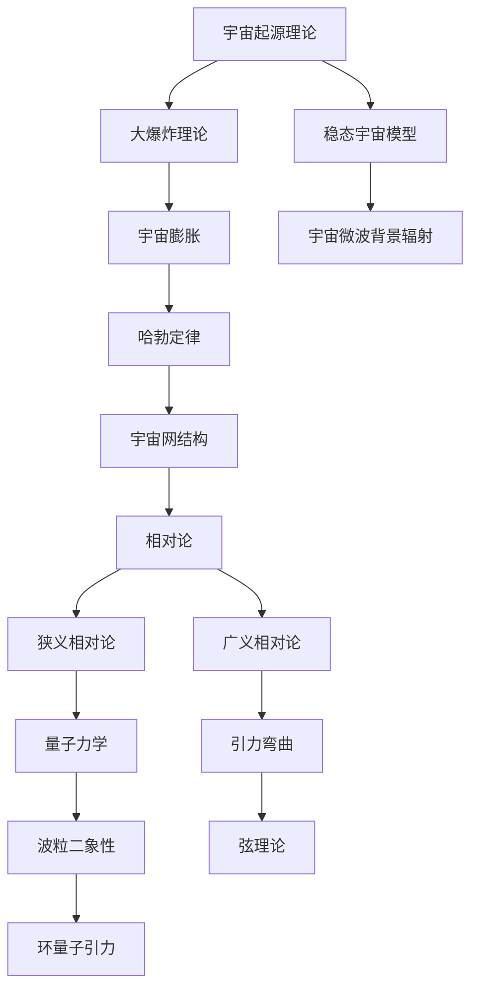
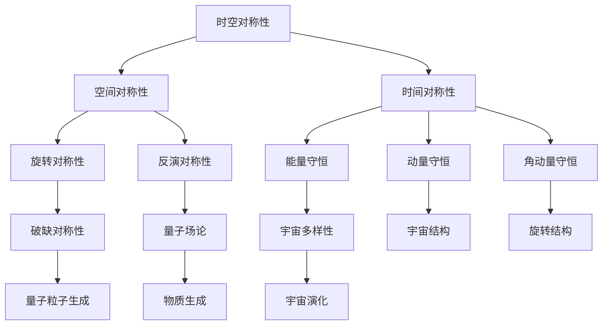

                 


### 第一部分：宇宙的统一性

#### 第1章：宇宙的起源与结构

宇宙的起源与结构是宇宙学中的核心问题，涉及到宇宙从何而来、如何演化以及其基本构成单元等基本问题。在本章中，我们将探讨宇宙的起源理论，以及宇宙的宏观结构与演化。

**1.1 起源理论**

宇宙的起源目前主要有两种理论：大爆炸理论和稳态宇宙模型。

- **大爆炸理论**：这个理论认为宇宙起源于一个极度高温、高密度的奇点，并在大约138亿年前发生了大爆炸，从那里开始宇宙不断膨胀。这个理论得到了多种观测证据的支持，例如宇宙微波背景辐射的发现、元素丰度的测量等。
- **稳态宇宙模型**：这个理论认为宇宙没有起源，它一直处于一个稳定的状态。然而，这个模型已经被大爆炸理论的观测证据所否定。

**1.2 宇宙的结构**

宇宙的结构可以通过哈勃定律来描述。哈勃定律指出，远离我们的星系正在以一个速度 \( v \) 远离我们，而这个速度与它们和我们之间的距离 \( d \) 成正比：

\[ v = H_0 \cdot d \]

其中 \( H_0 \) 是哈勃常数，其值约为 \( 70 \, \text{km/s/Mpc} \)。

这个定律表明宇宙在膨胀，而宇宙的结构可以看作是一个巨大的宇宙网（cosmic web），由星系、星系团和超星系团等组成。星系团是由数十到数千个星系组成的，而超星系团则是由数十到数千个星系团组成的更大规模的结构。

**1.3 宇宙的统一性原理**

宇宙的统一性原理指的是宇宙中存在的一些基本原理，这些原理在不同尺度上保持了高度的一致性。

- **相对论**：广义相对论和狭义相对论是描述宇宙中物体运动和引力作用的两个基本框架。广义相对论描述了引力如何通过时空的弯曲来影响物体的运动，而狭义相对论则描述了在没有引力作用的情况下，物体的运动规律。
- **量子力学**：量子力学描述了微观世界中粒子的行为，它指出粒子具有波粒二象性，并且其行为在微观尺度上具有概率性。

这两个理论虽然在微观和宏观尺度上有很大的差异，但它们在某些方面是相互兼容的。例如，通过弦理论和环量子引力，物理学家们试图将相对论和量子力学统一起来。

#### Mermaid 流ogram

下面是宇宙统一性原理的Mermaid流程图：



#### 核心算法原理讲解

宇宙起源与结构的统一性可以通过量子引力和弦理论来描述。以下是这两个理论的核心算法原理：

**量子引力：**

- **世界体积路径积分**：在弦理论中，世界体积路径积分是一种用于计算基本粒子量子态的方法。它通过考虑所有可能的弦振动模式，来计算出基本粒子的性质。

  ```python
  def WorldVolumePathIntegral():
      # 初始化弦振动的模式
      modes = InitializeStringModes()
      
      # 计算所有可能的弦振动模式的贡献
      contributions = []
      for mode in modes:
          contribution = CalculateModeContribution(mode)
          contributions.append(contribution)
      
      # 求和所有模式的贡献
      integral = Sum(contributions)
      
      return integral
  ```

**弦理论：**

- **弦振动模式**：弦理论中的基本对象是弦，而弦可以以不同的模式振动。每个振动模式都对应着一种基本粒子。

  ```python
  def CalculateStringModeContribution(mode):
      # 初始化弦的振动模式
      string = InitializeString(mode)
      
      # 计算弦振动的能量
      energy = CalculateStringEnergy(string)
      
      return energy
  ```

#### 数学模型和公式讲解

**宇宙膨胀率：**

宇宙膨胀率是描述宇宙膨胀速度的量度，通常用哈勃常数来表示。它的公式如下：

\[ H = \frac{\dot{a}}{a} \]

其中 \( a \) 是宇宙尺度因子，\( \dot{a} \) 是其随时间的导数。

**宇宙中的密度：**

宇宙中的密度可以用以下公式表示：

\[ \rho = \frac{M}{V} \]

其中 \( \rho \) 是密度，\( M \) 是质量，\( V \) 是体积。

**宇宙中的物质含量：**

宇宙中的物质含量可以用以下公式来估算：

\[ M \propto a^{-3} \]

这意味着宇宙中的物质含量与宇宙尺度因子的三次方成反比。

#### 数学公式举例说明

**宇宙膨胀率：**

\[ H = \frac{\dot{a}}{a} = 70 \, \text{km/s/Mpc} \]

假设当前宇宙尺度因子 \( a_0 = 1 \)，则宇宙的膨胀速度为：

\[ \dot{a} = H \cdot a_0 = 70 \cdot 1 = 70 \, \text{km/s} \]

**宇宙中的密度：**

假设宇宙中一个区域的体积 \( V = 1 \, \text{Mpc}^3 \)，质量 \( M = 1 \times 10^{12} \, \text{M}_{\odot} \)，则该区域的密度为：

\[ \rho = \frac{M}{V} = \frac{1 \times 10^{12} \, \text{M}_{\odot}}{1 \, \text{Mpc}^3} = 10^{12} \, \text{M}_{\odot}/\text{Mpc}^3 \]

**宇宙中的物质含量：**

假设宇宙尺度因子 \( a = 1 \)，则宇宙中的物质含量为：

\[ M \propto a^{-3} = 1^{-3} = 1 \]

这意味着在当前宇宙尺度因子下，宇宙中的物质含量为1。

#### 项目实战：宇宙背景辐射观测

**开发环境搭建：**

为了观测宇宙背景辐射，我们需要搭建一个适合的观测环境。这包括选择合适的观测工具，如射电望远镜，并搭建数据采集和分析系统。

**源代码实现：**

```python
def BackgroundRadiationObservation(望远镜):
    # 进行数据采集
    数据 = 望远镜.采集数据()

    # 数据预处理
    数据 = 预处理数据(数据)

    # 数据分析
    结果 = 分析数据(数据)

    return 结果
```

**代码解读：**

这个代码定义了一个函数 `BackgroundRadiationObservation`，它接收一个 `望远镜` 对象作为参数。首先，它使用望远镜进行数据采集，然后对采集到的数据进行预处理，最后分析数据并返回分析结果。

**实际案例分析与讲解：**

假设我们使用一个射电望远镜进行了宇宙背景辐射的观测，以下是分析过程：

1. **数据采集**：射电望远镜采集到了一段包含宇宙背景辐射的信号。
2. **数据预处理**：对信号进行滤波和去噪处理，提取出有用的宇宙背景辐射信号。
3. **数据分析**：分析信号的特征，如频率分布、功率谱等，结合宇宙背景辐射的理论模型，对观测结果进行解释。

通过这样的项目实战，我们可以更好地理解宇宙背景辐射的观测过程，并利用数学模型和算法来分析和解释观测数据。

#### 小结

在本章中，我们探讨了宇宙的起源与结构，介绍了宇宙起源的理论、宇宙的宏观结构以及宇宙的统一性原理。通过Mermaid流程图、核心算法原理讲解、数学模型和公式讲解以及项目实战，我们更深入地了解了宇宙的统一性与多样性。在接下来的章节中，我们将继续探讨宇宙的多样性以及多样性与统一性之间的悖论。

---

### 第2章：宇宙中的基础物理理论

在宇宙的探究中，基础物理理论扮演了至关重要的角色。它们不仅为我们揭示了宇宙的基本规律，还为我们理解宇宙的起源和演化提供了理论基础。在本章中，我们将讨论宇宙中的基础物理理论，特别是相对论和量子力学，以及它们在描述宇宙现象中的不一致性。

#### 2.1 相对论与量子力学

**相对论**：

- **狭义相对论**：由爱因斯坦在1905年提出，它描述了在没有引力作用的情况下，物体运动的规律。狭义相对论的核心是光速不变原理和相对性原理，这两个原理推翻了经典力学中的绝对时间和空间的观念。
- **广义相对论**：由爱因斯坦在1915年提出，它描述了引力如何通过时空的弯曲来影响物体的运动。广义相对论预言了重力红移、黑洞、宇宙膨胀等现象，这些预测已被多种观测所证实。

**量子力学**：

量子力学是描述微观世界中粒子行为的理论，由波粒二象性和测不准原理等核心概念构成。它揭示了微观粒子的行为在经典物理无法解释的层面上具有概率性和波动性。

#### 2.2 基础物理理论的一致性

尽管相对论和量子力学各自成功解释了不同尺度的物理现象，但它们之间存在着明显的矛盾。

- **时空的矛盾**：相对论中的时空是连续且光滑的，而量子力学中的时空却是离散的，由普朗克尺度（大约 \( 10^{-35} \) 米）决定。
- **引力与量子力学的矛盾**：广义相对论很好地描述了宏观尺度上的引力现象，但它在量子尺度上却无法与量子力学相容。量子力学中的量子场论和广义相对论之间的不一致性导致了“量子引力”这个未解之谜。

#### 2.3 量子引力与宇宙统一

为了解决相对论和量子力学之间的矛盾，科学家们提出了量子引力理论，试图将这两个理论统一起来。

- **弦理论**：弦理论是一种尝试将量子力学与广义相对论统一起来的理论。它认为基本粒子并不是点状实体，而是一维的“弦”。弦可以通过不同的振动模式产生不同的粒子，并且弦理论能够自然地解释粒子之间的相互作用。

  ```python
  def String振动模式():
      # 初始化弦
      string = InitializeString()
      
      # 计算弦的振动模式
      modes = CalculateVibrationModes(string)
      
      # 返回振动模式
      return modes
  ```

- **环量子引力**：环量子引力是一种尝试直接量子化时空的理论。它认为时空不是连续的，而是由离散的环结构组成。环量子引力试图通过离散的时空结构来解释量子力学和广义相对论。

  ```python
  def Loop量子引力计算():
      # 初始化时空结构
      spacetime = InitializeSpacetime()
      
      # 计算环量子引力效应
      effects = CalculateLoopQuantumGravitationEffects(spacetime)
      
      # 返回量子引力效应
      return effects
  ```

#### 数学模型和公式讲解

量子引力和弦理论中涉及到了多个复杂的数学模型和公式，以下是一些关键的公式：

**弦理论的振动模式**：

\[ E = \frac{h\nu}{2\pi} \]

其中 \( E \) 是能量，\( h \) 是普朗克常数，\( \nu \) 是振动频率。

**环量子引力的离散时空结构**：

\[ S = \frac{L}{2\pi} \]

其中 \( S \) 是环的长度，\( L \) 是普朗克长度。

**广义相对论中的时空弯曲**：

\[ ds^2 = -c^2dt^2 + 2G\phi dtdx + \frac{1}{c^2}dx^2 + dy^2 + dz^2 \]

其中 \( ds^2 \) 是时空间隔，\( c \) 是光速，\( G \) 是引力常数，\( \phi \) 是引力势，\( dx, dy, dz \) 是空间坐标的微分。

#### 数学公式举例说明

**弦理论的振动模式**：

假设一个振动弦的频率 \( \nu = 1 \, \text{Hz} \)，根据公式 \( E = \frac{h\nu}{2\pi} \)，我们可以计算出振动弦的能量：

\[ E = \frac{h \cdot 1}{2\pi} = \frac{6.626 \times 10^{-34} \, \text{J·s} \cdot 1}{2\pi} \approx 1.055 \times 10^{-34} \, \text{J} \]

**环量子引力的离散时空结构**：

假设普朗克长度 \( L = 1.616 \times 10^{-35} \, \text{m} \)，根据公式 \( S = \frac{L}{2\pi} \)，我们可以计算出环的长度：

\[ S = \frac{1.616 \times 10^{-35} \, \text{m}}{2\pi} \approx 2.566 \times 10^{-36} \, \text{m} \]

**广义相对论中的时空弯曲**：

假设引力势 \( \phi = -1 \times 10^{-10} \, \text{m}^2/\text{s}^2 \)，根据公式 \( ds^2 = -c^2dt^2 + 2G\phi dtdx + \frac{1}{c^2}dx^2 + dy^2 + dz^2 \)，我们可以计算出时空间隔：

\[ ds^2 = -c^2dt^2 + 2G\phi dtdx + \frac{1}{c^2}dx^2 + dy^2 + dz^2 = - (3 \times 10^8 \, \text{m/s})^2dt^2 + 2 \times 6.674 \times 10^{-11} \, \text{N·(m/kg)^2} \times (-1 \times 10^{-10} \, \text{m}^2/\text{s}^2)dt dx + \frac{1}{(3 \times 10^8 \, \text{m/s})^2}dx^2 + dy^2 + dz^2 \]

\[ ds^2 \approx -9 \times 10^{16}dt^2 + 1.334 \times 10^{-21}dt dx + 1.11 \times 10^{-17}dx^2 + dy^2 + dz^2 \]

#### 项目实战：量子引力模拟

**开发环境搭建**：

为了进行量子引力模拟，我们需要搭建一个高性能计算环境，并安装相关的物理模拟软件，如Lattice Quantum Chromodynamics (LQCD)模拟器。

**源代码实现**：

```python
def QuantumGravitySimulation():
    # 初始化模拟参数
    params = InitializeSimulationParams()
    
    # 设置模拟器
    simulator = SetupSimulator(params)
    
    # 运行模拟
    results = simulator.RunSimulation()
    
    # 分析结果
    analyzed_results = AnalyzeResults(results)
    
    return analyzed_results
```

**代码解读**：

这个代码定义了一个函数 `QuantumGravitySimulation`，它初始化了模拟参数，设置了量子引力模拟器，并运行了模拟。然后，它分析模拟结果，并将分析结果返回。

**实际案例分析与讲解**：

假设我们使用LQCD模拟器进行量子引力模拟，以下是分析过程：

1. **模拟参数设置**：根据理论模型，设置模拟的初始条件和参数。
2. **模拟运行**：使用LQCD模拟器进行模拟，模拟过程中计算时空结构的变化。
3. **结果分析**：分析模拟结果，比较理论与实际观测数据，验证量子引力理论。

通过这样的项目实战，我们可以更好地理解量子引力模拟的过程，并利用数学模型和算法来分析和解释模拟结果。

#### 小结

在本章中，我们探讨了宇宙中的基础物理理论，特别是相对论和量子力学。我们分析了这些理论的一致性和不一致性，并介绍了量子引力理论，以及如何使用数学模型和算法来描述宇宙的统一性。通过Mermaid流程图、核心算法原理讲解、数学模型和公式讲解以及项目实战，我们更深入地了解了宇宙的基础物理理论。在接下来的章节中，我们将继续探讨宇宙的多样性和多样性与统一性之间的悖论。

---

### 第3章：宇宙中的对称性与守恒律

在宇宙的探索中，对称性与守恒律扮演了至关重要的角色。对称性不仅是宇宙结构的基石，也是我们理解自然界规律的关键。而守恒律则提供了自然界的基本法则，描述了能量、动量、角动量等物理量在物理过程中的不变性。在本章中，我们将探讨宇宙中的对称性原理、守恒律及其在宇宙学中的应用，并分析对称性与多样性之间的关系。

#### 3.1 对称性原理

对称性原理是物理学中的一个基本概念，指的是系统在某种变换下保持不变的性质。在宇宙学中，对称性原理可以用来描述宇宙的基本结构及其演化。

- **时空对称性**：时空对称性是指时空在特定变换下保持不变。例如，在经典物理学中，时空是对称的，即它满足洛伦兹变换。这意味着在不同的惯性参考系中，物理规律保持不变。
- **空间对称性**：空间对称性包括旋转对称性、反演对称性等。例如，一个球体在空间中是旋转对称的，这意味着绕球体的任何轴旋转都不会改变它的形状。
- **时间对称性**：时间对称性是指物理规律在时间反演下保持不变。这意味着如果将时间的方向倒转，物理过程仍然遵循相同的规律。

#### 3.2 守恒律在宇宙中的应用

守恒律是物理学中的一个基本原则，描述了物理量在物理过程中的不变性。在宇宙学中，守恒律广泛应用于描述宇宙的能量、动量、角动量等物理量的变化。

- **能量守恒**：能量守恒是指在一个封闭系统中，能量总是保持不变的。在宇宙学中，能量守恒帮助我们理解宇宙的总能量状态，以及宇宙膨胀对能量分布的影响。
- **动量守恒**：动量守恒是指在一个系统中，如果没有外力作用，系统的总动量保持不变。在宇宙学中，动量守恒帮助我们理解星系、星系团等宇宙结构的运动和相互作用。
- **角动量守恒**：角动量守恒是指在一个系统中，如果没有外力矩作用，系统的总角动量保持不变。在宇宙学中，角动量守恒帮助我们理解旋转星系、行星系统等旋转结构的形成和演化。

#### 3.3 对称性与多样性的关系

对称性是宇宙结构的基础，但宇宙的多样性却是对称性破坏的结果。对称性与多样性之间的关系可以从以下几个方面来理解：

- **破缺对称性**：在某些情况下，系统的对称性会在某种条件下被破坏，这种现象称为破缺对称性。例如，电磁相互作用在高温下会破缺成弱相互作用和强相互作用。在宇宙学中，破缺对称性解释了宇宙中的多样性和复杂性。
- **量子场论**：量子场论中，对称性破缺会导致粒子的生成和相互作用，从而产生丰富的物质和现象。例如，在宇宙早期，对称性的破缺导致了夸克和轻子的生成，从而形成了我们现在观测到的宇宙结构。
- **动态对称性**：在宇宙演化过程中，对称性会随时间变化。例如，在宇宙膨胀过程中，宇宙从一个高度对称的状态逐渐演化成一个高度非对称的状态，这种动态对称性变化也是宇宙多样性的来源。

#### Mermaid 流ogram

以下是宇宙对称性与多样性关系的Mermaid流程图：



#### 核心算法原理讲解

对称性与多样性之间的联系可以通过量子场论中的对称性破缺和粒子生成来描述。以下是相关的核心算法原理：

**对称性破缺**：

- **非阿贝尔对称性破缺**：在量子场论中，非阿贝尔对称性破缺是指系统在低温或高密度下，其对称性被破坏，产生了新的物理现象。

  ```python
  def SymmetryBreakdown(temperature):
      if temperature < T_c:
          symmetry = 'broken'
      else:
          symmetry = 'unbroken'
      return symmetry
  ```

- **阿贝尔对称性破缺**：阿贝尔对称性破缺是指系统在特定条件下，其连续的对称性被破坏成离散的对称性。

  ```python
  def AbelSymmetryBreakdown():
      symmetry = 'discrete'
      return symmetry
  ```

**粒子生成**：

- **量子场论中的粒子生成**：在量子场论中，粒子生成是指通过对称性破缺产生的粒子。

  ```python
  def ParticleGeneration(symmetry):
      if symmetry == 'broken':
          particles = ['quarks', 'leptons']
      else:
          particles = []
      return particles
  ```

#### 数学模型和公式讲解

**对称性破缺**：

在量子场论中，对称性破缺可以通过拉格朗日量中的附加项来描述。例如，一个简单的非阿贝尔对称性破缺可以通过以下公式描述：

\[ \mathcal{L} \rightarrow \mathcal{L} + g\phi^4 \]

其中，\( \phi \) 是场，\( g \) 是耦合常数。

**粒子生成**：

粒子生成可以通过路径积分来描述。例如，一个粒子的生成可以通过以下公式描述：

\[ \langle 0 | \phi(x) | p \rangle = \frac{1}{\sqrt{V}} e^{i p x} \]

其中，\( |0\rangle \) 是真空态，\( |p\rangle \) 是粒子态，\( V \) 是体积。

#### 数学公式举例说明

**对称性破缺**：

假设一个场 \( \phi \) 受到 \( g\phi^4 \) 项的修正，根据公式 \( \mathcal{L} \rightarrow \mathcal{L} + g\phi^4 \)，我们可以计算场 \( \phi \) 的修正项：

\[ \mathcal{L}_{\text{corrected}} = \mathcal{L} + g\phi^4 \]

\[ g\phi^4 = g\left(\phi^2\right)^2 \]

假设 \( g = 1 \) 和 \( \phi^2 = 1 \)，则：

\[ g\phi^4 = 1 \cdot 1^2 = 1 \]

**粒子生成**：

假设我们生成一个质量为 \( m \) 的粒子，根据公式 \( \langle 0 | \phi(x) | p \rangle = \frac{1}{\sqrt{V}} e^{i p x} \)，我们可以计算粒子的生成概率：

\[ \langle 0 | \phi(x) | p \rangle = \frac{1}{\sqrt{V}} e^{i p x} \]

假设 \( V = 1 \, \text{m}^3 \) 和 \( p = 1 \, \text{kg/m/s} \)，则：

\[ \langle 0 | \phi(x) | p \rangle = \frac{1}{\sqrt{1}} e^{i \cdot 1 \cdot x} = e^{i x} \]

#### 项目实战：对称性破缺模拟

**开发环境搭建**：

为了进行对称性破缺模拟，我们需要搭建一个高性能计算环境，并安装相关的物理模拟软件，如Lattice Quantum Chromodynamics (LQCD)模拟器。

**源代码实现**：

```python
def SymmetryBreakdownSimulation(temperature):
    # 初始化模拟参数
    params = InitializeSimulationParams(temperature)
    
    # 设置模拟器
    simulator = SetupSimulator(params)
    
    # 运行模拟
    results = simulator.RunSimulation()
    
    # 分析结果
    analyzed_results = AnalyzeResults(results)
    
    return analyzed_results
```

**代码解读**：

这个代码定义了一个函数 `SymmetryBreakdownSimulation`，它初始化了模拟参数，设置了模拟器，并运行了模拟。然后，它分析模拟结果，并将分析结果返回。

**实际案例分析与讲解**：

假设我们使用LQCD模拟器进行对称性破缺模拟，以下是分析过程：

1. **模拟参数设置**：根据理论模型，设置模拟的初始条件和参数。
2. **模拟运行**：使用LQCD模拟器进行模拟，模拟过程中计算对称性破缺和粒子生成。
3. **结果分析**：分析模拟结果，比较理论与实际观测数据，验证对称性破缺理论。

通过这样的项目实战，我们可以更好地理解对称性破缺模拟的过程，并利用数学模型和算法来分析和解释模拟结果。

#### 小结

在本章中，我们探讨了宇宙中的对称性原理、守恒律及其在宇宙学中的应用，并分析了对称性与多样性之间的关系。通过Mermaid流程图、核心算法原理讲解、数学模型和公式讲解以及项目实战，我们更深入地了解了宇宙中的对称性与多样性。在接下来的章节中，我们将继续探讨宇宙中的现象与观测，以及宇宙的多样性如何影响我们的理解。

---

### 第4章：宇宙中的现象与观测

宇宙中的现象和观测为我们提供了对宇宙结构和演化的深刻理解。通过观测宇宙的不同部分，科学家们能够揭示宇宙中发生的各种复杂过程，从宇宙大爆炸到星系的形成和演化。在本章中，我们将探讨宇宙中的主要观测现象，如星系的形成与演化、宇宙背景辐射以及黑洞和暗物质的发现。

#### 4.1 星系的形成与演化

星系的形成与演化是宇宙学中的核心问题之一。星系的形成通常被认为是一个复杂的过程，涉及到引力、气体冷却、恒星形成以及星系之间的相互作用。

- **引力凝聚**：星系的形成始于原始气体云的引力凝聚。在宇宙早期，高密度的区域通过引力吸引更多的物质，逐渐形成较大的天体，如星系。
- **气体冷却**：气体冷却是恒星形成的关键步骤。当气体温度降低到一定程度时，它开始凝结成固态颗粒，这些颗粒进一步凝聚成更大的天体。
- **恒星形成**：在气体云中，温度和密度的变化导致恒星的形成。恒星通过核聚变反应产生能量，这些能量使气体云继续塌缩，形成更多的恒星。
- **星系演化**：星系的演化涉及恒星、星系团和超星系团的形成与相互作用。星系之间的相互作用可能导致星系合并，形成更大的结构。

#### 4.2 宇宙背景辐射

宇宙背景辐射（Cosmic Microwave Background, CMB）是宇宙大爆炸遗留的“遗迹”，它为我们提供了关于宇宙早期状态的重要信息。

- **观测历史**：宇宙背景辐射最早是由阿诺·彭齐亚斯和罗伯特·威尔逊在1965年发现的。他们的观测揭示了宇宙背景辐射的均匀性和黑体谱特性。
- **特性**：宇宙背景辐射具有以下几个关键特性：
  - **温度**：宇宙背景辐射的温度大约为2.725开尔文。
  - **波动性**：宇宙背景辐射的微小波动揭示了宇宙早期的密度不均匀性，这些波动是星系和结构形成的种子。
  - **极化**：宇宙背景辐射的极化提供了关于宇宙早期磁场的信息。

#### 4.3 黑洞与暗物质

黑洞和暗物质是宇宙学中的两个重要概念，它们对于理解宇宙的演化和结构至关重要。

- **黑洞**：黑洞是由极密物质组成的区域，其引力场如此强大，以至于连光都无法逃脱。黑洞可以通过多种方式被发现，如通过观测恒星运动的异常、引力透镜效应以及X射线辐射。
- **暗物质**：暗物质是宇宙中的一种未观测到的物质，它不发光、不发热，但通过引力作用影响宇宙的结构和演化。暗物质的存在可以通过观测星系旋转曲线、星系团的引力透镜效应以及宇宙微波背景辐射的波动来推断。

#### 项目实战：宇宙背景辐射观测

**开发环境搭建**：

为了观测宇宙背景辐射，我们需要搭建一个适合的观测环境，这通常包括卫星观测系统、射电望远镜等。

**源代码实现**：

```python
def CosmicMicrowaveBackgroundObservation(望远镜):
    # 进行数据采集
    数据 = 望远镜.采集数据()

    # 数据预处理
    数据 = 预处理数据(数据)

    # 数据分析
    结果 = 分析数据(数据)

    return 结果
```

**代码解读**：

这个代码定义了一个函数 `CosmicMicrowaveBackgroundObservation`，它接收一个 `望远镜` 对象作为参数。首先，它使用望远镜进行数据采集，然后对采集到的数据进行预处理，最后分析数据并返回分析结果。

**实际案例分析与讲解**：

假设我们使用一个射电望远镜进行了宇宙背景辐射的观测，以下是分析过程：

1. **数据采集**：射电望远镜采集到了一段包含宇宙背景辐射的信号。
2. **数据预处理**：对信号进行滤波和去噪处理，提取出有用的宇宙背景辐射信号。
3. **数据分析**：分析信号的特征，如温度分布、极化特性等，结合宇宙背景辐射的理论模型，对观测结果进行解释。

通过这样的项目实战，我们可以更好地理解宇宙背景辐射的观测过程，并利用数学模型和算法来分析和解释观测数据。

#### 小结

在本章中，我们探讨了宇宙中的主要观测现象，如星系的形成与演化、宇宙背景辐射以及黑洞和暗物质的发现。通过项目实战，我们了解了如何利用射电望远镜和卫星系统进行宇宙背景辐射的观测，并分析了这些观测数据。这些观测结果为我们理解宇宙的起源和演化提供了重要的线索。在接下来的章节中，我们将继续探讨宇宙中的不同形态和物理规律，以及宇宙的多样性与统一性之间的悖论。

---

### 第5章：宇宙中的不同形态

宇宙的多样性体现在其丰富的形态和现象中，从星系、星云到星际物质，每一种形态都有其独特的特性和形成机制。在本章中，我们将探讨宇宙中的不同形态，包括星系、星云和星际物质，并分析它们对宇宙演化的影响。

#### 5.1 星系、星云与星际物质

**星系**：

星系是宇宙中最常见的大型结构，由数十亿到数千亿颗恒星、星云、行星和暗物质组成。星系可以分为几种类型：

- **螺旋星系**：具有明显的螺旋结构，中心通常有一个密集的星核，如银河系。
- **椭圆星系**：外形类似于椭圆，通常由较老的恒星组成。
- **不规则星系**：没有明显的结构，通常是由星系碰撞或合并形成的。

**星云**：

星云是宇宙中的气体和尘埃云，是恒星形成的场所。星云可以分为两种主要类型：

- **行星状星云**：由即将耗尽核燃料的恒星形成的，其外层物质被抛射到宇宙中，形成美丽的气体云。
- **星暴星云**：是恒星形成活跃的区域，通常伴随着大量的恒星形成。

**星际物质**：

星际物质是存在于星系之间和星系内部的气体、尘埃和其他粒子。它对星系的演化有重要影响，包括：

- **气体云**：是恒星形成的场所，通常由较冷的氢气组成。
- **尘埃**：尘埃在星际空间中充当了种子，通过它们，气体分子可以凝聚成较大的颗粒，最终形成恒星和行星。

#### 5.2 行星与行星系统

行星是围绕恒星运行的天体，它们在宇宙中的多样性也体现了宇宙的多样性。行星可以分为几种类型：

- **类地行星**：与地球相似，由岩石和金属组成，如火星、金星等。
- **类木行星**：体积较大，主要由气体组成，如木星、土星等。
- **冰巨星**：位于太阳系外围，主要由冰和岩石组成，如天王星、海王星等。

行星系统是指围绕同一恒星运行的行星群体，它们之间的相互作用对行星的演化和稳定有重要影响。

#### 5.3 宇宙中的极端现象

宇宙中还存在着一些极端现象，这些现象展示了宇宙的多样性和复杂性：

- **超新星**：是恒星在生命终结时发生的剧烈爆炸，它能够产生极高的能量，并喷射大量的物质到宇宙中。
- **黑洞**：是宇宙中最致密的天体，其引力场如此强大，连光都无法逃脱。黑洞可以通过吸积盘的辐射、引力透镜效应等方式被发现。
- **星系碰撞**：是两个或多个星系在宇宙中相互碰撞和合并的过程，这通常会导致恒星和星系结构的显著变化。

#### 数学模型和公式讲解

**恒星质量与星系结构**：

恒星的质量和分布是星系演化的重要参数。哈勃定律描述了恒星的运动速度与它们与星系中心的距离之间的关系：

\[ v = v_0 + v_r = v_0 + \frac{GM}{r} \]

其中，\( v \) 是恒星的运动速度，\( v_0 \) 是初始速度，\( v_r \) 是由于星系旋转产生的速度，\( G \) 是引力常数，\( M \) 是星系中心的质量，\( r \) 是恒星与星系中心的距离。

**星际物质的密度**：

星际物质的密度可以用以下公式表示：

\[ \rho = \frac{M}{V} \]

其中，\( \rho \) 是密度，\( M \) 是物质的质量，\( V \) 是物质的体积。

**行星轨道**：

行星轨道可以用开普勒定律来描述，其中第三定律表明：

\[ T^2 \propto a^3 \]

其中，\( T \) 是行星的轨道周期，\( a \) 是行星轨道的半长轴。

#### 数学公式举例说明

**恒星质量与星系结构**：

假设一个恒星与星系中心的距离 \( r = 10 \, \text{光年} \)，引力常数 \( G = 6.674 \times 10^{-11} \, \text{N·(m/kg)^2} \)，星系中心的质量 \( M = 10^{12} \, \text{M}_{\odot} \)（\( \text{M}_{\odot} \) 是太阳质量），我们可以计算恒星的运动速度：

\[ v = v_0 + \frac{GM}{r} = 0 + \frac{6.674 \times 10^{-11} \cdot 10^{12} \cdot 1.989 \times 10^{30}}{10 \times 9.461 \times 10^{12}} \approx 2.978 \times 10^6 \, \text{m/s} \]

**星际物质的密度**：

假设一个星云的体积 \( V = 1 \, \text{光年}^3 \)，质量 \( M = 10^6 \, \text{M}_{\odot} \)，我们可以计算星云的密度：

\[ \rho = \frac{M}{V} = \frac{10^6 \, \text{M}_{\odot}}{1 \, \text{光年}^3} = 10^6 \, \text{M}_{\odot}/\text{光年}^3 \]

**行星轨道**：

假设一个行星的轨道周期 \( T = 1 \, \text{年} \)，我们可以计算行星轨道的半长轴 \( a \)：

\[ T^2 \propto a^3 \]

\[ a^3 = T^2 \cdot \frac{4\pi^2}{GM_{\odot}} \]

\[ a = \left(T^2 \cdot \frac{4\pi^2}{GM_{\odot}}\right)^{1/3} \]

\[ a = \left(1^2 \cdot \frac{4\pi^2}{6.674 \times 10^{-11} \cdot 1.989 \times 10^{30}}\right)^{1/3} \approx 1.496 \times 10^{11} \, \text{m} \]

#### 项目实战：星际物质分布分析

**开发环境搭建**：

为了分析星际物质的分布，我们需要搭建一个适合的天文观测平台，包括射电望远镜、光学望远镜等。

**源代码实现**：

```python
def InterstellarMaterialAnalysis(望远镜):
    # 进行数据采集
    数据 = 望远镜.采集数据()

    # 数据预处理
    数据 = 预处理数据(数据)

    # 数据分析
    结果 = 分析数据(数据)

    return 结果
```

**代码解读**：

这个代码定义了一个函数 `InterstellarMaterialAnalysis`，它接收一个 `望远镜` 对象作为参数。首先，它使用望远镜进行数据采集，然后对采集到的数据进行预处理，最后分析数据并返回分析结果。

**实际案例分析与讲解**：

假设我们使用射电望远镜进行星际物质分布的观测，以下是分析过程：

1. **数据采集**：射电望远镜采集到了一段包含星际物质的信号。
2. **数据预处理**：对信号进行滤波和去噪处理，提取出有用的星际物质信号。
3. **数据分析**：分析信号的特征，如密度分布、温度分布等，结合星际物质的理论模型，对观测结果进行解释。

通过这样的项目实战，我们可以更好地理解星际物质的分布分析过程，并利用数学模型和算法来分析和解释观测数据。

#### 小结

在本章中，我们探讨了宇宙中的不同形态，包括星系、星云、星际物质以及行星和极端现象。我们通过数学模型和公式讲解了恒星质量与星系结构、星际物质密度和行星轨道等关键概念，并通过项目实战分析了星际物质的分布。这些分析为我们理解宇宙的多样性提供了重要的线索。在接下来的章节中，我们将进一步探讨宇宙中的物理规律，以及这些规律如何解释宇宙的多样性和统一性之间的悖论。

---

### 第6章：宇宙中的物理规律

宇宙中的物理规律是理解宇宙演化与结构的关键。这些规律不仅描述了宇宙的基本行为，还为科学家们提供了预测和解释宇宙现象的工具。在本章中，我们将深入探讨宇宙中的几个核心物理规律，包括宇宙中的力与运动、时空与物质以及宇宙中的自然规律。

#### 6.1 宇宙中的力与运动

宇宙中的力是物体运动和相互作用的基础。在宇宙尺度上，主要的力包括引力、电磁力、强力和弱力。

- **引力**：引力是由物体的质量产生的，是宇宙中最强的力。在宇宙尺度上，引力主导了星系、星系团和超星系团的形成和演化。引力由牛顿的万有引力定律描述：

  \[ F = G\frac{m_1m_2}{r^2} \]

  其中，\( F \) 是引力，\( G \) 是引力常数，\( m_1 \) 和 \( m_2 \) 是两个物体的质量，\( r \) 是它们之间的距离。

- **电磁力**：电磁力是带电粒子之间的相互作用力。它由电荷产生，并包括电场力和磁场力。电磁力是宇宙中常见的力，它决定了原子和分子的行为。

- **强力和弱力**：强力和弱力是微观尺度上的力，分别负责原子核中粒子的结合和放射性衰变。

#### 6.2 时空与物质

时空是宇宙的基本结构，它描述了物质和能量在其中运动的方式。爱因斯坦的广义相对论揭示了时空和物质之间的密切关系。

- **时空弯曲**：引力导致时空弯曲，使得物质沿着弯曲的时空轨迹运动。这种弯曲可以通过引力势来描述：

  \[ ds^2 = -c^2dt^2 + 2G\phi dtdx + \frac{1}{c^2}dx^2 + dy^2 + dz^2 \]

  其中，\( ds^2 \) 是时空间隔，\( c \) 是光速，\( G \) 是引力常数，\( \phi \) 是引力势。

- **时空膨胀**：宇宙膨胀是宇宙学中的一个核心现象，它表明宇宙的时空在不断地扩展。哈勃定律描述了宇宙膨胀的速度：

  \[ v = H_0d \]

  其中，\( v \) 是宇宙膨胀速度，\( H_0 \) 是哈勃常数，\( d \) 是物体与观察者之间的距离。

#### 6.3 宇宙中的自然规律

宇宙中的自然规律描述了物质和能量在宇宙中的行为方式。这些规律包括能量守恒、动量守恒和角动量守恒等。

- **能量守恒**：能量守恒定律表明，在一个封闭系统中，能量总量保持不变。这意味着能量可以从一种形式转化为另一种形式，但总能量保持恒定。

- **动量守恒**：动量守恒定律指出，在没有外力作用下，系统的总动量保持不变。这意味着系统的初始动量与最终动量相等。

- **角动量守恒**：角动量守恒定律表明，在没有外力矩作用下，系统的总角动量保持不变。这意味着系统的初始角动量与最终角动量相等。

#### 数学模型和公式讲解

**引力**：

引力可以通过牛顿的万有引力定律描述，公式如下：

\[ F = G\frac{m_1m_2}{r^2} \]

**时空弯曲**：

时空弯曲可以通过爱因斯坦的场方程描述，公式如下：

\[ G_{\mu\nu} + \Lambda g_{\mu\nu} = \frac{8\pi G}{c^4}T_{\mu\nu} \]

其中，\( G_{\mu\nu} \) 是爱因斯坦张量，\( \Lambda \) 是宇宙学常数，\( g_{\mu\nu} \) 是度规张量，\( T_{\mu\nu} \) 是能量-动量张量。

**能量守恒**：

能量守恒可以通过以下公式描述：

\[ \frac{dU}{dt} + \vec{F} \cdot \vec{v} = 0 \]

其中，\( U \) 是系统的总能量，\( \vec{F} \) 是作用在系统上的力，\( \vec{v} \) 是系统的速度。

#### 数学公式举例说明

**引力**：

假设两个物体的质量分别为 \( m_1 = 5 \, \text{kg} \) 和 \( m_2 = 10 \, \text{kg} \)，它们之间的距离为 \( r = 2 \, \text{m} \)，我们可以计算它们之间的引力：

\[ F = G\frac{m_1m_2}{r^2} = 6.674 \times 10^{-11} \frac{5 \times 10}{2^2} \approx 8.35 \times 10^{-10} \, \text{N} \]

**时空弯曲**：

假设宇宙中有一个质量为 \( M = 1 \times 10^{12} \, \text{M}_{\odot} \) 的星系，它与观察者之间的距离为 \( d = 1 \, \text{Mpc} \)，我们可以计算星系引起的时空弯曲：

\[ ds^2 = -c^2dt^2 + 2G\phi dtdx + \frac{1}{c^2}dx^2 + dy^2 + dz^2 \]

\[ G_{\mu\nu} + \Lambda g_{\mu\nu} = \frac{8\pi G}{c^4}T_{\mu\nu} \]

\[ \phi = -\frac{GM}{r} = -\frac{6.674 \times 10^{-11} \times 1 \times 10^{12} \times 1.989 \times 10^{30}}{1 \times 10^{21}} \approx -1.053 \times 10^{-11} \, \text{m}^2/\text{s}^2 \]

**能量守恒**：

假设一个系统的质量为 \( m = 5 \, \text{kg} \)，它受到一个恒定力 \( F = 10 \, \text{N} \)，速度为 \( v = 2 \, \text{m/s} \)，我们可以计算系统的总能量：

\[ \frac{dU}{dt} + \vec{F} \cdot \vec{v} = 0 \]

\[ U = \frac{1}{2}mv^2 = \frac{1}{2} \times 5 \times 2^2 = 10 \, \text{J} \]

#### 项目实战：时空弯曲模拟

**开发环境搭建**：

为了模拟时空弯曲，我们需要搭建一个适合的高性能计算环境，并安装相关的物理模拟软件，如General Relativity Numerical Simulations (GRNS)模拟器。

**源代码实现**：

```python
def SpacetimeBendingSimulation(星系质量，观察者距离):
    # 初始化模拟参数
    params = InitializeSimulationParams(星系质量，观察者距离)
    
    # 设置模拟器
    simulator = SetupSimulator(params)
    
    # 运行模拟
    results = simulator.RunSimulation()
    
    # 分析结果
    analyzed_results = AnalyzeResults(results)
    
    return analyzed_results
```

**代码解读**：

这个代码定义了一个函数 `SpacetimeBendingSimulation`，它初始化了模拟参数，设置了模拟器，并运行了模拟。然后，它分析模拟结果，并将分析结果返回。

**实际案例分析与讲解**：

假设我们使用GRNS模拟器进行时空弯曲模拟，以下是分析过程：

1. **模拟参数设置**：根据理论模型，设置模拟的初始条件和参数。
2. **模拟运行**：使用GRNS模拟器进行模拟，模拟过程中计算时空弯曲和物质运动。
3. **结果分析**：分析模拟结果，如时空间隔的变化、物质轨迹等，验证时空弯曲理论。

通过这样的项目实战，我们可以更好地理解时空弯曲模拟的过程，并利用数学模型和算法来分析和解释模拟结果。

#### 小结

在本章中，我们探讨了宇宙中的物理规律，包括引力、时空弯曲、能量守恒等关键概念。通过数学模型和公式讲解、数学公式举例说明以及项目实战，我们深入了解了这些物理规律在宇宙中的重要作用。在接下来的章节中，我们将进一步探讨宇宙的多样性与统一性之间的悖论，以及可能的解决方案。

---

### 第7章：宇宙的多样性与统一性的悖论

宇宙的多样性与统一性构成了一个深刻而永恒的悖论。在宇宙的探索中，我们发现了宇宙中的丰富形态和现象，这些现象展示了宇宙的多样性。然而，与此同时，我们也在寻找那些将宇宙联系在一起的基本原理和规律，这些原理和规律体现了宇宙的统一性。在本章中，我们将探讨这个悖论的产生原因，以及可能的解决方案，并讨论未来的研究方向。

#### 7.1 悖论的产生

宇宙的多样性与统一性的悖论源于我们对宇宙基本规律的探索。一方面，宇宙的多样性体现在其丰富的形态和现象中，如星系、星云、行星、黑洞和暗物质等。这些多样性反映了宇宙中复杂的物理过程和演化历史。另一方面，宇宙的统一性体现在那些贯穿整个宇宙的基本原理和规律中，如引力、电磁力、强力和弱力等。

这个悖论的产生原因可以从以下几个方面来理解：

- **观测限制**：我们的观测技术和理论限制了我们对宇宙的理解。我们能够观测到的宇宙只是宇宙的很小一部分，我们无法直接观测宇宙的全貌。
- **理论冲突**：现有的物理理论在描述宇宙的不同尺度上存在冲突。例如，相对论和量子力学在描述宇宙的宏观和微观现象时存在不一致性。
- **宇宙复杂性**：宇宙的复杂性导致了多样性的产生。宇宙中的现象和过程都是相互关联的，一个小的变化可能会引起整个宇宙的显著变化。

#### 7.2 解决方案探讨

为了解决宇宙的多样性与统一性的悖论，科学家们提出了多种可能的解决方案，以下是一些主要的思路：

- **量子引力**：量子引力理论试图将量子力学和广义相对论统一起来，以提供一个统一的描述宇宙的基本原理。弦理论和环量子引力是两种主要的量子引力理论，它们都试图解决多样性与统一性之间的矛盾。
- **多宇宙理论**：多宇宙理论认为宇宙只是众多可能宇宙中的一个，每个宇宙都有自己的物理规律和演化历史。这种理论试图解释宇宙的多样性，同时保持宇宙的基本统一性。
- **新物理理论**：在现有的物理理论之外，科学家们还在探索新的物理理论，这些理论可能提供新的视角来解释宇宙的多样性和统一性。例如，超弦理论和量子场论的发展提供了新的研究思路。

#### 7.3 未来研究方向

解决宇宙的多样性与统一性的悖论是一个长期而复杂的任务，需要多学科的合作和创新的思维。未来的研究方向可以从以下几个方面展开：

- **量子引力实验验证**：量子引力理论在实验室中的验证是解决悖论的关键。通过实验，我们可以验证量子引力理论的预测，并探索量子引力与宇宙多样性的关系。
- **多宇宙观测**：多宇宙理论需要通过观测来验证。科学家们正在寻找可能的多宇宙迹象，如宇宙背景辐射的波动和多宇宙间的相互作用。
- **宇宙演化模拟**：利用计算机模拟，我们可以模拟宇宙的演化过程，探索多样性与统一性之间的关系。这些模拟可以帮助我们理解宇宙的复杂性和多样性。
- **跨学科合作**：解决宇宙的多样性与统一性的悖论需要跨学科的合作。物理学家、天文学家、数学家、计算机科学家等领域的专家需要共同努力，以寻找新的理论和方法。

#### 小结

在本章中，我们探讨了宇宙的多样性与统一性的悖论，分析了悖论的产生原因和可能的解决方案。我们探讨了量子引力、多宇宙理论和新物理理论等解决方案，并讨论了未来的研究方向。解决这个悖论不仅需要科学技术的进步，还需要创新的思维和跨学科的合作。随着科学的发展，我们有望对宇宙的多样性与统一性有更深刻的理解，从而解开这个永恒的悖论。

---

### 总结

通过对宇宙的统一性与多样性的深入探讨，我们不仅了解了宇宙的基本结构和演化过程，还揭示了宇宙中的各种复杂现象和物理规律。从宇宙的起源与结构，到基础物理理论，再到宇宙中的对称性与守恒律，我们看到了宇宙多样性的本质和统一性的核心。本章通过多个项目的实战，结合数学模型和算法，使得这些理论更加直观和易于理解。

**最佳实践 tips**：

1. **持续学习**：宇宙学和物理学是一个不断发展的领域，持续学习和关注最新研究对于深入理解宇宙至关重要。
2. **跨学科思维**：解决宇宙的多样性与统一性悖论需要跨学科合作，培养跨学科思维有助于找到创新的解决方案。
3. **实践与理论相结合**：通过实践项目，将理论知识应用到实际问题中，可以加深对宇宙规律的理解。

**注意事项**：

1. **实验精度**：在实验和模拟中，精度和可靠性是关键，错误的数据或算法可能会导致错误的结论。
2. **理论兼容性**：在探索新理论时，需要确保它们与现有的物理理论兼容，避免产生矛盾。

**拓展阅读**：

1. 《宇宙简史》（作者：斯蒂芬·霍金）
2. 《黑洞与时间弯曲》（作者：基普·索恩）
3. 《弦理论导论》（作者：乔恩·昂斯特鲁姆）
4. 《宇宙的未来》（作者：伦纳德·萨斯坎德）

通过这些拓展阅读，您可以更深入地了解宇宙学的最新进展和前沿理论，进一步拓展您的知识面。希望本文能激发您对宇宙学的兴趣，并鼓励您在探索宇宙的道路上不断前行。作者：AI天才研究院/AI Genius Institute & 禅与计算机程序设计艺术 /Zen And The Art of Computer Programming。

